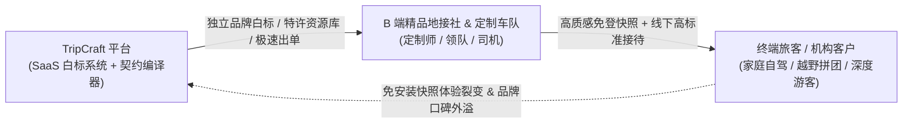
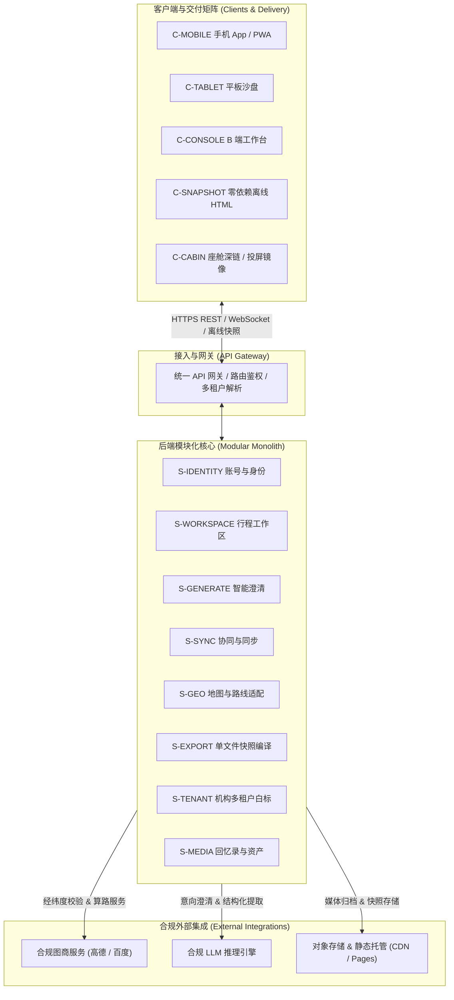

# TripCraft · 旅艺

> **面向自驾与深度游的智能旅行路书系统 —— 统一账号、多端协同、离线快照一等公民与 B 端白标 SaaS（产品与系统架构全案）**

[](LICENSE)
[](docs/delivery/DLV-01-roadmap-mvp.md)
[](spec/)
[-brightgreen.svg)](tools/)
[](https://trip-cts.pages.dev)

---

## 📖 关于 TripCraft (About)

**TripCraft（旅艺）** 是一套面向自驾与深度游场景的**智能旅行路书系统与数字化交付平台**。

项目并非单一的静态页面生成器或纯数据规范，而是以 **「本地优先（Local-First）多端 App 矩阵」** 与 **「免安装单文件离线快照（C-SNAPSHOT）」** 为双轮驱动形态，构建涵盖行前启发式澄清、行中弱网协同与座舱投递、行后回忆录资产沉淀的完整数字化旅行体验；同时面向川西、甘青等精品地接社与定制车队，提供具备独立品牌白标、私有特许资源库管理与客户隔离机制的 B2B2C 商业化外骨骼。

### 行业痛点与破局点

基于 [白皮书 §1 与 §2.1](docs/WHITEPAPER.md)，当前自驾与定制旅行交付存在四大结构性割裂：

| 场景阶段 | 传统方案缺陷与局限 | TripCraft 核心破局方案 | 方案依据 |
| :--- | :--- | :--- | :--- |
| **行前规划** | 攻略信息碎片化；同行人诉求难以结构化对齐；通用 LLM 严重存在虚构景点与闭馆踩坑（AI 幻觉）。 | **苏格拉底启发式澄清引擎**：多轮对齐硬约束；生成受 JSON Schema 严格校验的可行性路书。 | [`docs/08-socratic-interaction-design.md`](docs/08-socratic-interaction-design.md) |
| **行中交付** | 静态 PDF / 聊天长图无法自适应多端；高原弱网与无人区断网白屏；突发改道无法全员同步。 | **零依赖单文件高保真离线快照**与 **TripPatch 增量补丁**：极端弱网全量可用，秒级分发改道。 | [`docs/01-resilience-and-failover.md`](docs/01-resilience-and-failover.md) |
| **座舱交互** | 手机支架看导航存行车安全隐患；普通导航缺乏沿途深度人文展卡与服务区补给预警。 | **系统级座舱深链投递**：全天多途经点一键批量投递车载高德/百度原生地图；副驾屏展卡联动。 | [`docs/02-cockpit-protocol.md`](docs/02-cockpit-protocol.md) |
| **B 端履约** | 通用办公软件手写路书耗时 4–8 小时；无法沉淀私有线路情报；容易被公域平台抢客跳单。 | **B 端白标 SaaS 工作台**：20 分钟极速出单，支持专属域名、独立品牌、特许资源库与客户资产保护。 | [`docs/03-b2b-agency-operations.md`](docs/03-b2b-agency-operations.md) |

### B2B2C 价值流动模型

TripCraft 采用平台赋能机构、机构服务旅客、旅客口碑反哺平台的 B2B2C 飞轮体系：



---

## ✨ 核心特性与架构亮点

1. 📦 **单文件离线快照一等公民 (`C-SNAPSHOT`)**：
   - 将完整行程数据、CSS 主题样式、矢量地图与离线只读逻辑打包为单个自包含 HTML 文件，体积小巧、免安装、零第三方 npm 运行时依赖；
   - 在高海拔垭口、荒漠无人区等无信号极端环境下，依然保证毫秒级秒开与完整交互阅览。
2. 🚗 **座舱极简深链协议 (`C-CABIN`)**：
   - 杜绝在车机端强行安装第三方原生 APK，不与车机争夺算力与显示控制权；
   - 遵循合规图商官方协议，手机端一键唤起车载原生地图，批量下发全天途经点并由车机自主接管引导；副驾屏与后排屏自适应同步人文展卡。
3. 🤖 **苏格拉底防幻觉 AI 澄清 (`S-GENERATE`)**：
   - 行前拒绝单向吐出伪造路书，通过四层渐进式提问澄清成员偏好与硬约束；
   - 生成产物严格约束于 [`spec/trip.schema.json`](spec/trip.schema.json) 契约，未核实 POI 强制打标 `tentative`，杜绝 AI 编造假路线。
4. 🏢 **机构专属白标与特许资源库 (`S-TENANT` & `C-CONSOLE`)**：
   - 面向地接社与定制车队提供专属品牌定制（Logo、主色调、域名白标、防伪水印）；
   - 机构独家地面情报（小众机位、非公开路况、特色餐食）以特许资源库形式受行级权限保护（RLS），防止核心资产流失。
5. 🔄 **本地优先与点对点增量补丁 (`S-SYNC` & `TripPatch`)**：
   - 基于操作日志的 Local-First 架构，多端离线编辑、联网自动协商合并；
   - 行程突发变更（改道、塌方、封路）生成轻量 [`spec/patch.schema.json`](spec/patch.schema.json) 增量补丁，可通过蓝牙、局部局域网或面对面扫码全员秒级同步。

---

## 🏛️ 系统架构总览

系统采用多端协同 App 矩阵与离线交付快照统一解，后端核心服务遵循模块化单体（Modular Monolith）演进路线：



---

## 🛡️ 诚实能力边界

为保障行车安全、技术可信度与合规红线，TripCraft 恪守以下能力边界声明：

1. **不触发领航辅助 (NOA)，不碰线控底盘**：座舱交付严格止于向车载地图投递途经点坐标，后续引导完全由车载导航系统自主接管，不干预车辆行驶。
2. **不读取电池实时电量 (SOC)**：沿途补能策略仅依据公开车型能耗模型与用户输入的表显数据进行数学估算，非车端实时遥测。
3. **不支持车机原生第三方 APK**：车机端采用系统深链直调或手机投屏镜像交付，不侵占车机系统算力与运行内存。
4. **不自研底层地图与算路引擎**：所有地理编码与路线规划均接入高德、百度等合规持牌图商服务，严格遵守测绘与地理信息合规。
5. **不自营旅游产品与交易闭环**：平台作为数字化基础设施赋能小 B 从业者，不开展地接特许经营业务，不与入驻机构争夺终端客源。

> 历史勘误与能力边界更正详见 [`docs/ERRATA.md`](docs/ERRATA.md)。

---

## 📊 组件与工程状态

严格区分**设计状态**（草案 / 已评审 / 已验证）与**实现状态**（无 / 原型 / 已实现）。当前仓库已完成 Phase 2 完整架构包设计与数据契约固化，后续将按路线图启动原型开发：

| 组件 / 模块 | 所属层级 | 设计状态 | 实现状态 | 文档依据 |
| :--- | :--- | :--- | :--- | :--- |
| **`spec/` 数据契约** | 契约层 | 已验证 | **已实现** | [`spec/`](spec/)、[`docs/04-dsl-specification-v1.md`](docs/04-dsl-specification-v1.md) |
| **`tools/` 门禁工具链** | 工程基础设施 | 已验证 | **已实现** | [`tools/`](tools/)、[`package.json`](package.json) |
| **`examples/` 基准样例** | 数据基准 | 已验证 | **已实现** | [`examples/dunhuang-silkroad-9d/trip.json`](examples/dunhuang-silkroad-9d/trip.json) |
| **`S-EXPORT` 单文件打包器** | 编译器 | 已评审 | 原型 | [`docs/05-compiler-pipeline.md`](docs/05-compiler-pipeline.md) |
| **`C-SNAPSHOT` 离线运行时** | 运行时 | 已评审 | 原型 | [`docs/architecture/ARC-04-clients-channels.md`](docs/architecture/ARC-04-clients-channels.md) |
| **`C-CABIN` 座舱深链交付** | 客户端/交付 | 已评审 | 原型 | [`docs/02-cockpit-protocol.md`](docs/02-cockpit-protocol.md) |
| **`S-IDENTITY` 账号身份** | 后端服务 | 草案 | 规划中（阶段 1） | [`docs/architecture/ARC-05-backend-integrations.md`](docs/architecture/ARC-05-backend-integrations.md) |
| **`S-WORKSPACE` 行程工作区** | 后端服务 | 草案 | 规划中（阶段 1） | [`docs/architecture/ARC-02-domain-data-model.md`](docs/architecture/ARC-02-domain-data-model.md) |
| **`S-GENERATE` 智能澄清** | 后端服务 | 草案 | 规划中（阶段 1） | [`docs/08-socratic-interaction-design.md`](docs/08-socratic-interaction-design.md) |
| **`S-COLLAB` / `S-SYNC` 协作与同步**| 后端服务 | 草案 | 规划中（阶段 2） | [`docs/architecture/ARC-03-offline-sync.md`](docs/architecture/ARC-03-offline-sync.md) |
| **`S-TENANT` / `C-CONSOLE` 机构白标**| 后端/客户端 | 草案 | 规划中（阶段 1） | [`docs/architecture/ARC-06-multitenancy-whitelabel.md`](docs/architecture/ARC-06-multitenancy-whitelabel.md) |
| **`C-MOBILE` 跨端客户端** | 客户端 | 草案 | 规划中（阶段 1） | [`docs/architecture/adr/ADR-001-client-framework.md`](docs/architecture/adr/ADR-001-client-framework.md) |

---

## 🗺️ 演进路线图 (Roadmap)

详见 [`docs/delivery/DLV-01-roadmap-mvp.md`](docs/delivery/DLV-01-roadmap-mvp.md)：

1. **阶段 1：共用核心 + B 端白标最小闭环 (MVP)** —— 重点打通 3–5 家地接社出单与单文件离线快照；*明确非目标：不作自动冲突算法仲裁、二维码补丁同步与车机原生 APK*。
2. **阶段 2：多人协作与行中增量同步** —— 落地基于操作日志的 Local-First 多端协同与 TripPatch 增量分发；*明确非目标：不作公域拼团撮合与复杂外部资源调度*。
3. **阶段 3：B 端工作台完整化** —— 落地子账号权限、私有特许资源库管理与商业订阅计费；*明确非目标：不作金融借贷与大型旅游电商交易平台*。
4. **阶段 4：座舱深度协同与生态互联** —— 丰富车机厂商投屏协议与前装集成探索；*明确非目标：不碰车辆底层 CAN 总线与线控驾驶*。
5. **阶段 5：旅后回忆录与分销生态** —— 沉淀多媒体游记与口碑裂变分销；*明确非目标：不做公域 UGC 广场与内容公域化审核*。

---

## 📚 文档全景导航

完整架构体系涵盖产品 PRD、系统架构 ARC、交付规划 DLV 与执行全书：

- 📦 **产品设计包 (PRD)**：[`docs/product/README.md`](docs/product/README.md)
  - [PRD-01 愿景与定位](docs/product/PRD-01-vision-positioning.md) · [PRD-02 用户客群模型](docs/product/PRD-02-personas-segments.md) · [PRD-03 场景流程设计](docs/product/PRD-03-scenarios.md) · [PRD-04 功能架构规格](docs/product/PRD-04-functional-architecture.md) · [PRD-05 商业模式与商业化](docs/product/PRD-05-business-model.md)
- 🏗️ **系统架构包 (ARC)**：[`docs/architecture/README.md`](docs/architecture/README.md)
  - [ARC-01 系统总体架构](docs/architecture/ARC-01-overview.md) · [ARC-02 领域模型与数据](docs/architecture/ARC-02-domain-data-model.md) · [ARC-03 离线优先与同步](docs/architecture/ARC-03-offline-sync.md) · [ARC-04 客户端与交付渠道](docs/architecture/ARC-04-clients-channels.md) · [ARC-05 后端与系统集成](docs/architecture/ARC-05-backend-integrations.md) · [ARC-06 多租户与白标隔离](docs/architecture/ARC-06-multitenancy-whitelabel.md) · [ARC-07 安全隐私与合规](docs/architecture/ARC-07-security-privacy-compliance.md) · [ARC-08 NFR、部署与成本](docs/architecture/ARC-08-nfr-deployment-cost.md) · [ARC-09 架构决策索引](docs/architecture/ARC-09-adr-index.md)（含 [ADR-001 ~ ADR-008](docs/architecture/adr/)）
- 🚀 **交付与规划包 (DLV)**：[`docs/delivery/README.md`](docs/delivery/README.md)
  - [DLV-01 演进路线图与 MVP](docs/delivery/DLV-01-roadmap-mvp.md) · [DLV-02 风险登记册](docs/delivery/DLV-02-risk-register.md) · [DLV-03 全链路追溯矩阵](docs/delivery/DLV-03-traceability-matrix.md)
- 📜 **执行全书 (16章)**：[`docs/README.md`](docs/README.md)
  - 🎨 **设计轨**：[§8 澄清反问](docs/08-socratic-interaction-design.md) · [§9 视觉系统](docs/09-visual-design-system.md) · [§10 深度阅读](docs/10-roadbook-reading-design.md) · [§11 受众自适应](docs/11-audience-adaptive-rendering.md) · [§15 多设备协同](docs/15-multi-device-and-collaboration.md)
  - 💼 **商业轨**：[§3 B2B 运营](docs/03-b2b-agency-operations.md) · [§12 车厂合作](docs/12-oem-partnership-design.md) · [§13 地接社合作](docs/13-agency-partnership-design.md) · [§14 通用引擎扩展](docs/14-generic-engine-and-vertical-expansion.md)
  - ⚙️ **工程轨**：[§1 韧性与容灾](docs/01-resilience-and-failover.md) · [§2 座舱协议](docs/02-cockpit-protocol.md) · [§4 DSL 契约规范](docs/04-dsl-specification-v1.md) · [§5 编译器管线](docs/05-compiler-pipeline.md)
  - ⚖️ **支撑轨**：[§0 总纲与术语](docs/00-overview-and-glossary.md) · [§6 记忆日志引擎](docs/06-memory-journal-engine.md) · [§7 法律合规](docs/07-legal-and-compliance.md)
- 📘 **全景与基线文档**：[`docs/WHITEPAPER.md`](docs/WHITEPAPER.md)（架构全景白皮书） · [`docs/ASSUMPTIONS.md`](docs/ASSUMPTIONS.md)（商业与技术假设台账） · [`docs/ERRATA.md`](docs/ERRATA.md)（外部事实核查与更正记录）

---

## 🌐 标杆样例与在线演示

- **在线实战基准**：[trip-cts.pages.dev](https://trip-cts.pages.dev) —— 西行计划·丝路自驾路书（RELEASE v3.6.3，为手工构建的前端参考实现，非编译器自动产物）。
- **基准 DSL 数据**：[`examples/dunhuang-silkroad-9d/trip.json`](examples/dunhuang-silkroad-9d/trip.json) —— 9 天丝绸之路真实行程脱敏数据，完全遵从 [`spec/trip.schema.json`](spec/trip.schema.json) 契约定义。

---

## ⚡ 快速开始与门禁验证

当前仓库为数据契约、设计全书与质量门禁工具集，运行以下命令验证数据契约、文档链接与追溯闭环：

```bash
# 1. 安装开发期校验依赖 (Ajv 等校验工具)
npm install

# 2. 执行全量自动化门禁检查 (Schema 校验 + 跨文档链接 + BR-025 扫描 + 追溯矩阵检查)
npm run check
```

**门禁工具链说明**：
- `npm run validate`：验证 4 份核心 JSON Schema 契约元定义与示例数据合法性；
- `npm run check-links`：扫描全仓库 Markdown 文件的跨文档链接与标题锚点完整性；
- `npm run check-br025`：扫描并拦截任何违规内联的图商导航算路几何折线（Polyline），保障测绘合规；
- `npm run check-trace`：自动化校验场景（S-）、功能（F-）、架构决策（ADR-）与假设（A-）的全链路双向追溯闭环。

---

## 📂 仓库目录结构

```text
TripCraft/
├── spec/              # 核心 JSON Schema 契约 (trip, brand, node, patch) [已实现]
├── docs/              # 完整文档体系 (产品 PRD、系统架构 ARC、交付 DLV、执行全书 16 章、白皮书)
│   ├── product/       # 产品设计包 (PRD-01 ~ PRD-05) [已评审]
│   ├── architecture/  # 系统架构包 (ARC-01 ~ ARC-09, ADR-001 ~ ADR-008) [已评审]
│   └── delivery/      # 交付规划包 (DLV-01 ~ DLV-03) [已评审]
├── examples/          # 标杆样例数据 (西北大环线 9 天基准 DSL) [已实现]
├── tools/             # 自动化门禁脚本 (validate-schemas, check-links, check-br025, check-trace) [已实现]
├── CHANGELOG.md       # 规范与架构变更记录
├── LICENSE            # 开源许可证 (MIT)
├── package.json       # 项目元数据与脚本入口
└── README.md          # 仓库首页说明文档
```

---

## 🏷️ GitHub 仓库配置建议 (Repository Metadata)

建议在 GitHub 仓库主页右侧 **About** 栏同步配置如下元数据：

- **Description (一句话简介)**：
  `面向自驾与深度游的智能旅行路书系统 —— 统一账号、多端协同、离线快照一等公民与 B 端白标 SaaS（产品与系统架构全案）`
- **Website (在线主页)**：
  `https://trip-cts.pages.dev`
- **Topics (主题标签)**：
  `travel` · `roadbook` · `itinerary` · `offline-first` · `local-first` · `dsl` · `cockpit` · `b2b2c` · `architecture`

---

## 📄 开源许可证

本项目核心数据规范、文档与门禁工具链遵循 [MIT License](LICENSE) 开源协议。
