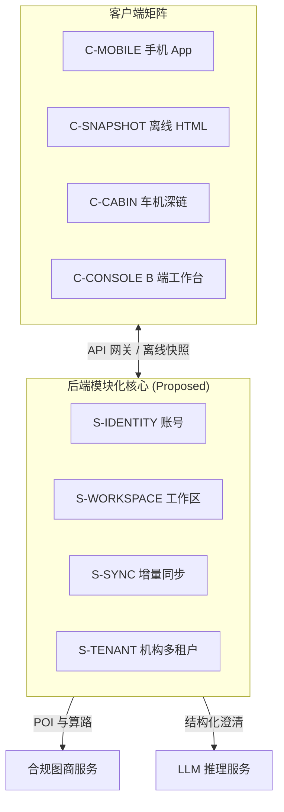

# TripCraft · 旅艺

统一账号、多端协同的智能旅行路书 App —— 产品与系统架构设计。

---

## 组件状态

严格区分设计状态与实现状态，当前除 `spec/` 与 `tools/` 外均处于规划与规格阶段：

| 组件 / 模块 | 所属层级 | 设计状态 | 实现状态 | 文档依据 |
| :--- | :--- | :--- | :--- | :--- |
| **`spec/` 数据契约** | 契约层 | 已验证 | **已实现** | [`spec/`](spec/)、[`docs/04-dsl-specification-v1.md`](docs/04-dsl-specification-v1.md) |
| **`tools/` 门禁工具链** | 工程基础设施 | 已验证 | **已实现** | [`tools/`](tools/)、[`package.json`](package.json) |
| **`S-EXPORT` 单文件打包器** | 编译器 | 已评审 | 原型 | [`docs/05-compiler-pipeline.md`](docs/05-compiler-pipeline.md) |
| **`C-SNAPSHOT` 离线运行时** | 运行时 | 已评审 | 原型 | [`docs/architecture/ARC-04-clients-channels.md`](docs/architecture/ARC-04-clients-channels.md) |
| **`C-CABIN` 座舱深链交付** | 客户端/交付 | 已评审 | 原型 | [`docs/02-cockpit-protocol.md`](docs/02-cockpit-protocol.md) |
| **`S-IDENTITY` 账号身份** | 后端服务 | 草案 | 无（阶段 1） | [`docs/architecture/ARC-05-backend-integrations.md`](docs/architecture/ARC-05-backend-integrations.md) |
| **`S-WORKSPACE` 行程工作区** | 后端服务 | 草案 | 无（阶段 1） | [`docs/architecture/ARC-02-domain-data-model.md`](docs/architecture/ARC-02-domain-data-model.md) |
| **`S-GENERATE` 智能澄清** | 后端服务 | 草案 | 无（阶段 1） | [`docs/08-socratic-interaction-design.md`](docs/08-socratic-interaction-design.md) |
| **`S-COLLAB` / `S-SYNC` 协作与同步**| 后端服务 | 草案 | 无（阶段 2） | [`docs/architecture/ARC-03-offline-sync.md`](docs/architecture/ARC-03-offline-sync.md) |
| **`S-TENANT` / `C-CONSOLE` 机构白标**| 后端/客户端 | 草案 | 无（阶段 1） | [`docs/architecture/ARC-06-multitenancy-whitelabel.md`](docs/architecture/ARC-06-multitenancy-whitelabel.md) |
| **`C-MOBILE` 跨端客户端** | 客户端 | 草案 | 无（阶段 1） | [`docs/architecture/adr/ADR-001-client-framework.md`](docs/architecture/adr/ADR-001-client-framework.md) |

---

## 产品概览

- **C 端旅客体验**：面向自驾游与深度游群体，提供行前渐进澄清防幻觉生成、多人分工协作，行中弱网零依赖离线渲染与座舱导航深链投递，行后智能回忆录沉淀。
- **B 端机构运营**：面向精品地接社与定制车队，提供独立品牌白标、私有特许资源库管理与专属域名免安装快照交付，赋能小 B 从业者实现高效数字化出单。


---

## 架构总览

系统采用本地优先（Local-First）与离线快照一等公民设计，核心服务遵循模块化单体演进路线：



---

## 能力边界

- **不触发领航辅助 (NOA)，不读取电池电量 (SOC)**：座舱交付止于向车机地图投递途经点，后续完全由车载导航系统自主引导。
- **不支持车机原生第三方 APK**：车机端采用系统深链或手机投屏镜像交付；不开发驻留车机的独立应用。
- **补能建议仅为模型估算**：依据公开车辆能耗模型与用户输入估算，非车端实时遥测。详见 [`docs/ERRATA.md`](docs/ERRATA.md)。

---

## 文档导航

- **产品架构包**：[`docs/product/README.md`](docs/product/README.md)（[PRD-01 愿景](docs/product/PRD-01-vision-positioning.md) · [PRD-02 用户客群](docs/product/PRD-02-personas-segments.md) · [PRD-03 场景流程](docs/product/PRD-03-scenarios.md) · [PRD-04 功能架构](docs/product/PRD-04-functional-architecture.md) · [PRD-05 商业模式](docs/product/PRD-05-business-model.md)）
- **系统架构包**：[`docs/architecture/README.md`](docs/architecture/README.md)（[ARC-01 总览](docs/architecture/ARC-01-overview.md) · [ARC-02 领域模型](docs/architecture/ARC-02-domain-data-model.md) · [ARC-03 离线同步](docs/architecture/ARC-03-offline-sync.md) · [ARC-04 客户端渠道](docs/architecture/ARC-04-clients-channels.md) · [ARC-05 后端集成](docs/architecture/ARC-05-backend-integrations.md) · [ARC-06 多租户白标](docs/architecture/ARC-06-multitenancy-whitelabel.md) · [ARC-07 安全合规](docs/architecture/ARC-07-security-privacy-compliance.md) · [ARC-08 部署与成本](docs/architecture/ARC-08-nfr-deployment-cost.md) · [ARC-09 ADR 索引](docs/architecture/ARC-09-adr-index.md)）
- **交付与规划包**：[`docs/delivery/README.md`](docs/delivery/README.md)（[DLV-01 路线图与 MVP](docs/delivery/DLV-01-roadmap-mvp.md) · [DLV-02 风险登记册](docs/delivery/DLV-02-risk-register.md) · [DLV-03 追溯矩阵](docs/delivery/DLV-03-traceability-matrix.md)）
- **全景与基线文档**：[`docs/WHITEPAPER.md`](docs/WHITEPAPER.md)（白皮书） · [`docs/ASSUMPTIONS.md`](docs/ASSUMPTIONS.md)（商业假设） · [`docs/ERRATA.md`](docs/ERRATA.md)（历史勘误） · [`docs/README.md`](docs/README.md)（执行全书 16 章索引）

---

## 路线图 (Roadmap)

详见 [`docs/delivery/DLV-01-roadmap-mvp.md`](docs/delivery/DLV-01-roadmap-mvp.md)：

1. **阶段 1：共用核心 + B 端白标最小闭环 (MVP)** —— 验证 3–5 家地接社出单与单文件离线快照；*不作自动冲突算法仲裁、二维码补丁同步与车机原生 APK*。
2. **阶段 2：多人协作与行中增量同步** —— 落地去中心化多端操作日志协同；*不作公域拼团撮合与复杂资源调度*。
3. **阶段 3：B 端工作台完整化** —— 落地子账号权限、特许资源库与商业订阅计费；*不作金融借贷与旅游电商平台*。
4. **阶段 4：座舱深度协同与生态互联** —— 丰富车机厂商投屏协议与前装探索；*不碰车辆底层 CAN 总线与线控驾驶*。
5. **阶段 5：旅后回忆录与分销生态** —— 沉淀多媒体游记与口碑转介绍分销；*不做 UGC 公域社交广场与内容审核公域化*。

---

## 示例与在线基准

- **在线实战基准**：[trip-cts.pages.dev](https://trip-cts.pages.dev) —— 西行计划·丝路自驾路书（RELEASE v3.6.3，为手工构建的前端参考实现，非编译器自动产物）。
- **基准 DSL 数据**：[`examples/dunhuang-silkroad-9d/trip.json`](examples/dunhuang-silkroad-9d/trip.json)

---

## 快速开始

当前仓库为规范、设计全书与门禁工具集，运行以下命令验证数据契约、文档链接与追溯闭环：

```bash
# 1. 安装开发期校验依赖 (Ajv 等)
npm install

# 2. 执行全量自动化门禁检查 (Schema 校验 + 跨文档链接 + BR-025 扫描 + 追溯矩阵检查)
npm run check
```

---

## 仓库结构

```text
TripCraft/
├── spec/              # 核心 JSON Schema 契约 (trip, brand, node, patch) [已实现]
├── docs/              # 文档体系 (产品 PRD、架构 ARC、交付 DLV、执行全书 16 章、白皮书)
│   ├── product/       # 产品设计包 (PRD-01 ~ PRD-05)
│   ├── architecture/  # 系统架构包 (ARC-01 ~ ARC-09, ADR-001 ~ ADR-008)
│   └── delivery/      # 交付规划包 (DLV-01 ~ DLV-03)
├── examples/          # 样例数据 (西北大环线 9 天基准 DSL) [已实现]
├── tools/             # 门禁脚本 (validate-schemas, check-links, check-br025, check-trace) [已实现]
├── CHANGELOG.md       # 规范与架构变更记录
├── LICENSE            # 开源许可证 (MIT)
├── package.json       # 项目元数据与脚本入口
└── README.md          # 仓库首页
```

---

## 许可证

本项目开源采用 [MIT License](LICENSE)。
