# TripCraft · 旅艺

<div align="center">

<h3>新一代自驾与深度游智能路书系统 · 数字化交付与 B 端白标 SaaS 平台</h3>
<p><b>统一账号漫游 · 本地优先多端协同 · 零依赖单文件离线快照 · 智能座舱极简投递 · 线下小 B 数字化外骨骼</b></p>

[](LICENSE)
[](docs/delivery/DLV-01-roadmap-mvp.md)
[](spec/)
[-brightgreen.svg)](tools/)
[](https://trip-cts.pages.dev)
[](docs/architecture/ARC-01-overview.md)
[](docs/delivery/DLV-01-roadmap-mvp.md)

<p align="center">
  <a href="https://trip-cts.pages.dev"><b>🌐 在线演示 (Live Demo)</b></a> •
  <a href="#-标杆样例与实战体验-live-benchmark"><b>🎯 标杆体验</b></a> •
  <a href="#-核心杀手级特性-killer-features"><b>⚡ 核心特性</b></a> •
  <a href="#-系统架构总览-system-architecture"><b>🏛️ 系统架构</b></a> •
  <a href="#-快速上手与门禁验证"><b>🚀 快速上手</b></a> •
  <a href="docs/WHITEPAPER.md"><b>📖 架构全景白皮书</b></a> •
  <a href="docs/README.md"><b>📚 执行全书 (16章)</b></a> •
  <a href="spec/"><b>📦 数据契约 (Spec)</b></a>
</p>

<br/>

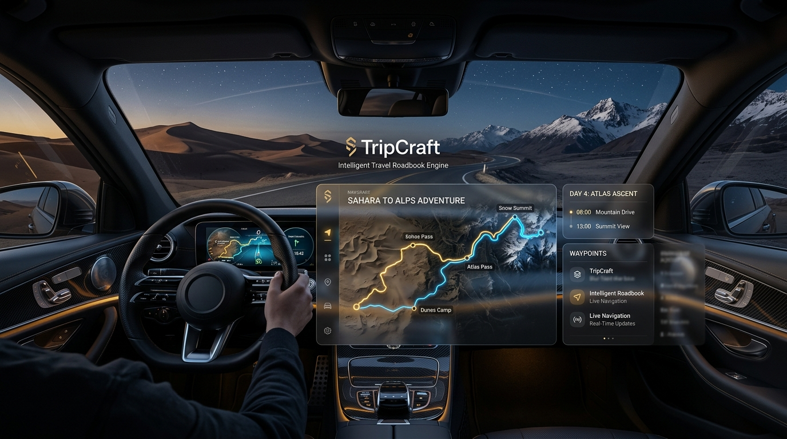

</div>

---

## 🌐 标杆样例与实战体验 (Live Benchmark)

无需配置开发环境，立即在浏览器中感受 TripCraft 的高质感交付魅力：

<div align="center">

### 👉 **[点击即刻体验：trip-cts.pages.dev (在线路书实战基准)](https://trip-cts.pages.dev)** 👈

*西行计划 · 丝路自驾路书（RELEASE v3.6.3 · 2,400km 穿越河西走廊、张掖丹霞、嘉峪关、敦煌莫高窟、东风航天城）*

</div>

```text
┌─────────────────────────────────────────────────────────────────────────────────────────┐
│                                 TripCraft 实战体验核心亮点                               │
│                                                                                         │
│  🎨 苹果液态玻璃视觉系统          📱 真正多端体验矩阵             🏔️ 零依赖离线抗灾        │
│  敦煌金 / 青甘碧 / 雪山银 /       手机随身打卡 · 平板大屏地理沙盘  高对比离线矢量地图底图   │
│  赛博紫 / 丹霞红自适应流转        桌面 Web 工作台 · 车载大屏投递   无人区断网秒开交互       │
│                                                                                         │
│  🛡️ 三段式弹性时间熔断            🚗 智能座舱极简交付             🚌 考斯特通达性标注      │
│  🟢 计划A ｜ 🟡 缓冲 ｜ 🔴 降级   全天 10+ 途经点一键批量推入车机  大巴限高/掉头/充电桩实测 │
└─────────────────────────────────────────────────────────────────────────────────────────┘
```

- **标杆脱敏 DSL 数据基准**：[`examples/dunhuang-silkroad-9d/trip.json`](examples/dunhuang-silkroad-9d/trip.json)  
  *包含 9 天完整行程点位、住宿餐饮、考斯特通过性标识与三段式弹性熔断预案，完全遵从 [`spec/trip.schema.json`](spec/trip.schema.json) 工业级校验。*

---

## 🌟 什么是 TripCraft？(About TripCraft)

**TripCraft（旅艺）** 是一套专为**自驾与长途深度游**场景打造的**新一代智能旅行路书协同系统与数字化交付中枢（Universal Travel Harness）**。

在数字化高度发达的今天，长途自驾与定制旅行的交付体验却惊人地停留在“石器时代”：
- **C 端散客的割裂**：机票在航旅纵横、酒店在携程、门票在美团、攻略在小红书、导航在高德。旅途中全家在 5+ 个 App 间狼狈切换；通用大模型做攻略频频产生景点闭馆、封路与路线伪造的严重“AI 幻觉”。
- **B 端车队的尴尬**：包车车队与精品地接社收取上万元高额服务费，最终交付给高净值客户的却只是一段排版混乱的微信长文本或 Word 截图。
- **高原断网白屏瘫痪**：驶入川西、甘青、新藏等高原无人区与峡谷暗区时，依赖网络的传统 H5 与小程序瞬间白屏崩溃。
- **座舱交互的安全隐患**：司机在颠簸行车中低头紧盯手机支架小屏幕，极易引发严重安全事故；每到一个途经点必须在车机上笨拙地重新搜索下一站。

TripCraft 致力于彻底打破这一现状。项目确立以 **「本地优先（Local-First）多端协同 App 矩阵」** 与 **「零依赖自包含高保真离线快照（C-SNAPSHOT）」** 为双轮驱动：

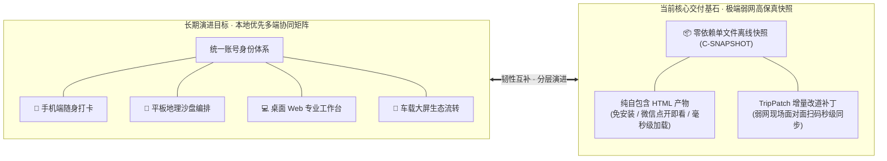

> 🔑 **产品核心形态定调**：  
> **多端实时同步漫游为长期演进目标，单文件离线高保真快照为当前核心交付基础。**  
> 二者并非对立，而是现代旅行中枢在「多设备高效协同」与「极端弱网容灾韧性」场景下的分层演进与韧性互补。完整形态拆解详见 [`docs/15-multi-device-and-collaboration.md`](docs/15-multi-device-and-collaboration.md)。

---

## 💔 行业痛点与 TripCraft 破局之道

TripCraft 直面自驾旅行“低频、重线下、非标品、极其依赖实体履约”的客观规律，构筑全链路系统级破局方案：

### 维度对比矩阵 (Why TripCraft)

| 评估维度 | 通用 AI 对话 (ChatGPT / Kimi) | 传统 OTA 巨头 (携程 / 美团) | 地图导航 App (高德 / 百度) | 传统路书交付 (Word / 微信长文) | TripCraft (旅艺) 破局方案 |
| :--- | :--- | :--- | :--- | :--- | :--- |
| **时空权威度** | ❌ 缺乏地面实况，常捏造闭馆与假路线 | ⚠️ 偏重机酒标品，无深度动态时空编排 | ⚠️ 擅长单点导航，缺乏人文深度与整程沙盘 | ⚠️ 手工整理耗时 4~8h，极易遗漏关键变动 | ✅ **严格 JSON Schema 强契约校验，未核实 POI 强制打标 tentative** |
| **弱网抗灾力** | ❌ 断网完全瘫痪 | ❌ 无网直接白屏卡死 | ⚠️ 离线地图可搜点，但无整团行程上下文 | ⚠️ 静态文本/图片无法自适应交互与动态展开 | ✅ **零依赖自包含单文件 HTML，断网全功能交互 + 增量扫码改道** |
| **座舱大屏体验** | ❌ 无座舱投递能力 | ❌ 仅限手机 App 内查看 | ⚠️ 手机支架窄屏危险驾驶，途经点逐一重搜 | ❌ 无法与车载系统联动 | ✅ **全天 10+ 途经点一键批量投递车机，原生地图接管导航，副驾大屏联动** |
| **B端商业赋能** | ❌ 无企业白标与资产保护 | ❌ 平台围墙花园，佣金抽成，切断私域 | ❌ 无法定制机构专属品牌与特许机位 | ❌ 交付物简陋，形象停留在“土作坊” | ✅ **独立品牌白标 + 专属域名 + 20分钟极速出单 + 独家特许资源库 RLS 隔离** |
| **交互输入负担** | ❌ 需要多轮繁琐打字描述 | ❌ 繁琐表单搜索筛选 | ❌ 逐站手动搜索输入 | ❌ 大量机械复制粘贴 | ✅ **苏格拉底双模启发：零输入胶囊药丸点选 (Zero-Typing Pills) 渐进收敛** |

<br/>

<div align="center">

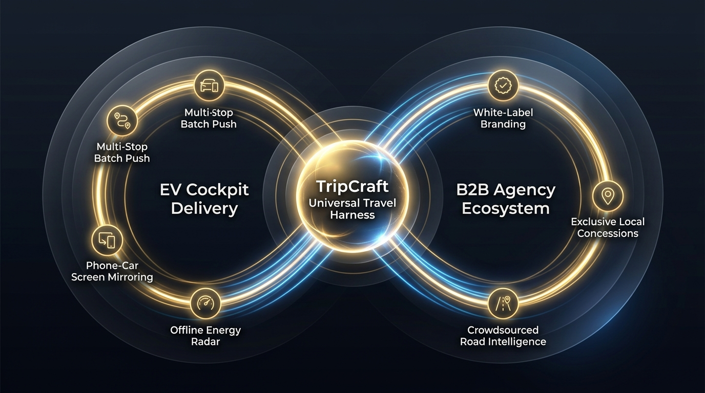

*图：TripCraft 智能座舱交付与 B2B 线下地接社数字化外骨骼双轮驱动生态飞轮*

</div>

### 💼 B2B2C 价值流动与商业模式
- **不要试图用 AI 消灭线下旅行社，而要成为武装他们的超级工具**：为考斯特车队、精品地接社、独立自驾领队打造高质感数字化交付外骨骼，使接待形象从“土作坊”跃升为“顶级管家”，直接提升客单价与服务溢价；详见 [`docs/03-b2b-agency-operations.md`](docs/03-b2b-agency-operations.md) 与 [`docs/13-agency-partnership-design.md`](docs/13-agency-partnership-design.md)；
- **做独立中立的 Universal Travel Harness（旅行超级中枢）**：不拘泥于单一巨头封闭插件，探索全网 OTA 插件集成与 CPS 联盟比价分销（商业假设 A-01 / A-02，详见 [`docs/ASSUMPTIONS.md`](docs/ASSUMPTIONS.md)），不与入驻地接社争夺终端客源，实现平台、地接社与旅客三方共赢。

---

## ⚡ 核心杀手级特性 (Killer Features)

### 1. 🤖 苏格拉底启发式对齐引擎 (`S-GENERATE`)
*告别繁琐打字疲劳与 AI 路线幻觉，构建懂旅行的智能启发向导。*

- **双模弹性唤醒**：支持「自由倾倒模式」（随意粘贴聊天记录或杂乱想法）与「零输入向导模式」（全流程胶囊药丸点选 Zero-Typing Pills）；
- **四层渐进式收敛漏斗**：大骨架团队画像 ➔ 交通锚点与核心灵魂景点 ➔ 节奏与风味偏好 ➔ 优雅的待定容忍与 Plan B 熔断；
- **待定项语义容忍 (Tentative Tolerance)**：用户回答“随便”、“还没定”时绝不反复追问卡死，自动注入行业最佳实践并标记语义，配套「🟢 计划A ｜ 🟡 弹性缓冲 ｜ 🔴 降级预案」三段式时间熔断机制；
- **强契约防幻觉校验**：生成产物强制通过 [`spec/trip.schema.json`](spec/trip.schema.json) 工业级校验，未核实 POI 强制打标 `tentative`，彻底杜绝大模型编造虚假路线；规范依据详见 [`docs/08-socratic-interaction-design.md`](docs/08-socratic-interaction-design.md)。

<div align="center">

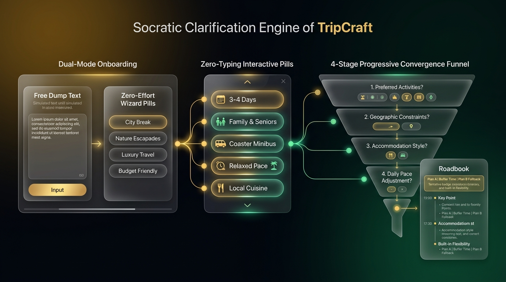

*图：苏格拉底多轮交互对齐漏斗与胶囊点选交互流*

</div>

---

### 2. 🎨 目的地感知·苹果液态玻璃视觉系统 (Destination-Aware Liquid Glass)
*拒绝死板灰暗的传统表格，呈现头等舱画册级杂志排版质感。*

- **五大预设液态玻璃主题矩阵**：敦煌金（大漠风情）、青甘碧（高原湖泊）、雪山银（冰川冷冽）、赛博紫（夜幕星空）、丹霞红（地貌奇观），界面随目的地自适应流转；
- **极致工程级动效**：CSS Grid `0fr-1fr` 硬件加速平滑折叠，彻底杜绝 JavaScript 计算导致的页面重排与帧率卡顿；
- **长辈关怀大字模式 (Senior Care Mode)**：内置 `<head>` 防闪烁逻辑（Zero-FOUC），满足 WCAG 2.1 AAA 严苛标准，按钮触控靶区全面扩大至 ≥ 48px × 48px；
- **电影画幅意境 Banner**：智能匹配 16:9 电影画幅暗调意境横幅与深色高斯模糊渐变衬底，打造媲美 Apple 设计规范的高级质感；规范依据详见 [`docs/09-visual-design-system.md`](docs/09-visual-design-system.md)。

<div align="center">

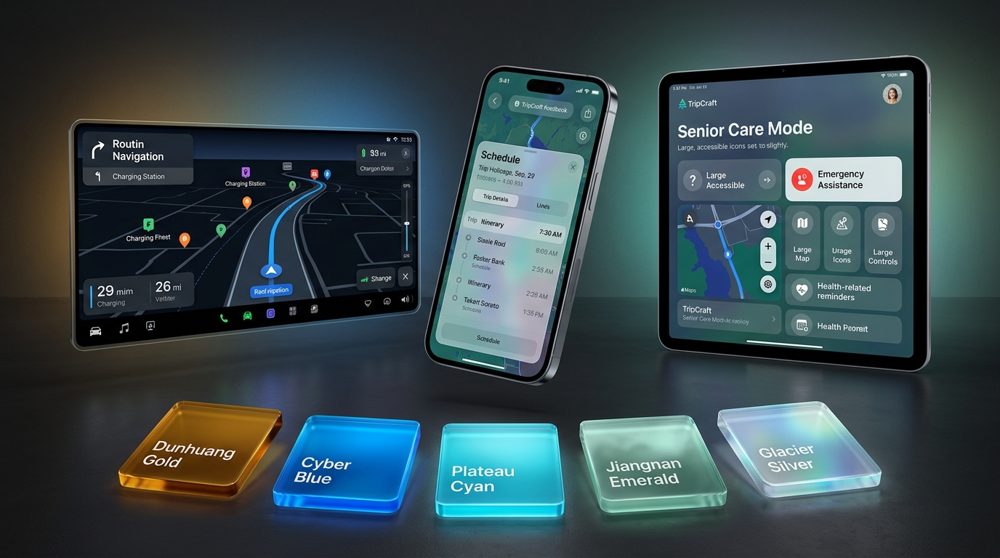

*图：五大液态玻璃主题色系与车载宽屏/手机/长辈大字多端自适应呈现*

</div>

---

### 3. 📦 零依赖·免安装·单文件高保真离线快照 (`C-SNAPSHOT`)
*践行「零构建交付、单文件优先、降级不可耻、白屏才是罪」的硬核工程铁律。*

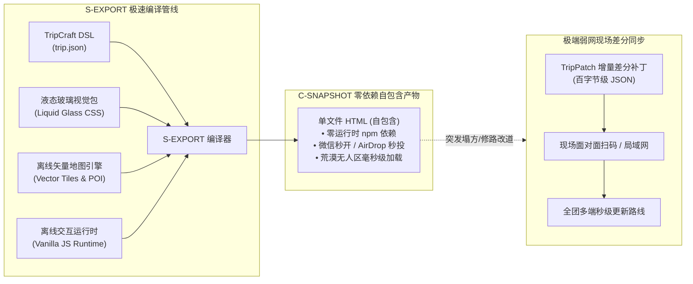

- **自包含全量编译**：将完整行程数据、高对比离线矢量地图、CSS 主题动效与离线交互逻辑编译为**单个自包含 HTML 文件**；
- **完全免安装**：零第三方 npm 运行时依赖，微信点开即看、AirDrop 隔空秒投、本地文件双击即览；
- **极端环境容灾**：在海拔 4000 米高原无人区、深山峡谷断网、弱网基站拥塞等恶劣条件下，保障毫秒级加载与全量离线交互；规范依据详见 [`docs/01-resilience-and-failover.md`](docs/01-resilience-and-failover.md) 与 [`docs/05-compiler-pipeline.md`](docs/05-compiler-pipeline.md)；
- **TripPatch 点对点增量分发**：突发塌方、泥石流或修路改道时，领队生成百字节级 [`spec/patch.schema.json`](spec/patch.schema.json) 差分补丁，面对面扫码或局域网全员秒级同步。

---

### 4. 🚗 智能座舱极简交付协议 (`C-CABIN`)
*告别手机支架低头驾驶隐患，让路书真正融入车载大屏。*

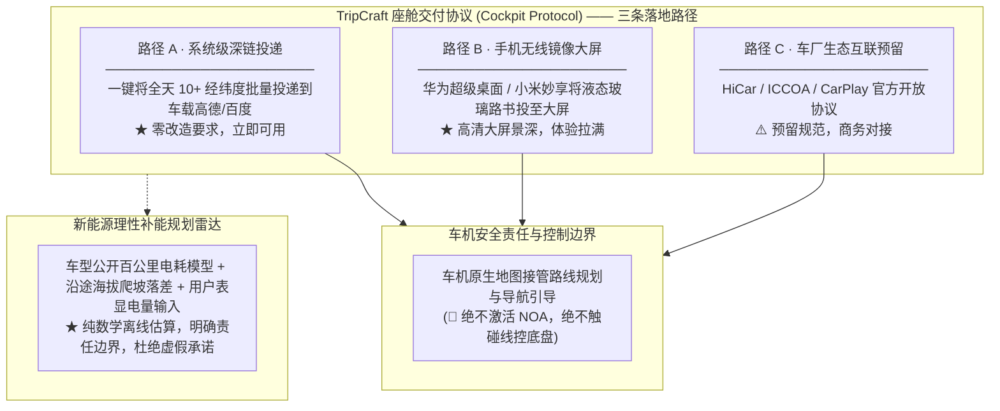

- **全天路线批量投递**：全天沿途打卡点、观景台、服务区一键打包推送车机，车机原生地图接管导航引导；
- **多屏协同展卡**：同一产物自适应多屏，中控大屏呈现全局路线沙盘，副驾屏与后排屏联动显示深度人文历史解说；
- **理性补能规划雷达**：结合车型公开百公里电耗模型、海拔爬坡落差与用户输入的表显电量做数学估算，提前预警补能区间；规范依据详见 [`docs/02-cockpit-protocol.md`](docs/02-cockpit-protocol.md)。

---

### 5. 🏢 线下地接与车队 B2B 白标 SaaS (`C-CONSOLE` & `S-TENANT`)
*专为精品地接社、自驾俱乐部与高端车队量身定制的商业化外骨骼。*

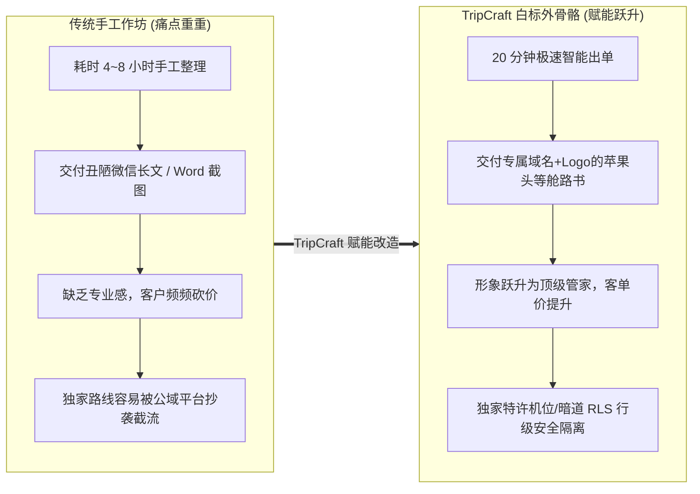

- **极速出单与品牌溢价**：原本需要耗费 4~8 小时的手写长文本，通过白标工作台 20 分钟内生成苹果头等舱质感路书；
- **独立品牌白标体系**：支持租户专属 Logo、品牌主色调、专属域名（如 `vip.myagency.com`）与防伪定制水印；规范依据详见 [`spec/brand.schema.json`](spec/brand.schema.json)；
- **独家特许资源库管理**：机构独家机位、大巴限高暗道、地接协议餐宿等核心资产通过行级安全隔离（RLS），防止从业者核心情报流失；
- **全生命周期客户保护**：客户数据完全属于入驻机构，免登快照杜绝平台截流抢单；规范依据详见 [`docs/03-b2b-agency-operations.md`](docs/03-b2b-agency-operations.md) 与 [`docs/13-agency-partnership-design.md`](docs/13-agency-partnership-design.md)。

---

## 🏛️ 系统架构总览 (System Architecture)

TripCraft 整体架构采用五层全景分层与模块化单体（Modular Monolith）工程设计：

<div align="center">

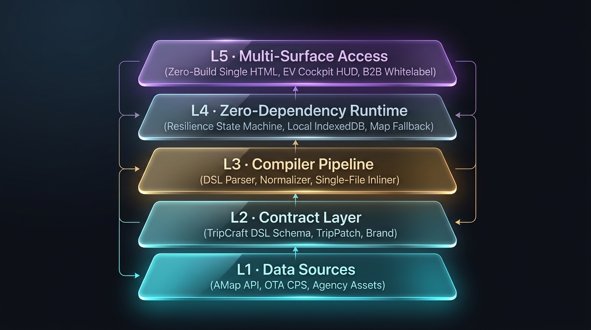

*图：TripCraft 五层全景架构（L1 数据源层 ➔ L2 契约层 ➔ L3 编译器与同步层 ➔ L4 运行时层 ➔ L5 多端交付层）*

</div>

### 模块拓扑与服务交互

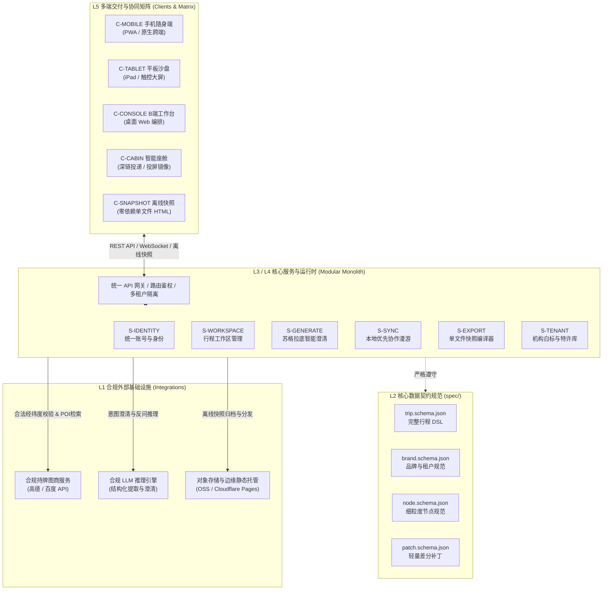

---

## 📦 核心数据契约规范 (Data Contracts)

系统所有数据输入、输出与流转均严格受到 `spec/` 目录下的 JSON Schema 契约治理：

| Schema 契约文件 | 命名空间规范 | 核心职责与业务语义 |
| :--- | :--- | :--- |
| [`spec/trip.schema.json`](spec/trip.schema.json) | `https://tripcraft.dev/schema/v1.0.0/trip.schema.json` | **行程全案核心契约**：定义行程元数据、团队成员画像、每日时间线、节点列表、餐饮住宿及 Plan B 三段式熔断结构。 |
| [`spec/brand.schema.json`](spec/brand.schema.json) | `https://tripcraft.dev/schema/v1.0.0/brand.schema.json` | **租户与白标契约**：定义 B 端机构资质、品牌 Logo、主题配色、客服专线、专属域名及电子防伪印章。 |
| [`spec/node.schema.json`](spec/node.schema.json) | `https://tripcraft.dev/schema/v1.0.0/node.schema.json` | **行程节点元数据契约**：定义单个打卡点、途经点、坐标、停留时长、海拔、考斯特大巴通达性及注意事项。 |
| [`spec/patch.schema.json`](spec/patch.schema.json) | `https://tripcraft.dev/schema/v1.0.0/patch.schema.json` | **TripPatch 差分补丁契约**：定义基于版本操作日志的轻量增量补丁，支持现场突发改道的秒级低带宽广播。 |

---

## 🛡️ 诚实能力边界声明 (Honest Boundaries)

为切实保障**行车生命安全、测绘合规红线与商业合作伙伴利益**，TripCraft 郑重确立以下能力边界声明：

1. 🚫 **绝不激活领航辅助 (NOA)，绝不触碰线控底盘**：座舱交付严格止于向车机地图投递途经点经纬度，后续导航与辅助驾驶决策全部由车载系统自主接管，绝不干预任何车辆行驶与控制。
2. 🚫 **绝不读取车辆实时电量 (SOC)**：沿途补能规划均基于公开车型能耗模型、高程爬坡落差与用户手动填报的表显续航进行数学估算，并明确标注为「参考估算」，杜绝虚假安全承诺。
3. 🚫 **绝不强行安装车机原生第三方 APK**：车机端采用成熟合规的手机系统深链直调与高清无线镜像交付，杜绝占用车机系统关键算力与车机运行内存。
4. 🚫 **绝不自研底层地图与算路引擎**：所有地理编码与算路均调用高德、百度等国家持牌合规图商服务；**严守 BR-025 测绘合规红线**，静态产物中绝不非法内联稠密算路几何点串。
5. 🚫 **绝不自营重资产地接与旅游交易**：TripCraft 坚守中立技术与工具底座定位，全面赋能线下小 B 从业者，不与其争夺终端客户与地接订单。

> 📌 更多历史事实核查与更正说明详见 [`docs/ERRATA.md`](docs/ERRATA.md)。

---

## 📊 组件工程状态与落地路线图

### 组件工程状态对照表

我们坚持工程诚实原则，严格区分**设计状态**与**代码实现状态**：

| 模块 / 组件 | 架构层级 | 设计状态 | 实现状态 | 规范与文档依据 |
| :--- | :--- | :--- | :--- | :--- |
| **`spec/` 契约集** | 契约层 (L2) | **已验证** | **已实现** | [`spec/`](spec/)、[`docs/04-dsl-specification-v1.md`](docs/04-dsl-specification-v1.md) |
| **`tools/` 门禁工具链** | 工程基础设施 | **已验证** | **已实现** | [`tools/`](tools/)、[`package.json`](package.json) |
| **`examples/` 标杆数据** | 数据基准 | **已验证** | **已实现** | [`examples/dunhuang-silkroad-9d/trip.json`](examples/dunhuang-silkroad-9d/trip.json) |
| **`S-EXPORT` 单文件编译器** | 编译流水线 (L3) | 已评审 | 原型验证 | [`docs/05-compiler-pipeline.md`](docs/05-compiler-pipeline.md) |
| **`C-SNAPSHOT` 离线运行时** | 容灾运行时 (L4) | 已评审 | 原型验证 | [`docs/architecture/ARC-04-clients-channels.md`](docs/architecture/ARC-04-clients-channels.md) |
| **`C-CABIN` 座舱交付协议** | 终端接入 (L5) | 已评审 | 协议已定 | [`docs/02-cockpit-protocol.md`](docs/02-cockpit-protocol.md) |
| **`S-IDENTITY` 统一账号** | 核心服务 (L3) | 规划设计 | 规划中 (Phase 1) | [`docs/architecture/ARC-05-backend-integrations.md`](docs/architecture/ARC-05-backend-integrations.md) |
| **`S-WORKSPACE` 行程工作区** | 核心服务 (L3) | 规划设计 | 规划中 (Phase 1) | [`docs/architecture/ARC-02-domain-data-model.md`](docs/architecture/ARC-02-domain-data-model.md) |
| **`S-GENERATE` 智能澄清** | 核心服务 (L3) | 规划设计 | 规划中 (Phase 1) | [`docs/08-socratic-interaction-design.md`](docs/08-socratic-interaction-design.md) |
| **`S-SYNC` 本地优先协同** | 核心服务 (L3) | 规划设计 | 规划中 (Phase 2) | [`docs/architecture/ARC-03-offline-sync.md`](docs/architecture/ARC-03-offline-sync.md) |
| **`S-TENANT` 机构白标** | 核心服务 (L3) | 规划设计 | 规划中 (Phase 1) | [`docs/architecture/ARC-06-multitenancy-whitelabel.md`](docs/architecture/ARC-06-multitenancy-whitelabel.md) |
| **`C-MOBILE` 跨端 App** | 终端接入 (L5) | 规划设计 | 规划中 (Phase 1) | [`docs/architecture/adr/ADR-001-client-framework.md`](docs/architecture/adr/ADR-001-client-framework.md) |

### 🗺️ 五阶段演进路线图 (Roadmap)

详见演进路线规划书 [`docs/delivery/DLV-01-roadmap-mvp.md`](docs/delivery/DLV-01-roadmap-mvp.md)：

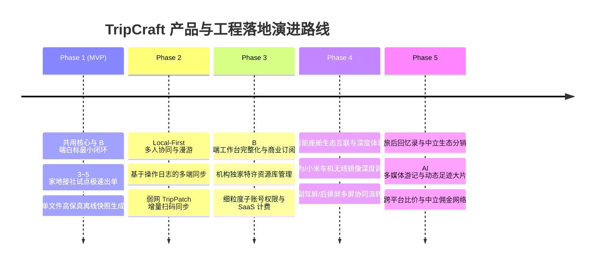

---

## ⚡ 快速上手与门禁验证

无需复杂的后端服务与数据库环境，四步即可完成从在线体验到工程门禁校验的完整流程：

### 1. 即刻体验在线标杆
直接访问在线演示站 👉 **[trip-cts.pages.dev](https://trip-cts.pages.dev)**，无需任何本地安装。

### 2. 查看标杆脱敏 DSL 数据
查阅位于 [`examples/dunhuang-silkroad-9d/trip.json`](examples/dunhuang-silkroad-9d/trip.json) 的完整路书数据结构，了解 9 天西北自驾的点位、时间线与弹性熔断配置。

### 3. 克隆代码并安装门禁工具
```bash
# 克隆代码仓库并进入工作目录
git clone https://github.com/JohnMaxwell0123/TripCraft.git
cd TripCraft

# 安装开发期质量门禁依赖 (仅用于 Ajv 校验与检查脚本，无任何运行时 npm 依赖)
npm install
```

### 4. 运行全量四重质量门禁自动化检查
```bash
npm run check
```

#### 自动化门禁工具链说明

```text
npm run check
├── 1. validate     验证 4 份核心 JSON Schema 契约元定义与示例数据的语法一致性
├── 2. check-links  扫描全仓库 Markdown 文档的跨文件链接与标题锚点完整性 (1100+ 链接)
├── 3. check-br025  严苛扫描并拦截任何违规内联的图商导航算路密集折线，保障测绘合规
└── 4. check-trace  自动化校验场景、功能、架构决策(ADR)与商业假设的全链路双向追溯闭环
```

---

## 📚 文档全景导航 (Documentation)

TripCraft 拥有极度详尽的产品 PRD、系统架构 ARC、交付规划 DLV 与执行全书规范：

```text
docs/
├── WHITEPAPER.md                      # 架构全景白皮书 (产品愿景、商业模式与战略思考)
├── ASSUMPTIONS.md                     # 商业与技术假设台账 (A-01 ~ A-12)
├── ERRATA.md                          # 外部事实核查与更正声明
│
├── product/                           # 【产品设计包 (PRD)】
│   ├── PRD-01-vision-positioning.md   # 愿景、定位与商业价值
│   ├── PRD-02-personas-segments.md    # 用户客群模型与画像
│   ├── PRD-03-scenarios.md            # 场景全流程设计 (14 大典型出行与履约场景)
│   ├── PRD-04-functional-architecture.md # 功能架构规格 (51 项端到端功能全景)
│   └── PRD-05-business-model.md       # 商业模式与商业化战略
│
├── architecture/                      # 【系统架构包 (ARC)】
│   ├── ARC-01-overview.md             # 系统总体架构设计
│   ├── ARC-02-domain-data-model.md    # 领域模型与数据契约设计
│   ├── ARC-03-offline-sync.md         # 离线优先与数据同步架构
│   ├── ARC-04-clients-channels.md     # 客户端矩阵与交付渠道架构
│   ├── ARC-05-backend-integrations.md # 后端架构与合规外部系统集成
│   ├── ARC-06-multitenancy-whitelabel.md # 多租户白标与特许资源库隔离
│   ├── ARC-07-security-privacy-compliance.md # 安全合规与隐私保护架构
│   ├── ARC-08-nfr-deployment-cost.md  # 非功能性需求、部署与成本估算
│   └── ARC-09-adr-index.md            # 架构决策索引 (ADR-001 ~ ADR-008)
│
├── delivery/                          # 【交付规划包 (DLV)】
│   ├── DLV-01-roadmap-mvp.md          # 演进路线图与 MVP 交付范围
│   ├── DLV-02-risk-register.md        # 风险登记册与缓解策略
│   └── DLV-03-traceability-matrix.md  # 全链路需求与架构追溯矩阵
│
└── README.md                          # 【执行全书 16 章总纲】
    ├── 🎨 设计轨: §8 澄清反问 · §9 视觉系统 · §10 深度阅读 · §11 受众自适应 · §15 多设备协同
    ├── 💼 商业轨: §3 B2B运营 · §12 车厂合作 · §13 地接社合作 · §14 通用引擎扩展
    ├── ⚙️ 工程轨: §1 韧性容灾 · §2 座舱协议 · §4 DSL契约 · §5 编译器管线
    └── ⚖️ 支撑轨: §0 总纲术语 · §6 记忆日志 · §7 法律合规
```

---

## 📂 仓库目录结构

```text
TripCraft/
├── spec/              # 核心 JSON Schema 工业级契约 (trip, brand, node, patch) [已实现]
├── docs/              # 完整文档体系 (产品 PRD、系统架构 ARC、交付 DLV、执行全书 16 章、白皮书)
│   ├── product/       # 产品设计包 (PRD-01 ~ PRD-05) [已评审]
│   ├── architecture/  # 系统架构包 (ARC-01 ~ ARC-09, ADR-001 ~ ADR-008) [已评审]
│   ├── delivery/      # 交付规划包 (DLV-01 ~ DLV-03) [已评审]
│   └── assets/        # 高清视觉资源与系统架构图 (Hero Banner, 飞轮, 交互流, 主题色, 架构图)
├── examples/          # 标杆样例数据 (西北大环线 9 天自驾基准 DSL) [已实现]
├── tools/             # 自动化门禁工具链 (validate-schemas, check-links, check-br025, check-trace) [已实现]
├── CHANGELOG.md       # 规范与架构变更记录
├── LICENSE            # 开源许可证 (MIT)
├── package.json       # 项目元数据与质量门禁脚本
└── README.md          # 仓库首页说明文档 (当前文档)
```

---

## 🏷️ GitHub 仓库配置建议 (Repository Metadata)

建议在 GitHub 仓库主页右侧 **About** 栏同步配置如下元数据：

- **Description (一句话简介)**：  
  `新一代自驾与深度游智能路书系统 —— 统一账号、多端协同、单文件离线快照一等公民与 B 端白标 SaaS（产品设计与系统架构全案）`
- **Website (在线主页)**：  
  `https://trip-cts.pages.dev`
- **Topics (主题标签)**：  
  `travel` · `roadbook` · `itinerary` · `offline-first` · `local-first` · `dsl` · `cockpit` · `b2b2c` · `architecture`

---

## 📄 开源许可证

本项目核心数据契约规范、文档体系与质量门禁工具链遵循 [MIT License](LICENSE) 开源协议。
