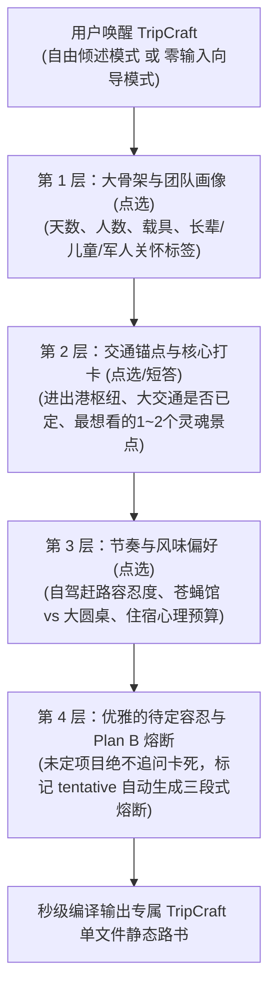

# TripCraft · 旅艺
## 智能旅行路书静态网页生成系统 · 产品设计、商业化战略、开源架构与知识产权确权白皮书

> **项目名称**：TripCraft (旅艺 / 智程路书)  
> **核心定位**：人人可用的高颜值、免构建、苹果液态玻璃（Liquid Glass）旅行路书静态网页生成引擎 & 中立旅行超级中枢（Universal Travel Harness）  
> **项目作者**：个人独立开发者（原创知识产权存证文档 / GitHub 开源项目）  
> **实战基准**：西行计划·丝路自驾路书 (`trip-cts.pages.dev`, RELEASE v3.6.3)  
> **当前状态**：产品设计、商业化分层、车机/地接双驱架构与知识产权防御确权全案收敛  
> **本文档修订**：2026-10-08（产品形态勘正 —— 见下方范围说明）；2026-10-07（外部事实核查 —— 见 [§8.6](#86-待决本文档与仓库许可证之间存在冲突oi-008--p0) 与 [核查记录](docs/README.md#外部事实核查记录)）  
> **配套执行全书**：[docs/ · 执行全书](docs/README.md)（16 章 = 设计轨 5 章 + 商业轨 4 章 + 工程轨/支撑轨 7 章 + 4 份 JSON Schema）

<div align="center">


</div>

---

> ### ⚠️ 范围说明（2026-10-08 增补）—— 先读这一条
>
> **本文档描述的是 TripCraft 的**交付层引擎**：DSL 契约、编译器流水线、单文件路书产物、白标与确权。**
>
> **它不是产品的全部形态。** 完整形态是三层：
>
> | 层 | 是什么 | 本文档覆盖 |
> | :--- | :--- | :--- |
> | 🗣 **协作层** | 行前，一群人共同提出需求与景点 | ❌ **不覆盖**——见 [第 15 章](docs/15-multi-device-and-collaboration.md) |
> | 📖 **交付层** | 行中，那份零安装、离线可读的路书 | ✅ **本文档的主体** |
> | 📤 **分享层** | 行后 / 向群外分发 | ❌ **不覆盖**——见 [第 15 章](docs/15-multi-device-and-collaboration.md) |
>
> 🔴 **所以本文档全篇出现的"静态网页 / 单文件 / 无后端"，说的都是【交付层】——那三条约束在那里一个字不改。**
>
> **但请勿据此推断"整个产品是一个静态网页"**：那个推断是错的，而且它会连带取消掉协作层与白标可能性。完整论证见 [第 15 章 §15.1~§15.3](docs/15-multi-device-and-collaboration.md)。

---

## 目录索引 (Table of Contents)
1. [一、系统愿景与核心初心 (Vision & Core Mission)](#一系统愿景与核心初心-vision--core-mission)
2. [二、商业化战略思考：破局行业死局与双轨演进 (Commercial Strategy & B2B2C Disruption)](#二商业化战略思考破局行业死局与双轨演进-commercial-strategy--b2b2c-disruption)
   - [2.1 行业底层真相与痛点反思：低频、重线下、非标品](#21-行业底层真相与痛点反思低频重线下非标品)
   - [2.2 破局路径一：做线下从业者的“数字化外骨骼”（B2B2C 赋能模式）](#22-破局路径一做线下从业者的数字化外骨骼b2b2c-赋能模式)
   - [2.3 破局路径二：大厂插件 vs Universal Travel Harness（万物皆可 Plug-in）](#23-破局路径二大厂插件-vs-universal-travel-harness万物皆可-plug-in)
   - [2.4 核心差异化壁垒一：智能座舱交付 · 让路书离开“手机窄屏”](#24-核心差异化壁垒一智能座舱交付--让路书离开手机窄屏)
   - [2.5 核心差异化壁垒二：与线下旅行社/车队深度共生 · 实体资源白标与履约飞轮](#25-核心差异化壁垒二与线下旅行社车队深度共生--实体资源白标与履约飞轮)
   - [2.6 横向技术迁移力（超越旅游的时空流动通用底座）](#26-横向技术迁移力超越旅游的时空流动通用底座)
   - [2.7 商业壁垒与核心护城河总结 (Competitive Moats Summary)](#27-商业壁垒与核心护城河总结-competitive-moats-summary)
3. [三、核心交互机制：渐进式反问与认知对齐引擎 (Socratic Clarification Engine)](#三核心交互机制渐进式反问与认知对齐引擎-socratic-clarification-engine)
   - [3.1 现实洞察：为什么不能指望用户一次性给全信息？](#31-现实洞察为什么不能指望用户一次性给全信息)
   - [3.2 双模唤醒机制：自由倾倒 vs 零输入向导 (Dual-Mode Onboarding)](#32-双模唤醒机制自由倾倒-vs-零输入向导-dual-mode-onboarding)
   - [3.3 拒绝打字疲劳：全流程胶囊药丸点选交互 (Zero-Typing Pills)](#33-拒绝打字疲劳全流程胶囊药丸点选交互-zero-typing-pills)
   - [3.4 四层渐进式收敛漏斗与待定（Tentative）容忍策略](#34-四层渐进式收敛漏斗与待定tentative容忍策略)
4. [四、目的地感知与视觉设计系统 (Destination-Aware Visual System)](#四目的地感知与视觉设计系统-destination-aware-visual-system)
   - [4.1 五大预设液态玻璃主题矩阵 (Liquid Glass Themes)](#41-五大预设液态玻璃主题矩阵-liquid-glass-themes)
   - [4.2 苹果液态玻璃（Liquid Glass）核心设计规范](#42-苹果液态玻璃liquid-glass核心设计规范)
   - [4.3 AI 文生图动态意境背景与 16:9 电影画幅 Banner 自动生成引擎](#43-ai-文生图动态意境背景与-169-电影画幅-banner-自动生成引擎)
   - [4.4 平台级富媒体可视化 POI 展卡与端内闭环生态（通义千问×淘宝模式）](#44-平台级富媒体可视化-poi-展卡与端内闭环生态通义千问淘宝模式)
5. [五、商业化价值分层：普通版 vs VIP 尊享版体系 (Standard vs VIP Tiering)](#五商业化价值分层普通版-vs-vip-尊享版体系-standard-vs-vip-tiering)
   - [5.1 通用核心底座：做大留存率与自发裂变](#51-通用核心底座做大留存率与自发裂变)
   - [5.2 维度 1：多流派顶流视觉系统（基于 Mobbin 提炼内置）](#52-维度-1多流派顶流视觉系统基于-mobbin-提炼内置)
   - [5.3 维度 2：仪式感与数字资产沉淀（旅后 AI 回忆录与足迹大片）](#53-维度-2仪式感与数字资产沉淀旅后-ai-回忆录与足迹大片)
   - [5.4 维度 3：自驾车队实时协同（多车信标雷达与 AA 账单导出）](#54-维度-3自驾车队实时协同多车信标雷达与-aa-账单导出)
   - [5.5 维度 4：行中智能守护与实时气象路况雷达](#55-维度-4行中智能守护与实时气象路况雷达)
   - [5.6 维度 5：企业级专属域名与私密密码锁](#56-维度-5企业级专属域名与私密密码锁)
   - [5.7 维度 6：智能座舱交付与全天路线批量下发 (EV Smart Cockpit)](#57-维度-6智能座舱交付与全天路线批量下发-ev-smart-cockpit)
   - [5.8 维度 7：线下旅行社 B2B 白标定制与地面特许资源库 (Travel Agency B2B Whitelabel)](#58-维度-7线下旅行社-b2b-白标定制与地面特许资源库-travel-agency-b2b-whitelabel)
6. [六、TripCraft 系统架构与技术规范 (Technical Architecture & DSL)](#六tripcraft-系统架构与技术规范-technical-architecture--dsl)
   - [6.0 系统分层全景架构 (System Architecture)](#60-系统分层全景架构-system-architecture)
   - [6.1 技能包工程目录结构 (Monorepo Blueprint)](#61-技能包工程目录结构-monorepo-blueprint)
   - [6.2 核心数据契约：`TripCraft DSL` 规范 (JSON / YAML)](#62-核心数据契约tripcraft-dsl-规范-json--yaml)
7. [七、落地行动路线图 (Execution Roadmap)](#七落地行动路线图-execution-roadmap)
8. [八、个人独立开发者知识产权保护、先验技术存证（Prior Art）与防抄袭全指南 (IP Protection & Defensive Publication Guide)](#八个人独立开发者知识产权保护先验技术存证prior-art与防抄袭全指南-ip-protection--defensive-publication-guide)
   - [8.1 法律底层：思想与表达二分法（Idea-Expression Dichotomy）与受保护范围](#81-法律底层思想与表达二分法idea-expression-dichotomy与受保护范围)
   - [8.2 零成本技术存证：Git GPG 签名 + GitHub 权威不可逆时间戳 (Prior Art)](#82-零成本技术存证git-gpg-签名--github-权威不可逆时间戳-prior-art)
   - [8.3 司法级法定存证：国家授时中心可信时间戳（TSA）与区块链存证（仅需数元）](#83-司法级法定存证国家授时中心可信时间戳tsa与区块链存证仅需数元)
   - [8.4 攻防兼备：防御性公开发表（Defensive Publication）](#84-攻防兼备防御性公开发表defensive-publication)
   - [8.5 商业秘密与对外交流防窃取：NDA 协议与保密水印规范](#85-商业秘密与对外交流防窃取nda-协议与保密水印规范)
   - [8.6 待决：本文档与仓库许可证之间存在冲突（OI-008 · P0）](#86-待决本文档与仓库许可证之间存在冲突oi-008--p0)

---

## 📘 配套工程规格：《TripCraft 终极执行全书》

**本文档（白皮书）回答「为什么做」；执行全书回答「怎么做」。**

执行全书分两轨：**设计轨**（它是什么样、为什么）与**工程轨**（怎么造出来）。**设计轨在前**——因为设计定义数据需求，不是反过来。

> ### 👉 **[`docs/` · TripCraft 终极执行全书](docs/README.md)**

**🎨 设计轨 —— 先读这五章**

| 你关心 | 去哪里 |
| :--- | :--- |
| 怎么和用户说话？「随便」怎么处理？ | [第 8 章 · 苏格拉底交互引擎完整设计](docs/08-socratic-interaction-design.md) |
| 长什么样？敦煌金到底是什么金？ | [第 9 章 · 视觉设计系统](docs/09-visual-design-system.md) |
| 用户最终拿到的那份东西怎么读？ | [第 10 章 · 路书产物形态与阅读设计](docs/10-roadbook-reading-design.md) |
| 一车人需求各不相同怎么办？ | [第 11 章 · 人群画像驱动的差异化呈现](docs/11-audience-adaptive-rendering.md) |
| ★ **最终交付的到底是什么？还是不是静态网页？** | [第 15 章 · 多端形态与协作层设计](docs/15-multi-device-and-collaboration.md) |

**💼 商业轨 —— 两条 B 端线 + 一条边界**

| 你关心 | 去哪里 |
| :--- | :--- |
| 怎么和车厂谈？「一键自动驾驶」到底能不能做？ | [第 12 章 · 车厂合作的产品形态与舱内体验设计](docs/12-oem-partnership-design.md) |
| 线下旅行社凭什么用我们？他们的资源怎么进来？ | [第 13 章 · 线下旅行社合作的价值主张与资源数字化设计](docs/13-agency-partnership-design.md) |
| ⚠️ 能不能和"小红书自驾领队"这类无资质主体合作？ | [§13.5.4 资质红线](docs/13-agency-partnership-design.md#1354--一个必须先回答的问题他有资质吗) |
| 这个赛道有没有人做过？我们的差异到底是什么？ | [§13.8 市场与竞争格局](docs/13-agency-partnership-design.md#138--市场与竞争格局为什么这件事还没被做掉) |
| 这套东西能不能拿去做研学 / 会务 / 政企 / 赛事？ | [第 14 章 · 通用引擎与垂直扩展的判据](docs/14-generic-engine-and-vertical-expansion.md) |

**⚙️ 工程轨**

| 你关心 | 去哪里 |
| :--- | :--- |
| 数据长什么样？（DSL 契约） | [第 4 章 · DSL 规范 v1.0.0](docs/04-dsl-specification-v1.md) + [`spec/`](spec/) |
| 怎么变成单文件 HTML？ | [第 5 章 · 编译器流水线](docs/05-compiler-pipeline.md) |
| 断网了怎么办？ | [第 1 章 · 极端场景与容灾](docs/01-resilience-and-failover.md) |
| 怎么送进车里？ | [第 2 章 · 座舱协议](docs/02-cockpit-protocol.md) |
| 旅行社怎么用？ | [第 3 章 · B2B 运营赋能](docs/03-b2b-agency-operations.md) |
| 照片怎么变成视频？ | [第 6 章 · 记忆日志引擎](docs/06-memory-journal-engine.md) |
| 这么做合法吗？ | [第 7 章 · 法律与合规护栏](docs/07-legal-and-compliance.md) |

> ⚠️ **重要提醒**：本文档中的**技术能力表述**以执行全书为准。执行全书在 2026-10-07 做过一轮外部事实核查，**修正了本文档若干处超出实际能力的说法**（主要是 §2.4 / §5.7 的 NOA 相关表述）。**核查记录与全部更正见 [docs/README.md §外部事实核查记录](docs/README.md#外部事实核查记录)。**

---

## 一、系统愿景与核心初心 (Vision & Core Mission)

### 1.1 痛点与行业背景
在数字化高度发达的今天，**旅行自驾出行的数字交付体验却惊人地停留在“石器时代”**：
- **C 端散客的割裂**：机票在航旅纵横、酒店在携程、门票在美团、路线在小红书、导航在高德。旅途中全家在不同 App 间狼狈切换，或只能手写凌乱的备忘录；
- **B 端从业者的尴尬**：包车车队老板、地接旅行社收取上万元服务费，最终交付给高净值客人的却是一段**丑陋的微信长文本**或**排版糟糕的 Word 截图**；
- **单文件高品质网页的极高门槛**：基于高德 JS API 2.0 的全屏联动、Apple Maps 级真实公路双层高对比导航、长辈关怀大字模式（Zero-FOUC）、三段式弹性时间熔断卡片，通常需要资深前端数千行代码的手工清洗与调试，普通人根本无法快速复现。

### 1.2 TripCraft 的使命
**TripCraft（旅艺）** 旨在打破这一切：  
**让每个人（无论是个人领队还是专业车队定制师），都能通过极简的 AI 交互，秒级编译生成一份任何人随时随地都能秒开、无任何后端依赖、视觉媲美苹果头等舱体验的专属单文件静态旅行路书 Web App。**

---

## 二、商业化战略思考：破局行业死局与双轨演进 (Commercial Strategy & B2B2C Disruption)

### 2.1 行业底层真相与痛点反思：低频、重线下、非标品
商业化思考的前提是**极度清醒的行业认知**：
1. **频次极低**：旅游不是外卖或打车，普通人长途深度游一年仅 1~2 次，单纯面向 C 端的纯工具商业天花板极低；
2. **重线下履约**：自驾与定制游极其依赖地面实体资源——考斯特能否进村、山路是否有暗冰、高反去哪里吸氧、老字号几点排队，线上算法完全无法替代线下“老司机/本地地接”的经验沉淀；
3. **平台围墙花园割裂**：OTA 各自为战（携程守机酒、美团守餐饮门票、飞猪守特惠活动），各大平台互相屏蔽，没有任何一个巨头愿意主动帮竞品整合数据。

### 2.2 破局路径一：做线下从业者的“数字化外骨骼”（B2B2C 赋能模式）
**不要试图用 AI 去消灭或颠覆线下旅行社，而要成为武装他们的超级工具！**

```
┌─────────────────────────┐               ┌─────────────────────────────────────────┐
│ 线下小 B 痛点           │               │ TripCraft B2B2C 赋能落地                │
│ • 车队/地接收取数万元    │  TripCraft    │ • 30 秒生成专属客户的苹果级路书 Web App  │
│ • 行程交付只发微信长文本 │ ────────────► │ • 客户惊艳度暴增，客单价直接提升 ¥1000+ │
│ • 客户满意度与溢价受限  │   赋能小 B    │ • 转化模式：SaaS 订阅 ¥199/月 或按单付费│
└─────────────────────────┘               └─────────────────────────────────────────┘
```
* **目标客群**：全国上万家考斯特大巴车队、精品地接社、小红书自驾独立主理人、高端私家团定制师；
* **刚需场景**：他们一年 365 天每天都在接待客人。用 TripCraft 给客户交付一个带车队专属铭牌、高德精准导航、考斯特通达性标识的路书，地接社的专业形象瞬间从“土作坊”跃升为“顶级高定管家”，他们极其乐意为此付费。

### 2.3 破局路径二：大厂插件 vs Universal Travel Harness（万物皆可 Plug-in）
在系统定位上，**坚决不做单一巨头的封闭插件，而是打造独立中立的 Universal Travel Harness**：

| 评估维度 | 方案 A：单一巨头内嵌插件 (如 Ctrip Feature) | 方案 B (TripCraft)：Universal Travel Harness (旅行超级中枢) |
| :--- | :--- | :--- |
| **产品本质** | 巨头 App 里众多功能中的一个小标签（功能级） | **跨平台个人旅行操作系统 (Personal Travel OS / 平台级)** |
| **数据边界** | 仅限本集团内部数据（机酒自闭环，无法跨平台） | **全网汇聚**（用户自主授权携程、美团、飞猪、航旅纵横、小红书等） |
| **商业模式** | 仅靠微薄的平台内部分润或 KPI 绩效 | **多元超级造血引擎**（CPS 跨平台分销返佣 + VIP 订阅 + 插件市场） |
| **用户心智** | “这是携程的一个页面” | **“这是我所有旅行资产的终极指挥中枢”**（极高粘性与不可替代性） |
| **商业估值** | 几百万内部项目预算 | **百亿美元级中立超级入口**（类似旅行界的 Zapier / TripIt + Figma） |

* **超级商业飞轮：全网 CPS 自动比价分销（Affiliate Revenue）**：
  * 当路书中发现某天缺少门票或酒店时，Harness 自动调用已授权的飞猪、携程、美团插件比价；
  * 用户点击富媒体卡片跳转购买，**TripCraft 直接从 OTA 赚取 3%~8% 的 CPS 分销佣金**，实现无货源、重流量转化的暴利闭环。

### 2.4 核心差异化壁垒一：智能座舱交付 · 让路书离开“手机窄屏”

> ⚠️ **2026-10-07 更正说明**：本节初稿的标题与两处正文存在**技术事实错误**，已在第 2 章核查后修正。**这不是措辞问题，而是如果我们按初稿去和车厂谈，第一个技术问题就会被问倒。**
>
> | 初稿说法 | 核查后的实际 | 详见 |
> | :--- | :--- | :--- |
> | 「一键注入车机底层导航…**直接激活**高速/城市领航辅助驾驶（NOA）」 | **没有任何车厂提供第三方导航注入 API。** NOA 是车厂自己的功能，Web 应用**无法触发**它 | [§2.1](docs/02-cockpit-protocol.md#21-先做一次必要的纠偏) |
> | 「**接入**车辆实时电量（SOC）」 | 我们**读不到**车辆状态。且一旦声称能读，就隐含了安全承诺 | [§2.6](docs/02-cockpit-protocol.md#26-关于读取车辆状态必须明确说不) |
>
> **修正后的定位见下。** 愿景不变，但把可验证的部分和待验证的部分分开了。

**痛点溯源**：目前市面上现存的各种路书（小红书攻略、高德路书、百度地图自驾助手、TripIt 等）全都被死死困在**“手机窄屏”**里。自驾司机必须在颠簸中架着手机支架低头看小屏幕，极其危险；每到一个途经点，还得在车机上笨拙地重新搜索下一个目的地，路线完全无法连贯流转。

```text
┌─────────────────────────────────────────────────────────────────────────────┐
│              TripCraft 座舱交付 (Cockpit Delivery) —— 三条路径              │
│                                                                             │
│  路径 A · 深链投递          路径 B · 手机镜像          路径 C · 车厂平台     │
│  ─────────────────          ────────────────          ─────────────────     │
│  一键把全天节点推给          华为超级桌面 / 小米妙享      HiCar / ICCOA /      │
│  车机上的高德・百度 App      把手机 App 投到车机大屏      CarLife+ / CarPlay   │
│  ★ 立即可用，零依赖车厂      ★ 立即可用，零依赖车厂       ⚠️ 需商务接入        │
└──────────────────────────────────────┬──────────────────────────────────────┘
                                       │
                    ┌──────────────────┴──────────────────┐
                    ▼                                     ▼
     ┌─────────────────────────────┐       ┌─────────────────────────────┐
     │  全天多节点批量交付         │       │  补能规划雷达（离线估算）   │
     │  10+ 途经点一次投递到车机   │       │  按车型电耗模型+海拔爬坡     │
     │  由车机自行决定是否领航      │       │  ★ 不读车辆，靠用户输入      │
     └─────────────────────────────┘       └─────────────────────────────┘
```

1. **中控大屏天然是液态玻璃的最佳物理画卷**：
   - 15~17 寸高清大屏是展现液态玻璃景深与赛博 HUD 航线的顶级舞台。**实现方式是通过手机镜像把我们的网页投上去（路径 B），而不是开发车机原生 App**——因为主流车厂**没有公开的第三方车机应用 SDK**；
2. **“一键批量交付全天路线”**（★ 本节的真实能力边界）：
   - 路书中的全天经纬度节点、观景台、服务区途径点，**一键批量投递至车机上的导航应用**，全天路线无需逐点重搜。
   - ⚠️ **但交付到此为止。** 投递后**由车机导航自行决定如何引导**；我们的产品**不能、也不应该**声称能激活领航辅助——**那是一套安全关键系统，其启用条件由车厂与法规决定，不由一个网页决定。**
   - 📌 **这个边界不是弱点，反而是可信度的来源。** 一个敢在自己的白皮书里写清"我做不到什么"的技术方，比一个把 NOA 写进 PPT 的，更容易通过车厂的技术评审；
3. **多屏协同**：
   - 我们**不控制车机多屏**（那是车厂的系统能力）。能做的是**让产物本身适配大屏与小屏**：中控全览、副驾深度攻略、后排长辈大字版——**同一份产物，不同的呈现**；
4. **新能源自驾补能雷达**：
   - ⚠️ **不接入车辆（SOC 读不到）**，改为**按车型电耗模型 + 沿途海拔爬坡 + 用户输入的表显续航**做估算，并**明确标注这是估算**。详见 [§2.6](docs/02-cockpit-protocol.md#26-关于读取车辆状态必须明确说不)。

> 📌 **为什么把"读取车辆状态"改成"用户输入+模型估算"？**
>
> 因为**读车辆电量这件事，一旦声称能做，隐含的就是安全承诺**：如果估算错了导致用户在无人区趴窝，责任在我们。而**如果我们只是按公开参数做了一个模型，并告诉用户"这是估算，请以车机显示为准"，责任边界是清晰的**。
>
> **在自驾场景里，一个诚实的估算比一个虚假的精确更有价值。**

> 📎 **完整技术方案**：第 2 章 [EV 智能座舱端到端协议](docs/02-cockpit-protocol.md) —— 含深链参数实测档案、车厂开放平台的真实门槛、行驶中的安全门控设计。

### 2.5 核心差异化壁垒二：与线下旅行社/车队深度共生 · 实体资源白标与履约飞轮
**痛点溯源**：纯线上互联网工具往往陷入“空对空”的自嗨，到了川西、西北实地却屡屡翻车——东风航天城军事禁区进不去、莫高窟特窟没票、考斯特大巴被限高栏卡死、特色大排档排队 2 小时。**真正的稀缺旅游生产要素，全部掌握在线下地接社与本地车队手中！**

```text
┌─────────────────────────┐               ┌─────────────────────────────────────────┐
│ 线下地接社独家实体资源  │               │ TripCraft 数字化高端赋能交付            │
│ • 军事涉密禁区特许报备  │  TripCraft    │ • 白标定制 (地接社专属 Logo 与品牌)     │
│ • 莫高窟团队特批 A 类票 │ ────────────► │ • 导游专属语音包 + 24h 应急救援直达      │
│ • 沙漠越野通行/包间锁座 │  双向资源飞轮 │ • 数字化高定交付物，让地接社溢价提升50% │
└─────────────────────────┘               └─────────────────────────────────────────┘
```

1. **B2B 白标定制系统（White-label Agency Edition）**：
   - 地接社与车队可一键替换为自己的品牌 Logo，挂载随车金牌导游的专属讲解语音包，以及 24 小时紧急救援电话，让小旅行社秒变“高定文旅科技公司”；
2. **独家特许资源标准化与高溢价交付**：
   - 将线下掌握的硬核稀缺资源（如东风航天城提前 3 天政审报备通道、莫高窟特窟预约配额、怪树林越野冲沙特许路线、张掖老字号大包厢提前锁座），通过 TripCraft 的富媒体卡片转化为直观、高贵的交付体验；
3. **地面情报众包实时反哺飞轮（Crowdsourced Offline Intelligence）**：
   - 线下老司机和导游是沿途路况最敏锐的“神经末梢”。当某个垭口修路单向放行、某个观景台封闭维护、某家网红店换了主厨时，地接社在管理后台一键上报，TripCraft 知识库实时更新，反哺所有正在该线路上行驶的自驾车辆。

### 2.6 横向技术迁移力（超越旅游的时空流动通用底座）
这套“免构建单文件 + 液态玻璃 UI + 空间 GIS 拟合 + 人机渐进式对齐”的全套架构，天然可以横向迁移至其他**高客单、高频次的企业级线下场景**：
1. **高端研学营地与名校研学路线手册**；
2. **企业千人年会、出海会务（MICE 市场）动线系统**；
3. **政府招商引资与商务考察私密行程卡**；
4. **越野跑、骑行穿越与户外赛事保障雷达**。

### 2.7 商业壁垒与核心护城河总结 (Competitive Moats Summary)
在整体商业定位上，TripCraft 确立了区别于普通浅层工具的三重坚固壁垒：
> 1. **认清现实，拒绝虚浮**：直面旅游“低频、重线下、非标品、极其依赖本地履约”的客观现实。单纯做一个让散客一年用一次的 C 端手机展示工具，商业天花板极其有限；
> 2. **两大核心差异化支柱（车厂生态 + 线下地接）**：**一是深度拥抱新能源智能座舱，做车机原生路书，实现全天多节点一键下发 NOA 领航辅助驾驶与补能规划；二是做线下地接社与车队的‘数字化外骨骼’，通过 B2B 白标定制打通独家特许资源，赋能线下小 B 提升溢价与高定交付感**；
> 3. **中立中枢的生态网络效应**：通过 Universal Travel Harness 打通全网割裂的 OTA 订单数据，不仅为车厂打造自驾座舱杀手级应用，更为平台穿透线下履约黑盒，构筑纯线上轻软件永远无法跨越的线上线下双驱护城河。

<div align="center">


*图：TripCraft 智能座舱交付与 B2B 线下地接社数字化外骨骼双轮驱动生态飞轮*
</div>

---

## 三、核心交互机制：渐进式反问与认知对齐引擎 (Socratic Clarification Engine)

### 3.1 现实洞察：为什么不能指望用户一次性给全信息？
真实用户在计划旅行时，**绝大部分信息处于“未确定”或“模糊”状态**：
- 机票/高铁还没抢到或正在比价，出发时间浮动；
- 知道想去大理和丽江，但具体每天住哪全然未知；
- 吃饭通常是随缘，但同行可能有老人小孩不能吃辣、长辈偏好热食；
- 领队开考斯特大巴，很多狭窄小巷和野景点根本无法进出。

**若 Skill 要求用户填写严格枯燥的表单，用户会直接流失；若 LLM 自行胡乱脑补，又会产生灾难性的旅游路线幻觉。**

---

### 3.2 双模唤醒机制：自由倾倒 vs 零输入向导 (Dual-Mode Onboarding)
在启动生成前，TripCraft 为用户提供两条极其友好的输入路径：

```text
┌─────────────────────────────────────────────────────────────────────────────┐
│ 模式 A：自由倾倒模式 (Free Dump Mode)                                         │
│ 适合：手里已有备忘录碎片、小红书攻略截图识别文字、或心中有大致想法的用户      │
│ 提示语：“你可以直接用一段大白话，畅所欲言告诉我你想去哪、大概玩几天、同行有谁、 │
│ 喜欢吃什么或任何在意的细节（甚至直接粘贴朋友的微信聊天记录）。剩下的交给我！” │
└─────────────────────────────────────────────────────────────────────────────┘
                                      OR
┌─────────────────────────────────────────────────────────────────────────────┐
│ 模式 B：零输入向导模式 (Zero-Effort Guided Wizard)                           │
│ 适合：“我脑子一片空白，你直接问我吧”的用户                                    │
│ 提示语：“没问题！我们只需简单点选几个选项，不到 1 分钟就能为您生成专属路书：”   │
└─────────────────────────────────────────────────────────────────────────────┘
```

---

### 3.3 拒绝打字疲劳：全流程胶囊药丸点选交互 (Zero-Typing Pills)
传统 AI 对话工具最大的体验硬伤在于**“逼着用户不停手打长文本”**。  
TripCraft 坚持**“选项优先、轻点即选（One-Tap Pills）”**的极简交互原则，将常见旅行参数全量胶囊化：

```text
1. 【旅行天数】：
   [ 3~4天 · 周末轻假 ]  [ 5~6天 · 黄金经典 ]  [ 7~9天 · 全景大环线 ]  [ 10天+ · 旷野深度漫游 ]

2. 【出行阵容】：
   [ 独自探索 🚶 ]  [ 2人情侣/闺蜜 👫 ]  [ 3~5人温馨家庭 👨‍👩‍👧 ]  [ 6~10+人车队包车 🚌 ]

3. 【团队专属关怀 (可多选)】：
   [ 👓 有50+长辈 (一键激活大字关怀模式) ]    [ 👶 有婴幼童同行 (节奏放缓/多停靠) ]
   [ 🎖️ 有退役/现役军人 (注入免门票手册) ]   [ 🐾 携宠自驾友好 ]

4. 【出行载具】：
   [ 🚗 普通轿车/城市SUV ]  [ 🚙 硬派越野/四驱 ]  [ 🚌 丰田考斯特/中巴 ]  [ 🚄 高铁+落地租车 ]

5. 【行进节奏】：
   [ 🦥 睡到自然醒 · 松弛度假 ]  [ ⚖️ 充实平衡 · 经典必打卡 ]  [ ⚡ 极限特种兵 · 全景不留遗憾 ]

6. 【风味偏好】：
   [ 🥢 街头老字号/市井苍蝇馆 ]  [ 🥘 宽敞舒适大包间/特色正餐 ]  [ 🌶️ 嗜辣如命 ]  [ 🍲 清淡温润暖胃 ]
```
> **跨端体验**：在移动 Web 端以磨砂玻璃药丸呈现，一指轻触即中；在命令行/终端中回复 `1C, 2D, 3A` 即可秒级收敛，彻底杜绝打字心累。

---

### 3.4 四层渐进式收敛漏斗与待定（Tentative）容忍策略



<div align="center">


*图：双模唤醒、全流程胶囊药丸点选（Zero-Typing Pills）与四层渐进式收敛漏斗*
</div>

- **核心原则**：凡是用户回复“还没定”、“看着办”、“随便”的项目，系统**绝不反复追问**，而是自动注入行业最佳实践并打上语义标记：
  - 酒店：`建议住宿标准（待定）：星级标准/特色民宿`（自动挂载高德一键导航与周边指南）；
  - 交通：`参考航班/车次（建议上午 10:00 前抵达）`；
  - 餐饮：`推荐本地口碑前 3 名（可到店后举手表决）`；
  - 关键节点：`🟢 计划A ｜ 🟡 弹性缓冲 ｜ 🔴 降级预案`（三段式时间熔断）。

> 📎 **完整交互设计**：本节是**愿景层**——它说了要做什么，但没说怎么做。
> **完整的对话人设与语气规范、12 组药丸全集、四层问题树的完整问法、三种"不知道"的分开处理、多人冲突的对话设计、以及 15 条异常对话路径，见 [第 8 章 · 苏格拉底交互引擎完整设计](docs/08-socratic-interaction-design.md)。**
>
> 其中最值得先看的是 [§8.7 模糊输入的处理设计](docs/08-socratic-interaction-design.md#87--模糊输入的处理设计)——**它把「还没定」「看着办」「随便」这三种被多数产品混为一谈的回答，拆成了三种完全不同的处理方式。**

---

## 四、目的地感知与视觉设计系统 (Destination-Aware Visual System)

### 4.1 五大预设液态玻璃主题矩阵 (Liquid Glass Themes)
内置**「目的地语义嗅探器」**，根据地名地貌自动为网页换装，并赋予专属高斯模糊流光：

```
[ 🏜️ 丝路大漠金 ]     [ ⚡ 电光公路蓝 ]     [ 🏔️ 高原松石青 ]     [ 🍵 江南烟雨翠 ]     [ ❄️ 极境极光银 ]
 琥珀金 + 赭石深褐     电光天蓝 + 晶石黑     松石绿 + 藏青蓝      碧波冷翠 + 素宣白     极夜冰蓝 + 雾银
 (丝路/敦煌/中东)     (公路巡航/都市夜行)   (川西/西藏/青海)     (苏杭/徽州/山水)     (长白山/北欧/冰川)
```

| 主题标识 (`themeId`) | 自动触发目的地 / 场景 | 核心主色 (`--accent-gold`) | 底色与渐变氛围 (`--bg-deep`) | 适用旅行体验与心理意象 |
| :--- | :--- | :--- | :--- | :--- |
| **`dunhuang-gold`**<br>🏜️ 丝路大漠金 | 西北大环线、敦煌、甘南、张掖、额济纳、中东自驾 | 琥珀金 `#fbbf24`<br>流光金 `#f59e0b` | 深褐 `#140d07`<br>配合飞天暗纹与暖红光晕 | 苍茫、厚重、史诗感与日落余晖 |
| **`cyber-blue`**<br>⚡ 电光公路蓝 | 独库公路、沿海一号公路、海南环岛、城市 Citywalk | 电光天蓝 `#0091ff`<br>荧光青 `#38bdf8` | 暗曜黑 `#090d16`<br>深邃星空与双层冷蓝光圈 | 科技、极简、高对比专业自驾导航 |
| **`plateau-cyan`**<br>🏔️ 高原松石青 | 川西环线、滇藏线、西藏、青海湖、新疆喀纳斯 | 湖水松石绿 `#0d9488`<br>明黄 `#eab308` | 藏青蓝 `#0b1320`<br>雪山白与经幡多彩点缀 | 圣洁、神秘、纯净的高原大自然 |
| **`jiangnan-emerald`**<br>🍵 江南烟雨翠 | 苏州、杭州、徽州宏村、婺源、武夷山、阳朔漓江 | 碧波翠绿 `#059669`<br>竹青 `#10b981` | 水墨玄黑 `#09110d`<br>素宣白文字与薄雾质感 | 雅致、温润、如水墨画般的呼吸感 |
| **`glacier-silver`**<br>❄️ 极境极光银 | 长白山、呼伦贝尔冬日、北欧、冰岛、阿勒泰粉雪 | 极光翡翠 `#34d399`<br>冰霜银 `#e2e8f0` | 极夜青灰 `#080e14`<br>冰川幽蓝冷光折射 | 冷冽、通透、纯粹的冰雪晶体质感 |

### 4.2 苹果液态玻璃（Liquid Glass）核心设计规范
1. **五层深度景深（5-Layer Stacking）**：
   - Layer 0：全屏满铺地图（浅色矢量或卫星实景自由流动）；
   - Layer 1：悬浮岛 Header 与天数切换胶囊（`backdrop-filter: blur(28px) saturate(190%)`）；
   - Layer 2：iOS 悬浮磨砂玻璃底部 Dock；
   - Layer 3：二级定制图钉微气泡（暗曜石液态玻璃）；
   - Layer 4：半屏深度攻略抽屉（顶部全透见地图，下方高透磨砂展示图文）。
2. **长辈关怀大字模式（Senior Care Mode）**：
   - 包含 `<head>` 顶端极轻量 Zero-FOUC 防闪烁逻辑；
   - 满足 WCAG 2.1 AAA 标准，交互按钮触控靶区全面扩大至 ≥ 48px × 48px；
   - 时间节点与文字采用高对比防眩光调优。
3. **CSS Grid 0fr-1fr 硬件加速手风琴折叠**：
   - 彻底避免 JS `scrollHeight` 重排（Reflow）计算，动画平滑无顿挫；
   - 180° CSS 硬件加速平滑旋转箭头。

<div align="center">


*图：目的地感知五大液态玻璃主题色系与车载宽屏/手机/长辈大字多端适配展示*
</div>

### 4.3 AI 文生图动态意境背景与 16:9 电影画幅 Banner 自动生成引擎
* **痛点反思**：纯色背景单调呆板，缺乏自驾大片感与向往感；西行路书的成功就在于**深色大漠渐变与飞天暗纹在高斯模糊（Liquid Glass）折射下的深邃质感**；
* **Prompt 自动生成规范**：Skill 识别目的地后，自动构造专为“暗调毛玻璃衬底”定制的生图 Prompt：
  * **约束规范**：`[Destination Keyword], dark cinematic moody atmosphere, subtle vignette, low saturation in central area, deep shadows, misty ambient rim light, 4K film photography, aesthetic composition for glassmorphism overlay --ar 16:9 --no text, logos, bright white glare`；
* **双层氛围渲染**：
  1. **全局底图暗纹**：`background-image` 叠加大角度深色线性渐变遮罩，呼吸感十足且保证正文文字 WCAG 极高对比度；
  2. **每日核心打卡 Banner**：为每日核心景观（如东风航天城发射架、怪树林枯木残阳）自动配发 16:9 电影画幅的高清横幅，营造杂志级排版美感。

### 4.4 平台级富媒体可视化 POI 展卡与端内闭环生态（通义千问×淘宝模式）
* **标杆类比（通义千问 × 淘宝商品卡片模式）**：
  用户在千问比价时，聊天流内直接嵌入带**头图、实时价格、优惠券、销量、点击直跳淘宝 App 极速购买**的可视化卡片。TripCraft 在路书中支持同等规格的沉浸式商户展卡：
  ```text
  ┌─────────────────────────────────────────────────────────────┐
  │                 TripCraft 沉浸式 POI 展卡形态                 │
  │ ┌──────────────────┬──────────────────────────────────────┐ │
  │ │  [高清实景头图]  │  🥢 甘州名吃（大佛寺文化街总店）       │ │
  │ │  招牌菜品缩略图  │  ⭐️ 4.8 分 ｜ 人均 ¥58 ｜ 距酒店 150m │ │
  │ │  (AI / 大厂图库) │  🏷️ 美团必吃榜 ｜ 汉唐古风大包间      │ │
  │ │                  │  [ 📱 大众点评一键直达 ] [ 导航 ➔ ]  │ │
  │ └──────────────────┴──────────────────────────────────────┘ │
  └─────────────────────────────────────────────────────────────┘
  ```
  1. **开源端（Lightweight Fallback）**：通过 AI 自动提炼必吃特色菜与景观机位，调用开放图库生成精致微图文卡；
  2. **大厂平台级（Enterprise Supercharged）**：直接调用携程景酒图库、美团大众点评商户实拍图库，注入“黑珍珠”、“必吃榜”金牌背书，通过 Universal Link 一键调起 App 领券订座，形成**“内容种草 ➔ 行程规划 ➔ 实时履约交易”**的最短商业闭环。

> 📎 **完整视觉设计**：本节给出了主题名与色值，但**没有说明每套主题为什么是那个颜色**。
> **五套主题逐一的设计方法（为什么敦煌金要做成「氧化的」而不是「闪耀的」金）、五大设计流派的完整对照、★ 主题与流派的兼容性矩阵（本节与 §5.2 之间的结构性矛盾）、以及五层景深 / 排版 / 动效 / 无障碍底线，见 [第 9 章 · 视觉设计系统](docs/09-visual-design-system.md)。**

---

## 五、商业化价值分层：普通版 vs VIP 尊享版体系 (Standard vs VIP Tiering)

### 5.1 通用核心底座：做大留存率与自发裂变
**核心底线**：普通版**绝不阉割核心自驾体验**，必须是一个完整、顺滑、好用的现代化路书：
1. **0 登录门槛、秒开秒查**：纯静态免构建单文件，微信/浏览器点开即用；
2. **高德地图原生双向联动**：全览枢纽防堆叠、单天单条 Apple Maps 电光蓝高光公路航线；
3. **基础长辈关怀大字模式**：包含 Zero-FOUC 防闪烁与 WCAG 48px 大触控靶区；
4. **基础团队工具**：行程打卡进度条、行前行李清单、基础公共 AA 记账器。

> 📎 **产物形态与人群适配**：本文档到此为止**只描述了功能，没有描述产物本身**——用户最终拿到的那份东西长什么样、怎么读、一车人需求不同怎么办，原文没有章节涉及。
>
> 补上这两块的是：
> - **[第 10 章 · 路书产物形态与阅读设计](docs/10-roadbook-reading-design.md)** —— 一天的性格标签（含 ★「缓冲日」）、五层信息深度、时间轴如何表达"不确定"、行前/行中/旅后三种读法、★「节奏条」
> - **[第 11 章 · 人群画像驱动的差异化呈现](docs/11-audience-adaptive-rendering.md)** —— 为什么**不能**给每个人生成一份独立路书、五个视角图层、多视角才能发现的冲突可视化
>
> 其中 [§11.1](docs/11-audience-adaptive-rendering.md#111-设计立场这不是一次旅行是三次) 直接修正了一个本文档隐含的错误假设：**「一份路书 + 大字模式」不等于照顾到了长辈。**

---

### 5.2 维度 1：多流派顶流视觉系统（基于 Mobbin 提炼内置）
普通版自动推荐单套适配的液态玻璃色系；而 VIP 版提供**跨平台、多设计流派的自由换肤引擎**。  
通过接入 **Mobbin API / Skill** 从全球顶尖 Travel & Navigation 标杆 App（Airbnb、Flighty、Apple Maps、Lonely Planet、Arc 等）提炼设计切片，内置五大高保真设计规范系统：

```text
1. 🍏 Apple Liquid Glass (苹果液态玻璃)
   • 核心规范：高透磨砂折射、28px 高斯模糊饱和度增强、多层悬浮景深、电光天蓝流光线；
   • 适用受众：追求极致科技质感、果粉审美与现代自驾体验的团队。

2. 🤖 Google Material You (谷歌动态意境流光)
   • 核心规范：基于目的地的色彩动态提取算法、柔和高对比卡片轮廓、大留白、超大圆角与温润排版；
   • 适用受众：偏好 Android 现代原生态设计、注重舒适与呼吸感的用户。

3. 🪵 Vintage Skeuomorphism (复古探索家手账 / 拟物化)
   • 核心规范：真实牛皮纸暗纹底色、黄铜复古图钉、复古火漆印章打卡徽章、探险家罗盘动效；
   • 适用受众：自驾越野爱好者、摄影发烧友、追求人文历史厚重感的旅者。

4. 📐 Swiss International Minimalist (瑞士国际主义扁平化)
   • 核心规范：严谨高密度网格系统、纯黑白灰配亮橙点缀、无衬线几何字体、极致的信息层级克制；
   • 适用受众：极简主义者、年轻徒步客、城市 Citywalk 玩家。

5. 🌌 Cyberpunk Dark HUD (赛博夜巡仪表盘)
   • 核心规范：暗黑高对比发光界面、HUD 荧光绿与电光青双色航线、未来座舱机甲仪表盘视觉；
   • 适用受众：夜晚长途赶路、追求极客范儿与独特机车/自驾质感的用户。
```

> ⚠️ **本节与 §4.1 之间存在一个从未被说明的结构性矛盾。**
>
> §4.1 的「五大主题」由**目的地**自动触发，本节的「五大流派」由**用户**主动选择。**用户同时选了「赛博夜巡」和去了江南——两者叠加会得到什么？原文没有回答。**
>
> 答案（两层的关系、5×5 兼容性矩阵、以及不兼容时产品该如何拦截）见 **[第 9 章 §9.1](docs/09-visual-design-system.md#91--先解决一个结构性矛盾主题与流派的关系)**。

---

### 5.3 维度 2：仪式感与数字资产沉淀（旅后 AI 回忆录与足迹大片）
* **定制专属车队铭牌与启程开屏仪式**：“张氏家族 2026 西行全记录 / 考斯特 1 号自驾车队专属定制”，专属开屏电影感过场，注入大漠风声/篝火白噪音 BGM；
* **AI 旅后摄影回忆录（Post-Trip Memory Journal）**：
  * 队员行中随时上传照片，AI 自动读取照片 GPS Exif 经纬度与时间，**精准锚定到对应天数与地图图钉上**；
  * 行程结束后，原本的“路书计划”自动蜕变为**“永久交互式回忆画卷”**，并自动生成带动态飞机/汽车轨迹的足迹视频海报，微信朋友圈直接霸屏。

---

### 5.4 维度 3：自驾车队实时协同（多车信标雷达与 AA 账单导出）
* **多车实时信标与头车雷达 (Live Beacon Radar)**：团队多辆车出行时，头车与尾车位置实时显示在地图上，相距超过 5 公里自动弹窗提醒防走散；
* **轻量全员打卡大厅**：领队在顶部进度条一眼看清谁已登车、谁已入园；
* **智能账单导出与一键收款码**：AA 记账器升级，支持分类饼状图分析、多币种换算，并可一键生成带微信群收款二维码的高清对账单长图。

---

### 5.5 维度 4：行中智能守护与实时气象路况雷达
* **实时气象与极端天气预警**：沿途城市降水、大风降温、沙尘暴实时推送；
* **路况动态熔断报警器**：监测到前方高速拥堵延误超 30 分钟时，页面顶部主动升起红色警戒条：  
  > “⚠️ 报告领队：前方连霍高速乌鞘岭隧道发生拥堵（预计延误 45 分钟）。系统已为您自动激活【Plan B：安门服务区观雪山】备选路线，点此一键重调导航 ➔”

---

### 5.6 维度 5：企业级专属域名与私密密码锁
* **独立专属 Vanity URL**：携程/飞猪大客户可获得定制专属二级域名（如 `trip.ctrip.com/vip/jyx-family-2026`）或独立顶级域名；
* **全队专属私密密码锁**：保护名人家企或高净值全家隐私，输入团队密码后方可解锁查看行程、航班号与入住房号。

---

### 5.7 维度 6：智能座舱交付与全天路线批量下发 (EV Smart Cockpit)
*针对新能源自驾浪潮（理想、蔚来、小鹏、小米、华为问界等）量身定制的座舱体验*：

> ⚠️ **2026-10-07 更正**：本维度初稿有三处超出实际能力的表述（NOA 直发、多屏协同控制、车辆 SOC 接入）。**能力边界与依据见 [§2.4 修正说明](#24-核心差异化壁垒一智能座舱交付--让路书离开手机窄屏) 与 [第 2 章](docs/02-cockpit-protocol.md)。** 以下为修正后版本。

```text
┌─────────────────────────────────────────────────────────────────────────────┐
│                座舱交付 (Cockpit Delivery) —— 我们做得到的部分               │
│                                                                             │
│  【交付】                      【适配】                    【离线可用】       │
│  • 全天节点批量投递至           • 同一份产物自适应           • 断网时骨架图     │
│    车机上的高德/百度导航          中控/副驾/后排字号            + 文字路线      │
│  • 手车互联（高德账号同步）     • 长辈大字关怀模式           • 不怕隧道/无人区 │
│                                                                             │
│  【我们不做，也做不到】                                                       │
│  ✗ 触发 NOA 领航辅助   ✗ 控制车机多屏   ✗ 读取车辆 SOC                       │
└─────────────────────────────────────────────────────────────────────────────┘
```

1. **全天路线批量下发**：
   - 告别传统手机导航只能设单一终点的局限；TripCraft 一键将当日全部景点、小众观景台、服务区经纬度序列**批量投递至车机导航**。
   - ⚠️ **投递后由车机导航自行引导。** 我们**不能激活领航辅助**——见上方更正说明；
2. **手车互联（★ 一条被低估的路径）**：
   - 高德「手车互联」通过**扫码登录同一账号 + 云端同步**实现手机与车机的路线同步。**这是高德自己的功能**——意味着**我们只要把路线交付到手机端高德，车机端就可能自动同步到**。
   - 📌 **这条路径的价值在于：它完全不需要我们做任何额外开发。** 但也有一条限制：**车厂预装的定制版高德可能裁掉了此功能，且无公开的兼容机型列表**——这是一个需要在实车上验证的点（[TV-09](docs/02-cockpit-protocol.md#210-待验证项todop0)）；
3. **多屏适配（而非多屏控制）**：
   - 我们**不控制车机多屏**。能做的是让**同一份产物自适应不同尺寸与场景**：中控全览、副驾深度攻略、后排长辈大字版。
   - 📌 **"副驾点选→中控弹出"那套交互，需要车厂系统级权限。** 我们把它列为**路径 C（车厂平台接入）的远期目标**，而不是当下承诺；
4. **续航与补能规划（估算，非接入）**：
   - ⚠️ **不接入车辆 SOC**。改为**按车型电耗模型 + 沿途海拔爬坡 + 用户输入的表显续航**做估算，并**明确标注为估算**，提示以车机显示为准。
   - **在自驾场景里，一个诚实的估算比一个虚假的精确更有价值。**

> 📎 **与车厂合作这条线的完整设计**：本节描述的是「**今天就能做到的部分**」。
> **再往上一层——五级合作阶梯、车厂凭什么跟你合作、舱内体验怎么设计、以及"一键自动驾驶"到底在阶梯的哪一级、要什么代价，见 [第 12 章 · 车厂合作的产品形态与舱内体验设计](docs/12-oem-partnership-design.md)。**
>
> ⚠️ 先读 [§12.1](docs/12-oem-partnership-design.md#121-先把一个误读掰正做不到才是这门生意的起点)——**它解释了为什么"我们做不到触发 NOA"这件事，恰恰是这门生意的起点而不是终点。**

---

### 5.8 维度 7：线下旅行社 B2B 白标定制与地面特许资源库 (Travel Agency B2B Whitelabel)
*将全国线下精品地接社、考斯特车队从“低端包车”武装为“科技文旅定制品牌”*：

1. **专属白标与 Branding 资产**：
   - 地接社在后台一键上传自营 Logo、车队合影与导游主页，生成的路书 Web App 均呈现为“某某国际旅行社·尊享定制自驾专线”；
2. **专属特许实体资源与特权通道数字化**：
   - **军事涉密特许报备**：直接内嵌东风航天城政审报备进度条与须知；
   - **抢票特权代订标记**：莫高窟 A 类特窟团队配额锁票状态直观呈现；
   - **线下桌位与大巴泊位保障**：张掖、敦煌老字号大包间已锁座提示，大巴司机专属装卸行李点与考斯特通达性真实指南；
3. **24 小时管家式一键呼叫与救援雷达**：
   - 页面悬浮岛常驻地接社管家、随团导游一键拨号及高原医疗应急绿色通道，给线下游客提供无与伦比的踏实感。

> 📎 **与线下旅行社合作这条线的完整设计**：本节描述的是「**白标给你什么**」。
> **但旅行社为什么愿意换掉现在的做法、第一批该签谁、怎么说服对方"你不会抢我客户"——这是完全不同的一类问题，见 [第 13 章 · 线下旅行社合作的价值主张与资源数字化设计](docs/13-agency-partnership-design.md)。**
>
> ⚠️ 先读 [§13.1](docs/13-agency-partnership-design.md#131-先纠正一个说法他们有的不是资源)——**它纠正了一个关键说法：旅行社手里握着的不是可以搬走的"资源"，是搬不走的"关系"。这一字之差决定了整个 B 端设计该长什么样。**
>
> 🔴 **但在签任何人之前，必须先读 [§13.5.4 资质红线](docs/13-agency-partnership-design.md#1354--一个必须先回答的问题他有资质吗)**——**无资质主体组合安排交通、住宿、游览、带队两项以上（明确包括"私人定制行程"）已构成无证经营，而"为非法活动提供引流、收款、客源对接等便利的，一并查处"。这份白标产物本身就是证据。**

---

## 六、TripCraft 系统架构与技术规范 (Technical Architecture & DSL)

### 6.0 系统分层全景架构 (System Architecture)

TripCraft 采用严格的五层全景分层设计（L1 数据源层 ➔ L2 契约层 ➔ L3 纯静态编译器层 ➔ L4 零依赖容灾运行时层 ➔ L5 多端接入层），满足**「零构建交付、单文件优先、降级不可耻、白屏才是罪」**的工程铁律。

<div align="center">


*图：TripCraft 五层全景系统架构（L1 数据源层 ➔ L2 契约层 ➔ L3 编译器层 ➔ L4 运行时层 ➔ L5 多端接入层）*
</div>

---

### 6.1 技能包工程目录结构 (Monorepo Blueprint)

```text
TripCraft/
├── README.md                   ← 【开源门面】中英文介绍、Live Demo 截图、一键使用指南
├── package.json                ← 极简依赖（zero runtime dependencies，仅 dev 调试工具）
├── skills/                     ← 【标准 Agent Skills 目录】
│   └── tripcraft/
│       ├── SKILL.md            ← Skill 定义（含 Socratic 渐进反问 Prompt 与流程控制）
│       └── references/         ← 提示词模版与知识库
├── src/                        ← 【核心编译器与工具集】
│   ├── compiler.js             ← 单文件 HTML 编译器（将 DSL 组装注入模板）
│   ├── geo.js                  ← 高德 Web API 经纬度查询与 Driving 轨迹算路适配器
│   ├── theme.js                ← 目的地语义嗅探与 CSS 变量 Token 注入器
│   └── mobbin-parser.js        ← Mobbin 设计风格映射与 Token 转换器
├── templates/                  ← 【组件切片库】
│   ├── index.template.html     ← 网页主骨架
│   ├── themes/                 ← 5 套设计风格规范 (LiquidGlass / Material / Retro / Swiss / Cyber)
│   │   ├── apple-glass.css
│   │   ├── google-material.css
│   │   ├── vintage-retro.css
│   │   ├── swiss-minimal.css
│   │   └── cyber-hud.css
│   ├── styles/                 ← 核心排版、长辈大字模式与无重排手风琴动画
│   └── scripts/                ← 高德 2.0 引擎、防闪退保护阀、防 NaN 异常隔离
└── examples/                   ← 【标杆开箱即用案例库】
    ├── dunhuang-silkroad-9d/   ← 本项目的西行丝路 9 天标杆 (trip-cts.pages.dev)
    ├── chuanxi-ring-5d/        ← 川西松石青大环线案例
    └── jiangnan-watertown-3d/  ← 江南烟雨水乡案例
```

### 6.2 核心数据契约：`TripCraft DSL` 规范 (JSON / YAML)

```json
{
  "$schema": "https://tripcraft.dev/schema/v1.json",
  "meta": {
    "title": "西行计划 · 丝路自驾路书",
    "subtitle": "9天西北大环线 · 考斯特深度定制",
    "tier": "vip",
    "designSystem": "apple-glass",
    "theme": "dunhuang-gold",
    "team": {
      "name": "考斯特1号自驾车队",
      "size": 10,
      "vehicle": "coaster",
      "hasSeniors": true,
      "hasMilitary": true
    },
    "amap": {
      "key": "ENV_AMAP_KEY",
      "securityJsCode": "ENV_AMAP_SECURITY"
    }
  },
  "days": [
    {
      "dayIndex": 0,
      "tag": "Day 0",
      "date": "09月24日 · 周三",
      "title": "济南 ✈ 兰州 · 丝路集结夜",
      "km": "直飞 1400km + 接机 70km",
      "driveTime": "约 3.5 h",
      "hotel": {
        "name": "水岸云上酒店（兰州中山桥店）",
        "status": "confirmed",
        "address": "兰州市城关区南滨河东路873号",
        "coords": [103.8178, 36.0668]
      }
    }
  ]
}
```

---

## 七、落地行动路线图 (Execution Roadmap)

```
   Week 1: 规范与模板解耦                 Week 2: 编译引擎与技能构建             Week 3: 开源存证与知识产权确权
┌─────────────────────────┐           ┌─────────────────────────┐         ┌─────────────────────────┐
│ • 从西行路书提取 templates│           │ • 编写 compiler.js 生成器│         │ • 录制高颜值演示动图 GIF │
│ • 梳理 5 大主题 Token CSS │ ────────► │ • 封装 Socratic 澄清提示词│ ──────► │ • GitHub 开源上架并撰写 │
│ • 固化 TripCraft DSL 规范 │           │ • 接入高德 Driving 算路脚本 │         │   震撼的专业 README.md │
│                         │           │ • 跑通川西 5 天测试用例   │         │ • 完成可信时间戳与先验确权│
└─────────────────────────┘           └─────────────────────────┘         └─────────────────────────┘
```

1. **第一阶段：组件切片与模板工程化**：
   * 将当前打磨成熟的 `trip-map/index.html` 模块化抽离至 `templates/` 目录；
   * 提炼出 5 套可一键切换的主题 CSS 变量系统；
2. **第二阶段：Prompt 调优与编译器实现**：
   * 在 `SKILL.md` 中固化四层渐进式澄清反问机制；
   * 编写纯静态单文件内联器（HTML Inliner），实现本地 `node src/compiler.js` 毫秒级输出完整 HTML；
3. **第三阶段：案例扩充与开源确权存证**：
   * 使用现有西北丝路作为标杆演示案例；
   * 自动生成一组川西高原或江南水乡的第二案例，验证多主题自适应能力；
   * 完善中英文 README，将体验链接与动图放上 GitHub，打上 GPG 签名与 Release 时间戳完成先验确权。

---

## 八、个人独立开发者知识产权保护、先验技术存证（Prior Art）与防抄袭全指南 (IP Protection & Defensive Publication Guide)

很多独立开发者往往面临：**“有了惊艳的架构和产品设计，但手头缺乏资金去注册数十万元的发明专利，又害怕方案一旦交流或发布就被财大气粗的大厂或同行原封不动抄袭甚至反向抢注”**。  
本章节专门为个人开发者制定一套**极低成本（甚至零成本）、具备国家司法级证据效力、能够彻底防御大厂抢注**的知识产权防御性保护与存证实操指南：

---

### 8.1 法律底层：思想与表达二分法（Idea-Expression Dichotomy）与受保护范围
- **法理常识（思想不受保护，表达受强保护）**：
  单纯的一句构想（例如“我想做一个自驾车机路书”或“我想让旅行社用网页代替微信长文”），属于纯抽象想法（Idea）。根据国际法与各国著作权法，**单纯的想法在全世界任何法域都不受知识产权保护**；
- **为什么本白皮书具备极高的法律保护效力？**
  一旦构想落实为本全案文档中详细展开的：
  1. **具体的系统架构与数据契约（TripCraft DSL Schema 定义）**；
  2. **交互状态机与漏斗逻辑（双模唤醒、四层渐进反问、点选药丸与待定容忍机制）**；
  3. **视觉设计系统映射（5套液态玻璃主题 Token、车机多屏协同交互流）**；
  4. **商业协同与车厂/地接履约闭环架构**；
  它就已经从“抽象思想”转化为**受《中华人民共和国著作权法》与国际《伯尔尼公约》（覆盖全球 180+ 缔约国）严格保护的「文字作品」与「计算机软件设计技术文档」**；
- **法定权利自动产生原则**：
  根据《著作权法》第二条，**中国公民的作品自创作完成之日起自动产生著作权**，不以登记为生效要件。您在本地写就并保存此文档的时刻，您就依法享有了独家署名权、修改权、发表权与保护作品完整权。

---

### 8.2 零成本技术存证：Git GPG 签名 + GitHub 权威不可逆时间戳 (Prior Art)
- **底层加密原理**：
  Git 底层是基于 SHA-256 哈希链的不可逆加密数据结构，每个 Commit 的 Hash 均由提交内容、作者、父提交以及精确到秒的系统时间戳共同计算得出。GitHub 作为全球最大的代码托管基础设施，其服务器时间戳与分布式存储记录，是全球科技界与专利局审查员公认的**先验技术（Prior Art）权威证据**；
- **防抄袭实操 SOP（零成本操作）**：
  1. **配置 GPG 密钥签名（Verified Commit）**：
     在本地生成个人 GPG Key 并上传公钥至 GitHub 账号，提交代码与文档时使用：
     ```bash
     git commit -S -m "docs: release TripCraft architectural whitepaper and DSL spec v1.0.0"
     ```
     GitHub 会在 Commit 旁打上绿色 `Verified` 勋章，证明该时刻提交的内容绝无伪造；
  2. **打上固化 Tag 并发布 Release 快照**：
     在 GitHub 创建一个正式 Tag（如 `v1.0.0-architecture-spec`）并发布 Release。GitHub 会瞬间冻结该秒的代码全量快照与哈希包，形成全球不可修改的公共时间戳；
  3. **为什么这是对抗大厂的最强神盾？（击穿大厂恶意抢注专利）**：
     - 如果某大厂未来看到您的开源设计，试图将其剽窃并向国家知识产权局申请所谓的“独家发明专利”；
     - 您公开发布在 GitHub 上的带签名 Commit 与 Release，在专利法上属于无可辩驳的**“现有技术 / 先验技术（Prior Art）”**；
     - 根据《中华人民共和国专利法》第 22 条，授予专利权的发明必须具备**“新颖性”**（在申请日以前没有同样的发明或者实用新型在国内外出版物上公开发表过）；
     - 专利审查员检索到您的先验记录后，会**直接以缺乏新颖性驳回大厂的专利申请**；即便大厂侥幸钻空子获批，您只需提交 GitHub 先验记录向国家知识产权局提起**“专利无效宣告请求”**，专利局将 100% 依法判决大厂专利自始无效！**大厂永远无法反咬您侵权，您永远保留完全自由的实施与商用权。**

---

### 8.3 司法级法定存证：国家授时中心可信时间戳（TSA）与区块链存证（仅需数元）
如果希望拥有一份**直接递交到法庭、无需公证处公证即可被法官 100% 采信**的法定证据，建议使用以下国家级存证基础设施：

1. **联合信任“可信时间戳”（TSA，基于国家授时中心）**：
   * **服务机构**：联合信任时间戳服务中心（`tsa.cn`，由中国科学院国家授时中心负责授时与守时保障）；
   * **成本费用**：单次文件固化仅需 **约 5~10 元人民币**；
   * **操作步骤**：
     1. 将本文档 `TripCraft_Design_and_Roadmap.md` 转换为 PDF 或压缩为 ZIP；
     2. 上传至时间戳客户端（仅在本地提取文件 SHA-256 哈希值，文件原内容不上传云端，商业秘密 100% 安全）；
     3. 系统结合国家授时中心母钟签发 `.tsa` 凭证文件与证书；
   * **法律效力**：符合《电子签名法》与最高人民法院司法解释，时间不可篡改、内容一字不能改动，诉讼时具备压倒性证据效力。
2. **互联网法院区块链存证（司法链存证）**：
   * 可使用腾讯至信链、蚂蚁链保全、百度超级链或各大互联网法院直连存证平台；
   * 单次存证仅需数元，哈希直接写入北京/杭州/广州互联网法院区块链司法天平节点，一键生成带法院验证防伪码的《区块链存证证书》。

---

### 8.4 攻防兼备：防御性公开发表（Defensive Publication）
- **硅谷巨头与独立黑客通用的战略**：
  当个人无法为所有构想支付昂贵的专利代理与年费时，采用**防御性公开发表（Defensive Publication）**；
- **实施要点**：
  在知乎专栏、微信公众号、个人博客、掘金或 GitHub 上，以清晰的技术语言公开发布本架构的核心设计原则，留下可信的公开时间记录；
- **战略价值**：
  通过先发公开，彻底占领技术阵地。任何同行、大厂从此无法就此架构主张排他性独占权利，彻底废除一切潜在恶意竞争对手企图“敲诈勒索”或“发律师函维权”的法理基础。

---

### 8.5 商业秘密与对外交流防窃取：NDA 协议与保密水印规范
未来在寻求技术合伙人、与投资机构初步接洽，或与新能源车厂、大型旅行社进行商业交流时：
1. **签署双向保密协议（NDA）**：
   在向任何机构或个人发送完整设计文档前，必须签署标准的《技术与商业保密协议》（Non-Disclosure Agreement）；
2. **文档内嵌法律与版权保留声明**：
   在文档首页与末页明确声明：
   > `“Confidential & Proprietary. © 2026 TripCraft Author. All Rights Reserved. 本文档包含作者独创之系统架构、TripCraft DSL 数据契约与商业履约模型。未经作者明确书面授权，任何组织或个人不得以任何形式复制、披露、仿制、逆向工程或用于商业开发。”`
3. **加盖受众专属数字水印（Watermarking）**：
   在导出 PDF 发送给特定受众时，背景铺满半透明专属文字水印（例如：“仅供 XX 汽车 / XX 旅业 战略沟通使用 · 严禁翻印传播”），从心理震慑和溯源法律双重维度彻底封死无端窃密之路。

---

### 8.6 待决：本文档与仓库许可证之间存在冲突（OI-008 · P0）

**本节由技术侧提出，但结论需由项目所有者拍板。** 它登记为 [OI-008](docs/00-overview-and-glossary.md#07-未决事项登记册-open-issues-register)，是**发布前必须闭合的 P0 项**。

#### 现状

| 项 | 实际内容 |
| :--- | :--- |
| 仓库根目录 `LICENSE` | **MIT License**，Copyright (c) 2026 JohnMaxwell0123 |
| 本文档 §8.4 | 主张**公开发表**架构以形成 Prior Art |
| 本文档 §8.5 | 主张以 **NDA + 保密水印**保护架构，并附「未经作者明确书面授权…不得…用于商业开发」 |

#### 冲突一：§8.4 与 §8.5 互斥

**这是比许可证问题更根本的一处矛盾**——而且它**不依赖任何法条判断**，是纯粹的逻辑问题：

> **商业秘密的成立前提是"秘密"。**
>
> 一项技术一旦被公开发表，**就永久失去了作为商业秘密受保护的资格**——无论事后补签多少份 NDA。
>
> §8.4 要求**公开架构**以占领 Prior Art；§8.5 要求用**商业秘密**保护架构。**这两条不可能同时成立。**

**结论**：必须在两者中选一条。**但它们其实可以共存，只要把对象分开**：

| | 该公开 | 该保密 |
| :--- | :--- | :--- |
| **架构与做法** | ✅ 公开发表（Prior Art 的价值在此） | — |
| **数据与关系** | — | ✅ 严格保密 |
| 具体代码实现 | 可选（MIT 已默认公开） | — |
| **地接社/车队关系网络** | ❌ 绝不公开 | ✅ NDA 保护 |
| **特许资源获取路径** | ❌ 绝不公开 | ✅ NDA 保护 |
| **真实成交数据与客户名单** | ❌ 绝不公开 | ✅ NDA 保护 |

> 📌 **这条线的划法是有道理的**：**架构被抄走了，你损失的是一部分先发优势；但关系和数据的护城河，本来就不是"保密"能守住的——它靠的是"别人拿不到"。**
>
> 完整的论证见 [第 7 章 §7.6.1.1](docs/07-legal-and-compliance.md#7611-拆解什么该公开什么该保密)。

#### 冲突二：MIT 许可证与"禁止商业开发"

`LICENSE` 文件是 **MIT**。MIT 的核心含义是：**任何人都有权免费使用、复制、修改、合并、发布、分发、再许可和/或销售本软件的副本**，只需保留版权声明。

**因此，本文档中"未经书面授权不得用于商业开发"的表述，与仓库里实际存在的 MIT LICENSE 是矛盾的。**

| 若主张… | 则该表述… |
| :--- | :--- |
| MIT 有效 | ❌ 「不得用于商业开发」**无效**——MIT 明确允许商用 |
| 「不得用于商业开发」有效 | ❌ 必须**换掉 LICENSE**（MIT 无法附加此限制） |

#### 三个可选方案（需所有者决策）

| 方案 | 做法 | 优点 | 代价 |
| :--- | :--- | :--- | :--- |
| **A · 保持 MIT** | 删除 §8.5 中"禁止商业开发"的表述，**明确欢迎商用** | 最大化传播、最大化 Prior Art 效力；**最符合"用架构换生态位"的打法** | 放弃对代码使用的排他控制 |
| **B · 改为非商用许可** | 换用 CC BY-NC 4.0（文档）/ PolyForm Noncommercial（代码） | 保留商用授权空间 | **传播力大幅下降，Prior Art 效力打折**；与"开源门面"定位冲突 |
| **C · 分层** | **代码 MIT，文档与数据结构保留权利** | 兼顾两侧 | 法律文本更复杂，需律师起草；**边界解释成本高** |

> ⚠️ **技术侧的倾向性意见（仅供参考，不是决定）**：
>
> **倾向方案 A。** 理由不是法律，而是战略——**这个项目的护城河本来就不在代码里**（见 [第 3 章](docs/03-b2b-agency-operations.md) 的论证：真正的资产是地面准入数据、特许关系和定制师工作流）。**在一件不是护城河的东西上设限，只会拖慢传播，却守不住任何东西。**
>
> 但**这是所有者的商业决定，不是工程决定。** 本节只负责把矛盾摆清楚、把选项列出来、把每一项的代价说明白。

> 📌 **在方案确定之前**：**不要**在对外融资材料或商务合同中使用 §8.5 那段表述——因为**它目前与仓库的实际 LICENSE 状态不符**，一旦被对方律师指出，会损害整体材料的可信度。**这一条是硬建议。**

---

> 📌 **版本状态与存证声明**：本文档已作为作者个人独立创作之【TripCraft 完整架构设计与商业规划白皮书】沉淀于 GitHub 独立公开代码仓库 (`JohnMaxwell0123/TripCraft`)，作为不可磨灭之全球公开先验技术（Prior Art）及著作权法定原始存证。
