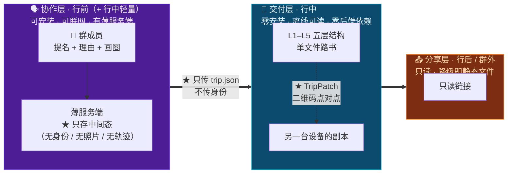
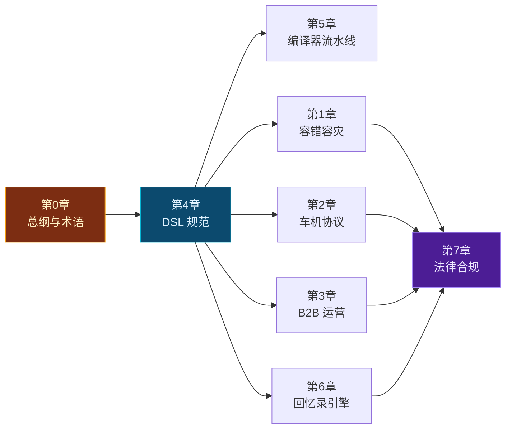

# 第 0 章 · 总纲、设计铁律与术语表

> **文档地位**：本章是《TripCraft 终极执行全书》的宪法层。后续所有章节的技术决策，凡与本章十条铁律或三条责任边界冲突者，一律以本章为准。
>
> **前置阅读**：`README.md`（产品与商业白皮书）
> **本书版本**：`1.0.0` ｜ **对应 DSL 版本**：`1.0.0` ｜ **对应母本**：西行计划 v4.2.0

---

## 0.1 本书的定位：从"愿景"到"可施工图纸"

白皮书回答的是**「为什么做、做什么、卖给谁」**；本书回答的是**「具体怎么造、边界在哪、失败了怎么办」**。

| 维度 | 白皮书 (`README.md`) | 执行全书（本书） |
| :--- | :--- | :--- |
| 抽象层级 | 战略 / 愿景 / 商业 | 协议 / Schema / 算法 / 状态机 |
| 交付物 | 商业计划、IP 确权 | 可编码的规范、可校验的 Schema、可测试的判据 |
| 验收方式 | 投资人点头 | `ajv validate` 通过、流水线跑通、降级测试全绿 |
| 对模糊的态度 | 允许保留想象空间 | **不留模糊**：凡是没想清楚的，必须显式标注 `TODO(P0)` 与验证方式 |

**本书的一条硬规矩**：任何无法用「输入 → 算法 → 输出 → 失败态」四段式描述清楚的设计，都不允许写进本书。宁可标注为未决，也不写成正确但空洞的散文。

---

## 0.2 十条设计铁律 (The Ten Ironclad Rules)

这十条是从西行计划 v4.2.0 母本实战中提炼的、**已经过真实西北自驾验证**的工程约束。违反任何一条，都会导致产品在真实场景中崩塌。

### 铁律 1 · 零构建交付 (Zero-Build Delivery)

**产物是一个双击就能打开、扔进任何静态托管就能跑的 HTML 文件。** 没有 `npm run build`，没有 webpack，没有 polyfill 编译期降级。
- 允许：原生 ESM、原生 CSS 变量、原生 `<script type="module">`。
- 禁止：任何需要构建步骤才能产出可运行产物的技术选型。
- **理由**：目标用户（地接社调度员、独立领队）不会配 Node 环境。一个需要"先装 Node"的工具，在 B 端推广中会死掉 90% 的转化。

### 铁律 2 · 单文件优先，渐进增强 (Single-File First, Progressive Enhancement)

**核心体验必须在单文件内 100% 可用；一切联网能力都是增强项，不是前提项。**
- 判据：把一个完整的路书 HTML 拷到断网的 U 盘上，用离线电脑打开，**必须能看到完整行程、能切换天数、能看海拔剖面、能打卡记账**。
- 违反案例：把行程正文放在 `fetch('data.json')` 里 —— 断网即白屏，**绝对禁止**。

### 铁律 3 · 降级不可耻，白屏才是罪 (Degrade, Never Blank)

任何外部资源（地图 SDK、瓦片、字体、图片 CDN、第三方 API）的加载失败，**都必须有一条已经写好的降级视图**，而不是留一块空白或一个转圈。
- 母本已验证：西行计划在地图 SDK 加载失败时，页面顶部升起橙色横幅「高德地图正在离线/降级模式运行中」，且**整个行程内容依然完整可读**。这是本铁律的现实范例。
- 实现要求：每个外部依赖必须配对声明 `onerror` / `Promise.race(timeout)` 处理器与降级渲染函数。

### 铁律 4 · 数据主权本地化 (Local Data Sovereignty)

**个人敏感数据（身份证、护照号、真实姓名、精确住址、照片原图、定位轨迹）默认不出设备。**
- 加密后才允许随路书分发（见 [第 3 章 §3.5](03-b2b-agency-operations.md)）。
- 照片回忆录引擎（[第 6 章](06-memory-journal-engine.md)）**全程本地处理**，零上传。
- **法理依据**：《个人信息保护法》最小必要原则。同时这也是**最强的产品卖点**——"你的全家身份证号从来没有离开过你的手机"。

### 铁律 5 · 无后端可运行 (Backendless by Default)

**C 端 100% 无需后端。** 编译器在浏览器里跑，路书是静态文件，运行时零请求。
- **唯一例外，且必须显式标注**：B2B 白标配置托管、CPS 分佣结算、跨设备云同步 —— 这三项需要极薄服务端（Cloudflare Workers + D1 量级），见 [第 3 章 §3.8](03-b2b-agency-operations.md)。
- **红线**：绝不允许 C 端核心路书体验依赖服务端存活。服务端挂了，已分发的路书必须照常工作。

### 铁律 6 · DSL 是唯一真相源 (Single Source of Truth)

行程数据只存在于 `trip.json`（TripCraft DSL）中。HTML 是它的**编译产物**，不是它的副本。
- 修改行程 = 修改 DSL + 重新编译。**禁止手工编辑生成的 HTML**。
- 编译产物头部写入内容指纹（`<meta name="tripcraft:hash">`），用于校验产物与 DSL 是否一致。

### 铁律 7 · 事实与建议分离 (Fact vs. Advice)

系统输出的每一句话，必须能归类为**事实**（POI 坐标、营业时间）或**建议**（"建议上午去""推荐这家"）。二者在法律与 UI 上必须可区分。
- 这是 [第 7 章](07-legal-and-compliance.md) 免责体系的技术基础设施。
- 实现：DSL 中 `fact` 与 `advice` 使用不同字段承载，UI 上用不同视觉权重呈现。

### 铁律 8 · 拒绝静默失败 (Never Fail Silently)

所有 `try/catch` 必须至少产生一个可见信号（控制台 + 降级 UI + 可选的本地错误日志）。
- 母本经验：西北实地出现过 `NaN` 坐标导致的整图渲染崩溃。防 NaN 隔离阀必须常驻。
- 判据：线上出现白屏，必须能从用户端取回一份可诊断的错误快照。

### 铁律 9 · 一切可存证 (Everything Attestable)

关键产物（路书 HTML、分享视频、生成的设计稿）携带可验证的来源指纹。
- 用于：白标路书防篡改、分享素材溯源、恶意抢注时的先验技术举证。
- 见 [第 7 章 §7.7](07-legal-and-compliance.md)。

### 铁律 10 · 代码不是护城河，资产才是 (Code Is Not the Moat)

前端代码在物理上不可能保密。因此**架构上主动分层**：可被抄走的部分开源（建立生态、构成防御性公开），真正的护城河放进服务端或放进**不在代码里的东西**（地接社独家资源、车厂授权、用户网络效应）。
- 详见 [第 7 章 §7.8](07-legal-and-compliance.md)。

### ★ 十条铁律的适用边界（2026-10-08 增补）

**铁律 1、2、3、5 是从[西行计划](https://github.com/JohnMaxwell0123/Trip)母本的**单文件形态**中提炼的。当产品形态明确为**协作 / 交付 / 分享三层**（见 [第 15 章](15-multi-device-and-collaboration.md)）之后，必须写清楚它们**管哪一层**——否则会被误读成"整个产品不能有后端"，从而连带取消掉协作层。**

| 铁律 | 适用于 | 不适用于 | 说明 |
| :--- | :--- | :--- | :--- |
| **1 零构建交付** | 交付层 | 协作层 | 「用户不该为了**看一份路书**而安装任何东西」——**这句话一个字不用改** |
| **2 单文件优先** | 交付层 | 协作层 | 判据不变：拷到断网 U 盘上，必须完整可读 |
| **3 降级不可耻** | ★ **全部三层** | —— | 协作层加载失败时，必须降级为"没有协作功能的纯路书"，**而不是白屏** |
| **4 数据主权** | ★ **全部三层** | —— | ★ **加强**：协作层里流动的只有「想去哪」和「为什么」，**身份、照片、轨迹永不进入** |
| **5 无后端可运行** | **交付层** | 协作层 | ★ 原例外清单里的「跨设备云同步」被**提升为协作层的常规能力**；但**红线一字不变**：协作层全挂，已分发路书照常工作 |
| **6 DSL 唯一真相源** | ★ **全部三层** | —— | ★ **三层能用同一份 DSL 通信，正是它们能拆开的前提** |
| **7 事实与建议分离** | ★ **全部三层** | —— | ★ **扩展**：协作场景出现第三个类别「**同行者提议**」，必须与事实、系统建议在视觉上可区分 |
| **8 拒绝静默失败** | ★ 全部三层 | —— | 不变 |
| **9 一切可存证** | ★ 全部三层 | —— | 不变 |
| **10 代码不是护城河** | ★ 全部三层 | —— | ★ 协作层的网络效应（一群人的共同决策记录）**属于"不在代码里的东西"** |

> 🔑 **这张表里最重要的一行是「铁律 5」那一行。**
>
> **它既没有废除，也没有放宽——它只是被收窄到了它本来就该管的范围。**
>
> 原文的红线写的是「**绝不允许 C 端核心路书体验依赖服务端存活**」——**注意它约束的对象是"路书体验"，不是"所有体验"。** 协作层从来不在它的管辖范围内，只是以前产品形态没定，所以才被含糊地一起读成了"不能有后端"。

> ⚠️ **没有新增第十一条铁律。** [第 15 章](15-multi-device-and-collaboration.md)里那条"交付层永远不依赖协作层"，**就是铁律 5 红线在形态确定后的自然表述**，不是新规则。

---

## 0.3 三条责任边界线（"TripCraft 不是"清单）

**这一节是全书法务安全的地基。** 产品对外的一切措辞、UI 文案、API 命名、营销材料，都不得跨越以下三条线。

| # | 边界 | 错误表述 ❌ | 正确表述 ✅ | 法理理由 |
| :-- | :--- | :--- | :--- | :--- |
| 1 | **不是导航软件** | "跟随本路书导航" / "本系统为您导航" | "本路书为行程规划参考，实际行车请以车辆导航系统与现场交通标识为准" | 一旦声称导航，即落入导航服务提供者的注意义务与产品责任范围 |
| 2 | **不是旅行社** | "我们为您安排""保证预约成功" | "本路书为信息整理工具；预订与履约由持牌旅行社/商家提供" | 规避《旅游法》项下旅游经营者责任；对话中的地接社是独立责任主体 |
| 3 | **不是 OTA** | "在本站购买""在线下单" | "跳转至第三方平台完成交易" | 规避《电子商务法》平台经营者责任与资金存管义务 |

**实施细则**：
1. 全站文案审查清单（Checklist）纳入 CI —— 生成的 HTML 中出现"导航""保证""承诺"等词时告警；
2. 数据字段命名隔离：DSL 中禁止出现 `navigation`，一律使用 `routeReference`；禁止 `guarantee`，一律 `expected`；
3. 营销材料同样受约束 —— 白皮书中的"一键直发车机智驾"在对外话术中必须表述为**"将路线交到车机导航手中"**，而非"激活 NOA"（NOA 的激活是车辆域控制器的独立决策，TripCraft 无此权限，见 [第 2 章](02-cockpit-protocol.md)）。

> ⚠️ **对白皮书的修正建议**：README §2.4 中「直接激活高速/城市领航辅助驾驶（NOA）」与「一键注入车机底层导航」的表述，跨越了边界线 1。建议在本轮文档同步时修正为「将全天多节点路线批量交付至车机导航应用，由车机在满足条件时自行进入领航辅助状态」。

---

## 0.4 系统分层总览

```mermaid
flowchart TB
    subgraph L5["L5 · 接入层 · Access"]
        A1["单文件 HTML<br/>(主交付物)"]
        A2["车机中控 HUD 版"]
        A3["微信/二维码/短链分发"]
        A4["白标专属域名 + 密码锁"]
    end

    subgraph L4["L4 · 运行时层 · Runtime (纯前端, 零依赖)"]
        R1["降级状态机<br/>resilience.js"]
        R2["地图适配器<br/>AMap ⇄ SVG骨架"]
        R3["时空折叠渲染器"]
        R4["本地持久层<br/>IndexedDB + Cache"]
        R5["车机桥<br/>CockpitBridge"]
    end

    subgraph L3["L3 · 编译器层 · Compiler (可跑在浏览器/Node)"]
        C1["Parse & Validate"]
        C2["Normalize & Resolve"]
        C3["Enrich (在线增强)"]
        C4["Fold & Layout"]
        C5["Render & Inline"]
        C6["Seal (指纹/签名)"]
    end

    subgraph L2["L2 · 契约层 · Contract"]
        D1["TripCraft DSL v1.0.0"]
        D2["TripPatch 增量补丁"]
        D3["Brand 品牌包"]
    end

    subgraph L1["L1 · 数据源层 · Sources"]
        S1["高德 Web 服务<br/>(算路/POI/地理编码)"]
        S2["用户输入<br/>(自由倾倒/点选)"]
        S3["地接社资源库<br/>(特许/通达性/情报)"]
        S4["OTA 联盟 API<br/>(CPS 授权数据)"]
    end

    L1 --> L2 --> L3 --> L4 --> L5

    style L1 fill:#1a2233,stroke:#3b82f6,color:#e2e8f0
    style L2 fill:#1a2233,stroke:#8b5cf6,color:#e2e8f0
    style L3 fill:#1a2233,stroke:#06b6d4,color:#e2e8f0
    style L4 fill:#1a2233,stroke:#10b981,color:#e2e8f0
    style L5 fill:#1a2233,stroke:#f59e0b,color:#e2e8f0
```

**分层不变量（Invariants）**：
1. **依赖单向向下**：L4 不得反向依赖 L3，L3 不得依赖 L4。编译器不感知运行时。
2. **L2 是唯一跨层语言**：任何跨层传递都必须先序列化为 DSL / Patch / Brand 三者之一。
3. **L1 可全部缺失**：`S1`/`S4` 不可达时，系统必须依然能从 `S2`/`S3` 产出可用路书（这就是铁律 3 在架构上的体现）。

### 0.4.1 ★ 2026-10-08 增补：图外的那一层

> ⚠️ **上图描述的是「一份路书」的五层结构。它描述不了「一群人怎么共同产出这份路书」——那一部分在图上根本不存在。**
>
> 这个缺失不是遗漏，是**产品形态长期没被论证**留下的空洞。补齐见 [第 15 章](15-multi-device-and-collaboration.md)。

**分层不变量（续）**：

4. 🔴 **交付层永远不依赖协作层。** 协作层的服务端全部消失，已分发的路书**必须照常工作**，且依然能通过 TripPatch 点对点更新。
5. ★ **三层之间只通过 L2 通信。** 协作层产出的是一份 `trip.json`，不是一段代码、不是一个 API 调用——这是[铁律 6](00-overview-and-glossary.md#铁律-6--dsl-是唯一真相源-single-source-of-truth) 第二次变成架构红利。

---

## 0.5 术语表 (Glossary)

术语一旦在此定义，全书及后续代码命名必须严格统一。**中英对照用于代码标识符与文档表述映射。**

### 5.1 契约与数据

| 中文 | 英文 / 代码标识符 | 定义 | 易混淆点 |
| :--- | :--- | :--- | :--- |
| 路书 | Roadbook / `roadbook` | 最终交付给旅行者的单文件 HTML 应用 | 不叫 "trip"，`trip` 专指 DSL 实例 |
| 行程数据契约 | TripCraft DSL / `trip.json` | 描述一次完整行程的 JSON 文档，符合 `spec/trip.schema.json` | 是**输入**，不是产物 |
| 行程实例 | Trip / `trip` | 一份 DSL 文档所描述的那一次具体旅行 | |
| 节点 | Node / `node` | 行程中的一个原子单元（景点/赶路/用餐/住宿…） | **不是** DOM 节点 |
| 节点类型 | NodeType | `poi` \| `transit` \| `meal` \| `stay` \| `activity` \| `rest` \| `service` \| `customs` \| `note` | |
| 硬锚点 | Hard Anchor / `anchor` | 不可移动的时间/空间约束（机票、已锁门票、酒店） | 与「软锚点 soft anchor」区分 |
| 刚性度 | Rigidity | `rigid` \| `soft` \| `flexible`，描述节点可被调整的程度 | 不是 CSS 的 `!important` |
| 弹性日 | Buffer Day | 可吸收 ±1 天延误的缓冲日（通常是纯赶路日或机动日） | |
| 应力吸收 | Stress Absorption | 行程遭遇扰动时，优先由弹性日/弹性格来吸收，而非重排全表 | 核心算法见第 1 章 |
| 影响域 | Blast Radius | 一次扰动所波及的最小节点集合 | |
| 熔断预案 | Fuse / `fuse` | 预定义的分级降级方案（计划A/弹性缓冲/降级预案） | 借用电路熔断隐喻 |
| 时空折叠 | Spatiotemporal Folding / `folding` | 把长距离赶路段折叠为可展开的摘要块 | UI 概念，不是数据结构压缩 |
| 增量补丁 | Trip Patch / `patch` | 对已分发路书的最小化修改指令集（RFC 6902 风格） | 见第 1 章 §1.9 |
| 品牌包 | Brand Package / `brand.json` | 地接社的白标配置（Logo/电话/导游/配色） | |
| 特许资源 | Privilege | 线下稀缺资源（报备通道/配额/锁座/泊位） | 不是权限系统里的 privilege |

### 5.2 人群与决策

| 中文 | 英文 / 代码标识符 | 定义 |
| :--- | :--- | :--- |
| 人群分组 | Party Group / `group` | 具有共同偏好的成员集合：`senior` \| `adult` \| `child` \| `driver` \| `mobility` |
| 满意度函数 | Satisfaction Function | 某个节点对某人群的适配度评分，值域 `[0,1]` |
| 硬约束 | Hard Constraint | 一票否决条件（限高、海拔医学禁忌、营业时间） |
| 价值锚定问题 | Value Anchor Question | Socratic 引擎中**不问事实、只问权衡函数**的那类提问 |
| 轮转公平 | Round-Robin Fairness | 冲突不可调和时，输出「分时队列」而非二选一 |
| 待定容忍 | Tentative Tolerance | 对用户未决定项不追问，注入最佳实践并打 `tentative` 标记 |

### 5.3 车机与通信

| 中文 | 英文 / 代码标识符 | 定义 |
| :--- | :--- | :--- |
| 座舱桥 | Cockpit Bridge / `CockpitBridge` | 手机端向车机下发数据的统一适配层 |
| 通道层级 | Tier | `T0` 深链 → `T1` 二维码中继 → `T2` 局域网直连 → `T3` 车厂生态合作 |
| 意图仲裁队列 | Intent Arbitration Queue | 副驾/后排推送请求的排队与安全门控机制 |
| 安全门 | Safety Gate | 依据行驶状态决定推送是立即、延迟还是拒绝 |
| 补能雷达 | Charge Radar | 结合 SOC、爬坡电耗、桩位功率的充电规划器 |
| SOC | State of Charge | 动力电池剩余电量百分比 |

### 5.4 降级与容错

| 中文 | 英文 / 代码标识符 | 定义 |
| :--- | :--- | :--- |
| 降级等级 | Degradation Level / `DL` | `DL0` 全功能 → `DL1` 弱网 → `DL2` SDK失联 → `DL3` 完全离线 → `DL4` 存储受损 |
| 骨架地图 | Skeleton Map | 编译期内联的自绘 SVG/Canvas 矢量路线图，完全离线可用 |
| 探针 | Probe | 周期性探测外部依赖健康度的轻量检测器 |
| 最后已知值 | Last Known Value / `LKV` | 断网时显示的、带时间戳的最后一次成功获取的数据 |
| 静默切换阈值 | Silent Switch Threshold | 重算后若劣化低于阈值则自动切换而不打扰用户 |

### 5.5 旅后资产

| 中文 | 英文 / 代码标识符 | 定义 |
| :--- | :--- | :--- |
| 回忆录 | Memory Journal | 行程结束后由照片+轨迹生成的交互式画卷或短视频 |
| 轨迹吸附 | Snap-to-Track | 将照片 GPS 坐标投影到行程轨迹上的算法 |
| 照片簇 | Photo Cluster | 时空邻近照片的聚合单元，地图上显示为一个聚合图钉 |
| 关键帧脚本 | Keyframe Script | 描述 15~30s 视频时间轴的声明式结构 |

### 5.6 形态与协作（2026-10-08 新增）

> 📌 **这一组术语是[第 15 章](15-multi-device-and-collaboration.md)引入的。它们的定义必须严格区分——因为把它们混为一谈，正是"最终产物是一个静态网页"这个误区成立的原因。**

| 中文 | 英文 / 代码标识符 | 定义 | 易混淆点 |
| :--- | :--- | :--- | :--- |
| **协作层** | Collaboration Layer | 行前（+ 行中轻量）多人共同提出需求与景点的那一层。**可以有薄服务端**，只存中间态 | **不是**"产品的主体"——它只是三层之一 |
| **交付层** | Delivery Layer | 行中真正被读的那份路书。**零安装、离线可读、零后端依赖** | ★ **这才是"路书"，[§0.5.1](#51-契约与数据) 的定义不变** |
| **分享层** | Sharing Layer | 行后 / 向群外分发的那一层，只读 | 与"协作层"的区别是**单向** |
| **产物** | Artifact | 交付层的内容本体（单文件 HTML） | ★ **不等于"产品"**——这是本章勘正的核心 |
| **提名** | Nomination | 群成员提出一个想去的地点/需求，**必须携带理由** | 不是"投票"，**不带裁决语义** |
| **同行者提议** | Peer Suggestion | ★ **第三类信息**：由群成员提出、未经核验的景点建议。既非事实，也非系统建议 | 见 [铁律 7](00-overview-and-glossary.md#铁律-7--事实与建议分离-fact-vs-advice) 的扩展；UI 上必须与事实/建议**三方可区分** |
| **行程空间** | Trip Space | ★ 协作层的单位：**一个行程一个空间**，不是账号、不是社区 | ★ **像"群"，不像"平台"** |
| **中间态** | Intermediate State | 协作层里唯一被允许持久化的东西：提名、理由、合并结果 | 一切 PII 与照片轨迹**永不进入**（[铁律 4](00-overview-and-glossary.md#铁律-4--数据主权本地化-local-data-sovereignty)） |

> 🔑 **「产物 ≠ 产品」是这一组里最需要记住的一条。**

---

## 0.6 章节地图与阅读路径

**按角色的推荐阅读路径**：

| 角色 | 必读 | 选读 |
| :--- | :--- | :--- |
| **前端工程师（动手写代码）** | 第 4 章 → 第 5 章 → 第 1 章 §1.1~1.6 | 第 6 章 |
| **产品/交互设计** | 第 0 章 → 第 1 章 §1.7~1.8 → 第 2 章 §2.6 | 第 3 章 |
| **BD / 商务谈判** | 第 2 章 §2.1~2.2 → 第 3 章 → 第 7 章 §7.5 | 第 0 章 §0.3 |
| **法务 / 风控审查** | 第 7 章 → 第 0 章 §0.3 | 第 3 章 §3.5 |
| **车厂技术对接** | 第 2 章 → 第 4 章 §4.9 | 第 5 章 §5.7 |
| **协作层 / C 端形态设计** | ★ **[第 15 章](15-multi-device-and-collaboration.md)** → 第 10 章 → 第 8 章 §8.8 | 第 9 章 → 第 11 章 |

---

## 0.7 未决事项登记册 (Open Issues Register)

本书坚持"不留模糊"。以下是当前**已知的、尚未有确定结论**的技术问题，每条附验证方式与责任章节。**任何一条在代码开工前未闭环，都构成项目风险。**

| ID | 未决事项 | 风险 | 验证方式 | 章节 | 优先级 | 状态 |
| :--- | :--- | :--- | :--- | :--- | :--- | :--- |
| OI-001 | `amapuri://route/plan/` 途经点参数的确切格式与**数量上限** | 车机下发链路 T0 通道能否成立 | 真机实测（Android/iOS 各 3 款机型） | §2.3 | **P0** | 🟡 **格式已确认，上限未测** |
| OI-002 | 车机中控浏览器对 WebRTC DataChannel / Web Bluetooth 的支持率 | T2 局域网直连方案可行性 | 实车抽样测试 10 款主流车型 | §2.4 | P1 | ⏳ 未决 |
| OI-003 | 高德服务条款对"算路结果存储"的确切许可边界 | 骨架地图与离线包的合规基础 | 法务逐条比对 + 高德商务书面确认 | §1.3 / §7.3 | **P0** | ✅ **已收敛** |
| OI-004 | Safari 对 WebCodecs `VideoEncoder` 的 H.264 支持现状 | 回忆录视频能否在 iOS 端本地生成 MP4 | 特性检测 + 真机矩阵测试 | §6.6 | P1 | 🟡 **版本已确认，实机未测** |
| OI-005 | 微信图片传输剥离 Exif 的实际行为与可绕过性 | 回忆录照片定位成功率 | 真机传输测试 20 组样本 | §6.2 | **P0** | ✅ **已收敛** |
| OI-006 | 各地接社对 PII 本地加密方案的接受度 | B2B 报备流程能否走通 | 3 家地接社实地访谈 | §3.5 | P1 | ⏳ 未决 |
| OI-007 | 高德 JS API 免费额度商用（B2B 白标）的授权要求 | B2B 业务的直接成本项 | 高德开放平台商务咨询 | §7.3 | **P0** | ⏳ 未决（**商务动作**） |
| OI-008 | 现有 LICENSE (MIT) 与白皮书"禁止商用"声明的法理冲突 | 开源资产的法律确定性 | 见 §7.6 的整改方案 | §7.6 | **P0** | ⏳ 未决（**需业主决策**） |
| **OI-009** | **HEIC 解析路径的最终选型**（libheif WASM vs 引导转 JPEG） | iPhone 用户照片落点率 | 真机测 500KB 组件加载耗时 + 解码成功率 | §6.4.1.1 | **P0** | ⏳ 新增 |

#### ★ 设计轨引出的未决项（2026-10-07 新增）

> 📌 **下面四条与 OI-001~009 性质不同。** 前九条是**外部事实不确定**（第三方行为、法条、浏览器能力）；**这四条是内部设计尚未收敛**——它们不是"要去查"，而是"要去做决定"。

| ID | 未决事项 | 风险 | 收敛方式 | 章节 | 优先级 | 状态 |
| :--- | :--- | :--- | :--- | :--- | :--- | :--- |
| **OI-010** | **五视角「为你」卡片的内容从哪来**：① 新 schema 字段（人工/编辑标注）② 从现有字段规则派生 ③ 生成时 AI 产出 | ★ **直接决定 `trip.schema.json` 是否需要升版**——[§11](11-audience-adaptive-rendering.md) 要求的数据，当前契约里没有 | 逐条试写 20 条卡片，看有多少能从现有字段派生、多少必须新增 | §11.3.2 | **P0** | ⏳ 新增 |
| **OI-011** | **「日强度」的量化定义**（[§10.5.3 节奏条](10-roadbook-reading-design.md#1053-行前模式)的横轴是什么） | 节奏条是行前模式最有价值的组件，但**"满"没有定义就无法实现** | 拿 3 份真实行程人工排序，反推哪种口径（里程／行车时长／起床时间／停留数）与人的直觉最吻合 | §10.5.3 / §10.2.2 | P1 | ⏳ 新增 |
| **OI-012** | **行业默认值库的范围与维护责任**（[§8.7.1](08-socratic-interaction-design.md#871-先把三种不知道分开)「真未定 → 注入行业默认」依赖的那个库） | 库不存在则"待定项自动填充"无法实现，用户仍会被追问 | 先按母本《西行计划》的实战数据建最小可用集，再定义扩展机制 | §8.7 | P1 | ⏳ 新增 |
| **OI-013** | **主题 × 流派兼容矩阵的维护责任**（[§9.1.3](09-visual-design-system.md#913-兼容性矩阵-本节的核心产出)） | 矩阵一旦与实现脱节，用户会选到"产品说能配、实际很丑"的组合 | 把矩阵写进 `config/`（与 [`deeplink-profiles.json`](02-cockpit-protocol.md#232--深链的不确定性必须隔离在数据里而不是代码里) 同思路），并要求**新增任一主题或流派时必须同时提交矩阵改动** | §9.1.3 | P2 | ⏳ 新增 |

#### ★ 商业轨引出的未决项（2026-10-07 第二轮·新增）

| ID | 问题 | 为什么它是问题 | 收敛方式 | 出处 | 优先级 | 状态 |
| :--- | :--- | :--- | :--- | :--- | :--- | :--- |
| **OI-014** | **B 端首发定价与计费单位**（按团 / 按月 / 按年 / 按席位；免费档的边界在哪） | 定价单位选错会**直接抑制产品核心价值的实现方式**——按次计费会让定制师为了省钱而少试版本，而"反复试"正是产物的质量来源（[§13.9.2](13-agency-partnership-design.md#1392-计费单位四个选项只有一个是对的)） | ⚠️ **不是算出来的，是谈出来的**：带"两份路书并排"的动作去谈前 3–5 家社，看他们愿意为什么付钱 | §13.9 | P1 | ⏳ 新增 |
| **OI-015** | **路书云 / 指南猫的 AI 化速度，以及它们的集中式数据架构能否转身支持「私有层不可见」** | 🟡 **已重新定性**。原判断为「如果已接入，则 AI 生成不再是差异」——**该判断作废**：业主确认 AI 生成是入场券而非价值主张，它本来就不承担差异化的任务（[§13.8.5](13-agency-partnership-design.md#1385--ai-生成行程是入场券不是差异)）。**真正待答的问题变成了：友商的架构（机构知识库 / 共享 POI 库）能否支持 [§13.6 的私有层](13-agency-partnership-design.md#136--网络效应什么该共享什么该私有)** | 查两家产品文档与更新日志，**重点看数据可见性模型，不是看有没有 AI** | §13.8.5 / §13.6 | P1 | ⏳ 已重新定性 |
| **OI-016** | **TripCraft 是否构成"为无证经营提供便利"**（[§13.5.4](13-agency-partnership-design.md#1354--一个必须先回答的问题他有资质吗)） | 执法口径明确"提供引流、收款、客源对接等便利的，一并查处"——**这条决定了白标能力能不能默认开启** | ★ **必须由执业律师就本项目具体情况出具意见**；在意见出具前，按 G-24~G-27 执行风险控制。⚠️ **[§15](15-multi-device-and-collaboration.md) 之后风险范围已扩大，见下方 OI-017** | §13.5.4 / §7.11 / §15.8.2 | **P0** | ⏳ 新增（法务动作） |

#### 🔴 协作轨引出的未决项（2026-10-08 新增）

> 🔴 **这一组只有一条，但它是全书第二个 P0——而且它和 OI-016 是同一个法律问题的两个面。**

| ID | 问题 | 为什么它是问题 | 收敛方式 | 出处 | 优先级 | 状态 |
| :--- | :--- | :--- | :--- | :--- | :--- | :--- |
| **OI-017** | 🔴 **协作层的 UGC 责任边界**：群成员提交的景点与文字，平台负什么责任？尤其是**"野景点"被结构化排进路书**这一情形 | ★ **[第 7 章](07-legal-and-compliance.md)的整套免责体系没有覆盖它**——因为 §7 的全部设计都假设"内容是 AI 生成的或地接社提供的"。而协作层引入了第三类内容：**用户提交、未经核验、却被我们的产物以编辑形式呈现**。同时，[§15.8.2](15-multi-device-and-collaboration.md#1582--为什么群让-oi-016-升级) 已论证：**"群"这个产品形态把 OI-016 从 B 端风险升级为 C 端风险** | ★ **必须由执业律师出具意见**，且**应与 OI-016 同一次咨询解决**（它们是同一个问题的两面）。意见出具前，按 [§15.8.3](15-multi-device-and-collaboration.md#1583--必须先立住的四条红线) 的 **R1–R4 按最高标准执行，不得放宽** | §15.8 / §7.11 | **P0** | ⏳ 新增（法务动作） |
| **OI-018** | ⚠️ **「同行者提议」在契约里没有家**：[§15.8.3 R4](15-multi-device-and-collaboration.md#1583--必须先立住的四条红线) 要求它与「事实」「系统建议」**三方可区分**，但 [`spec/node.schema.json`](../spec/node.schema.json) 只有 `fact` 与 `advice` 两个对象，而 `advice.generatedBy` 的枚举是 `llm \| human \| hybrid \| crowdsourced` | 🔴 **`crowdsourced` 看起来能覆盖，实际语义相反。**「众包」传达的是**由数量背书的伪权威**（"大家都推荐"），而「姑姑一个人提的点」**权威度为零**。**用错枚举值，比新增一个值危险得多**——因为它把一个未核验的单人提名，渲染成了看起来像共识的东西 | ★ **与 [OI-010](00-overview-and-glossary.md#07-未决事项登记册-open-issues-register) 同一性质的阻塞项**：两者都打在 `trip.schema.json` 上。**必须在 v1.0.0 冻结前一起解决**——新增第三个类别（还是给 `advice` 加一个强制的来源判别字段），决定了 R4 能不能被执行 | §15.8.3 / §4 | **P1** | ⏳ 新增（**阻塞 schema**） |

> 🔴 **OI-016 与 OI-017 是这里仅有的两个 P0，性质与其他各条都不同：**
>
> - **它们都是"可能有法律责任"的合规问题**——收敛方式不是研究，是**咨询律师**。
> - ★ **而且它们是同一个问题的两面，应当同一次咨询解决**：OI-016 问的是"我们为**旅行社**提供工具算不算便利"，OI-017 问的是"我们自己的**协作层**算不算"。**§15.8.2 已论证后者把前者升级了。**
> - **OI-015 已从 P0 降为 P1。** 降级的原因是它的问题被重新定义了：**AI 生成是入场券，不是价值主张**（[§13.8.5](13-agency-partnership-design.md#1385--ai-生成行程是入场券不是差异)），因此"对手有没有接入大模型"不影响我们的差异化论述。**剩下的部分——"对手的集中式架构能否支持私有层"——仍值得查，但它是竞争态势变量，不是论述根基。**

> 🔴 **OI-010 是这四条里唯一阻塞性的。**
>
> 因为它决定的是**数据契约的形状**——而契约一旦发布，改动成本远高于其他任何一层。
>
> **当前 `spec/trip.schema.json` 是在设计轨写出来之前定的**，它里面**没有任何一个字段能表达"这个点对长辈意味着什么"**。如果 §11 的「为你」卡片确实需要落进数据，那就必须在 v1.0.0 冻结之前改。
>
> **这正是 [§11 → §4 那条虚线](README.md#章节地图)要表达的意思：设计定义数据需求。**

### 状态含义

| 标记 | 含义 |
| :--- | :--- |
| ✅ **已收敛** | 已有确定结论，可直接指导实现 |
| 🟡 **部分收敛** | 桌面查证能确定的部分已确定；**剩余部分必须真机实测** |
| ⏳ 未决 | 尚无结论 |

### ★ 三条已收敛项的结论摘要

| OI | 结论 | 依据 |
| :--- | :--- | :--- |
| **OI-003** | 实时展示算路结果 ✅ 可以；**落库存储 ❌ 需书面许可**。且高德官方 FAQ 明文「JSAPI 地图接口和数据均不支持离线使用」 | [§1.3.2](01-resilience-and-failover.md#132--高德离线与缓存官方原文核查2026-10-07)、[§7.8.1](07-legal-and-compliance.md#781--br-025地图数据不得落库oi-003-收敛后的新增规则) |
| **OI-005** | **原图 = 保留 Exif；非原图 = 压缩剥离。** 不再有"部分保留"这个模糊状态 | [§6.4.2](06-memory-journal-engine.md#642--微信原图与-exif-的现实2026-10-07-核查版) |
| **OI-001** | 高德 App 用 **`vian` / `vialons` / `vialats` / `vianames`** 四个配对参数（竖线分隔）；百度用 **`viaPoints`**（`encodeURIComponent` 后的 JSON 串）。**⚠️ 但两家均未公布途经点数量上限** → 采用保守分批（≤4 点/段） | [§2.3.2](02-cockpit-protocol.md#232--深链的不确定性必须隔离在数据里而不是代码里) |

> ⚠️ **注意 OI-001 只收敛了一半。** 参数格式可以查到，但**数量上限是官方未公开的**——这意味着**分批策略不能靠"查到上限然后贴着上限发"来确定，只能靠实测**。这是一个必须诚实保留的不确定性。

---

> **下一章**：[第 4 章 · TripCraft DSL v1.0.0 规范](04-dsl-specification-v1.md) —— 先定契约，再定实现。这是全书的技术起点。
