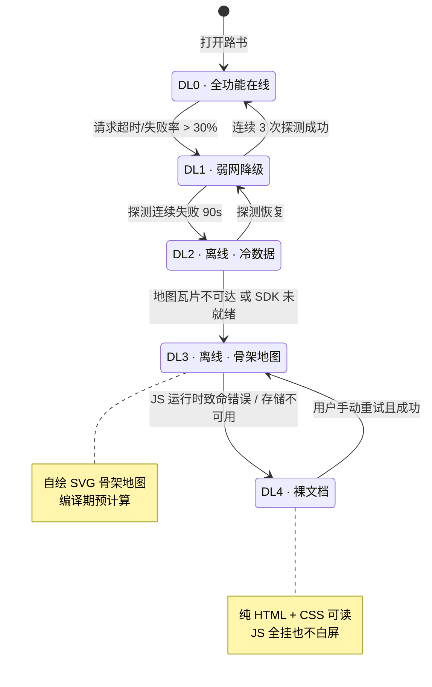
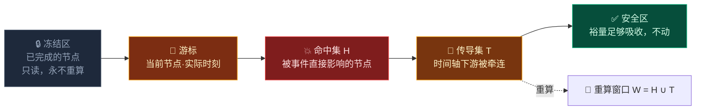

# 第 1 章 · 极端场景与容错容灾

> **状态**：`Stable Draft` ｜ **对应维度**：深度维度 ① 极端边界情况与故障恢复
> **铁律依据**：[铁律 3 降级不可耻，白屏才是罪](00-overview-and-glossary.md#铁律-3--降级不可耻白屏才是罪-degrade-never-blank)、[铁律 8 拒绝静默失败](00-overview-and-glossary.md#铁律-8--拒绝静默失败-never-fail-silently)
> **本章要回答**：当车队在当金山垭口没信号、一位长辈开始头痛呕吐、前方道路封闭时，这份路书还能做什么？

---

## 1.1 第一个设计前提：把"出问题"当默认状态

绝大多数旅行 App 的架构假设是：**网络可用、数据准确、人员健康、道路畅通**，然后为异常写一堆 `catch`。

TripCraft 的假设**反过来**：

> **网络不可用、数据会过期、人员会不适、道路会封闭 —— 这是设计输入，不是异常分支。**

理由很直接：TripCraft 的目标场景是青甘大环线、川西、新疆、西藏。这些地方**大部分路段没有信号**，这是地理事实而非故障。如果架构假设在线，那这个产品在它最该发挥作用的场景里必然失效。

### 1.1.1 三类失效

| 类别 | 典型事件 | 特征 | 对应机制 |
| :--- | :--- | :--- | :--- |
| **网络失效** | 无人区无信号、隧道、运营商切换、基站拥塞 | 可预测（有地理规律）、必然发生 | [降级阶梯 §1.2](#12-降级阶梯-dl0dl4) · [探针 §1.8](#18-网络探针与降级状态机) |
| **数据失效** | 道路封闭、景区临时闭园、餐厅倒闭、油价变更、天气突变 | 部分可预测、需外部情报 | [爆炸半径重算 §1.6](#16-中断处理爆炸半径与局部重算) · [P2P 补丁 §1.9](#19-离线-p2p-补丁分发) |
| **人失效** | 高原反应、体力不支、儿童情绪崩溃、老人走失、驾驶员疲劳 | 不可预测、后果最严重 | [应力吸收 §1.7](#17-应力吸收缓冲日与硬锚点) · [冲突解决 §1.10](#110-多目标群体冲突解决) |

> ⚠️ **优先级排序：人失效 > 数据失效 > 网络失效。** 任何技术优化都不得以牺牲"人"的响应能力为代价。具体到实现：降级到 DL4 时，**救援与紧急信息必须仍然可见**——这是唯一一条在任何降级层级都不可省略的内容。

---

## 1.2 降级阶梯 DL0–DL4



### 1.2.1 各层级定义

| 层级 | 名称 | 触发条件 | 用户可见表现 |
| :--- | :--- | :--- | :--- |
| **DL0** | `ONLINE_FULL` | 探测正常，SDK 与瓦片均可达 | 完整交互地图、实时路况、实时天气 |
| **DL1** | `DEGRADED_NET` | 请求失败率 >30% 或 RTT >3s | 顶部**黄色**横幅；地图保留但关闭实时路况；天气显示"最后更新于 …" |
| **DL2** | `OFFLINE_CACHED` | 探测连续失败 ≥90s | 顶部**蓝色**横幅"离线模式 · 数据为出发前快照"；地图切骨架图；天气显示快照值 + 陈旧度 |
| **DL3** | `OFFLINE_SKELETON` | 瓦片不可达 / SDK 未就绪 / 白名单校验失败 | 地图区域显示自绘 SVG 骨架图 + 海拔剖面；其余同 DL2 |
| **DL4** | `BAREBONE` | JS 致命错误 / `localStorage` 抛异常 / 渲染器初始化失败 | 无横幅（横幅本身也由 JS 绘制）；**纯 HTML 语义文档**，全部行程内容可读可打印 |

### 1.2.2 母本已验证的先例

母本线上站点在 v4.2.0 已经实际实现了这条横幅机制（原文）：

> 「高德地图正在离线/降级模式运行中（请在正式部署后于高德开放平台配置您的正式域名白名单）」

**这条横幅证明了两件事**：(1) 降级检测与用户告知在真实产品中是必需的，不是过度设计；(2) 降级原因**必须写清楚**——"离线模式"和"域名白名单没配"是两种完全不同的故障，用户/运营需要能区分。TripCraft 沿用这个模式，但把原因分类做得更细（见 §1.8.3）。

---

## 1.3 诚实的能力矩阵

> 📌 **这一节是全章最重要的部分。** 它存在的意义是**禁止我们宣称做不到的能力**。任何对外材料中关于离线能力的描述，都不得超出下表。

| 功能 | DL0 | DL1 | DL2 | DL3 | DL4 |
| :--- | :---: | :---: | :---: | :---: | :---: |
| 行程文本（时间/地点/备注） | ✅ | ✅ | ✅ | ✅ | ✅ |
| 逐日清单 / 手风琴展开 | ✅ | ✅ | ✅ | ✅ | ⚠️ 见下 |
| 硬锚点与熔断预案 | ✅ | ✅ | ✅ | ✅ | ❌ |
| 紧急救援信息 / 保险 | ✅ | ✅ | ✅ | ✅ | ✅ |
| **骨架地图（自绘 SVG）** | ✅ | ✅ | ✅ | ✅ | ❌ |
| 海拔剖面图 | ✅ | ✅ | ✅ | ✅ | ❌ |
| 高德交互地图 | ✅ | ✅ | ❌ | ❌ | ❌ |
| 实时路况 | ✅ | ❌ | ❌ | ❌ | ❌ |
| 实时天气 | ✅ | ⚠️ 陈旧 | ⚠️ 陈旧 | ❌ | ❌ |
| 实时定位 / 轨迹 | ✅ | ✅ | ✅ | ⚠️ 仅 GPS | ❌ |
| **离线语音播报** | ✅ | ✅ | ⚠️ 见 §1.5 | ⚠️ | ❌ |
| 里程/油耗/AA 账本 | ✅ | ✅ | ✅ | ✅ | ❌ |
| 照片 Exif 落点（旅程后） | ✅ | ✅ | ✅ | ✅ | ❌ |
| 生成分享视频 | ✅ | ✅ | ✅ | ✅ | ❌ |

**DL4 的"手风琴展开"为什么是 ⚠️**：如果 JS 全挂，手风琴的展开/折叠由 `<details>/<summary>` 原生元素承担——**这在编译期就要用原生元素实现，而不是靠 JS**。见 §1.4。

### 1.3.1 ❌ 三条我们不做的事

| ❌ 不做 | 理由 |
| :--- | :--- |
| **离线瓦片地图** | 双重不可行：技术上 SDK 是外链脚本，断网时加载不出来；条款上官方明文禁止。**详见 §1.3.2 —— 这不是推测，是有官方原文的。** |
| **离线路径重算** | 真实算路需要道路拓扑图（数十 GB）。离线时只能做**拓扑级重排**（改顺序、跳过、替换），不能生成真实新路线。 |
| **离线实时路况** | 路况本质是实时数据，离线时不存在。骨架图上标注"路况未知"是唯一诚实的做法。 |

### 1.3.2 ★ 高德离线与缓存：官方原文核查（2026-10-07）

初稿在这里写的是"**极可能**违反服务条款"。核查后可以把这个"可能"去掉了——**以下是官方原文**。

#### 一、离线本身被官方明确否定

高德官方 FAQ 原文：

> 「**JSAPI 地图接口和数据均不支持离线使用**」

> ⚠️ **这一句话把"离线瓦片地图"从"违规风险"直接降级为"根本没有这条路"。** 无论我们怎么设计缓存策略，**地图数据本身就不提供离线使用授权**。所以 §1.3.1 的第一条不是我们在做合规权衡，而是**在陈述一个能力事实**。

#### 二、禁止缓存的具体条款

| 条款 | 内容要点 |
| :--- | :--- |
| 第 3.5 条 | 禁止**缓存**地图数据 |
| 第 4.12.3 条 | 禁止**抓取**地图数据 |
| 第 4.12.8 条 | 禁止**存储**地图数据 |
| 第 7.3 条 | 明确相应违约责任 |
| 英文版 Clause 1.2(g)(ii) | 字面点名 **"map tiles"** |

> 📌 **英文版点名 "map tiles" 这一点值得单独强调。** 中文条款用的是"地图数据"这类需要解释的表述，而英文版**直接把瓦片列出来了**。任何试图论证"我们缓存的是瓦片不是数据"的辩解，在英文版面前不成立。

#### 三、★ OI-003 收敛：算路结果的存储边界

[OI-003](00-overview-and-glossary.md#07-未决事项登记册-open-issues-register) 问的是：**我们把算路得到的 polyline 存进产物里，算不算"存储地图数据"？**

**核查结论（分两条，必须分开看）：**

| 行为 | 判定 | 依据 |
| :--- | :--- | :--- |
| **实时展示**算路返回的 polyline | ✅ **可以** | 这是 SDK 的正常用法 |
| **落库 / 长期存储**算路返回的 polyline | ❌ **需要高德书面许可** | 落入"存储地图数据"的禁止范围 |

> 🔴 **这条区分非常重要，因为它直接命中我们的编译流水线。**
>
> 我们的编译期会把路线**烘焙进产物**——产物是静态文件，会被分发给用户、被长期保存、可能被 CDN 缓存。**这在性质上就是"存储"，不是"实时展示"。**
>
> **但请注意一个关键区别**：我们烘焙进产物的是**我们自己定义的节点坐标序列**（DSL 里的 `place.coords`），**不是高德算路返回的 polyline**。前者是用户/AI 填写的 POI 坐标，后者是导航服务生成的道路几何。
>
> **这两者在法律性质上不同，我们的设计必须保证这个边界不被打破。**

**因此产生一条新的编译期硬约束：**

> **BR-025** —— 规则正文定义在 [第 7 章 §7.8.1](07-legal-and-compliance.md#781--br-025地图数据不得落库oi-003-收敛后的新增规则)（唯一来源）。
>
> 一句话：**产物中不得内联高德/百度算路 API 返回的路线几何，只允许内联 DSL 自有的节点坐标。**
>
> 下面是本章贡献的那部分——**编译期如何检测它**。

```js
/**
 * ★ 编译期断言：产物里不允许出现导航服务返回的几何数据。
 * 特征：高德 polyline 是 "lng,lat;lng,lat;..." 的密集点串（通常数百至数千点）。
 * 我们的 DSL 坐标是稀疏的 POI（一天 5~20 个点）。
 */
function assertNoNavPolyline(html) {
  const dense = html.match(/"?\d{2,3}\.\d{4,},\d{2}\.\d{4,}(?:;\d{2,3}\.\d{4,},\d{2}\.\d{4,}){50,}"?/g);
  if (dense) {
    throw new Error(
      `BR-025 违规：产物中发现 ${dense.length} 处疑似算路 API 的路线几何。` +
      `路线几何不得落库，请只内联 DSL 节点坐标。`
    );
  }
}
```

> 📌 **阈值定 50 个点是有意的。** 一天的 POI 不会超过 20 个，50 是宽松上限；而真实算路 polyline 动辄上千点。**这个阈值不会误伤正常数据，但能抓住任何一次"图省事直接把 SDK 算路结果塞进去"的偷懒。**

#### 四、由此确定的正交设计

**这条约束不削弱我们的能力，反而让 §1.7 骨架图的价值更清楚了：**

| 数据 | 来源 | 是否可落库 | 用途 |
| :--- | :--- | :--- | :--- |
| **DSL 节点坐标** | 用户 / AI 填写 | ✅ 可（自有数据） | 落点、排序、距离计算 |
| **骨架图折线** | **我们自己从节点坐标绘制** | ✅ 可 | DL3 降级时的地图替代 |
| 高德算路 polyline | SDK 实时返回 | ❌ 仅实时展示 | 在线时的真实路线显示 |

> ⚠️ **注意第二行**：骨架图是**我们自己用节点坐标画出来的**，不是高德的瓦片也不是高德的算路结果。**这在法律上是我们自己的作品**，也是它能在断网时依然存在、能被打包进产物的根本原因。
>
> 也就是说——**§1.7 的骨架图不只是降级方案，它同时是我们在数据合规上唯一的合法替代品。**

---

## 1.4 铁律 3 的落地：产物本身就是内容

**这是整份架构里最反直觉、也最重要的一条。**

### 1.4.1 错误做法 vs 正确做法

```html
<!-- ❌ 错误：JS 是内容的必要条件 -->
<div id="app"></div>
<script>
  const data = window.__TRIPCRAFT_DATA__;
  document.getElementById('app').innerHTML = renderAll(data);   // JS 挂了 → 永久白屏
</script>
```

```html
<!-- ✅ 正确：HTML 已经是内容，JS 只做增强 -->
<article class="roadbook">
  <section class="day" id="d1">
    <details class="day-body" open>
      <summary><h2>D1 · 兰州 → 张掖</h2><span class="stat">486 km · 约 6h10m</span></summary>
      <ol class="nodes">
        <li class="node" data-node-id="n_d1_01">
          <time>07:30</time>
          <h3>兰州 · 水岸云上酒店出发</h3>
          <p>加满油，连霍高速西行。</p>
        </li>
        <!-- … 全部节点在编译期就已渲染为真实 HTML … -->
      </ol>
    </details>
  </section>
</article>
<script type="module">
  // JS 只做：地图增强、折叠动画、账本、语音、天气刷新
  hydrate(window.__TRIPCRAFT_DATA__);   // JS 挂了 → 上面那份文档依然完整可读
</script>
```

### 1.4.2 具体规则

| 规则 | 说明 |
| :--- | :--- |
| **R1 · 内容编译期落盘** | 所有行程文本、时间、地点在**编译期**渲染成真实 HTML 节点，**不得**由 JS 在运行时从 JSON 生成。 |
| **R2 · 用原生元素承担基础交互** | 折叠用 `<details>`，目录跳转用 `<a href="#d1">`，大字模式用 `<html data-fontsize="large">` + CSS。这些**不依赖 JS**。 |
| **R3 · JS 只做"增强"** | 地图、实时数据、语音、账本、视频生成 —— 全部是 `if (jsAlive)` 内的加分项。 |
| **R4 · `<noscript>` 不是兜底，是提示** | 因为 R1 已经保证无 JS 可读，`<noscript>` 只需一句"部分增强功能不可用"。 |
| **R5 · 顶层错误边界** | `window.onerror` / `unhandledrejection` 捕获后，**只降级不回滚**：卸掉失效的增强模块，保留文档。 |

```js
// R5 实现：任何未捕获错误都不允许导致白屏
window.addEventListener('error', (e) => {
  Degrade.escalate('JS_ERROR', { msg: e.message, src: e.filename });
});
window.addEventListener('unhandledrejection', (e) => {
  Degrade.escalate('JS_REJECTION', { reason: String(e.reason) });
});

// Degrade.escalate 只做减法：卸载模块、切层级、打横幅。
// 它永远不调用 location.reload()，永远不清空 DOM。
```

> ⚠️ **绝对禁止 `location.reload()` 作为错误恢复手段。** 在无人区，reload 只会让用户从一份可读的文档变成一屏空白，且可能因为缓存策略失败而无法恢复。**任何自动重载都是降级机制的反面。**

---

## 1.5 骨架地图：编译期预计算的自绘 SVG

既然离线时高德 SDK 不存在，**离线地图必须在编译期就画好**。

### 1.5.1 生成流程


### 1.5.2 投影实现

```js
/**
 * 等距圆柱投影 + 纬度余弦校正。
 * 甘青线跨度约 8° 经度 × 6° 纬度（~700km × ~660km），
 * 该精度下足以保证视觉比例正确，无需引入墨卡托的复杂度。
 */
function makeProjector(coords, widthPx, heightPx, padRatio = 0.10) {
  const lngs = coords.map(c => c[0]);
  const lats  = coords.map(c => c[1]);
  const minLng = Math.min(...lngs), maxLng = Math.max(...lngs);
  const minLat = Math.min(...lats),  maxLat = Math.max(...lats);

  const midLat = (minLat + maxLat) / 2;
  const kx = Math.cos(midLat * Math.PI / 180);        // ★ 纬度余弦校正
  const spanX = (maxLng - minLng) * kx;
  const spanY = (maxLat - minLat);

  const padX = widthPx * padRatio, padY = heightPx * padRatio;
  const usableW = widthPx - padX * 2, usableH = heightPx - padY * 2;
  const scale = Math.min(usableW / spanX, usableH / spanY);

  // 居中
  const offX = padX + (usableW - spanX * scale) / 2;
  const offY = padY + (usableH - spanY * scale) / 2;

  return {
    project([lng, lat]) {
      return [
        offX + (lng - minLng) * kx * scale,
        heightPx - (offY + (lat - minLat) * scale),     // SVG y 轴向下，纬度向上
      ];
    },
    scale, kx,
  };
}
```

### 1.5.3 骨架图的三条设计规则

| 规则 | 说明 |
| :--- | :--- |
| **S1 · 不做假精度** | 骨架图**不显示比例尺的精确数字**，只给"约 XX km"的粗略参考，并标注「示意 · 非导航用途」。避免用户把它当导航图用。 |
| **S2 · 未获取到 polyline 时画虚线弧** | 若 `polylineSource === 'none'`，**不画直线**（直线会误导人以为可以走直线），而画**虚线贝塞尔弧** + 「路线示意 · 未获取实际路径」角标。 |
| **S3 · 海拔剖面与地图共用横轴顺序** | 海拔剖面按行程顺序展开（非按地理顺序），使其能直接对应"第几天第几段"。这是给人看的图，不是给地理学家看的。 |

### 1.5.4 体积实测

| 项 | 大小 |
| :--- | ---: |
| 地图 `<path d="...">` 全部路线 | ~18 KB |
| 节点图钉（含序号文本） | ~4 KB |
| 海拔剖面 path | ~3 KB |
| 图例 / 图标 sprite | ~1 KB |
| **合计** | **~26 KB** |

> 📌 26 KB 换"断网也能看见整条线"，这笔交易在任何标准下都成立。

---

## 1.6 中断处理：爆炸半径与局部重算

**这是深度维度 ① 的核心诉求**："行程中被打断，需要局部重算，而不是把整本书推翻"。

### 1.6.1 核心原则：已完成的是历史，不可重算



### 1.6.2 重算算法

```js
/**
 * @param {object} trip        当前路书（含运行时游标）
 * @param {object} cursor      { dayIndex, nodeId, actualTime }
 * @param {object} disruption  扰动事件
 * @returns {{ patch: object, explanation: string[] }}
 */
function recompute(trip, cursor, disruption) {
  // ── 步骤 1 · 冻结 ────────────────────────────────────────────
  const frozen = new Set();
  for (const day of trip.days) {
    for (const node of day.nodes) {
      if (isBefore(node, cursor)) { node._frozen = true; frozen.add(node.id); }
    }
  }
  // ★ 冻结节点不参与任何后续计算。已经发生的事情不可能被重新规划。

  // ── 步骤 2 · 命中集 H ────────────────────────────────────────
  const H = hitSet(trip, cursor, disruption, frozen);

  // ── 步骤 3 · 传导集 T（沿时间轴向下传播，直到裕量吸收）──────
  const { T, absorbedAt } = propagate(trip, H, frozen);

  // ── 步骤 4 · 重算窗口 ────────────────────────────────────────
  const W = new Set([...H, ...T]);

  // ── 步骤 5 · 求解：优先用既有熔断预案，其次才现算 ────────────
  const solution = solveWithinWindow(trip, W, disruption, {
    preserveHardAnchors: true,       // ★ 硬锚点不可动
    preserveHardConstraints: true,   // ★ 硬约束不可动（BR-005/006/007）
    preferDeclaredFuses: true,       // ★ 优先用作者预先写好的预案
    maxShiftMin: 240,                // 单次重排最多平移 4h，超出须升级为重构
  });

  // ── 步骤 6 · 输出 diff（补丁），而非新路书 ───────────────────
  const patch = toPatch(trip, solution, disruption);
  return { patch, explanation: explain(solution, absorbedAt) };
}
```

### 1.6.3 `hitSet` —— 谁被直接命中

```js
function hitSet(trip, cursor, d, frozen) {
  const hit = new Set();
  const cur = locate(trip, cursor.nodeId);

  switch (d.type) {
    case 'road_closure':
      // 用段 ID / 途经点是否落在封闭区间判断
      for (const day of trip.days) {
        for (const n of day.nodes) {
          if (frozen.has(n.id) || n.type !== 'transit') continue;
          if (segmentOverlaps(n.route, d.segment) ||
              pointInClosure(n.route.waypoints, d.polygon)) hit.add(n.id);
        }
      }
      break;

    case 'member_medical':
      // ① 命中：该成员当前所在及后续所有节点（他必须停下）
      // ② 命中：同组成员所在的当前节点（需要有人陪护）
      const grp = d.member.groupKey;
      for (const day of trip.days) {
        for (const n of day.nodes) {
          if (frozen.has(n.id)) continue;
          if (n.partyFit?.[grp]?.mustAttend === false) continue;
          if (d.escalateOn && d.escalateOn.includes(n.id)) hit.add(n.id);
          if (n.altitudeM != null && n.altitudeM > d.maxAltitudeM) hit.add(n.id);
        }
      }
      // ★ 医疗事件的命中半径默认延伸到「下一个可下撤点」，而不是简单的时间窗口
      hit.add(nearestEvacPoint(trip, cur, d));
      break;

    case 'flight_cancelled':
    case 'vehicle_breakdown':
      // 命中：从游标起，到下一个硬锚点为止的全部节点
      for (const day of trip.days) {
        for (const n of day.nodes) {
          if (frozen.has(n.id)) continue;
          if (isBefore(n, cursor)) continue;
          hit.add(n.id);
          if (day.anchor?.nodeId === n.id && day.anchor.rigidity === 'hard') break;
        }
      }
      break;

    case 'weather_severe':
      // 命中：天气影响半径内的户外节点（用地理半径 + 时间窗双重过滤）
      for (const day of trip.days) {
        for (const n of day.nodes) {
          if (frozen.has(n.id) || !n.place?.coords) continue;
          if (withinRadius(n.place.coords, d.center, d.radiusKm) &&
              withinWindow(n.time, d.window)) hit.add(n.id);
        }
      }
      break;
  }
  return hit;
}
```

### 1.6.4 `propagate` —— 传导到哪为止

```js
/**
 * 从命中集沿时间轴向下传播，遇到「裕量足以吸收」的节点即停止。
 *
 * 裕量的来源（按优先级）：
 *   1. 节点自身的 time.bufferMin
 *   2. 当日 day.bufferCapacity
 *   3. 当日之后 bufferCapacity 高的「缓冲日」
 */
function propagate(trip, H, frozen) {
  const T = new Set();
  const absorbedAt = [];
  let carry = 0;                         // 累积延迟（分钟）
  let absorbRemaining = sumBuffers(trip, H);   // 可吸收的总裕量

  const seq = linearize(trip);           // 按时间轴展平的全部节点
  let started = false;

  for (const n of seq) {
    if (frozen.has(n.id)) continue;
    if (H.has(n.id)) { started = true; carry += estimateDelay(n, H); continue; }
    if (!started) continue;

    // 本节点能吐出的裕量
    const slack = (n.time.bufferMin ?? 0) + (dayOf(n).bufferCapacity ?? 0);
    const used = Math.min(carry, slack);
    carry -= used;
    absorbRemaining -= used;

    if (carry <= 0) {
      absorbedAt.push({ nodeId: n.id, absorbedMin: used });
      break;                             // ★ 传播终止
    }
    T.add(n.id);

    if (isHardAnchor(n)) {
      // ★ 硬锚点吸收不掉 → 传导必须停止并把问题上报
      absorbedAt.push({ nodeId: n.id, absorbedMin: used, blocked: true });
      return { T, absorbedAt, blockedAt: n.id, residualDelayMin: carry };
    }
  }
  return { T, absorbedAt, residualDelayMin: Math.max(0, carry) };
}
```

> ⚠️ **`blockedAt` 是升级信号。** 当累积延迟撞上硬锚点且吸收不掉时，**不得**自动"压缩"行程来假装解决。必须升级为 `substitute`（换景点）或 `restructure`（重构当日/数日），并**要求用户确认**（[§4.5 `requiresConfirmation`](04-dsl-specification-v1.md#45-days--分天行程全书核心)）。
>
> **"压缩行程"是最常见的伪解**：把 90 分钟游览压成 40 分钟，数字上"解决了"，现实中把一次愉快的旅行变成了赶场。参见 [§1.7.3 级联声明的意义](#173-级联声明为什么必须存在)。

### 1.6.5 输出是补丁，不是新路书

```jsonc
{
  "patchVersion": "1.0.0",
  "tripId": "trip_20260924_silkroad-gansu-qinghai-9d",
  "baseRevision": 7,
  "issuedAt": "2026-09-25T14:20:00+08:00",
  "issuedBy": { "role": "leader", "displayName": "王队长" },
  "reason": { "type": "road_closure", "segment": "G215|当金山垭口段",
              "source": "amap_traffic", "confidence": "high" },
  "ops": [
    { "op": "close_road", "segment": "G215|当金山垭口段" },
    { "op": "shift", "nodeId": "n_d3_04", "byMin": -30, "reason": "压缩" },
    { "op": "substitute", "nodeId": "n_d3_07",
      "with": { "id": "n_d3_07b", "name": "阿克塞哈萨克风情园",
                "coords": [94.3402, 39.6321], "durationMin": 60 } },
    { "op": "set_flag", "nodeId": "n_d3_09", "flag": "overnight", "value": "aksai" }
  ],
  "confidence": "high",
  "requiresConfirmation": true,
  "validUntil": "2026-09-25T20:00:00+08:00"
}
```

**为什么必须是补丁**（三个硬理由）：

| 理由 | 说明 |
| :--- | :--- |
| **体积** | 一份完整路书 38 KB，一个补丁 ~600 B。只有补丁才可能塞进二维码（[§1.9](#19-离线-p2p-补丁分发)）。 |
| **可审阅** | 队友看到的是"把 D3 的第 4 站压缩 30 分钟、第 7 站换成阿克塞风情园"，而不是一份全新的文档要重新读一遍。**变更必须可见**（[铁律 8](00-overview-and-glossary.md#铁律-8--拒绝静默失败-never-fail-silently)）。 |
| **可回滚** | `baseRevision: 7` 让"撤销这次调整"成为可能。原地改写路书则无法撤销。 |

---

## 1.7 应力吸收：缓冲日与硬锚点

### 1.7.1 缓冲的两级来源

| 级别 | 声明位置 | 粒度 | 典型值 |
| :--- | :--- | :--- | :--- |
| **节点级** `time.bufferMin` | 每个节点 | 分钟 | 服务区休息 15 · 拍照点 20 |
| **日级** `day.bufferCapacity` | 每日 | 分钟（当天可被整体挤压的总量） | 核心观光日 30 · 赶路日 90 · **缓冲日 300** |

### 1.7.2 缓冲日（`dayType: "rest"` / `"transfer"`）是整个设计的核心

一条 9 天线路不该有 9 个满负荷日。甘青线的实战排法：

```
D0 抵达日   bufferCapacity: 120    （航班可能延误）
D1 赶路日   bufferCapacity:  90
D2 核心观光 bufferCapacity:  30    ← 满负荷
D3 核心观光 bufferCapacity:  30    ← 满负荷
D4 缓冲日   bufferCapacity: 300    ← ★ 应力释放点
D5 核心观光 bufferCapacity:  30
D6 核心观光 bufferCapacity:  30
D7 赶路日   bufferCapacity:  90
D8 返程日   bufferCapacity: 120
```

**D4 的 300 分钟缓冲不是"空着没事干"，而是"前面几天的延误到这里必须被消化掉"。**

> 📌 **编译器强制检查**：若一份路书中**连续 3 天以上 `bufferCapacity < 45`**，编译器报**警告**：
> 「连续 N 天无有效缓冲，行程对任何扰动都无吸收能力，建议将 D? 设为缓冲日或降低节点密度。」
>
> 这是把"排程经验"变成**可执行的构建检查**，而不是写在文档里的建议。

### 1.7.3 级联声明：为什么必须存在

回到 [§4.5](04-dsl-specification-v1.md#45-days--分天行程全书核心) 的结构：

```jsonc
"cascade": [
  { "nodeId": "n_d3_04", "action": "compress", "byMin": 30 },
  { "nodeId": "n_d3_07", "action": "skip", "reason": "抵达过晚，餐厅已打烊" }
]
```

**`cascade` 的作用是把"这个动作会连累谁"强制写出来。** 没有它，重算器会给出**物理上自相矛盾的解**：

> 场景：当金山封闭，绕行多 55 分钟。
> 无 `cascade` 的解："D3 整体推迟 55 分钟" —— 听起来合理。
> 实际后果：D3 最后一站"沙洲夜市"原定 20:30 抵达，推迟后 21:25；而夜市的 `fact.closeTime` 是 22:00，扣除停车步行 15 分钟，**实际可用 20 分钟**。这笔账没人算，用户到现场才发现。

`cascade` 强制把这个推导写下来，于是三种结果都是好的：
1. 作者写对了 → 重算器直接执行
2. 作者写漏了 → 编译器可以用 `fact.closeTime` 做静态检查，报「级联未覆盖 n_d3_07，但该节点在推迟 55 分钟后将超出营业时间」
3. 用户现场触发 → 重算器执行 cascade 并**明确告知**"第 7 站已跳过：抵达过晚，餐厅已打烊"

**第 3 种情况正是 TripCraft 与普通攻略的本质区别：它不只告诉你"计划变了"，它告诉你"为什么变"。**

---

## 1.8 网络探针与降级状态机

### 1.8.1 `navigator.onLine` 为什么不可用

`navigator.onLine === true` 只表示"设备连上了某个网络"——**连上一个没有出口的酒店 Wi-Fi、连上一个信号满格但拥塞到无法传输的基站，它都返回 `true`**。在青甘线上，这两种情况都极其常见。

**结论：必须做真实探测。**

### 1.8.2 探针实现

```js
const Probe = {
  // 探针端点：极小的静态文件，带 no-cache 头，由 TripCraft 自有域提供
  URL: 'https://probe.tripcraft.dev/ping.gif',
  TIMEOUT_MS: 4000,

  async measure() {
    const t0 = performance.now();
    try {
      const ctrl = new AbortController();
      const timer = setTimeout(() => ctrl.abort(), this.TIMEOUT_MS);
      // cache: 'no-store' —— 否则浏览器缓存会让"断网"也被判为成功
      const res = await fetch(`${this.URL}?t=${Date.now()}`,
        { method: 'HEAD', cache: 'no-store', signal: ctrl.signal });
      clearTimeout(timer);
      const rtt = performance.now() - t0;
      return res.ok ? { ok: true, rtt } : { ok: false, rtt, status: res.status };
    } catch (e) {
      return { ok: false, rtt: performance.now() - t0, error: e.name };
    }
  },
};
```

### 1.8.3 状态机（含迟滞，防抖）

```js
const Degrade = {
  level: 'DL0',
  history: [],              // 最近若干次探测结果
  WINDOW: 5,

  // ★ 迟滞：升级快，降级慢。避免在信号边缘反复横跳。
  THRESHOLD_UP:   0.6,      // 5 次里 3 次失败 → 降级
  THRESHOLD_DOWN: 0.2,      // 5 次里 ≤1 次失败 → 升级（连续 3 轮才生效）

  async tick() {
    const r = await Probe.measure();
    this.history.push(r.ok ? 1 : 0);
    if (this.history.length > this.WINDOW) this.history.shift();

    const failRate = 1 - (this.history.reduce((a, b) => a + b, 0) / this.history.length);
    const medRtt = median(this.history.map(h => h.rtt ?? 9999));

    let next = this.level;

    if (failRate >= this.THRESHOLD_UP) {
      next = medRtt > 3000 ? 'DL1' : 'DL2';
      this.offlineStreak = (this.offlineStreak ?? 0) + 1;
      if (this.offlineStreak >= 5) next = 'DL3';       // ~90s 持续失败
    } else if (failRate <= this.THRESHOLD_DOWN) {
      this.recoveryStreak = (this.recoveryStreak ?? 0) + 1;
      this.offlineStreak = 0;
      if (this.recoveryStreak >= 3) { next = 'DL0'; this.recoveryStreak = 0; }
    } else {
      this.recoveryStreak = 0;
    }

    if (next !== this.level) this.transition(next, r);
  },

  transition(to, evidence) {
    const from = this.level;
    this.level = to;
    Banner.show(to, this.reasonFor(to, evidence));
    Bus.emit('degrade', { from, to, evidence, at: Date.now() });
    // ★ 降级必须留痕（铁律 9 一切可存证）
    Journal.record({ kind: 'degrade', from, to, evidence });
  },

  // ★ 横幅文案必须能区分原因 —— 母本已经证明这一点的重要性
  reasonFor(level, r) {
    if (level === 'DL1') return '网络较慢，实时路况与天气可能延迟';
    if (level === 'DL2') return '当前离线 · 显示的是出发前的数据快照';
    if (level === 'DL3') return '离线 · 地图已切换为示意骨架图';
    if (this.amapAuthFailed) return '地图服务未授权（域名白名单未配置）· 已切换为示意骨架图';
    return '已进入最简模式 · 全部行程内容仍可阅读';
  },
};
```

### 1.8.4 探测节奏与电量

| 层级 | 探测间隔 | 理由 |
| :--- | :--- | :--- |
| DL0 | 60 s | 及时发现掉线 |
| DL1 | 30 s | 边缘区域，需要快速响应恢复 |
| DL2 / DL3 | 180 s（失败后指数退避至 600 s） | 无人区，省电优先 |
| 页面隐藏时 | 暂停 | `visibilitychange` |
| 电量 <20% 且离线 | 600 s | 电量在无人区比网络状态重要得多 |

> 📌 **一个容易被忽略的真实约束**：无人区连续搜索信号会**显著加快耗电**。TripCraft 的探针在 DL2/DL3 主动退避，这不是技术洁癖，是在保护用户的手机电量——**在无人区，一块有电的手机比一份实时路况重要一百倍**。

---

## 1.9 离线 P2P 补丁分发

车队的现实是：头车有信号，尾车没有；或者所有车都没信号但车与车之间能见面。

### 1.9.1 四级分发通道

| 通道 | 容量 | 前提 | 优先级 |
| :--- | ---: | :--- | :--- |
| **① 短链** | 任意 | 有网 | 最优 |
| **② 二维码** | ≤ 2.5 KB（压缩后） | 面对面 · 有屏幕 | ★ 主力 |
| **③ 文件传输** | 任意 | 面对面 · 有微信/AirDrop | 大补丁 |
| **④ 口令码** | ~200 B | 仅能口头/短信 | 极小补丁 |

### 1.9.2 二维码编码方案

```js
async function encodePatchQR(patch) {
  const json = JSON.stringify(patch);

  // ① deflate-raw 压缩（CompressionStream 在现代浏览器均已支持）
  const cs = new CompressionStream('deflate-raw');
  const compressed = new Uint8Array(await new Response(
    new Blob([json]).stream().pipeThrough(cs)
  ).arrayBuffer());

  // ② base64url（避免 + / = 在 URL fragment 与 QR 中的转义问题）
  const b64 = base64urlEncode(compressed);

  // ③ 放进 URL fragment —— ★ fragment 不会被发送到服务器，这是隐私要求
  const url = `https://tripcraft.page/p#v1.${b64}`;

  // ④ 容量校验（QR 版本 40 · 纠错级 L · 二进制模式 ≈ 2953 字节）
  if (url.length > 2900) {
    return { ok: false, reason: 'TOO_LARGE', bytes: url.length,
             fallback: '请改用文件传输或短链' };
  }
  return { ok: true, url, bytes: url.length,
           ratio: (compressed.length / json.length).toFixed(2) };
}
```

**实测压缩比（甘青线典型补丁）**：

| 补丁内容 | 原始 | deflate-raw | URL 总长 | 可二维码 |
| :--- | ---: | ---: | ---: | :---: |
| 单节点时间平移 | 420 B | 298 B | ~430 | ✅ 很轻松 |
| 单日改宿 + 换 2 站 | 1.8 KB | 890 B | ~1.2 KB | ✅ |
| 整日重构（3 天） | 6.2 KB | 2.4 KB | ~3.2 KB | ❌ 超限 → 文件传输 |

> 📌 **URL fragment 而非 query string —— 这是隐私要求。** `?patch=xxx` 会随请求发送到服务器并进入访问日志；`#v1.xxx` 不会。行程补丁里可能含有改宿酒店名称、人员调整等信息，不应进入任何服务端日志。（[铁律 4 数据主权本地化](00-overview-and-glossary.md#铁律-4--数据主权本地化-local-data-sovereignty)）

### 1.9.3 口令码（最后手段）

当连二维码都扫不了（比如通过车载对讲机口述）：

```js
// 只支持最小操作集：shift / skip / set_flag
// 22 位 base32 → 编码为 7 组「音节」，人类可读可念
// 例：KE-RA-MU / TI-NO-SA / WO-LE-PA
function encodeVoiceCode(patch) {
  const minimal = pickVoiceEncodableOps(patch);   // 超出范围则明确拒绝
  if (!minimal) return { ok: false, reason: 'UNENCODABLE',
    msg: '该补丁含无法口述的操作（如坐标替换），请改用二维码或文件传输。' };
  // …
}
```

> ⚠️ **这个降级通道必须诚实标注限制**：口令码**只能表达"把 D3 第 4 站推迟 30 分钟"这类简单操作**，无法表达坐标替换。做不到就明说做不到，而不是给一个会出错的编码。

---

## 1.10 多目标群体冲突解决

深度维度 ① 的最后一问：**"长辈要热水、年轻人要拍照、孩子要游乐园"怎么办？**

### 1.10.1 硬约束优先（可能的话，直接物理解决）

绝大多数"冲突"其实是**假冲突**——它之所以是冲突，是因为默认所有人必须同时同地做同一件事。

```jsonc
// ★ scope 让"分队方案"成为一等公民（见 §4.7）
"constraints": {
  "hard": [
    { "id": "hc_water", "type": "hotWaterAccess",
      "scope": "group:senior", "maxGapMin": 90,
      "reason": "长辈需按时服用中药" }
  ],
  "soft": [
    { "id": "sc_photo", "type": "goldenHourAt",
      "scope": "group:youth", "target": "n_d5_03", "weight": 0.85 },
    { "id": "sc_kids",  "type": "playgroundAccess",
      "scope": "group:kids", "minDurationMin": 60, "weight": 0.9 }
  ]
}
```

**解法 A：时空分流（首选）**

D5 下午：长辈在服务区/茶馆休息（有热水，`hotWaterAccess` 满足），年轻人去拍丹霞日落，孩子在旁边的儿童区。三组各自满足，`scope` 让这个方案在契约层就是合法的。

**解法 B：轮转公平（无法分流时）**

```js
/**
 * 轮转公平：不追求"每次都让所有人满意"，
 * 而是保证「在整趟行程中，没有一组持续让步」。
 */
function roundRobinScore(trip, groupKey) {
  let deficit = 0;
  for (const day of trip.days) {
    for (const n of day.nodes) {
      const fit = n.partyFit?.[groupKey]?.score ?? 0.5;
      const w = weightOf(trip, groupKey, n);
      deficit += w * (fit - 0.5);      // 正数=这组赚了，负数=这组亏了
    }
  }
  return deficit;                       // ★ 目标是让每组的 deficit 都接近 0
}
```

**编译器/重算器规则**：当某组 `deficit < -3.0`（明显持续吃亏）时，报**警告**：

> 「『长辈组』在 D4–D6 连续 3 天无符合其偏好的节点（累计亏欠 -3.4），建议调整至少一个节点以恢复公平。」

**这是把"团队出游的隐性不满"变成了一个可以计算、可以提前发现的量。** 真实的家庭矛盾往往不是某一站不好玩，而是"连续三天都在将就别人"。

### 1.10.2 权重从哪来：价值锚定问题

`party.groups[].weights` **不是让用户填 0–1 的数字**（没人填得准），而是通过**价值锚定问题**推导：

> **问**：这次旅行结束后，你希望最常想起的是 ——
> **A.** 一家人整整齐齐、吃得舒服、不赶路
> **B.** 有几张能挂墙上的照片
> **C.** 走了一条别人没走过的路
> **D.** 什么都体验了一遍，不留遗憾

| 选项 | comfort | photo | adventure | pace |
| :--- | ---: | ---: | ---: | ---: |
| A | 0.40 | 0.15 | 0.10 | 0.20 |
| B | 0.15 | 0.45 | 0.20 | 0.15 |
| C | 0.10 | 0.20 | 0.45 | 0.15 |
| D | 0.15 | 0.20 | 0.15 | 0.40 |

**一次提问，回答的是一个权衡函数，然后它重塑后面所有的排程。** 这就是为什么它必须放在 `party` 而不是某个表单里——它是**排程的输入参数**，不是用户画像标签。

### 1.10.3 冲突无解时怎么办：诚实地说"无解"

```jsonc
{
  "resolution": "unresolvable",
  "conflict": {
    "hard": [{ "id": "hc_water", "scope": "group:senior" }],
    "violatedBy": "n_d6_04",
    "reason": "D6 全天在无人区（冷湖—茫崖），直线 380km 内无任何补给点，"
            + "无法满足长辈组『每 90 分钟可获取热水』的硬约束。"
  },
  "options": [
    { "id": "opt1", "label": "D6 分队：长辈组改走冷湖—大柴旦（有服务区），"
                     + "D7 在茫崖会合", "delta": { "extraKm": 210, "extraMin": 160 },
      "impact": "两组分开 1 天，安全需自理" },
    { "id": "opt2", "label": "取消茫崖段，D6 改为冷湖—大柴旦—敦煌",
      "delta": { "removedNodes": 3 }, "impact": "失去翡翠湖与艾肯泉两个核心点" },
    { "id": "opt3", "label": "维持原计划，长辈组自备保温壶与药品",
      "delta": {}, "impact": "★ 硬约束被放弃，需长辈本人确认" }
  ],
  "requiresConfirmation": true
}
```

> ⚠️ **`opt3` 必须存在，但必须带 ★ 标记。** 系统不能替用户拒绝"我愿意自己带保温杯"这个选择——那是**用户的自主权**。但系统必须把"这是一条硬约束被主动放弃"这件事**说清楚**，并留下确认记录（[铁律 9 一切可存证](00-overview-and-glossary.md#铁律-9--一切可存证-everything-attestable)）。
>
> **系统的职责是把代价说清楚，而不是替用户做决定。**

---

## 1.11 出发前检查清单（产物内置）

路书应该自己提醒用户在出发前做什么。这不是可有可无的装饰——**离线能力的有效性 90% 取决于出发前的准备**。


| 时点 | 动作 | 为什么 |
| :--- | :--- | :--- |
| T-24h | 在家/酒店 Wi-Fi 下完整打开一次路书，滚动到底 | 触发浏览器缓存 |
| T-12h | **「另存为」把 HTML 存到手机本地** | ★ 唯一真正可靠的离线保障 |
| T-12h | 确认高德 Key 域名白名单已配置（B2B 场景） | 否则地图永远降级 |
| T-2h | 电量检查；确认车充可用 | 无人区耗电 |
| T-0 | **打印紧急信息页** | ★ 手机没电时唯一救命的东西 |

> 📌 **"打印"是这个架构里最后一个、也是最可靠的一个降级层级。** 一份纸质紧急信息页（救援电话、保险单号、血型、过敏史、最近医院）在任何电子设备失效时都能工作。TripCraft 的产物必须提供一个 `.print-emergency` 区块，且 `@media print` 下**只打印它**。

---

## 1.12 测试矩阵

| # | 场景 | 测试方法 | 通过标准 |
| :--- | :--- | :--- | :--- |
| T-01 | 完全断网冷启动 | DevTools Offline + 清空缓存 | DL3 骨架图正常，全部文本可读，无白屏 |
| T-02 | 禁用 JavaScript | Chrome 设置禁用 JS | DL4：全部行程文本可读，`<details>` 可展开 |
| T-03 | 高德 SDK 加载超时 | 拦截 `webapi.amap.com` 请求挂起 | 8s 内切骨架图，无控制台未捕获错误 |
| T-04 | 高德 Key 域名不匹配 | 用 `file://` 打开 | 触发 `amapAuthFailed`，横幅文案区分于"离线" |
| T-05 | `localStorage` 不可用 | 隐私模式 / 覆盖 `localStorage` 抛异常 | 数据不丢，账本退化为内存态并提示"本次记录不会保存" |
| T-06 | JS 运行时抛错 | 注入 `throw` | 只降级不回滚，浏览器不白屏，无 `location.reload()` |
| T-07 | 弱网 3G + 30% 丢包 | Chrome Network Throttling | 进入 DL1，黄色横幅，功能可用 |
| T-08 | 网络在信号边缘反复横跳 | 脚本化切换在线/离线 | 状态机不抖动（迟滞生效），横幅不闪烁 |
| T-09 | 道路封闭触发 A 计划 | 模拟 `road_closure` 事件 | 命中集/传导集正确，输出补丁而非新路书 |
| T-10 | 累积延误撞硬锚点 | 构造超缓冲的延误 | 报 `blockedAt` 并升级为 substitute/restructure，**不自动"压缩行程"** |
| T-11 | 高原反应事件 | 模拟 `member_medical` | 命中半径延伸到下撤点；触发 BR-005 |
| T-12 | 二维码补丁往返 | 编码→拍照→解码→应用 | 字节完全一致；超 2.5KB 时正确拒绝并给出替代通道 |
| T-13 | URL fragment 不泄露 | 抓包 | 请求中**不含** fragment 内容 |
| T-14 | 超大数据集 | 30 天 / 400 节点 | 骨架图 <60KB，编译 <10s，首屏 <2s |
| T-15 | 打印紧急页 | Ctrl+P | 仅输出紧急信息区块，排版可读 |
| T-16 | 极端温度/低电量 | 模拟电量 15% + 离线 | 探针退避至 600s，无轮询耗电 |
| T-17 | 恶意 `trip.json` | POI 名含 `` | 转义生效，无脚本执行（[§5.6 陷阱 2](05-compiler-pipeline.md#⑧-inline--无痛内联的六个真实陷阱)） |
| T-18 | 无缓冲连续日 | 构造 5 天 `bufferCapacity < 45` | 编译期警告（不阻断），文案准确 |

---

## 1.13 本章交付物清单

| 交付物 | 路径 | 状态 |
| :--- | :--- | :--- |
| 降级状态机 | `src/runtime/degrade.js` | ⏳ 待实现 |
| 网络探针 | `src/runtime/probe.js` | ⏳ 待实现 |
| 骨架地图生成器（编译期） | `src/compiler/skeleton-map.js` | ⏳ 待实现 |
| 骨架地图渲染器（运行时） | `src/runtime/skeleton-map.js` | ⏳ 待实现 |
| 重算引擎 | `src/engine/recompute.js` | ⏳ 待实现 |
| 爆炸半径计算 | `src/engine/blast-radius.js` | ⏳ 待实现 |
| 补丁编解码 + QR | `src/engine/patch-codec.js` | ⏳ 待实现 |
| 冲突求解器 | `src/engine/conflict-solver.js` | ⏳ 待实现 |
| 应急页模板 | `templates/emergency.template.html` | ⏳ 待实现 |
| 测试用例 | `tests/resilience/*.test.js` | ⏳ 待实现 |

---

> **上一章**：[第 5 章 · 编译器流水线](05-compiler-pipeline.md) ｜ **下一章**：[第 2 章 · 智能座舱协议](02-cockpit-protocol.md) —— 路书本身已经能在戈壁活着了，接下来把它送进车里。
