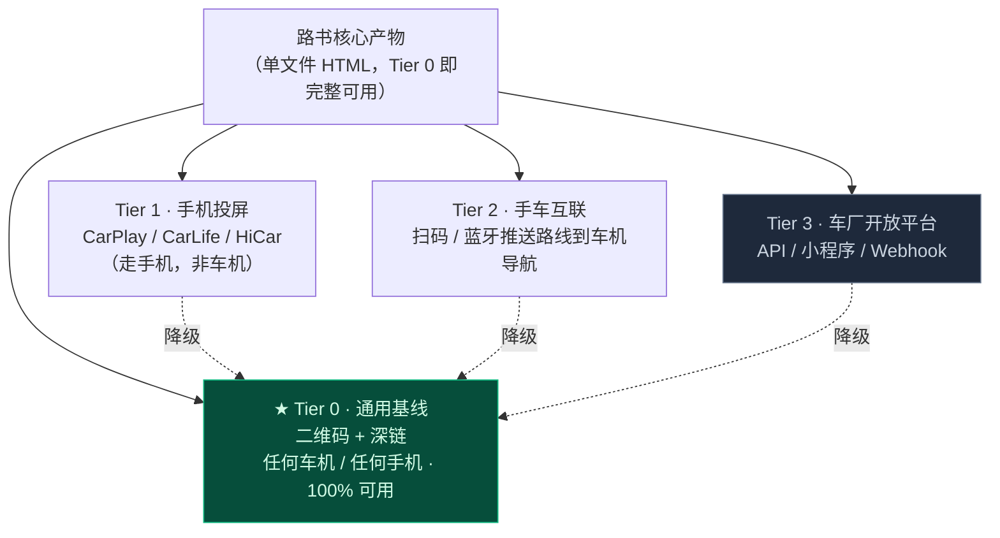
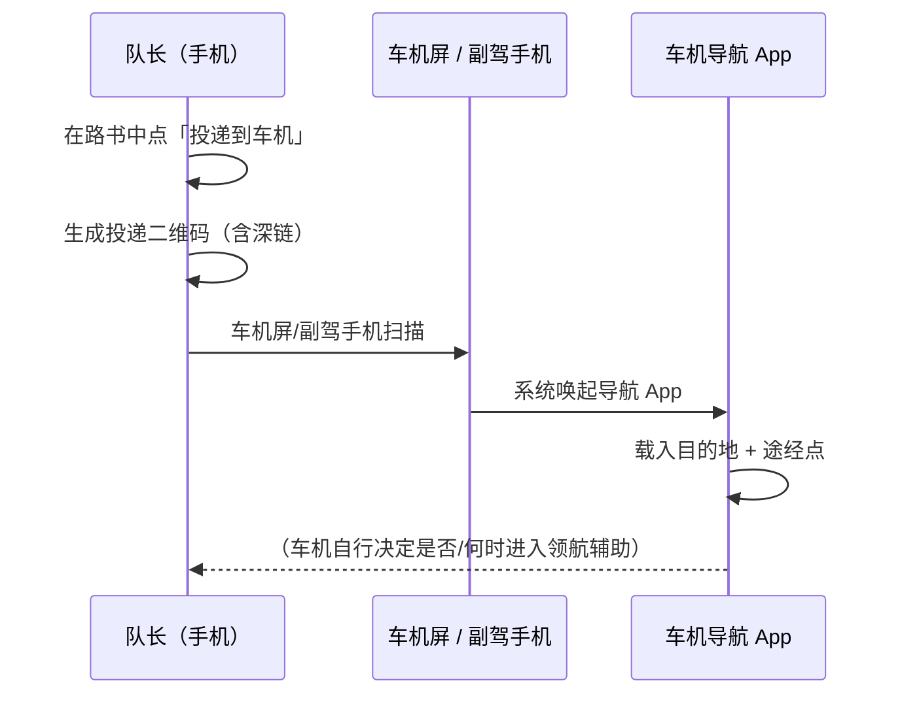
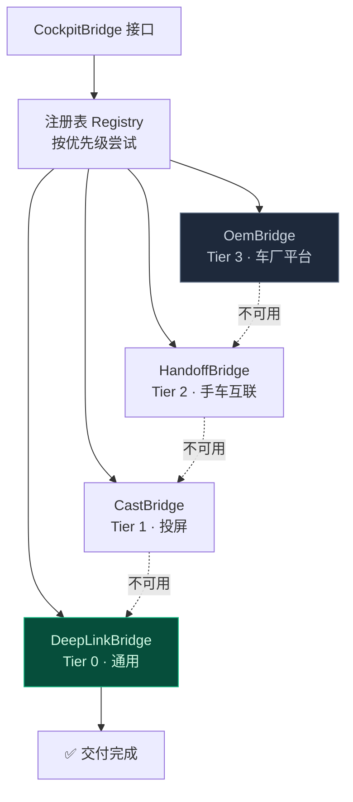

# 第 2 章 · EV 智能座舱端到端协议

> **状态**：`Stable Draft`（含待验证项）｜ **对应维度**：深度维度 ② EV 智能座舱端到端协议
> **铁律依据**：[责任边界线 1](00-overview-and-glossary.md#三条责任边界线tripcraft-不是清单)、[铁律 7 事实与建议分离](00-overview-and-glossary.md#铁律-7--事实与建议分离-facts-and-advice-are-separate)、[铁律 8 拒绝静默失败](00-overview-and-glossary.md#铁律-8--拒绝静默失败-no-silent-failure)
> **本章要回答**：怎么把一份 9 天 40 个节点的路书，**可靠地**送进一台我们无法控制、无法测试、能力随时可能变化的车机？

---

## 2.1 先做一次必要的纠偏

母本 README §2.4 的原始表述是：

> ❌ 「直接激活高速/城市领航辅助驾驶（NOA）」

**这句话必须废弃。** 理由不是措辞不够谨慎，而是**它在事实上不可能成立**：

| 为什么不可能 | 展开 |
| :--- | :--- |
| **NOA 是车厂的封闭能力** | 领航辅助的激活条件（高精地图覆盖、ODD 运行域、驾驶员监控状态、系统自检）完全由车厂定义。**第三方应用没有任何接口可以"激活"它。** |
| **没有任何车厂开放该权限** | 让第三方决定何时进入领航状态，等于把功能安全责任交给外部。这在功能安全（ISO 26262 / SOTIF）框架下是不可接受的。 |
| **即使能，也不该做** | 一旦 TripCraft 声称"我们让它进入 NOA"，那么在 NOA 状态下发生的事故，我们就会被拉进责任链。**这是一个我们绝不该踏入的法域。** |

### ✅ 修正后的表述

> **「将全天多节点路线批量交付至车机导航应用，由车机在满足条件时自行进入领航辅助状态。」**

这个表述的每一处都是准确的：
- ✅ 我们做的是**投递路线数据**
- ✅ 承接方是**车机导航应用**（而不是"车"）
- ✅ 是否进入领航状态由**车机自行判断**（我们既不知道也不干预）

> 📌 **这一章的所有设计，都必须满足"删掉这句话的每一个形容词后，剩下的仍然是真的"。**

---

## 2.2 架构第一原则：不依赖任何单一车企能力

**这是本章最重要的决策。**

现实的约束条件：

| 约束 | 说明 |
| :--- | :--- |
| **能力碎片化** | 不同厂商、不同车型、不同年款、不同地区版本，开放能力完全不同 |
| **无法测试** | 我们无法为每一款车做真机验证 |
| **随时变化** | 车厂开放平台可能改接口、改配额、改授权范围，甚至下线 |
| **无法承诺** | 任何"支持 XX 品牌"的营销表述，都会在某个车型上被证伪 |

**因此**：

> 🎯 **Tier 0 必须做到 100% 可用，且不依赖任何车企。Tier 1–3 是路径优化，不是功能前提。**



---

## 2.3 Tier 0 详解：真正的交付主力

### 2.3.1 交付形态：二维码承载一段"路线意图"



### 2.3.2 ★ 深链的不确定性必须隔离在数据里，而不是代码里

**这是本节的核心工程决策。**

途经点参数的确切格式、分隔符、数量上限、是否支持编码，**在不同导航 App 与不同版本间存在差异，且官方文档未必与实现一致**。

**应对方式不是"猜一个然后写死"，而是把协议定义外置成可版本化的能力档案**：

```jsonc
// config/deeplink-profiles.json —— ★ 数据，不是代码
{
  "profiles": [
    {
      "id": "amap_uri_v1",
      "app": "高德地图",
      "scheme": "amapuri://route/plan/",
      "params": {
        "origin":      { "lng": "slon", "lat": "slat", "name": "sname" },
        "destination": { "lng": "dlon", "lat": "dlat", "name": "dname" },
        "waypoints":   { "key": "via", "format": "{lng},{lat}", "separator": ";" },
        "mode":        { "key": "t", "value": "0" },
        "source":      { "key": "sourceApplication", "value": "tripcraft" }
      },
      "limits": { "maxWaypoints": 16, "maxUrlLength": 2048 },
      "verified": { "at": "2026-10-07", "on": ["iOS 高德 v13.x", "Android 高德 v13.x"],
                    "confidence": "reported" },
      "notes": "上限与分隔符需在各端实测确认，见 TV-07"
    },
    {
      "id": "baidu_map_v1",
      "app": "百度地图",
      "scheme": "baidumap://map/direction",
      "params": {
        "origin":      { "lng": "origin", "lat": "origin" },
        "destination": { "lng": "destination", "lat": "destination" },
        "waypoints":   { "key": "waypoints", "format": "{lat},{lng}", "separator": "|" },
        "mode":        { "key": "mode", "value": "driving" },
        "coordType":   { "key": "coord_type", "value": "gcj02" }
      },
      "limits": { "maxWaypoints": 5, "maxUrlLength": 2048 },
      "verified": { "at": null, "confidence": "unknown" }
    }
  ]
}
```

**注意两个 profile 里的差异**：
- 高德用 `{lng},{lat}` 顺序，百度用 `{lat},{lng}` —— **坐标顺序相反，这是最常见的踩坑点**
- 高德的 waypoint 参数键名与百度不同
- 上限不同（需实测，此处为占位值）

> 📌 **为什么这样做**：当某个 App 更新了协议、或我们在实测中发现上限不是 16 而是 8 时，**只需要改这份 JSON，不需要改代码、不需要重新发版**。而且 `verified` 字段强制我们把"这条协议我们到底验证到什么程度"写清楚——`confidence: "unknown"` 的 profile 在 UI 上必须给用户提示。

### 2.3.3 投递执行器

```js
class DeepLinkBridge {
  constructor(profiles) { this.profiles = profiles; }

  /**
   * @returns {{ ok: boolean, segments: string[], warnings: string[], profile: string }}
   */
  build(trip, day, { profileId } = {}) {
    const p = profileId
      ? this.profiles.find(x => x.id === profileId)
      : this.pickBest(trip);

    // ① 抽取该日的可导航节点（只取有坐标的）
    const stops = day.nodes
      .filter(n => n.place?.coords && n.navigable !== false)
      .sort((a, b) => a.seq - b.seq);

    if (stops.length < 2) {
      return { ok: false, segments: [], profile: p.id,
               warnings: ['当日可导航节点少于 2 个，无需投递。'] };
    }

    // ② 超过上限 → 分段
    const max = p.limits.maxWaypoints;
    const segments = [];
    const warnings = [];

    if (stops.length - 2 > max) {
      const chunks = splitIntoLegs(stops, max);
      for (const c of chunks) segments.push(this.buildOne(p, c));
      warnings.push(
        `当日共 ${stops.length} 个节点，超过「${p.app}」单次投递上限（${max} 个途经点），` +
        `已拆为 ${chunks.length} 段。请依次扫描投递，或在每个休息点投递下一段。`
      );
    } else {
      segments.push(this.buildOne(p, stops));
    }

    // ③ URL 长度校验
    for (let i = 0; i < segments.length; i++) {
      if (segments[i].length > p.limits.maxUrlLength) {
        warnings.push(`第 ${i + 1} 段链接长度 ${segments[i].length} 超出 ${p.limits.maxUrlLength}，` +
                      `部分车机可能无法识别，建议改用分段投递或手动输入。`);
      }
    }

    // ④ ★ 置信度提示（铁律 7：事实与建议分离）
    if (p.verified.confidence !== 'verified') {
      warnings.push(`「${p.app}」的投递参数尚未完成全平台实测（${p.verified.confidence}），` +
                    `若车机未能正确识别，请手动输入目的地。`);
    }

    return { ok: true, segments, warnings, profile: p.id };
  }

  buildOne(p, stops) {
    const q = new URLSearchParams();
    const first = stops[0], last = stops[stops.length - 1];
    const mids = stops.slice(1, -1);

    const fmt = (stop, role) => {
      const [lng, lat] = stop.place.coords;
      const m = p.params[role];
      // ★ 按 profile 声明的格式与顺序，而不是硬编码
      return m.format.replace('{lng}', lng).replace('{lat}', lat);
    };

    q.set(p.params.origin.lng, first.place.coords[0]);
    q.set(p.params.origin.lat, first.place.coords[1]);
    q.set(p.params.origin.name, first.place.name);
    q.set(p.params.destination.lng, last.place.coords[0]);
    q.set(p.params.destination.lat, last.place.coords[1]);
    q.set(p.params.destination.name, last.place.name);

    if (mids.length) {
      q.set(p.params.waypoints.key,
            mids.map(s => fmt(s, 'waypoints')).join(p.params.waypoints.separator));
    }
    q.set(p.params.mode.key, p.params.mode.value);

    return p.scheme + '?' + q.toString();
  }
}
```

### 2.3.4 分段投递算法（★ 途点超限的真实解法）

**不要把"超限"当成错误。** 现实中，一条 9 天线路的每日节点通常在 5–10 个之间，真正超限的是**长途赶路日**（一天 12+ 个途经点）。而恰好这些日子**本来就有休息点**：

```js
/**
 * 在自然休息点处切分，而不是机械地按数量切。
 * 优先在以下类型的节点后断开：服务区 / 加油站 / 用餐 / 充电站。
 */
function splitIntoLegs(stops, maxWaypoints) {
  const PER_LEG = maxWaypoints + 2;          // 首尾also占位
  const legs = [];
  let cur = [stops[0]];

  for (let i = 1; i < stops.length; i++) {
    const s = stops[i];
    const willOverflow = (cur.length - 2 + 1) > maxWaypoints;

    if (willOverflow) {
      // ★ 优先把断点设在"正在途经的休息类节点"上
      legs.push(cur);
      cur = [s];
    } else {
      cur.push(s);
    }
  }
  if (cur.length > 1) legs.push(cur);
  return legs;
}
```

**产品侧的处理**（这比算法更重要）：

> 路书在赶路日的节点列表里，**自动渲染出一个「分段投递」区块**：
>
> ```
> 📍 今日路线较长（14 个途经点），已拆为 2 段
>
>   第 1 段  兰州 → 张掖（含 8 个途经点）    [ 投递 ] [ 二维码 ]
>   第 2 段  张掖 → 嘉峪关（含 4 个途经点）  [ 投递 ] [ 二维码 ]
>
>   建议：在第 1 段结束的张掖服务区投递第 2 段。
> ```

**"建议在何处投递下一段"这句话是产品价值所在** —— 它把技术限制转化成了一个贴心的行程建议。

---

## 2.4 CockpitBridge 适配器架构



```js
/**
 * ★ 所有桥接实现必须遵守的契约。
 * 任何桥接都不得抛出到调用方 —— 不可用时返回 { ok: false }，由注册表降级。
 */
class CockpitBridge {
  /** 唯一标识 */
  id = '';
  /** 所属 Tier，用于 UI 展示「已使用哪种方式交付」 */
  tier = 0;
  /** 声明能力，UI 据此决定显示哪些按钮 */
  capabilities = {
    canDeliverRoute: false,
    canReadVehicleState: false,     // ★ 见 §2.6，目前全为 false
    requiresUserAction: true,
  };

  /** 探测在当前环境是否可用（不得发起网络请求） */
  async detect() { return false; }

  /**
   * 交付
   * @returns {{ ok: boolean, via: string, warnings: string[], fallbackTo?: string }}
   */
  async deliver(plan) { return { ok: false, via: this.id, warnings: ['未实现'] }; }
}

class CockpitBridgeRegistry {
  constructor(bridges) { this.bridges = bridges; }

  async best() {
    for (const b of this.bridges) {          // 已按 tier 降序排列
      try { if (await b.detect()) return b; } catch { continue; }
    }
    return this.bridges[this.bridges.length - 1];   // 兜底：Tier 0
  }

  async deliver(plan) {
    // ★ 逐级降级，且每次降级都要告知用户用了哪条路径
    const order = this.bridges.slice().sort((a, b) => b.tier - a.tier);
    for (const b of order) {
      try {
        if (!(await b.detect())) continue;
        const r = await b.deliver(plan);
        if (r.ok) return { ...r, attempted: b.tier };
      } catch (e) {
        // 静默继续降级，但记录下来
        Console.log(`[cockpit] ${b.id} 失败：${e.message}`);
      }
    }
    return { ok: false, via: 'none',
             warnings: ['无法自动投递。请手动在车机导航中输入目的地：' + plan.destinationName] };
  }
}
```

> ⚠️ **最后那条兜底文案极其重要。** 当所有自动路径都失败时，**不能只说"投递失败"**——必须给出用户**下一步能做什么**（手动输入目的地名称）。这是[铁律 8](00-overview-and-glossary.md#铁律-8--拒绝静默失败-no-silent-failure)在座舱场景的具体要求。

---

## 2.5 关于激进方案的诚实评估

### 2.5.1 Web Bluetooth（BLE 近场）

| 维度 | 现实 |
| :--- | :--- |
| **手机端支持** | Android Chrome 支持；**iOS Safari 不支持**（且短期内不会） |
| **车机端支持** | 车机浏览器支持 Web Bluetooth 的概率极低 |
| **能做什么** | 理论上是 GATT 客户端读取服务特征值 |
| **我们的判定** | ❌ **不列为交付项，仅作研究轨道** |

**为什么不做**：

1. **iOS 完全不可用** —— 直接失去约一半用户
2. **没有标准 GATT 服务定义车辆状态** —— 即使连上也不知道读哪个特征值
3. **功能安全红线** —— 通过 BLE 读取或影响车辆状态，会把我们拖入车规责任体系

### 2.5.2 Wi-Fi 局域网 / WebRTC

**理论上**：手机与车机接入同一车载热点，通过 WebRTC 或本地 HTTP 通信。

**实际障碍**：
- 需要车机侧有一个**运行中的服务器**来接收 —— 绝大多数车机不提供
- 车机浏览器通常不开放 `getUserMedia` / WebRTC 数据通道
- 车机网络策略通常**禁止局域网内设备互访**

**判定**：❌ 同上，不列为交付项。

### 2.5.3 车厂开放平台

**这是唯一有真实可能性的 Tier 3 路径**，但：

| 问题 | 说明 |
| :--- | :--- |
| **接入门槛** | 多数需要企业资质、商务对接、合作协议 |
| **能力有限** | 通常提供的是"发送一个目的地到车机"，**而不是投递多点路线** |
| **不确定性** | 各厂商差异极大，且接口生命周期不可控 |

**判定**：⏸ **列为商务拓展事项，不作为技术前提。** 若能谈成，作为 Tier 3 增强接入 [CockpitBridge](#24-cockpitbridge-适配器架构)；谈不成，产品完全不受影响。

> 📌 **这份诚实评估本身就是资产。** 它会阻止团队在"手机连车机"这件事上投入数月的无效工程。**知道什么做不到，和知道什么做得到同样重要。**

---

## 2.6 关于"读取车辆状态"：必须明确说不

有诱惑力的功能设想：*读取电池 SOC，自动计算能否撑到下一个充电站。*

**❌ 我们不做这个。** 理由：

| 理由 | 展开 |
| :--- | :--- |
| **技术上做不到** | 浏览器沙箱**无法**访问车辆 CAN 总线、BMS 或任何车载数据。没有例外。 |
| **即使能也不该做** | 一旦我们读取了 SOC 并给出"能撑到"的结论，而这个结论错了导致用户在无人区趴窝——**这个责任我们承担不起，也不该承担。** |
| **有更安全的替代方案** | 让用户**自己输入**当前 SOC 和车辆标称续航，我们只做**算术**，并明确标注所有假设。 |

### 2.6.1 ✅ 正确做法：用户输入 + 透明算术

```js
/**
 * 续航估算器 —— ★ 它做的是算术，不是预测。
 * 所有假设必须显式展示，所有不确定性必须显式标注。
 */
function estimateRange(input) {
  const {
    currentSocPct,        // 用户输入
    nominalRangeKm,       // 用户输入（车辆标称续航）
    terrainFactor,        // 由路书海拔剖面自动推导
    temperatureFactor,    // 由用户输入的当前气温推导
    headwindFactor,       // 用户可选输入
  } = input;

  const effectiveRangeKm =
    nominalRangeKm * (currentSocPct / 100) * terrainFactor * temperatureFactor * headwindFactor;

  return {
    effectiveRangeKm,
    // ★ 必须展示的假设清单
    assumptions: [
      `车辆标称续航 ${nominalRangeKm} km（您输入的值，实际因驾驶习惯而异）`,
      `当前电量 ${currentSocPct}%（您输入的值）`,
      `地形系数 ${terrainFactor.toFixed(2)}（由本段海拔爬升自动估算）`,
      `温度系数 ${temperatureFactor.toFixed(2)}（${input.tempC}℃ 对电池影响的经验值）`,
      headwindFactor !== 1 ? `风阻系数 ${headwindFactor.toFixed(2)}` : null,
    ].filter(Boolean),
    // ★ 必须展示的免责
    disclaimer:
      '以上为基于您输入值的估算，不是车辆实际续航。' +
      '实际续航受驾驶风格、载重、空调、路况影响，可能显著低于估算值。' +
      '请以车辆仪表显示为准，并预留充足余量。',
    // ★ 保守建议：按估算值的 70% 规划
    recommendedPlanKm: effectiveRangeKm * 0.70,
  };
}
```

**地形系数自动推导**（这是路书独有的优势）：

```js
/**
 * 从路书的海拔剖面推导爬坡能耗系数。
 * 上坡耗电、下坡回收，但回收率显著低于消耗率（通常 50–70%）。
 */
function terrainFactorFromProfile(elevationProfile) {
  let gainM = 0, lossM = 0;
  for (let i = 1; i < elevationProfile.length; i++) {
    const d = elevationProfile[i].alt - elevationProfile[i-1].alt;
    if (d > 0) gainM += d; else lossM += -d;
  }
  const RECOVERY = 0.6;      // ★ 保守取值：下坡回收率按 60% 算
  const netGain = gainM - lossM * RECOVERY;

  // 经验值：约每 1000 m 净爬升额外消耗 ~8% 电量
  return clamp(1 - (netGain / 1000) * 0.08, 0.55, 1.15);
}
```

> 📌 **这个功能是 TripCraft 相对通用导航的独特优势**：通用导航知道路，但**不知道你的车有多重、载了几个人、今天翻了几座山**。路书知道。**把路书的行程知识与用户的车辆参数结合，做一次透明的算术**——这就是我们该做的事，不多也不少。

### 2.6.2 充电站数据

**不建自有充电桩数据库。** 理由：充电桩的实时可用状态（是否被占用、是否故障）是**高频变化数据**，自建必然迅速失准。

**做法**：通过高德 POI 搜索类型（充电站）获取，并在 UI 上标注：

> 「充电桩信息来自高德地图，**实时可用状态请以充电运营商 App 为准**（特来电/星星充电/国网 e 充电）。」

---

## 2.7 ★ 意图仲裁与安全门控

深度维度 ② 明确要求："副驾/后排多屏冲突仲裁"。

### 2.7.1 屏幕角色与权限

| 屏幕 | 角色 | 可做 | 不可做 |
| :--- | :--- | :--- | :--- |
| **驾驶屏**（导航） | `driver` | 全部 | — |
| **副驾屏** | `copilot` | 查信息、加收藏、写备注、**发起**路线变更请求 | ❌ 直接改路线 / 改时间 |
| **后排屏** | `passenger` | 查看路书、投票、留言 | ❌ 任何变更 |
| **队长手机** | `leader` | 全部 + 发布补丁 | — |

### 2.7.2 仲裁队列

```js
/**
 * ★ 核心原则：路线与时间的变更必须经过"前排确认"。
 * 副驾的请求进入队列，由司机或队长确认后生效。
 */
class IntentArbiter {
  #queue = [];

  submit(intent, from) {
    // ① 安全门控：行驶中的所有交互请求一律入队，不得立即执行
    if (SafetyGate.isMoving()) {
      intent.status = 'queued_moving';
      this.#queue.push(intent);
      return { accepted: true, deferred: true,
               message: '已记录您的调整请求，将在停车后确认。' };
    }

    // ② 权限门控
    const mayApplyDirectly =
      (from.role === 'driver' || from.role === 'leader') &&
      intent.kind !== 'restructure';        // 重构必须重新计算并确认

    if (mayApplyDirectly) {
      intent.status = 'applied';
      return { accepted: true, deferred: false };
    }

    intent.status = 'pending_confirm';
    intent.requiresConfirmer = ['driver', 'leader'];
    this.#queue.push(intent);
    return { accepted: true, deferred: true,
             message: '已将调整请求发送给前排确认。' };
  }

  /** 停车后 / 司机确认时调用 */
  drain(confirmer) {
    const applied = [];
    for (const it of this.#queue) {
      if (it.status === 'queued_moving' || it.status === 'pending_confirm') {
        if (confirmer.role === 'driver' || confirmer.role === 'leader') {
          it.status = 'applied'; it.confirmedBy = confirmer.id;
          applied.push(it);
        }
      }
    }
    this.#queue = this.#queue.filter(i => i.status !== 'applied');
    // ★ 每一次确认都留痕（铁律 9）
    Journal.record({ kind: 'intent_arbitration', applied, confirmer: confirmer.id });
    return applied;
  }
}
```

### 2.7.3 ★ 安全门控：如何判断"正在行驶"

**诚实的答案：我们无法可靠判断。**

| 手段 | 可靠性 | 判定 |
| :--- | :--- | :--- |
| `navigator.geolocation` 速度 | 需要定位权限；车内信号差；停车时不更新 | ⚠️ 不可靠 |
| 用户手动切换"行驶中/已停车" | 完全可靠，但依赖用户操作 | ✅ 采用 |
| 车机提供的车辆状态 | 无接口 | ❌ 不可行 |

**因此采用"最严格假设 + 用户主动解锁"**：

```js
const SafetyGate = {
  // ★ 默认值：假设在行驶中。宁可多一次点击，不可少一次保护。
  _state: 'moving',

  isMoving() { return this._state === 'moving'; },

  /**
   * 解锁进入可交互模式。
   * ★ 约束：解锁有效期 10 分钟，之后自动回到 moving 状态。
   *   理由：用户解锁后忘记锁回是最常见的安全漏洞。
   */
  unlockFor(minutes = 10) {
    this._state = 'parked';
    clearTimeout(this._timer);
    this._timer = setTimeout(() => {
      this._state = 'moving';
      Bus.emit('safety:relocked');
    }, minutes * 60_000);
  },

  relock() { this._state = 'moving'; clearTimeout(this._timer); },
};
```

**UI 表现**：

> ```
> 🚗 行驶中 · 仅可查看
>    路线与时间的调整请在停车后进行
>
>    [ 我已停车 ]
> ```

> 📌 **"默认假设行驶中"是一个有代价的选择**——它会让停着车看路书的用户多点一次。**但这个代价必须付。** 因为反过来的默认（假设已停车）意味着：一个正在开车的用户误触了"跳过今天下午的景点"，而这个变更会同步给整个车队。
>
> **在安全与便利之间，默认值必须偏向安全。**

### 2.7.4 副驾反干扰

**副驾能做的最有价值的事，不是改路线，而是补充信息。**

| 副驾可做 | 实现 |
| :--- | :--- |
| 查询前方服务区/充电桩 | 只读，立即可用 |
| 给节点加备注（"这家店的杏皮水好喝"） | 本地写入，不改变行程 |
| 收藏一个计划外的地点 | 进入"计划之外"候选（[§6.6.3](06-memory-journal-engine.md#663--路线之外是一个功能不是一个错误)） |
| 发起"想在 X 停一下"请求 | 入队，等前排确认 |

**设计意图：把副驾从"可能干扰驾驶的变量"变成"驾驶的信息副手"。**

---

## 2.8 投递内容的最小化原则

**投递到车机的内容必须是最小集。** 车机系统可能有自己的数据收集与上传行为，我们无法控制。

| 投递 ✅ | 不投递 ❌ |
| :--- | :--- |
| 目的地名称 | 客户姓名 |
| 途经点名称与坐标 | 客户手机号 |
| 出行方式（驾车） | 房间号、订单号 |
| 路书的节点顺序 | 价格、成本、佣金信息 |
| | 队员的健康信息 |

```js
/**
 * ★ 投递载荷构造器：白名单式，而非黑名单式。
 * 只有显式列出的字段才会进入深链。
 */
function buildDeliveryPayload(day) {
  return day.nodes
    .filter(n => n.place?.coords && n.navigable !== false)
    .map(n => ({
      // ★ 白名单：只允许这三项
      name: n.place.name,
      coords: n.place.coords,
      seq: n.seq,
      // 其余字段一律丢弃，包括 notes / fact / advice / media / booking
    }));
}
```

> ⚠️ **为什么要用白名单而不是黑名单**：黑名单需要穷举所有不该传的字段，**漏掉一个就泄漏一个**。白名单的默认是"不传"，**新增字段不会意外泄漏**。这个原则在[§3.6.2](03-b2b-agency-operations.md#362--分享版是独立产物而非-css-隐藏)的分享版设计里是同一个道理。

---

## 2.9 测试矩阵

| # | 场景 | 方法 | 通过标准 |
| :--- | :--- | :--- | :--- |
| C-01 | Tier 0 深链生成 | 单元测试 | URL 结构符合 profile 声明，坐标顺序正确（高德 lng,lat / 百度 lat,lng） |
| C-02 | 途经点超限分段 | 14 节点输入 | 正确拆段，断点优先落在休息类节点 |
| C-03 | URL 超长 | 构造超长名称 | 产生警告，不产生无法识别的链接 |
| C-04 | 未验证 profile | `confidence: unknown` | UI 显示提示，不静默使用 |
| C-05 | 桥接逐级降级 | 注入 detect/deliver 失败 | 正确降级到 Tier 0，用户无感 |
| C-06 | 全部桥接失败 | 全部注入失败 | 给出"请手动输入目的地：XXX"的可操作兜底文案 |
| C-07 | 行驶中提交变更 | SafetyGate 默认态 | 入队不执行，提示"停车后确认" |
| C-08 | 解锁超时 | unlock(0.05) | 到期自动回到 moving 并广播 |
| C-09 | 副驾改路线 | 角色 permission=copilot | 进入 pending_confirm |
| C-10 | 队长改路线 | 角色 permission=leader | 直接应用并留痕 |
| C-11 | ★ 载荷最小化 | 投递含 PII 的节点 | 深链中**不含**任何 PII 字段 |
| C-12 | 续航估算假设展示 | 任意输入 | 全部假设与免责可见，推荐值按 70% 折算 |
| C-13 | 地形系数 | 上坡段 / 下坡段 | 上坡系数 <1，下坡系数 >1 但受回收率上限约束 |
| C-14 | 无车辆状态读取 | 全代码审计 | 不存在任何尝试读取车机数据的代码路径 |

---

## 2.10 待验证项（TODO(P0)）

| ID | 待验证 | 影响 | 验证方法 |
| :--- | :--- | :--- | :--- |
| **TV-07** | 高德 `amapuri://` 途经点参数的确切键名、格式、分隔符、数量上限 | §2.3.2 profile | **多端真机实测**（iOS/Android × 高德版本） |
| **TV-08** | 百度 `baidumap://` 同上 | §2.3.2 profile | 同上 |
| **TV-09** | 主流车机（理想/蔚来/小鹏/小米/华为）是否允许在车机浏览器中打开外部深链 | Tier 2 可行性 | 实车测试 |
| **TV-10** | CarPlay / CarLife / HiCar 是否允许第三方 Web 应用投递多点路线 | Tier 1 可行性 | 查阅各平台开发者文档 + 实测 |
| **TV-11** | 高德/百度对深链投递是否有频率限制或风控 | §2.3.3 | 实测 |
| **TV-12** | 各车厂开放平台的实际接入门槛与能力边界 | Tier 3 | **商务对接**，非技术验证 |

> ⚠️ **TV-07 / TV-08 是本章的**关键路径阻塞项**，已作为 [OI-001](00-overview-and-glossary.md#07-未决事项登记册-open-issues-register)（P0）登记。
>
> **在实测确认之前，`docs/02` 中所有关于深链参数的描述都视为占位符，不得作为事实引用。** 这正是 [§2.3.2](#232--深链的不确定性必须隔离在数据里而不是代码里) 把协议外置成 `config/deeplink-profiles.json` 的原因——**实测结论可以直接改数据，无需改代码。**

---

## 2.11 本章交付物清单

| 交付物 | 路径 | 状态 |
| :--- | :--- | :--- |
| 深链能力档案 | `config/deeplink-profiles.json` | ⏳ 待建立（依赖 TV-07/08） |
| CockpitBridge 接口 | `src/cockpit/bridge.js` | ⏳ 待实现 |
| 深链桥接 | `src/cockpit/deeplink-bridge.js` | ⏳ 待实现 |
| 投屏桥接 | `src/cockpit/cast-bridge.js` | ⏳ 待实现 |
| 手车互联桥接 | `src/cockpit/handoff-bridge.js` | ⏳ 待实现 |
| 意图仲裁器 | `src/cockpit/intent-arbiter.js` | ⏳ 待实现 |
| 安全门控 | `src/cockpit/safety-gate.js` | ⏳ 待实现 |
| 续航估算器 | `src/cockpit/range-estimator.js` | ⏳ 待实现 |
| 投递载荷构造器 | `src/cockpit/delivery-payload.js` | ⏳ 待实现 |
| 实车测试记录 | `docs/verify/deeplink-matrix.md` | ⏳ 待建立 |

---

## 2.12 ★ 本章对 README 的修正要求

| 位置 | 原文 | 修正为 |
| :--- | :--- | :--- |
| README §2.4 | 「直接激活高速/城市领航辅助驾驶（NOA）」 | 「将全天多节点路线批量交付至车机导航应用，由车机在满足条件时自行进入领航辅助状态」 |
| README §2.4（如存在） | 「支持理想/蔚来/小鹏/小米/华为车机」 | 「通过通用深链与二维码投递，不依赖特定车厂；车厂开放平台接入作为增强路径」 |

> ⚠️ **第二处修正是预防性的**：在 [TV-09](#210-待验证项-todop0) 完成之前，**任何关于"支持某品牌车机"的表述都属于未经验证的声明**。营销材料中的品牌名会构成具体承诺，而承诺一旦被某个车型证伪，损害的是整体可信度。

---

> **上一章**：[第 6 章 · 记忆日志引擎](06-memory-journal-engine.md) ｜ **下一章**：[第 7 章 · 法律合规与护栏](07-legal-and-compliance.md) —— 技术上能走通的都走通了，最后要确认的是：这么做合法吗？
