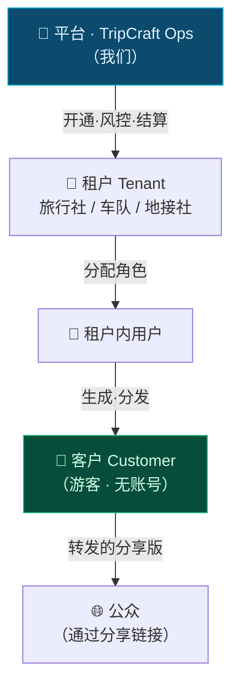
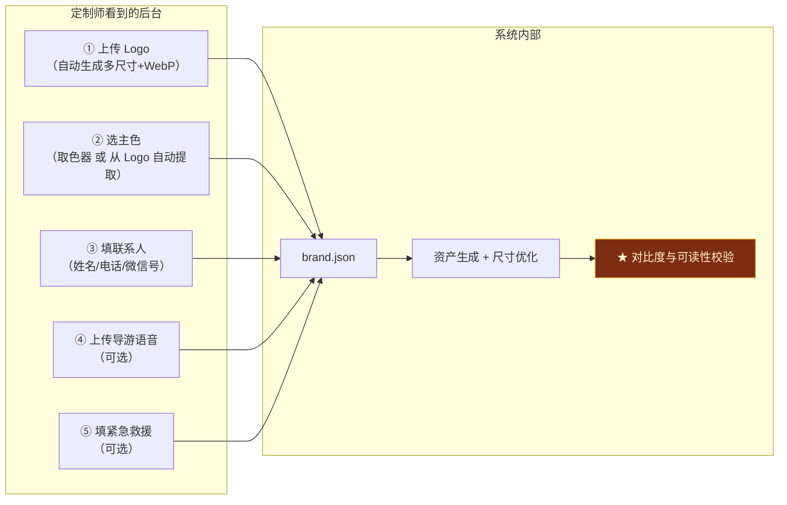
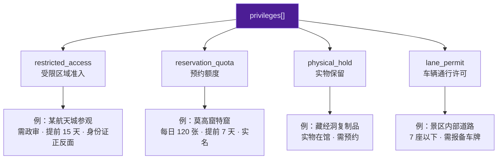
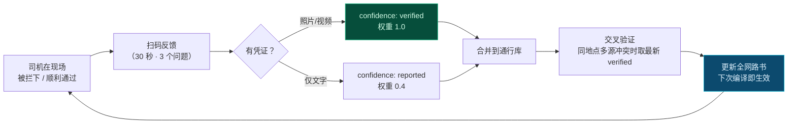
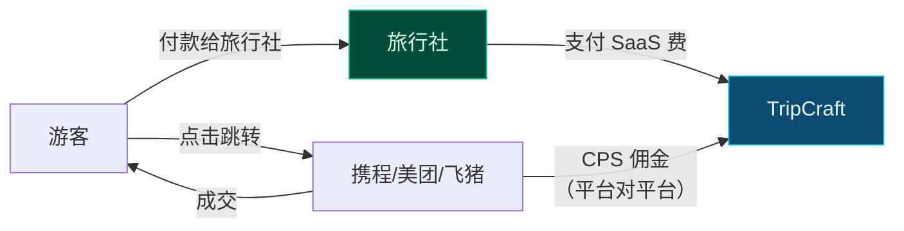
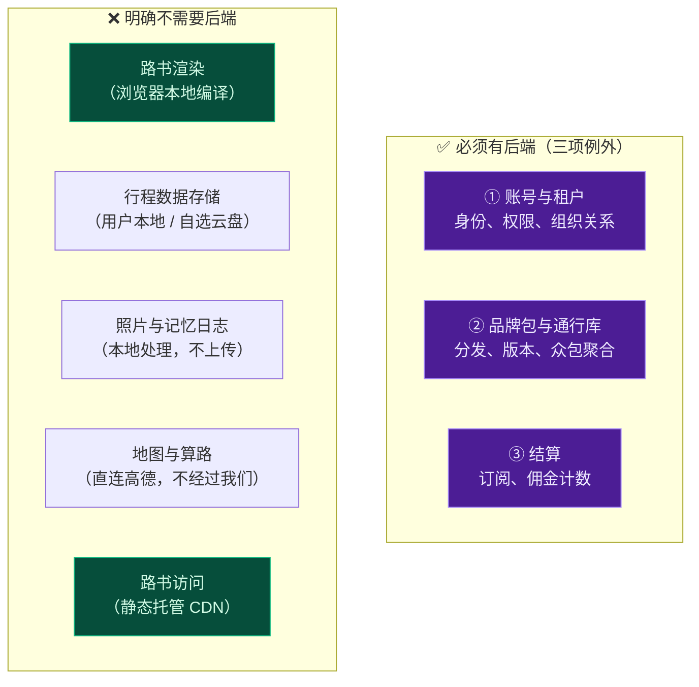

# 第 3 章 · B2B 线下旅行社与车队运营赋能

> **状态**：`Stable Draft` ｜ **对应维度**：深度维度 ③ B2B 线下旅行社/车队运营
> **铁律依据**：[铁律 10 代码不是护城河，资产才是](00-overview-and-glossary.md#铁律-10--代码不是护城河资产才是-code-is-not-the-moat)、[铁律 4 数据主权本地化](00-overview-and-glossary.md#铁律-4--数据主权本地化-local-data-sovereignty)、[铁律 5 无后端可运行](00-overview-and-glossary.md#铁律-5--无后端可运行-backendless-by-default)
> **本章要回答**：一个不懂技术的定制师，怎么在 20 分钟内产出一份带本社品牌、能扫码上车的路书？他凭什么留在 TripCraft？

---

## 3.1 为什么 B2B 才是真正的护城河

先摆一个必须承认的事实：**C 端路书生成这件事，护城河极浅。**

任何一个人用大模型 + 一段提示词都能生成一份看起来不错的甘青 9 日行程。功能可以被复制，UI 可以被抄袭。C 端获客成本高、留存低、变现难——**这是所有工具类产品的共同困境**。

真正难以复制的是三样东西，而**它们全部在 B 端**：

| 资产 | 为什么难以复制 | 谁在创造它 |
| :--- | :--- | :--- |
| **地面通行数据** | 考斯特能不能进莫高窟北门、哪段限高 3.5m、哪个垭口 11 月封路——这些数据**不在任何地图 API 里**，只存在于老司机的脑子里 | 车队司机 |
| **特权资源关系** | 特窟预约额度、军工航天单位的预审通道、景区内部接待——本质是**人与人的关系**，不是技术 | 地接社 |
| **定制师的工作流** | 一旦定制师的日常产出（报价单、行程单、给客户的微信图文）全部跑在 TripCraft 上，迁移成本是**他们的全部工作习惯** | 旅行社 |

> 📌 **所以 TripCraft 对 B 端卖的不是"路书生成器"，而是"定制师的人效工具 + 地面数据的沉淀容器"。**
> 前者决定他们愿不愿意用，后者决定他们走不走得掉。

### 3.1.1 一个必须直面的现实：定制师现在是怎么干活的


**三个红色节点就是 TripCraft 要切进去的位置。**

| 痛点 | 现状耗时 | TripCraft 目标 |
| :--- | ---: | ---: |
| 首次成稿 | 4–8 h | **≤ 20 min** |
| 每轮改需求 | 1–2 h | **≤ 5 min**（改 DSL，重编） |
| 现场应变 | 全靠电话 | **补丁 + 二维码分发** |
| 行程后沉淀 | 无 | **记忆日志自动生成** |

---

## 3.2 角色模型与权限矩阵

### 3.2.1 五个层级



### 3.2.2 ★ 关键设计决策：**游客没有账号**

这是刻意的，而且不可协商：

| 理由 | 展开 |
| :--- | :--- |
| **账号是传播的杀手** | 让一位 55 岁的游客为一趟旅行注册账号、收验证码、记密码——转化率会掉一个数量级。 |
| **B 端付费，C 端零门槛** | 商业模式上 TripCraft 向旅行社收费，游客是**被服务的对象而不是用户**。要求游客注册是把 B 端的成本转嫁给 C 端。 |
| **隐私责任更轻** | 不持有游客账号 = 不持有游客的身份数据，[《个人信息保护法》](07-legal-and-compliance.md)下的合规负担大幅下降。 |

**游客通过一条链接访问路书**，链接本身携带访问凭证（见 [§3.6 访问控制](#36-访问控制与分享版)）。需要身份时，用「队伍内昵称 + 口令」这种**轻量标识**，不构成账号体系。

### 3.2.3 权限矩阵

| 能力 | owner | dispatcher<br/>调度 | designer<br/>定制师 | guide<br/>导游 | driver<br/>司机 | 客户 |
| :--- | :---: | :---: | :---: | :---: | :---: | :---: |
| 管理租户与账单 | ✅ | ❌ | ❌ | ❌ | ❌ | ❌ |
| 邀请/移除成员 | ✅ | ✅ | ❌ | ❌ | ❌ | ❌ |
| 编辑品牌包 | ✅ | ❌ | ⚠️ 仅文案 | ❌ | ❌ | ❌ |
| 创建/编辑路书 | ✅ | ✅ | ✅ | ❌ | ❌ | ❌ |
| 发布路书 | ✅ | ✅ | ✅ | ❌ | ❌ | ❌ |
| 查看全部路书 | ✅ | ✅ | ⚠️ 仅本人 | ⚠️ 仅被指派 | ⚠️ 仅被指派 | ❌ |
| 行程中发布补丁 | ✅ | ✅ | ✅ | ✅ | ⚠️ 仅路况类 | ❌ |
| 提交地面情报 | ✅ | ✅ | ✅ | ✅ | ✅ | ⚠️ 仅评价 |
| 查看成本/报价 | ✅ | ✅ | ⚠️ 仅本人路书 | ❌ | ❌ | ❌ |
| 查看客户 PII | ✅ | ✅ | ✅ | ⚠️ 脱敏 | ⚠️ 脱敏 | 仅本人 |

> ⚠️ **`guide`（导游）与 `driver`（司机）看到的客户信息必须是脱敏的。** 他们需要知道"有位长辈需要热水"和"有 3 位儿童"，**不需要**知道客户的身份证号和手机号。这是最小必要原则的直接应用，也是降低泄漏面的最有效手段。

---

## 3.3 白标品牌包

### 3.3.1 设计目标：定制师零技术配置

**绝对不能出现"请编辑这个 JSON 文件"这种要求。**

品牌包在后台是一个**表单**，表单产出符合 [`brand.schema.json`](../spec/brand.schema.json) 的 JSON。定制师看到的是：



### 3.3.2 ★ 品牌主题的安全边界

**允许客户自定义品牌，但不能允许客户把路书改到不可用。**

这是[铁律 3](00-overview-and-glossary.md#铁律-3--降级不可耻白屏才是罪-degrade-never-blank)（降级不可耻，白屏才是罪）在 B 端场景的直接延伸——**一份对比度不足、字号被改小的路书，对 65 岁用户来说就是白屏**。

[`trip.schema.json`](../spec/trip.schema.json) 已通过 `additionalProperties: false` + `patternProperties` 把主题覆盖**锁死在语义 token 上**：

```jsonc
"theme": {
  "designSystem": "liquid_glass",
  "primary": "#0ea5e9",          // ← 允许覆盖：品牌识别色
  "accent": "#f59e0b",
  "overrides": {
    "--tc-surface": "rgba(255,255,255,0.72)",
    "--tc-radius": "18px"
    // ❌ "--tc-font-size-base": "11px"  → Schema 拒绝：不是语义 token
    // ❌ "color": "#333"               → Schema 拒绝：不是语义 token
  }
}
```

**编译器在 RESOLVE 阶段的强制校验**（§5.3 阶段 ③ 的补充）：

```js
function checkBrandAccessibility(theme, brand) {
  const issues = [];
  const fg = resolveToken(theme, '--tc-text-primary');
  const bg = resolveToken(theme, '--tc-surface');

  // ① WCAG AA 对比度：正文 ≥ 4.5:1
  const ratio = contrastRatio(fg, bg);
  if (ratio < 4.5) issues.push({
    level: 'error', code: 'A11Y_CONTRAST',
    msg: `正文对比度 ${ratio.toFixed(2)}:1 低于 WCAG AA 要求的 4.5:1。` +
         `品牌主色「${brand.visual.primaryColor}」在浅色背景上不可读。`,
    remedy: '建议改用更深的同色系变体（如 #0369a1），或仅将该色用于装饰元素。',
  });

  // ② 基准字号不得低于 16px（长辈模式的基准是 19px）
  const base = parseFloat(resolveToken(theme, '--tc-font-size-base'));
  if (base < 16) issues.push({
    level: 'error', code: 'A11Y_FONTSIZE',
    msg: `基准字号 ${base}px 低于 16px 下限。产品的主要用户包含长辈群体。`,
  });

  return issues;
}
```

> 📌 **品牌不是"客户想怎样就怎样"，而是"在可用性底线之上的自由"。** 这个边界必须在产品层明确告知客户，而不是出了问题再解释。文案建议：
>
> **「您的品牌色可用于标题、图标与装饰。为保证长辈能看清，正文颜色将由系统按对比度自动校正。」**

### 3.3.3 品牌包的三种供给形态

| 形态 | 适用 | 分发方式 | 更新 |
| :--- | :--- | :--- | :--- |
| **内联** | 一次性路书、对外发送 | 直接编进产物 | 改品牌需重编 |
| **外链引用** `brand.ref` | 租户的标准品牌 | `https://brand.tripcraft.dev/{tenantId}.json` | 改一次，全部路书下次打开即更新 |
| **混合** | ★ 推荐 | 外链为默认，路书内联覆盖个别字段 | 兼顾两者 |

**混合模式的语义**（[§5.3 阶段 ③](05-compiler-pipeline.md#③-resolve) 已实现）：`shallowMerge(外链, 内联)`，**内联优先**。这允许"本社标准品牌 + 这份路书换个导游语音"这类局部定制。

---

## 3.4 特权资源的数据抽象

**这是 B2B 业务中最敏感、也最有价值的部分。** 深度维度 ③ 明确点名：军工航天预审、特窟预约、大巴限制/高度限制。

### 3.4.1 四种类型的抽象（[§4.8](04-dsl-specification-v1.md) 已定义）



### 3.4.2 ★ 核心设计原则：**存"要做什么"，不存"是什么"**

| ✅ 允许存储 | ❌ 禁止存储 |
| :--- | :--- |
| 需要提前 N 天申请 | 具体的审批人姓名/电话 |
| 需要提交的材料清单 | 材料模板的下载链接（可能涉密） |
| 对接单位名称（公开信息） | 内部联系人、工号、办公室 |
| 该资源的存在与限制条件 | 任何"怎么绕过"的方法 |
| 历史通过率（粗粒度） | 逐条的审批记录 |

```jsonc
{
  "id": "pv_mogao_special",
  "type": "reservation_quota",
  "label": "莫高窟特窟参观",
  "legalBasis": "《个人信息保护法》第 13 条（取得个人同意）",
  "requirement": {
    "leadTimeDays": 7,
    "quotaPerDay": 120,
    "materials": ["身份证正反面", "紧急联系人"],
    "channel": "敦煌研究院官方预约系统",
    "publicUrl": "https://www.mgk.org.cn/"
  },
  // ★ 以下字段仅 restricted/secret 可见性可见，且不进入分享版
  "internal": {
    "operatorRef": "op_dunhuang_local_02",
    "historicalSuccessRate": 0.72,
    "notes": "旺季需 7:00 抢，周三闭馆除外"
  },
  "visibility": "restricted"
}
```

### 3.4.3 敏感度的三级处理

| 级别 | 数据内容 | 是否进产物 | 是否进分享版 | 存储 |
| :--- | :--- | :---: | :---: | :--- |
| **L1 公开** | 资源存在、官方渠道、官方要求 | ✅ | ✅ | 明文 |
| **L2 运营** | 对接方代号、通过率、经验备注 | ✅（`restricted` 层） | ❌ | 租户隔离 |
| **L3 关系** | 具体联系人、私人渠道、价格 | ❌ **不进 DSL** | ❌ | **不入库** |

> ⚠️ **L3 必须物理上不进入系统。** 真正的"关系"（谁认识谁、走哪个门、给多少钱）**只应存在于地接社的人脑和微信里**，不能进数据库。
>
> 理由有三：① 一旦入库就有泄漏风险，而泄漏的代价是关系本身失效；② 这类数据往往涉及不合规操作，入库等于把风险揽到自己身上；③ **TripCraft 的价值不必建立在替客户保管秘密上**。
>
> **产品文案应明确写**：*「TripCraft 只记录『需要提前几天办什么』，不记录『找谁办』。您的渠道资源始终留在您自己手里。」* —— 这既降低了我们的合规风险，也是**对客户最有说服力的一句话**。

---

## 3.5 车辆通行数据：众包与置信度

### 3.5.1 问题

一份路书上写着「张掖丹霞景区北门，7 座以下可入」。这句话有可能是：

- 一位司机昨天刚开车进去过 ✅
- 三年前某篇攻略里写的 ⚠️
- AI 根据"景区一般限制"推测的 ❌

**三者看起来一模一样，但可靠性天差地别。** 而一个 12 座考斯特开到门口被拦下，是整个行程中最糟糕的体验之一。

### 3.5.2 解法：`confidence` 为必填（[§4.4](04-dsl-specification-v1.md) 已定）

```jsonc
{
  "vehicleAccess": [{
    "scope": "gate",
    "target": "张掖七彩丹霞·北门",
    "rule": { "maxSeats": 7, "maxHeightM": 3.2, "maxWeightT": 5.0 },
    "confidence": "reported",          // ★ 必填，无默认值
    "verifiedAt": "2026-08-14",
    "verifiedBy": "user_zhangye_jinma_driver_03",
    "sourceNote": "司机王师傅 2026-08-14 实测，考斯特被拦，需从西门",
    "decayAfterDays": 180
  }]
}
```

### 3.5.3 置信度四级语义

| 值 | 含义 | 展示方式 | 编译器行为 |
| :--- | :--- | :--- | :--- |
| `verified` | 有实名用户实测并上传凭证 | 🟢 **「已核验 · 2026-08-14 · 王师傅」** | 正常显示 |
| `reported` | 有用户报告但无凭证 | 🟡 **「司机报告 · 2026-08-14 · 未核验」** | 正常显示 + 提示 |
| `inferred` | 系统或 AI 推断 | 🟠 **「系统推断 · 建议出发前电话确认」** | **显著提示** |
| `unknown` | 未知 | ⚪ **「通行限制未知 · 建议提前致电景区」** | **显著提示** |

**渲染规则**（不可配置）：

```js
// 任何 confidence 低于 verified 的通行数据，在 UI 上必须与来源同时出现。
// 禁止只显示"7 座以下可入"而不显示置信度和时间。
function renderVehicleAccess(va) {
  if (va.confidence === 'verified') return renderVerified(va);
  return html`
    <div class="access-warn access-${va.confidence}">
      ${renderRule(va.rule)}
      <p class="access-source">
        ${SOURCE_LABEL[va.confidence]} ·
        ${va.verifiedAt ?? '日期未知'} ·
        ${va.verifiedBy ? esc(va.verifiedBy) : '来源不明'}
      </p>
      ${va.confidence !== 'verified'
        ? html`<p class="access-action">
             建议出发前致电景区确认：${esc(va.contactPhone ?? '（暂无电话）')}
           </p>` : ''}
    </div>`;
}
```

### 3.5.4 ★ 数据时效衰减

**限高架会被拆掉，路会被修好，景区的规定会变。** 

```js
function effectiveConfidence(va, now = Date.now()) {
  if (!va.verifiedAt) return va.confidence === 'verified' ? 'reported' : va.confidence;

  const ageDays = (now - Date.parse(va.verifiedAt)) / 86400000;
  const decay = va.decayAfterDays ?? 180;
  if (ageDays <= decay) return va.confidence;

  // ★ 过期不删除，而是降级 —— 旧数据仍是有用的参考，但不再有权威性
  const ladder = { verified: 'reported', reported: 'inferred',
                   inferred: 'unknown', unknown: 'unknown' };
  return ladder[va.confidence];
}
```

> 📌 **为什么是"降级"而不是"删除"？** 一条三年前的"7 座以下"仍然是**有用的先验**——它至少说明这里**存在**座位限制。删除会让后来的司机完全失去线索。降级 + 显示日期，把判断权交还给用户。

### 3.5.5 众包飞轮与激励



**激励设计**（★ 关键：激励必须是**对他自己有用**的东西，而不是积分）：

| 反馈行为 | 即时回报 | 长期回报 |
| :--- | :--- | :--- |
| 报告一次路况 | 该路书对本人立即可见 | 贡献榜（租户内） |
| 上传凭证核验 | 该条数据标记为本人贡献 | 租户获得"数据贡献者"标识，可用于招揽司机 |
| 连续贡献 3 个月 | — | **优先看到自己线路上的其他车队报告** |

> 📌 **不为数据付费，这是刻意的。** 一旦付费，数据会迅速被污染（为了拿钱而编造）。用**互惠可见性**作为激励——"你贡献，所以你能看到别人贡献的"——这比现金更可持续，也更难作弊。

### 3.5.6 ★ 反作弊与 AI 禁用条款

| 规则 | 实现 |
| :--- | :--- |
| **AI 不得生成通行数据** | 编译器的 `ENRICH` 阶段**禁止**为 `vehicleAccess` 写入任何值。该字段只能来自用户输入或众包库。（**已升级为 BR-016，见 §3.10**） |
| **冲突时以最新 `verified` 为准** | 同目标多条数据时排序规则：`verified` 最新 > `reported` 最新 > 其余 |
| **异常检测** | 单个用户短时间内提交大量"通过"报告（且无凭证）→ 自动降权并进入人工审核 |
| **不可删除** | 用户可修正自己的报告，但历史记录保留（[铁律 9](00-overview-and-glossary.md#铁律-9--一切可存证-everything-attestable)） |

---

## 3.6 访问控制与分享版

### 3.6.1 四级可见性（[§4.11](04-dsl-specification-v1.md) 已定义）

| 级别 | `public` | `masked` | `restricted` | `secret` |
| :--- | :---: | :---: | :---: | :---: |
| 谁可见 | 任何人（有链接） | 任何人，内容脱敏 | 需口令 | 仅本人/指定人 |
| 典型内容 | 景点、路线、公开价格 | 手机号中间四位、房间号 | 成本价、对接方代号 | 身份证号、证件照 |
| 进分享版 | ✅ | ✅（脱敏后） | ❌ | ❌ |

### 3.6.2 ★ 分享版是独立产物，而非 CSS 隐藏

这是[§4.11](04-dsl-specification-v1.md) 已确立的规则，此处给出**编译期实现**：

```js
// 编译器在 EMIT 阶段产出两份独立产物 —— 不是同一份 HTML 加 class
function emitVariants(trip, html) {
  const out = {};

  // ① 完整版：仅发给队长与定制师，口令保护
  out.full = html;

  // ② 分享版：物理删除 restricted / secret 层的全部内容
  out.shared = buildSharedVariant(trip);   // ★ 独立走一遍 RENDER

  return out;
}
```

**为什么必须独立渲染而不是隐藏？** 三条理由，每一条都足以否决"CSS 隐藏"方案：

| 理由 | 展开 |
| :--- | :--- |
| **CSS 隐藏的内容仍在 HTML 里** | 任何人按 F12 就能看到。这不是"隐藏"，是"没显示"。 |
| **`display:none` 会被检索** | 浏览器 Ctrl+F、屏幕阅读器、打印预览都可能暴露。 |
| **确定性原则** | 分享版里**根本不存在**这些字节，所以不存在"忘记隐藏"的可能。**安全性必须来自结构，而不是来自纪律。** |

### 3.6.3 口令的强度与降级

| 场景 | 口令形式 | 强度 |
| :--- | :--- | :--- |
| 完整版（含成本价） | 8 位随机 + 有效期 72h | 高 |
| 队伍内版本（含手机号脱敏） | 4 位数字（队伍自定，如房间号） | 低——但内容本身已脱敏 |
| 分享版 | 无口令 | — |

> ⚠️ **4 位数字口令只能用在不含敏感内容的版本上。** 如果一份产物里含有客户的真实手机号，**不允许**用 4 位口令保护。这条规则必须写进代码（访问层与内容分级绑定），而不是写在文档里靠人遵守。

---

## 3.7 结算闭环

### 3.7.1 ★ 首要合规约束：平台不经手游客资金

**这一条是[责任边界线 2 和 3](00-overview-and-glossary.md#03-三条责任边界线tripcraft-不是清单)的直接推论。**

| ❌ 绝不做 | ✅ 可以做 |
| :--- | :--- |
| 向游客收款 | 向旅行社收 SaaS 订阅费 |
| 代收代付团款 | 向旅行社收定制服务费 |
| 承诺"预订成功" | 结算 CPS 联盟佣金（由联盟方支付给我们） |
| 成为交易主体 | 提供跳转链接，交易在第三方完成 |



**资金流向决定了法律身份。** 一旦 TripCraft 向游客收款，就从"技术服务方"变成了"旅游经营者"，需要《旅行社业务经营许可证》，并承担《旅游法》下的全部责任。**这条线不能碰。**

### 3.7.2 三条收入线

| 收入线 | 计费方式 | 谁付 | 结算周期 | 对应成本 |
| :--- | :--- | :--- | :--- | :--- |
| **SaaS 订阅** | 阶梯：基础版 / 专业版 / 白标版（按年） | 旅行社 | 年付 | 服务器 + 支持 |
| **定制服务费** | 按路书份数 或 按定制师席位 | 旅行社 | 月结 | — |
| **CPS 联盟佣金** | 按成交额百分比（由联盟方定） | 携程/美团等 | 联盟方周期（通常 T+1 月） | 跳转与转化 |

**CPS 的诚实说明**（★ 必须写进产品文案，也是[铁律 7 事实与建议分离](00-overview-and-glossary.md#铁律-7--事实与建议分离-fact-vs-advice)的要求）：

> **「部分链接为推广链接。您通过该链接完成的预订，我们可能获得佣金。这不影响您支付的价格，也不影响路书中的事实信息。」**

**技术实现上的硬约束**：`commerceCard.authorized` 字段（[§4.5](04-dsl-specification-v1.md)）控制商业卡片是否渲染。**未授权的商业卡片不得渲染**，无论佣金多高。这条由 BR-011 强制。

### 3.7.3 结算的数据边界

结算只需要**三样东西**：租户 ID、路书 ID、跳转/成交计数。

**不需要、也不应持有**：游客是谁、买了什么、花了多少、去了哪。

> 📌 **这既是隐私设计，也是商业理性。** 一旦 TripCraft 持有"某位游客在某趟行程中花了多少钱"的明细，就同时承担了数据安全责任和竞争风险（OTA 会视之为威胁）。**只做计数，不做画像**，是我们与 OTA 保持合作关系而非竞争关系的前提。

---

## 3.8 后端边界声明

[铁律 5](00-overview-and-glossary.md#铁律-5--无后端可运行-backendless-by-default) 声明"无后端可运行"，并允许**三项明确例外**。本章是这三项例外的完整定义：



### 3.8.1 ★ 后端不可用时会发生什么

**这是本节最重要的部分。** 三项例外的后端如果挂了：

| 后端能力 | 挂掉的后果 | 是否影响已发出的路书 |
| :--- | :--- | :--- |
| 账号与租户 | 无法登录后台、无法新建路书 | ❌ **完全不影响** |
| 品牌包分发 | 外链品牌包取不到 → 退化为内联的品牌字段 | ❌ **不影响**（混合模式的价值在此体现） |
| 结算 | 无法出账 | ❌ 不影响 |

> 📌 **设计目标：TripCraft 的后端全挂，已经发出去的每一份路书仍然 100% 可用。**
>
> 这不是"容错"的副产品，而是**架构选择的结果**：所有内容已经内联在产物里，所有处理都在浏览器本地。**后端只承担"关系与账务"，不承担"内容与运行"。**

这条设计还有一个不那么显性但很重要的好处：**它让 TripCraft 的运维成本曲线是平的。** 路书的访问量（可能百万次/天）不消耗我们任何服务器资源——它们是静态文件，在 CDN 上，甚至在被游客保存在手机本地。

---

## 3.9 商业论证：定制师人效对比

| 环节 | 现状 | 用 TripCraft | 提升 |
| :--- | :--- | :--- | :--- |
| 需求收集 | 微信零散对话，人工整理 30 min | 零输入向导 / 客户自助填写 | — |
| 首次成稿 | Word/Excel 手写 4–8 h | 20 min（选模板 → 改 DSL → 编译） | **~15×** |
| 改一轮需求 | 1–2 h | 3–5 min（改字段 → 重编） | **~20×** |
| 品牌化 | 手动排版、贴 Logo | 品牌包自动应用 | — |
| 交付 | 导出 PDF/截图 | 一条链接 | — |
| 现场应变 | 电话沟通 | 补丁 + 二维码 | — |
| 行程后 | 无 | 记忆日志自动生成 | ★ 新增价值 |

**单份路书节约：约 6–12 人时。** 一个定制师月产 8 份，节约 **48–96 人时/月 ≈ 6–12 个工作日**。

> 📌 **这就是 B 端愿意付费的理由。** 不是"路书更好看"，而是"我的定制师一个月能多接一倍的单"。**定价必须锚定在人力成本上，而不是功能列表上。**

---

## 3.10 本章新增业务规则

本章推导出两条[§4.16](04-dsl-specification-v1.md#416-业务规则校验清单-business-rules) 未覆盖的规则，**需回填至第 4 章**：

| ID | 规则 | 级别 | 实现位置 |
| :--- | :--- | :--- | :--- |
| **BR-016** | `vehicleAccess` 的 `confidence` 不得由 AI 或 ENRICH 阶段自动填充。仅接受用户输入或众包库来源。 | 🔴 严重 | 编译期 ④ ENRICH 阶段 |
| **BR-017** | 含 `masked` 及以上敏感级别的产物，其访问口令强度必须 ≥ 8 位随机字符。禁止用 4 位数字口令保护含真实 PII 的内容。 | 🔴 严重 | 访问层 + 内容分级绑定 |
| **BR-018** | 品牌主题覆盖不得导致正文对比度低于 WCAG AA（4.5:1）或基准字号低于 16px。 | 🟠 警告转错误 | 阶段 ③ RESOLVE |

---

## 3.11 本章交付物清单

| 交付物 | 路径 | 状态 |
| :--- | :--- | :--- |
| 品牌包 Schema | [`spec/brand.schema.json`](../spec/brand.schema.json) | ✅ 已交付 |
| 品牌可视化编辑器 | `web/admin/brand-editor.html` | ⏳ 待实现 |
| 品牌可访问性校验器 | `src/compiler/a11y-guard.js` | ⏳ 待实现 |
| 车辆通行众包库 Schema | `spec/vehicle-access.schema.json` | ⏳ 待实现（新增） |
| 通行数据时效衰减 | `src/engine/access-decay.js` | ⏳ 待实现 |
| 分享版独立渲染器 | `src/compiler/variants.js` | ⏳ 待实现 |
| 反馈最小表单 | `web/feedback/quick.html` | ⏳ 待实现 |
| 权限矩阵实现 | `src/auth/permissions.js` | ⏳ 待实现 |

---

> **上一章**：[第 2 章 · 智能座舱协议](02-cockpit-protocol.md) ｜ **下一章**：[第 6 章 · 旅程后记忆日志引擎](06-memory-journal-engine.md) —— 车把路走完了，接下来把这一趟变成可以被记住的东西。
