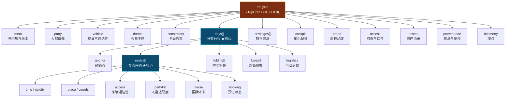
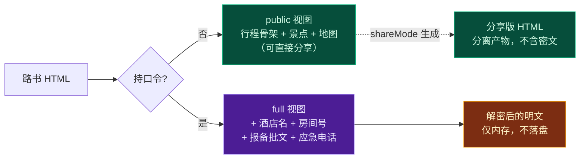

# 第 4 章 · TripCraft DSL v1.0.0 数据契约规范

> **状态**：`Stable Draft` ｜ **Schema 文件**：[`spec/trip.schema.json`](../spec/trip.schema.json)
> **铁律依据**：[铁律 6 · DSL 是唯一真相源](00-overview-and-glossary.md#铁律-6--dsl-是唯一真相源-single-source-of-truth)
> **本章目标**：定义一份"写完即可编译"的行程契约，字段语义无歧义、可机器校验、可向后兼容演进。

---

## 4.0 设计原则与命名约定

### 4.0.1 五条建模原则

| # | 原则 | 具体含义 | 反面案例（禁止） |
| :-- | :--- | :--- | :--- |
| P1 | **语义优先于展示** | DSL 描述"这是什么"，不描述"长什么样" | ❌ `"color": "#fbbf24"` 直接写进节点；✅ `theme: "dunhuang-gold"` 由主题层解析 |
| P2 | **事实与建议分离** | 客观数据与主观推荐分属不同字段 | ❌ `"note": "必去，超美"` 混入 `place`；✅ 见 [铁律 7](00-overview-and-glossary.md#铁律-7--事实与建议分离-fact-vs-advice) |
| P3 | **稳定 ID 先行** | 每个可寻址对象必须有跨版本稳定的 `id` | 无 `id` 的节点无法被增量补丁定位 |
| P4 | **可选优于必填** | 只把"没有它就无法渲染"的字段设为必填 | 过度必填会让 AI 生成失败率飙升 |
| P5 | **冗余即债务** | 同一信息只存一处；派生值一律由编译器计算 | ❌ 同时存 `km` 和 `polyline`；✅ 只存 `polyline`，`km` 由编译器算 |

### 4.0.2 命名与类型约定

```
命名风格：camelCase（JSON 键名） / SCREAMING_SNAKE（枚举值除外，枚举用 kebab-case）
坐标系统：GCJ-02（高德/腾讯系），全文档统一，字段名必须带 coords 而非 position
坐标顺序：[经度, 纬度]（lng, lat）—— 与高德 JS API 一致，与 GeoJSON 一致
        ⚠️ 与百度（lat,lng）相反，与 Exif GPS（WGS-84）坐标系不同，转换见第 6 章
时间格式：本地时间，ISO 8601 无时区偏移 → "09:30" / "2026-09-24T09:30"
         跨时区行程（如新疆，名义 UTC+8 实际作息偏移）用 timeBasis 字段声明
时长单位：整数分钟（durationMin），禁止 "1.5h" 这类字符串
距离单位：整数米（distanceM），展示层负责格式化为 km
海拔单位：整数米（altitudeM）
金额单位：整数分（amountCents），禁止浮点 —— 避免 0.1+0.2 精度问题
```

> ⚠️ **金额必须用整数分**。西行母本的 AA 记账器若用浮点累加，10 人 × 数十笔账必然出现 `¥1234.5600000000002` 的显示事故。这是已被无数项目验证的坑。

---

## 4.1 顶层对象结构



### 4.1.1 顶层字段速查

| 字段 | 类型 | 必填 | 说明 |
| :--- | :--- | :--: | :--- |
| `dslVersion` | `string` | ✔ | 语义化版本，当前 `"1.0.0"` |
| `$schema` | `string` | | JSON Schema 引用，供编辑器补全 |
| `id` | `string` | ✔ | 行程全局唯一 ID，格式 `trip_<yyyymmdd>_<slug>` |
| `meta` | `object` | ✔ | 标题、副标题、层级、作者 |
| `party` | `object` | ✔ | 人群画像 —— 驱动第 1 章的人群裁决引擎 |
| `vehicle` | `object` | | 载具信息 —— 驱动通达性过滤 |
| `theme` | `object` | | 视觉主题 —— 缺省时由目的地语义嗅探自动决定 |
| `constraints` | `object` | | 全局硬约束 |
| `days` | `array` | ✔ | 分天行程，**至少 1 天** |
| `privileges` | `array` | | 特许资源清单 |
| `cockpit` | `object` | | 车机下发配置 |
| `brand` | `object` | | 白标品牌（可外链到 `brand.json`） |
| `access` | `object` | | 权限与口令保护 |
| `assets` | `object` | | 图片/音频资产清单 |
| `provenance` | `object` | | 数据来源与授权声明（**法务必需**） |
| `telemetry` | `object` | | 埋点开关（默认全关） |

---

## 4.2 `meta` —— 元信息

```jsonc
{
  "meta": {
    "title": "西行计划 · 丝路自驾路书",
    "subtitle": "9天西北大环线 · 考斯特深度定制",
    "tier": "vip",                          // standard | vip | b2b
    "designSystem": "apple-glass",          // 见 §4.6
    "language": "zh-CN",
    "timezone": "Asia/Shanghai",
    "timeBasis": {                          // 可选：真实作息时区
      "declared": "Asia/Shanghai",
      "practicalOffsetMin": 120,            // 新疆实际作息比北京时间晚约 2h
      "note": "当地日出约 07:30（北京时间），晚餐高峰 21:00 后"
    },
    "cover": {
      "assetId": "hero_dunhuang",
      "focalPoint": [0.5, 0.4]              // 裁切焦点，0~1 归一化
    },
    "authors": [
      { "role": "planner", "name": "JYX" },
      { "role": "agency",  "ref": "brand:zhangye-jinma" }
    ],
    "createdAt": "2026-08-01T10:00:00+08:00",
    "revision": 7
  }
}
```

**字段裁决说明**：
- `tier` 决定功能开关（见白皮书 §5），但**不决定核心体验可用性** —— 普通版同样具备完整行程、地图联动、大字模式（铁律 2）。
- `timeBasis.practicalOffsetMin` 是真实痛点：新疆、西藏西部名义使用北京时间，但实际餐馆 11:00 才开门、日落 22:00。若编译器不处理，会生成"18:00 去拍日落"这种荒谬行程。**这个字段是必答项，不是装饰。**

---

## 4.3 `party` —— 人群画像（驱动决策引擎）

`party` 不只是展示信息，它是 [第 1 章 §1.8](01-resilience-and-failover.md) 人群冲突裁决算法的**权重输入源**。

```jsonc
{
  "party": {
    "size": 10,
    "groups": [
      {
        "key": "senior",
        "label": "长辈",
        "count": 2,
        "weights": { "comfort": 0.9, "photo": 0.1, "adventure": 0.05, "pace": 0.2 },
        "hardNeeds": {
          "maxWalkMeters": 500,          // 单段步行上限
          "restroomIntervalMin": 90,     // 如厕间隔
          "hotFoodRequired": true,       // 需热食
          "maxAltitudeM": 3600,          // ★ 医学海拔上限
          "shadeRequired": true
        }
      },
      {
        "key": "child",
        "label": "儿童",
        "count": 2,
        "weights": { "comfort": 0.6, "photo": 0.2, "adventure": 0.6, "pace": 0.3 },
        "hardNeeds": {
          "napWindow": ["13:00", "14:30"],   // 午睡窗口，算法需在此窗口内安排车程
          "maxAltitudeM": 3000,
          "safetyRadiusM": 200
        }
      },
      {
        "key": "adult",
        "label": "青壮年",
        "count": 5,
        "weights": { "comfort": 0.4, "photo": 0.9, "adventure": 0.8, "pace": 0.7 },
        "hardNeeds": {}
      },
      {
        "key": "driver",
        "label": "驾驶员",
        "count": 2,                        // ★ 必须 ≥2 才能长途轮换
        "weights": { "comfort": 0.8, "photo": 0.3, "adventure": 0.4, "pace": 0.1 },
        "hardNeeds": {
          "maxDailyDriveKm": 350,
          "maxContinuousDriveMin": 180,
          "noNightDriving": true,
          "backupDriverAvailable": true
        }
      }
    ],
    "medicals": [                          // ★ 敏感，加密存储，见 §4.11
      {
        "groupId": "senior",
        "flags": ["hypertension", "altitude_sickness_history"],
        "encrypted": true,
        "cipherRef": "enc:party-medical-v1"
      }
    ],
    "mobility": {
      "wheelchair": false,
      "reducedMobility": true,
      "note": "长辈膝盖术后，长下坡需扶手"
    },
    "animals": { "pets": false }
  }
}
```

**关键设计：`weights` 是价值取向的数值化。**

`weights` 的四个维度 `comfort / photo / adventure / pace` 直接来自 [第 1 章 §1.8](01-resilience-and-failover.md) 的「价值锚定问题」。当 Socratic 引擎问出：

> "明天有两个选择：A) 全员轻松，少看一个景点；B) 长辈在车上休息，年轻人登顶。"

用户的回答被**翻译成权重调整**，而不是仅作为一次性选择：

| 用户回答 | 权重调整 |
| :--- | :--- |
| "选 A，全家一起最重要" | `senior.hardNeeds` 提升为**全局硬约束**；`adult.adventure` 从 0.8 降至 0.4 |
| "选 B，能爬就爬" | 允许 `splitQueue`（分队方案）合法化；`adult.adventure` 保持 |
| "看情况吧" | 不调整，全部标 `tentative`，在生成的路书里**同时给出 A/B 两版**，现场举手决定 |

**这个机制的价值**：一次提问，影响后续所有天的排程。这是"渐进式收敛漏斗"真正的收敛点——收敛的不是信息，是**效用函数**。

---

## 4.4 `vehicle` —— 载具与通达性

```jsonc
{
  "vehicle": {
    "primary": {
      "type": "coaster",                   // sedan | suv | offroad | mpv | coaster | bus | rv | motorcycle
      "label": "丰田考斯特 23 座",
      "dimensions": { "heightM": 2.8, "widthM": 2.03, "lengthM": 6.99, "weightT": 5.5 },
      "plateType": "yellow",               // blue | yellow | green | newEnergy
      "fuel": "diesel",                    // gasoline | diesel | electric | hybrid | phev
      "rangeKm": 700
    },
    "convoy": [                            // 车队模式
      { "callSign": "头车", "vehicleRef": "primary" },
      { "callSign": "2号车", "type": "suv", "fuel": "electric", "rangeKm": 420 }
    ],
    "energy": {                            // 新能源专属，见 §4.9 与第 2 章
      "batteryKwh": 0,
      "applicable": false
    }
  }
}
```

### 4.4.1 车辆通达性矩阵 `vehicleAccess`

**这是全书最有商业价值的元数据之一。** 它把线下老司机脑袋里的"考斯特能不能进"变成了结构化数据。它既可挂在节点上（`node.access`），也可挂在 POI 库上（由地接社众包维护，见 [第 3 章 §3.6](03-b2b-agency-operations.md)）。

```jsonc
{
  "vehicleAccess": {
    "sedan":       { "allowed": true },
    "suv":         { "allowed": true },
    "offroad":     { "allowed": true, "recommended": true },
    "coaster":     {
      "allowed": true,
      "maxHeightM": 3.2,
      "maxLengthM": 7.0,
      "restriction": "景区北门限高 3.2m，宽 2.4m —— 考斯特须走南门（宽 4.5m）",
      "dropoffPoint": { "name": "南门大巴落客区", "coords": [94.8021, 40.0412] },
      "parkingFee": 3000,                  // 分
      "advanceBooking": true
    },
    "bus":         { "allowed": false, "reason": "乡村道路宽 3.5m，大巴无法会车" },
    "rv":          { "allowed": false, "reason": "限宽 2.5m" },
    "confidence": 0.9,                     // ★ 数据置信度，0~1，见第 3 章
    "verifiedAt": "2026-07-15",
    "verifiedBy": "zhangye-jinma"          // 地接社 ID
  }
}
```

> ⚠️ **`confidence` 字段是必需的，不是可选。** 地面数据会腐化（道路改建、限高变更）。编译时若 `confidence < 0.6`，必须在路书上显式标注「⚠️ 通达性信息待现场确认」而不是假装确定。这是[铁律 3](00-overview-and-glossary.md#铁律-3--降级不可耻白屏才是罪-degrade-never-blank)在数据层的体现。

---

## 4.5 `days[]` —— 分天行程（全书核心）

### 4.5.1 日对象结构

```jsonc
{
  "days": [
    {
      "dayIndex": 0,
      "tag": "D0",
      "date": "2026-09-24",
      "dateLabel": "09月24日 · 周四",
      "title": "济南 ✈ 兰州 · 丝路集结夜",
      "dayType": "transit_arrival",        // ★ 见下表
      "bufferCapacity": 0,                 // ★ 应力吸收容量（小时），0 = 刚性日
      "anchor": { /* §4.5.2 */ },
      "nodes": [ /* §4.5.3 —— 核心 */ ],
      "folding": [ /* §4.5.4 */ ],
      "fuses": [ /* §4.5.5 */ ],
      "logistics": { /* §4.5.6 */ }
    }
  ]
}
```

**`dayType` 枚举与应力吸收策略**：

| `dayType` | 语义 | 建议 `bufferCapacity` | 扰动时策略 |
| :--- | :--- | :--- | :--- |
| `transit_arrival` | 抵达日（接机/接站） | 3 | 可压缩接机后全部活动 |
| `transit_departure` | 离开日（送机/送站） | 4 | 弹性最高，可整段让位 |
| `core_sight` | 核心景观日（刚性） | 0 | **优先保护**，扰动优先由其他日吸收 |
| `buffer` | 机动日 | 8 | **首选吸收池** |
| `long_haul` | 长途赶路日 | 2 | 可拆分或改为夜间抵达 |
| `leisure` | 休整日 | 6 | 次选吸收池 |
| `event_locked` | 已购票/已预约锁定日 | 0 | 不可移动，扰动直接升级为熔断 |

> 📌 **这张表是 [第 1 章 §1.7](01-resilience-and-failover.md) 应力吸收算法的输入。** `bufferCapacity` 之和 = 整趟行程的**总抗扰动预算**。编译时若总和 < 行程天数的 15%，应主动告警："本行程弹性偏低，建议增设 1 个机动日。"

### 4.5.2 `anchor` —— 硬锚点

硬锚点是**不可移动的时间/空间约束**。它们是行程的骨架，一旦断裂必须触发结构重排。

```jsonc
{
  "anchor": {
    "start": {
      "time": "2026-09-24T14:30",
      "type": "flight_arrival",            // flight_arrival | rail_arrival | self_drive | hotel_checkin
      "ref": { "flightNo": "MU2456", "from": "TNA", "to": "LHG" },
      "rigidity": "rigid",
      "lateToleranceMin": 180,             // 可容忍延误 3h 而不触发重排
      "fallback": {
        "ifDelayedBeyond": 180,
        "action": "compress_after",
        "compressibleNodeIds": ["n_d0_02", "n_d0_03"]
      }
    },
    "end": {
      "time": "2026-10-02T11:20",
      "type": "flight_departure",
      "rigidity": "rigid"
    },
    "stays": [
      {
        "nightIndex": 0,
        "city": "兰州",
        "status": "confirmed",             // confirmed | tentative | suggested
        "name": "水岸云上酒店（中山桥店）",
        "address": "兰州市城关区南滨河东路873号",
        "coords": [103.8178, 36.0668],
        "checkIn": "14:00",
        "checkOut": "12:00",
        "roomType": "3 间大床 + 2 间双床",
        "bookingRef": "enc:hotel-ref-0",   // ★ 加密，见 §4.11
        "contact": "+86-931-XXXXXXX"
      }
    ]
  }
}
```

> 🔒 **`bookingRef` 必须是加密引用**。订房确认号、车牌号、房间号属于[铁律 4](00-overview-and-glossary.md#铁律-4--数据主权本地化-local-data-sovereignty)保护范围。若路书要公开分享（如发朋友圈），这些字段必须默认打码，仅持口令者可见（[§4.11](#411-access--权限与口令)）。

### 4.5.3 `nodes[]` —— 节点序列（DSL 的原子单元）

#### (a) 节点通用结构

```jsonc
{
  "id": "n_d3_04",                         // ★ 稳定 ID，格式 n_d<dayIndex>_<seq>，必须全局唯一
  "type": "poi",                           // 见 (b) NodeType 矩阵
  "seq": 4,
  "time": {
    "planned": "14:30",
    "window": ["14:00", "15:30"],          // 弹性窗口
    "durationMin": 90,
    "rigidity": "soft",                    // rigid | soft | flexible
    "bufferMin": 20                        // 预留给本节点的弹性缓冲
  },
  "place": {
    "name": "嘉峪关关城",
    "coords": [98.2216, 39.8009],
    "address": "甘肃省嘉峪关市雄关路",
    "poiIds": { "amap": "B0FFFXXXXX", "dianping": "..." },   // 用于生成第三方跳转
    "elevationM": 1620,
    "geofenceM": 300                       // 到达判定半径，用于打卡
  },
  "altitudeM": 1620,
  "access": { /* vehicleAccess，见 §4.4.1 */ },
  "partyFit": {                            // ★ 人群适配度，驱动裁决引擎
    "senior": { "score": 0.8, "walkMeters": 800, "shade": true, "seating": true },
    "child":  { "score": 0.5, "safety": 0.9, "interactive": 0.3 },
    "adult":  { "score": 0.9, "photo": 0.95, "adventure": 0.3 },
    "driver": { "score": 0.7, "parkingDifficulty": 0.4 }
  },
  "fact": {                                // ★ 铁律 7：客观事实
    "openHours": ["08:30", "18:00"],
    "ticketCents": 11000,
    "ticketNote": "60 岁以上免票（凭证件）",
    "phone": "0937-XXXXXXX",
    "officialUrl": "https://..."
  },
  "advice": {                              // ★ 铁律 7：主观建议
    "summary": "建议从东门进，顺时针绕城一圈约 90 分钟",
    "bestTime": "16:00 后顺光，城墙呈金色",
    "tips": ["关城风大，备防风外套", "无人机需在景区管理处登记"],
    "confidence": "high"                   // high | medium | low —— low 时 UI 显式标注"待核实"
  },
  "media": { /* §4.5.3(c) 富媒体卡 */ },
  "booking": { /* §4.5.3(d) */ },
  "fuseRef": "fz_d3_road",                 // 关联到熔断预案
  "tentative": false,                      // ★ 待定容忍标记，见 §4.5.7
  "notes": [
    { "tone": "info",    "text": "讲解员可现场租用，¥100/场" },
    { "tone": "warning", "text": "关城内洗手间在西门，东门无" }
  ]
}
```

#### (b) NodeType 矩阵

| `type` | 语义 | 必填专有字段 | 特有可选字段 |
| :--- | :--- | :--- | :--- |
| `poi` | 景点 / 打卡点 | `place`, `fact.openHours` | `altitudeM`, `photography` |
| `transit` | 赶路段 | `route`（见下） | `servicesAlongRoute` |
| `meal` | 用餐 | `place`, `fact.openHours` | `cuisine`, `capacity`, `dietary` |
| `stay` | 住宿 | `place`, `anchorRef` | `checkIn`, `amenities` |
| `activity` | 体验活动 | `place`, `operator` | `safetyLevel`, `physicalDemand` |
| `rest` | 休整 / 洗手间 | `time` | `facility` |
| `service` | 服务区 / 加油 / 充电 | `place` | `fuel`, `charging` |
| `customs` | 通行 / 报备 / 检查站 | `place`, `privilegeRef` | `requiredDocs` |
| `note` | 纯提示（无地点） | `notes` | — |

**`transit` 节点的特殊结构**（时空折叠的主要对象）：

```jsonc
{
  "id": "n_d3_05",
  "type": "transit",
  "time": { "planned": "16:00", "durationMin": 145, "rigidity": "soft" },
  "route": {
    "from": { "name": "嘉峪关关城", "coords": [98.2216, 39.8009] },
    "to":   { "name": "敦煌市区",   "coords": [94.6619, 40.1421] },
    "roadCodes": ["G30 连霍高速"],
    "distanceM": 385000,
    "polyline": "94.6619,40.1421;94.6802,40.1305;...",   // 简化后，见 §4.5.4
    "polylinePrecision": 5,                 // 小数位数，5 位 ≈ 1m
    "polylineSource": "amap_driving_v5",    // ★ 法务必需：数据来源声明
    "elevationProfile": [
      { "atM": 0,      "altitudeM": 1620 },
      { "atM": 120000, "altitudeM": 2380 },
      { "atM": 385000, "altitudeM": 1139 }
    ],
    "tollsCents": 14500,
    "servicesAlongRoute": [
      { "name": "清泉服务区", "atM": 180000, "coords": [96.8, 40.1],
        "fuel": ["gasoline", "diesel"], "charging": [], "restroom": true }
    ]
  }
}
```

> ⚠️ **`polylineSource` 是法务必需字段**。高德服务条款对算路结果的存储与再利用有明确边界（见 [未决事项 OI-003](00-overview-and-glossary.md#07-未决事项登记册-open-issues-register)）。记录来源使得**合规审计可追溯**，也让"若某源不可用则回退到另一源"成为可实现的策略。

#### (c) `media` —— 富媒体展卡

对应白皮书 §4.4 的"通义千问×淘宝模式"卡片的**数据契约**。

```jsonc
{
  "media": {
    "heroAssetId": "poi_jiayuguan_01",
    "gallery": ["poi_jiayuguan_02", "poi_jiayuguan_03"],
    "source": "ai_generated",              // ai_generated | user_upload | licensed_library | ota_authorized
    "license": { "type": "cc0", "attribution": null },   // ★ 法务必需
    "commerceCard": {                      // ★ 仅在获得 OTA 联盟授权时填充
      "provider": "dianping",              // dianping | meituan | fliggy | ctrip
      "authorized": true,
      "rating": 4.8,
      "avgPriceCents": 5800,
      "badges": ["必吃榜"],
      "deepLink": "dianping://shop?shopuuid=...",
      "universalLink": "https://...",
      "cpsSubId": "tripcraft_{tripId}_{agencyId}",       // 归因参数
      "priceUpdatedAt": "2026-09-20T11:00:00+08:00"      // ★ 价格必带时间戳
    }
  }
}
```

> ⚠️ **`priceUpdatedAt` 是必需字段。** 展示一个 3 天前的价格而不标注时间，在《价格法》与《电子商务法》下都可能构成误导。UI 上必须显示"价格更新于 X 小时前"。

> ⚠️ **`commerceCard` 只允许在 `authorized: true` 时渲染。** 未经联盟授权的商户数据一律走 `ai_generated` 兜底卡。这是[第 7 章 §7.3](07-legal-and-compliance.md) 的合规红线在数据层的强制。

#### (d) `booking` —— 预订状态机

```jsonc
{
  "booking": {
    "required": true,
    "channel": "agency",                   // self | agency | ota | on_site
    "status": "confirmed",                 // not_needed | suggested | pending | submitted | confirmed | rejected | cancelled
    "deadline": "2026-09-20T18:00",
    "quotaType": "team_quota",             // public | team_quota | privilege_locked
    "privilegeRef": "pv_mogao_a",
    "refs": [{ "type": "voucher", "value": "enc:booking-voucher-3" }],
    "statusHistory": [
      { "at": "2026-09-18T10:00", "status": "submitted", "by": "zhangye-jinma" },
      { "at": "2026-09-19T16:20", "status": "confirmed", "by": "system" }
    ]
  }
}
```

`statusHistory` 让地接社的报备进度可以**逐条渲染成时间轴**，这正是白皮书 §5.8「报备进度条」的数据基础。

### 4.5.4 `folding[]` —— 时空折叠

**定义**：把连续的低信息密度节点（通常是长途赶路）合并为一个可展开的折叠块。默认收起时只显示一行摘要，展开后显示完整剖面。

```jsonc
{
  "folding": [
    {
      "id": "fold_d3_morning",
      "label": "上午 · 长途赶路 3h20m",
      "nodeIds": ["n_d3_01", "n_d3_02"],   // 被折叠的节点
      "collapsed": true,
      "defaultExpanded": false,
      "summary": {
        "distanceM": 285000,
        "durationMin": 200,
        "maxAltitudeM": 2380,
        "roadCodes": ["G30 连霍高速"]
      },
      "spans": [                            // 展开后渲染的视图片段
        { "type": "elevation", "dataRef": "elevationProfile:n_d3_02" },
        { "type": "serviceList", "dataRef": "servicesAlongRoute:n_d3_02" },
        { "type": "mediaStrip", "assetIds": ["scenery_qilian_01"] }
      ],
      "autoExpandRule": {                   // ★ 智能展开：疲劳点自动提醒
        "trigger": "elapsedOver", "valueMin": 120,
        "action": "expand_and_suggest_rest"
      }
    }
  ]
}
```

**设计要点**：
- `collapsed` 是**默认态**，但 `autoExpandRule` 允许运行时按时间/里程自动展开——例如连续驾驶 2 小时后自动弹出"前方 40km 有服务区，建议休整"。这让折叠块从"视觉洁癖"升级为**主动安全提示装置**。
- `spans` 是**声明式**的：折叠块不描述"画成什么样"，只声明"我要展示哪几类视图 + 数据取哪里"。渲染样式由主题层决定（[原则 P1](#401-五条建模原则)）。

### 4.5.5 `fuses[]` —— 熔断预案

**熔断预案是"局部重算"的预授权。** 它的价值在于：**在平静时就把混乱时的决策做完**——事发当下，领队只需按一个按钮，而不是在戈壁滩上重新规划。

```jsonc
{
  "fuses": [
    {
      "id": "fz_d3_road",
      "label": "当金山路段封闭",
      "appliesTo": ["n_d3_02", "n_d3_05"],
      "trigger": {
        "any": [
          { "type": "road_closure", "segment": "G215|当金山垭口段", "source": "amap_traffic" },
          { "type": "manual_report", "reportTag": "road_closed" },
          { "type": "weather", "condition": "snowstorm", "region": "当金山" }
        ],
        "evaluationWindowMin": 30            // 触发后 30min 内持续为真才激活，防抖动
      },
      "levels": [
        {
          "id": "A",
          "label": "计划 A · 原路线",
          "isDefault": true,
          "condition": "always",
          "nodeIds": ["n_d3_02", "n_d3_05"]
        },
        {
          "id": "B",
          "label": "弹性缓冲 · 绕行 G3011 柳格高速",
          "condition": "closureWithoutFullBlock",
          "reroute": {
            "mode": "amap_driving_avoid",
            "avoidSegments": ["G215|当金山垭口段"],
            "waypoints": [[94.9, 39.6]]
          },
          "deltaEstimate": { "extraMin": 55, "extraM": 78000 },
          "cascade": [                        // ★ 级联影响声明
            { "nodeId": "n_d3_04", "action": "compress", "byMin": 30 },
            { "nodeId": "n_d3_06", "action": "compress", "byMin": 20 },
            { "nodeId": "n_d3_07", "action": "skip", "reason": "抵达过晚，餐厅已打烊" }
          ]
        },
        {
          "id": "C",
          "label": "降级预案 · 改宿阿克塞，次日提前出发",
          "condition": "fullBlock",
          "restructure": {
            "type": "shift_stay",
            "newStay": {
              "city": "阿克塞", "status": "tentative",
              "name": "阿克塞县城商务酒店（待定）",
              "coords": [94.34, 39.63]
            },
            "nextDayAdjust": { "startEarlierMin": 90, "skipNodeIds": ["n_d4_01"] }
          },
          "requiresConfirmation": true,        // ★ 结构级改动必须人工确认
          "notify": ["leader", "agency:zhangye-jinma"]
        }
      ],
      "rollback": { "allowed": true, "windowMin": 120 }
    }
  ]
}
```

**三级熔断的设计哲学**：

| 级别 | 改动范围 | 是否需确认 | 类比 |
| :--- | :--- | :--- | :--- |
| **A** | 无 | 否 | 正常态 |
| **B** | 当日内节点顺序/时长 | **否**（静默切换，仅提示） | 局部绕行 |
| **C** | 跨日结构（住宿、次日起点） | **是** | 战略级调整 |

> 📌 **`requiresConfirmation` 是安全设计，不是交互设计。** 系统**永远不能**在无人确认的情况下改变住宿地——那会导致半夜抵达一个陌生县城而酒店没订。机器可以做的是**把方案准备好**，决策必须留给人。

> 📌 **`cascade` 是熔断预案的灵魂。** 一次绕行会连锁地压迫后续所有节点。若不做级联声明，系统会呈现"新路线 18:40 到达"这样一个看似可行、实则导致晚餐泡汤、次日疲劳驾驶的**伪解**。显式声明级联，才能把隐性代价摆上台面。

### 4.5.6 `logistics` —— 当日后勤

```jsonc
{
  "logistics": {
    "summary": { "totalDistanceM": 385000, "totalDriveMin": 265, "totalWalkM": 2400,
                 "maxAltitudeM": 3648, "minAltitudeM": 1139 },
    "fuelPlan": [
      { "atNodeId": "n_d3_03", "type": "refuel", "estimatedCostCents": 58000,
        "station": "中石油嘉峪关服务区站" }
    ],
    "chargingPlan": [],                    // 新能源，见 §4.9
    "weatherExpectation": {                // ★ 预报 = 期望值，非承诺
      "source": "amap_weather",
      "fetchedAt": "2026-09-20T08:00:00+08:00",
      "segments": [
        { "atNodeId": "n_d3_02", "condition": "sunny", "tempC": [6, 18], "windLevel": 4 }
      ]
    },
    "sunTimes": { "sunrise": "07:42", "sunset": "19:56", "source": "computed" },
    "safetyNotes": [
      { "tone": "warning", "text": "垭口段 12km 连续下坡，建议低挡位发动机制动，勿长踩刹车" }
    ]
  }
}
```

### 4.5.7 `tentative` —— 待定容忍策略的落地

白皮书 §3.4 承诺"绝不追问卡死"。这一承诺在 DSL 中由 `tentative` 字段家族承载：

```jsonc
{
  "id": "n_d1_03",
  "type": "meal",
  "tentative": true,
  "tentativeReason": "user_undecided",     // user_undecided | booking_pending | awaiting_quote
  "injectedDefault": {                     // ★ 系统注入的行业最佳实践
    "source": "tripcraft_heuristic_v1",
    "rule": "西北线路晚餐优先选酒店步行 1km 内、有包间、人均 ¥60~120 的老字号"
  },
  "place": { "name": "推荐：甘州名吃（大佛寺文化街总店）", "coords": [100.4521, 38.9312] },
  "alternatives": [                        // ★ 现场举手表决的候选池
    { "name": "苗氏卷子鸡", "coords": [100.4518, 38.9298], "partyFit": { "senior": 0.7 } },
    { "name": "孙记炒炮",   "coords": [100.4533, 38.9331], "partyFit": { "senior": 0.6 } }
  ]
}
```

**渲染规则（编译器责任）**：
1. `tentative: true` 的节点必须**加视觉标记**（🟡 待定胶囊），不得伪装成确定行程；
2. 必须同时渲染 `alternatives[]` 为可点选的候选池 —— 这是"现场举手表决"的物理载体；
3. `injectedDefault.rule` 的文本应在**长按/点击时可见**，让用户知道"这个默认值是系统猜的，不是我说的"——**透明性是信任的基础**。

---

## 4.6 `theme` —— 视觉主题

```jsonc
{
  "theme": {
    "themeId": "dunhuang-gold",
    "designSystem": "apple-glass",
    "detection": {
      "mode": "auto",                      // auto | manual
      "signals": ["敦煌", "戈壁", "丝路"],
      "confidence": 0.94
    },
    "overrides": {                         // ★ 只允许覆盖 Token，禁止内联样式
      "accentPrimary": "#fbbf24"
    },
    "accessibility": {
      "seniorMode": true,
      "seniorModeDefault": false,          // 是否默认开启
      "contrastTarget": "AAA",             // AA | AAA
      "minTouchTargetPx": 48
    },
    "motion": {
      "level": "full",                     // full | reduced | none（尊重 prefers-reduced-motion）
      "parallax": true
    }
  }
}
```

**`designSystem` 枚举**（对应白皮书 §5.2 的五大流派）：

| 值 | 名称 | 归属 |
| :--- | :--- | :--- |
| `apple-glass` | Apple Liquid Glass | 免费 + VIP |
| `google-material` | Google Material You | VIP |
| `vintage-retro` | 复古探索家手账 | VIP |
| `swiss-minimal` | 瑞士国际主义扁平 | VIP |
| `cyber-hud` | 赛博夜巡仪表盘 | VIP |

> ⚠️ **`overrides` 只允许覆盖语义 Token**（`accentPrimary` / `bgDeep` / `radiusLg`…），**禁止**出现 `"css": ".foo{...}"` 这类裸样式注入。原因：裸样式会绕过主题系统、破坏大字模式的可访问性保证、且使得未来主题升级不可能。这条限制必须在 Schema 层面用 `additionalProperties: false` 硬性卡死。

---

## 4.7 `constraints` —— 全局约束

```jsonc
{
  "constraints": {
    "hard": [
      { "id": "hc_altitude",  "type": "maxAltitudeM", "value": 3600,
        "scope": "group:senior", "reason": "高血压 + 高原反应史", "override": "medical_clearance" },
      { "id": "hc_night",     "type": "noNightDriving", "value": true,
        "scope": "group:driver" },
      { "id": "hc_daily_km",  "type": "maxDailyDriveKm", "value": 350, "scope": "group:driver" },
      { "id": "hc_height",    "type": "vehicleMaxHeightM", "value": 3.2, "scope": "vehicle:coaster" }
    ],
    "soft": [
      { "id": "sc_budget", "type": "budgetPerPersonCents", "value": 800000, "weight": 0.6 },
      { "id": "sc_pace",   "type": "paceScore", "value": 0.4, "weight": 0.8 }
    ],
    "violationPolicy": {
      "hard": "block",                     // block | warn | degrade
      "soft": "score_penalty"
    }
  }
}
```

**关键设计**：硬约束带 `scope`，说明**它约束的是谁**。"海拔 ≤ 3600m" 只约束 `senior` 组 —— 这意味着系统可以合法地生成"长辈在山下茶馆休息，青壮年登顶"的**分队方案**，而不是把整个行程砍掉一个景点。这是 [第 1 章 §1.8](01-resilience-and-failover.md) 分队机制的数据前提。

`override: "medical_clearance"` 表示该硬约束可被**医疗证明**解除 —— 保留了现实中的弹性（医生开了证明就可以上）。

---

## 4.8 `privileges[]` —— 特许资源

对应白皮书 §5.8 与 [第 3 章 §3.4](03-b2b-agency-operations.md)。这里给出 DSL 侧的完整契约。

```jsonc
{
  "privileges": [
    {
      "id": "pv_dongfeng",
      "type": "restricted_access",         // restricted_access | reservation_quota | physical_hold | lane_permit
      "name": "东风航天城 · 军管区通行报备",
      "provider": "brand:zhangye-jinma",
      "requirements": [
        { "key": "real_name_list", "label": "全体成员实名信息", "type": "pii_form",
          "fields": ["name", "idNumber", "phone", "employer"],
          "sensitive": true, "storage": "local_encrypted",
          "retentionDays": 7, "legalBasis": "consent" },
        { "key": "lead_time", "label": "报备提前期", "type": "duration", "value": "P3D" },
        { "key": "photo_ban", "label": "摄影限制", "type": "text",
          "value": "禁止拍摄发射工位及测控设施" }
      ],
      "workflow": [
        { "step": 1, "name": "收集实名信息", "owner": "traveler", "deadline": "T-5D" },
        { "step": 2, "name": "提交政审",     "owner": "agency",   "deadline": "T-3D" },
        { "step": 3, "name": "获取批文号",   "owner": "agency",   "output": "approvalCode" },
        { "step": 4, "name": "现场核验入园", "owner": "on_site",  "requires": ["approvalCode", "idCard"] }
      ],
      "status": "approved",
      "evidence": [
        { "type": "approval_doc", "assetId": "priv_dongfeng_doc",
          "uploadedAt": "2026-09-20T09:00:00+08:00", "visibleTo": ["leader", "agency"] }
      ],
      "display": {
        "badge": "🎖️ 政务报备通道",
        "progressVisible": true,
        "publicHint": "需提前报备，本团已办理"
      }
    },
    {
      "id": "pv_mogao_a",
      "type": "reservation_quota",
      "name": "莫高窟 A 类特窟团队配额",
      "quota": { "total": 10, "used": 10, "unit": "人" },
      "lockStatus": "locked",
      "lockRef": "enc:mogao-lock-ref"
    },
    {
      "id": "pv_zhangye_room",
      "type": "physical_hold",
      "name": "张掖甘州名吃 · 二楼大包间",
      "holdUntil": "2026-09-27T19:30",
      "capacity": 12
    },
    {
      "id": "pv_coaster_dropoff",
      "type": "lane_permit",
      "name": "莫高窟南门大巴专用落客位",
      "vehicleTypes": ["coaster", "bus"]
    }
  ]
}
```

**四种类型的语义边界**：

| `type` | 稀缺性来源 | 典型对象 | 关键字段 |
| :--- | :--- | :--- | :--- |
| `restricted_access` | 行政管制 | 军管区、保护区、边境 | `requirements`, `workflow` |
| `reservation_quota` | 供给配额 | 特窟、限量门票 | `quota`, `lockStatus` |
| `physical_hold` | 空间占用 | 包间、停车位、营位 | `holdUntil`, `capacity` |
| `lane_permit` | 通行资格 | 大巴落客位、越野通道 | `vehicleTypes` |

> 🔒 **`legalBasis: "consent"` 是《个人信息保护法》第 13 条的合规锚点。** 每个采集敏感信息的字段都必须能回答"我凭什么收集它"。这个问题回答不上来，就不该有这个字段。

---

## 4.9 `cockpit` —— 车机配置

对接 [第 2 章](02-cockpit-protocol.md)。DSL 只声明**意图**，不下达指令——具体通道由运行时按可用性协商。

```jsonc
{
  "cockpit": {
    "enabled": true,
    "preferredChannels": ["amap-uri", "qr-relay", "clipboard"],
    "routeHandoff": {
      "mode": "full_day",                  // single_node | full_day | next_leg
      "includeWaypoints": true,
      "maxWaypoints": 16,                  // ★ 上限由通道能力决定，见 OI-001
      "waypointPolicy": {                  // 哪些节点有资格成为途经点
        "minStayMin": 25,
        "excludeTypes": ["rest", "note"],
        "maxPerDay": 12
      }
    },
    "multiScreen": {
      "arbitration": {
        "drivingStateSource": "vehicle_api",        // vehicle_api | mobile_sensors | manual
        "deferWhenDriving": true,
        "pushQuotaPer5Min": 2,
        "quietMode": { "enabled": true, "trigger": "driver_long_press" }
      },
      "roles": {
        "center":    { "view": "hud",  "interactive": false },
        "copilot":   { "view": "full", "canPush": true,  "requiresConfirm": false },
        "rear":      { "view": "senior_large", "canPush": true, "requiresConfirm": true }
      }
    },
    "energyRadar": {
      "enabled": false,
      "batteryKwh": 0,
      "consumptionModel": {
        "baseKwhPer100km": 0,
        "altitudeGainKwhPer1000m": 0,
        "temperatureDerate": []            // 低温衰减曲线
      },
      "reserveSocPct": 15,
      "preferredNetworks": ["特来电", "国家电网", "品牌超充"]
    }
  }
}
```

---

## 4.10 `brand` —— 白标品牌

可由 `brand.json` 外链引入（[第 3 章 §3.3](03-b2b-agency-operations.md)），此处为内联覆盖。

```jsonc
{
  "brand": {
    "ref": "brand:zhangye-jinma",
    "displayName": "金马国际旅行社 · 张掖地接中心",
    "logo": { "light": "asset:brand_logo_dark_bg", "dark": "asset:brand_logo_light_bg" },
    "primaryColor": "#0d9488",
    "contacts": [
      { "role": "24h调度", "name": "马经理", "phone": "+86-138-XXXX-XXXX", "wechat": "jinma_ops" }
    ],
    "guides": [
      { "name": "王导", "avatar": "asset:guide_wang",
        "specialties": ["敦煌学", "丝路史"],
        "voicePack": { "enabled": true, "assetIds": ["vo_d3_intro", "vo_d4_intro"] } }
    ],
    "emergency": {
      "medical": [{ "name": "敦煌市医院", "phone": "0937-XXXXXXX", "level": "二甲" }],
      "roadside": [{ "name": "金马救援", "phone": "+86-138-XXXX-XXXX", "etaMin": 60 }],
      "police": "110", "ambulance": "120"
    },
    "footer": {
      "license": "L-GS-XXXXXX",            // ★ 旅行社业务经营许可证号，法务必需
      "icp": "陇ICP备XXXXXXXX号",
      "copyright": "© 2026 金马国际旅行社"
    },
    "watermark": { "enabled": true, "text": "仅供本团使用 · 请勿传播" }
  }
}
```

> ⚠️ **`footer.license` 对地接社是强制的。** 未悬挂《旅行社业务经营许可证》号的页面，不得展示「旅行社」字样 —— 否则 TripCraft 可能构成帮助无资质经营。编译器对 `brand.displayName` 含「旅行社 / 国旅 / 旅业」但缺 `license` 的情况**必须硬性报错**。

---

## 4.11 `access` —— 权限与口令

```jsonc
{
  "access": {
    "mode": "password",                    // public | password | link_token | unlisted
    "password": {
      "algorithm": "PBKDF2-SHA256",
      "iterations": 310000,
      "saltRef": "embedded_salt_b64",
      "verifierRef": "embedded_verifier_b64",
      "hint": "本团出行日期（6 位数字）"
    },
    "protectedFields": [                   // ★ 哪些字段加密
      { "path": "days[*].anchor.stays[*].bookingRef", "level": "secret" },
      { "path": "days[*].anchor.stays[*].roomType",   "level": "secret" },
      { "path": "party.medicals",                     "level": "secret" },
      { "path": "privileges[*].evidence",             "level": "restricted" },
      { "path": "days[*].nodes[*].place.address",     "level": "masked" }
    ],
    "fieldLevels": {
      "public":     "任何人可见",
      "masked":     "默认打码（如「兰州市城关区***」），长按可临时解密",
      "restricted": "仅持口令的领队/地接社可见",
      "secret":     "加密存储，无口令则物理不可解"
    },
    "shareMode": {                         // ★ 分享给朋友圈时的降级视图
      "enabled": true,
      "stripLevels": ["secret", "restricted"],
      "generateShareVersion": true
    }
  }
}
```

**四层可见性模型**：



> 🔒 **关键设计：分享版是独立产物。** 不是 CSS 隐藏，不是 `display:none`——是**物理上不含密文**的另一份 HTML。任何"隐藏"都可能被 F12 或查看源码绕过。这条必须写死在编译器里。

---

## 4.12 `assets` —— 资产清单

```jsonc
{
  "assets": {
    "basePath": "./assets/",               // 或 "inline" 表示全部 base64 内联
    "items": [
      { "id": "hero_dunhuang", "type": "image", "path": "images/dunhuang_hero_banner.jpg",
        "bytes": 182000, "inline": false, "loading": "eager",
        "alt": "敦煌鸣沙山日落", "license": { "type": "ai_generated" } },
      { "id": "poi_jiayuguan_01", "type": "image", "path": "images/jiayuguan_01.webp",
        "bytes": 41000, "inline": true, "loading": "lazy",
        "alt": "嘉峪关关城远景", "license": { "type": "user_upload", "by": "JYX" } },
      { "id": "vo_d3_intro", "type": "audio", "path": "audio/day3_intro.mp3",
        "bytes": 640000, "inline": false, "durationSec": 95,
        "license": { "type": "licensed", "by": "guide:王导" } }
    ],
    "inlineBudget": { "maxItemBytes": 32768, "maxTotalBytes": 512000 }
  }
}
```

**内联决策规则**（编译器执行，见 [第 5 章 §5.6](05-compiler-pipeline.md)）：

```
if asset.bytes <= inlineBudget.maxItemBytes  AND  累计未超 maxTotalBytes
    → base64 内联（保证离线可用）
else
    → 外链 + loading="lazy" + <noscript> 兜底文字
```

> ⚠️ **`alt` 是必填。** 无障碍不是可选项，且 `alt` 缺失会在离线降级时让用户看到纯粹的空白占位。

---

## 4.13 `provenance` —— 来源与授权（法务必需）

```jsonc
{
  "provenance": {
    "generatedBy": { "tool": "TripCraft", "version": "1.0.0", "compiler": "1.0.0" },
    "generatedAt": "2026-09-20T12:00:00+08:00",
    "inputMode": "free_dump",              // free_dump | guided_wizard | agency_import
    "llmAssisted": true,
    "llmModel": "claude-sonnet-5-5",
    "humanReviewed": true,
    "reviewedBy": "JYX",
    "dataSources": [
      { "provider": "amap", "apis": ["geocode", "driving_v5", "poi_search"],
        "termsVersion": "2026-03", "cachePolicy": "runtime_only" },
      { "provider": "user_input", "consentRef": "consent:geo-clipboard" },
      { "provider": "agency:zhangye-jinma", "agreementRef": "contract:B2B-2026-0715" }
    ],
    "disclosures": [
      "本路书由 AI 辅助生成，关键信息已经人工复核，但仍可能存在误差。",
      "价格与营业时间可能变动，请以商家实际公示为准。",
      "地图数据版权归高德软件有限公司所有。"
    ],
    "contentHash": "sha256:...",
    "signature": { "alg": "Ed25519", "keyId": "tripcraft-2026", "value": "..." }
  }
}
```

**为什么 `provenance` 是必需模块而非可选装饰**：

1. **AI 生成内容的披露义务** —— 依据《生成式人工智能服务管理暂行办法》第 12 条，需对生成内容作显著标识；
2. **第三方数据来源可追溯** —— 一旦高德/联盟平台发起合规问询，能在 5 分钟内给出完整的数据流向说明；
3. **`contentHash` + `signature`** —— 白标场景下证明"这份路书确实是本社发布的"，防止第三方伪造（[第 7 章 §7.7](07-legal-and-compliance.md)）。

---

## 4.14 `telemetry` —— 埋点（默认全关）

```jsonc
{
  "telemetry": {
    "enabled": false,                      // ★ 默认必须为 false
    "endpoint": null,
    "events": [],
    "localOnly": true,                     // 仅记录到本地 IndexedDB，供用户自行导出诊断
    "piiScrub": true
  }
}
```

> 🔒 **默认 `false` 是产品决策，不是技术决策。** 一个装满了全家身份证、房号、行程的页面，默认上报任何数据都是对信任的背叛。用户主动开启时才收集，且事件白名单制（`events` 为空 = 不采集任何事件）。

---

## 4.15 版本演进与兼容策略

### 4.15.1 语义化版本规则

```
MAJOR.MINOR.PATCH

MAJOR ↑  破坏性变更：删除字段、改变字段语义、收紧必填
          → 旧 DSL 需要迁移脚本，编译器必须拒绝编译并给出迁移指引
MINOR ↑  向后兼容的新增：新增可选字段、新增枚举值、放宽约束
          → 旧编译器可忽略新字段（必须保证不崩溃）
PATCH ↑  文档澄清、Schema 注释修正、示例更新
          → 不影响任何行为
```

### 4.15.2 编译器的版本门禁

```js
// 编译器启动时的第一道检查（伪代码）
const [major] = trip.dslVersion.split('.');
if (major !== COMPILER_SUPPORTED_MAJOR) {
  throw new TripCraftError('DSL_MAJOR_MISMATCH', {
    got: trip.dslVersion,
    supported: `${COMPILER_SUPPORTED_MAJOR}.x.x`,
    remedy: MIGRATION_GUIDE_URL,
  });
}
if (minorOf(trip.dslVersion) > minorOf(COMPILER_VERSION)) {
  warn('DSL 使用了更新的 minor 版本，部分特性将被忽略');
  // ★ 不抛错：向前兼容是硬要求
}
```

### 4.15.3 已知的 v2 候选变更（前瞻，不在 1.0.0 内实现）

| 候选 | 动机 | 阻碍 |
| :--- | :--- | :--- |
| `nodes[]` 改为扁平全局数组 + `dayRef` | 便于跨天移动节点 | 破坏按天遍历的人体工程；需权衡 |
| 引入 `capabilities` 声明块（替代散落的 `enabled` 布尔） | 统一功能开关 | 需要先跑通 1.0.0 才能知道真实开关集合 |
| `polyline` 改为压缩编码（Google Encoded Polyline） | 体积再降 40% | 可读性下降；暂以精度截断替代 |

---

## 4.16 业务规则校验清单 (Business Rules)

JSON Schema 只能校验**结构**，以下规则必须由编译器的语义校验层实现。每条都要有独立的单元测试。

> ⚠️ **本表不是全部规则。** BR-001 ~ BR-019 定义于此；**BR-020 ~ BR-025 定义在[第 7 章 §7.8](07-legal-and-compliance.md#78-安全护栏非法律义务但同级重要)**（它们的推导来自法律与安全论证，放在第 7 章更连贯）。
>
> **编号是连续的，但定义处按推导来源分开放置。** 实现校验器时**必须两张表都读**——只按本表实现会漏掉全部安全护栏。

| ID | 规则 | 违反后果 | 级别 |
| :--- | :--- | :--- | :--- |
| BR-001 | `days[].dayIndex` 必须从 0 连续递增，无重复 | 天数切换胶囊错乱 | Error |
| BR-002 | 所有 `node.id` 全局唯一 | 增量补丁定位失败 | Error |
| BR-003 | 相邻节点时间单调不减（同日内） | 时间轴倒流，渲染崩坏 | Error |
| BR-004 | `coords` 必须落在中国境内合理范围（lng 73~136, lat 3~54）或显式声明 `overseas: true` | GCJ-02 转换误用 | Error |
| BR-005 | 任一节点 `altitudeM` > 该团 `hard.maxAltitudeM` 对应人群的医学上限时，必须存在 `splitQueue` 或显式 `medical_clearance` | **医学事故风险** | Error |
| BR-006 | `vehicle.dimensions` 与途经 POI 的 `access[vehicleType].maxHeightM` 冲突时 | 车辆被限高栏卡死 | Error |
| BR-007 | `logistics.totalDriveMin` 单日 > 480 或连续段 > 180 | 疲劳驾驶 | Error |
| BR-008 | `tentative: true` 的节点数占比 > 40% | 路书质量过低，应回退到澄清漏斗继续提问 | Warn |
| BR-009 | `bufferCapacity` 总和 / 总天数 < 0.15 | 行程过于刚硬，抗扰动能力差 | Warn |
| BR-010 | `brand.displayName` 含"旅行社/国旅/旅业"但 `brand.footer.license` 为空 | **帮助无资质经营** | Error |
| BR-011 | `commerceCard.authorized !== true` 却存在 `deepLink` | **违反 OTA 联盟协议** | Error |
| BR-012 | `access.mode === 'password'` 且 `protectedFields` 为空 | 密码形同虚设 | Warn |
| BR-013 | 任一 `asset.inline === true` 且 `bytes > inlineBudget.maxItemBytes` | 产物体积失控 | Warn |
| BR-014 | `fuse.levels` 中无 `isDefault: true` 的级别 | 熔断无基准可回退 | Error |
| BR-015 | 文案中出现「导航/保证/承诺/绝对安全」等禁用词 | 跨越[责任边界线](00-overview-and-glossary.md#03-三条责任边界线tripcraft-不是清单) | Error |
| BR-016 | `vehicleAccess.confidence` 由 AI 或 ENRICH 阶段自动填充（非用户输入/众包库来源） | **伪造通行数据 → 车辆被拦/被卡** | Error |
| BR-017 | 含 `masked` 及以上敏感级别的产物使用 < 8 位口令保护 | PII 泄漏 | Error |
| BR-018 | 品牌主题覆盖导致正文对比度 < WCAG AA (4.5:1) 或基准字号 < 16px | 对长辈用户等同白屏 | Error |
| BR-019 | 连续 3 天以上 `bufferCapacity < 45` | 行程对任何扰动无吸收能力 | Warn |

> 📌 **BR-005 / BR-006 / BR-007 是三条人命相关的规则，必须是 Error 而非 Warn，且不可被配置关闭。** 一个把 68 岁高血压老人送上 4000m 垭口、把考斯特开进 3.2m 限高栏、让司机连续开 5 小时的产品，无论 UI 多漂亮都是失败的产品。

> 📌 **BR-016 的来历值得特别说明**：它来自 [第 3 章 §3.5.6](03-b2b-agency-operations.md#356--反作弊与-ai-禁用条款) 的推导。`vehicleAccess` 是唯一一个**大模型最容易"编"、编错了后果最严重、且编出来的东西看起来最合理**的字段——「7 座以下可入」这句话，AI 根据"一般景区规则"生成和司机实测得出，在文本上一模一样。**因此这个字段必须是数据源驱动的，而不是生成式的。** 这是「[事实与建议分离](00-overview-and-glossary.md#铁律-7--事实与建议分离-fact-vs-advice)」原则在 B2B 场景下最尖锐的一次应用。

---

## 4.17 完整最小示例

以下是一个**可直接通过 `spec/trip.schema.json` 校验**的最小可用 DSL（2 天，含折叠与熔断）：

```jsonc
{
  "$schema": "https://tripcraft.dev/schema/v1.0.0/trip.schema.json",
  "dslVersion": "1.0.0",
  "id": "trip_20260924_silkroad-demo",
  "meta": {
    "title": "西行计划 · 丝路自驾路书",
    "subtitle": "9天西北大环线 · 考斯特深度定制",
    "tier": "vip",
    "designSystem": "apple-glass",
    "language": "zh-CN",
    "timezone": "Asia/Shanghai",
    "createdAt": "2026-08-01T10:00:00+08:00",
    "revision": 1
  },
  "party": {
    "size": 10,
    "groups": [
      { "key": "senior", "count": 2, "weights": { "comfort": 0.9, "photo": 0.1, "adventure": 0.05, "pace": 0.2 },
        "hardNeeds": { "maxWalkMeters": 500, "maxAltitudeM": 3600, "hotFoodRequired": true } },
      { "key": "adult", "count": 6, "weights": { "comfort": 0.4, "photo": 0.9, "adventure": 0.8, "pace": 0.7 } },
      { "key": "driver", "count": 2, "weights": { "comfort": 0.8, "pace": 0.1 },
        "hardNeeds": { "maxDailyDriveKm": 350, "maxContinuousDriveMin": 180, "noNightDriving": true } }
    ]
  },
  "vehicle": {
    "primary": { "type": "coaster", "label": "丰田考斯特 23 座",
      "dimensions": { "heightM": 2.8, "widthM": 2.03, "lengthM": 6.99 },
      "plateType": "yellow", "fuel": "diesel" }
  },
  "theme": { "themeId": "dunhuang-gold", "designSystem": "apple-glass",
    "accessibility": { "seniorMode": false, "contrastTarget": "AAA", "minTouchTargetPx": 48 } },
  "constraints": {
    "hard": [
      { "id": "hc_alt", "type": "maxAltitudeM", "value": 3600, "scope": "group:senior",
        "reason": "高血压 + 高原反应史", "override": "medical_clearance" }
    ],
    "violationPolicy": { "hard": "block", "soft": "score_penalty" }
  },
  "days": [
    {
      "dayIndex": 0, "tag": "D0", "date": "2026-09-24", "dateLabel": "09月24日 · 周四",
      "title": "济南 ✈ 兰州 · 丝路集结夜",
      "dayType": "transit_arrival", "bufferCapacity": 3,
      "anchor": {
        "start": { "time": "2026-09-24T14:30", "type": "flight_arrival",
          "ref": { "flightNo": "MU2456", "from": "TNA", "to": "LHG" },
          "rigidity": "rigid", "lateToleranceMin": 180,
          "fallback": { "ifDelayedBeyond": 180, "action": "compress_after",
                        "compressibleNodeIds": ["n_d0_02"] } },
        "stays": [{ "nightIndex": 0, "city": "兰州", "status": "confirmed",
          "name": "水岸云上酒店（中山桥店）",
          "address": "兰州市城关区南滨河东路873号",
          "coords": [103.8178, 36.0668], "checkIn": "14:00" }]
      },
      "nodes": [
        { "id": "n_d0_01", "type": "transit", "seq": 1,
          "time": { "planned": "15:30", "durationMin": 70, "rigidity": "soft" },
          "route": { "from": { "name": "中川机场", "coords": [103.6205, 36.5153] },
                     "to": { "name": "水岸云上酒店", "coords": [103.8178, 36.0668] },
                     "roadCodes": ["G30 连霍高速"], "distanceM": 70000,
                     "polylineSource": "amap_driving_v5" } },
        { "id": "n_d0_02", "type": "meal", "seq": 2,
          "time": { "planned": "18:30", "durationMin": 90, "rigidity": "flexible" },
          "place": { "name": "正宁路夜市", "coords": [103.8265, 36.0543] },
          "tentative": true, "tentativeReason": "user_undecided",
          "injectedDefault": { "source": "tripcraft_heuristic_v1",
            "rule": "抵达日首选酒店 3km 内、可步行、有座位的本地夜市" } }
      ],
      "folding": [
        { "id": "fold_d0", "label": "下午 · 机场接驳 70min",
          "nodeIds": ["n_d0_01"], "collapsed": true,
          "summary": { "distanceM": 70000, "durationMin": 70 },
          "spans": [{ "type": "elevation", "dataRef": "elevationProfile:n_d0_01" }] }
      ],
      "fuses": [],
      "logistics": {
        "summary": { "totalDistanceM": 70000, "totalDriveMin": 70, "maxAltitudeM": 1940 }
      }
    },
    {
      "dayIndex": 1, "tag": "D1", "date": "2026-09-25", "dateLabel": "09月25日 · 周五",
      "title": "兰州 → 张掖 · 穿越祁连",
      "dayType": "long_haul", "bufferCapacity": 2,
      "anchor": {
        "stays": [{ "nightIndex": 1, "city": "张掖", "status": "tentative",
          "name": "张掖XX酒店（待定）", "coords": [100.4521, 38.9312] }]
      },
      "nodes": [
        { "id": "n_d1_01", "type": "poi", "seq": 1,
          "time": { "planned": "09:00", "durationMin": 120, "rigidity": "soft", "bufferMin": 20 },
          "place": { "name": "张掖七彩丹霞", "coords": [100.1231, 38.9606], "elevationM": 1580,
                     "geofenceM": 300 },
          "altitudeM": 1580,
          "access": { "coaster": { "allowed": true, "maxHeightM": 3.2,
            "restriction": "北门限高 3.2m，须走南门", "confidence": 0.9 } },
          "partyFit": { "senior": { "score": 0.8, "walkMeters": 800 },
                        "adult": { "score": 0.9, "photo": 0.95 } },
          "fact": { "openHours": ["06:30", "18:00"], "ticketCents": 7400 },
          "advice": { "summary": "建议 16:00 后进入，顺光最出片", "confidence": "high" } }
      ],
      "folding": [],
      "fuses": [
        { "id": "fz_d1_road", "label": "G227 祁连段封闭", "appliesTo": ["n_d1_01"],
          "trigger": { "any": [{ "type": "road_closure", "segment": "G227|祁连段",
                                 "source": "amap_traffic" }] },
          "levels": [
            { "id": "A", "label": "计划 A · 原路线", "isDefault": true, "condition": "always" },
            { "id": "B", "label": "弹性缓冲 · 绕行 G30", "condition": "closureWithoutFullBlock",
              "reroute": { "mode": "amap_driving_avoid", "avoidSegments": ["G227|祁连段"] },
              "deltaEstimate": { "extraMin": 55, "extraM": 78000 },
              "cascade": [{ "nodeId": "n_d1_01", "action": "compress", "byMin": 30 }] }
          ] }
      ],
      "logistics": { "summary": { "totalDistanceM": 385000, "totalDriveMin": 265,
                                  "maxAltitudeM": 3648 } }
    }
  ],
  "provenance": {
    "generatedBy": { "tool": "TripCraft", "version": "1.0.0", "compiler": "1.0.0" },
    "generatedAt": "2026-09-20T12:00:00+08:00",
    "inputMode": "free_dump",
    "llmAssisted": true,
    "humanReviewed": true,
    "dataSources": [{ "provider": "amap", "apis": ["driving_v5"], "cachePolicy": "runtime_only" }],
    "disclosures": ["本路书由 AI 辅助生成，关键信息已经人工复核，但仍可能存在误差。"]
  },
  "telemetry": { "enabled": false, "localOnly": true }
}
```

---

## 4.18 本章交付物清单

| 交付物 | 路径 | 状态 |
| :--- | :--- | :--- |
| 主 Schema | [`spec/trip.schema.json`](../spec/trip.schema.json) | ✅ 已交付 |
| 节点子 Schema | [`spec/node.schema.json`](../spec/node.schema.json) | ✅ 已交付 |
| 品牌包 Schema | [`spec/brand.schema.json`](../spec/brand.schema.json) | ✅ 已交付 |
| 增量补丁 Schema | [`spec/patch.schema.json`](../spec/patch.schema.json) | ✅ 已交付 |
| 标杆示例 | [`examples/dunhuang-silkroad-9d/trip.json`](../examples/dunhuang-silkroad-9d/trip.json) | ⏳ 待补全真实数据 |
| 业务规则测试用例 | `test/br-*.test.js` | ⏳ 随编译器开发 |

---

> **上一章**：[第 0 章 · 总纲](00-overview-and-glossary.md) ｜ **下一章**：[第 5 章 · 编译器流水线](05-compiler-pipeline.md) —— 契约已定，接下来是把它变成 HTML 的机器。
