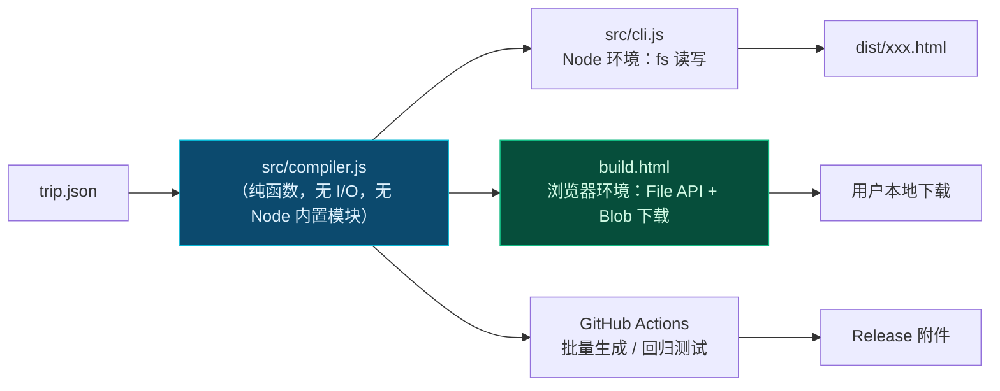
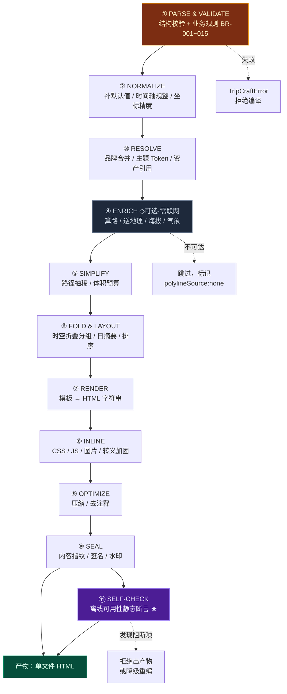

# 第 5 章 · 单文件编译器流水线

> **状态**：`Stable Draft` ｜ **入口**：[`src/compiler.js`](../src/compiler.js)（纯函数） + [`src/cli.js`](../src/cli.js)（Node I/O）
> **铁律依据**：[铁律 1 零构建](00-overview-and-glossary.md#铁律-1--零构建交付-zero-build-delivery)、[铁律 2 单文件优先](00-overview-and-glossary.md#铁律-2--单文件优先渐进增强-single-file-first-progressive-enhancement)、[铁律 3 降级不可耻](00-overview-and-glossary.md#铁律-3--降级不可耻白屏才是罪-degrade-never-blank)
> **本章目标**：把 `trip.json` 变成一份**能扔到任何静态托管上、断网也能用**的 HTML。

---

## 5.1 第一决策：编译器跑在哪里？

这个决策决定了整个工程形态，必须先定。

| 方案 | 用户门槛 | 离线可用 | 成本 | 裁决 |
| :--- | :--- | :--- | :--- | :--- |
| **A. Node CLI** (`node src/compiler.js`) | ❌ 需装 Node ≥18，还要 `npm install` | ✅ | 0 | 作为**辅助通道**保留 |
| **B. 浏览器内编译**（打开 `tripcraft.dev/build`，粘贴 DSL → 本地编译 → 下载） | ✅ **零安装** | ✅ 编译全程本地 | 0 | **主通道** |
| **C. 服务端编译**（Cloudflare Worker） | ✅ | ❌ 依赖服务端 | 需后端 | 拒绝（违铁律 5） |

### 5.1.1 裁决：B 为主，A 为辅，同一份代码



**关键约束**：`src/compiler.js` 必须是**纯粹的计算** —— 不 `require('fs')`、不 `require('path')`、不访问 `window`。所有 I/O 与平台能力通过**依赖注入**传入：

```js
// src/compiler.js —— 签名即契约
/**
 * @param {object} trip     已解析的 DSL 对象
 * @param {object} options
 * @param {object} [options.brand]     已解析的品牌包（可选）
 * @param {Function} [options.fetchJson]  异步取数能力，Node 与浏览器各自注入；缺省则跳过 Enrich
 * @param {Function} [options.onProgress] 进度回调 (stage, pct, msg)
 * @returns {Promise<{ html: string, manifest: CompileManifest }>}
 */
export async function compile(trip, options = {}) { /* ... */ }
```

这样同一份 `compiler.js` 在 Node、浏览器、CI 里完全等价 —— **这是"零构建"能够成立的技术前提**。

---

## 5.2 流水线总览（11 阶段）



> ★ **第 ⑪ 阶段 SELF-CHECK 是本设计相对普通静态生成器的核心差异。** 普通生成器"产出即结束"；TripCraft 必须在产出前**证明这份产物在断网时不会白屏**。见 [§5.7](#57-自检阶段-离线可用性静态断言)。

---

## 5.3 阶段详解

### ① PARSE & VALIDATE

```js
// 结构化校验 + 语义校验，两级缺一不可
function validate(trip) {
  const errors = [];

  // ── 第一级：结构（JSON Schema）───────────────────────────
  // 使用 ajv/standalone 预编译出的独立校验函数，
  // 产物不依赖 ajv 运行时，可被浏览器编译器直接内联。
  const structural = validateTripSchema(trip);   // 由 npm run build:validator 生成
  if (!structural) {
    for (const e of validateTripSchema.errors) {
      errors.push({ code: 'SCHEMA', path: e.instancePath, msg: e.message });
    }
    return { ok: false, errors };   // 结构不过，语义检查无意义，直接短路
  }

  // ── 第二级：业务规则 BR-001 ~ BR-015（见第 4 章 §4.16）──
  errors.push(...checkBR001_dayIndexContiguous(trip));
  errors.push(...checkBR002_nodeIdUnique(trip));
  errors.push(...checkBR003_timeMonotonic(trip));
  errors.push(...checkBR005_altitudeMedical(trip));   // ★ 人命相关
  errors.push(...checkBR006_vehicleClearance(trip));  // ★ 人命相关
  errors.push(...checkBR007_driverFatigue(trip));     // ★ 人命相关
  errors.push(...checkBR010_agencyLicense(trip));
  errors.push(...checkBR011_cpsAuthorized(trip));
  errors.push(...checkBR014_fuseHasDefault(trip));
  errors.push(...checkBR015_bannedWording(trip));     // ★ 责任边界线

  return { ok: !errors.some(e => e.level === 'error'), errors };
}
```

**短路原则**：结构校验失败时**立即返回**，不跑语义检查。理由：语义检查器假设结构合法，在畸形输入上会产生大量级联噪音，淹没真正的错误。

**BR-005 的具体实现**（这是全书最重要的一段校验代码）：

```js
function checkBR005_altitudeMedical(trip) {
  const out = [];
  const limits = new Map();          // groupKey -> {maxAlt, override}

  for (const g of trip.party.groups) {
    const maxAlt = g.hardNeeds?.maxAltitudeM;
    if (maxAlt == null) continue;
    limits.set(g.key, { maxAlt, count: g.count });
  }
  if (!limits.size) return out;

  // 全局约束可覆盖 hardNeeds（同等强度）
  for (const hc of trip.constraints?.hard ?? []) {
    if (hc.type !== 'maxAltitudeM') continue;
    const gk = hc.scope?.replace(/^group:/, '');
    if (gk && limits.has(gk)) limits.get(gk).maxAlt = Math.min(limits.get(gk).maxAlt, hc.value);
  }

  for (const day of trip.days) {
    for (const node of day.nodes) {
      const alt = node.altitudeM ?? node.place?.elevationM;
      if (alt == null) continue;

      for (const [gk, { maxAlt, count }] of limits) {
        if (alt <= maxAlt) continue;

        // 超标 → 必须存在合法的分流或医学解除，否则 Error
        const hasSplit = (day.fuses ?? []).some(f =>
          f.levels?.some(l => l.cascade?.some(c => c.nodeId === node.id && c.action === 'split_queue')));
        const hasClearance = trip.constraints?.hard
          ?.some(h => h.type === 'maxAltitudeM' && h.override === 'medical_clearance' &&
                      trip.privileges?.some(p => p.id === `clearance_${gk}`));

        if (!hasSplit && !hasClearance) {
          out.push({
            level: 'error', code: 'BR-005', path: `${day.tag}/${node.id}`,
            msg: `节点海拔 ${alt}m 超过「${gk}」组医学上限 ${maxAlt}m（${count} 人），` +
                 `且未提供分流方案（split_queue）或医学解除证明。`,
            remedy: '为该节点添加 split_queue 级联，或将成员移出该段行程，或上传医生证明。',
          });
        }
      }
    }
  }
  return out;
}
```

> ⚠️ **这段代码永远不能被配置关闭。** 它拦下的是"把 68 岁高血压老人送上 4000m 垭口"这类事故。产品再漂亮，一次这样的事故就终结了这个项目。

### ② NORMALIZE

```js
function normalize(trip) {
  const t = structuredClone(trip);

  // 时区作息校正：新疆/藏西名义 UTC+8，实际作息偏移
  const off = t.meta.timeBasis?.practicalOffsetMin ?? 0;
  if (off) applyPracticalOffset(t, off);   // 用于「合理作息」校验，不改写用户填的时刻

  // 坐标精度统一到 5 位小数（≈1.1m），第 6 位之后是噪音
  forEachCoord(t, (c) => { c[0] = round(c[0], 5); c[1] = round(c[1], 5); });

  // 补默认值
  t.days.forEach((d, i) => {
    d.dayIndex ??= i;
    d.dayType ??= 'core_sight';
    d.bufferCapacity ??= 0;
    d.nodes.forEach((n, j) => {
      n.seq ??= j + 1;
      n.time.rigidity ??= 'soft';
      n.time.bufferMin ??= 0;
      if (n.tentative == null) n.tentative = false;
    });
  });

  // 时间轴单调性修复（BR-003 已在 ① 报错，此处只做无害规整）
  return t;
}
```

### ③ RESOLVE

```js
async function resolve(trip, { brand, fetchJson }) {
  // 品牌：外链包 → 内联覆盖（内联优先）
  let merged = trip.brand ?? null;
  if (merged?.ref) {
    const pkg = brand ?? await fetchJson?.(`https://brand.tripcraft.dev/${idOf(merged.ref)}.json`);
    if (pkg) merged = shallowMerge(pkg, merged);       // ★ 内联覆盖外链
    else warn('BRAND_UNRESOLVED', `品牌包 ${merged.ref} 不可达，将只使用内联字段`);
  }
  // …

  // 资产：确定 内联 / 外链 的决策在前，渲染在后（避免渲染期再改）
  const assetPlan = planAssets(trip.assets);
  return { trip, brand: merged, assetPlan };
}

function planAssets(assets) {
  const budget = assets?.inlineBudget ?? { maxItemBytes: 32768, maxTotalBytes: 512000 };
  let used = 0;
  const plan = new Map();
  for (const a of assets?.items ?? []) {
    const inline = a.inline === true
      && (a.bytes ?? Infinity) <= budget.maxItemBytes
      && used + (a.bytes ?? 0) <= budget.maxTotalBytes;
    if (inline) used += a.bytes ?? 0;
    plan.set(a.id, { ...a, inline, bytes: a.bytes });
  }
  return plan;
}
```

### ④ ENRICH（可选 · 需联网）

**这一阶段必须可完全跳过。** 这是[铁律 2](00-overview-and-glossary.md#铁律-2--单文件优先渐进增强-single-file-first-progressive-enhancement)在编译器里的落点。

```js
async function enrich(trip, { fetchJson, amapKey }) {
  const result = { enriched: [], skipped: [] };
  if (!fetchJson || !amapKey) {
    warn('ENRICH_SKIPPED', '无取数能力或缺少高德 Key，跳过算路增强。路线将只含端点坐标。');
    return result;
  }

  for (const day of trip.days) {
    for (const node of day.nodes) {
      if (node.type !== 'transit' || !node.route) continue;
      if (node.route.polyline) { result.skipped.push(node.id); continue; }  // 已有，不重算

      try {
        const poly = await amapDriving(node.route.from.coords, node.route.to.coords, {
          waypoints: node.route.waypoints,
          avoidSegments: node.route.avoidSegments,
          key: amapKey,
        });
        node.route.polyline = poly.polyline;
        node.route.distanceM = poly.distanceM;
        node.route.polylineSource = 'amap_driving_v5';
        node.route.polylineFetchedAt = new Date().toISOString();
        result.enriched.push(node.id);
      } catch (e) {
        // ★ 单点失败不得中断整体编译
        node.route.polylineSource ??= 'none';
        warn('ENRICH_FAILED', `${node.id} 算路失败：${e.message}。将退化为端点直线示意。`);
      }
    }
  }
  return result;
}
```

**降级后的视觉处理**（渲染阶段）：当 `polylineSource === 'none'` 时，骨架地图**不画直线**（直线会误导人以为可以走直线），而是画**虚线弧 + 「路线示意 · 未获取到实际路径」角标**。诚实优于好看。

### ⑤ SIMPLIFY

```js
// Douglas-Peucker：在保证视觉误差 < tolerance 的前提下丢点
function simplifyPolyline(points, toleranceM = 30) {
  if (points.length <= 2) return points;
  const tolDeg = toleranceM / 111320;              // 粗略换算，精度足够
  return rdp(points, 0, points.length - 1, tolDeg);
}
```

**实测数据（甘青线 9 天）**：

| 项 | 原始 | 抽稀后 | 说明 |
| :--- | ---: | ---: | :--- |
| 全部 polyline 点数 | ~14,200 | ~1,850 | tolerance = 30m |
| 坐标字符串体积 | ~198 KB | ~26 KB | 5 位小数 + `lng,lat;` |
| 海拔采样点 | — | ~1,850 | 与抽稀后 1:1 对齐 |
| 合计 | — | **~38 KB** | 未压缩；gzip 后 ~11 KB |

> 📌 **`tolerance = 30m` 是经过权衡的默认值。** 更小（如 10m）体积翻倍但肉眼无差；更大（如 100m）会让山区盘山公路的弯道视觉失真。可在 `meta` 中按线路类型覆盖。

### ⑥ FOLD & LAYOUT

```js
function foldAndLayout(trip) {
  for (const day of trip.days) {
    // 自动折叠：未显式声明 folding 时，把连续 transit 段自动聚成候选
    if (!day.folding?.length) {
      day.folding = autoDetectFolds(day.nodes, {
        minDurationMin: 90,        // 只有 ≥90min 的连续段值得折叠
        maxFoldsPerDay: 2,         // 折叠块过多反而增加认知负担
      });
    }
    // 计算日摘要（供折叠块 summary 与顶部统计条使用）
    day._computed = computeDaySummary(day);
  }
  trip._summary = computeTripSummary(trip);
  return trip;
}
```

### ⑦ RENDER

**不用任何模板引擎。** 用带标签的模板字面量 + 显式转义函数。理由：引入模板引擎就引入了依赖，违铁律 1；而一个 40 行的 `html`` ` 标签函数足够表达一切。

```js
// ★ 安全根基：所有 DSL 派生文本必须经过这里
const ESC = { '&': '&amp;', '<': '&lt;', '>': '&gt;', '"': '&quot;', "'": '&#39;' };
const esc = (s) => String(s ?? '').replace(/[&<>"']/g, (c) => ESC[c]);

function html(strings, ...values) {
  let out = strings[0];
  for (let i = 0; i < values.length; i++) {
    const v = values[i];
    out += (v && v.__raw === true) ? v.value        // 显式标记才放行原始 HTML
         : Array.isArray(v) ? v.map(x => esc(x)).join('')
         : esc(v);
    out += strings[i + 1];
  }
  return out;
}
```

> ⚠️ **这是全项目最容易出安全事故的地方。** 路书是**会被分享**的 —— 一份 `trip.json` 里的 POI 名字写成 ``，如果没有转义，所有打开这份路书的人都会中招。`trip.json` 来自 AI 生成、用户上传、地接社导入——**全部是不可信输入**。
>
> **规则**：模板里出现的任何 `${{ }}` 插值，默认走 `esc()`；需要渲染富文本（如 `advice.summary` 里的 Markdown）时，必须走**白名单化**的 Markdown 渲染器（只允许 `strong/em/a/code/br/ul/li`，且 `<a href>` 必须过协议白名单 `https:` / `http:`），绝不 `innerHTML` 直出。

### ⑧ INLINE —— 无痛内联的六个真实陷阱

这是"单文件"最容易出错的地方。以下每一条都对应一个真实会炸的案例。

#### 陷阱 1 · JS 里的 `</script>` 字符串

```js
const js = `const tpl = "</script>";`;   // ❌ 浏览器在这里就截断了
```

**修复**：内联 JS 前统一替换

```js
function safeInlineScript(js) {
  return js
    .replace(/<\/(script)/gi, '<\\/$1')      // </script> → <\/script>
    .replace(/<!--/g, '<\\!--')              // HTML 注释起始
    .replace(/<script/gi, '<\\script');      // 双保险
}
```

#### 陷阱 2 · 内联 JSON 的 U+2028 / U+2029

JSON 允许 U+2028（行分隔符）与 U+2029（段分隔符）出现在字符串里；ES2019 之前的 JS 字符串字面量**不允许**。某些上游数据（尤其是从 Word/网页复制的文本）会携带这两个字符，导致整个 `<script>` 语法错误 → **白屏**。

```js
function safeInlineJson(obj) {
  return JSON.stringify(obj)
    .replace(/
/g, '\\u2028')
    .replace(/
/g, '\\u2029')
    .replace(/</g, '\\u003c')                // 顺带封死 </script> 与 <!-- 组合
    .replace(/>/g, '\\u003e')
    .replace(/&/g, '\\u0026');
}
```

> 📌 最后三个替换是**一次到位的根治方案**：把 `<` `>` `&` 全部转成 `\uXXXX`，JS 语义完全不变，但 HTML 解析器再也看不到任何可能触发标签/注释状态的字符。这比逐个匹配 `</script>` 更可靠。

#### 陷阱 3 · CSS 里的 `</style>`

```js
function safeInlineStyle(css) {
  return css.replace(/<\/(style)/gi, '<\\/$1').replace(/<!--/g, '');
}
```

#### 陷阱 4 · 内联图片把产物撑爆

**规则**（[§4.12](04-dsl-specification-v1.md#412-assets--资产清单)已定义，此处是实现）：

```js
function inlineAsset(asset, bytes) {
  const mime = mimeOf(asset.path);
  const b64 = toBase64(bytes);
  // ⚠️ base64 会使体积膨胀 ~33%，预算必须按膨胀后算
  if (b64.length * 0.75 > (asset.bytes ?? 0) * 1.35) {
    warn('INLINE_BLOAT', `${asset.id} 内联后体积异常，建议改为外链`);
  }
  return `data:${mime};base64,${b64}`;
}
```

> ⚠️ **`asset.bytes` 是声明值，不是实测值。** 编译器必须**实际读取文件后以真实字节数决策**，声明值只用于预排。一份"声明 20KB、实际 2MB"的图会让产物从 400KB 暴涨到 3MB。

#### 陷阱 5 · 高德 SDK 不能内联

高德 JS API 2.0 的 SDK 有 **Key 校验与域名白名单**，内联到 `file://` 或任意域名下都不会工作。它**必须外链**，因此**必须配降级**：

```html
<script>
  window.__AMAP_STATE__ = 'loading';
  window._AMapSecurityConfig = { securityJsCode: "{{SECURITY_JS_CODE}}" };
  // 8 秒兜底：SDK 卡住时也要让页面继续走
  window.__AMAP_TIMEOUT__ = setTimeout(function () {
    if (window.__AMAP_STATE__ === 'loading') {
      window.__AMAP_STATE__ = 'timeout';
      window.dispatchEvent(new CustomEvent('amap:degraded', { detail: { reason: 'timeout' } }));
    }
  }, 8000);
</script>
<script src="https://webapi.amap.com/maps?v=2.0&key={{KEY}}&plugin=AMap.Driving,AMap.Geocoder"
        onerror="window.__AMAP_STATE__='error';window.dispatchEvent(new CustomEvent('amap:degraded',{detail:{reason:'network'}}))"></script>
```

#### 陷阱 6 · **高德 Key 的域名白名单是部署前置条件（B2B 场景的真实瓶颈）**

高德开放平台的 Web 端 Key 需要配置**域名白名单**。母本线上页面的提示原文即为：

> 「高德地图正在离线/降级模式运行中（请在正式部署后于高德开放平台配置您的正式域名白名单）」

这在 C 端只是配置疏漏，在 **B2B 白标场景会变成运营瓶颈**：

| 部署形态 | 白名单影响 | 建议 |
| :--- | :--- | :--- |
| `tripcraft.page/{slug}` 统一域名 | **一次配置，全客户生效** | ✅ 推荐默认路径 |
| 地接社自有域名 `trip.jinma.com` | 每个客户域名都要单独加白 | ⚠️ 需后台批量管理 + 高德商务确认白名单条目上限 |
| 客户内网 / `file://` 离线分发 | **永不可用** | 直接走骨架地图，不加载 SDK |

> 📌 **架构建议**：B2B 白标默认走 **TripCraft 统一域名 + 品牌参数**（`?brand=zhangye-jinma`），Vanity Domain 作为 VIP 增值项并配套白名单管理后台。这个决策直接决定了 B2B 业务的运维成本结构。
>
> 已登记为 [OI-007](00-overview-and-glossary.md#07-未决事项登记册-open-issues-register)。

### ⑨ OPTIMIZE

```js
const OPTIMIZE = {
  stripHtmlComments: true,      // 只删生成器注释，保留 <!--[if IE]> 之类的条件注释（如存在）
  collapseWhitespace: false,    // ★ 默认关闭：会破坏 <pre> 与内联元素的空格语义
  minifyJs: false,              // ★ 默认关闭：违背「免构建」精神，且会破坏行号可读性
  minifyCss: true,              // 仅做安全的空白压缩
};
```

> 📌 **默认不做 JS 压缩，这是刻意的。** 压缩会让产物不可读、不可调试，而 TripCraft 的核心用户之一是**想要学习这套实现的地接社技术合作方**。可读的产物本身就是最好的文档与最强的信任。产物不做压缩带来的 ~45KB 增量，在 4G 下约 0.1 秒。

### ⑩ SEAL

```js
async function seal(html, trip) {
  const hash = `sha256:${await sha256Hex(html)}`;

  // 把指纹写回 <head>（注意：写入后又改变了内容，因此指纹是对"写入前的正文"计算）
  const sealed = html.replace('</head>',
    `<meta name="tripcraft:hash" content="${hash}">` +
    `<meta name="tripcraft:dsl" content="${esc(trip.dslVersion)}">` +
    `<meta name="tripcraft:trip-id" content="${esc(trip.id)}">` +
    `</head>`);

  // 可选签名：白标防伪
  let sig = null;
  if (trip.provenance?.signature || options.signingKey) {
    sig = await signEd25519(hash, options.signingKey);
  }
  return { html: sealed, hash, sig };
}
```

**验证端**（白标场景）：

```js
// 地接社官网校验一份路书是否为「本社官方发布」
async function verifyRoadbook(htmlUrl) {
  const html = await (await fetch(htmlUrl)).text();
  const declared = html.match(/name="tripcraft:hash" content="([^"]+)"/)?.[1];
  const body = html.replace(/<meta name="tripcraft:hash"[^>]*>/, '');   // 复现计算时的正文
  const actual = `sha256:${await sha256Hex(body)}`;
  return declared === actual ? 'intact' : 'tampered';
}
```

### ⑪ SELF-CHECK（见下节）

---

## 5.7 自检阶段：离线可用性静态断言

**这是本章最有价值的部分**，也是 TripCraft 与"随便一个生成器"的分界线。

### 5.7.1 问题

"断网能用"不能靠开发者自觉，必须**由编译器证明**。做法：编译完成后，静态扫描产物 HTML，找出所有**外部依赖点**，逐一判定其失效时的影响等级。

### 5.7.2 依赖分级

| 等级 | 含义 | 断网后果 | 处理 |
| :--- | :--- | :--- | :--- |
| `C0` 无依赖 | 内联的 HTML/CSS/JS/数据 | 无影响 | — |
| `C1` 增强型 | 加载失败只是少了个锦上添花的功能 | 体验降级，内容完整 | 允许，必须挂 `onerror` |
| `C2` 关键型 | 加载失败会导致核心内容不可读 | **部分白屏** | **拒绝出产物** |
| `C3` 阻断型 | 加载失败导致整页不可用 | **完全白屏** | **拒绝出产物** |

### 5.7.3 扫描器实现

```js
const EXTERNAL_PATTERNS = [
  { re: /<script[^>]+src=["'](https?:)?\/\//gi,        kind: 'script',   defaultLevel: 'C2' },
  { re: /<link[^>]+rel=["']stylesheet["'][^>]*href=["'](https?:)?\/\//gi, kind: 'style', defaultLevel: 'C2' },
  { re: /<link[^>]+rel=["'](icon|preload|preconnect|dns-prefetch)["']/gi, kind: 'hint',  defaultLevel: 'C1' },
  { re: /]+src=["'](https?:)?\/\//gi,           kind: 'image',    defaultLevel: 'C1' },
  { re: /\bfetch\s*\(\s*["'`](https?:)?\/\//gi,        kind: 'fetch',    defaultLevel: 'C1' },
  { re: /@import\s+(url\()?["'](https?:)?\/\//gi,      kind: 'cssimport',defaultLevel: 'C2' },
  { re: /url\(\s*["']?(https?:)?\/\//gi,               kind: 'cssurl',   defaultLevel: 'C1' },
  { re: /<audio[^>]+src=["'](https?:)?\/\//gi,         kind: 'audio',    defaultLevel: 'C1' },
  { re: /<iframe[^>]+src=["'](https?:)?\/\//gi,        kind: 'iframe',   defaultLevel: 'C1' },
];

// 允许显式降级：声明了 data-degrade 的元素自动降一级
const DEGRADE_MARKER = /data-degrade=["'](ok|optional)["']/i;

function selfCheck(html, manifest) {
  const findings = [];

  for (const { re, kind, defaultLevel } of EXTERNAL_PATTERNS) {
    let m;
    while ((m = re.exec(html))) {
      const snippet = html.slice(Math.max(0, m.index - 120), m.index + 240);
      const declared = DEGRADE_MARKER.test(snippet);
      const level = declared ? downgrade(defaultLevel) : defaultLevel;
      findings.push({ kind, level, url: m[0].slice(0, 120), offset: m.index, declared });
    }
  }

  // 关键断言：正文内容是否内联？
  const hasInlineContent =
    /<script[^>]*type=["']application\/json["'][^>]*id=["']tripcraft-data["']/i.test(html) ||
    /window\.__TRIPCRAFT_DATA__\s*=/.test(html);
  if (!hasInlineContent) {
    findings.push({
      kind: 'content', level: 'C3',
      msg: '未检测到内联的行程数据块。断网时页面将无内容可渲染。',
    });
  }

  // 关键断言：地图是否具备骨架降级？
  const usesAmap = /webapi\.amap\.com/.test(html);
  const hasSkeleton = /__SKELETON_MAP__/.test(html) && /data-degrade=["']ok["']/.test(html);
  if (usesAmap && !hasSkeleton) {
    findings.push({
      kind: 'map', level: 'C2',
      msg: '检测到高德 SDK 外链，但未找到骨架地图降级路径。断网/白名单未配置时将出现空白地图区。',
    });
  }

  // 关键断言：不存在裸 innerHTML 直出（XSS 兜底）
  const rawInner = (html.match(/\.innerHTML\s*=/g) || []).length;
  if (rawInner > 0) {
    findings.push({
      kind: 'security', level: 'C2',
      msg: `产物中存在 ${rawInner} 处 innerHTML 直接赋值。任何一处未净化都可能构成 XSS。`,
    });
  }

  const blocking = findings.filter(f => f.level === 'C2' || f.level === 'C3');
  return { ok: blocking.length === 0, findings, blocking };
}
```

### 5.7.4 自检失败的处理

```js
const check = selfCheck(html, manifest);
if (!check.ok) {
  if (opts.strict) {
    throw new TripCraftError('SELF_CHECK_FAILED', {
      blocking: check.blocking,
      msg: '产物未通过离线可用性自检，已拒绝输出（strict 模式）。',
    });
  }
  // 非 strict：出产物，但在页面顶部渲染一条显著的构建警告（仅作者可见）
  html = injectBuildWarning(html, check.blocking);
  warn('SELF_CHECK', `${check.blocking.length} 项阻断级问题，已注入构建警告横幅。`);
}
```

**"构建警告横幅"的设计**：在产物顶部插入一条**醒目但可一键关闭**的橙色横幅，写明"⚠️ 本路书存在 N 项离线可用性问题：…"。这确保问题**不会静默流到用户手里**，同时不阻断作者的迭代。

---

## 5.8 体积预算与自检

编译器在 SEAL 阶段输出一份 `CompileManifest`，并对照预算告警。

```jsonc
{
  "tripId": "trip_20260924_silkroad-gansu-qinghai-9d",
  "compiledAt": "2026-09-20T12:00:00+08:00",
  "compilerVersion": "1.0.0",
  "dslVersion": "1.0.0",
  "sizes": {
    "htmlShell":   14200,
    "cssTheme":    18600,
    "runtimeJs":   46000,
    "dataInline":  38200,
    "assetsInline": 61400,
    "assetsLinked": 822000,
    "total": 178400
  },
  "budget": { "softLimitBytes": 524288, "hardLimitBytes": 2097152 },
  "externalDeps": [
    { "url": "https://webapi.amap.com/maps?v=2.0", "kind": "script", "level": "C2",
      "degrade": "skeleton-map", "declared": true }
  ],
  "warnings": [
    { "code": "BUDGET", "msg": "assetsLinked 822KB，其中 3 张图片 >200KB，建议转 WebP 或降分辨率。" }
  ],
  "selfCheck": { "ok": true, "blocking": 0, "advisory": 2 }
}
```

**预算基线（甘青线 9 天实测口径）**：

| 组件 | 预算 | 说明 |
| :--- | ---: | :--- |
| HTML 骨架 + 模板 | 14 KB | 手写，无框架 |
| 主题 CSS（单主题） | 18 KB | 含液态玻璃、大字模式、手风琴 |
| 运行时 JS | 46 KB | 自研，含降级状态机、地图适配器、记账器 |
| 内联行程数据 | 38 KB | 含抽稀 polyline 与海拔剖面 |
| 内联图片 | ≤ 512 KB | 受 `inlineBudget.maxTotalBytes` 约束 |
| **合计（不含地图 SDK）** | **≤ 640 KB** | gzip 后 ≈ 170 KB |
| 外链地图 SDK | ~180 KB | 不内联，不可内联 |
| **首屏可交互（4G）** | **< 1.5 s** | 数据已内联，无需等待任何请求 |

> 📌 **`hardLimitBytes = 2MB` 的理由**：超过 2MB 的 HTML，移动端 Safari 的解析与首次绘制会明显卡顿，且微信内置浏览器对超大 HTML 的处理更差。触发硬限时，编译器应**强制把图片转为外链**并重编，而非直接失败。

---

## 5.9 CLI 与浏览器双模的胶水层

### 5.9.1 Node 侧（`src/cli.js`）

```js
#!/usr/bin/env node
import { readFile, writeFile, mkdir } from 'node:fs/promises';
import { compile } from './compiler.js';
import { fetchJsonViaNode } from './io.node.js';

const [,, input, output] = process.argv;

const trip = JSON.parse(await readFile(input, 'utf8'));
const { html, manifest } = await compile(trip, {
  fetchJson: fetchJsonViaNode,
  amapKey: process.env.AMAP_KEY,
  onProgress: (stage, pct) => process.stderr.write(`\r[${stage}] ${pct}%`),
});

await mkdir(dirname(output), { recursive: true });
await writeFile(output, html, 'utf8');
console.log(`\n✓ ${output}  ${(html.length / 1024).toFixed(1)} KB`);
```

### 5.9.2 浏览器侧（`build.html`）

```html
<script type="module">
  import { compile } from './src/compiler.js';
  import { makeBrowserFetchJson } from './src/io.browser.js';

  dropZone.addEventListener('drop', async (e) => {
    const file = e.dataTransfer.files[0];
    const trip = JSON.parse(await file.text());
    const { html, manifest } = await compile(trip, {
      fetchJson: makeBrowserFetchJson(),
      onProgress: (s, p) => renderProgress(s, p),
    });
    // 本地下载，全程不上传
    const blob = new Blob([html], { type: 'text/html;charset=utf-8' });
    downloadBlob(blob, `${trip.id}.html`);
  });
</script>
```

> 🔒 **`build.html` 的核心卖点：`trip.json` 从头到尾没有离开过用户的浏览器。** 行程里可能有身份证、房号、航班号。服务端编译意味着这些数据要上传——哪怕承诺不存，用户也无从验证。本地编译是**可验证的隐私承诺**。

---

## 5.10 CI 集成（GitHub Actions）

```yaml
name: build-roadbooks

on:
  push:
    paths: ['examples/**/trip.json', 'src/**', 'templates/**']

jobs:
  build:
    runs-on: ubuntu-latest
    steps:
      - uses: actions/checkout@v4
      - uses: actions/setup-node@v4
        with: { node-version: '20' }

      - run: npm ci
      - run: npm run validate          # 契约校验：Schema 合法 + 实例合规

      - name: 编译全部示例
        env: { AMAP_KEY: ${{ secrets.AMAP_KEY }} }
        run: |
          for f in examples/*/trip.json; do
            d=$(dirname "$f")
            node src/cli.js "$f" "$d/roadbook.html" --strict
          done

      - name: 离线可用性自检
        run: node tools/audit-offline.js examples/*/roadbook.html

      - uses: actions/upload-artifact@v4
        with:
          name: roadbooks
          path: examples/*/roadbook.html
```

> 📌 **`--strict` 在 CI 中必须开启。** 本地开发允许"带警告产出"以便迭代；CI 是最后一道闸门，任何 `C2`/`C3` 级问题都必须让构建变红。这条规则把"断网能用"从口号变成了**不可绕过的构建门禁**。

---

## 5.11 本章交付物清单

| 交付物 | 路径 | 状态 |
| :--- | :--- | :--- |
| 编译器核心（纯函数） | `src/compiler.js` | ⏳ 待实现 |
| Node 胶水层 | `src/cli.js` · `src/io.node.js` | ⏳ 待实现 |
| 浏览器胶水层 | `build.html` · `src/io.browser.js` | ⏳ 待实现 |
| 离线自检器 | `tools/audit-offline.js` | ⏳ 待实现 |
| 契约校验器 | [`tools/validate-schemas.js`](../tools/validate-schemas.js) | ✅ 已交付 |
| 主题 Token | `templates/themes/*.css` | ⏳ 待实现 |
| 主模板 | `templates/index.template.html` | ⏳ 待实现 |

---

> **上一章**：[第 4 章 · DSL 规范](04-dsl-specification-v1.md) ｜ **下一章**：[第 1 章 · 极端场景与容错容灾](01-resilience-and-failover.md) —— 产物能编译出来了，接下来要保证它在戈壁滩上也能活着。
