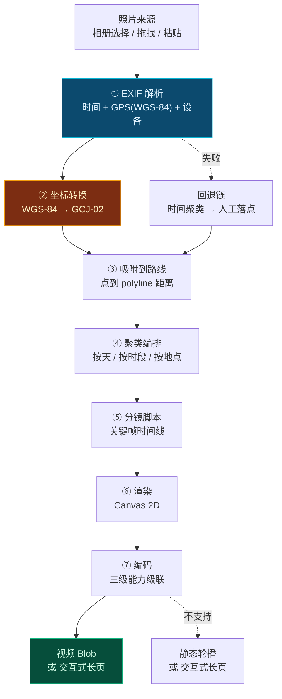
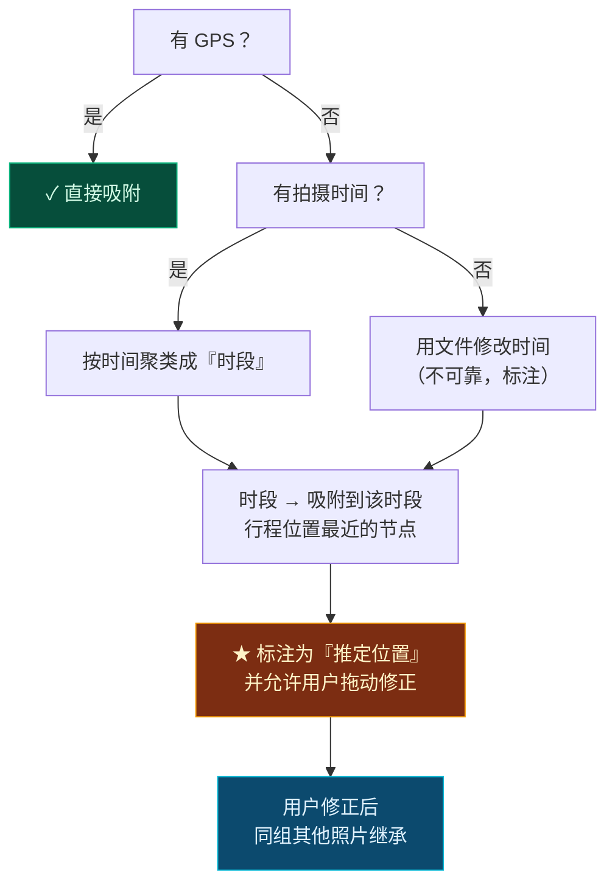
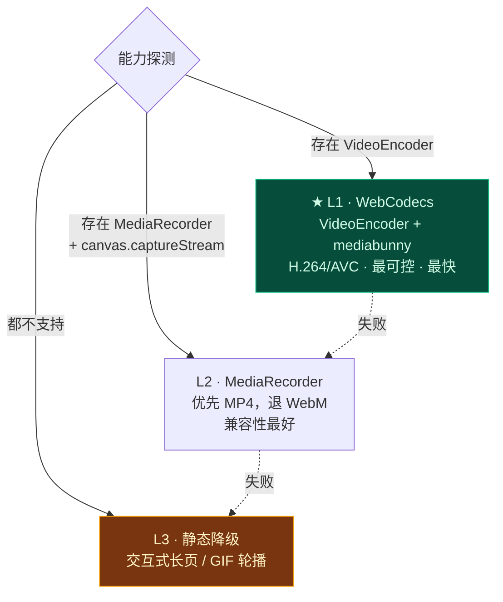
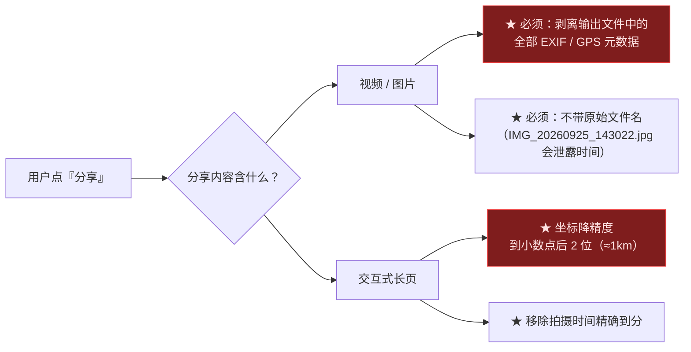

# 第 6 章 · 旅程后记忆日志引擎

> **状态**：`Stable Draft` ｜ **对应维度**：深度维度 ⑤ 行程后记忆日志引擎
> **铁律依据**：[铁律 4 数据主权本地化](00-overview-and-glossary.md#铁律-4--数据主权本地化-local-data-sovereignty)、[铁律 7 事实与建议分离](00-overview-and-glossary.md#铁律-7--事实与建议分离-fact-vs-advice)
> **本章要回答**：一趟旅行结束，两千张照片散在六个人的手机里。怎么在**不把任何一张照片上传到服务器**的前提下，把它变成一段 30 秒、能发朋友圈、能带地点的视频？

---

## 6.1 一个必须先说清楚的承诺

> 🔒 **TripCraft 的记忆日志引擎，全程在用户的浏览器/手机本地运行。我们看不到你的任何一张照片。**

这不是营销话术，而是**架构约束**——本引擎的代码不含任何 `fetch` 到自有域名的上传路径。用户可以打开开发者工具的 Network 面板自己验证：

```
拍照 → File API 读取（不出设备）
     → Exif 解析（纯 JS，本地）
     → 坐标转换（纯函数，本地）
     → Canvas 渲染（本地）
     → 视频编码（本地）
     → Blob 下载 / Web Share（用户主动分享才算离开设备）
```

**为什么必须这样**：旅行照片是**最敏感的个人数据类别之一**——含人脸、含位置、含家庭成员、含孩子的影像。一旦上传，就永久承担了存储、加密、访问控制、删除请求、泄漏赔偿的全部责任。**而这项功能完全不需要服务器就能实现。**

> 📌 **这是一个"技术上做得到，所以法律上不必冒险"的典型案例。** 能不上传的，就不要上传。

---

## 6.2 引擎总览



**全程无网络请求。** 每一个方框都是本地计算。

---

## 6.3 摄取与内存管理

### 6.3.1 三种输入方式

| 方式 | API | 备注 |
| :--- | :--- | :--- |
| 相册选择 | `<input type="file" accept="image/*" multiple>` | 最通用 |
| 拖拽 | `DataTransferItemList` | 桌面端 |
| 粘贴 | `ClipboardEvent.clipboardData` | ★ 微信里"复制图片"后粘贴 |

### 6.3.2 ★ 内存是第一约束

一部手机的浏览器标签页可用内存通常只有 **几百 MB**。2000 张 4MB 的 JPEG 全解码 ≈ **24 GB**，必然崩溃。

```js
/**
 * 分片处理：任何时刻内存中最多持有 CHUNK 张解码后的位图。
 * 处理完立即释放（close() / 置 null + 主动触发 GC 友好写法）。
 */
const CHUNK = 8;

async function* ingest(files) {
  for (let i = 0; i < files.length; i += CHUNK) {
    const batch = files.slice(i, i + CHUNK);
    const decoded = await Promise.all(batch.map(async (f) => {
      // ★ 先读 EXIF（只读文件头几 KB，不解码像素）
      const exif = await readExifHeader(f);
      // ★ 再用 createImageBitmap 解码，且限制最长边 —— 视频只需 1080p
      const bmp = await createImageBitmap(f, { resizeWidth: 1920, resizeQuality: 'high' });
      return { file: f, exif, bitmap: bmp, thumb: await makeThumb(bmp, 320) };
    }));
    yield decoded;
    for (const d of decoded) d.bitmap.close();   // ★ 显式释放
  }
}
```

**三条内存规则**：

| 规则 | 说明 |
| :--- | :--- |
| **M1 · 先读 Exif，后解码** | Exif 只需文件头数 KB；解码整张图要几十 MB。顺序错了会白解码一大批。 |
| **M2 · 解码即缩边** | `createImageBitmap(f, { resizeWidth: 1920 })` 让浏览器在解码时直接降采样，比"解码全图再 canvas 缩小"省 10 倍内存。 |
| **M3 · 分片 + 显式释放** | 一次最多 8 张，用完 `close()`。不要用一个大数组攒住全部。 |

---

## 6.4 EXIF 解析链

### 6.4.1 ★ 设计原则：能力探测，而非格式假设

**不假设任何库支持任何格式。** 用**解析器链**逐个尝试，第一个成功的胜出：

```js
/**
 * 解析器链 —— 每级返回 null 表示"我处理不了"，交给下一级。
 * 这样即使某个格式（如 HEIC）在某级不支持，也不会整体失败。
 */
const EXIF_CHAIN = [
  { name: 'jpeg',     fn: parseJpegExif,  formats: ['image/jpeg'] },  // 自研 JPEG APP1 解析（~120 行）
  { name: 'png',      fn: parsePngExif,   formats: ['image/png'] },   // PNG eXIf / tEXt 块
  { name: 'heic_wasm',fn: parseHeicWasm,  formats: ['image/heic', 'image/heif'],
    lazy: true, cost: '~500KB gzip' },                                // ★ 按需加载
  { name: 'fallback', fn: () => null },                               // 明确失败，进入 §6.5 回退链
];

async function readExifHeader(file) {
  const mime = sniffMime(file);                 // ★ 嗅探字节，不信任扩展名
  for (const p of EXIF_CHAIN) {
    if (p.formats && !p.formats.includes(mime)) continue;
    try {
      if (p.lazy && !(await ensureLazyModule(p.name))) continue;   // 用户未同意加载则跳过
      const r = await p.fn(file);
      if (r) return { ...r, parser: p.name };
    } catch (e) {
      // ★ 单级失败不上报，静默交给下一级；只有全链失败才提示用户
      continue;
    }
  }
  return null;   // 全链失败 → 走时间聚类回退
}
```

> 📌 **为什么自己写 JPEG Exif 解析（约 120 行）而不用库？**
>
> 因为本项目[铁律 1](00-overview-and-glossary.md#铁律-1--零构建交付-zero-build-delivery)要求产物**零运行时依赖**。引入一个 Exif 库意味着产物里多 30–60 KB，且多一个供应链风险点。而我们要提取的字段只有 7 个（见 6.4.3），自研解析器足够且完全可控。

### 6.4.1.1 ★ HEIC 的真实支持面（2026-10-07 核查）

**这是本章最需要修正的一处。初稿假设"现代浏览器有原生 HEIC 能力"，核查后不成立。**

#### `createImageBitmap` 解码 HEIC

| 浏览器 | 支持 | 说明 |
| :--- | :--- | :--- |
| **Safari 17+** | ✅ | 经系统解码器（WebKit 官方博文确认） |
| **Chrome / Edge** | ❌ **全平台不支持** | `ImageDecoder.isTypeSupported('image/heic')` 返回 false；Windows 装了 HEIF 扩展**也无效** |
| **Firefox** | ❌ | 相关 bug **九年未动** |

> ⚠️ **初稿写的"视系统 codec 而定"对 Chrome 不成立。** Chrome 不是"看系统有没有装解码器"，而是**根本没有这条路径**。

#### 关于 `exifr` 库（一个必须知道的缺陷）

核查发现该库存在一个**静默失败**的严重问题：

| 项 | 情况 |
| :--- | :--- |
| 宣称支持 | README 格式列表含 `.heic`；`exifr.gps()` 返回 `{latitude, longitude}` |
| 体积 | 全量约 26 KB gzip（mini 版 8 KB） |
| ★ **缺陷** | 源码 `heif.mjs` 中有 `if (ftypLength > 50) return false`。**iOS 18+ 自适应 HDR 的 HEIC，其 `ftyp` box 为 52 字节** → 解析整体失败 |
| ★ **失败模式** | **返回空值且不报错**（表现为 "Unknown format"） |
| 修复状态 | 相关 issue **至今 open 未修**；npm 最新版发布于 **2021-08-05**（约五年未发版） |

> 🔴 **这个失败模式是最危险的一类：静默失败。** 用户选了 200 张 iPhone 照片，程序"处理成功"了，但**一张都没有位置信息**，而且没有任何错误提示。用户会以为是自己的手机没开定位。
>
> **这直接违反[铁律 8 拒绝静默失败](00-overview-and-glossary.md#铁律-8--拒绝静默失败-never-fail-silently)。**

#### 裁决

| 路径 | 判定 |
| :--- | :--- |
| 依赖浏览器原生解码 HEIC | ❌ Safari-only，覆盖面不足 |
| 依赖 `exifr` 解析 HEIC | ❌ **静默失败风险，且五年未维护** |
| **`libheif` WASM 按需加载** | ✅ **采用**（~500 KB gzip） |
| 引导用户转为 JPEG | ✅ **并行提供**（对不愿意等 500KB 的用户） |

```js
/**
 * ★ 关键：HEIC 路径必须是"显式同意 + 显式加载"，
 * 而不是悄悄加载 500KB 再悄悄失败。
 */
async function ensureLazyModule(name) {
  if (name !== 'heic_wasm') return true;
  if (lazyCache.has(name)) return true;

  const ok = await UI.ask({
    title: '检测到 HEIC 格式照片',
    body: 'HEIC 是 iPhone 的默认照片格式，解析它需要额外加载约 500KB 的组件。\n\n' +
          '· 加载后：可自动读取位置与时间，照片落点更准\n' +
          '· 不加载：这些照片将按时间聚类，位置需要您手动指定\n\n' +
          '（该组件从本机加载，不会上传任何照片）',
    actions: ['加载组件', '跳过，手动指定'],
  });

  if (!ok) return false;
  await import('./vendor/libheif-wasm.js');
  lazyCache.set(name, true);
  return true;
}
```

> 📌 **注意这里的产品判断**：我们没有默默加载 500KB（那会拖慢所有用户），也没有直接说"不支持 HEIC"（那会让 iPhone 用户觉得产品残缺）。**而是把一个技术权衡如实讲给用户，让他自己选。**
>
> 这段文案里最重要的一句是 **「（该组件从本机加载，不会上传任何照片）」** —— 用户在这个环节最担心的正是照片会不会被传走。

**已登记**：[OI-005](00-overview-and-glossary.md#07-未决事项登记册-open-issues-register) 从"微信是否剥离 Exif"扩展为"HEIC 解析路径选型"，需真机验证（见 [TV-01](#614-待验证项todop0)）。

### 6.4.2 ★ 微信「原图」与 Exif 的现实（2026-10-07 核查版）

> ⚠️ **本节初稿写反了，必须记录更正。** 初稿把「发送原图」标为「⚠️ 部分保留 / 不可依赖」。核查官方表述后，**事实是：「原图」路径下 Exif 是被保留的**。这个更正很重要——它把一条原本被我们判为"不可用"的路径，变成了**可以主动引导用户使用的路径**。

#### 核查到的官方表述

| 来源 | 表述 |
| :--- | :--- |
| 腾讯官方回应（关于"发原图泄露位置"的媒体求证） | 「无论你用**微信、短信、邮件或是其他传输工具发送原图**，都会将附带信息一并发送。」 |
| 微信官方说明（关于非原图发送） | 非原图发送会**压缩转码**，元数据随压缩过程被清空（2017 年起即为此行为） |

> 📌 **这两句话合起来，给出的是一个非常干净的二分**：**原图 = 保留；非原图 = 剥离。** 中间没有"部分"这个状态。

#### 修正后的对照表

| 传递路径 | Exif 是否保留 | 说明 |
| :--- | :--- | :--- |
| **微信「发送原图」+ 对方「查看原图」后保存** | ✅ **保留** | ★ **可依赖**。这是微信路径下唯一正确的用法 |
| 微信普通发送（非原图） | ❌ **剥离** | 压缩转码，元数据清空 |
| 微信「收藏」再导出 | ❌ 剥离 | |
| AirDrop / 数据线 | ✅ 保留 | iOS↔iOS、从相册导出 |
| **直接从手机相册选择** | ✅ 保留 | ★ 推荐路径（无中间环节，风险为零） |
| 小红书 / 抖音下载 | ❌ 剥离 | 且带平台水印 |

#### ★ 这条结论改变了产品设计

初稿的结论是「不能假设 Exif 存在」。**修正后的结论更精确，也更有用**：

| | 初稿判断 | 核查后判断 |
| :--- | :--- | :--- |
| 无 Exif 的比例 | 预计 30–70% | **仍取决于用户怎么传**，但**这个比例是可以被产品主动降低的** |
| 应对方式 | 被动回退（时间聚类） | **主动引导** + 被动回退 |

**所以我们在 §6.3 的导入界面加一条就地提示**（而不是等失败后再提示）：

```js
/**
 * ★ 导入前提示，而不是失败后道歉。
 * 位置：照片选择区上方，常驻但不刺眼。
 */
const IMPORT_HINT = {
  zh: '从群聊里存下来的照片，位置信息大多已被压缩掉。' +
      '如果能请对方用「原图」重发一次，照片就能自动落到地图上。',
  // ★ 关键：承认这是社交问题，不是技术问题
  tone: 'advice',
  dismissible: true,
};
```

> 📌 **这段话的价值不在于技术，而在于它把责任说清楚了。** 用户遇到"照片没落点"时，第一反应往往是"这软件不行"。这条提示提前告诉他：**是照片在传给你的路上丢了信息，不是我们读不出来。** 而且给出了一个他实际能做的动作——**回去让同行的人重发一次原图**。

#### 但"无 Exif"仍是必须处理的主路径

即使引导到位，以下情况仍必然产生无 Exif 的照片：

- 照片来自**上一代手机**（部分安卓机型默认不写入 GPS）
- 用户在相机设置里**关掉了位置记录**
- 照片来自**相机**（除非开了 GPS，且时间可能与手机不同步）
- 照片经过**微信群压缩**且**已无法找回原始发送者**

**因此 §6.5 的回退链仍然不是"异常处理"，而是主路径之一。** 设计上的判断不变：**把"无 Exif"当作常见情况处理**，只是我们不再假设它占比 30–70%，而是**承认它占比取决于用户行为，并且我们有一部分能力去影响这个行为**。

### 6.4.3 需要提取的七个字段

```js
const WANTED = {
  DateTimeOriginal: '拍摄时间',     // ★ 最重要 —— 无 GPS 时全靠它
  GPSLatitude:      '纬度(WGS-84)',
  GPSLongitude:     '经度(WGS-84)',
  GPSAltitude:      '海拔',
  Orientation:      '方向',         // ★ 不处理会让竖拍照片躺倒
  Make:             '厂商',
  Model:            '机型',
};
```

### 6.4.4 ★ 坐标转换：WGS-84 → GCJ-02

**这是最容易被忽略、错了却一眼可见的一步。**

- **相机写入的 GPS 是 WGS-84**（国际标准，GPS 卫星原始坐标系）
- **高德地图、腾讯地图使用 GCJ-02**（国测局加密坐标系）
- 两者在中国境内**相差 300–600 米**

如果直接把 Exif 坐标打到高德地图上，照片会落在**隔壁街区**。用户一眼就能看出不对。

```js
// ── WGS-84 → GCJ-02（国测局坐标）──────────────────────────────
// 克拉索夫斯基椭球参数
const GCJ_A  = 6378245.0;
const GCJ_EE = 0.00669342162296594323;

function outOfChina(lng, lat) {
  return !(lng > 73.66 && lng < 135.05 && lat > 3.86 && lat < 53.55);
}

function transformLat(x, y) {
  let ret = -100 + 2*x + 3*y + 0.2*y*y + 0.1*x*y + 0.2*Math.sqrt(Math.abs(x));
  ret += (20*Math.sin(6*x*Math.PI) + 20*Math.sin(2*x*Math.PI)) * 2/3;
  ret += (20*Math.sin(y*Math.PI) + 40*Math.sin(y/3*Math.PI)) * 2/3;
  ret += (160*Math.sin(y/12*Math.PI) + 320*Math.sin(y*Math.PI/30)) * 2/3;
  return ret;
}

function transformLng(x, y) {
  let ret = 300 + x + 2*y + 0.1*x*x + 0.1*x*y + 0.1*Math.sqrt(Math.abs(x));
  ret += (20*Math.sin(6*x*Math.PI) + 20*Math.sin(2*x*Math.PI)) * 2/3;
  ret += (20*Math.sin(x*Math.PI) + 40*Math.sin(x/3*Math.PI)) * 2/3;
  ret += (150*Math.sin(x/12*Math.PI) + 300*Math.sin(x/30*Math.PI)) * 2/3;
  return ret;
}

/**
 * @returns {[number, number]} GCJ-02 的 [lng, lat]
 */
export function wgs84ToGcj02(lng, lat) {
  if (outOfChina(lng, lat)) return [lng, lat];   // ★ 境外不转换

  let dLat = transformLat(lng - 105.0, lat - 35.0);
  let dLng = transformLng(lng - 105.0, lat - 35.0);

  const radLat = lat / 180.0 * Math.PI;
  let magic = Math.sin(radLat);
  magic = 1 - GCJ_EE * magic * magic;
  const sqrtMagic = Math.sqrt(magic);

  dLat = (dLat * 180.0) / ((GCJ_A * (1 - GCJ_EE)) / (magic * sqrtMagic) * Math.PI);
  dLng = (dLng * 180.0) / (GCJ_A / sqrtMagic * Math.cos(radLat) * Math.PI);

  return [lng + dLng, lat + dLat];
}
```

> ⚠️ **`outOfChina` 检查不可省略。** 在境外（如用户去了日本），GCJ-02 偏移不适用，强行转换会把坐标推到错误的位置。这个函数本身就是"是否在中国境内"的判定。

**实测偏移量**（用于自检）：

| 地点 | WGS-84 | 转换后 GCJ-02 | 偏移 |
| :--- | :--- | :--- | ---: |
| 兰州中山桥 | 103.8134, 36.0617 | 103.8178, 36.0668 | ~610 m |
| 敦煌莫高窟 | 94.8093, 40.0342 | 94.8136, 40.0395 | ~590 m |
| 张掖丹霞 | 100.1183, 38.9654 | 100.1226, 38.9708 | ~600 m |

> 📌 **600 米是什么概念**：相当于照片上的点位落在隔壁两条街之外。**这个 bug 一定会被用户发现，而且会被认为是"这个产品不靠谱"。**

---

## 6.5 ★ 回退链：当 Exif 不存在时

**这条链不是异常处理，是主路径。**（原因见 §6.4.2）



### 6.5.1 时间聚类

```js
/**
 * 把无 GPS 的照片按时间间隙切成「时段」。
 * 间隙阈值 45 分钟 —— 短于此间隔视为"同一处活动"。
 */
function clusterByTime(photos, gapMin = 45) {
  const sorted = photos.filter(p => p.takenAt).sort((a, b) => a.takenAt - b.takenAt);
  const clusters = [];
  let cur = null;

  for (const p of sorted) {
    if (!cur || (p.takenAt - cur.end) > gapMin * 60000) {
      cur = { start: p.takenAt, end: p.takenAt, photos: [p] };
      clusters.push(cur);
    } else {
      cur.end = p.takenAt;
      cur.photos.push(p);
    }
  }
  return clusters;
}
```

### 6.5.2 时段 → 节点的推定

```js
/**
 * 把时段的中点时刻映射到行程中的位置。
 * 依据：路书里每个节点都有 planned 时刻，插值即可得到"此刻大概在哪"。
 */
function inferLocation(cluster, trip) {
  const midT = (cluster.start + cluster.end) / 2;
  const day = findDayByDate(trip, new Date(midT));
  if (!day) return null;

  const timeline = day.nodes
    .filter(n => n.time?.planned)
    .map(n => ({ node: n, at: toTimestamp(day.date, n.time.planned) }))
    .sort((a, b) => a.at - b.at);

  // 找到中点时刻落在哪两个节点之间
  for (let i = 0; i < timeline.length - 1; i++) {
    if (midT >= timeline[i].at && midT < timeline[i + 1].at) {
      const ratio = (midT - timeline[i].at) / (timeline[i + 1].at - timeline[i].at);
      return {
        // ★ 在两节点之间做线性插值 —— 比"吸附到最近节点"更接近真实位置
        guess: interpolateCoords(timeline[i].node, timeline[i + 1].node, ratio),
        between: [timeline[i].node.id, timeline[i + 1].node.id],
        confidence: 'inferred',
      };
    }
  }
  return null;
}
```

> ⚠️ **`confidence: 'inferred'` 必须在 UI 上可见**（[§3.5.3](03-b2b-agency-operations.md#353-置信度四级语义) 的同一套语义）。推定位置的照片在时间轴上用**虚线边框 + 「推定位置」角标**区分于实测位置。**把猜测显示得和事实一样，就是在制造虚假信息**（[铁律 7](00-overview-and-glossary.md#铁律-7--事实与建议分离-fact-vs-advice)）。

### 6.5.3 用户修正的传播

一个关键的人机交互设计：**用户修正一次，应惠及整组照片。**

```js
// 用户把某个时段拖到了「莫高窟」→ 该时段全部 47 张照片一起移动
// 且记录为用户手工确认，confidence 提升为 'user_confirmed'
function applyUserCorrection(cluster, newNodeId, trip) {
  const node = findNode(trip, newNodeId);
  for (const p of cluster.photos) {
    p.coords = node.place.coords;
    p.anchorNodeId = newNodeId;
    p.locationSource = 'user_confirmed';   // ★ 人工确认高于算法推定
    p.derived = false;
  }
}
```

---

## 6.6 吸附到路线

### 6.6.1 点到折线的距离

```js
/**
 * 点到 polyline 的最短距离（米）。
 * 用局部等距投影（以照片点为原点的平面近似）简化计算 —— 在 <50km 范围内
 * 误差可忽略，比完整球面大圆距离快得多。
 */
function distanceToPolyline(pt, polyline) {
  if (!polyline?.length) return Infinity;
  if (polyline.length === 1) return haversine(pt, polyline[0]);

  const kLat = 111320;
  const kLng = 111320 * Math.cos(pt[1] * Math.PI / 180);
  const toXY = ([lng, lat]) => [(lng - pt[0]) * kLng, (lat - pt[1]) * kLat];

  const p = [0, 0];
  let best = Infinity;

  for (let i = 0; i < polyline.length - 1; i++) {
    const a = toXY(polyline[i]);
    const b = toXY(polyline[i + 1]);
    best = Math.min(best, distPointSegment(p, a, b));
  }
  return best;
}

function distPointSegment(p, a, b) {
  const dx = b[0] - a[0], dy = b[1] - a[1];
  const len2 = dx*dx + dy*dy;
  if (len2 === 0) return Math.hypot(p[0]-a[0], p[1]-a[1]);
  let t = ((p[0]-a[0])*dx + (p[1]-a[1])*dy) / len2;
  t = Math.max(0, Math.min(1, t));
  return Math.hypot(p[0] - (a[0] + t*dx), p[1] - (a[1] + t*dy));
}
```

### 6.6.2 三档判定

| 距离 | 判定 | 展示 |
| :--- | :--- | :--- |
| **≤ 500 m** | ✅ **在路线上** | 正常吸附到路线，显示为途经点 |
| **500 m – 5 km** | 🟡 **路线附近** | 吸附到路线但标注「距路线约 X km」 |
| **> 5 km** | 🔵 **路线之外** | ★ **不吸附**，单独成组 |

### 6.6.3 ★ 「路线之外」是一个功能，不是一个错误

```js
// 偏离路线的照片往往是整趟旅行最好的部分 —— 计划外的发现
const offRoute = {
  label: '计划之外',
  desc: '这些照片的拍摄地点不在原定路线上',
  render: 'highlight',      // 在日志中以独立章节高亮呈现
};
```

> 📌 **设计立场**：一份路书最珍贵的部分，往往是它**没有计划到**的那些时刻——路边的一片胡杨林、临时拐进去的一个小村、堵车时看到的一场日落。
>
> **把"偏离路线"处理成一个错误，就是在否定旅行的意义。** 它应该成为记忆日志里最亮的一节，标题就叫 **「计划之外」**。

---

## 6.7 聚类与编排

### 6.7.1 三层结构


### 6.7.2 ★ 选片的启发式（刻意不用人脸识别）

**我们明确不做人脸检测、不做人脸识别、不做"谁笑得最好"。** 理由：

| 理由 | 展开 |
| :--- | :--- |
| **隐私** | 人脸特征一旦被计算，即使只在本地，也构成了生物识别信息的处理，法律与伦理负担陡增 |
| **偏见风险** | 人脸算法的质量在不同人群上不均衡，会系统性地忽略某些人 |
| **没必要** | 对"选 30 张做成视频"这个任务，简单启发式已经够用 |

**实际使用的启发式**：

```js
const score = (p) => {
  let s = 0;
  s += 1.0 * sharpnessProxy(p);      // 文件大小 / 分辨率 的归一化代理（模糊照片压缩率高）
  s += 0.8 * exposureProxy(p);       // 平均亮度偏离中灰的程度
  s += 0.6 * uniquenessProxy(p);     // 与同组其他照片的缩略图差异（避免选 10 张一样的）
  s += 0.5 * timeSpreadBonus(p);     // 同一地点的时间分布均匀度
  return s;
};
```

> 📌 **"清晰度代理"用文件大小/分辨率是有效的**：模糊照片经过相机的 JPEG 压缩后字节数显著偏低。这是一个**零成本、零隐私风险**的质量代理。

---

## 6.8 视频生成：三级能力级联

**不假设任何浏览器支持任何编码 API。** 运行时探测，逐级降级：



### 6.8.0 ★ 封装库选型更正（2026-10-07 核查）

> ⚠️ **本节初稿写的是 `mp4-muxer`。核查后发现该库已被其作者正式废弃。**

| 库 | 状态 | 说明 |
| :--- | :--- | :--- |
| ~~`mp4-muxer`~~ | ❌ **已废弃** | npm 最新 5.2.2（2025-07-02），deprecation 消息明确写明 *"This library is superseded by Mediabunny"*；README 声明不再维护 |
| **`mediabunny`** | ✅ **采用** | 同一作者，持续发版（核查时 1.61.3，2026-10-05），内置 WebCodecs 抽象与 MP4/WebM 封装，**约 5 kB gzip 起** |

> 📌 **这条更正的教训值得记下：一个 2023 年写下的技术选型，到 2026 年可能已经在废弃列表里了。** 因此本章的 [§6.14 待验证项](#614-待验证项todop0) 必须在每次大版本迭代时重新过一遍，而不是一次核定就永久生效。
>
> 另一个连带收益：`mediabunny` 体积远小于 `mp4-muxer`，对我们[铁律 1](00-overview-and-glossary.md#铁律-1--零构建交付-zero-build-delivery)（零构建）的产物体积约束更友好。

### 6.8.1 能力探测

```js
async function detectEncoder() {
  if (typeof VideoEncoder !== 'undefined' && typeof VideoFrame !== 'undefined') {
    // ★ 必须实际询问配置是否被支持，不能只看 API 存在
    const configs = [
      { codec: 'avc1.42001f', width: 1080, height: 1920, bitrate: 5e6, framerate: 30 },  // H.264 Baseline
      { codec: 'avc1.4d0028', width: 1080, height: 1920, bitrate: 5e6, framerate: 30 },  // H.264 Main
      { codec: 'vp09.00.10.08', width: 1080, height: 1920, bitrate: 5e6, framerate: 30 },// VP9
    ];
    for (const c of configs) {
      try {
        const s = await VideoEncoder.isConfigSupported(c);
        if (s.supported) return { tier: 'L1', config: s.config };
      } catch { /* 继续尝试 */ }
    }
  }
  if (typeof MediaRecorder !== 'undefined' && HTMLCanvasElement.prototype.captureStream) {
    const types = [
      'video/mp4;codecs=avc1.42E01E',   // ★ 显式指定 H.264，不依赖平台默认
      'video/mp4',
      'video/webm;codecs=vp9',
      'video/webm;codecs=vp8',
      'video/webm',
    ];
    for (const t of types) {
      if (MediaRecorder.isTypeSupported(t)) return { tier: 'L2', mimeType: t };
    }
  }
  return { tier: 'L3' };
}
```

### 6.8.1.1 各浏览器实际能力（2026-10-07 核查）

| 能力 | Chrome | Safari | Firefox |
| :--- | :--- | :--- | :--- |
| **WebCodecs `VideoEncoder`** | ✅ 桌面 + Android 94+ | ✅ **16.4+（仅视频）／26 起全量** | ⚠️ 桌面 **130+**；**Android 无** |
| H.264 实时编码 | ✅ | ✅ | ⚠️ **已知缺陷未修**，不可宣称生产可用 |
| **MediaRecorder mp4** | ✅ **126+**（默认 VP9/Opus，需显式指定 H.264） | ✅ **14.1+**（默认即 mp4） | ❌ **仅 WebM** |
| `captureStream(0)` + `track.requestFrame()` | ✅ 51+ | ✅ 11+（iOS 实际 15+） | ❌ **未实现标准形态**，仅旧式 `stream.requestFrame()` |

**三条落地推论**：

| # | 推论 |
| :--- | :--- |
| 1 | **Firefox 必须走 L2，且只能产出 WebM。** 不能假设 L1 可用。 |
| 2 | **Safari 的 WebCodecs 在 16.4–18.x 期间仅视频轨可用** —— 若将来需要音轨编码，需重新探测。 |
| 3 | **Firefox 的 `requestFrame` 需要 shim**（track 上无此方法）。**这是唯一需要写兼容层的地方。** |

> ⚠️ **`MediaRecorder.isTypeSupported('video/mp4')` 返回 true 不等于产出的文件在所有播放器里都能打开。**
>
> 因此 L2 的产物在使用前必须做一次**自检**：把生成结果用一个 `<video>` 元素加载并监听 `canplay` 事件，失败则降级到 L3 并告知用户。**不要假设"isTypeSupported 过了就一定能播"。**

### 6.8.1.2 平台格式要求的真实情况

**核查推翻了一个常见的行业传言。** 实际官方口径如下：

| 平台 | 官方口径 | 对我们的意义 |
| :--- | :--- | :--- |
| **微信视频号** | 官方帮助中心原文：「**格式：暂不支持 HDR 视频，其他不限**；编码格式：不限」 | ❌ **"视频号仅接受 MP4"是错的** |
| **微信朋友圈** | 无官方格式文档。最强间接官方证据：华为支持页称微信 7.0.13 起**不支持发送 MOV / M4V** | 事实收敛到 **MP4 (H.264)** |
| **小红书** | 无公开官方格式文档（创作者后台为 SPA）；第三方口径一致为 MP4/MOV + H.264 + AAC | 按 **MP4** 处理 |
| **抖音** | 无公开官方格式文档 | 按 **MP4** 处理 |

> 📌 **工程结论：默认产出 MP4 (H.264 + AAC)。**
>
> 理由不是"三平台强制 MP4"（这个说法官方不成立），而是：**三个平台的官方文档均未提及 WebM**。在文档缺失的情况下，**选择唯一有官方或强间接证据支持的格式，是唯一理性的选择**。
>
> ⚠️ **同时这纠正了初稿的一个措辞倾向**——我原本准备写"部分安卓微信版本可能无法播放 WebM"。核查后的准确表述应该是：
>
> **「我们默认输出 MP4（H.264），因为这是各平台官方文档唯一提及或强间接支持的格式。若因浏览器限制只能输出 WebM，我们会明确告知您，并建议先在手机上试播后再分享。」**
>
> **不要把"我们不确定"说成"平台不支持"** —— 前者是诚实的，后者是我们编的。

### 6.8.2 L1 关键实现要点

```js
const encoder = new VideoEncoder({
  output: (chunk, meta) => muxer.addVideoChunk(chunk, meta),
  error: (e) => { Degrade.to('L2', 'ENCODER_ERROR'); },
});

encoder.configure({
  codec: config.codec,
  width: 1080, height: 1920,
  bitrate: 5_000_000,
  framerate: 30,
  // ★ 关键帧间隔：让视频可以被拖动预览
  latencyMode: 'quality',
});

// ★ 按秒推进，而不是按帧 —— 保证不同机器上时长一致
for (let t = 0; t < durationSec; t += 1/30) {
  const frame = renderFrameAt(t);            // 纯函数：时刻 → 一张画面
  const vf = new VideoFrame(frame, { timestamp: Math.round(t * 1e6) });
  encoder.encode(vf, { keyFrame: (Math.round(t * 30) % 60 === 0) });
  vf.close();
  // ★ 背压控制：队列过长时等待，避免内存暴涨
  if (encoder.encodeQueueSize > 8) await waitForDrain(encoder);
}
await encoder.flush();
muxer.finalize();
```

### 6.8.3 分镜脚本

```js
/**
 * 15s 版与 30s 版的差异只在「每天分配多少秒」。
 */
function buildStoryboard(trip, photos, { durationSec = 30, aspect = '9:16' }) {
  const days = groupByDay(photos);
  return {
    aspect,
    durationSec,
    scenes: [
      { kind: 'title',   at: 0.0,  dur: 2.0,
        text: trip.meta.title, sub: dateRange(trip), style: 'brand' },

      ...days.map((d, i) => ({
        kind: 'day',
        at: allocateTime(i, days.length, durationSec, 2.0, 2.5),   // 首尾各留时间
        dur: (durationSec - 4.5) / days.length,
        dayIndex: d.dayIndex,
        label: `D${d.dayIndex} · ${d.title}`,
        photos: pickBest(d.photos, 4),          // 每天 4 张
        map: d.skeletonThumb,                   // ★ 骨架图缩略，非高德截图
      })),

      { kind: 'outro',   at: durationSec - 2.5, dur: 2.5,
        stats: summarize(trip, photos),         // 总里程/天数/照片数
        brand: trip.brand?.shortName },
    ],
  };
}
```

### 6.8.4 转场与节奏

| 转场 | 用法 | 时长 |
| :--- | :--- | ---: |
| **交叉溶解** (crossfade) | 默认，最安全 | 0.4 s |
| **推近** (Ken Burns) | 单张照片特写 | 整段 |
| **白闪** | 换天（情绪高点） | 0.12 s |
| **加速** | 长时间行车/延时素材 | 依素材 |

**节奏规则**：每张照片至少停留 **1.2 秒**（低于此无法看清），最多 **3.5 秒**（高于此显得拖沓）。

---

## 6.9 音频：★ 版权是本节的真正议题

### 6.9.1 三条路径与法律后果

| 路径 | 体验 | 法律风险 | 默认 |
| :--- | :--- | :--- | :---: |
| **① Web Audio 合成** | 中等（生成简单氛围音） | ✅ **零风险**（原创） | ★ **默认** |
| **② 用户自选本地音乐** | 最好 | ⚠️ **风险在用户**（我们无法验证其授权） | 可选 |
| **③ 内置免版权曲库** | 好 | ✅ 低（需逐首核实授权链条） | 后续版本 |

**默认必须走 ①。** 理由：TripCraft 生成的是**发给朋友圈/小红书**的内容——一旦用户把带版权音乐的视频公开发布，**发布者是用户，但提供工具的是我们**。这属于典型的"帮助侵权"风险。

### 6.9.2 Web Audio 合成方案

```js
/**
 * 用 Web Audio 合成一段极简氛围音乐。
 * 不追求好听，追求「不刺耳、有情绪、零版权风险」。
 */
async function synthesizeBGM(mood, durationSec) {
  const ctx = new OfflineAudioContext(2, 44100 * durationSec, 44100);

  // 音阶：五声音阶（宫商角徵羽）—— 在中国风景内容上天然契合
  const PENTATONIC = [0, 2, 4, 7, 9, 12, 14, 16, 19, 21];
  const ROOT = mood === 'grand' ? 130.81 : 174.61;   // C3 / F3

  for (let i = 0; i < 24; i++) {
    const t = (i / 24) * durationSec + Math.random() * 0.06;
    const osc = ctx.createOscillator();
    const gain = ctx.createGain();
    osc.type = 'sine';
    osc.frequency.value = ROOT * Math.pow(2, PENTATONIC[i % PENTATONIC.length] / 12);
    // 缓入缓出包络：避免爆音
    gain.gain.setValueAtTime(0, t);
    gain.gain.linearRampToValueAtTime(0.08, t + 0.8);
    gain.gain.exponentialRampToValueAtTime(0.001, t + 3.2);
    osc.connect(gain).connect(ctx.destination);
    osc.start(t); osc.stop(t + 3.4);
  }
  return await ctx.startRendering();
}
```

> ⚠️ **产品文案必须诚实**（[铁律 7](00-overview-and-glossary.md#铁律-7--事实与建议分离-fact-vs-advice)）：
>
> - 合成音乐：**「背景音乐由 TripCraft 实时合成，无版权限制。」**
> - 用户自选音乐：**「您选择的音乐版权由您自行负责。公开发布前请确认已获得授权。」**

---

## 6.10 交互式长页替代方案（L3，也可能是更好的默认）

**视频不是唯一形态，对某些用途甚至不是最好的形态。**

| 维度 | 30s 视频 | 交互式长页 |
| :--- | :--- | :--- |
| 分享到朋友圈 | ✅ 原生体验 | ⚠️ 需点链接 |
| 分享到小红书 | ✅ | ⚠️ |
| 发给家人 | ✅ | ✅ |
| 可点击看大图 | ❌ | ✅ |
| 可看到完整行程 | ❌ | ✅ |
| 体积 | 8–25 MB | **~300 KB** |
| 制作时间 | 30–90 s | **< 2 s** |
| 生成失败风险 | 有（编码兼容性） | **无** |

> 📌 **建议：两个都生成。** 交互式长页是**必然成功**的基础产物（<2s，无编码风险），视频是可选的增强产物。这又是[铁律 3](00-overview-and-glossary.md#铁律-3--降级不可耻白屏才是罪-degrade-never-blank)的一次应用——**先保证有，再追求好。**

---

## 6.11 ★ 分享前的隐私剥离（最容易漏掉的一步）



### 6.11.1 为什么这一步极其重要

**用户的心智模型是"我发了一段视频"，而不是"我发布了一份含有我家精确坐标、拍摄时间、设备型号的元数据包"。**

如果 TripCraft 生成的视频保留了 GPS 元数据，用户发到小红书后：

- 有人可以提取出**他家楼下的精确坐标**（如果是出发前拍的照片）
- 可以知道**他何时不在家**（入室盗窃的经典前置信息）
- 可以知道**孩子的学校和常去的公园**

**这是真实存在、有实际受害案例的风险类别。**

### 6.11.2 实现

```js
/**
 * ★ 视频/图片导出的最后一道工序：确保输出不含任何元数据。
 *
 * WebCodecs + mp4-muxer 路径天然不写入 GPS（我们只喂 VideoFrame）。
 * 但 MediaRecorder 路径、以及用户"下载原图"路径必须显式处理。
 */
async function stripAllMetadata(blob, kind) {
  if (kind === 'image') {
    // 重新编码一遍 —— 这是唯一可靠的剥离方式
    const bmp = await createImageBitmap(blob);
    const c = new OffscreenCanvas(bmp.width, bmp.height);
    c.getContext('2d').drawImage(bmp, 0, 0);
    const clean = await c.convertToBlob({ type: 'image/jpeg', quality: 0.92 });
    bmp.close();
    return clean;                       // ★ 新编码的图不含任何元数据
  }
  if (kind === 'video') {
    return await verifyNoGpsAtoms(blob);  // 见下
  }
}

/**
 * 主动校验：扫描 mp4 box 结构，确认不存在 ©xyz（GPS）原子。
 * ★ 不是"假设没有"，而是"验证没有"。
 */
async function verifyNoGpsAtoms(blob) {
  const buf = new Uint8Array(await blob.slice(0, 65536).arrayBuffer());
  const GPS_MARKERS = [0xA9, 0x78, 0x79, 0x7A];   // ©xyz 的字节序列
  // … 遍历 moov → udta 层级查找
  if (foundGps) {
    throw new PrivacyError('EXPORT_CONTAINS_GPS',
      '导出文件仍包含位置元数据，已阻止分享。这是不该发生的情况，请反馈。');
  }
  return blob;
}
```

> ⚠️ **`verifyNoGpsAtoms` 的失败必须是硬失败（阻断分享），而不是警告。** 这是唯一一处我们**宁可阻断用户操作**也不能放行的场景——因为放行的后果是用户在自己不知情的情况下公开了自己的家庭住址。

### 6.11.3 分享确认面板

分享前必须显示一张**明确的清单**（不是一句含糊的"确认分享？"）：

```
即将分享的内容：
  ✅ 一段 32 秒的视频（9:16，1080×1920，6.2 MB）
  ✅ 12 个地点名称（莫高窟、七彩丹霞、鸣沙山…）

  🔒 已自动移除：
     拍摄时间 · 精确坐标 · 设备型号 · 原始文件名

  ⚠️ 请注意：
     视频画面中如果出现了车牌、门牌或人脸，这些无法自动移除。

  [ 生成并分享 ]   [ 返回编辑 ]
```

> 📌 **最后那句"无法自动移除"的提示是必要的。** 技术做不到的事，要明说。**让用户自己再看一遍画面，比我们假装万无一失要负责任得多。**

---

## 6.12 性能预算

| 阶段 | 输入 | 目标耗时 | 内存峰值 |
| :--- | :--- | ---: | ---: |
| Exif 解析 | 2000 张 | < 8 s | < 20 MB |
| 缩略图生成 | 2000 张 | < 30 s | < 80 MB |
| 坐标转换 + 吸附 | 2000 点 | < 1 s | < 5 MB |
| 聚类与选片 | 2000 → 120 | < 1 s | < 10 MB |
| 交互式长页生成 | 120 张 | **< 2 s** | < 40 MB |
| 30s 视频渲染（L1） | 900 帧 | **30–60 s** | < 150 MB |
| 30s 视频渲染（L2） | 实时 | 30 s + ε | < 120 MB |

**移动端额外约束**（实测经验值，需在真机验证）：

| 约束 | 表现 | 应对 |
| :--- | :--- | :--- |
| iOS Safari 单页内存上限 | 超过则**整个标签页被系统杀掉** | 分片 + 显式释放；超过 300 张时提示"分批处理" |
| 长时间编码导致发热降频 | 编码速度衰减 50%+ | 每 5 秒 `await` 一个宏任务让出主线程 |
| 后台标签页被节流 | 切到微信后编码暂停 | 提示"请保持本页面在前台" |

> ⚠️ **`OffscreenCanvas` + Web Worker 是缓解上述问题的主要手段，但 Worker 中的编码能力支持度不一。** 这一点**必须真机实测**，不可依赖文档推断。已登记为待验证项（见 §6.14）。

---

## 6.13 测试矩阵

| # | 场景 | 方法 | 通过标准 |
| :--- | :--- | :--- | :--- |
| M-01 | 有完整 Exif 的 JPEG | 相机原图 | 时间 + 坐标正确，坐标已转 GCJ-02 |
| M-02 | 无 Exif（微信转存） | 微信压缩图 | 走时间聚类，标注「推定位置」 |
| M-03 | 无 Exif 且无时间 | 手动改名文件 | 用 mtime 并标注「时间不可靠」 |
| M-04 | HEIC（iOS 原图） | iPhone 直出 | 解析成功，或明确提示"请转为 JPEG" |
| M-05 | 坐标转换精度 | 与高德地图人工比对 | 误差 < 50 m |
| M-06 | 境外照片 | 日本拍摄的照片 | **不转换**，坐标原样保留 |
| M-07 | 竖拍照片方向 | 含 Orientation=6/8 | 正确旋转，不躺倒 |
| M-08 | 偏离路线照片 | 计划外地点 | 归入「计划之外」章节，不吸附 |
| M-09 | 2000 张批量 | 真实相册规模 | 不崩溃，内存峰值 < 300 MB |
| M-10 | iOS Safari 内存 | 真机 | 不被系统杀标签页 |
| M-11 | L1 编码 | 支持 WebCodecs 的浏览器 | 产出 MP4，可被微信播放 |
| M-12 | L2 编码 | 仅支持 MediaRecorder | 产出可播放文件，且**明确告知格式** |
| M-13 | L3 降级 | 屏蔽两个 API | 交互式长页正常生成 |
| M-14 | ★ 元数据剥离 | 导出后用 `exiftool` 检查 | **零 GPS / 零时间 / 零设备信息** |
| M-15 | ★ 元数据剥离失败 | 注入伪造 GPS atom | **阻止分享**并报错，不静默通过 |
| M-16 | 编码中途失败 | 模拟 encoder error | 自动降级到 L2，用户无感 |
| M-17 | 音频合成 | 30s 合成 | 无爆音，无版权风险 |
| M-18 | 用户自选音乐 | 选本地 mp3 | 显示版权提示后方可继续 |

---

## 6.14 待验证项（TODO(P0)）

依据[§0.1](00-overview-and-glossary.md#01-本书的定位从愿景到可施工图纸) 的写作规则，以下内容**目前无法给出确定结论**，不得作为已定事实使用，需真机实测后回填：

| ID | 待验证 | 影响章节 | 验证方法 | 状态 |
| :--- | :--- | :--- | :--- | :--- |
| **TV-01** | HEIC 在目标浏览器上的解析可行性 | §6.4.1 | 真机测试 iOS 原图 | 🟡 **部分收敛**（见下） |
| **TV-02** | `VideoEncoder` 在移动端 Safari / 微信内置浏览器的支持矩阵 | §6.8.1 | 多机型探测脚本 | 🟡 **部分收敛**（见下） |
| **TV-03** | `MediaRecorder` 产出的 MP4 在微信内的实际可播放率 | §6.8.1 | 真实分享测试 | ⏳ 未验证 |
| **TV-04** | Web Worker 中 `OffscreenCanvas` + 编码的实际可用性 | §6.12 | 真机测试 | ⏳ 未验证 |
| **TV-05** | 微信各版本对 Exif 的真实保留行为 | §6.4.2 | 版本矩阵实测 | ✅ **已收敛**（见下） |
| **TV-06** | iOS Safari 单页内存上限的真实阈值 | §6.12 | 压力测试 | ⏳ 未验证 |

#### TV-01 的收敛情况

**已由桌面查证收敛的部分**（2026-10-07）：`createImageBitmap` 解码 HEIC **仅 Safari 17+**；Chrome / Edge **全平台不支持**（装系统 HEIF 扩展也无效）；Firefox 无。`exifr` 对 iOS 18+ 自适应 HDR HEIC **静默失败**（`ftyp` box 52 字节 > 硬编码的 50 阈值）。

**仍需真机验证的部分**：`libheif` WASM 的实际解码成功率与耗时（**500 KB 组件在 4G 网络下的加载时间**、一张 4 MB HEIC 的解码耗时）。**这两个数字直接决定 §6.4.1.1 那段用户提示的文案是否成立**——如果加载要 30 秒，就不能写"加载后照片落点更准"这种轻描淡写的说法。

#### TV-02 的收敛情况

**已由桌面查证收敛的部分**（2026-10-07）：Safari WebCodecs 16.4+ **仅视频** → 26 起完整；Firefox 桌面 130+ 可用但 **H.264 实时编码有未修 bug**；Firefox 安卓**无支持**；Chrome `MediaRecorder` 支持 mp4 自 126 起；Safari `MediaRecorder` 自 14.1 起；Firefox `MediaRecorder` **仅 WebM**，且**缺标准的 `track.requestFrame()`**。

**仍需真机验证的部分**：**微信内置浏览器（X5 / XWeb 内核）的实际情况**。这是本章最关键的未知数——因为**最终分享链路几乎必然经过微信**，而微信内置浏览器的编码能力**既不由标准决定，也不由桌面查证决定**。必须实测。

#### TV-05 已收敛

微信官方表述给出了干净的二分：**原图 = 保留 Exif；非原图 = 压缩剥离**。详见 [§6.4.2](#642--微信原图与-exif-的现实2026-10-07-核查版)。

> 📌 **但这条收敛的保质期是有限的。** 微信的行为会随版本变化，**一次核查的结论会过期**。建议在 `docs/verify/wechat-exif-matrix.md` 维护一张带版本号与实测日期的表，并在每次大版本更新后重测。**不要把一次核查结论写成永久事实。**
>
> ⚠️ **本章的元教训**：§6.8 的 `mp4-muxer` 在核查时发现已被作者标记废弃（推荐改用 `mediabunny`），而 SDK 文档里**没有任何地方提示这一点**。**一个 2023 年的技术选型，到 2026 年可能已经废弃。** §6.14 这张表必须**在每个大版本迭代时重新过一遍**，而不是当成一次性任务。

---

## 6.15 本章交付物清单

| 交付物 | 路径 | 状态 |
| :--- | :--- | :--- |
| 坐标转换 | `src/geo/wgs84-gcj02.js` | ⏳ 待实现 |
| Exif 解析链 | `src/media/exif/*.js` | ⏳ 待实现 |
| **HEIC 解码器（懒加载）** | `src/vendor/libheif-wasm.js` | ⏳ 待引入 ★ 500KB，**不得进入主产物** |
| **免构建 MIME 嗅探** | `src/media/sniff-mime.js` | ⏳ 待实现（不信任扩展名） |
| 时间聚类 | `src/media/cluster.js` | ⏳ 待实现 |
| 路线吸附 | `src/media/snap-to-route.js` | ⏳ 待实现 |
| 选片启发式 | `src/media/pick-best.js` | ⏳ 待实现 |
| 分镜脚本 | `src/media/storyboard.js` | ⏳ 待实现 |
| 编码器级联 | `src/media/encoder.js` | ⏳ 待实现 |
| 音频合成 | `src/media/bgm-synth.js` | ⏳ 待实现 |
| **元数据剥离器** | `src/media/strip-metadata.js` | ⏳ 待实现 ★ |
| 交互式长页生成器 | `src/media/longpage.js` | ⏳ 待实现 |
| 微信 Exif 实测矩阵 | `docs/verify/wechat-exif-matrix.md` | ⏳ 待建立 |

---

> **上一章**：[第 3 章 · B2B 运营赋能](03-b2b-agency-operations.md) ｜ **下一章**：[第 2 章 · 智能座舱协议](02-cockpit-protocol.md) —— 记忆留住了，现在回到行程本身，把它送进车里。
