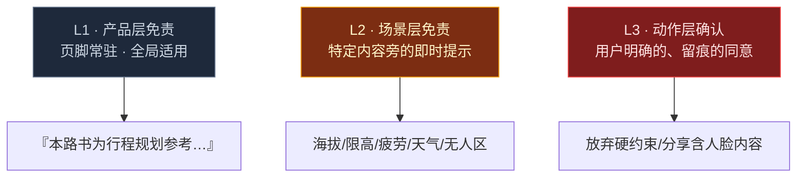
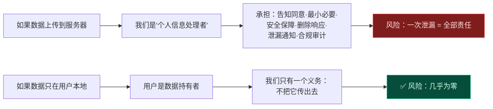
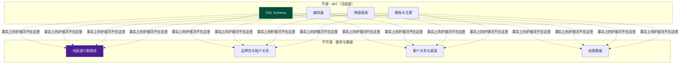

# 第 7 章 · 法律、安全与合规护栏

> **状态**：`Stable Draft`（含强制核验项）｜ **对应维度**：深度维度 ⑥ 法律、安全与合规护栏
> **铁律依据**：[责任边界线 1/2/3](00-overview-and-glossary.md#03-三条责任边界线)、[铁律 7 事实与建议分离](00-overview-and-glossary.md#铁律-7--事实与建议分离-facts-and-advice-are-separate)、[铁律 9 一切可存证](00-overview-and-glossary.md#铁律-9--一切可存证-everything-auditable)
> **本章要回答**：这套东西做出来，合法吗？出了事谁负责？哪些话不能说？

---

## 7.0 先声明：本章不是法律意见

> ⚠️ **本章是工程护栏规格，不是法律意见。**
>
> 本章的作用是**把法律风险转化为可执行的代码约束**——哪些字段不能存、哪些话不能在 UI 上出现、哪些动作必须留痕。这些是**工程决策**，可以由工程师执行。
>
> 但**所有具体的法律条文引用、合规义务判定、协议条款解读，都必须由执业律师核验。** 本章 §7.11 列出了全部引注及其核验状态。**在核验完成前，任何引注不得用于对外材料、合同或宣传。**

**这个声明本身就是合规设计的一部分。** 一个把法律结论写死在工程文档里、且不经律师复核的项目，在真正的争议中会处于更糟的位置——因为它证明了当事人**明知**相关规定却选择了特定做法。

---

## 7.1 三条责任边界线的法律落地

[§0.3](00-overview-and-glossary.md#03-三条责任边界线) 定义了三条边界。本节把它们转成**可执行的检查**。

### 7.1.1 边界线与法律后果的对应

| # | 边界 | 越界的法律性质 | 越界的实际后果 |
| :--- | :--- | :--- | :--- |
| **1** | 不是导航软件 | 产品责任 / 侵权 | 用户按路书行驶发生事故，我们成为被告 |
| **2** | 不是旅行社 | **无证经营旅行社业务** | 行政处罚（没收违法所得 + 罚款），且合同可能被认定无效 |
| **3** | 不是 OTA | 无证经营在线旅游业务 / 支付牌照问题 | 同上 + 资金池合规风险 |

> ⚠️ **边界 2 和 3 是"硬边界"，不是措辞问题。** 边界 1 可以通过措辞在很大程度上管控（用户自甘风险），但**边界 2/3 一旦越过，措辞无法挽救**——因为是否构成"经营旅行社业务"看的是**实际行为**，不是页面上的文字。**收了游客的钱、组织并提供了旅游服务，就是旅行社业务，无论你叫自己什么。**

### 7.1.2 措辞白名单 / 黑名单（编译器强制）

[BR-015](04-dsl-specification-v1.md#416-业务规则校验清单-business-rules) 已定义禁用词。此处给出**完整词表**与**替换建议**：

| ❌ 禁用 | 为什么 | ✅ 替换 |
| :--- | :--- | :--- |
| 导航 / 跟随本路书导航 | 越界 1 | 行程规划参考 |
| 保证 / 承诺 / 确保 | 越界 2 | 建议 / 通常 / 请注意 |
| 绝对安全 / 零风险 | 虚假宣传 | （删除，改为具体风险提示） |
| 我们为您安排 / 我们提供 | 越界 2 | 本路书整理了…信息 |
| 在线预订 / 立即抢购 / 下单 | 越界 3 | 跳转至第三方平台 |
| 官方指定 / 独家合作 | 可能构成虚假宣传 | （需实际凭证才可用） |
| 全网最低价 | 价格法风险 | （删除） |
| 保证有位 / 保证预约成功 | 越界 2 | 建议提前 N 天预约 |

```js
const BANNED_WORDS = {
  '导航':       '行程规划参考',
  '保证':       '建议',
  '承诺':       '建议',
  '确保':       '建议',
  '绝对安全':   null,
  '零风险':     null,
  '我们为您安排': '本路书整理了',
  '为您预订':   '可跳转至第三方平台',
  '立即抢购':   '查看第三方平台',
  '全网最低':   null,
  '独家':       null,
};

function checkBR015(trip) {
  const out = [];
  walkStrings(trip, (s, path) => {
    for (const [bad, good] of Object.entries(BANNED_WORDS)) {
      if (!s.includes(bad)) continue;
      out.push({
        level: 'error', code: 'BR-015', path,
        msg: `文案包含禁用词「${bad}」。`,
        remedy: good ? `建议改为「${good}」` : '建议删除该表述',
      });
    }
  });
  return out;
}
```

> 📌 **注意 `BANNED_WORDS` 的一个细节**：「独家」「全网最低」这类词，**不是绝对不能出现，而是不能无条件出现**。如果确实有独家协议、有价格依据，是可以用的。因此实现上应该有**白名单机制**：`brand.verifiedClaims: ["独家"]` 经过人工审核后可以解锁。
>
> **把所有词都禁掉是一种偷懒**——它会让合法的营销表达也变得不可能。**正确做法是：默认禁止 + 例外需凭证。**

---

## 7.2 三级免责体系

**核心原则：免责声明不能替代安全设计。**

> ⚠️ 一句"风险自负"不能免除你**本应做出的提醒**。法律上，如果某项风险是你可以预见且可以提示的，那么不提示而只挂一句总免责，往往不被认可。
>
> **免责的正确用法是"补充"，不是"替代"。** 你已经做了该做的提示和防护，免责声明用来界定剩余风险的归属。

### 7.2.1 三级结构



### 7.2.2 L1 · 产品层

**位置**：页脚 + 「关于本路书」页
**文案**（建议稿，需律师审阅）：

> 本路书为**行程规划参考**。所有路线、时间、里程、价格信息均为编制时的整理结果，可能发生变化。
>
> 实际行车请**以车辆导航系统与现场交通标识为准**；预订与履约由**持牌旅行社及商家**提供，本路书不参与交易；本路书不构成任何形式的保证或承诺。
>
> 出行前请自行核实开放时间、通行限制、天气与路况。户外活动存在固有风险，请量力而行。

### 7.2.3 L2 · 场景层（★ 这是真正起作用的一层）

| 触发条件 | 提示位置 | 文案要点 |
| :--- | :--- | :--- |
| 节点 `altitudeM > 3000` | 该节点卡片内 | 「海拔 XXXXm。有心血管疾病、高血压、严重贫血者请咨询医生后前往。抵达后避免剧烈活动。」 |
| 节点 `altitudeM > 4000` | 该节点 + 当日顶部 | 同上 + 「建议携带便携氧气，关注同行者状态，出现头痛呕吐立即下撤。」 |
| 当日 `totalDriveMin > 480` | 当日顶部 | 「本日驾驶 X 小时，疲劳驾驶风险高。建议至少 2 名驾驶员轮换，每 2 小时休息。」 |
| `transit` 经过无人区 | 路段卡片 | 「本段 XXX km 内无加油站与补给点，请提前加满油、备足饮水。」 |
| 天气 `warning` | 当日顶部 | 「预报有 X。山区天气多变，请出发前再次确认。」 |
| `vehicleAccess.confidence` < verified | 节点内 | 见 [§3.5.3](03-b2b-agency-operations.md#353-置信度四级语义) |
| 边境地区 `borderZone: true` | 节点 + 全局 | 见 §7.9.1 |

> 📌 **L2 是唯一真正能减少事故的一层。** L1 让人在法律上知道"这不保证"，L2 让人**在现实中避开危险**。**资源应该优先投在 L2 上。**

### 7.2.4 L3 · 动作层（必须留痕）

```js
/**
 * 需要用户明确确认的高风险动作。
 * ★ 每次确认都必须写入 provenance，形成可举证记录（铁律 9）。
 */
const HIGH_RISK_ACTIONS = {
  ABANDON_HARD_CONSTRAINT: {
    label: '放弃一项硬性约束',
    template: (c) => `您即将放弃以下约束：\n\n「${c.label}」\n\n` +
      `原因：${c.reason}\n\n` +
      `放弃后，可能会：\n${c.consequences.map(x => '  · ' + x).join('\n')}\n\n` +
      `确认放弃吗？`,
    requiresTyping: false,
  },
  SHARE_WITH_FACES: {
    label: '分享可能包含人脸的影像',
    template: () => '本内容可能包含可识别的人脸。\n\n' +
      '如果其中包含**未成年人**，请确认已取得其监护人同意。\n\n' +
      '分享到公开平台后，任何人都可能下载与二次使用。\n\n确认分享吗？',
    requiresTyping: false,
  },
  ENTER_RESTRICTED_ZONE: {
    label: '前往边境/管制区域',
    template: (z) => `您即将前往管制区域：\n\n「${z.name}」\n\n` +
      `该区域可能要求：\n${z.requirements.map(x => '  · ' + x).join('\n')}\n\n` +
      `请确认您已了解并携带所需证件。`,
    requiresTyping: false,
  },
  SHARE_TRIP_WITH_PII: {
    label: '分享含个人信息的版本',
    template: () => '该版本包含队员的姓名与联系方式。\n\n' +
      '分享后，获得链接的人都能看到这些信息。\n\n' +
      '如需分享给更多人，建议改用「分享版」（已自动移除个人信息）。',
    requiresTyping: true,          // ★ 高敏感动作要求手动输入确认词
    confirmPhrase: '确认分享',
  },
};
```

> 📌 **`requiresTyping` 的设计意图**：对于**后果不可逆且影响他人**的动作（把队员个人信息发给外部），单次点击太容易误触。要求手动输入"确认分享"四个字，能过滤掉绝大多数误操作。**摩擦在这里是一种保护。**

---

## 7.3 第三方数据合规矩阵

### 7.3.1 ★ 一条不可逾越的红线：不做爬虫

| ❌ 绝不做 | ✅ 可以做 |
| :--- | :--- |
| 抓取携程/美团/大众点评的页面内容 | 使用官方开放平台的 API |
| 缓存第三方平台的图片、评论、评分 | 存储跳转链接 |
| 绕过反爬机制 | 展示第三方来源的名称与链接 |
| 把抓取的内容存进 DSL | 让用户主动输入他看到的原始价格 |

**理由**：抓取第三方内容涉及**著作权**（内容有版权）、**不正当竞争**（实质性替代）、**违反服务条款**（合同违约）、以及可能触及**计算机信息系统**相关法律。**风险与收益完全不成比例**——我们要的是"用户能跳过去"，不是"我们拥有这些内容"。

### 7.3.2 合规矩阵

| 数据源 | 用途 | 合规依据 | 存储限制 | 风险 |
| :--- | :--- | :--- | :--- | :--- |
| **高德地图** 算路/POI/天气 | 路线与地点 | 开放平台服务条款 + Key 授权 | ⚠️ **算路结果的存储限制待确认** | 🟠 [OI-003](00-overview-and-glossary.md#07-未决事项登记册-open-issues-register) |
| **高德地图** 商业授权 | B2B 白标 | 需商务对接 | — | 🔴 [OI-007](00-overview-and-glossary.md#07-未决事项登记册-open-issues-register) |
| **携程/美团/飞猪** | 跳转交易 | CPS 联盟协议 | 仅存储链接与计数 | 🟠 需遵守各联盟条款 |
| **大众点评** 评分 | 展示 | ⚠️ 无公开 API | ❌ **不存储** | 🔴 建议改为跳转 |
| **用户上传的 trip.json** | 生成路书 | 用户授权 | 本地处理，不上传 | 🟢 |
| **用户照片** | 记忆日志 | 本地处理 | ❌ **不上传** | 🟢 |
| **天气数据** | 行程提示 | 高德天气 API | 快照可存，标注时效 | 🟡 |

### 7.3.3 ★ OI-003 的工程应对

**"算路结果能否存储"这一点未确认之前，采取保守设计：**

```jsonc
// ★ 保守模式：不存储算路结果的完整 polyline 到我们自己的服务器
// 只在用户本地编译时即时获取，并编进用户自己的产物
{
  "route": {
    "polylineSource": "amap_driving_v5",
    "polylineFetchedAt": "2026-09-20T12:00:00+08:00",
    // ★ 明确记录来源与时点，便于在条款变化时识别与清理
    "attribution": "路线数据来自高德地图",
    "fetchContext": "user_local_compile"
  }
}
```

**三条保守措施**：
1. **不由我们的服务器代取**——算路请求由**用户的浏览器**直接发往高德
2. **不跨用户共享**——每份路书的 polyline 只存在于该份产物中
3. **明确署名**——产物中标注数据来源

> 📌 这三条措施让"存储"这个行为的性质发生了变化：**我们不是数据的存储者，用户是。** 这与[铁律 4](00-overview-and-glossary.md#铁律-4--数据主权本地化-data-sovereignty-stays-local)完全一致。

---

## 7.4 个人信息保护

### 7.4.1 ★ 最重要的一点：行踪轨迹是敏感个人信息

这是本项目的**核心数据类型**，也是最大的合规风险点。

| 数据类别 | 本项目中出现在哪 | 敏感级别 |
| :--- | :--- | :--- |
| **行踪轨迹** | 整个路书就是一份行踪轨迹 | 🔴 **敏感个人信息** |
| **健康信息** | `hardNeeds`（高血压、心脏病）、海拔医学约束 | 🔴 **敏感个人信息** |
| **身份证件** | 特权资源预约材料清单 | 🔴 **敏感个人信息** |
| **不满十四周岁未成年人信息** | 队伍中的儿童 | 🔴 **敏感个人信息** |
| 姓名 + 手机号 | 队员联系方式 | 🟠 一般个人信息 |
| 车辆信息 | 车牌号 | 🟠 |

> ⚠️ **处理敏感个人信息的要求显著高于一般个人信息**——通常需要**单独同意**（而非打包在总协议里）、需要**告知必要性及对个人权益的影响**、并需要更强的安全措施。
>
> **这意味着：把"队员健康信息"和"景点介绍"放在同一个同意流程里，是不合规的。**

### 7.4.2 本地处理是最彻底的合规策略



**架构即合规。** 这就是为什么 [§5.9.2](05-compiler-pipeline.md#592-浏览器侧buildhtml) 的浏览器内编译、[§6.1](06-memory-journal-engine.md#61-一个必须先说清楚的承诺) 的本地照片处理，不只是技术选择——**它们把最重的一类合规义务直接消解掉了**。

### 7.4.3 分级同意模型

```jsonc
{
  "consent": [
    {
      "scope": "core_itinerary",
      "purpose": "生成行程路书",
      "data": ["姓名", "手机号"],
      "basis": "履行合同所必需",
      "separateConsent": false,
      "required": true
    },
    {
      "scope": "health_constraints",
      "purpose": "海拔与强度适配、紧急情况处置",
      "data": ["健康受限信息", "过敏史", "用药提醒"],
      "basis": "单独同意",
      "separateConsent": true,
      "required": false,
      "note": "拒绝不影响路书生成，仅不做个性化适配",
      "retention": "行程结束后 30 天自动删除",
      "visibility": "secret"
    },
    {
      "scope": "minor_info",
      "purpose": "儿童行程适配",
      "data": ["年龄", "身高"],
      "basis": "监护人单独同意",
      "separateConsent": true,
      "required": false,
      "guardianConsent": true
    },
    {
      "scope": "location_sharing",
      "purpose": "队伍内位置共享",
      "data": ["实时位置"],
      "basis": "单独同意",
      "separateConsent": true,
      "required": false,
      "default": false,
      "note": "★ 默认关闭。开启后随时可关，且不保留历史轨迹。"
    }
  ]
}
```

> ⚠️ **`location_sharing` 默认必须为 `false`。** 队伍内实时位置共享是个很有诱惑力的功能（"看队友到哪了"），但它意味着**持续采集行踪轨迹**。默认开启会构成严重的合规问题。**必须由每个成员各自主动开启，且开启后即可关闭、不保留历史。**

### 7.4.4 隐私政策要点清单

| # | 必须写明 | 本项目具体情况 |
| :--- | :--- | :--- |
| 1 | 收集哪些个人信息 | 多数**不收集**（本地处理），需明确说明这一点 |
| 2 | 如何收集 | 用户主动输入 / 设备本地读取 |
| 3 | 使用目的 | 生成路书 / 记忆日志 |
| 4 | 是否共享给第三方 | 深链投递时会将地点名称传给导航 App（**需说明**） |
| 5 | 是否上传服务器 | 明确说明：**行程与照片不上传** |
| 6 | 存储位置与期限 | 用户设备本地；我们不持有 |
| 7 | 用户权利与行使方式 | 删除 = 删除本地文件 |
| 8 | 敏感个人信息的单独同意 | 健康、位置、儿童 |
| 9 | 未成年人保护 | 监护人同意 |
| 10 | 投诉与联系方式 | — |

> 📌 **第 5 条是本项目最强的一条合规卖点。** "你的行程数据和照片**从不离开你的设备**"是一句可以验证的承诺（用户可自查网络面板）。**在隐私普遍被滥用的时代，这是真正的差异化。**

---

## 7.5 生成式 AI 相关

### 7.5.1 标识义务

**AI 生成或辅助生成的内容需要标识**——这是监管的明确要求（引注见 §7.11）。

```jsonc
"provenance": {
  "generatedBy": "ai_assisted",
  "model": "claude-sonnet-5-5",
  "generatedAt": "2026-09-20T10:00:00+08:00",
  "humanReviewed": true,
  "reviewedBy": "user_designer_zhang",
  // ★ 披露：哪些部分由 AI 生成
  "disclosures": [
    { "scope": "advice", "text": "景点介绍与游览建议由 AI 辅助生成并经人工审阅" },
    { "scope": "fact", "text": "开放时间与票价来自人工核实，AI 不生成此类字段" }
  ]
}
```

**UI 呈现**：路书页脚显示一枚**可点击的标识**：

> `✦ 本路书部分内容由 AI 辅助生成 · 详情`

### 7.5.2 ★ AI 明确不得生成的字段（承 BR-016 的精神）

| 字段 | 为什么不能由 AI 生成 |
| :--- | :--- |
| `vehicleAccess.*` | AI 会生成"看起来合理"的通行限制，错了会把车卡在限高栏（[BR-016](04-dsl-specification-v1.md#416-业务规则校验清单-business-rules)） |
| `fact.openHours` / `ticketCents` | 会过期，且用户会当真 |
| `fact.contactPhone` | 编造的电话号码可能指向无辜的第三方 |
| `privileges.*` | 涉及真实的人与资源 |
| `booking.status` | 预订状态是事实，不可推测 |
| 医疗/安全建议 | 高度情境依赖，AI 生成有实质风险 |

**实现**（编译器语义校验）：

```js
const AI_FORBIDDEN_PATHS = [
  /^days\[\d+\]\.nodes\[\d+\]\.vehicleAccess/,
  /^days\[\d+\]\.nodes\[\d+\]\.fact\.(openHours|ticketCents|contactPhone)/,
  /^days\[\d+\]\.nodes\[\d+\]\.booking\.status/,
  /^privileges/,
];

function checkAISourcing(trip, provenance) {
  const out = [];
  const aiGenerated = provenance?.aiGeneratedPaths ?? [];
  for (const p of aiGenerated) {
    if (AI_FORBIDDEN_PATHS.some(re => re.test(p))) {
      out.push({ level: 'error', code: 'AI_SOURCING', path: p,
        msg: `字段 ${p} 由 AI 生成，但该字段必须来自可靠数据源。`,
        remedy: '请人工核实并填写，或从字段中删除。' });
    }
  }
  return out;
}
```

> 📌 **注意这里的机制是"溯源校验"而不是"内容校验"。** 我们无法从内容判断一个电话号码是不是编的——**但我们可以要求每个事实字段声明它的来源，并禁止 AI 作为来源。** 这是[铁律 7 事实与建议分离](00-overview-and-glossary.md#铁律-7--事实与建议分离-facts-and-advice-are-separate)的技术实现。

### 7.5.3 AI 生成内容的服务提供者义务

若 TripCraft 自身提供 AI 生成能力（而非仅接收用户提供的 DSL），则需考虑生成式 AI 服务相关的备案、内容安全、训练数据合规等义务。**这是产品形态选择的直接后果**：

| 形态 | 合规负担 |
| :--- | :--- |
| **纯工具**（用户自带 AI 生成 DSL，我们只编译） | 🟢 低 |
| **内置 AI 生成** | 🟠 显著增加 |

> 📌 **这条差异会影响产品路线图的排序**：**"编译能力"应先于"生成能力"落地。** 前者是工具，后者会引入一整套服务提供者义务。**先用工具建立用户基础与数据资产，是更稳的路径。**

---

## 7.6 ★ 许可证矛盾整改（OI-008 · P0）

### 7.6.1 问题陈述

当前仓库存在一处**实质矛盾**：

| 文件 | 内容 | 冲突点 |
| :--- | :--- | :--- |
| [`LICENSE`](../LICENSE) | MIT License | **明确允许商业使用** |
| [`README.md`](../README.md) §8.5（第 590 行附近） | 声明禁止商业使用 | 与 MIT 直接冲突 |

**法律效果**：当两者冲突时，**MIT 作为正式授权文件通常优先**。这意味着 README 中的"禁止商业使用"**在法律上很可能是无效的**，任何人（包括竞争对手）都可以依 MIT 条款合法使用、修改、闭源、商业化本项目的代码。

> ⚠️ **这不能靠"补一句话"解决。** 许可证是**单方的、不可撤销的授权**，一旦发布就产生了信赖利益。**已经获得的授权不能追溯撤回。**

### 7.6.2 三个选项

| 选项 | 做法 | 优点 | 缺点 |
| :--- | :--- | :--- | :--- |
| **A. 保持 MIT，放弃"禁商用"表述** | 删除 README §8.5 的禁商用声明 | 简单、无冲突、最大化传播 | 放弃了对商业使用的控制 |
| **B. 改用 AGPL-3.0** | 替换 LICENSE | 保留开源，且**网络服务提供者必须开源其修改**——对"被别人做成竞品 SaaS"有实际约束 | 吓退部分企业用户；SaaS 竞品仍可用（只要开源） |
| **C. 改为专有许可** | 替换为自定义商业许可 | 完全控制 | **失去全部开源信任红利**，且与"地接社可读产物学习"的定位冲突 |

### 7.6.3 我的建议：**A（结合分层开放）**

**理由不是"MIT 更好"，而是因为本项目[铁律 10](00-overview-and-glossary.md#铁律-10--代码不是护城河资产才是-code-is-not-the-moat-assets-are)已经给出了正确判断：代码不是护城河。**



**分层逻辑**：
- **代码 + 规范全开放** → 最大化传播、建立事实标准、吸引地接社技术合作方
- **数据和关系全不开放** → 这才是别人**复制不了**的东西

**如果 MIT 让某人抄走了编译器，他抄走的是一个 3000 行的静态生成器。他抄不走：三年积累的 2000 条车辆通行数据、37 家地接社的信任、和一位定制师已经习惯了三个月的工作流。**

> ⚠️ **决策归属**：这是**具有法律意义的商业决策**，不应由工程方单方面修改。**本文档给出分析与建议，最终决定需由项目所有者作出。** 在决定之前，README §8.5 的表述应当**暂时移除或改为"详见 LICENSE"**，以消除现行矛盾——保留一个法律上无效的声明，比没有声明更糟，因为它可能构成对潜在使用者的误导。

---

## 7.7 防篡改与水印

### 7.7.1 两个方向的问题

| 方向 | 问题 | 解法 |
| :--- | :--- | :--- |
| **向外**（保护用户） | 有人伪造一份"某旅行社官方路书"行骗 | 内容指纹 + Ed25519 签名（[§5.7.3](05-compiler-pipeline.md#⑩-seal)） |
| **向内**（保护我们） | 客户把白标模板抄走自建系统 | 软性水印 + 合同条款（技术手段有限） |

### 7.7.2 白标防伪

```html
<!-- 白标版产物内置的验证信息 -->
<meta name="tripcraft:tenant" content="zhangye-jinma">
<meta name="tripcraft:hash" content="sha256:...">
<meta name="tripcraft:sig" content="ed25519:...">
<meta name="tripcraft:issued-at" content="2026-09-24T10:00:00+08:00">
```

**验证页面**：`tripcraft.page/verify` —— 用户可上传/粘贴一份路书，验证其是否为某租户官方发布且未被篡改。

> 📌 **这个功能的价值不是防止伪造，而是让伪造变得可识别。** 完全防止伪造在技术上不可能（任何人都能截图）。**但一个"官方可验证"的通道存在，本身就是对伪造的有效抑制**——因为验证失败会被立刻发现。

### 7.7.3 关于"防抄袭"的诚实评估

| 手段 | 有效性 | 说明 |
| :--- | :--- | :--- |
| JS 混淆 | ❌ 低 | 混淆不改变可读性本质，且有维护成本 |
| 禁止右键 / F12 | ❌ **极低且有害** | 一条 JS 就能绕过；且阻止了合法的学习与技术合作 |
| 产物水印 | 🟡 中 | 软性可见，用于主张 |
| **服务端依赖** | ✅ 高 | 让关键能力必须联网调用（但违背铁律 5） |
| **数据资产** | ✅✅ **最高** | 见铁律 10 |

> ⚠️ **明确不做"禁止右键 / 禁用 F12"。** 这类手段**对真正的抄袭者无效**（一条命令行参数即可绕过），却**会伤害正当用户**（想学习的开发者也许多），且**给人不好的观感**。**这是一种纯粹负收益的防护。**

---

## 7.8 安全护栏（非法律义务，但同级重要）

[BR-005 / BR-006 / BR-007](04-dsl-specification-v1.md#416-业务规则校验清单-business-rules) 是三条人命相关规则。此处补充**第 7 章新增的护栏**：

| ID | 护栏 | 触发 | 行为 |
| :--- | :--- | :--- | :--- |
| **BR-020** | 无人区路段无补给标记 | `transit.remoteness === 'none'` 且长度 > 200km | 强制渲染补给提示，不可关闭 |
| **BR-021** | 边境/管制区 | `place.borderZone === true` | 强制渲染证件提示（§7.9.1），不可关闭 |
| **BR-022** | 单日海拔跃升 | 当日最高与最低海拔差 > 1500m | 警告"快速升降海拔，注意高原反应" |
| **BR-023** | 极端天气窗口冲突 | 节点时段落在预警时段内且为户外类型 | 强制提示并建议调整 |
| **BR-024** | 行程含未成年人的高风险项目 | `party.groups.kids` 存在且节点 `riskLevel >= high` | 强制提示监护人确认 |

> ⚠️ **BR-020 到 BR-024 全部为"不可关闭"（not configurable）。** 这条约束和 BR-005/006/007 同级。**客户不能付费关闭安全提示。** 这个立场必须在商务合同里也写明，避免后续争议。

---

## 7.9 特殊场景

### 7.9.1 ★ 边境与管制区域（本项目的高频场景）

**新疆、西藏、内蒙古部分地区**存在边境管理区与摄影限制。这是青甘/新疆线路**必然涉及**的合规问题。

| 场景 | 提示内容 |
| :--- | :--- |
| 边境管理区 | 「本区域属边境管理区，通行可能需办理《边境管理区通行证》。请提前向户籍地或目的地公安机关咨询。」 |
| 军事/涉密区域 | 「附近可能有军事管理区。**禁止对军事设施、边防哨所、检查站拍照**。请遵守现场标识与执勤人员指引。」 |
| 检查站 | 「前方有公安检查站。请提前准备好全车人员身份证件，配合检查。」 |
| 无人机 | 见 §7.9.2 |

```js
// 编译器检测：坐标落在已知管制区范围内 → 强制插入提示节点
function checkBR021(trip, restrictedZones) {
  const out = [];
  for (const day of trip.days) {
    for (const n of day.nodes) {
      if (!n.place?.coords) continue;
      const zone = restrictedZones.find(z => pointInPolygon(n.place.coords, z.polygon));
      if (!zone) continue;

      if (n.place.borderZone !== true) {
        out.push({ level: 'warn', code: 'BR-021', path: n.id,
          msg: `节点「${n.place.name}」位于${zone.label}范围内，但未标记 borderZone。`,
          remedy: '建议显式标记，以触发证件与拍照提示。' });
      }
    }
  }
  return out;
}
```

> ⚠️ **管制区范围数据本身也是敏感数据。** 建议：**不在产品中内置精确的军事禁区边界**（这可能本身就构成问题），而是使用**公开的行政区划层面提示**（如"某某县属边境管理区"），并引导用户咨询官方渠道。**模糊但正确的提示，好过精确但可能违规的数据。**

### 7.9.2 无人机

| 提示 | 内容 |
| :--- | :--- |
| 实名登记 | 「民用无人机需实名登记。请确认已完成登记并粘贴登记标志。」 |
| 禁飞区 | 「景区、机场周边、军事区域、边境地带通常禁飞。请提前查询当地规定。」 |
| 景区规定 | 「多数景区禁止未经许可的航拍，请遵守景区规定。」 |
| 文物保护 | 「文物保护单位及周边可能有额外限制。」 |

### 7.9.3 未成年人

| 措施 | 说明 |
| :--- | :--- |
| 监护人同意 | 收集未成年人信息需监护人单独同意（[§7.4.3](#743-分级同意模型)） |
| 内容呈现 | 分享后的公开内容**如含可识别未成年人影像，需提示监护人确认**（[§7.2.4](#724-l3--动作层必须留痕) `SHARE_WITH_FACES`） |
| 不做人脸识别 | [§6.7.2](06-memory-journal-engine.md#672--选片的启发式刻意不用人脸识别)——**尤其是不对儿童** |
| 高风险项目 | BR-024 强制提示 |

### 7.9.4 宗教与民俗场所

| 提示 | 内容 |
| :--- | :--- |
| 着装 | 「进入宗教场所请着长袖长裤，女性可能需要覆盖头发。」 |
| 拍摄 | 「殿内通常禁止拍照，请遵守现场标识。」 |
| 礼仪 | 「转经、绕行请遵循当地习俗方向（通常顺时针）。」 |
| 尊重 | ★ 措辞原则：**陈述事实与常规，不做评价。** |

### 7.9.5 生态与文物保护

| 提示 | 内容 |
| :--- | :--- |
| 不触碰 | 「请勿触摸壁画、彩塑、文物本体。」 |
| 不留痕 | 「请带走全部垃圾，不采摘、不攀爬、不投喂野生动物。」 |
| 特殊地貌 | 「雅丹、丹霞地貌脆弱，请勿攀爬踩踏。」 |

---

## 7.10 合规检查清单（发布前）

| # | 检查项 | 责任方 | 阻断级别 |
| :--- | :--- | :--- | :--- |
| 1 | BR-015 禁用词零命中 | 编译器 | 🔴 阻断 |
| 2 | L1 免责声明存在于页脚 | 编译器 | 🔴 阻断 |
| 3 | 所有 >3000m 节点有海拔提示 | 编译器 | 🔴 阻断 |
| 4 | 所有 `confidence < verified` 的通行数据有来源标注 | 编译器 | 🔴 阻断 |
| 5 | 所有商业卡片 `authorized === true` | 编译器 | 🔴 阻断 |
| 6 | 分享版不含 masked 及以上内容 | 编译器 | 🔴 阻断 |
| 7 | 导出影像不含 GPS 元数据 | 运行时 | 🔴 阻断 |
| 8 | 边境区域节点有证件提示 | 编译器 | 🟠 警告 |
| 9 | AI 披露标识存在 | 编译器 | 🟠 警告 |
| 10 | 隐私政策链接可达 | 产物 | 🟠 警告 |
| 11 | 许可证矛盾已解决（OI-008） | 项目所有者 | 🔴 阻断发布 |
| 12 | 高德商业授权已确认（OI-007） | 商务 | 🔴 阻断商用 |

---

## 7.11 ★ 引注核验表（强制）

> ⚠️ **本表列出全书引用的全部法律条文与规范性文件。在由执业律师核验前，一律不得用于对外材料、合同、宣传或用户可见文案。**
>
> 表中「核验状态」为 `未核验` 的条目，**在工程实现中不得作为"合规已完成"的依据**——它们只能作为"需要重点核查的风险点标记"。

| # | 引用 | 出现位置 | 用途 | 核验状态 |
| :--- | :--- | :--- | :--- | :--- |
| 1 | 《个人信息保护法》第 13 条 | §4.8 特权资源、§6.4 | 处理个人信息的合法性基础（同意等） | ⚠️ 未核验 |
| 2 | 《个人信息保护法》敏感个人信息条款 | §7.4.1 | 行踪轨迹/健康/儿童信息的单独同意 | ⚠️ 未核验 |
| 3 | 《个人信息保护法》未成年人条款 | §7.4.3 | 不满十四周岁需监护人同意 | ⚠️ 未核验 |
| 4 | 《民法典》第 1176 条 | §0.3 边界线 | 自甘风险（文体活动） | ⚠️ 未核验 |
| 5 | 《民法典》第 1023 条 | `brand.schema.json` | 声音权益（AI 语音克隆需授权） | ⚠️ 未核验 |
| 6 | 《旅游法》旅行社业务许可 | §7.1 边界线 2 | 无证经营旅行社业务 | ⚠️ 未核验 |
| 7 | 《生成式人工智能服务管理暂行办法》标识条款 | §7.5.1 | AI 生成内容标识义务 | ⚠️ 未核验 |
| 8 | 《专利法》第 22 条新颖性 | README Prior Art | 先公开导致丧失新颖性 | ⚠️ 未核验 |
| 9 | 《著作权法》合理使用 / 侵权 | §7.3.1 爬虫 | 抓取第三方内容的定性 | ⚠️ 未核验 |
| 10 | 《反不正当竞争法》 | §7.3.1 爬虫 | 实质性替代 | ⚠️ 未核验 |
| 11 | 边境管理区通行证规定 | §7.9.1 | 边境通行要求 | ⚠️ 未核验 |
| 12 | 民用无人机实名登记规定 | §7.9.2 | 无人机合规 | ⚠️ 未核验 |
| 13 | 高德开放平台服务条款 | §7.3.2 / OI-003 | 算路结果存储限制 | 🔴 **未核验（阻塞项）** |
| 14 | 各 CPS 联盟协议条款 | §3.7.2 | 佣金与推广合规 | ⚠️ 未核验 |

**核验流程建议**：


---

## 7.12 本章交付物清单

| 交付物 | 路径 | 状态 |
| :--- | :--- | :--- |
| 禁用词校验器 | `src/compiler/br015-wording.js` | ⏳ 待实现 |
| 免责声明模板 | `templates/legal/disclaimer.html` | ⏳ 待实现 |
| 场景提示渲染器 | `src/runtime/context-warnings.js` | ⏳ 待实现 |
| 高风险动作确认 | `src/runtime/high-risk-actions.js` | ⏳ 待实现 |
| AI 溯源校验器 | `src/compiler/ai-sourcing.js` | ⏳ 待实现 |
| 管制区提示 | `config/restricted-zones.json` | ⏳ 待建立（需法律审查） |
| 隐私政策要点 | `docs/legal/privacy-outline.md` | ⏳ 待建立 |
| 白标防伪验证页 | `web/verify/index.html` | ⏳ 待实现 |
| **引注核验记录** | `docs/legal/citation-review.md` | ⏳ **待律师出具** |

---

## 7.13 本章对仓库的整改要求

| # | 位置 | 要求 | 优先级 |
| :--- | :--- | :--- | :--- |
| 1 | [`README.md`](../README.md) §8.5 | 移除或改写与 MIT 冲突的"禁止商业使用"声明 | 🔴 P0（OI-008） |
| 2 | [`README.md`](../README.md) §2.4 | 按 [§2.12](02-cockpit-protocol.md#212--本章对-readme-的修正要求) 修正 NOA 表述 | 🔴 P0 |
| 3 | [`README.md`](../README.md) 版本号 | v3.6.3 → v4.2.0（与线上一致） | 🟠 P1 |
| 4 | 全仓库 | 补充隐私政策与用户协议链接位置 | 🟠 P1 |
| 5 | 商务材料 | 高德商业授权确认后方可商用（OI-007） | 🔴 P0 |

---

> **上一章**：[第 2 章 · 智能座舱协议](02-cockpit-protocol.md) ｜ **返回**：[执行全书索引](README.md)
