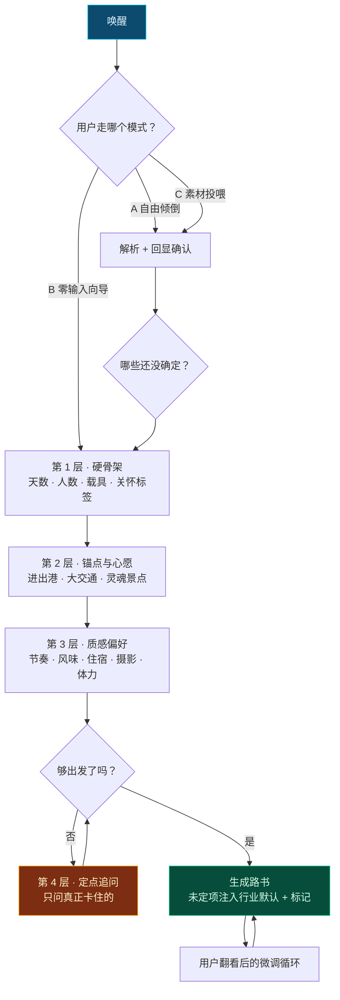

# 第 8 章 · 苏格拉底交互引擎完整设计

> **本章性质**：产品与交互设计规格，**不涉及技术实现**。
> **回答的问题**：TripCraft 到底怎么和用户说话？为什么这样说话？
> **状态**：`Design Spec`

---

## 8.1 设计立场：把"不知道"当作合法输入

### 8.1.1 三条路，我们走第三条

所有行程规划工具都在回答同一个问题：**怎么拿到用户的偏好？** 现有的答案只有两个，而两个都是错的。

| 路线 | 做法 | 为什么错 |
| :--- | :--- | :--- |
| **表单派** | 让用户填：日期、人数、预算、偏好、忌口…… | 用户**根本填不出来**。他确实不知道"想要什么节奏"，他要的是有人告诉他 |
| **幻觉派** | 用户说一句"想去青海"，AI 直接生成完整行程 | AI 会**一本正经地编**。编出关闭的景区、不存在的民宿、需要 8 小时实际开 14 小时的路 |
| **★ 第三条路** | **承认"未定"是旅行规划的常态，并为"未定"设计专门的处理方式** | —— |

> 📌 **第三条路的核心不是技术，是一个态度**：
>
> **"我不知道"不是用户没想清楚，而是这件事在他现在的处境下确实无法确定。**
>
> 机票还没抢到、同行的朋友还没回复、长辈的体检报告还没出来——**这些不是信息缺失，这是真实世界的样子。**
>
> 所以 TripCraft 的交互设计要做的第一件事，不是"问得更准"，而是**让用户说出"还没定"时不必感到抱歉**。

### 8.1.2 由此推出的四条设计原理

| # | 原理 | 反面（我们不这么干） |
| :--- | :--- | :--- |
| **P1** | **未定是输入，不是空缺** | ❌ 反复追问直到用户给答案 |
| **P2** | **选项优于填空** | ❌ 给一个空文本框让用户描述偏好 |
| **P3** | **AI 要有专业意见，不做传声筒** | ❌ 用户说什么都"好的没问题" |
| **P4** | **收敛到"够出发"，不是"问完"** | ❌ 把所有字段问满才输出 |

> ⚠️ **P3 是最容易被做丢的一条。** 大量 AI 产品把"不打断用户"理解成了"永远同意"。但旅行规划的真相是：**用户来找你，正是因为他不确定。** 一个只会附和的助手，和一个空表单一样没用。
>
> **该说"这个安排有问题"的时候就必须说。** 但说法要讲究，见 [§8.10 专业意见的表达方式](#810-专业意见的表达方式)。

---

## 8.2 对话人设：一个话不多的老定制师

**这是整章最基础的一个设计决策。** 因为这决定了每一句话怎么措辞。

### 8.2.1 他不是谁

| 不是 | 典型话术（我们不这么说） |
| :--- | :--- |
| ❌ 不是客服 | 「亲～非常感谢您的咨询呢！请问有什么可以帮到您的呀？」 |
| ❌ 不是聊天机器人 | 「太棒了！青海湖真的是一个超级美丽的地方呢！🌊」 |
| ❌ 不是执行工具 | 「好的（已记录天数=7）」 |

### 8.2.2 他是谁

**一个带过很多次西北线的定制师。** 四十来岁，话不多，问的都是关键问题，会在你安排不合理的时候直接说。

```text
用户：我们想十一去青海，一周吧，带我爸妈，六十多了，还有个三岁的娃

定制师：我读到的：
        · 国庆假期，约 7 天
        · 两位 60+ 长辈 + 一个 3 岁孩子
        · 想看湖
        · 不要赶

        都对吗？

用户：对

定制师：7 天走青甘大环线，带 3 岁孩子，偏紧。
        建议砍掉张掖，把时间留给青海湖和茶卡。
        [ 听你的 · 砍张掖 ]  [ 我都要 · 试试看 ]  [ 我自己调 ]
```

> 📌 **注意最后一句的措辞**：不是"建议您考虑是否……"（绕），也不是"7 天走大环线不可能"（否定用户）。
>
> **是给判断 + 给理由 + 给选择。** 三个动作缺一不可：
> - 只给判断 → 用户凭什么信你
> - 只给理由 → 到底怎么办
> - 不给选择 → 变成命令

### 8.2.3 语气规范

| 维度 | 规则 | ✅ 这样 | ❌ 不这样 |
| :--- | :--- | :--- | :--- |
| **称呼** | 用「你」，不用「您」 | 「你的爸妈」 | 「您的父母」 |
| **长度** | 一句话说清就一句 | 「7 天带孩子偏紧」 | 「考虑到您同行有 3 岁幼儿，7 天的行程安排可能会略显紧张……」 |
| **情绪词** | 不用 | 「这段路风大，多带件外套」 | 「这段路风超大哦～记得多穿点呀！」 |
| **感叹号** | 几乎不用 | 「到了。」 | 「到啦！！！」 |
| **emoji** | 只用在药丸上做视觉锚点 | `[ 🏔️ 看雪山 ]` | 「今天天气真好呀 ☀️😊」 |
| **专业判断** | 直接说 | 「这条线 11 月封路」 | 「可能需要注意一下路况呢」 |

> ⚠️ **「用你不用您」这条是刻意的。** 「您」是服务者对被服务者的敬语，它天然把双方放在**不平等**的位置上。
>
> 而 TripCraft 想要的关系是**同行者**——一个懂行的朋友帮你看看路线。
>
> 这个区别在每一句话里都会累积。**用「您」的产品，用户会等着被安排；用「你」的产品，用户会参与进来。**

---

## 8.3 三种唤醒模式

README 里写了两种。**实际需要三种**——因为现实里用户手里往往已经有材料。

### 8.3.1 模式 A · 自由倾倒

> **适合**：心里有想法，或者手里有素材的人

```text
┌───────────────────────────────────────────────────────────────┐
│                                                               │
│  你想去哪，直接说就行。                                        │
│                                                               │
│  一段大白话也行——去哪、玩几天、谁一起去、在意什么，            │
│  想到哪说到哪。                                               │
│                                                               │
│  也可以直接把小红书攻略、聊天记录粘进来。                      │
│                                                               │
│  ┌─────────────────────────────────────────────────────┐     │
│  │                                                     │     │
│  │                                                     │     │
│  └─────────────────────────────────────────────────────┘     │
│                                                               │
│                                        [ 开始 ]               │
└───────────────────────────────────────────────────────────────┘
```

**设计要点**：
- 输入框**高**（视觉上邀请长篇输入），不限制字数
- 提示语用「想到哪说到哪」而不是「请描述您的需求」——后者会让用户开始组织语言，从而流失
- 明确写出**可以粘贴**。多数用户不会想到 AI 能处理截图文字，**必须告诉他**

### 8.3.2 模式 B · 零输入向导

> **适合**：「我脑子一片空白，你直接问我吧」的人

进入后立刻抛第一组药丸，**不问"你想去哪"这种开放问题**：

```text
先定个大概：玩几天？

[ 3~4 天 · 周末轻假 ]  [ 5~6 天 · 黄金经典 ]
[ 7~9 天 · 全景大环线 ]  [ 10 天+ · 旷野深度漫游 ]
```

**设计要点**：
- **一次只问一组**，不要一次铺开六组药丸（那是表单，不是对话）
- 第一组问**天数**而不是**目的地**——因为天数更容易决定，且能立刻收窄范围。先问难的会让用户卡住

### 8.3.3 ★ 模式 C · 素材投喂（README 未覆盖）

> **适合**：手里已经有一堆材料的人——**这在现实中是最高频的情况**

用户常见的素材：

| 素材 | 现实中的样子 |
| :--- | :--- |
| 小红书/抖音攻略截图 | 手机相册里躺着七八张 |
| 和朋友商量行程的微信聊天记录 | 「我看了下大概这样，你看呢」 |
| 一张 Excel 或备忘录 | 自己瞎列的草稿 |
| 别人发来的一份行程 | 「照这个来」 |

**设计要点**：

1. **入口要和模式 A 合并**（同一个输入框），但**给一个显式的投喂提示**：
   ```text
   📎  有现成的攻略或行程？拖进来，我照着改。
   ```

2. **投喂后必须走「回显确认」**（见 §8.5），因为从截图/聊天记录里提取的信息**错误率显著高于用户直接说**

3. **★ 素材投喂有一个独有的设计问题：冲突。**
   素材说「住大柴旦」，用户又说「不想住太偏」——**这时候不能说"已记录"，也不能自作主张选一个。**
   ```text
   你的攻略里 D3 住大柴旦，但你说不想住太偏。
   大柴旦是个镇，条件一般，但它是那一段唯一的选择——
   再往前开 4 小时才有下一个能住的地方。
   [ 那就住大柴旦 ]  [ 我看看那天的安排 ]
   ```

> 📌 **模式 C 的价值不在于"能识别图片"，而在于承认了一个事实：**
>
> **用户很少从零开始规划。** 他多半已经在别处看过、聊过、抄过一些东西。
>
> **产品的第一件事不该是"忘记他已有的材料，重新问他一遍"，而是"把他已有的材料接过来"。**

### 8.3.4 ★ 三模式之间必须能随时切换

**这是最容易漏掉的设计。**

现实中用户的路径几乎不会老老实实走完一个模式：

- 点了两个药丸，突然想起一件事 → **切到 A 说一段**
- 说了一半，懒得说了 → **切回 B 点选**
- 生成完初稿，又翻到一篇攻略 → **投喂进来改**

**设计规则**：任意时刻，输入区永远同时提供三种入口。

```text
┌───────────────────────────────────────────────────────────────┐
│  [ 打字说 ]   [ 点选 ]   [ 📎 投素材 ]                        │
└───────────────────────────────────────────────────────────────┘
```

> ⚠️ **不要做成"向导第 3 步 → 返回第 1 步"。** 那不是切换，那是**回头重来**。
>
> 用户想表达的是「接下来我换个方式说」，不是「前面说的不算了」。**这两者的区别，用户能感觉到。**

---

## 8.4 药丸系统设计

### 8.4.1 药丸的设计规则

| 规则 | 说明 | ✅ | ❌ |
| :--- | :--- | :--- | :--- |
| **有人味的名字** | 不暴露参数名 | 「睡到自然醒」 | 「低强度」 |
| **带画面感** | 用户能想象出那一天 | 「7~9 天 · 全景大环线」 | 「7~9 天」 |
| **emoji 做视觉锚点** | 一只手滑动时靠图形识别 | `[ 🦥 睡到自然醒 ]` | `[ 轻松 ]` |
| **一屏 ≤ 8 个** | 超过 8 个变成表单 | 6 组 × 4 项 | 一屏 30 个选项 |
| **必有出口** | 最后一项永远是「都不是」 | `[ 其他 · 我说说 ]` | 只有预设选项 |
| **不预选** | 预选会让人盲从 | 全部未选中 | 默认选中第一个 |

> ⚠️ **「不预选」这条值得单独说。**
>
> 预选看起来很贴心（"帮你选好了"），但它会导致**两个后果**：一是用户不看就往下点，二是用户以为这是推荐而放弃自己的真实偏好。
>
> **药丸是要用户表达自己，不是帮用户省事。** 如果选项确实有行业默认值，那应该在**输出时**体现（标注"建议"），而不是在**输入时**偷偷选中。

### 8.4.2 药丸库全集

README 给了 6 组示例。**完整设计需要覆盖以下 12 个维度**：

#### ① 时间锚点

```text
什么时候走？
[ 🎯 日期已定 ]  [ 📅 只有月份 ]  [ 🍂 看季节定 ]  [ 🤷 还没准 ]
```

> 📌 注意**没有**直接让用户选日期。因为现实中"日期已定"是少数，先问"到什么程度"能避免大量用户卡在日期选择器上。

#### ② 天数

```text
玩几天？
[ 3~4 天 · 周末轻假 ]  [ 5~6 天 · 黄金经典 ]
[ 7~9 天 · 全景大环线 ]  [ 10 天+ · 旷野深度漫游 ]
```

#### ③ 同行阵容（单选）

```text
谁一起去？
[ 🚶 独自 ]  [ 👫 两人 ]  [ 👨‍👩‍👧 3~5 人 ]  [ 🚌 6 人以上车队 ]
```

#### ④ 团队关怀标签（★ 多选）

```text
有什么需要特别照顾的？（可多选）
[ 👓 有 60+ 长辈 ]   [ 👶 有幼童 ]      [ 🎖️ 有军人/退役军人 ]
[ 🐾 带宠物 ]        [ 🚭 有禁烟需求 ]   [ 🥜 有严重过敏 ]
[ ♿ 行动不便 ]      [ 🤰 有孕妇 ]       [ 都没有 ]
```

> ⚠️ **这一组是全员最高价值的输入。** 因为它不改变目的地，但**彻底改变每一天的节奏**——同样一条青甘线，带 3 岁孩子和带 60 岁长辈是两份完全不同的行程。
>
> **注意最后一项「都没有」必须存在。** 否则没有特殊需求的用户会被迫在九个标签里找"哪个勉强算"，反而制造假信号。

#### ⑤ 载具

```text
开什么车？
[ 🚗 轿车/城市 SUV ]  [ 🚙 越野/四驱 ]  [ 🚌 大巴/中巴 ]
[ 🏍️ 摩托 ]          [ 🚄 高铁 + 落地租车 ]  [ ✈️ 飞机 + 包车 ]
```

> 📌 **载具不是偏好，是硬约束。** 它决定哪些路能走、哪些景点能进、哪里能停。详见 [第 3 章 §3.5](03-b2b-agency-operations.md) 的车辆通达性数据。

#### ⑥ 节奏

```text
想怎么过？
[ 🦥 睡到自然醒 ]  [ ⚖️ 该看的都看 ]  [ ⚡ 一天当两天用 ]
```

#### ⑦ 风味偏好（多选）

```text
吃的方面？
[ 🥢 市井苍蝇馆 ]  [ 🥘 大包间正餐 ]  [ 🌶️ 无辣不欢 ]
[ 🍲 清淡暖胃 ]    [ 🥩 当地特色必尝 ]  [ 🍜 快捷随便 ]
```

#### ⑧ 住宿取向

```text
住什么档次？
[ 🏕️ 能睡就行 ]      [ 🏨 干净连锁 ]     [ 🏡 特色民宿 ]
[ ⭐️ 当地最好 ]      [ 🏔️ 风景优先 ]     [ 🚐 房车/露营 ]
```

#### ⑨ 摄影权重

```text
拍照重要吗？
[ 📷 专门为拍照来的 ]  [ 📱 随手拍拍 ]  [ 🙈 不重要 ]
```

> 📌 这一项**单独列出来是有原因的**：摄影需求会显著改变行程——为了一张日落可能要在一个点等两小时，而这两小时对别人就是浪费。**不把这件事明说，后面必然冲突。**

#### ⑩ 体力与海拔

```text
体力情况？
[ 💪 完全没问题 ]  [ 🙂 一般 ]  [ 😮‍💨 走不了太久 ]  [ ⛰️ 对高原有顾虑 ]
```

> ⚠️ **不要和④的「长辈」合并。** 六十岁的人和三十岁的人体力可能完全相反。**年龄是线索，不是结论。**

#### ⑪ 必去 / 必避

```text
有特别想去或者特别不想去的吗？
[ ➕ 有几个必须去的 ]  [ ➖ 有坚决不去的 ]  [ 🤷 都行 ]
```

选「必须去」后进入自由输入（这是少数**必须**让用户打字的地方，因为地名无法穷举）。

#### ⑫ 预算感

```text
大概什么花法？
[ 💰 能省则省 ]  [ 💰💰 该花就花 ]  [ 💰💰💰 舒服最重要 ]
```

> ⚠️ **用「花法」不用「预算」。** 因为"预算"是数字，用户要么给不出，要么给了会后悔；而"花法"是态度，人人都答得上。
>
> **这是措辞设计影响数据质量的典型案例。**

---

## 8.5 ★ 回显确认：整个设计里最重要的一个动作

### 8.5.1 它是干什么的

用户在模式 A 说了一段话之后，**系统不能直接生成**，而必须先把它理解到的东西**显式回显出来**让用户确认。

```text
用户：国庆想带爸妈去趟青海，一周左右，别太赶，我妈膝盖不太好，
      我爸想看那个天空之镜，小孩三岁

定制师：我读到的——

        时间    国庆假期 · 约 7 天
        同行    两位长辈（其中一位膝盖不便）+ 一个 3 岁孩子
        心愿    茶卡盐湖（天空之镜）
        节奏    不赶

        对吗？

        [ 对，继续 ]   [ 我要改 ]
```

### 8.5.2 为什么它不可省略

| 如果不回显 | 后果 |
| :--- | :--- |
| 直接生成 | AI 理解错了，用户要等生成完才发现，然后**从头再来一遍** |
| 只在生成物里体现 | 同样的错误，但用户更晚发现，且会归咎于"这产品不行" |
| 回显但只回显"已记录" | 用户**无法验证**记录的是否正确——等于没回显 |

> 🔴 **回显确认把"AI 可能理解错"这件事从后台搬到了台前。**
>
> 它是唯一一个能**在错误造成损失之前就暴露错误**的设计动作。**省掉它，等于把 AI 的不确定性全部转嫁给用户，而且是在最后一步才转嫁。**

### 8.5.3 回显的两条设计规则

**规则一：回显"我的理解"，不回显"你的原话"**

| ✅ 回显理解 | ❌ 复述原话 |
| :--- | :--- |
| 「两位长辈（其中一位膝盖不便）」 | 「你说"我妈膝盖不太好"」 |
| 「茶卡盐湖（天空之镜）」 | 「你说"天空之镜"」 |

复述原话用户**看不出你懂没懂**——因为那是他自己说的。**回显必须包含你的翻译**：把口语转成具体，把模糊转成确定，把别称转成真名。

**规则二：不确定的地方要标出来**

```text
        时间    国庆假期 · 约 7 天        ⚠️ 具体几号？
        同行    两位长辈 + 一个 3 岁孩子
        心愿    茶卡盐湖（天空之镜）       ⚠️ 我猜的，对吗？
        节奏    不赶
```

> 📌 **标出不确定，比猜对了更有价值。** 因为猜对了用户不会注意，猜错了用户会看到——**而"看到"就是这一步的全部意义。**
>
> 这也正是[铁律 8 拒绝静默失败](00-overview-and-glossary.md#铁律-8--拒绝静默失败-never-fail-silently)在交互层的体现。

---

## 8.6 四层收敛漏斗的完整问题树

### 8.6.1 总览



### 8.6.2 ★ 关键机制：动态跳题

**每进入一层之前，先检查这件事是否已经在前面被回答过。** 已答的整组跳过，不问。

| 场景 | 处理 |
| :--- | :--- |
| 自由倾倒时说了「一周」 | 第 1 层的**天数整组跳过** |
| 说了「带我爸妈」 | 人数已定，但**关怀标签仍需问**（"爸妈"≠"需要照顾"） |
| 投喂的攻略里写了日期 | 时间锚点跳过，但**要问一句确认**（素材可能过期） |

> ⚠️ **"爸妈"≠"需要照顾"这个区分很重要。** 很多六十岁的人身体比三十岁的还好。**从"有长辈"跳到"要慢节奏"，是一个看起来合理但经常出错的推断。**
>
> 所以：**能从原话确定的事实直接采纳**（人数），**需要推断的判断仍然要问**（节奏）。

### 8.6.3 各层的完整问法

**第 1 层 · 硬骨架**（必须在生成前确定）

| 问 | 药丸组 | 可跳过条件 |
| :--- | :--- | :--- |
| 玩几天 | ② 天数 | 已提及天数或起止日期 |
| 谁一起去 | ③ 阵容 | 已提及人数 |
| 需要特别照顾谁 | ④ 关怀标签 | 已明确提及（"带孩子"） |
| 开什么车 | ⑤ 载具 | 已提及载具 |

**第 2 层 · 锚点与心愿**

| 问 | 形式 | 说明 |
| :--- | :--- | :--- |
| 大交通定了吗 | 药丸 `[ 已订 ] [ 在看 ] [ 还没 ] [ 开车去 ]` | 影响首尾两天的设计 |
| 从哪进出 | 药丸（按目的地生成候选枢纽） | 关系到环线顺逆 |
| 最想看什么 | **自由输入 + 推荐药丸** | ★ 唯一必须开放的字段 |

> 📌 **「最想看什么」为什么必须开放输入？**
>
> 因为**地名无法穷举**。而且这个问题问出来的东西，价值远高于其他所有问题——**它是整份行程的锚点**。
>
> **在 12 个维度里，只有这一个值得让用户打字。**

**第 3 层 · 质感偏好**（可整层跳过）

| 问 | 药丸组 |
| :--- | :--- |
| 想怎么过 | ⑥ 节奏 |
| 吃的方面 | ⑦ 风味 |
| 住什么档次 | ⑧ 住宿 |
| 拍照重要吗 | ⑨ 摄影 |
| 体力情况 | ⑩ 体力 |

**第 4 层 · 定点追问**（只在卡住时进入）

第 4 层**不是一组固定问题**，而是**当第 1~3 层不足以生成时，针对具体的缺口问一句**。

```text
（前三层已答完，但算出来 7 天走不完全部心愿点）

定制师：你想去的地方，7 天转不过来，差一天半。
        三个办法：

        [ 少去一个 ]  [ 加到 9 天 ]  [ 每天多开两小时 ]
```

---

## 8.7 ★ 模糊输入的处理设计

**这是本项目最重要的交互设计创新点。** 因为现实中用户最常说的三句话是：

> 「还没定」「看着办」「随便」

### 8.7.1 先把三种"不知道"分开

**多数产品的错误是把它们当成同一件事。** 但它们的成因完全不同，处理方式也必须不同。

| 类型 | 用户的真实状态 | 典型说法 | 正确处理 |
| :--- | :--- | :--- | :--- |
| **① 真未定** | 客观上还没到能定的时候 | 「机票还没抢到」 | **注入行业默认 + 标待定**，并给出"什么条件下要改"的说明 |
| **② 有倾向但不想现在定** | 心里有数，不想被框住 | 「看着办吧」 | **给一个推荐值 + 一个备选**，让他有的选但不必想 |
| **③ 不想说 / 说不清** | 觉得这事不重要，或觉得该由你决定 | 「随便」「都行」 | **用最保守的默认，不再追问**，并在输出里低调标注 |

> 🔴 **第 ③ 类是分水岭。**
>
> 「随便」在多数产品里的处理是**再换个方式问一遍**——「那您是喜欢安静一点还是热闹一点呢？」——**这是最招人烦的一种交互**。
>
> 用户说「随便」的意思是「这题我不想答」。**再问一遍等于告诉他"你的回答不算数"。**
>
> **正确的做法是：接受它，用一个不会出错的默认值填上，然后往下走。**

### 8.7.2 待定项在对话里怎么呈现

```text
定制师：住宿你说看着办，我按"干净连锁"排的，
        每天旁边附了一家特色民宿做备选。

        D3 那晚在大柴旦，条件有限，
        我在备注里写了"这段没有更好的选择"。
```

**三个动作**：
1. **明说这是我的选择**（"我按……排的"）——用户知道这不是他定的
2. **给一个备选**——他随时能换
3. **该说难处的时候说难处**——"这段没有更好的选择"

> 📌 第 3 点是**建立信任的关键**。一个说"大柴旦有 XYZ 家精选民宿"的产品，和一个说"大柴旦条件就这样"的产品，**后者更可信，尽管前者更好听。**

### 8.7.3 待定项在产物里怎么标记

**不能标成待办事项**（那会让用户觉得成品没做完），**也不能藏起来**（那就是隐瞒）。

**设计取向：标成"已为你安排，可随时改"。**

```text
🏨 住宿 · 德令哈
   连锁酒店标准间（按"干净连锁"安排）
   ▸ 备选：XX 民宿 · 距湖 3km
   ⓘ 你之前没定，这是我的选择
```

> ⚠️ **「这是我的选择」这句话必须有。** 它是产品对用户的一种诚实：**我替你做了决定，你有权知道。**

---

## 8.8 ★ 多人意见冲突的对话设计

**README 里完全没有涉及。** 但现实中这是必发事件——一车人不可能偏好一致。

> 📌 **本节与 [第 15 章](15-multi-device-and-collaboration.md) 的分工（2026-10-08 增补）：**
>
> **本节解决的是「冲突怎么呈现」；[第 15 章 §15.5](15-multi-device-and-collaboration.md#155--协作层的设计原则只负责收齐不负责裁决) 解决的是「意见怎么收上来」。**
>
> 在协作层出现之前，本节默认**所有意见由一个人输入**——其余人的想法在微信群里口头协调完，由领队一次性告诉 AI。**这个默认漏掉了两件事**：不会打字的人（见 §15.5.1 的"地图画圈"），以及**说不过别人于是干脆不说的人**。
>
> ⚠️ **但有一条必须写在最前面：协作层不得引入投票。** 因为投票是**调和**，而本节的立场（§8.8.1）恰恰是**不调和**。**裁决一旦上移到收集阶段，本节设计的一切都失去意义。**

> 🔗 **收集端到本节的接缝（2026-10-08 补上）**：[§15.5.4](15-multi-device-and-collaboration.md#1554--接缝清单在哪里变成-88-的冲突)定义了**「一份清单在什么条件下才变成本节要处理的冲突」**：
>
> · **三条触发规则**（资源互斥 / 刚性对撞 / 人群不适），取代"AI 感觉这里有冲突"——**假冲突比漏报更贵**，因为每一次误报都在消耗本节的信用；
> · **候选怎么挂到冲突类型上**：本节的三类 + [§11.4.3 的第四类「生理冲突」](11-audience-adaptive-rendering.md#1143-冲突的四种类型)，**第四类同样不给"就这样吧"**；
> · **一条负向规则**：冲突候选里**不得出现"谁应该让步"**——字段一旦存在就一定会被渲染出来，而本节 §8.8.4 说的正是"这事不归产品定"。
>
> **时序上还有一条**：路书生成之后新增的意见走 [§1.6.5 的补丁路径](01-resilience-and-failover.md#165-输出是补丁不是新路书)，**不重新生成**——重新生成会冲掉"我们已经商量好的决定"。

### 8.8.1 设计立场：不调和，而是物理隔离

多数产品的思路是"找一个满足所有人的方案"。**这条路在多数情况下不存在**，强行找出来的结果是所有人都勉强接受——**那是最差的旅行体验。**

> 📌 **TripCraft 的立场：承认分歧，然后设计"分头行动"这个选项。**
>
> 长辈想吃口热乎的，年轻人想等胡杨林的日落——**这两件事不需要妥协，它们可以同一天都发生。**

### 8.8.2 冲突的三种类型与对应解法

| 类型 | 例子 | 解法 |
| :--- | :--- | :--- |
| **时间冲突** | 等日落 vs 按时吃晚饭 | **分头行动** — 各自做各自的事，约定汇合点 |
| **强度冲突** | 徒步 4 小时 vs 走不动 | **分组路线** — 一条主路线 + 一条轻松的替代 |
| **取舍冲突** | 多去一个点 vs 少开两小时 | **显式二选一** — 说清代价，让用户自己定 |

> ⚠️ **「分头行动」必须被产品显式支持，而不是靠用户自己想到。**
>
> 因为在中国的家庭出游语境里，**"分开走"往往被默认为"闹矛盾了"**。产品如果不把它做成一个中性的、正常的选项，用户就不会用——**于是他只能在"委屈长辈"和"委屈自己"之间选一个。**

### 8.8.3 冲突提示的对话设计

```text
定制师：D4 有个撞车。

        · 你想拍胡杨林的日落（最佳光线 18:30–19:40）
        · 长辈想吃口热的（镇上餐馆 18:00 开门，之后就没热的了）

        三个办法：

        [ 分头走 ]  长辈先回镇上吃，你和另一半等日落，
                    20:00 在酒店碰头 —— 时间够

        [ 一起吃饭 ] 放弃日落，改成 D5 早上拍晨光
                    （晨光也可以，但要有雾才好看，看运气）

        [ 就近解决 ] 带保温饭盒，在胡杨林边上吃
                    （不推荐，10 月的戈壁，饭菜十分钟就凉）
```

**这段设计里最关键的一行是最后一句**：`（不推荐，10 月的戈壁，饭菜十分钟就凉）`

> 🔴 **它给了第三个选项，同时明确说了为什么不推荐。**
>
> 这是 P3「AI 要有专业意见」最纯粹的体现——**不是把三个选项平等地摆在用户面前让他选，而是给出判断，但保留用户否决的权利。**
>
> **只列选项不表态，是把决策责任推给用户；直接替用户决定，是剥夺他的选择。这两者之间的那条线，就是这段设计。**

### 8.8.4 权重冲突：当冲突无解时

如果三方的偏好都合理且互斥，**产品不应该假装找到平衡点**。

```text
定制师：这三件事都想做，但 7 天只能做两件。

        A 深度摄影（多留 2 天在胡杨林）
        B 孩子玩沙（多留 1 天在鸣沙山）
        C 长辈休整（砍掉长途，原地待一天）

        [ 你们商量一下，回来告诉我 ]

        （这种时候谁说了算，你们自己最清楚，我不替你们做决定）
```

> 📌 **最后那句话是刻意的。** 它承认了产品的边界：**有些决定是家庭内部的，不是一个软件该做的。**
>
> 这也符合 [§0.3 责任边界线](00-overview-and-glossary.md#03-三条责任边界线tripcraft-不是清单)——**我们提供判断，不提供权威。**

---

## 8.9 收敛判定：什么时候停止提问

### 8.9.1 判定条件

**不问满，只问够。** 满足以下条件即可生成：

| 条件 | 说明 |
| :--- | :--- |
| ✅ 天数已定 | 无法在未定时排行程 |
| ✅ 人数已定 | 决定载具与住宿 |
| ✅ 至少一个心愿点 | 否则行程没有骨架 |
| ⬜ 其余 | **一律可待定** |

> ⚠️ **只有前三项是硬门槛，其余全部可待定。** 这个设计是刻意的——**它把"完整信息"的要求从 12 个维度降到了 3 个。**
>
> 剩下的 9 个维度，产品用行业默认值填空，并全部标记。**用户翻看时再改，比一开始逼他答完 12 个问题，体验好得多。**

### 8.9.2 ★ 可跳过性检查

**每次准备提问之前，先问自己：这个问题不问，生成的行程会不会错？**

| 问题 | 不问会不会错 | 结论 |
| :--- | :--- | :--- |
| 玩几天 | ✅ 会 | **必问** |
| 几个人 | ✅ 会 | **必问** |
| 想看点啥 | ✅ 会 | **必问** |
| 节奏 | ⬜ 会偏但不是错 | 可待定 |
| 风味 | ⬜ 不碰午饭就没影响 | 可待定 |
| 摄影 | ⬜ 只影响停留时长 | 可待定 |
| 住宿档次 | ⬜ 可用中间值 | 可待定 |

> 📌 **这个检查应该对每一个问题都做一遍。** 因为它会揭示出一个常见的设计失控：**产品问的问题，多数并不是必须问的——它们只是"能问的"。**

### 8.9.3 生成后的迭代循环

**生成不是终点，是新一轮对话的开始。**

```text
定制师：好了。

        7 天，青甘小环线，D3 那天我做了个取舍，
        看看行不行。

        [ 看看 ]  [ D3 我想改 ]  [ 重来 ]
```

**用户翻看产物后的修改，应当走"局部重算"而不是"重新生成"**（[第 1 章 §1.6](01-resilience-and-failover.md#16-中断处理爆炸半径与局部重算)）——因为**用户改的是一处，不是全部，产品却全部推倒，会让用户觉得白看了。**

---

## 8.10 专业意见的表达方式

P3 说 AI 要有专业意见。**但"有意见"和"惹人烦"之间只有一线之隔。**

### 8.10.1 三段式：判断 + 理由 + 选择

| 段 | 作用 | 缺了会怎样 |
| :--- | :--- | :--- |
| **判断** | 说清结论 | 用户不知道你到底想说什么 |
| **理由** | 说清依据 | 用户凭什么信你 |
| **选择** | 保留否决权 | 变成命令 |

```text
❌ 只有判断   7 天走不完。
❌ 判断+理由  7 天走不完，这段路实际要开 14 小时。
✅ 三段式     7 天走不完，那段路导航说 8 小时实际要开 14 小时。
              [ 加到 9 天 ]  [ 砍掉一个点 ]  [ 还是试试 ]
```

### 8.10.2 什么情况下必须提意见

| 情况 | 必须提 | 例子 |
| :--- | :--- | :--- |
| **安全相关** | 🔴 强制 | 「11 月这条路封路」 |
| **做不完** | ✅ 提 | 「这个安排当天回不来」 |
| **明显不划算** | ✅ 提 | 「绕 3 小时只看 20 分钟，不值」 |
| **只是偏好不同** | ❌ 不提 | 「你确定要住帐篷吗」← **不说** |

> ⚠️ **最后一行是克制。** 用户喜欢住帐篷是他的事，产品没有立场。**"提意见"的边界是"会不会出错"，不是"我不认同"。**

### 8.10.3 措辞的温度

| 场景 | ❌ 太硬 | ✅ 合适 |
| :--- | :--- | :--- |
| 指出问题 | 「这是错的」 | 「这天排不下」 |
| 给替代 | 「你应该改」 | 「换个走法可能更好」 |
| 用户坚持 | 「好吧」（放弃） | 「行，那我按你说的排，那天会比较赶」 |

> 📌 **最后一行值得注意。** 用户坚持己见时，**不是简单地"听你的"，也不是继续劝**——而是**接受 + 把后果预先说清**。
>
> 这样做的价值在于：**如果那天真的赶了，用户会想起你说过；如果没赶，什么也没损失。** 这是一种不冒犯的、长期有效的专业感。

---

## 8.11 异常对话路径

### 8.11.1 用户跑题

```text
用户：这个好用吗？要钱吗？

定制师：生成和看都不要钱。
        我们先把你的行程定下来，别的回头说。

        （回到刚才）玩几天？
```

**规则**：**一句话回答 + 立刻拉回。** 不展开、不解释商业模式、不放过。

### 8.11.2 用户改主意

**关键区分：改的是一处，还是推翻全部？**

| 情况 | 处理 |
| :--- | :--- |
| 改一处（"D3 不住大柴旦"） | **局部重算**，不动其他 |
| 改前提（"多两天"） | **触发级联**，但要**明确告知改了哪些** |
| 全部推翻（"换个地方"） | 回到第 1 层，**但保留人群画像** |

> ⚠️ **改前提时必须告知影响范围。** 用户说"多两天"，他不知道这会让后面的住宿全部重排。
>
> ```text
> 加到 9 天，动了这些：
> · D4–D6 顺序调整
> · D5 住宿从德令哈改到乌兰
> · 其余不变
> [ 行 ]  [ 先看看 ]
> ```

### 8.11.3 用户说"你直接给我排"

**这是最高频的偷懒请求，也是最危险的。**

```text
用户：别问了，你直接排吧

定制师：行。不过有两件事我猜错的话，整个行程都得重来：

        · 几天
        · 谁一起去

        就这两个，点一下就行。

        [ 5~6 天 ]  [ 7~9 天 ]     [ 独自 ]  [ 两人 ]  [ 带家人 ]  [ 车队 ]
```

> 📌 **注意措辞：不是说"我需要更多信息"，而是说"这两件事猜错的话整个都得重来"。**
>
> 前者是产品的要求，后者是**用户的利益**。**同一个请求，换一个主语，接受度完全不同。**

### 8.11.4 用户中途离开

**不要发催促消息。** 保存进度，下次打开时：

```text
定制师：上次说到天数，你选了 7~9 天。
        接着来？
        [ 继续 ]  [ 重新开始 ]
```

### 8.11.5 用户输入无意义内容

```text
用户：asdfghjkl

定制师：（不说"我没听懂"，不说"请重新输入"）

        没看懂。要不我们点着选？
        [ 🎯 日期已定 ]  [ 📅 只有月份 ]  ...
```

> 🔴 **绝不出现「我没听懂，请重新描述」这种话。**
>
> 它让用户产生"是我说错了"的挫败感，而实际上**是产品没接住**。**换个方式给选项，比让用户重说一遍有效得多。**

---

## 8.12 本章设计清单

| # | 设计决策 | 一句话 |
| :--- | :--- | :--- |
| D-01 | 未定是合法输入 | 不追问、不卡死、注入默认并标记 |
| D-02 | 人设是老定制师 | 话少、有判断、不谄媚 |
| D-03 | 用「你」不用「您」 | 同行者关系，不是服务关系 |
| D-04 | 三种唤醒模式可随时切换 | 不是"返回上一步"，是"换个方式说" |
| D-05 | 素材投喂是一等公民 | 用户很少从零开始规划 |
| D-06 | 药丸不预选 | 药丸是表达自己，不是省事 |
| D-07 | 只有"最想看什么"值得开放输入 | 地名无法穷举，且它是行程锚点 |
| D-08 | **回显确认不可省略** | 唯一的"在损失发生前暴露错误"的动作 |
| D-09 | 三种"不知道"分开处理 | 真未定 / 有倾向 / 不想说 |
| D-10 | 接受「随便」，不再追问 | 再问一遍 = 告诉用户"你的回答不算数" |
| D-11 | 冲突靠物理隔离，不靠调和 | 分头行动必须被产品显式支持 |
| D-12 | 给判断 + 给理由 + 给选择 | 三段缺一不可 |
| D-13 | 收敛到"够出发" | 3 个硬门槛，其余全部可待定 |
| D-14 | 改一处只重算一处 | 全部推倒会让用户觉得白看了 |
| D-15 | 专业意见的边界是"会不会出错" | 不是"我不认同" |

---

> **相关章节**：[§9 视觉设计系统](09-visual-design-system.md) —— 这个引擎最终长什么样。
> **上游依据**：[白皮书 §3](WHITEPAPER.md#三核心交互机制渐进式反问与认知对齐引擎-socratic-clarification-engine) ｜ [§0.2 十条铁律](00-overview-and-glossary.md#02-十条设计铁律-the-ten-ironclad-rules)
