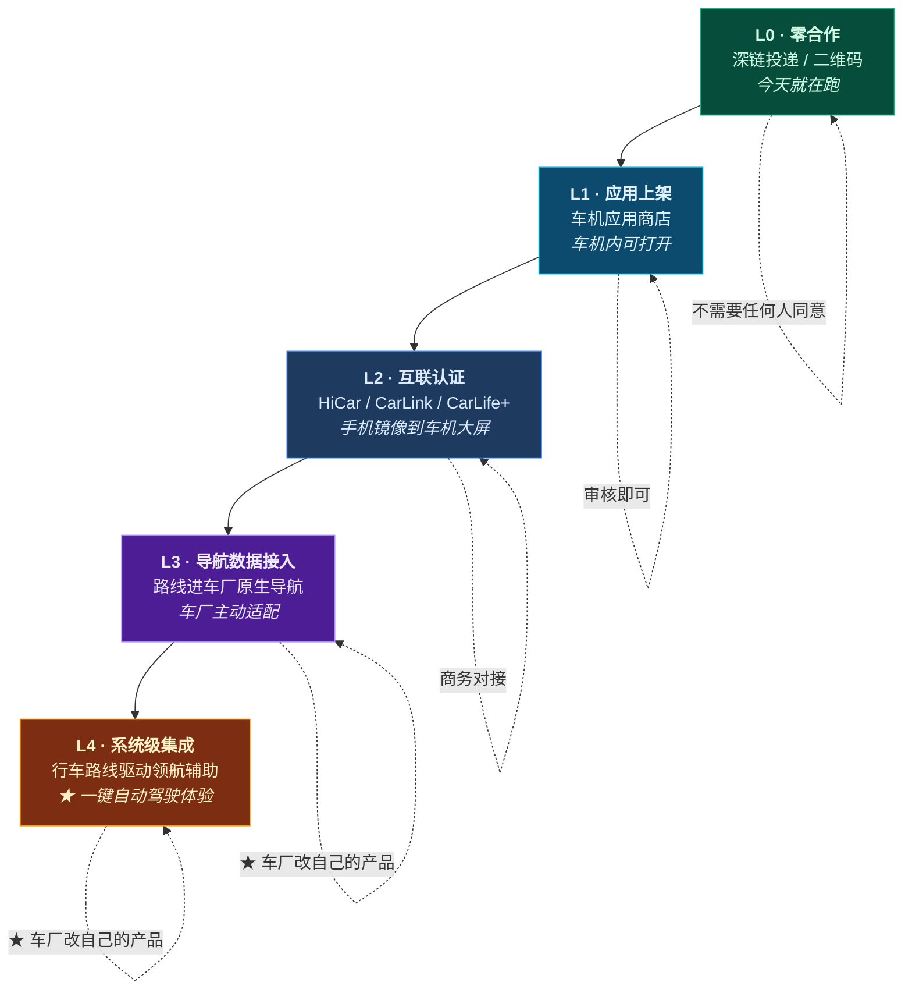
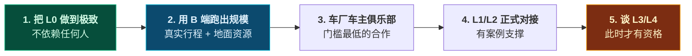

# 第 12 章 · 车厂合作的产品形态与舱内体验设计

> **本章性质**：商业与产品形态设计，**不涉及技术实现**。
> **回答的问题**：和车厂合作到底长什么样？凭什么谈得成？舱内体验怎么设计？
> **与第 2 章的分工**：[第 2 章](02-cockpit-protocol.md) 回答「**今天就能做的那部分怎么送进车**」（技术协议）；本章回答「**和车厂一起能做到什么，以及怎么走到那一步**」（商业与体验）。
> **状态**：`Design Spec`

---

## 12.1 先把一个误读掰正：做不到，才是这门生意的起点

### 12.1.1 一条已经确认的事实

第 2 章核查确认：**没有任何车厂提供第三方导航注入 API。** Web 应用**无法**触发 NOA、无法控制车机多屏、无法读取车辆状态。

### 12.1.2 但它的推论不是"做不了"

很多人听到这条事实的直觉反应是收手。**但这个推论是错的**，因为它把主语搞混了：

| | 主语 | 能不能做到 |
| :--- | :--- | :--- |
| 第 2 章的结论 | **「我们（一个网页）」** | ❌ 做不到 |
| 本章要谈的事 | **「车厂把 TripCraft 集成进去」** | ✅ **车厂有能力做到** |

> 🔑 **同一个功能，换个主体，结论就相反。**
>
> 「行车路线驱动领航辅助」这件事，**第三方做不了，但车厂自己做得了** —— 因为车厂同时拥有导航、车辆控制和 NOA 三者。

### 12.1.3 ★ 这个"做不到"是资产，不是负债

把逻辑反过来推一遍，会得到一个完全不同的结论：

```text
假设：任何一个网页都能触发 NOA
  ↓
那么：车厂没有任何理由与第三方合作
  ↓
那么：TripCraft 的车机价值 = 0
  ↓
结论：任何人都能做的事，不值得做
```

```text
实际：第三方做不到触发 NOA
  ↓
那么：想做成这件事，只有"和车厂一起做"这一条路
  ↓
那么：这条路是排他的、需要商务谈判的、先到先得的
  ↓
结论：★ 排他性 = 护城河
```

> 📌 **所以「与车厂合作」这条线的价值，不在于那个体验有多好，而在于它无法被复制。**
>
> 一个能被任何团队用三个月抄走的体验，做得再好也不是资产。
>
> **这一条与 [铁律 10 代码不是护城河，资产才是](00-overview-and-glossary.md#铁律-10--代码不是护城河资产才是-code-is-not-the-moat)是同一条道理，只不过这里的"资产"是车厂的适配与预装关系。**

### 12.1.4 但也要诚实：这条路很长

> ⚠️ **本章设计的是路径，不是承诺。**
>
> 从今天到"行车路线驱动领航辅助"之间，隔着**商务谈判、车厂排期、车型适配、隐私合规审查**，任何一环都不可控。
>
> **本章的价值在于把这条路拆成可评估的台阶**，让每一步投入都有明确的回报判断，而不是"先做着，等哪天车厂找过来"。
>
> **因为"等车厂找过来"这件事，在历史上从来没有发生过。**

---

## 12.2 ★ 合作阶梯：五级台阶

### 12.2.1 总览



### 12.2.2 五级的详细对照

| | L0 零合作 | L1 应用上架 | L2 互联认证 | L3 导航数据接入 | L4 系统级集成 |
| :--- | :--- | :--- | :--- | :--- | :--- |
| **谁同意** | 不需要 | 车厂应用商店审核 | 联盟/车厂商务 | **车厂产品部门** | **车厂产品 + 法务 + 安全** |
| **能力** | 路线送进手机导航 | 车机内可打开我们的页面 | 手机屏幕镜像到车机 | 路线出现在车厂原生导航里 | **路线驱动领航辅助** |
| **NOA** | ❌ | ❌ | ❌ | ⏸ 取决于车厂设计 | ✅ **由车厂实现** |
| **行驶中可用** | ❌（司机不能用手机） | ❌（车机浏览器行驶中被屏蔽） | ✅ 副驾屏可用 | ✅ | ✅ |
| **我们要投入** | 零 | 适配 + 审核材料 | 适配 + 认证测试 | 数据接口开发 | 深度共建 |
| **周期** | — | 1–3 个月 | 3–9 个月 | 12–24 个月 | 24 个月+ |
| **能否单方面推进** | ✅ | ✅ | ⬜ | ❌ | ❌ |

> 📌 **注意 L0 到 L2 有一个共同点：不需要车厂"改自己的产品"。**
>
> **这是整条阶梯上最重要的一条分界线。**
>
> **只要不要求车厂动自己的东西，事情就快；一旦要求车厂动，就进入以年为单位的排期。**
>
> 所以**前面三级应该独立推进**（它们本身就是完整的产品体验），而**不是当作通向 L4 的过渡阶段**——**如果它们只是过渡，就不会被认真做；而不被认真做，就永远走不到 L4。**

### 12.2.3 ★ L3/L4 的门槛不是技术，是"车厂愿不愿意改自己的产品"

L3 和 L4 的共同点：**都需要车厂在自己的导航/座舱系统里改代码。**

**这在车厂内部是一件极其昂贵的事**：

| 车厂的顾虑 | 说明 |
| :--- | :--- |
| **排期** | 车机软件一次 OTA 的排期提前数月开始，插入一个外部需求要排队 |
| **责任** | 一旦导航出错导致走错路甚至事故，**责任在车厂**——第三方提供的数据，车厂不敢盲信 |
| **数据合规** | 行程数据进车机涉及个人信息与行踪轨迹（见 [§7.4.1](07-legal-and-compliance.md#741--最重要的一点行踪轨迹是敏感个人信息)） |
| **战略** | 车厂正在做自己的内容生态，接一个第三方可能被视为"把入口让出去" |

> 🔴 **理解这四条，才能理解为什么 L3/L4 谈的不是技术，是"你帮我解决什么问题"。**
>
> **下一节就是回答这个问题的。**

---

## 12.3 ★ 车厂凭什么跟你合作

### 12.3.1 这是整章最核心的一节

**如果这一节回答不了，后面所有设计都不成立。**

### 12.3.2 车厂真正缺的是什么

先看车厂不缺什么：**它们不缺导航**（高德/百度/四维图新都在供应）、**不缺地图**、**不缺语音助手**、**不缺算力**。

**它们缺的是这四样：**

| # | 车厂缺的 | 为什么缺 |
| :--- | :--- | :--- |
| **1** | **「用车的理由」** | 智能座舱的军备竞赛已经同质化——你有大屏我也有，你有语音我也有。**车厂能做出更好的车，但做不出"你该开着它去哪"** |
| **2** | **自驾场景的内容深度** | 导航能给"怎么走"，给不了「出城前加满油，之后 180km 无站」（[§10.4.3](10-roadbook-reading-design.md#1043--时间轴上的坑标记)）。**这类内容车厂既没有积累，也没有采集渠道** |
| **3** | **地面资源关系** | 「张掖老字号大包间已锁座」「特窟预约额度」——**这是地接社的关系，不是技术**（[§3.1](03-b2b-agency-operations.md#31-为什么-b2b-才是真正的护城河)） |
| **4** | **真实的长途自驾路线数据** | 车厂有车辆数据，但没有"人在真实自驾中怎么走、在哪停、为什么改道"的数据 |

> 🔑 **第 1 条是入口，第 2、3 条是壁垒。**
>
> **「用车的理由」让车厂愿意听你说话；「内容与关系」让车厂没法自己做掉你。**

### 12.3.3 ★ 对车厂的价值主张（一句话版）

> **「我们不是给你一个导航应用，我们给你一个让车主周末想开车出门的理由。」**

展开成车厂能听懂的三个数字：

| 车厂关心 | 我们的回答 |
| :--- | :--- |
| **车主活跃度** | 自驾出行的高频刚需：一年 3–8 次，每次 3–15 天，**行程期间每天打开 5–15 次** |
| **智驾功能的使用率** | ★ **长途高速是 NOA 使用率最高的场景**。而"要不要跑这趟长途"，取决于**有没有人帮他把这条路安排好** |
| **品牌调性** | 自驾 + 深度内容是**高净值用户**的行为特征，与 NEV 高端车型的目标人群重合 |

> 📌 **第二条值得单独说，因为它是整个提案里最有说服力的一条。**
>
> **车厂花了巨资做 NOA，但 NOA 的实际使用率受限于"车主愿不愿意开长途"。**
>
> **一次 2000 公里的自驾，是 NOA 最好的广告位** —— 车主在高速上连续使用十几小时，**这是任何试驾活动都换不来的体验时长**。
>
> **而车主不跑长途的原因，往往不是不想，是不知道怎么安排。**
>
> **所以 TripCraft 对车厂的真实价值是：把 NOA 的潜在使用时长，变成实际使用时长。** —— 这句话，车厂的产品负责人听得懂，也关心。

### 12.3.4 但有一个必须防的陷阱

> ⚠️ **不要对车厂说「我们帮你提升 NOA 使用率」。**
>
> **因为你无法证明它。** 没有车厂会把使用率数据给你做归因，你也拿不到对照组。
>
> **正确的说法是给场景，不给归因**：
>
> > 「我们覆盖 XX 条成熟自驾线路，其中长途高速占比 XX%。这些线路上的车主，是目前 NOA 使用时长最长的群体。」
>
> **说事实，让车厂自己算。** 一旦你替他算了，他会开始质疑你的算法，而提案就变成了辩论。

---

## 12.4 ★ 舱内体验设计

### 12.4.1 先定一条总原则

> 🔴 **行驶中，不设计任何"需要看的界面"。**

这不是妥协，是**从第 2 章核查中得到的硬约束**：

- 合规车机浏览器**在行驶中整体被屏蔽**（[§2.5.5](02-cockpit-protocol.md#255--车机浏览器一个必须修正的判断)）
- 主驾看屏幕本身就是不安全行为，且**任何鼓励主驾看屏幕的设计都是在制造责任**

**那么行驶中还能做什么？** —— **分发。** 把正确的信息送到正确的人手上：

| 车内位置 | 行驶中能做什么 | 设计形态 |
| :--- | :--- | :--- |
| **主驾** | ❌ 不能看 | ★ **只能听**。语音播报 / 副驾念给他 |
| **副驾** | ✅ 可以看、可以操作 | ★ **行中的主战场** |
| **后排** | ✅ 可以看 | 长辈版 / 孩子版（[§11](11-audience-adaptive-rendering.md)） |
| **HUD** | ✅ 极少量 | ★ **最多一行字** |
| **车机大屏** | ❌ 行驶中被屏蔽 | 驻车时才是它的舞台 |

### 12.4.2 ★ 行驶中的三层信息分发

**同一件事（"前面 60 公里没有加油站，最后一站在 12 公里后"），三种分发形态：**

| 对象 | 形态 | 设计约束 |
| :--- | :--- | :--- |
| **主驾（听）** | 一句话，**由车厂语音助手念** | ≤ 15 字，**不带数字以外的修饰** |
| **副驾（看）** | 手机上一张卡，含决策所需全部信息 | 一屏内，不需滚动 |
| **HUD（瞄）** | **一个图标 + 一个数字** | ⚠️ 见下方约束 |

**主驾那句话的设计**：

```text
✅ 「前方 60 公里无加油站，建议 12 公里后加满。」
❌ 「尊敬的驾驶员您好，根据我们的行程规划，接下来这段路沿途没有加油站哦，
    所以建议您在下一个服务区加油～」
```

> 📌 **≤ 15 字是一条硬约束，因为它是"一句话"而不是"一段话"。**
>
> **超过 15 字，人在开车时听不完整。** 听不完整的提示等于没提示，甚至更糟——**车主会以为自己漏听了什么，从而分心去回想。**

**HUD 的约束**：

> ⚠️ **HUD 上最多放一个图标 + 一个数字。**
>
> HUD 的位置在驾驶员视线正前方，**它抢的是看路的时间**。因此：
> - ❌ 不放文字句子
> - ❌ 不放超过两个信息单元
> - ✅ 只放"现在必须立刻知道的"（例：`⛽ 12` = 12 公里后有加油）
>
> **判断标准：如果这条信息晚 5 分钟知道也不会有任何损失，它就不配上 HUD。**

### 12.4.3 ★ 驻车时才是车机大屏的舞台

车机大屏的优势不是"大"，是**它不在手上**——驻车时它是一块**共享屏**，全车人都看得见。

| 场景 | 设计 |
| :--- | :--- |
| **出发前的早上** | ★ **今日路线全览**：今天去哪、多远、几个点、有什么要留意的 |
| **到达后** | 打卡 + 明日预告 |
| **晚上在酒店停车场** | 领队开一次"明天怎么走"的车内小会 |

> 📌 **「车机大屏 = 早晨出发前的那块屏」是一个被低估的场景定位。**
>
> 全家上车、还没发动、司机在调座椅——**这 3 分钟是全车注意力最集中的时刻，也是唯一一次所有人都在场。**
>
> **手机做不到这件事**（每个人看自己的），**而车机大屏天生就是干这个的。**
>
> 这是车机大屏**不可替代的那个场景**，其他所有场景手机都能做。

### 12.4.4 主驾在驻车时看什么

**主驾在驻车时最需要的是"今天我要开多久、哪里最难开"。**

```text
┌─────────────────────────────────────────────────┐
│  今天 · 敦煌 → 大柴旦                            │
│                                                 │
│  320 km   4.5 h   海拔 ↑1860m                   │
│                                                 │
│  ⚠️ 10:00–11:30 横风路段                        │
│  ⛽ 出发前加满（之后 180 km 无站）                │
│  📵 14:00–15:00 无信号                          │
│                                                 │
│  [ 投到导航 ]                                    │
└─────────────────────────────────────────────────┘
```

> 🔴 **注意这张卡上没有一个景点。**
>
> **主驾在出发前不需要知道玉门关的历史，他需要知道的是"今天哪里会难开"。**
>
> 这与 [§11.2.1 司机视角](11-audience-adaptive-rendering.md#1121-视角总表)是同一条设计，**但载体不同**——手机上是视角图层，车机上是这张卡。
>
> **同一份数据，在两种屏上各说各该说的话。**

---

## 12.5 ★ 车机版的产物形态

### 12.5.1 它不是手机版的缩小或放大

> ⚠️ **最常见的错误是把手机页面搬到车机上。**
>
> 车机的使用条件与手机完全不同，**它需要一份自己形态的产物**：

| | 手机版 | 车机版 |
| :--- | :--- | :--- |
| **谁在看** | 一个人，握在手里 | **全车人，共享一块屏** |
| **什么时候** | 随时 | ★ **只有驻车时** |
| **看多久** | 30 秒 ~ 5 分钟 | **30 秒 ~ 2 分钟** |
| **核心问题** | 「今天去哪、怎么玩」 | ★ **「今天怎么开」** |
| **信息深度** | 五层（[§10.3](10-roadbook-reading-design.md#103--五层信息深度)） | ★ **两层：摘要 + 路线** |
| **输入方式** | 触屏打字 | ★ **几乎不输入**（触屏远、位置偏） |

### 12.5.2 ★ 车机上不展示"攻略"，只展示"决策"

> 🔴 **这是车机版最重要的一条设计规则。**
>
> 因为**在车上读攻略是一件不可能也不该发生的事**——车已经发动了，没有人会在中控屏上读玉门关的历史。
>
> **车机版只回答三类问题：**

| 问题 | 呈现 |
| :--- | :--- |
| **今天去哪？** | 路线全览图 + 沿途节点 |
| **今天有什么坑？** | 加油 / 无信号 / 横风 / 封路 |
| **现在该干嘛？** | 下一步动作（投到导航 / 出发） |

> 📌 **把攻略从车机上拿掉，不是删减功能，是认清这块屏的用途。**
>
> **一块在车里、离人 60 厘米、全车共享、只在驻车时可用的屏幕，它的本分是"决策"，不是"阅读"。**
>
> **想让乘客读攻略，他们有手机；想让主驾知道怎么开，这块屏才对。**

---

## 12.6 合作的商业形态

### 12.6.1 谁付钱给谁

**这是设计中必须回答、且很容易被含糊过去的问题。**

| 形态 | 谁付钱 | 适用阶段 | 说明 |
| :--- | :--- | :--- | :--- |
| **A 车厂采购** | 车厂 → 我们 | L2–L4 | 车厂把内容作为座舱卖点采购 |
| **B 联合品牌** | 双向不付费 | L3–L4 | 双方共同露出，各自的用户互相导流 |
| **C 按车分成** | 双方分用户付费 | L4 | 用户为深度内容付费，车厂分成 |
| **D 免费预装** | 都不付 | L3 | ⚠️ **只应作为短期换取数据的策略** |

> ⚠️ **形态 D 要特别警惕。**
>
> 「免费预装换曝光」听起来划算，但**一旦免费，就再也回不到收费**——而车厂的排期成本并不会因为我们免费而降低。
>
> **如果免费，必须换到明确的东西**：车厂侧的数据接口权限、联合品牌露出、或一个明确期限后的收费条款。**"先免费做着"不是一个策略，是一个陷阱。**

### 12.6.2 ★ 一条被忽略的收入线

**除了向车厂收费，还有一条向"车厂生态里的其他人"收费的线**：

| 对象 | 付费理由 |
| :--- | :--- |
| **车厂的车主俱乐部 / 官方车友会** | 官方车友会常年组织自驾活动，**缺的是路线与内容** |
| **车厂的保险 / 服务合作伙伴** | 自驾相关的救援、保养、保险场景 |
| **充电运营商** | 长途自驾的补能规划是刚需（[§2.6.2](02-cockpit-protocol.md#262-充电站数据)） |

> 📌 **这条线的价值在于：它不需要车厂改产品就能成立。**
>
> **车主俱乐部是车厂内部的独立部门，有自己的预算和 KPI**，决策比车机软件排期快得多。
>
> **这可能是车厂合作里最容易落地的一步** —— 它甚至可能比 L2 更快。

---

## 12.7 谈判路径与筹码

### 12.7.1 从哪家开始

**不是从最大的开始，是从"最需要差异化"的开始。**

| 顺序 | 对象特征 | 理由 |
| :--- | :--- | :--- |
| **1** | **有明确自驾文化、但座舱生态较弱的品牌** | 它比头部更愿意接第三方 |
| **2** | **车主俱乐部活跃的品牌** | 从 §12.6.2 那条线切入，门槛最低 |
| **3** | 头部新势力 | ★ **等到有 1–2 个案例再谈** —— 头部只信同行案例 |

> ⚠️ **不建议从头部开始。**
>
> 头部品牌的采购流程、安全审查、排期都最重，**而我们在没有任何案例的时候，谈判筹码为零。**
>
> **用一个中腰部品牌的成功案例去谈头部，成功率远高于直接谈头部。**

### 12.7.2 筹码清单

**在没有任何车厂关系的时候，我们手上有什么？**

| 筹码 | 强度 | 说明 |
| :--- | :--- | :--- |
| **成熟的自驾线路内容** | 🟢 强 | 数量与深度可量化 |
| **B2B 旅行社的地面资源** | 🟢 强 | ★ **车厂拿不到，也做不出来** |
| **已有的真实用户行程** | 🟡 中 | 需要脱敏与合法授权 |
| **★ B 端规模** | 🟢 强 | 见下 |

> 🔑 **「B 端规模」是这里最被低估的一张牌。**
>
> 如果 TripCraft 已经服务了 200 家旅行社、每年产出 5000 份真实路书，**这对车厂的意义是：这些行程背后是真实的用车需求，且集中在特定车型可能覆盖的场景里。**
>
> **换句话说：先做 B 端，不只是为了 B 端的收入，也是为了给车厂谈判时手里有东西。**
>
> **这条路比"先做一个 C 端爆款 App 再去找车厂"更现实** —— 因为 C 端爆款这件事，本身就是个不可计划的赌注。

### 12.7.3 ★ 推荐的推进顺序



> 📌 **注意这个顺序把「车厂」放在了 B 端之后。**
>
> **不是因为车厂不重要，而是因为 B 端是车厂谈判的弹药。**
>
> **先做车厂、后补 B 端，会发现手里没有车厂想要的东西；先做 B 端、再谈车厂，手里有别人做不出来的东西。**

---

## 12.8 本章设计清单

| # | 设计决策 | 一句话 |
| :--- | :--- | :--- |
| O-01 | **"做不到 NOA"是资产，不是障碍** | 排他性 = 护城河 |
| O-02 | **五级合作阶梯** | 前三级不需车厂改产品，后两级需要 |
| O-03 | **前三级必须独立推进，不当过渡阶段** | 当过过渡就不会被认真做 |
| O-04 | **L3/L4 谈的不是技术，是"你帮我解决什么"** | 排期/责任/合规/战略四道关 |
| O-05 | **车厂缺的是"用车的理由"** | 座舱军备竞赛已同质化 |
| O-06 | **★ 对车厂的价值主张是"把 NOA 的潜在使用时长变成实际使用时长"** | 但只说场景，不替车厂算归因 |
| O-07 | **行驶中不设计任何需要看的界面** | 只做分发 |
| O-08 | **主驾只能听，≤ 15 字** | 听不完整的提示等于没提示 |
| O-09 | **HUD 最多一个图标 + 一个数字** | 晚 5 分钟知道也不损失的，不配上 HUD |
| O-10 | **★ 车机大屏的不可替代场景是"出发前的那 3 分钟"** | 唯一一次全车人都在场 |
| O-11 | **车机上不展示攻略，只展示决策** | 一块共享屏的本分是决策不是阅读 |
| O-12 | **警惕"免费预装换曝光"** | 一旦免费就回不到收费 |
| O-13 | **★ 车主俱乐部是最容易落地的切口** | 独立预算，决策比车机排期快 |
| O-14 | **不从头部车厂开始** | 用一个中腰部案例去谈头部 |
| O-15 | **★ B 端规模是车厂谈判的弹药** | 所以顺序是 B 端在前、车厂在后 |

---

> **相关章节**：[§13 线下旅行社合作设计](13-agency-partnership-design.md) —— 另一条 B 端线，也是本章 §12.7.2 那张牌的同一条主脉。
> **上游依据**：[第 2 章 · 座舱协议](02-cockpit-protocol.md)（技术部分）｜ [第 3 章 §3.1](03-b2b-agency-operations.md#31-为什么-b2b-才是真正的护城河) ｜ [§11 司机视角](11-audience-adaptive-rendering.md#1121-视角总表)
