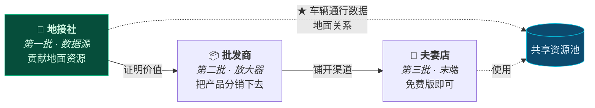
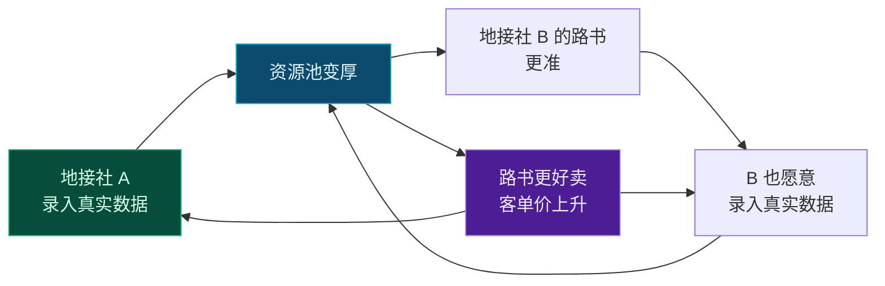

# 第 13 章 · 线下旅行社合作的价值主张与资源数字化设计

> **本章性质**：商业与产品形态设计，**不涉及技术实现**。
> **回答的问题**：线下旅行社凭什么用我们？他们手里的资源怎么变成产品？第一批怎么签下来？
> **与第 3 章的分工**：[第 3 章](03-b2b-agency-operations.md) 回答「**旅行社用起来之后，系统怎么运转**」（权限、白标包、资源字段、结算、人效）；本章回答「**他们凭什么开始用，以及资源如何进来**」（价值主张、分类、获取、冷启动、网络效应）。
> **状态**：`Design Spec`

---

## 13.1 先纠正一个说法：他们有的不是"资源"

### 13.1.1 「资源」这个词掩盖了真正的难点

第 3 章把护城河归为三样资产：**地面通行数据 / 特权资源关系 / 定制师工作流**。这个判断是对的。但**在展开设计之前，必须先把"资源"这个词拆开**——因为拆开之后会发现，其中最难的那一类，**根本不是可以被"收集"的东西**。

| 看起来是 | 实际是 | 能不能被平台收集 |
| :--- | :--- | :--- |
| 「张掖那家老字号的大包间」 | **老板和那家店十年的交情** | ❌ **不能** |
| 「莫高窟特窟的预约额度」 | **旅行社的资质 + 常年的合作关系** | ❌ **不能** |
| 「考斯特能进莫高窟北门」 | **一条可以写下来的事实** | ✅ 能 |
| 「11 月哪个垭口封路」 | **一条可以写下来的事实** | ✅ 能 |
| 「哪家民宿老板肯留房到晚上 10 点」 | ⬜ **半是事实，半是关系** | 🟡 部分 |

> 🔑 **结论很重要：真正稀缺的那部分资产，是"关系"，而关系无法被转移，只能被服务。**
>
> **这决定了整个 B 端设计的第一原则。**

### 13.1.2 ★ 第一原则：让关系更值钱，而不是替代关系

> 🔴 **这是本章最重要的一条，也是所有"平台 + 线下渠道"合作失败的最常见原因。**

**旅行社老板听到"平台"两个字的第一个反应是：**

> 「你是不是想把我架空？把我的客户拿走，把我和那家店的关系变成你和那家店的关系？」

**这个恐惧是合理的**，因为历史上大量平台就是这么干的。

**所以设计上必须做三件反直觉的事：**

| 设计 | 反直觉之处 | 为什么必须 |
| :--- | :--- | :--- |
| **路书上只有旅行社的品牌，没有 TripCraft** | 放弃了品牌曝光 | 见 [§13.3](#133--卖的不是工具是看起来更高端) |
| **游客没有账号，平台不接触终端客户**（[§3.2.2](03-b2b-agency-operations.md#322--关键设计决策游客没有账号)） | 放弃了 C 端数据 | 见 [§13.3.3](#1333-三条不越线) |
| **A 社的关系资源对 B 社不可见** | 放弃了数据共享的规模效应 | 见 [§13.6](#136--网络效应什么该共享什么该私有) |

> 📌 **这三条每一条都让产品"少赚"——但正是这三条，决定了旅行社敢不敢把真实的东西放进来。**
>
> **而如果他不放真实的东西进来，这个产品就只是另一个行程编辑器。**

---

## 13.2 旅行社不是一种生意，是三种

> ⚠️ **第 3 章假设了一个"定制师"角色。但现实中，"旅行社"是三种完全不同的生意**——它们的痛点、决策方式、付费能力都不同。**用同一套话术去打，会在其中两类身上失效。**

### 13.2.1 三类社

| | 🏪 **夫妻店 / 小社** | 🚌 **地接社** | 📦 **批发商 / 组团社** |
| :--- | :--- | :--- | :--- |
| **规模** | 2–8 人 | 10–50 人，自有/长期车队 | 50 人以上 |
| **卖什么** | 拼团、包车、代订 | **地面服务**（车、导、票、房） | 线路产品，分销给同业 |
| **客户** | 本地散客 | **同行**（给组团社做地接） | 下游门店 |
| **握有什么** | 熟人关系、本地口碑 | ★ **车辆、司机、地面关系** | 渠道网络、议价能力 |
| **最痛的** | 客单价上不去，被 OTA 挤 | ★ **有货卖不出价，被组团社压价** | 产品同质化，毛利被压 |
| **谁拍板** | 老板本人 | 老板或运营总监 | 产品部 + 老板 |
| **付得起多少** | 少 | **中** | 多 |

### 13.2.2 ★ 该从哪里开始：地接社

> 🔑 **第一批应该签的是「地接社」，不是夫妻店，也不是批发商。**

| 为什么 | 说明 |
| :--- | :--- |
| **他们手里有真东西** | ★ 车辆通行数据、地面关系全在他们手上（[§3.1](03-b2b-agency-operations.md#31-为什么-b2b-才是真正的护城河)） |
| **他们的痛最锐利** | 「有货卖不出价」是**每天都在发生的痛**，不需要教育 |
| **他们拍板快** | 老板/运营总监一个人能定，不用过产品部 |
| **他们能影响下游** | ★ **一个地接社背后是几十家组团社** —— 这是天然的传播节点 |
| **他们付得起** | 有真实毛利，愿意为提高客单价付费 |

> ⚠️ **反过来看为什么不从另外两类开始：**
>
> - **夫妻店**：痛是痛，但**付不起钱，也没有数据可贡献**。他们是好的"传播末端"，不是好的"第一批"。
> - **批发商**：付得起，但**他们不直接握有地面资源**，签下他们等于签了一个中间层，拿不到最关键的车辆通行数据。

### 13.2.3 三类社在产品里的不同角色



> 📌 **地接社贡献数据 → 资源池变厚 → 批发商和夫妻店用得上 → 池子更厚。**
>
> **这就是 [§3.5.5 众包飞轮](03-b2b-agency-operations.md#355-众包飞轮与激励)的完整形态**——第 3 章只画了车队司机那一环，**这里补上了"谁先来"的问题**。

---

## 13.3 ★ 卖的不是工具，是"看起来更高端"

### 13.3.1 一个必须回答的问题

**地接社老板问你的第一句话不会是"这软件有什么功能"，而是：**

> 「用了这个，我能多赚钱吗？」

**如果答不上来，后面所有功能演示都是浪费。**

### 13.3.2 答案不是"省时间"，是"卖得贵"

第 3 章 §3.9 的论证是**人效**：首稿 4–8 小时 → 20 分钟。

**但人效是一个"防"的价值（省成本），不是一个"攻"的价值（多赚钱）。而老板对"攻"的敏感度远高于"防"。**

> 🔑 **真正打动他们的是另一件事：**

```text
同一辆考斯特，同一个司机，同一条甘青线。

  现在：   微信群报价，Excel 行程，一张手写报价单
           → 卖 6800/人，客户还要砍价

  用 TripCraft 后：
           白标路书，带品牌 logo、带定制师介绍、带真实案例
           每一个节点有出处，有实拍，有踩线记录
           → 卖 8800/人，客户觉得值
```

> 📌 **差价不是软件创造的，是"看起来可信"创造的。**
>
> **而地接社的货本来就好，他们只是没有能力把它展示出来。**
>
> **TripCraft 卖的本质是：把一个小社的真实实力，翻译成客户看得懂的样子。**

### 13.3.3 三条不越线

**要让旅行社敢用，必须主动放弃三样东西：**

| # | 不做什么 | 放弃了什么 | 换来了什么 |
| :--- | :--- | :--- | :--- |
| **1** | 路书上不出现 TripCraft 品牌 | 品牌曝光 | 旅行社敢把路书发给客户 |
| **2** | 不接触终端游客，不做 C 端账号（[§3.2.2](03-b2b-agency-operations.md#322--关键设计决策游客没有账号)） | C 端数据与流量 | 旅行社敢用真实客户资料 |
| **3** | 不做旅行社之间的比价 / 撮合 | 平台抽佣模式 | 旅行社敢放真实报价 |

> 🔴 **第 3 条尤其重要，而且它意味着放弃了一个看起来最赚钱的模式。**
>
> **"撮合"是平台最自然的变现方式**——把 A 社的供给和 B 社的需求匹配起来，抽佣。**但一旦做了这件事，地接社就会发现：你既知道我的成本，又知道谁在买，那你随时可以把我一脚踢开自己做。**
>
> **于是他会开始藏真实价格、藏真实关系——而产品也就废了。**
>
> **所以选择是：要抽佣，还是要真数据。这个项目选真数据。**
>
> 详见 [§3.7.1 平台不经手游客资金](03-b2b-agency-operations.md#371--首要合规约束平台不经手游客资金)。

### 13.3.4 ★ 白标的第二层：定制师个人名片

**第 3 章的 [§3.3 白标品牌包](03-b2b-agency-operations.md#33-白标品牌包)设计的是"社"的品牌。但真正决定客户信任的是"人"。**

**设计：路书末尾附一张定制师页。**

```text
┌─────────────────────────────────────┐
│                                     │
│    [照片]                            │
│                                     │
│    马师傅                            │
│    甘青线 · 第 11 年                  │
│                                     │
│    跑过 340 趟                      │
│    · 最熟的一条：敦煌 → 大柴旦        │
│    · 会修车（车队里唯一一个）          │
│    · 车里常备氧气罐和保温壶            │
│                                     │
│    「有什么问题随时打给我」            │
│    [ 拨号 ]                         │
└─────────────────────────────────────┘
```

> 📌 **这张卡片的每一行，都在干同一件事：把"不可验证的承诺"变成"可验证的事实"。**
>
> | 客户心里想的 | 卡片回答的 |
> | :--- | :--- |
> | 「他熟不熟这条路」 | 跑了 11 年，340 趟 |
> | 「路上出事怎么办」 | 会修车，车上有氧气 |
> | 「会不会收了钱就找不到人」 | 一个可以直接拨的号 |
>
> **而这些东西，旅行社本来就有，只是从来没有人帮他摆成这样。**

---

## 13.4 ★ 资源数字化的获取工作流

> **与 [§3.4](03-b2b-agency-operations.md#34-特权资源的数据抽象)的分工**：那一节定义的是**资源在数据里长什么样**（四种类型、`存做什么不存是什么`、敏感度三级）；**本节回答的是：这些东西怎么进来，以及为什么进得来。**

### 13.4.1 三个阻力，必须先承认

| 阻力 | 真实表现 |
| :--- | :--- |
| **① 录入成本** | 「我一天带三个团，哪有空给你录数据」 |
| **② 保鲜** | 「录了三个月就过期了，还不如不录」 |
| **③ ★ 泄露恐惧** | 「我录进去，隔壁社是不是就看到了」 |

> 🔴 **第 ③ 条是最致命的，也是最常被低估的。**
>
> **如果旅行社相信数据会泄露，他不但不会录，还会故意录假的。** —— 而假数据比没有数据更糟，因为它会污染整个资源池。

### 13.4.2 ★ 设计原则：先录"已经写过的"，不要求新写

> **这是一条会决定成败的原则。**
>
> **定制师手上已经有一堆东西了**：给客户做过的 Word 行程、Excel 报价单、微信里发过的图文、自己手机里拍的踩线照片。
>
> **正确做法不是"请你录入资源库"，而是"把你已经做过的东西倒进来，我帮你整理"。**

| 方式 | 成本 | 适合谁 |
| :--- | :--- | :--- |
| **导入已有行程**（Word / Excel / 微信图文） | ★ **低** | 所有社 — **这是主路径** |
| **从已有路书里自动抽取** | ★ **零** | 用 TripCraft 生成过的行程 — 越用越自动 |
| **语音补录**（司机口述，转成条目） | 低 | 车队司机 — 他们开车时本来就在聊这些 |
| **表单录入** | 高 | ⚠️ **只应作为兜底，不应作为主路径** |

> 📌 **「从已有路书里自动抽取」是真正的飞轮：**
>
> **旅行社每生成一份路书，系统就多知道一点这条线的真实情况。**
>
> **他不需要为"贡献数据"做任何额外的事——他只是在正常干活，数据就沉淀下来了。**
>
> **这是唯一一种能规模化运转的资源采集方式。**

### 13.4.3 保鲜：不是"更新"，是"确认"

**让定制师主动更新数据是不现实的。正确设计是让他"顺手确认一下"。**

| 时机 | 设计 |
| :--- | :--- |
| 生成新路书时 | 「你上次跑这条线是 8 个月前，这几个地方变了吗？」（**一次只问 1–2 条**） |
| 行程结束后 | 「这趟有什么和计划不一样的？」（★ **这时候记忆最新鲜**） |
| ★ 别人跑同一条线后 | 「XX 社刚跑完这条线，说这个加油站关了，你上次也走过——确认吗？」 |

> ⚠️ **注意第三个：「别人说…你确认吗？」**
>
> **它不是让定制师贡献数据，而是让他纠正一条已经存在的数据。** "否定"比"新建"的心理成本低得多——**因为纠正不暴露他知道什么，只暴露他同意什么。**
>
> **这与 [§3.5.3 置信度四级语义](03-b2b-agency-operations.md#353-置信度四级语义)是配套的：每一次确认都是一次置信度提升。**

### 13.4.4 防泄露：让"不录"比"录假的"更划算

**不能只靠承诺，要靠设计。**

| 机制 | 作用 |
| :--- | :--- |
| **A 社的资源默认对 B 社不可见**（[§13.6](#136--网络效应什么该共享什么该私有)） | 从根上消除泄露动机 |
| **关系型资源加密存储，平台也无法明文查看** | ★ 技术上的"我保证不看"比口头承诺可信 |
| **★ 数据贡献值与权益挂钩** | 见下 |

> 🔑 **最重要的一条：让"真实录入"这件事本身有回报。**
>
> **当地接社发现，录入真实数据能让自己的路书更准、更容易卖上价，同时别人看不到自己的关系——他就没有理由录假的。**
>
> **防作弊的终极手段不是检测假数据，是让真数据比假数据更划算。**
>
> 这与 [§3.5.6 反作弊条款](03-b2b-agency-operations.md#356--反作弊与-ai-禁用条款)是两条腿：**那条是惩罚，这条是激励。**

---

## 13.5 ★ 冷启动：第一批怎么签

### 13.5.1 不要路演，要单点突破

> ⚠️ **"去旅游展会上摆个展台"是最没效率的做法。**
>
> **原因：展会上的社都在比较功能，而功能是最容易被说"我们有类似的"的东西。**
>
> **而地接社的决策从来不是比较功能做出来的，是"隔壁老王家用了，效果不错"。**

### 13.5.2 一个可复制的突破脚本

| 步 | 动作 | 关键 |
| :--- | :--- | :--- |
| **1** | **挑一条线，不挑一家社** | 例：甘青大环线。先把这条线的资源做厚 |
| **2** | **免费给 1 家做一份路书** | ⚠️ **不要给"最好的"，要给"最会用微信做营销的"** |
| **3** | **让这家社拿去卖** | 他的客户反馈就是最好的证明 |
| **4** | **★ 拿这家社的案例去找第二家** | 「老王家用这个，同样的线路多卖 1500，你要不要试试」 |
| **5** | **同一条线做透，再开第二条线** | 资源池要先厚再广 |

> 📌 **第 2 步的选人标准值得单独说。**
>
> **不要挑规模最大的社**——他们过得还行，没有改变的动力，而且流程复杂、决策慢。
>
> **要挑"最会用微信做营销、但规模和品牌还撑不起他的野心"的那一家。** 这种人：
> - 有动力（他想卖得更贵，但缺东西支撑）
> - 有能力（他懂怎么把东西发给客户）
> - **且他会主动替你传播**（他本来就在做营销）

### 13.5.3 ★ 异议处理清单

**这些是地接社老板一定会问的问题。预先想清楚，否则第一次见面就会被问住。**

| 他说 | 背后真正的担心 | 该怎么答 |
| :--- | :--- | :--- |
| 「我们已经用 Word 用得好好的」 | 换工具的成本 | ❌ 不要讲功能。讲：**「你现在的 Word 卖 6800，用这个能卖 8800」** |
| 「客户信息放你这儿安全吗」 | ★ **怕被抢客户** | 「你的客户只有你能看到，我们连账号都不给他们开。而且平台不做 C 端。」 |
| 「多少钱」 | 怕被套牢 | 先给免费版；付费点放在**白标和多车协同**上，**不做"按人头"收费** |
| 「我员工学不会」 | 怕推不动 | ★ 「不用学，**你给我们一份现有行程，我们做好发给你**」——**首份由我们代做** |
| 「你能保证不抢我客户吗」 | ★ **核心恐惧** | 「不能只靠保证。**合同里写死，而且路书上连我们的名字都不出现。**」 |
| 「同行会不会看到我的资源」 | 泄露 | 「你的关系资源**默认对所有人不可见**，包括同行。」 |

> 🔴 **注意「不能只靠保证」这句。**
>
> **面对"你会不会抢我客户"这个问题，任何口头承诺都没有说服力**——因为对方听过太多次了。
>
> **唯一有效的是给出一个"你就算想抢也抢不到"的结构性设计**（§13.3.3 三条不越线）。
>
> **这也解释了为什么那三条不越线必须是真的不越线**——**它们不是善意，它们是谈判工具。**

---

## 13.6 ★ 网络效应：什么该共享，什么该私有

### 13.6.1 这是整个 B 端设计里最难的一道题

**问题**：网络效应要求数据共享（越多社用越准），**但数据共享又会触发泄露恐惧**。两者直接冲突。

**解法不是折中，是分层。**

### 13.6.2 三层数据

| 层 | 内容 | 可见性 | 例 |
| :--- | :--- | :--- | :--- |
| **🟢 公有层** | 与环境/道路有关的客观事实 | **全员可见，全员可贡献** | 加油站在哪、哪段没信号、11 月哪个垭口封路 |
| **🟡 信号层** | 去标识化的行为信号 | **可见，但看不到是谁** | 「近 90 天有 12 个团走过这条路」 |
| **🔴 私有层** | 关系与商业信息 | ★ **只有本社可见，平台也不做聚合** | 包间关系、报价、客户名单、合作民宿 |

> 🔑 **分层的依据不是"敏感度"，是"它是不是关系"。**
>
> **凡是"谁都可以去验证的事实"，放公有层；凡是"只有通过关系才能拿到的东西"，放私有层。**
>
> 因为前者共享不会伤害任何人，**而后者一旦共享，就等于把某个人十年积累的东西变成了公共品。**

### 13.6.3 ★ 「信号层」是这里最巧妙的一层

**它解决了一个尴尬问题：有些数据既敏感又很有价值。**

例：某条小众路线的路况，只有 3 家社走过。

| 做法 | 结果 |
| :--- | :--- |
| 全公开 | ❌ 那 3 家社觉得被白嫖 |
| 全私有 | ❌ 其他社不知道这条路能走 |
| ★ **信号层：只公开"有多少人走过"** | ✅ 其他社知道这条路**有人验证过**，但那 3 家社的关系仍然私有 |

> 📌 **「有 12 个团走过」这个信息本身，就已经足够让别人判断"这条路是通的"了。**
>
> **而它没有泄露任何一家的具体做法。**
>
> **信号层让"我知道有人做到过"，与"我知道他是怎么做到的"分开。** 这个区分是网络效应与商业机密能共存的关键。

### 13.6.4 飞轮



---

## 13.7 与 C 端的关系

### 13.7.1 不是"B2B2C 导流"

> ⚠️ **「B2B2C」这个词在这个项目里是有害的**，因为它暗示"我们通过 B 触及 C，然后把 C 变成我们的用户"。
>
> **而那正是 §13.3.3 第 2 条明令放弃的事。**

### 13.7.2 真正的三角关系

| 谁 | 从 B 端得到什么 | 不做什么 |
| :--- | :--- | :--- |
| **TripCraft** | ★ **真实的行程数据、地面资源、车厂谈判的规模** | 不接触 B 的终端客户 |
| **C 端免费用户** | ★ **资源池带来的更准的路书** | 不抢 B 的客户 |
| **车厂** | ★ **有真实行程支撑的场景证明**（[§12.7.2](12-oem-partnership-design.md#1272-筹码清单)） | — |

> 🔑 **一句话：B 端不给我们**客户**，给我们**弹药**。**
>
> **弹药是：真实的行程、真实的资源、真实的规模。** 这三样东西让 C 端产品更准，也让车厂谈判有牌可打。
>
> **而这一切的前提，恰恰是我们不去碰 B 的客户。**

---

## 13.8 本章设计清单

| # | 设计决策 | 一句话 |
| :--- | :--- | :--- |
| G-01 | **★ 他们有的不是资源，是关系** | 关系无法转移，只能被服务 |
| G-02 | **★ 第一原则：让关系更值钱，不是替代关系** | 所有"平台+渠道"合作失败的头号原因 |
| G-03 | **旅行社分三类，不能一套话术打** | 夫妻店 / 地接社 / 批发商 |
| G-04 | **★ 第一批签地接社** | 有真东西、痛最锐、拍板快、能影响下游 |
| G-05 | **卖的不是省时间，是卖得贵** | 人效是"防"，涨价是"攻" |
| G-06 | **★ 三条不越线：不露品牌 / 不碰客户 / 不做撮合** | 这不是善意，是谈判工具 |
| G-07 | **白标要做两层：社的品牌 + 定制师个人的名片** | 决定信任的是"人" |
| G-08 | **★ 先录"已经写过的"，不要求新写** | 主路径是导入现有行程 |
| G-09 | **★ 从已有路书自动抽取是唯一可规模化的采集方式** | 他正常干活，数据就沉淀了 |
| G-10 | **保鲜靠"顺手确认"，不靠"主动更新"** | 「别人说…你确认吗」比「请你更新」有效得多 |
| G-11 | **★ 让真数据比假数据更划算** | 防作弊的终极手段是激励，不是检测 |
| G-12 | **冷启动不路演，单点突破** | 挑一条线，做透，再开下一条 |
| G-13 | **不要挑最大的社，挑"最会做营销但撑不起野心"的** | 他有动力、有能力、还会主动传播 |
| G-14 | **异议处理的关键是结构性设计，不是口头承诺** | 「你就算想抢也抢不到」 |
| G-15 | **★ 数据分三层：公有 / 信号 / 私有** | 依据是"是不是关系"，不是"敏不敏感" |
| G-16 | **★ 信号层让"有人做到过"与"他怎么做到的"分开** | 网络效应与商业机密共存的关键 |
| G-17 | **B 端不给我们客户，给我们弹药** | 弹药 = 真实行程 + 地面资源 + 规模 |

---

> **相关章节**：[§12 车厂合作设计](12-oem-partnership-design.md) —— 另一条 B 端线，本章 §13.7 的"弹药"正是它的 §12.7.2 筹码。
> **上游依据**：[第 3 章 · B2B 运营赋能](03-b2b-agency-operations.md)（运营部分）｜ [第 11 章 · 人群画像](11-audience-adaptive-rendering.md) ｜ [§10.7 数据来源与置信度](10-roadbook-reading-design.md#107-数据的来源与置信度)
