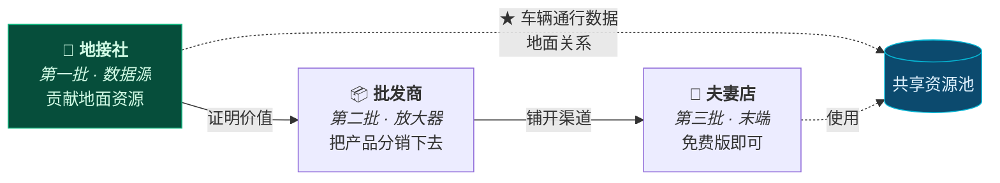
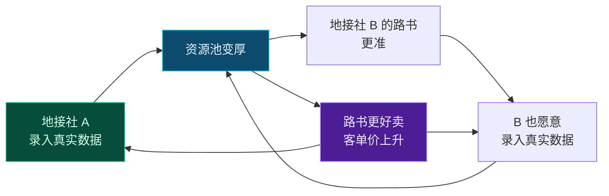

# 第 13 章 · 线下旅行社合作的价值主张与资源数字化设计

> **本章性质**：商业与产品形态设计，**不涉及技术实现**。
> **回答的问题**：线下旅行社凭什么用我们？他们手里的资源怎么变成产品？第一批怎么签下来？
> **与第 3 章的分工**：[第 3 章](03-b2b-agency-operations.md) 回答「**旅行社用起来之后，系统怎么运转**」（权限、白标包、资源字段、结算、人效）；本章回答「**他们凭什么开始用，以及资源如何进来**」（价值主张、分类、获取、冷启动、网络效应）。
> **本章含三节外部事实核查新增内容**（2026-10-07）：[§13.5.4 资质红线](#1354--一个必须先回答的问题他有资质吗)、[§13.8 市场与竞争格局](#138--市场与竞争格局为什么这件事还没被做掉)、[§13.9 定价](#139--定价锚在客单价上不锚在软件成本上)。
> **状态**：`Design Spec`

---

## 13.1 先纠正一个说法：他们有的不是"资源"

### 13.1.1 「资源」这个词掩盖了真正的难点

第 3 章把护城河归为三样资产：**地面通行数据 / 特权资源关系 / 定制师工作流**。这个判断是对的。但**在展开设计之前，必须先把"资源"这个词拆开**——因为拆开之后会发现，其中最难的那一类，**根本不是可以被"收集"的东西**。

| 看起来是 | 实际是 | 能不能被平台收集 |
| :--- | :--- | :--- |
| 「张掖那家老字号的大包间」 | **老板和那家店十年的交情** | ❌ **不能** |
| 「莫高窟特窟的预约额度」 | **旅行社的资质 + 常年的合作关系** | ❌ **不能** |
| 「考斯特能进莫高窟北门」 | **一条可以写下来的事实** | ✅ 能 |
| 「11 月哪个垭口封路」 | **一条可以写下来的事实** | ✅ 能 |
| 「哪家民宿老板肯留房到晚上 10 点」 | ⬜ **半是事实，半是关系** | 🟡 部分 |

> 🔑 **结论很重要：真正稀缺的那部分资产，是"关系"，而关系无法被转移，只能被服务。**
>
> **这决定了整个 B 端设计的第一原则。**

### 13.1.2 ★ 第一原则：让关系更值钱，而不是替代关系

> 🔴 **这是本章最重要的一条，也是所有"平台 + 线下渠道"合作失败的最常见原因。**

**旅行社老板听到"平台"两个字的第一个反应是：**

> 「你是不是想把我架空？把我的客户拿走，把我和那家店的关系变成你和那家店的关系？」

**这个恐惧是合理的**，因为历史上大量平台就是这么干的。

**所以设计上必须做三件反直觉的事：**

| 设计 | 反直觉之处 | 为什么必须 |
| :--- | :--- | :--- |
| **路书上只有旅行社的品牌，没有 TripCraft** | 放弃了品牌曝光 | 见 [§13.3](#133--卖的不是工具是看起来更高端) |
| **游客没有账号，平台不接触终端客户**（[§3.2.2](03-b2b-agency-operations.md#322--关键设计决策游客没有账号)） | 放弃了 C 端数据 | 见 [§13.3.3](#1333-三条不越线) |
| **A 社的关系资源对 B 社不可见** | 放弃了数据共享的规模效应 | 见 [§13.6](#136--网络效应什么该共享什么该私有) |

> 📌 **这三条每一条都让产品"少赚"——但正是这三条，决定了旅行社敢不敢把真实的东西放进来。**
>
> **而如果他不放真实的东西进来，这个产品就只是另一个行程编辑器。**

---

## 13.2 旅行社不是一种生意，是三种

> ⚠️ **第 3 章假设了一个"定制师"角色。但现实中，"旅行社"是三种完全不同的生意**——它们的痛点、决策方式、付费能力都不同。**用同一套话术去打，会在其中两类身上失效。**

### 13.2.1 三类社

| | 🏪 **夫妻店 / 小社** | 🚌 **地接社** | 📦 **批发商 / 组团社** |
| :--- | :--- | :--- | :--- |
| **规模** | 2–8 人 | 10–50 人，自有/长期车队 | 50 人以上 |
| **卖什么** | 拼团、包车、代订 | **地面服务**（车、导、票、房） | 线路产品，分销给同业 |
| **客户** | 本地散客 | **同行**（给组团社做地接） | 下游门店 |
| **握有什么** | 熟人关系、本地口碑 | ★ **车辆、司机、地面关系** | 渠道网络、议价能力 |
| **最痛的** | 客单价上不去，被 OTA 挤 | ★ **有货卖不出价，被组团社压价** | 产品同质化，毛利被压 |
| **谁拍板** | 老板本人 | 老板或运营总监 | 产品部 + 老板 |
| **付得起多少** | 少 | **中** | 多 |

### 13.2.2 ★ 该从哪里开始：地接社

> 🔑 **第一批应该签的是「地接社」，不是夫妻店，也不是批发商。**

| 为什么 | 说明 |
| :--- | :--- |
| **他们手里有真东西** | ★ 车辆通行数据、地面关系全在他们手上（[§3.1](03-b2b-agency-operations.md#31-为什么-b2b-才是真正的护城河)） |
| **他们的痛最锐利** | 「有货卖不出价」是**每天都在发生的痛**，不需要教育 |
| **他们拍板快** | 老板/运营总监一个人能定，不用过产品部 |
| **他们能影响下游** | ★ **一个地接社背后是几十家组团社** —— 这是天然的传播节点 |
| **他们付得起** | 有真实毛利，愿意为提高客单价付费 |

> ⚠️ **反过来看为什么不从另外两类开始：**
>
> - **夫妻店**：痛是痛，但**付不起钱，也没有数据可贡献**。他们是好的"传播末端"，不是好的"第一批"。
> - **批发商**：付得起，但**他们不直接握有地面资源**，签下他们等于签了一个中间层，拿不到最关键的车辆通行数据。

### 13.2.3 三类社在产品里的不同角色



> 📌 **地接社贡献数据 → 资源池变厚 → 批发商和夫妻店用得上 → 池子更厚。**
>
> **这就是 [§3.5.5 众包飞轮](03-b2b-agency-operations.md#355-众包飞轮与激励)的完整形态**——第 3 章只画了车队司机那一环，**这里补上了"谁先来"的问题**。

### 13.2.4 ★ 增长最快的那一群，不在上面这个分类里

> ⚠️ **§13.2.1 那张表有一个隐含前提：它分类的对象是"有旅行社资质的机构"。**
>
> **但过去三年增长最快的供给侧，恰恰是一批没有"社"这个壳的人。**

| | 🎨 **独立定制工作室** | 🚐 **车队队长 / 车主** | 📱 **内容型领队** |
| :--- | :--- | :--- | :--- |
| **典型规模** | 1–3 人 | 1 台车 + 1–2 个司机 | 1 人 + 流量 |
| **怎么来客** | 熟人转介、挂靠平台 | 旅行社、地接社派单 | ★ **自己就是渠道** |
| **手里有什么** | 审美、服务能力、回头客 | ★ **车 + 司机 + 路况直觉** | ★ **流量 + 信任 + 内容能力** |
| **缺什么** | 产能、品牌 | 客源、展示能力 | 资质、地面履约能力、售后 |
| **最痛的** | 一个人干到头，旺季接不过来 | ★ **有车没活，被压价** | ★ **内容能爆，但一爆就接不住** |
| **有没有资质** | 🟡 挂靠或纯线上 | 🟡 通常没有 | 🔴 **多数没有** |

> 🔑 **这三类人和 §13.2.1 的三类社，价值完全不同：**
>
> | | 三类社 | 三类小 B |
> | :--- | :--- | :--- |
> | **带来什么** | ★ **地面资源与真实数据** | ★ **内容分发能力与增量客源** |
> | **缺什么** | 展示能力 | 履约能力与资质 |
> | **谁该先签** | ★ **先签** | ⚠️ **后签，且必须先解决 §13.5.4** |
>
> **一句话：社给你"货"，小 B 给你"声量"。而 TripCraft 两样都缺，所以两样都要——但顺序不能颠倒。**

> ⚠️ **为什么"内容型领队"要单独拿出来、并且必须后签：**
>
> 因为**他们是唯一会主动带来新客的一群**，也正因为如此，**他们是合规风险最高的一群**——他们的经营模式（在社交平台上招徕、收费、带团）**在现行法规下很可能已经构成无证经营**。
>
> **这不是一条可以"先做起来再说"的线。详见 [§13.5.4](#1354--一个必须先回答的问题他有资质吗)。**

---

## 13.3 ★ 卖的不是工具，是"看起来更高端"

### 13.3.1 一个必须回答的问题

**地接社老板问你的第一句话不会是"这软件有什么功能"，而是：**

> 「用了这个，我能多赚钱吗？」

**如果答不上来，后面所有功能演示都是浪费。**

### 13.3.2 答案不是"省时间"，是"卖得贵"

第 3 章 §3.9 的论证是**人效**：首稿 4–8 小时 → 20 分钟。

**但人效是一个"防"的价值（省成本），不是一个"攻"的价值（多赚钱）。而老板对"攻"的敏感度远高于"防"。**

> 🔑 **真正打动他们的是另一件事：**

```text
同一辆考斯特，同一个司机，同一条甘青线。

  现在：   微信群报价，Excel 行程，一张手写报价单
           → 卖 6800/人，客户还要砍价

  用 TripCraft 后：
           白标路书，带品牌 logo、带定制师介绍、带真实案例
           每一个节点有出处，有实拍，有踩线记录
           → 卖 8800/人，客户觉得值
```

> 📌 **差价不是软件创造的，是"看起来可信"创造的。**
>
> **而地接社的货本来就好，他们只是没有能力把它展示出来。**
>
> **TripCraft 卖的本质是：把一个小社的真实实力，翻译成客户看得懂的样子。**

### 13.3.3 三条不越线

**要让旅行社敢用，必须主动放弃三样东西：**

| # | 不做什么 | 放弃了什么 | 换来了什么 |
| :--- | :--- | :--- | :--- |
| **1** | 路书上不出现 TripCraft 品牌 | 品牌曝光 | 旅行社敢把路书发给客户 |
| **2** | 不接触终端游客，不做 C 端账号（[§3.2.2](03-b2b-agency-operations.md#322--关键设计决策游客没有账号)） | C 端数据与流量 | 旅行社敢用真实客户资料 |
| **3** | 不做旅行社之间的比价 / 撮合 | 平台抽佣模式 | 旅行社敢放真实报价 |

> 🔴 **第 3 条尤其重要，而且它意味着放弃了一个看起来最赚钱的模式。**
>
> **"撮合"是平台最自然的变现方式**——把 A 社的供给和 B 社的需求匹配起来，抽佣。**但一旦做了这件事，地接社就会发现：你既知道我的成本，又知道谁在买，那你随时可以把我一脚踢开自己做。**
>
> **于是他会开始藏真实价格、藏真实关系——而产品也就废了。**
>
> **所以选择是：要抽佣，还是要真数据。这个项目选真数据。**
>
> 详见 [§3.7.1 平台不经手游客资金](03-b2b-agency-operations.md#371--首要合规约束平台不经手游客资金)。

### 13.3.4 ★ 白标的第二层：定制师个人名片

**第 3 章的 [§3.3 白标品牌包](03-b2b-agency-operations.md#33-白标品牌包)设计的是"社"的品牌。但真正决定客户信任的是"人"。**

**设计：路书末尾附一张定制师页。**

```text
┌─────────────────────────────────────┐
│                                     │
│    [照片]                            │
│                                     │
│    马师傅                            │
│    甘青线 · 第 11 年                  │
│                                     │
│    跑过 340 趟                      │
│    · 最熟的一条：敦煌 → 大柴旦        │
│    · 会修车（车队里唯一一个）          │
│    · 车里常备氧气罐和保温壶            │
│                                     │
│    「有什么问题随时打给我」            │
│    [ 拨号 ]                         │
└─────────────────────────────────────┘
```

> 📌 **这张卡片的每一行，都在干同一件事：把"不可验证的承诺"变成"可验证的事实"。**
>
> | 客户心里想的 | 卡片回答的 |
> | :--- | :--- |
> | 「他熟不熟这条路」 | 跑了 11 年，340 趟 |
> | 「路上出事怎么办」 | 会修车，车上有氧气 |
> | 「会不会收了钱就找不到人」 | 一个可以直接拨的号 |
>
> **而这些东西，旅行社本来就有，只是从来没有人帮他摆成这样。**

### 13.3.5 ★ 掏钱的人和使用的人，不是同一个人

> ⚠️ **这一节纠正一个很容易犯的错：把"旅行社"当成一个单一角色去谈。**

**一个地接社里，对着 TripCraft 的实际上是三个人，他们的诉求互不相同：**

| 角色 | 他问的问题 | 他关心什么 | 他什么时候会反对 |
| :--- | :--- | :--- | :--- |
| 🧑💼 **老板**（买单人） | ★ 「这能让我多赚钱吗」 | 客单价、毛利、同行有没有在用 | 觉得贵、觉得没面子、怕被架空 |
| ✍️ **定制师 / 计调**（使用者） | ★ 「我今晚能不能搞完」 | 手速、少返工、别让我学新东西 | ★ **觉得这东西会取代他** |
| 🚐 **司机 / 领队**（不在办公室里） | 「上面写的东西是真的吗」 | 路况、泊位、加油、别把我坑了 | 觉得"办公室的人又在瞎写" |

> 🔑 **三个结论，每一个都会改变动作：**

| # | 结论 | 对应动作 |
| :--- | :--- | :--- |
| **1** | **演示要对着定制师做，报价要对着老板谈** | 对错人，两个都会输——对老板讲手速他不关心，对定制师讲客单价他没权限 |
| **2** | ★ **必须给定制师一个"这东西让我更值钱"的位置** | §13.3.4 的定制师名片就是干这个的。**如果定制师觉得产品是要取代他，他会成为最强的阻力**，因为他掌握全部真实数据 |
| **3** | ★ **司机是"真伪的仲裁者"，不是外人** | 路书写得对不对，是司机第一个知道。**不把司机当用户的 B 端产品，数据一定会假**（§13.4.4） |

> 📌 **所以"旅行社也是这个软件的用户"这句话要再精确一点：**
>
> **不是"旅行社"是用户，是"一间社里的三个具体的人"分别是用户。**
>
> **而这三个人的共同点只有一个：他们都不希望自己在客户面前显得不专业。**
>
> **这就是产品要解决的那一件唯一的事。**

---

## 13.4 ★ 资源数字化的获取工作流

> **与 [§3.4](03-b2b-agency-operations.md#34-特权资源的数据抽象)的分工**：那一节定义的是**资源在数据里长什么样**（四种类型、`存做什么不存是什么`、敏感度三级）；**本节回答的是：这些东西怎么进来，以及为什么进得来。**

### 13.4.1 三个阻力，必须先承认

| 阻力 | 真实表现 |
| :--- | :--- |
| **① 录入成本** | 「我一天带三个团，哪有空给你录数据」 |
| **② 保鲜** | 「录了三个月就过期了，还不如不录」 |
| **③ ★ 泄露恐惧** | 「我录进去，隔壁社是不是就看到了」 |

> 🔴 **第 ③ 条是最致命的，也是最常被低估的。**
>
> **如果旅行社相信数据会泄露，他不但不会录，还会故意录假的。** —— 而假数据比没有数据更糟，因为它会污染整个资源池。

### 13.4.2 ★ 设计原则：先录"已经写过的"，不要求新写

> **这是一条会决定成败的原则。**
>
> **定制师手上已经有一堆东西了**：给客户做过的 Word 行程、Excel 报价单、微信里发过的图文、自己手机里拍的踩线照片。
>
> **正确做法不是"请你录入资源库"，而是"把你已经做过的东西倒进来，我帮你整理"。**

| 方式 | 成本 | 适合谁 |
| :--- | :--- | :--- |
| **导入已有行程**（Word / Excel / 微信图文） | ★ **低** | 所有社 — **这是主路径** |
| **从已有路书里自动抽取** | ★ **零** | 用 TripCraft 生成过的行程 — 越用越自动 |
| **语音补录**（司机口述，转成条目） | 低 | 车队司机 — 他们开车时本来就在聊这些 |
| **表单录入** | 高 | ⚠️ **只应作为兜底，不应作为主路径** |

> 📌 **「从已有路书里自动抽取」是真正的飞轮：**
>
> **旅行社每生成一份路书，系统就多知道一点这条线的真实情况。**
>
> **他不需要为"贡献数据"做任何额外的事——他只是在正常干活，数据就沉淀下来了。**
>
> **这是唯一一种能规模化运转的资源采集方式。**

### 13.4.3 保鲜：不是"更新"，是"确认"

**让定制师主动更新数据是不现实的。正确设计是让他"顺手确认一下"。**

| 时机 | 设计 |
| :--- | :--- |
| 生成新路书时 | 「你上次跑这条线是 8 个月前，这几个地方变了吗？」（**一次只问 1–2 条**） |
| 行程结束后 | 「这趟有什么和计划不一样的？」（★ **这时候记忆最新鲜**） |
| ★ 别人跑同一条线后 | 「XX 社刚跑完这条线，说这个加油站关了，你上次也走过——确认吗？」 |

> ⚠️ **注意第三个：「别人说…你确认吗？」**
>
> **它不是让定制师贡献数据，而是让他纠正一条已经存在的数据。** "否定"比"新建"的心理成本低得多——**因为纠正不暴露他知道什么，只暴露他同意什么。**
>
> **这与 [§3.5.3 置信度四级语义](03-b2b-agency-operations.md#353-置信度四级语义)是配套的：每一次确认都是一次置信度提升。**

### 13.4.4 防泄露：让"不录"比"录假的"更划算

**不能只靠承诺，要靠设计。**

| 机制 | 作用 |
| :--- | :--- |
| **A 社的资源默认对 B 社不可见**（[§13.6](#136--网络效应什么该共享什么该私有)） | 从根上消除泄露动机 |
| **关系型资源加密存储，平台也无法明文查看** | ★ 技术上的"我保证不看"比口头承诺可信 |
| **★ 数据贡献值与权益挂钩** | 见下 |

> 🔑 **最重要的一条：让"真实录入"这件事本身有回报。**
>
> **当地接社发现，录入真实数据能让自己的路书更准、更容易卖上价，同时别人看不到自己的关系——他就没有理由录假的。**
>
> **防作弊的终极手段不是检测假数据，是让真数据比假数据更划算。**
>
> 这与 [§3.5.6 反作弊条款](03-b2b-agency-operations.md#356--反作弊与-ai-禁用条款)是两条腿：**那条是惩罚，这条是激励。**

---

## 13.5 ★ 冷启动：第一批怎么签

### 13.5.1 不要路演，要单点突破

> ⚠️ **"去旅游展会上摆个展台"是最没效率的做法。**
>
> **原因：展会上的社都在比较功能，而功能是最容易被说"我们有类似的"的东西。**
>
> **而地接社的决策从来不是比较功能做出来的，是"隔壁老王家用了，效果不错"。**

### 13.5.2 一个可复制的突破脚本

| 步 | 动作 | 关键 |
| :--- | :--- | :--- |
| **1** | **挑一条线，不挑一家社** | 例：甘青大环线。先把这条线的资源做厚 |
| **2** | **免费给 1 家做一份路书** | ⚠️ **不要给"最好的"，要给"最会用微信做营销的"** |
| **3** | **让这家社拿去卖** | 他的客户反馈就是最好的证明 |
| **4** | **★ 拿这家社的案例去找第二家** | 「老王家用这个，同样的线路多卖 1500，你要不要试试」 |
| **5** | **同一条线做透，再开第二条线** | 资源池要先厚再广 |

> 📌 **第 2 步的选人标准值得单独说。**
>
> **不要挑规模最大的社**——他们过得还行，没有改变的动力，而且流程复杂、决策慢。
>
> **要挑"最会用微信做营销、但规模和品牌还撑不起他的野心"的那一家。** 这种人：
> - 有动力（他想卖得更贵，但缺东西支撑）
> - 有能力（他懂怎么把东西发给客户）
> - **且他会主动替你传播**（他本来就在做营销）

### 13.5.3 ★ 异议处理清单

**这些是地接社老板一定会问的问题。预先想清楚，否则第一次见面就会被问住。**

| 他说 | 背后真正的担心 | 该怎么答 |
| :--- | :--- | :--- |
| 「我们已经用 Word 用得好好的」 | 换工具的成本 | ❌ 不要讲功能。讲：**「你现在的 Word 卖 6800，用这个能卖 8800」** |
| 「客户信息放你这儿安全吗」 | ★ **怕被抢客户** | 「你的客户只有你能看到，我们连账号都不给他们开。而且平台不做 C 端。」 |
| 「多少钱」 | 怕被套牢 | 先给免费版；付费点放在**白标和多车协同**上，**不做"按人头"收费** |
| 「我员工学不会」 | 怕推不动 | ★ 「不用学，**你给我们一份现有行程，我们做好发给你**」——**首份由我们代做** |
| 「你能保证不抢我客户吗」 | ★ **核心恐惧** | 「不能只靠保证。**合同里写死，而且路书上连我们的名字都不出现。**」 |
| 「同行会不会看到我的资源」 | 泄露 | 「你的关系资源**默认对所有人不可见**，包括同行。」 |

> 🔴 **注意「不能只靠保证」这句。**
>
> **面对"你会不会抢我客户"这个问题，任何口头承诺都没有说服力**——因为对方听过太多次了。
>
> **唯一有效的是给出一个"你就算想抢也抢不到"的结构性设计**（§13.3.3 三条不越线）。
>
> **这也解释了为什么那三条不越线必须是真的不越线**——**它们不是善意，它们是谈判工具。**

### 13.5.4 ★ 一个必须先回答的问题：他有资质吗

> 🔴 **本节在 2026-10-07 外部事实核查中新增加。原因是：[§13.2.4](#1324--增长最快的那一群不在上面这个分类里) 里那群"内容型领队"，以及现实中大量存在的"户外俱乐部""自驾车队""策划工作室"，其经营模式在现行监管口径下很可能已构成无证经营。**
>
> **这决定了 TripCraft 的产品边界——而这条边界不是道德选择，是法律风险。**

#### 执法现实（2026 年）

多地文旅部门已明确：**未取得《旅行社业务经营许可证》，通过小红书、抖音、微信社群、朋友圈、美篇等平台发布招徕信息、招揽游客并收取费用，即属违法。** 重点查处两类行为：

| # | 被点名的形态 |
| :--- | :--- |
| **1** | 以「户外登山」「周边徒步」「周末团建」★ **「自驾露营」** 等名义发布旅游招徕信息 |
| **2** | ★ **无资质但组合安排交通、住宿、餐饮、游览、带队服务等两项及以上**（**明确包括"私人定制行程"**） |

> ⚠️ **第 2 条几乎精确地描述了 TripCraft 的产物形态。** 一份路书里天然包含交通、住宿、餐饮、游览、带队——**如果使用者无资质，这份路书本身就是"组合安排两项以上"的证据。**

**处罚依据与幅度（来源已核验，条文适用需律师确认）：**

| 依据 | 幅度 |
| :--- | :--- |
| 《旅游法》第 95 条 | 责令改正、没收违法所得 + 罚款 1 万–10 万；违法所得 10 万以上的，处 1–5 倍 |
| 《旅行社条例》第 46 条 | 不足 10 万或无违法所得的，处 **10 万–50 万** |
| 《旅游法》第 102 条 | 无导游证或不具备领队条件从事领队活动：1000–1 万；可暂扣/吊销导游证 |
| 出租、出借或非法转让旅行社业务经营许可 | 责令停业整顿；情节严重的吊销许可证 |

**已公布的执法案例（2025–2026）：**

- 郴州某旅行社借个人小红书账号发布线路套餐、**为游客定制行程并收取定金 600 元** → 认定未经许可经营旅行社业务，责令改正并**罚款 1 万元**（湖南、上海两地文旅部门曾就小红书账号开展协助调查）
- 南宁「玩户外的刀锋」通过小红书发布探洞信息、招徕 4 名游客一日游收费 1251 元 → 认定构成未经许可经营旅行社业务
- 拉萨某户外俱乐部 → 罚款 1 万 + 责任人罚款 2000 元
- 广州花都某户外策划工作室组织 74 人一日游 → 没收违法所得 + 罚款 1 万
- 成都某教育咨询公司（**研学夏令营 1.38 万元/人**）→ 罚款 1 万

#### ★ 最要命的一条

> 🔴 **多地整治公告中写明：为非法活动提供引流、收款、客源对接等便利的，一并查处。**
>
> **这句话的主语不是"无资质的领队"，是"提供便利的人"。**
>
> **也就是说：TripCraft 不能靠"我只是个工具"免责。**

#### 那么产品边界画在哪

**好消息是：这条边界的绝大部分，全书已经画好了——只是当时不是为了合规画的。**

| 已定的设计 | 原来的理由 | ★ 现在它同时是 |
| :--- | :--- | :--- |
| 白标必须悬挂许可证号，`brand.displayName` 含「旅行社/国旅/旅业」但缺 `license` 时**编译器硬性报错**（[§4.10](04-dsl-specification-v1.md#410-brand--白标品牌)） | 法务必需 | ★ **防伪冒** |
| 平台不经手游客资金（[§3.7.1](03-b2b-agency-operations.md#371--首要合规约束平台不经手游客资金)） | 资金流向决定法律身份 | ★ **不构成"收款便利"** |
| 不接触终端游客、不做 C 端账号（[§3.2.2](03-b2b-agency-operations.md#322--关键设计决策游客没有账号)） | 让旅行社敢用真实资料 | ★ **不构成"客源对接"** |
| 不做旅行社之间的比价 / 撮合（[§13.3.3](#1333-三条不越线)） | 让旅行社敢放真实报价 | ★ **不构成"引流"** |

> 🔑 **这是一个罕见的收敛：§13.3.3 的三条不越线，在商业上是"谈判工具"，在法律上是"防火墙"。**
>
> **同一个设计，同时服务两个完全不同的目的。** 这类重合是设计质量的信号——**如果一条限制只能用一个理由辩护，它大概率撑不住压力；能用两个独立理由辩护的限制，才守得住。**

#### 还需要新增的三条

| # | 新增约束 | 为什么 |
| :--- | :--- | :--- |
| **1** | ★ **白标能力默认关闭，需提交资质后方可开启** | 无资质者能生成的产物，必须**在形态上不足以支撑招徕**——因为 TripCraft 无法验证用途，只能限制形态 |
| **2** | ★ **不做"资质挂靠"撮合** | ⚠️ 出租、出借旅行社业务经营许可证**本身就是违法行为**。任何"帮你找一家社挂靠"的产品设计，是把客户和自己一起送进去 |
| **3** | ★ **资质提交必须留痕**（谁、何时、提交了什么） | "我不知道"不能免责，**但"我核过并留了记录"可以证明已尽合理注意义务**。这是 [第 7 章](07-legal-and-compliance.md) 合规设计的延伸 |

> 📌 **对"内容型领队"这一类，正确的姿态不是拒绝这个人，是拒绝这个用法。**
>
> - ✅ **可以做**：给他个人用的行程记录、回忆、复盘（详见 [第 6 章 · 记忆日志引擎](06-memory-journal-engine.md)）
> - ❌ **不能做**：帮他生成以招徕为目的、看起来像旅行社产品的物料
> - ⚠️ **而这两者的区别是"用途"，TripCraft 验证不了用途**——所以只能靠**产物形态**来区分，不能靠用户承诺
>
> **这也意味着：§13.2.4 里说的"他们后签"，不是排期问题，是前置条件问题。**

> ⚠️ **最后必须说明**：本节引用的处罚依据与案例来自公开检索，**条文适用与责任边界尚未经执业律师核验**（与 [§7.11 引注核验表](07-legal-and-compliance.md#711--引注核验表强制)的体例一致）。**在律师核验之前，本节的结论不得作为对外承诺使用。**

---

## 13.6 ★ 网络效应：什么该共享，什么该私有

### 13.6.1 这是整个 B 端设计里最难的一道题

**问题**：网络效应要求数据共享（越多社用越准），**但数据共享又会触发泄露恐惧**。两者直接冲突。

**解法不是折中，是分层。**

### 13.6.2 三层数据

| 层 | 内容 | 可见性 | 例 |
| :--- | :--- | :--- | :--- |
| **🟢 公有层** | 与环境/道路有关的客观事实 | **全员可见，全员可贡献** | 加油站在哪、哪段没信号、11 月哪个垭口封路 |
| **🟡 信号层** | 去标识化的行为信号 | **可见，但看不到是谁** | 「近 90 天有 12 个团走过这条路」 |
| **🔴 私有层** | 关系与商业信息 | ★ **只有本社可见，平台也不做聚合** | 包间关系、报价、客户名单、合作民宿 |

> 🔑 **分层的依据不是"敏感度"，是"它是不是关系"。**
>
> **凡是"谁都可以去验证的事实"，放公有层；凡是"只有通过关系才能拿到的东西"，放私有层。**
>
> 因为前者共享不会伤害任何人，**而后者一旦共享，就等于把某个人十年积累的东西变成了公共品。**

### 13.6.3 ★ 「信号层」是这里最巧妙的一层

**它解决了一个尴尬问题：有些数据既敏感又很有价值。**

例：某条小众路线的路况，只有 3 家社走过。

| 做法 | 结果 |
| :--- | :--- |
| 全公开 | ❌ 那 3 家社觉得被白嫖 |
| 全私有 | ❌ 其他社不知道这条路能走 |
| ★ **信号层：只公开"有多少人走过"** | ✅ 其他社知道这条路**有人验证过**，但那 3 家社的关系仍然私有 |

> 📌 **「有 12 个团走过」这个信息本身，就已经足够让别人判断"这条路是通的"了。**
>
> **而它没有泄露任何一家的具体做法。**
>
> **信号层让"我知道有人做到过"，与"我知道他是怎么做到的"分开。** 这个区分是网络效应与商业机密能共存的关键。

### 13.6.4 飞轮



---

## 13.7 与 C 端的关系

### 13.7.1 不是"B2B2C 导流"

> ⚠️ **「B2B2C」这个词在这个项目里是有害的**，因为它暗示"我们通过 B 触及 C，然后把 C 变成我们的用户"。
>
> **而那正是 §13.3.3 第 2 条明令放弃的事。**

### 13.7.2 真正的三角关系

| 谁 | 从 B 端得到什么 | 不做什么 |
| :--- | :--- | :--- |
| **TripCraft** | ★ **真实的行程数据、地面资源、车厂谈判的规模** | 不接触 B 的终端客户 |
| **C 端免费用户** | ★ **资源池带来的更准的路书** | 不抢 B 的客户 |
| **车厂** | ★ **有真实行程支撑的场景证明**（[§12.7.2](12-oem-partnership-design.md#1272-筹码清单)） | — |

> 🔑 **一句话：B 端不给我们**客户**，给我们**弹药**。**
>
> **弹药是：真实的行程、真实的资源、真实的规模。** 这三样东西让 C 端产品更准，也让车厂谈判有牌可打。
>
> **而这一切的前提，恰恰是我们不去碰 B 的客户。**

---

## 13.8 ★ 市场与竞争格局：为什么这件事还没被做掉

> **本节在 2026-10-07 外部事实核查中新增。** 起因是一个需要被认真对待的质疑：**如果这个市场又大、供给又原始，那为什么还没有人做？**
>
> **诚实回答这个问题的前提是：先承认已经有人在做了。**

### 13.8.1 先把一个流传很广的数字修正掉

> ⚠️ **一个常见的说法是：「自驾游、家庭私家团、定制小团占比已经超过 75%」。**
>
> 🔴 **经核查，这个数字不成立。** 它把两种**不能相加**的统计口径拼在了一起。

| 数字 | 出处与口径 | 能不能用 |
| :--- | :--- | :--- |
| 自由行 **42.42%**、自驾游 **40.70%**、跟团游 16.88% | 2025 年国庆假期消费者调研（艾媒咨询） | ⚠️ **多选口径**——三者相加超过 100%，不能与任何数相加 |
| 自由行 **超 50%**、跟团游从约 30% 降至约 15% | 2021–2025 中国文旅市场消费洞察 | ⚠️ 同上，趋势可用 |
| 定制小团 / 私家团 **约 15%** | 同上 | ✅ 可用于"规模"判断 |
| 定制小包团、私家团**订单占比超 60%** | 2025 年旅行社订单口径 | ⚠️ **分母是"旅行社接的团"，不是"全部出游"** |

> 🔑 **结论：方向是对的，数字是拼的。**
>
> **"大团萎缩、小团上升"这个趋势有多个独立来源支持；但"75%"这个具体数字没有任何单一权威来源。**
>
> 📌 **为什么这一点值得单独写一节：**
>
> **这类拼出来的数字，在尽调、融资或车厂谈判桌上会被追问口径。一问就散——而散掉的不是那个数字，是整份材料的可信度。**
>
> **这与 [铁律 7「事实与建议分离」](00-overview-and-glossary.md#铁律-7--事实与建议分离-fact-vs-advice)是同一条纪律的延伸：宁可给一个弱一点但可溯源的数字，不给一个强但来路不明的数字。**

### 13.8.2 可溯源的市场规模与结构判断

| 指标 | 2025 年 | 同比 |
| :--- | :--- | :--- |
| 国内出游人次 | **65.2 亿人次** | +16.2% |
| 国内出游总花费 | ★ **6.30 万亿元** | +9.5% |

> 来源：文化和旅游部 2026-01-26 发布，2026 年 3 月民生主题记者会与 2026 年 9 月国新办发布会两次确认；两项均创历史新高。

**而比总量更重要的是结构判断**（澎湃新闻《2026–2030 年中国文旅消费市场趋势研判》）：

> **出行方式上形成「自驾主导、高铁优先」格局；组织方式上「大团变小团、集中变分散」，2–8 人小型团、私家定制团成为市场主流。**

> 🔑 **把这两句话放在一起，才是那个真正的判断：**
>
> **市场的钱在变大，而钱的组织方式在变小。**
>
> **6.3 万亿的盘子，正在从"一个导游带 40 个人"变成"一个定制师带 6 个人"。**
>
> **而后一种组织方式，对"交付物"的要求高得多——因为人少了，人均期待反而更高。这正是本章全部设计的立足点。**

### 13.8.3 ★ 但"没有人在做"是不准确的

> 🔴 **必须诚实：面向旅行社的行程工具赛道，已经有做了十年的玩家，而且活得不错。**

| | 📘 **路书科技（路书云 TOS）** | 🐱 **指南猫（云定制 SaaS）** |
| :--- | :--- | :--- |
| **成立** | 2014 年 10 月 | 2013 年 5 月 |
| **定位** | 国内首家为旅行社打造的行程规划 SaaS | S2B2C 赋能型定制游平台 |
| **融资** | A 轮千万级（2016），B 轮（2021） | B 轮（投资方含途牛、小米） |
| **数据库** | 400 万 POI（覆盖 220 个国家和地区） | 600 万 POI + 10 万商品库 |
| **规模** | 服务数千家机构、**近万个独立定制工作室** | 累计 1 万名定制师、6 万多客户 |
| **代表客户** | 中青旅耀悦、鸿鹄逸游、路虎俱乐部 | 我趣旅行、蓝旗潜水俱乐部等 |
| **★ 价值主张** | ★ **「定制师单人月接待能力从 100 个询单提高到 200 个询单」** | ★ **「一天最多处理 3 个订单 → 一天 10 个订单」** |
| **输出物** | 一键导出 H5 / 网页版 / PDF | 导出 PDF / H5 / 二维码 / 纸质路书 |

**而 C 端的 AI 规划，2025 年已经是密集上线的一年：**

| 平台 | 产品 |
| :--- | :--- |
| 携程 | 垂类大模型「携程问道」、「AI 行程助手」（2025-09） |
| 飞猪 | 「问一问」「AI 行程助手」——集成 DeepSeek-R1 与通义千问，行业首个融合多模型产品 |
| 马蜂窝 | 「AI 小蚂」「AI 路书」 |
| 同程 | 「程心」大模型 |

> 📌 **第三方能力基准**：北二外数字文旅研究中心「AI 出行助手类应用」测评（2026 年第一期）给出九款产品排名，核心发现是——
>
> **通用大模型在「逻辑硬约束」上更强**（Gemini-2.5 Pro 强制指标通过率 97.6%，居首）；**OTA 垂类智能体在「产品体验」加分项上更强**（携程问道 50.61 分，显著领先）。
>
> ★ **这份测评最有价值的部分不是排名，是它记录下来的失败模式**：

| 测评记录的失败 | 全书里对应的设计 |
| :--- | :--- |
| **信息滞后**（把已停业一年的景区列入推荐） | ★ [§10.7 经验数据必须标日期](10-roadbook-reading-design.md#107-数据的来源与置信度) |
| **价格偏差** | ★ [§3.5.3 置信度四级语义](03-b2b-agency-operations.md#353-置信度四级语义) |
| **广告诱导** | ★ [铁律 7 事实与建议分离](00-overview-and-glossary.md#铁律-7--事实与建议分离-fact-vs-advice) |
| 频繁触发「一票否决」导致总分被拉低 | ★ [DL0–DL4 降级阶梯](01-resilience-and-failover.md) |

> 🔑 **这说明一件事：全书的很多设计不是凭空推演出来的，它们逐条对应着第三方测评实测记录的缺陷。**
>
> **这也意味着，这些设计是可以被公开验证的，而不是自说自话。**

### 13.8.4 ★ 那差异究竟在哪：他们优化手速，我们优化感受

**对照上面那张表的最后一栏，差异其实非常清楚。**

| | 路书云 / 云定制 | TripCraft |
| :--- | :--- | :--- |
| **KPI 是什么** | ★ **做的人的效率**（询单数、订单数） | ★ **看的人的感受** |
| **优化对象** | 定制师的**手速** | 客人手里的**产物** |
| **输出是什么** | **文档**（H5 / PDF / 二维码 / 纸质） | **产物**（[第 9 章 · 视觉系统](09-visual-design-system.md) / [第 10 章 · 阅读设计](10-roadbook-reading-design.md) / [第 11 章 · 人群适配](11-audience-adaptive-rendering.md)） |
| **什么时候结束** | ★ **客户签单** | ★ **行程结束**（[§10.5](10-roadbook-reading-design.md#105-三种阅读场景) 行中） |
| **卖给谁** | 社的**管理效率** | 社的**成交能力** |

> 🔑 **一句话：他们让定制师更快地做出来，我们让客人更想要那一个版本。**
>
> **这不是同一件事的两个做法，是两件不同的事。**

> ⚠️ **但紧接着必须说第二句诚实的话：这个差异是可被抄袭的。**
>
> 一个做了十年的团队，补一个设计团队，六个月就能做出好看的模板——**如果我们把壁垒建立在"好看"上，那这个壁垒只有六个月。**
>
> **真正的壁垒不在本节，在三处别的设计里**：
>
> | 壁垒 | 位置 |
> | :--- | :--- |
> | ★ **三层数据分层**（公有/信号/私有）——友商做不了，因为他们的架构一开始就是共享的 | [§13.6](#136--网络效应什么该共享什么该私有) |
> | ★ **地面资源与车辆通行数据** | [§3.1](03-b2b-agency-operations.md#31-为什么-b2b-才是真正的护城河) |
> | ★ **车厂侧的排他性卡位**（L3/L4 需要车厂改自己的产品） | [§12.2.3](12-oem-partnership-design.md#1223--l3l4-的门槛不是技术是车厂愿不愿意改自己的产品) |
>
> **这正是 [铁律 10](00-overview-and-glossary.md#铁律-10--代码不是护城河资产才是-code-is-not-the-moat)：代码不是护城河，资产才是。**

### 13.8.5 ★ 「AI 生成行程」是入场券，不是差异

> 🔑 **本节是一条设计公理，它决定了后面所有的资源分配。**
>
> **AI 能生成行程，是入场券（table stakes），不是差异。**
>
> **入场券的意思是：没有它进不了场；但有它，什么也说明不了——因为别人一定也有。**

**这个判断有三个互相独立的理由：**

| # | 理由 | 说明 |
| :--- | :--- | :--- |
| **1** | **它已经商品化了** | 2025 年是密集上线年：携程问道、飞猪「问一问」、马蜂窝「AI 小蚂」、同程「程心 AI」全部落地。★ **而且大模型能力是租来的，不是自研的**——飞猪直接集成 DeepSeek-R1 与通义千问。**任何能调 API 的团队都能做到** |
| **2** | ★ **OTA 的生成质量只会更好，不会更差** | 携程有 2000 万 POI 与实时交易数据，飞猪有供应链。**生成这件事的胜负手是"喂给模型的数据"，而数据在平台手里**——北二外测评已显示 OTA 垂类智能体在体验加分项上领先（[§13.8.3](#1383--但没有人在做是不准确的)） |
| **3** | ★ **壁垒从来不是"生成得出"，是"生成完有没有人认账"** | 见下 |

> 🔴 **第 3 条是唯一真正重要的推论：**
>
> **如果 AI 生成是入场券，那么 C 端产品的胜负就不取决于"能不能生成"，而取决于"生成出来的东西，谁愿意为它付钱"。**
>
> **而在旅游这个场景里，愿意为"一份好路书"付钱的人不是散客——是那个要把这份路书交到客人手里的线下从业者。**
>
> **这就是本章全部设计的立足点，也是它为什么值得单独成章。**

**所以价值主张的正确写法是：**

| ❌ 不要这么说 | ✅ 要这么说 |
| :--- | :--- |
| 「AI 一键生成行程」 | ★ 「**让你的客人觉得你比携程的团高级**」 |
| 「智能规划路线」 | ★ 「**你手上那些别人没有的东西，终于能被客人看见了**」（[§13.3.2](#1332-答案不是省时间是卖得贵)） |
| 「提升定制师效率」 | ⚠️ 这句话对，但它是"防"不是"攻"——★ **效率也是入场券，成交能力才是差异** |

> 📌 **顺带回答一个一定会被问到的问题：那 C 端免费用户的价值是什么？**
>
> **不是收入，是三样东西：**
>
> | 得到什么 | 用在哪 |
> | :--- | :--- |
> | **规模** | 车厂谈判的弹药（[§12.7.2](12-oem-partnership-design.md#1272-筹码清单)） |
> | **真实行程数据** | 资源池的燃料（[§13.4.2](#1342--设计原则先录已经写过的不要求新写)） |
> | **证明这个产物真的有人看** | B 端客户的第一份信任 |
>
> **C 端不是这门生意本身，是它的证明面与漏斗。**
>
> ⚠️ **反过来说也成立：任何指望"C 端付费"撑起收入的设想，都是在一个 OTA 拥有绝对数据优势的战场上打正面仗。**

### 13.8.6 ⚠️ 但这个选择有代价：它意味着我们不是一家消费级 AI 公司

> **选择主营方向，就是选择一种公司形态。这句话必须说清楚，因为代价是真实的。**

| | 🅰️ **消费级 AI 产品** | 🅱️ **B 端交付赋能** |
| :--- | :--- | :--- |
| **增长方式** | 投放 / 内容 / 裂变 | ★ **一家一家谈，一个地区一个地区推** |
| **增长曲线** | 陡，但随时可能断 | ★ 平，但不会一夜归零 |
| **收入来源** | 规模 × 转化率 | ★ **客单价 × 续费** |
| **团队构成** | 工程 + 增长 | ★ **工程 + 地面销售** |
| **最难的事** | 获客成本 | ★ **找到并留住能跑地面的人** |
| **死法** | 「没人来」 | ★ **「签不下来」** |

> 🔴 **必须说清楚的代价：**
>
> **把 B 端当主业，等于选择了一家"需要地面团队、增长更慢、但留存和毛利都更高"的公司。**
>
> **这不是更差的选择——但它是一个不同的选择，而且死法与消费级产品完全不同：**
>
> **消费级产品死于"没人来"；B 端赋能死于"签不下来"。**
>
> **而后者是人力问题，不是产品问题。招不到、管不好、留不住能跑地面的人，产品再好也没用。**

> 📌 **这解释了一件容易被忽略的事：** [§13.5](#135--冷启动第一批怎么签) 的冷启动路径（挑一条线 → 挑一家社 → 做透 → 再开下一条）**之所以是那样写的，不是因为它更优雅，而是因为它本来就是一支地面团队的作业方式。**
>
> **那套路径有一个没有写出来的前提：有人能一个一个地去谈。如果没有这个人，本章其余所有设计都跑不起来。**

> ⚠️ **最后的诚实说明**：以上是**判断，不是已验证的结论**。它成立与否，取决于 §13.5 那条路径能否在真实市场里跑通第一批。**在签下 3–5 家社之前，这一节连同 [§13.9 定价](#139--定价锚在客单价上不锚在软件成本上)都只是待检验的假设。**

---

## 13.9 ★ 定价：锚在客单价上，不锚在软件成本上

### 13.9.1 先看一个悖论

**本章 §13.3.2 的核心主张是：这东西能让你从 6800 卖到 8800。**

**那么问题来了：如果它有这么强的价值，它该卖多少钱？**

> ⚠️ **先排除一个看起来很有道理的答案：「¥29 一单」。**
>
> **一个 12 人团，按 8800 算是 105,600 元的订单，用 29 元生成一次路书。**
>
> 🔴 **这个价格关系是荒谬的——但真正的问题不是"少赚了"，是它会反向伤害产品本身。**
>
> **因为产品卖的就是"看起来更高端"。而一个 ¥29 的东西，不可能让它变得更高端。**
>
> **更实际的后果：低价会吸引来最差的一批客户。** 不愿意为工具付钱的社，通常也不会认真用、不会替你传播、会在出问题时第一个抱怨。**§13.5 冷启动要靠客户替你传播，而低质客户传播的是低质口碑。**

### 13.9.2 计费单位：四个选项，只有一个是对的

| 单位 | 与价值同频？ | 问题 |
| :--- | :--- | :--- |
| **按生成次数** | ❌ **否** | 一个大团和小团生成次数一样，但它创造的价值差 10 倍 |
| **按团 / 按单** | ✅ **是** | ⚠️ **会抑制使用**——定制师为了省钱不敢多试几个版本，**而"反复试"恰恰是产品最大的价值** |
| **按月 / 按年订阅** | ✅ 是 | ⚠️ 低使用率的社觉得亏，高使用率的社觉得赚 |
| **按席位** | ⬜ 部分 | 适合大社，不适合 1–3 人工作室 |

> 🔑 **推荐：月/年订阅为主 + 按团计费为辅。**
>
> **理由只有一个：订阅制不会惩罚"多试"这个动作。** 而 TripCraft 的价值实现方式，恰恰是定制师反复生成、比较、挑选——**按次计费会让用户为了省钱而少用，等于自己砍掉产品的核心价值。**

> 📌 **但有一条硬约束：免费档必须能完整交付一份路书。**
>
> **不能是"预览版""带水印版""只能看不能发"。** 因为 §13.5 的整个冷启动路径依赖一件事——**社把第一份路书真的发给客户，然后收到客户的反应。**
>
> **如果第一份是残的，这条路径就断了。**

### 13.9.3 ★ 三个真正的锚（按强度排序）

| # | 锚 | 强度 | 说明 |
| :--- | :--- | :--- | :--- |
| **1** | ★ **客单价提升**（6800 → 8800） | **最强** | 也最难归因——⚠️ 别替客户算这笔账，让他自己算 |
| **2** | **同类工具的公开价位** | 中 | 路书云的机构版 / 集团版是万元级年费，**说明 B 端为这类工具愿意付的钱是四位到五位数** |
| **3** | **定制师的人力成本** | 弱 | 「省 4 小时」听起来很弱，因为老板不为工时付钱，为客户付钱 |

> ⚠️ **第 1 条锚的用法很关键，也很容易被用错。**
>
> **正确用法**：把两份路书并排给他看——他现有的 Word，和 TripCraft 生成的。**让他自己说"这个能多卖多少"。**
>
> **错误用法**：替他算「你多卖 2000 × 一年 200 个团 = 40 万，所以我们的定价是……」。**一旦你替他算这笔账，他会立刻开始反驳你算得不对——而你要的本来是他自己得出结论。**

### 13.9.4 ⚠️ 两条相反方向的约束

| 约束 | 为什么 |
| :--- | :--- |
| **① 不能定低到掉价** | 产品的主张是"让你看起来更高端"，定价先掉了价，主张就自相矛盾 |
| **② 不能定高到需要老板开会** | ★ [§13.2.2](#1322--该从哪里开始地接社) 说地接社最大的优势之一是「拍板快、老板一个人能定」——**别用价格把这个优势毁掉** |

> 🔑 **所以价格上限的约束不是"他付得起多少"，是"他要不要跟别人商量"。**
>
> **这个约束非常具体，也非常少被想到：**
>
> **地接社老板一个月多花几百块，他自己就定了；多花几万块，他要问合伙人、要算账、要拖三个月。**
>
> **而 TripCraft 在这个阶段最缺的不是收入，是**速度**——是尽快积累真实行程数据和案例。**
>
> **所以首发定价的正确目标不是"利润最大化"，是"决策成本最小化"。**

### 13.9.5 还有一个必须先确认的前提

> ⚠️ **以上全部是设计推理，尚未经过任何真实客户验证。**
>
> **在签下第一批 3–5 家社之前，任何定价结论都不成立。**
>
> **正确的做法是：带着 §13.9.3 第 1 条那个「两份路书并排」的动作去谈，看他愿意付多少、愿意为什么付——而不是先定好价再去推销。**
>
> 详见 OI-014。

---

## 13.10 本章设计清单

| # | 设计决策 | 一句话 |
| :--- | :--- | :--- |
| G-01 | **★ 他们有的不是资源，是关系** | 关系无法转移，只能被服务 |
| G-02 | **★ 第一原则：让关系更值钱，不是替代关系** | 所有"平台+渠道"合作失败的头号原因 |
| G-03 | **旅行社分三类，不能一套话术打** | 夫妻店 / 地接社 / 批发商 |
| G-04 | **★ 第一批签地接社** | 有真东西、痛最锐、拍板快、能影响下游 |
| G-05 | **卖的不是省时间，是卖得贵** | 人效是"防"，涨价是"攻" |
| G-06 | **★ 三条不越线：不露品牌 / 不碰客户 / 不做撮合** | 这不是善意，是谈判工具 |
| G-07 | **白标要做两层：社的品牌 + 定制师个人的名片** | 决定信任的是"人" |
| G-08 | **★ 先录"已经写过的"，不要求新写** | 主路径是导入现有行程 |
| G-09 | **★ 从已有路书自动抽取是唯一可规模化的采集方式** | 他正常干活，数据就沉淀了 |
| G-10 | **保鲜靠"顺手确认"，不靠"主动更新"** | 「别人说…你确认吗」比「请你更新」有效得多 |
| G-11 | **★ 让真数据比假数据更划算** | 防作弊的终极手段是激励，不是检测 |
| G-12 | **冷启动不路演，单点突破** | 挑一条线，做透，再开下一条 |
| G-13 | **不要挑最大的社，挑"最会做营销但撑不起野心"的** | 他有动力、有能力、还会主动传播 |
| G-14 | **异议处理的关键是结构性设计，不是口头承诺** | 「你就算想抢也抢不到」 |
| G-15 | **★ 数据分三层：公有 / 信号 / 私有** | 依据是"是不是关系"，不是"敏不敏感" |
| G-16 | **★ 信号层让"有人做到过"与"他怎么做到的"分开** | 网络效应与商业机密共存的关键 |
| G-17 | **B 端不给我们客户，给我们弹药** | 弹药 = 真实行程 + 地面资源 + 规模 |
| G-18 | ★ **增长最快的那一群不是"社"** | 定制工作室 / 车队队长 / 内容型领队 |
| G-19 | ★ **社给你"货"，小 B 给你"声量"** | 两样都缺，但顺序不能颠倒 |
| G-20 | ★ **掏钱的人和使用的人不是同一个人** | 老板看账，定制师看手速，司机看真伪 |
| G-21 | ★ **演示对着定制师做，报价对着老板谈** | 对错人，两个都会输 |
| G-22 | ★ **不能让定制师觉得产品要取代他** | 他掌握全部真实数据，是最强的阻力源 |
| G-23 | ★ **司机是真伪的仲裁者，不是外人** | 不把司机当用户的 B 端产品，数据一定会假 |
| G-24 | ★ **无资质主体不得生成"看起来像旅行社"的物料** | 执法口径明确：提供便利的一并查处 |
| G-25 | ★ **白标默认关闭，资质校验通过后开启** | 验证不了用途，就只能限制产物形态 |
| G-26 | ★ **不做"资质挂靠"撮合** | 出租、出借许可证本身就是违法行为 |
| G-27 | ★ **三条不越线同时是谈判工具与合规防火墙** | 能用两个独立理由辩护的限制才守得住 |
| G-28 | ★ **不要用拼出来的市场数字** | 方向对、口径错；一问就散，散的是整份材料的可信度 |
| G-29 | ★ **市场的钱在变大，钱的组织方式在变小** | 6.3 万亿；从一个导游带 40 人，到一个定制师带 6 人 |
| G-30 | ★ **他们优化手速，我们优化感受** | 他们止于签单，我们做到行程结束 |
| G-31 | ⚠️ **"好看"只有六个月的壁垒** | 真壁垒是三层数据 + 地面资源 + 车厂卡位 |
| G-32 | ★ **订阅制不惩罚"多试"，按次计费会** | 而"反复试"正是产品价值的实现方式 |
| G-33 | ★ **免费档必须能完整交付一份路书** | 冷启动整条路径依赖"第一份真的发出去" |
| G-34 | ★ **首发定价目标是决策成本最小化，不是利润最大化** | 上限约束是"他会不会需要跟别人商量" |
| G-35 | ★ **AI 生成是入场券，不是差异** | 没有它进不了场；有它，什么也说明不了 |
| G-36 | ★ **效率也是入场券，成交能力才是差异** | 「提升效率」是"防"，"卖得更贵"是"攻" |
| G-37 | ★ **C 端不是生意，是证明面与漏斗** | 换来规模 + 真实数据 + "有人看"的证明 |
| G-38 | ⚠️ **这个选择意味着我们是一家销售驱动的公司** | 死于"签不下来"，不是死于"没人来" |
| G-39 | ⚠️ **§13.5 冷启动路径有一个没写出来的前提** | 「有人能一个一个去谈」——没有这个人，整章跑不起来 |

> ⚠️ **G-24 ~ G-27 四条与 [第 7 章](07-legal-and-compliance.md) 共享同一条前提：条文适用与责任边界尚未经执业律师核验。**
> **在核验之前，这四条按"需要重点核查的风险控制点"执行，不作为合规已完成的依据。**

---

> **相关章节**：[§12 车厂合作设计](12-oem-partnership-design.md) —— 另一条 B 端线，本章 §13.7 的"弹药"正是它的 §12.7.2 筹码。
> **上游依据**：[第 3 章 · B2B 运营赋能](03-b2b-agency-operations.md)（运营部分）｜ [第 11 章 · 人群画像](11-audience-adaptive-rendering.md) ｜ [§10.7 数据来源与置信度](10-roadbook-reading-design.md#107-数据的来源与置信度)
