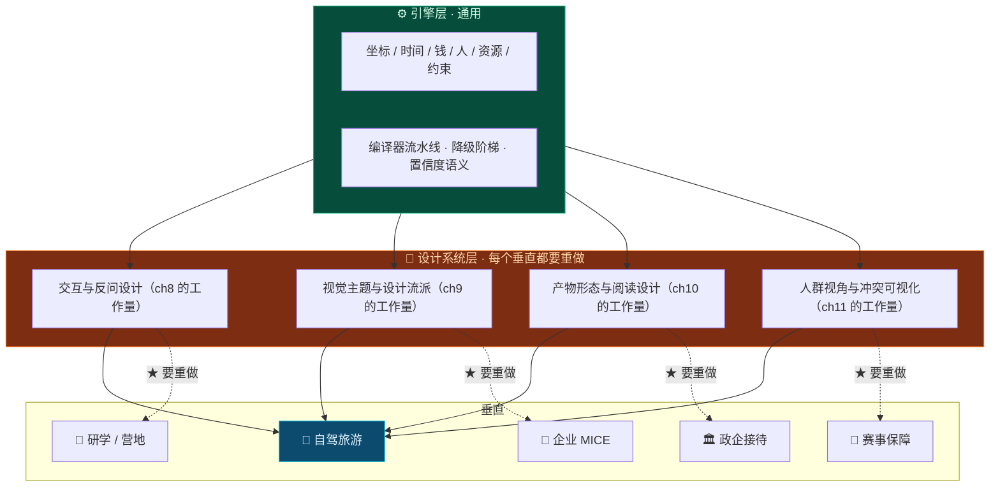

# 第 14 章 · 通用引擎与垂直扩展的判据

> **本章性质**：商业与产品设计，**不涉及技术实现**。
> **回答的问题**：TripCraft 的能力能不能用在旅游以外？如果能，什么时候该做，什么时候不该做？
> **与 [§13.8](13-agency-partnership-design.md#138--市场与竞争格局为什么这件事还没被做掉)的分工**：那一节回答「**为什么这件事还没被做掉**」；本章回答「**它还能扩展到哪，以及什么时候才该扩展**」。
> **状态**：`Design Spec`

---

## 14.1 先把一个反对意见完整地说出来

> 🔴 **在讨论任何一个新行业之前，必须先把这句话说完：**
>
> **「我们的技术可以迁移到很多行业」——这是创业公司失去焦点的最经典方式，也是最体面的一种方式。**
>
> **因为它听起来像战略，实际上是一个还没有付出代价的想象。**

**这句话之所以危险，不是因为它错，是因为它太容易对了。**

任何一个做得还算扎实的产品，它的抽象层几乎必然能描述一些别的场景——**因为好设计本来就该抽掉了具体性**。于是团队会得出一个看起来很自然的结论：既然底层是通用的，那我们做第二个行业就是几乎零成本的。

> ⚠️ **但这个推论里藏着一个没有被检验的跃迁：**
>
> **「引擎是通用的」 ≠ 「产品是通用的」。**
>
> **而这两者之间的差距，就是本章要量化的那个东西。**

所以本章不打算论证"我们能不能做别的行业"。**本章要论证的是：什么条件下才允许做，以及为什么现在还不满足。**

---

## 14.2 到底什么被抽出来了

### 14.2.1 引擎那一层，确实是通用的

回看 [第 4 章 DSL](04-dsl-specification-v1.md)，整个数据契约实际在描述一件事：

> **一组人，在一段时间里，沿着一条路线，消费一批资源，并受一组约束。**

把它拆开：

| 维度 | DSL 里的对应 | 是不是旅游专有 |
| :--- | :--- | :--- |
| **坐标** | `[lng, lat]`（GCJ-02）、节点顺序 | ❌ **不是**——任何有地点的活动都一样 |
| **时间** | 整数分钟；●锚点 / ○游览 / ┄过渡 三种节点 | ❌ **不是**——任何有时序的活动都一样 |
| **钱** | 整数分、报价、成本 | ❌ **不是** |
| **人** | 人群画像、关怀标签、五视角派生 | ❌ **不是**——只是"人群"这个词在不同场景下换了名字 |
| **资源** | 四类特权资源、置信度四级、敏感度三级 | ❌ **不是**——"需要确认的资源"是通用概念 |
| **约束** | 硬约束 / 弹性约束、熔断、降级阶梯 DL0–DL4 | ❌ **不是**——安全生产也一样 |

> 🔑 **这六个维度合起来，是一个领域无关的文法。**
>
> **它可以被叫作「时空流动资产的描述语言」——凡是有"一批人按次序移动并消费资源"的场景，它都成立。**

### 14.2.2 但设计系统那一层，是旅游专有的

**接着看 [第 8 章](08-socratic-interaction-design.md)到[第 11 章](11-audience-adaptive-rendering.md)：**

| 产物 | 内容 | 换了行业还能用吗 |
| :--- | :--- | :--- |
| [ch8 药丸库](08-socratic-interaction-design.md#84-药丸系统设计) | 12 维：时间锚点 / 天数 / 阵容 / 关怀 / 载具 / 节奏 / **风味** / **住宿** / **摄影** / 体力 / 必去必避 / 预算感 | ❌ **大部分不能**——「风味」「住宿」「摄影」是旅游语义 |
| [ch9 五大主题](09-visual-design-system.md#92-五大主题的完整设计) | 敦煌金 / 赛博蓝 / 高原青 / 江南翠 / 冰川银 | ❌ **完全不能**——它们是从**目的地意象**里提取的 |
| [ch10 六种日型](10-roadbook-reading-design.md#102--一天的性格标签) | 赶路日 / 精华日 / 轻松日 / 挑战日 / 休整日 / 缓冲日 | 🟡 **部分**——语义通用，但阈值是旅游标定的 |
| [ch11 五视角](11-audience-adaptive-rendering.md#112-五个视角) | 领队 / 长辈 / 带娃 / 摄影 / 司机 | ❌ **不能**——MICE 要的是"会务方 / 主讲 / 参会者" |

> 🔴 **这就是本章最重要的一个判断：**
>
> **迁移的成本不在引擎，在设计系统。**

> 📌 **看这张图的形状就能明白问题在哪：**
>
> **引擎是"一对多"的，一次做好，五个垂直共用。**
>
> **但设计系统是"四对五"的——每开一个新垂直，都要重做四章的工作量。**
>
> **而 ch8 到 ch11 这四章，正好是这本书里最厚、最需要判断、最不能靠堆人力补的四章。**

> 🔑 **所以「技术能迁移」这句话是真的，但它的推论不成立。**
>
> **真正的成本不是把 DSL 接过去，是在新垂直里重新做一遍"什么叫好的产物"这件事。**
>
> **而这件事，没有捷径。**

---

## 14.3 用同一把尺子量四个候选垂直

**把候选垂直放在同一张表上量。量的维度只有五个，且每一个都是可判断的：**

| | 🎒 **研学 / 营地** | 🏢 **企业 MICE** | 🏛 **政企考察接待** | 🏃 **赛事保障** |
| :--- | :--- | :--- | :--- | :--- |
| **核心对象** | 未成年人 + 家长 | 员工 + 会务方 | 领导 / 客商 + 随行 | 选手 + 保障方 |
| **与旅游的同构度** | ★ **高** | ★ **中高** | ★ **高** | ⚠️ **中** |
| **同构在哪** | 就是旅游，多了一层教学目标 | 就是旅游，多了一层会议锚点 | 就是旅游，但权限极严 | ⚠️ **不是**——是"临时场地 + 严格时序"，没有"景点"这个概念 |
| **谁付钱** | 家长 / 学校 / 教育机构 | 企业行政 / HR | 政府 / 企业接待部门 | 赛事组委会 / 赞助商 |
| **★ 渠道能否复用** | ★ **能**——研学机构与旅行社大量重合，很多社兼做 | ★ **能**——企业 MICE 与旅行社的商旅部门本就重合 | ❌ **不能**——完全不同的关系网络 | ❌ **不能** |
| **关键难点** | 未成年人合规（[§7.4.3](07-legal-and-compliance.md#743-分级同意模型) 已有基础） | 高规格感（[ch9](09-visual-design-system.md) 可直接复用） | ★ **保密：路线不能上公网地图** | ★ **安全：熔断必须真能用，不能是设计姿态** |
| **需要新能力吗** | 中（教学目标层） | **低** | ⚠️ **高**（离线 / 私有部署） | ⚠️ **高**（实时性、可靠性等级完全不同） |
| **风险量级** | 🟡 中（未成年人） | 🟢 低 | 🔴 **高**（涉密） | 🔴 **高**（生命安全） |

### ★ 从这张表能读出三个结论

| # | 结论 | 依据 |
| :--- | :--- | :--- |
| **1** | **同构度最高的是研学和企业 MICE** | 它们本质就是"旅游 + 一层额外语义"，而不是另一种活动 |
| **2** | ★ **而它们恰好也是仅有的两个能复用渠道的** | 研学机构、企业商旅部门——**都在现有的 B 端关系网里** |
| **3** | ⚠️ **政企和赛事的同构度不低，但它们既不复用渠道，又要新能力，风险还高** | 如果要做，那不是"扩展"，是**重新创业** |

> 🔑 **所以如果有一天真要开第二个垂直，第一个该开的是研学——而理由不是"它最像旅游"，是"它最像旅游**而且它的渠道就在旁边**"。**
>
> **"像"只解决设计成本，"渠道复用"才解决获客成本。而获客成本才是真正的门槛。**

> ⚠️ **顺带修正一个常见误判：政企接待看起来"You 有资源就能做"，实际是四个里最不该碰的。**
>
> 因为它要求路线**不能上公网地图**——而这与 [铁律 4 数据主权本地化](00-overview-and-glossary.md#铁律-4--数据主权本地化-local-data-sovereignty) 和整个"单文件、无后端"的架构是**根本冲突**的。它需要的是私有化部署能力，**那是另一个产品**。
>
> **涉密场景里的"看起来能做"，是最贵的一种错觉。**

---

## 14.4 ★ 判据：什么条件下才允许开第二个垂直

> 🔴 **这一节是本章的核心产出。**
>
> **它不是一个计划，是一组否决条件——用来在未来某个时刻，诚实地回答"现在到底该不该"。**

**四条必须同时成立。少一条，就不开。**

| # | 判据 | 怎么验证 | 为什么是它 |
| :--- | :--- | :--- | :--- |
| **1** | ★ **主垂直的边际收益已经归零** | 在一条线上，新增一份路书**不再带来任何新的真实数据**（不是"没有新客户"，是**数据不再变厚**） | 因为 B 端飞轮（[§13.6](13-agency-partnership-design.md#136--网络效应什么该共享什么该私有)）是靠数据厚度转的。**池子还在变厚，就不该分心** |
| **2** | ★ **引擎已经连续 6 个月没有为旅游改过** | 查 git：`spec/` 与 `src/compiler.js` 近 6 个月无功能性变更 | 引擎还在变，说明抽象层次还没稳定。**这时候抽通用层，抽出来的一定是旅游 DSL 换个名字** |
| **3** | ★ **是被拉过去的，不是推过去的** | ≥ 3 个**互相独立**的潜在客户主动来问，且都不是我们介绍的 | 见下 |
| **4** | ⚠️ **不需要引擎或设计系统新增能力** | 如果它要求新增一个能力，那它是**新产品**，不是新垂直 | 新产品的决策成本完全不同，不能混在"扩展"里做 |

### ★ 第 3 条值得单独说：垂直扩展的正确信号是被拉，不是推

**"推广"和"被拉"的区别，在动作上非常清楚：**

| | 🔴 推（不该做） | 🟢 拉（可以做） |
| :--- | :--- | :--- |
| **起源** | 我们自己想："这个引擎也能做 X" | 别人来问："你们能不能用来做 X" |
| **证据** | 一份市场规模的 PPT | ★ **三个以上互不相识的人，各自独立地问了同一件事** |
| **代价** | 我们要重做 ch8–ch11 | ★ **他们会告诉我们该重做什么** |

> 📌 **为什么"三个独立来源"是硬指标：**
>
> **一个来源可能是巧合，两个可能是圈子（比如同一个行业群里的人），三个互不相识的独立来源，才说明这是一个真实存在的类别，而不是一个人的偏好。**
>
> **而更实际的原因是：他们带来的是需求的具体形态。** 我们推过去的时候，只能靠猜；他们拉我们过去的时候，会把"什么样的产物才算好"直接告诉我们——**而这恰好是 §14.2.2 里最贵的那部分工作量。**

### ⚠️ 第 4 条的一个反直觉推论

> **"这个垂直需要引擎新增一个能力"——这不是一个可以商量的信号，它是一个明确的否决信号。**
>
> **因为它意味着：引擎的抽象层次还不够。**
>
> **而如果抽象层次不够，正确的动作是回去改引擎（在主垂直里改，有真实数据兜底），而不是带着一个不够抽象的引擎去开新垂直。**——**后者会把设计债同时欠在两个地方。**

---

## 14.5 ★ 现在该做什么：设计时留缝，但不现在开叉

### 14.5.1 三件已经在做的事，本身就是"缝"

| 已经在做的 | 为什么它是一条缝 |
| :--- | :--- |
| ★ **DSL 用 `additionalProperties: false` 强约束** | ★ 反直觉：**严格比宽松更容易扩展**。因为严格意味着每个字段的语义是闭合的、无歧义的——扩展时不会踩到未定义行为。宽松的 schema 看着"灵活"，实际是把歧义留给了未来 |
| ★ **事实与建议分离**（[铁律 7](00-overview-and-glossary.md#铁律-7--事实与建议分离-fact-vs-advice)） | 任何垂直都需要区分"这是事实"和"这是我建议的"。这条铁律在五个垂直里都成立 |
| ★ **置信度四级 + 降级阶梯**（[§3.5.3](03-b2b-agency-operations.md#353-置信度四级语义) / [ch1](01-resilience-and-failover.md)） | **赛事保障整个就是一条降级阶梯**；政企接待整个就是置信度管理。这两套抽象在新垂直里的复用率会高于视觉层 |
| ★ **五视角派生机制**（[ch11](11-audience-adaptive-rendering.md)） | MICE 需要的是"会务方 / 主讲 / 参会者"，机制完全相同，只是视角列表不同 |

> 🔑 **注意这四条的共同点：它们都是"约束"和"语义"，不是"样式"。**
>
> **能迁移的从来是约束，不是外观。**

### 14.5.2 三件现在绝对不能做的事

| ❌ 不要现在做 | 为什么 |
| :--- | :--- |
| **抽一个"通用 DSL"出来** | 只有一个垂直的样本时，抽出来的通用层 = 旅游 DSL 换了个名字，**却多了一层间接，增加了所有未来的改动的成本** |
| **做插件化 / 多租户架构** | ★ 为一个**还不存在的客户**增加复杂度，是纯粹的负债 |
| ★ **在对外材料里写"通用引擎"** | ⚠️ 见下 |

### 14.5.3 ⚠️ 最后一条的代价经常被低估

> 🔴 **「我们以后还能做很多行业」这句话，在两个最重要的场合里，伤害都大于收益。**

| 场合 | 说这句话的后果 |
| :--- | :--- |
| **面对旅行社 / 车厂** | ★ 对方第一反应是：**"那我们不是你的重点"**——而 B 端合作最怕的就是"你不是为我做的" |
| **面对投资人** | ⚠️ "什么都能做"通常被读作**"什么都还没做成"** |

> 📌 **这不是话术问题，是优先级问题。**
>
> **一个产品的能力边界，客户自己会推断出来——他不需要你告诉他。**
>
> **而一旦你主动说了，他就必须开始怀疑你的专注度。**

---

## 14.6 ⚠️ 最需要警惕的那个陷阱

> **本章列了四个垂直，也给了判据。但最可能发生的错误，不是"判断错时机"，而是——**
>
> 🔴 **把判据当成了路线图。**
>
> **一旦它变成路线图，团队就会开始为它做准备工作：先搭一个能装下四个垂直的架构、先在对外材料里留一个位置、先招一个懂研学的 BD……**
>
> **而所有这些"准备工作"，都会从主垂直里抽走资源——且不会在任何一张表上显示为成本。**

**判断自己有没有掉进去，只需要问一个问题：**

> **"这个月，我们为旅游这条线做了什么？"**
>
> **如果答案是"我们在为扩展做准备"——那已经掉进去了。**

> 🔑 **正确的状态是：这四条判据写在这里，然后被忘掉。**
>
> **等有一天，第三个互不相识的人来问"你们能不能做研学"的时候，再回来翻这一章。**
>
> **在那之前，它唯一的作用是：**当有人提议"我们是不是也该做 X"时，有东西可以指着说"看，判据还没满足"。**

---

## 14.7 本章设计清单

| # | 设计决策 | 一句话 |
| :--- | :--- | :--- |
| X-01 | ★ **引擎通用，但设计系统不通用** | 迁移成本不在 DSL，在重做 ch8–ch11 |
| X-02 | ★ **能迁移的从来是约束，不是外观** | 置信度、降级阶梯、事实/建议分离可复用；主题色不能 |
| X-03 | ★ **开新垂直的成本 = 重做四章的工作量** | 这是任何"扩展成本很低"的说法都必须先回答的问题 |
| X-04 | **同构度最高的是研学与企业 MICE** | 本质是"旅游 + 一层额外语义" |
| X-05 | ★ **但真正的门槛是渠道复用，不是同构度** | 研学机构和企业商旅就在现有的 B 端关系网里 |
| X-06 | ⚠️ **政企接待是四个里最不该碰的** | 涉密要求与"无后端、单文件"架构根本冲突 |
| X-07 | **赛事保障的熔断必须真能用，不能是设计姿态** | 那里没有"降级不可耻"，只有"必须可靠" |
| X-08 | ★ **四条判据必须同时成立，少一条就不开** | 边际收益归零 / 引擎半年未变 / 被拉过去 / 不需新能力 |
| X-09 | ★ **正确信号是被拉，不是被推** | ≥3 个互不相识的独立来源主动来问 |
| X-10 | ★ **"需要引擎新增能力"是否决信号，不是商量信号** | 说明抽象层次还不够，该回去改引擎 |
| X-11 | ★ **`additionalProperties: false` 是扩展性资产** | 严格比宽松更容易扩展——歧义才是未来的成本 |
| X-12 | ⚠️ **现在不抽通用 DSL、不做插件化架构** | 为一个不存在的客户增加复杂度是纯负债 |
| X-13 | ⚠️ **对外不说"通用引擎"** | 对客户是"你不是我的重点"，对投资人是"什么都还没做成" |
| X-14 | 🔴 **最可能的错误是把判据当路线图** | 检验方法：问"这个月为旅游做了什么" |

---

> **相关章节**：[§13 线下旅行社合作](13-agency-partnership-design.md) —— 四条判据中的第 1 条（数据边际收益）依赖它的 §13.6 飞轮；第 3 条（被拉过去）依赖它的 §13.2 渠道。
> **上游依据**：[第 4 章 · DSL](04-dsl-specification-v1.md)（哪些抽象是领域无关的）｜ [第 5 章 · 编译器流水线](05-compiler-pipeline.md) ｜ [§0.2 十条设计铁律](00-overview-and-glossary.md#02-十条设计铁律-the-ten-ironclad-rules)
> **⚠️ 本章不含任何市场数据**——因为任何一个新垂直的市场规模，在本章写下时的核验成本都高于它的决策价值。**等判据第 3 条满足时再查，那时会有真实客户告诉你该查什么。**
