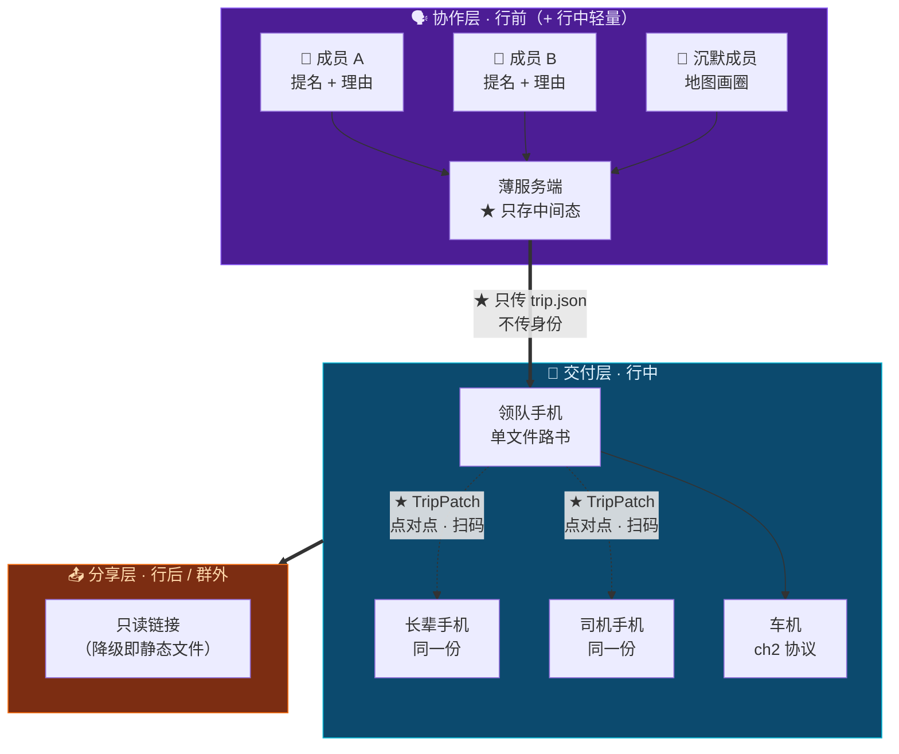

# 第 15 章 · 多端形态与协作层设计

> **本章性质**：产物形态与协作机制设计，**不涉及技术选型**。
> **回答的问题**：TripCraft 最终交付的到底是什么？一群人的意见，怎么收进来？
> **与 [第 10 章](10-roadbook-reading-design.md)的分工**：ch10 设计的是**一份路书怎么读**；本章设计的是**一群人怎么共同产出它，以及产出之后它存在于几台设备上**。这是两件事。
> **为什么单列一章**：全书到此为止，产品形态被默认成"一份静态文件"。**这个默认从未被论证过**，而它是错的——错的那一半，恰好是三件最有价值的事。
> **状态**：`Design Spec`

---

## 15.1 先把一个误区完整地勘正

> 🔴 **「最终产物是一个静态网页」——这句话只对了一半。而错的那一半，最贵。**

**对的一半**：路书这个**交付物**，确实必须是一个零安装、断网可读的文件。这一条不能动（[铁律 1](00-overview-and-glossary.md#铁律-1--零构建交付-zero-build-delivery) / [铁律 2](00-overview-and-glossary.md#铁律-2--单文件优先渐进增强-single-file-first-progressive-enhancement)）。

**错的一半**：**它把交付物当成了整个产品。**

TripCraft 不是"一个生成网页的工具"。它是**从「一群人想去哪」到「一群人走完了」的全程系统**。而在这个全程里，**三分之二的事情发生在"生成那份文件"之前和之后**——这两段时间里，一份静态文件完全无能为力。

> 📌 **具体地说，有三件事是静态文件永远做不到的：**

| # | 做不到的事 | 为什么做不到 |
| :--- | :--- | :--- |
| **1** | ★ **一群人各自提想法** | 静态文件是**产物**。产物意味着"已经决定了"。**而提想法发生在"还没决定"的时候** |
| **2** | ★ **行程改了，全车人都知道** | 静态文件在生成那一刻就冻结了。领队在路上改了明天的路线，**另外三台手机上是旧版本——而它们不会自己变** |
| **3** | ★ **分享出去的东西带着共同记忆** | 发一个链接出去，对方看到的是一份文档。**他看不到"这是姑姑坚持要加的"，也看不到"这个圈是爷爷画的"** |

> 🔑 **这三件事合起来，就是业主那句话的准确含义：**
>
> **它不是"静态网页体验不好"，是"静态网页只覆盖了旅行的一小段"。**
>
> **而覆盖不到的那两段里，藏着这个产品最难被抄掉的东西——一群人的共同决策。**

---

## 15.2 ⚠️ 但"那就做成 App"会撞上四堵墙

**第一反应是"那把产物做成 app"。这个反应是自然的，但它会撞上四堵墙——而且其中一堵，会直接取消掉这个产品的核心价值。**

| # | 墙 | 具体是什么 |
| :--- | :--- | :--- |
| **1** | 👴 **长辈** | [铁律 1](00-overview-and-glossary.md#铁律-1--零构建交付-zero-build-delivery) 的原始理由至今成立：**长辈不会为了看一份路书去装一个 app。** 子女可以帮他装一次——但"看行程"这件事本身不能有这个前置条件 |
| **2** | 🚗 **车机** | [第 2 章](02-cockpit-protocol.md)已核实：行驶中车机浏览器的第三方能力被 UX 限制屏蔽，且**没有车厂会为第三方应用做适配**。车机端能接收的只有页面与深链 |
| **3** | 🔴 **B 端白标** | ★ **一家地接社不可能为每条线路发一个 app。** 应用商店审核、企业签名、iOS/Android 双端维护——**这不是"麻烦"，这是物理上做不到**。而白标正是 [第 13 章](13-agency-partnership-design.md)的全部价值所在 |
| **4** | 📤 **群外分享** | 把行程发给不在群里的爸妈，对方得先装一个 app。**而"发过去就能看"是分享这件事的全部意义** |

> 🔴 **第三堵墙是决定性的，必须单独说：**
>
> **业主自己在 [§13](13-agency-partnership-design.md) 里已经确认过——TripCraft 最大的价值是"武装线下旅行社"。**
>
> **而"最终产物是一个 app"这句话，在逻辑上直接取消了白标的可能性：你没法让徐师傅的车队拥有一个自己的 iOS 应用。**
>
> **一个会取消自己核心价值的产品形态，无论体验多好，都是错的。**

---

## 15.3 ★ 拆成三层：协作 / 交付 / 分享

**正确的做法不是二选一，是承认这里有三件不同的事。**

| | 🗣 **协作层** | 📖 **交付层** | 📤 **分享层** |
| :--- | :--- | :--- | :--- |
| **时期** | 行前（+ 行中轻量） | 行中 | 行后 / 群外 |
| **谁在用** | 出行小团全体成员 | 全车人 + 司机 + 长辈 | 群外的人 |
| **在什么设备上** | ★ 手机（**可以是一个 app**） | ★ **任何能打开链接的设备** | ★ 任何设备 |
| **形态** | ★ PWA / 小程序 / 原生 | ★ **零安装**：链接、二维码、单文件 | ★ **只读链接** |
| **能不能有后端** | ✅ **可以** | ❌ **绝对不行** | 🟡 只读，可以无 |
| **法律定性** | ⚠️ **UGC 平台**（见 [§15.8](#158--这给法律面增加了三样东西)） | 工具产物 | 内容分发 |
| **铁律** | 铁律 4 **加强** | 铁律 1/2/3/5 **原文适用** | 铁律 3 |

> 🔑 **这三层不是同一个产品拆成三块。它们是三种不同的东西，只是共享同一份 DSL。**

**为什么"共享同一份 DSL"是关键**：因为[铁律 6](00-overview-and-glossary.md#铁律-6--dsl-是唯一真相源-single-source-of-truth) 说行程只存在于 `trip.json` 中。**只要这条成立，协作层怎么重、交付层怎么轻，都是实现自由度**——它们之间的接口是契约，不是代码。



> 🔴 **一条不变量，比这一章其他所有结论都重要：**
>
> **交付层永远不依赖协作层。**
>
> **协作层的服务端全部消失，已经发出去的路书必须照常工作——而且依然能通过 TripPatch 点对点更新。**
>
> 这条来自[铁律 5](00-overview-and-glossary.md#铁律-5--无后端可运行-backendless-by-default) 的红线，**一个字都不用改**。

---

## 15.4 ★ PWA：同时拿到"是 app"和"零安装"的那个解

**把 [§15.2](#152--但那就做成-app会撞上四堵墙) 的四堵墙和"用户想要一个 app"放在一起，能同时满足的形态只有一个。**

| 用户感知到的 | PWA 给不给 | 原生 app |
| :--- | :--- | :--- |
| 桌面图标、全屏无地址栏 | ✅ | ✅ |
| 离线可用 | ✅ | ✅ |
| 通知提醒 | ✅ | ✅ |
| 后台同步 | ✅ | ✅ |
| 相机 / 定位 | ✅ | ✅ |
| ★ **点链接即用，无需安装** | ✅ | ❌ |
| ★ **每家地接社一个自己的"app"** | ✅ **不需要上架** | 🔴 **做不到** |
| 双端维护成本 | ✅ **一份代码** | 🔴 两套 + 双份审核 |
| 更新 | ✅ 刷新即最新 | 🔴 等审核 |

> 🔑 **最后三行是决定性的，而且它们指向同一个方向：**
>
> **PWA 不是在"app 体验"上打折的妥协——它在"分发"这一项上，比原生 app 强一个量级。**

**对长辈**：家族群里发一个链接，**点开就在看**。子女想帮装的话，装完它就是一个带图标的 app。
**对车机**：交付层仍然是一个页面，[第 2 章](02-cockpit-protocol.md)的协议一个字不改。
**对地接社**：★ **「金马国旅 · 甘青 9 日」可以有它自己的图标、自己的启动画面、自己的名字，装在客户的手机桌面上——而金马国旅不需要注册开发者账号、不需要过审、不需要维护两套代码。**

> ⚠️ **一条诚实的边界，不能省：**
>
> **iOS 上，Web Push 需要用户先把页面"添加到主屏幕"才会生效**，且后台同步能力弱于原生。
>
> 所以有两条推论，它们都是[铁律 3](00-overview-and-glossary.md#铁律-3--降级不可耻白屏才是罪-degrade-never-blank) 的延伸：
>
> 1. **推送不能成为任何功能的唯一通道。**
> 2. **行中的关键提醒必须有一个不依赖推送的兜底**——最自然的一个是：**路书每次打开时自检一次**（有没有新 Patch、有没有今天的变更），这不需要任何权限。

---

## 15.5 ★ 协作层的设计原则：只负责"收齐"，不负责"裁决"

**这一节是本章最核心的产品判断。**

设计"多人提景点"时，几乎所有人的第一反应是做**投票**。

> 🔴 **投票是错的。而它错的方式，恰好是 [§8.8](08-socratic-interaction-design.md#88--多人意见冲突的对话设计) 已经解决过的那个问题。**

[§8.8.1](08-socratic-interaction-design.md#88--多人意见冲突的对话设计) 的立场是「**不调和，而是物理隔离**」——承认分歧，然后设计"分头行动"这个选项。那句设计说明写得很清楚：

> **"找一个满足所有人的方案"这条路在多数情况下不存在，强行找出来的结果是所有人都勉强接受——那是最差的旅行体验。**

**而投票就是调和。** 它把五个人的偏好压成一个数字，然后让少数派接受结果。

| | ❌ 裁决型（不做） | ✅ **收齐型（做）** |
| :--- | :--- | :--- |
| **机制** | 投票 / 打分 / 权重 | ★ **各自提名 + 各自说为什么** |
| **输出** | 一个排名 | ★ **一张"谁想要什么、为什么"的清单** |
| **少数派** | 被多数压倒 | ★ **被看见，且不会被抹掉** |
| **最后交给谁** | 交给算法 | ★ **交给 [§8.8](08-socratic-interaction-design.md#88--多人意见冲突的对话设计) 的呈现阶段，交给用户自己** |

> 🔑 **一句话：协作层解决的是"信息没被收集到"，不是"意见不一致"。**
>
> **意见不一致是 §8.8 的领地。而 §8.8 的解法是"把冲突说清楚"，不是"算出谁赢"。**
>
> **协作层一旦开始裁决，它就把 §8.8 好不容易守住的那条线从上游毁掉了。**

### 15.5.1 四条具体设计

```text
【甘青 9 日 · 我们的行程】                          7 人已提

🗣 姑姑   「一定要去塔尔寺，我妈信佛」      ← 有理由的必去
🗣 老张   「黑马河日出，我查了 6:20」       ← 有理由的必去
🗣 小美   「想去茶卡，但怕人多」            ← 带顾虑的想去
🗣 爷爷   （在地图上画了个圈 · 张掖）       ← ★ 沉默成员的表达
🗣 领队   「D5 要留半天给敦煌，前面得压」   ← ★ 这是约束，不是偏好

  ⚠️ 还有 2 人没提
```

**① ★「理由」是必填项——但不是靠强制表单，是靠 UI 引导。**

> **因为理由才是 AI 能处理的东西。**
>
> 「想去塔尔寺」是一个**愿望**；「我妈信佛」是一个**约束条件**。
>
> **愿望只能被满足或不被满足；约束条件可以被求解**——改到 D2、安排 2 小时、配一个讲解、避开法会人流高峰。
>
> **理由把"要或不要"变成了"怎么才能要"。这是整个协作层里最高杠杆的一个字段。**

**② ★ 沉默的人需要一种不用打字的表达方式。**

**爷爷不会打字。** 而他并不是没有意见——他只是不会用输入框表达。

> **所以：在地图上画一个圈。** 他只需要说"我想去这附近"，这不需要一个字。
>
> ⚠️ **这一条不是无障碍功能，是主力功能。** 一个家庭群里，**说得最少的那个人，往往是最需要被照顾的那个人**——而现行的所有产品都默认"你有意见就打字"。

**③ ★ 约束和偏好必须分开收。**

领队提的「D5 要留半天」**不是偏好，是硬约束**（[DSL 里的 `rigid`](04-dsl-specification-v1.md)）。把它混进偏好池里，会让后面所有判断都错——**优化的目标会从一个可行解变成一个不可行解。**

**④ ★「还有 N 人没提」必须显示。**

> **因为沉默不等于没意见。沉默通常意味着"我的意见不会被采纳"。**
>
> 一个不显示"还有谁没说话"的协作界面，会**系统性地放大嗓门大的人**——那不是去中心化，那是换了个人中心化。

---

## 15.6 ★ 去中心化：不是网络拓扑，是决策权分布

**"去中心化的多人合作"这句话里，装了两个完全不同的东西。必须拆开。**

| | **A · 组织上的去中心化** | **B · 技术上的去中心化** |
| :--- | :--- | :--- |
| **含义** | 不是领队一个人说了算，人人可提 | 没有中心服务器，设备之间直接同步 |
| **解决的是** | ★ **"我的想法没人听"** | 数据主权 / 抗审查 / 无单点故障 |
| **对不对** | ✅ **完全正确，且这正是 [§15.5](#155--协作层的设计原则只负责收齐不负责裁决) 在做的事** | 🟡 **部分正确，但不能全盘** |
| **成本** | 低 | 🔴 高，且与三件事直接冲突 |

**B 读法做不到的三件事：**

| 做不到 | 为什么 |
| :--- | :--- |
| **推送提醒** | 需要有东西在后台醒着，并找到那台设备 |
| **群外分享** | 群外的人不在你的网络里 |
| **B 端白标与计费** | 地接社要的是"我的品牌、我的账"——这必然存在一个中心 |

> 🔑 **所以准确的表述是：TripCraft 在「决策权」上去中心化，在「数据」上中心化到最小。**
>
> **业主真正在意的从来不是"有没有服务器"，是"我的想法会不会被听见"和"我的数据会不会被拿走"。**
>
> **这两件事不需要靠 P2P 解决。而把它们混为一谈，会为了一个不需要的东西付出巨大的架构代价。**

### 15.6.1 ★ 而"点对点同步"这块拼图，书里已经有一块现成的

回看 [`spec/patch.schema.json`](../spec/patch.schema.json) 的设计说明，原文写着：

> **「核心用途：在无网络环境下（戈壁、垭口、无人区）通过二维码或 URL fragment 在车队之间点对点分发路况变更，完全不依赖任何服务器。」**

> 📌 **这就是一个已经设计好的、无服务器的、去中心化的同步原语。**
>
> **它当初只被用在"路况变更"这一个场景上。**
>
> **而它需要做的事情，对"路况变了"和"姑姑加了个点"来说是完全一样的——都是"一份已分发的 DSL 的最小化修改"。**

**所以去中心化同步这件事，不需要新造轮子：**

| 场景 | 同步方式 | 依赖服务器吗 |
| :--- | :--- | :--- |
| 行前：群里提景点 | 协作层实时同步 | ✅ 需要 |
| ★ **行中：领队改了明天的路线** | ★ **生成 TripPatch → 推给全车** | 🟡 推送需要；**接收端应用 Patch 不需要** |
| ★ **无人区：车队之间互传** | ★ **二维码 / URL fragment 点对点** | ❌ **完全不需要** |
| 行中：打卡、账本 | 协作层（可选） | ✅ 需要 |
| ★ **断网的那台设备** | ★ **看旧版本，照常可用** | ❌ 不需要 |

> 🔑 **注意第三行和第五行。**
>
> **在戈壁滩上，同步这件事退化成"两台手机对着扫一个二维码"——而这条路 [第 4 章](04-dsl-specification-v1.md)已经铺好了。**
>
> **这就是[铁律 3](00-overview-and-glossary.md#铁律-3--降级不可耻白屏才是罪-degrade-never-blank) 在同步问题上的形态：同步不上，行程照常读；同步上了，行程变得更准。**

---

## 15.7 ★ 同步模型：后端只存中间态，不存成品

**"多端同步"必然需要一个后端。问题是它存什么。答案是一张清单：**

| 数据 | 存在哪 | 生命周期 | 敏感度 |
| :--- | :--- | :--- | :--- |
| 群成员的提名与理由 | ★ **协作层（薄服务端）** | **行程结束后 N 天销毁** | 🟢 低——「想去青海湖」不是敏感信息 |
| 合并后的需求清单 | ★ 协作层 | 同上 | 🟢 低 |
| 成型的 `trip.json` | ★ **用户设备** | 用户自己决定 | 🟡 中 |
| **身份信息 / 照片 / 轨迹** | ★ **永不进入协作层** | —— | 🔴 高 —— [铁律 4](00-overview-and-glossary.md#铁律-4--数据主权本地化-local-data-sovereignty) |
| 已编译的路书 | ★ **用户设备 / CDN 静态** | 永久，零依赖 | 🟢 低（已脱敏） |

> 🔴 **一条硬规则：协作层里流动的只有「想去哪」和「为什么」，没有「谁是谁」。**
>
> 这一条同时解决两件事：
>
> 1. **[铁律 4](00-overview-and-glossary.md#铁律-4--数据主权本地化-local-data-sovereignty) 的加强条款**：身份、照片、轨迹永远不出设备——**而协作层根本不需要它们。**
> 2. **⭐ [§3.2.2](03-b2b-agency-operations.md#322--关键设计决策游客没有账号)「游客没有账号」不被破坏**——见 [§15.9](#159--与-b-端白标的关系这个形态反而加固了第-13-章)。

---

## 15.8 ⚠️ 这给法律面增加了三样东西

> 🔴 **这一节是全章最需要警惕的部分。它增加的是全书唯一一个 P0 级风险域。**

**协作层让 TripCraft 从一个"工具"变成了一个"有用户内容的平台"。这个转变带来的法律新增面，[第 7 章](07-legal-and-compliance.md)现有的免责体系完全没有覆盖——因为 §7 的全部设计都假设：内容是 AI 生成的，或者地接社给的。**

| # | 新增面 | 为什么是新的 |
| :--- | :--- | :--- |
| **1** | ★ **UGC 内容责任** | 群成员可以提交景点、文字、图片。**平台对用户提交的内容负有审核义务**——而 §7 现有体系里没有这个角色 |
| **2** | 🔴 **"野景点"推荐** | ⚠️ **这是最要命的一条**——见下 |
| **3** | 🔴 **"群"本身让 [OI-016](00-overview-and-glossary.md#07-未决事项登记册-open-issues-register) 的风险升级** | 见下 |

### 15.8.1 ⚠️ 为什么"野景点"是新的、而且是重的

**如果群里有人推荐一个未开发的、有真实危险的地点**（无人区穿越、野长城、废弃矿洞、未开放的保护区），**而产品把它结构化地排进了一份看起来权威的路书里**——

> 🔴 **平台的责任性质，与"转发一条微信消息"完全不同。**
>
> **因为路书是我们的产物。它带着编辑责任。**
>
> 一个人在微信群里说"那个沟能进去"，那是**他个人的言论**。而同样一句话，被排进一份带海拔剖面、带熔断预案、带"建议上午去"的路书里——**它就变成了产品的主张。**
>
> **而[铁律 7](00-overview-and-glossary.md#铁律-7--事实与建议分离-fact-vs-advice) 的整套事实/建议分离机制，在这句话上会失效——因为它既不是事实（我们没核验），也不是我们的建议（是用户提的）。**

### 15.8.2 🔴 为什么"群"让 OI-016 升级

> **在协作层出现之前，「为无证经营提供便利」是一个 B 端风险**——管的是一个地接社在平台上怎么用工具，靠审慎的合同设计就能控制（[§13.5.4](13-agency-partnership-design.md#1354--一个必须先回答的问题他有资质吗) 的 G-24~G-27）。
>
> **在协作层出现之后，它变成了一个 C 端风险。**
>
> **因为产品里第一次出现了"一群人聚在一起、有人牵头、可以互相收钱"的完整闭环。**
>
> 而这恰恰是《旅游法》与各地文旅执法明确打击的对象——已核验的执法口径写着：**「为非法活动提供引流、收款、客源对接等便利的，一并查处」**（见 [§7.11](07-legal-and-compliance.md)）。

### 15.8.3 ★ 必须先立住的四条红线

**这四条写在 [§7](07-legal-and-compliance.md) 之前，因为它们是产品形态决定的，不是法务条款决定的：**

| # | 红线 | 具体条款 |
| :--- | :--- | :--- |
| **R1** | 🔴 **协作层不提供任何收款能力** | 没有 AA 收款、没有"打给领队"、没有团费分摊、没有转账。**账本只做记账，不做支付**——这是 [OI-016](00-overview-and-glossary.md#07-未决事项登记册-open-issues-register) 在 C 端的直接封堵 |
| **R2** | 🔴 **不提供"组团"语义** | 协作层的单位是**"一个已经成形的行程"**，不是"一个可以拉人加入的团"。**没有公开的"找团 / 组队 / 拼团"入口**；加入方式是邀请制，且必须由已有成员发起 |
| **R3** | ★ **领队身份不产生任何产品特权** | 不显示"领队"头衔、不给专属标识、不做领队主页、不做领队信用分。**他只是一个普通成员，恰好是最早建这个行程的人**——这与 [§13.3.3](13-agency-partnership-design.md#1333-三条不越线)「不做撮合」是同一个动作 |
| **R4** | ⚠️ **用户提交的景点必须可区分** | 未经验证的提交**默认标记为「同行者提议 · 未核验」**，且与"系统建议"、"地接社情报"在视觉上必须不同。**这是[铁律 7](00-overview-and-glossary.md#铁律-7--事实与建议分离-fact-vs-advice) 在协作场景的第三个类别** |

> 🔑 **R4 值得单独看一眼，因为它是一条"设计即合规"的条款：**
>
> **[铁律 7](00-overview-and-glossary.md#铁律-7--事实与建议分离-fact-vs-advice) 原来只有两个类别：事实、建议。**
>
> **协作层带来了第三个类别：「同行者提议」。它既不是事实，也不是我们的建议——而它必须长得和前两个都不一样。**
>
> **这不是新增一条铁律，是原有铁律在一个新场景里自然长出来的一维。**

> 🔴 **而它立刻撞上了契约——这是一个必须现在登记的发现：**
>
> 回查 [`spec/node.schema.json`](../spec/node.schema.json)，`advice` 里有一个字段：
>
> ```json
> "generatedBy": { "enum": ["llm", "human", "hybrid", "crowdsourced"] }
> ```
>
> **`crowdsourced`（众包）看起来能覆盖「同行者提议」，但它的语义是相反的。**
>
> | | `crowdsourced` | **「同行者提议」** |
> | :--- | :--- | :--- |
> | 权威来自 | ★ **数量**（"大家都推荐"） | **一个具体的人**（姑姑） |
> | 隐含信号 | 已经被很多人验证过 | ⚠️ **完全未核验** |
> | 数量 | 很多 | **一个** |
>
> > 🔴 **用错这个枚举值，比新增一个值危险得多——因为它会把一个未核验的单人提名，渲染成看起来像共识的东西。**
> >
> > **而 §15.8.1 已经论证过：产品的主张责任，正是从这个"看起来像共识"里长出来的。**
>
> → 已登记为 **[OI-018](00-overview-and-glossary.md#07-未决事项登记册-open-issues-register)**，**与 [OI-010](00-overview-and-glossary.md#07-未决事项登记册-open-issues-register) 同性质：两者都打在 `trip.schema.json` 上，必须在 v1.0.0 冻结前一起解决。**

---

## 15.9 ★ 与 B 端白标的关系：这个形态反而加固了第 13 章

**"做了 C 端 app，不就和地接社抢客户了吗？"——这个担心是对的，但它针对的是"平台"，不是"群"。**

| 担心 | 实际情况 |
| :--- | :--- |
| "有了账号就破坏 [§3.2.2](03-b2b-agency-operations.md#322--关键设计决策游客没有账号) 游客没有账号" | ★ **不需要全局账号。** ★ **邀请链接本身就携带身份**——一次行程一个身份，行程结束即失效 |
| "做了 C 端就变成 C 端公司了" | ★ **协作层的单位是"一个已存在的行程"，不是"一个游客"**——见下表 |
| "PWA 装上去了那还算白标吗" | ★ **恰恰更强。** 白标的 PWA 装到客户手机桌面上，**图标是地接社的**——这是原生 app 给不了的 |

### ★ 关键区分：协作层像"群"，不像"平台"

| | ❌ 平台（不做） | ✅ **群（做）** |
| :--- | :--- | :--- |
| **入口** | 应用商店 / 首页 / 搜索 | ★ **一条邀请链接** |
| **身份** | 注册一个长期账号 | ★ **一次行程一个身份，行程结束即失效** |
| **归属** | 用户是"平台的用户" | ★ **用户是"这个行程的成员"** |
| **发现** | 可以逛、可以搜、可以推荐给别人 | ★ **没有任何发现机制** |
| **生命周期** | 永久 | ★ **行程结束后 N 天自动销毁** |

> 🔑 **这个区分同时解决三件事：**
>
> 1. **对地接社**：我们不是一个能把你客户带走的平台——**因为产品里根本不存在一个"可以逛的地方"。**
> 2. **对[铁律 4](00-overview-and-glossary.md#铁律-4--数据主权本地化-local-data-sovereignty)**：没有长期账号，就没有长期数据归集。
> 3. **对[§7](07-legal-and-compliance.md)**：没有公开可发现的内容，UGC 的传播范围被物理限制在一次行程的规模内——**这直接决定了 [§15.8](#158--这给法律面增加了三样东西) 里三项风险的量级。**

> ⚠️ **然后必须说一句诚实的代价：**
>
> **这个选择放弃了网络效应最强的那一部分。**
>
> 一个"可以逛的旅行社区"是 C 端增长最快的形态——**这里明确不做。**
>
> **理由和 [§13.8.6](13-agency-partnership-design.md#1386--但这个选择有代价它意味着我们不是一家消费级-ai-公司) 是同一个：一旦做了，TripCraft 就变成了一家 C 端消费公司，而它的 B 端价值会同时蒸发。**
>
> **这不是疏忽，是一个标了价的放弃。**

---

## 15.10 本章设计清单

| # | 设计决策 | 一句话 |
| :--- | :--- | :--- |
| C-01 | 🔴 **"最终产物是一个静态网页"只对了一半** | 对的是交付物，错的是把它当成了整个产品 |
| C-02 | ★ **静态文件永远做不到三件事** | 一群人各自提想法 / 改完全车都知道 / 分享带着共同记忆 |
| C-03 | 🔴 **"那就做成 app"在逻辑上会取消白标** | 而白标是 [§13](13-agency-partnership-design.md) 的全部价值 |
| C-04 | ★ **拆成协作层 / 交付层 / 分享层** | 三种不同的东西，共享同一份 DSL |
| C-05 | 🔴 **交付层永远零安装、永远不依赖协作层** | 铁律 1/2/3/5 在交付层原文适用，一个字不改 |
| C-06 | ★ **三层共享同一份 DSL 是它们能拆开的前提** | [铁律 6](00-overview-and-glossary.md#铁律-6--dsl-是唯一真相源-single-source-of-truth) 在这里第二次变成架构红利 |
| C-07 | ★ **PWA 不是打折的 app，是在"分发"上强一个量级** | 点链接即用 + **每社一个自己的"app"且无需上架** |
| C-08 | ⚠️ **iOS 上推送需先"添加到主屏幕"** | 所以推送不能是任何功能的唯一通道 |
| C-09 | ★ **行中提醒必须有一个不依赖推送的兜底** | 路书每次打开自检一次新 Patch——不需要任何权限 |
| C-10 | ★ **协作层的原则：只收齐，不裁决** | 投票会把 [§8.8](08-socratic-interaction-design.md#88--多人意见冲突的对话设计) 守住的那条线从上游毁掉 |
| C-11 | ★ **「理由」是全协作层最高杠杆的字段** | 它把"要或不要"变成"怎么才能要" |
| C-12 | ★ **沉默成员需要不用打字的表达方式** | 地图画圈。**这不是无障碍功能，是主力功能** |
| C-13 | ★ **约束与偏好必须分开收** | 混在一起会把可行解变成不可行解 |
| C-14 | ★ **「还有 N 人没提」必须显示** | 不显示它，就是换了个人中心化 |
| C-15 | ★ **去中心化 = 决策权分布，不是网络拓扑** | 用户在意的是"被听见"，不是"有没有服务器" |
| C-16 | ★ **点对点同步的拼图已经在 [`patch.schema.json`](../spec/patch.schema.json) 里** | 把 TripPatch 从"路况变更"扩展到"任何成员提出的变更" |
| C-17 | ★ **同步不上，行程照常读；同步上了，行程变得更准** | [铁律 3](00-overview-and-glossary.md#铁律-3--降级不可耻白屏才是罪-degrade-never-blank) 在同步问题上的形态 |
| C-18 | 🔴 **协作层里流动的只有「想去哪」和「为什么」，没有「谁是谁」** | 铁律 4 的加强条款 |
| C-19 | 🔴 **不提供任何收款能力** | R1 —— [OI-016](00-overview-and-glossary.md#07-未决事项登记册-open-issues-register) 在 C 端的直接封堵 |
| C-20 | 🔴 **不提供"组团"语义、不给领队任何产品特权** | R2 / R3 —— 与 §13.3.3「不做撮合」同一个动作 |
| C-21 | ⚠️ **用户提交的景点默认标注「同行者提议 · 未核验」** | R4 —— 铁律 7 长出来的第三个类别 |
| C-22 | 🔴 **协作层让 OI-016 从 B 端风险升级为 C 端风险** | 全书唯一 P0 风险域，见 [§15.8.2](#1582--为什么群让-oi-016-升级) |
| C-23 | ★ **协作层像"群"，不像"平台"** | 邀请链接入口 / 无发现机制 / 行程结束销毁 |
| C-24 | ⚠️ **放弃"可以逛的旅行社区"是标了价的放弃，不是疏忽** | 做了它就会变成 C 端公司 |

---

> **相关章节**：[第 10 章 · 路书产物形态](10-roadbook-reading-design.md)（交付层怎么读）｜ [§8.8 多人意见冲突](08-socratic-interaction-design.md#88--多人意见冲突的对话设计)（裁决发生的地方）｜ [第 13 章 · 线下旅行社合作](13-agency-partnership-design.md)（白标为什么不能被取消）｜ [第 2 章 · 车机协议](02-cockpit-protocol.md)（为什么车机装不了 app）
> **上游依据**：[§0.2 十条设计铁律的适用边界](00-overview-and-glossary.md#02-十条设计铁律-the-ten-ironclad-rules)（哪些铁律管哪一层）｜ [第 4 章 · DSL](04-dsl-specification-v1.md)（[`patch.schema.json`](../spec/patch.schema.json) 这个无服务器同步原语）｜ [第 1 章 · 容错与降级](01-resilience-and-failover.md)（DL0–DL4 在协作层的对应）
> **⚠️ 本章的两处成本是明确的**：① **放弃可浏览的社区**（[§15.9](#159--与-b-端白标的关系这个形态反而加固了第-13-章)）；② **无法做到完全无服务器**（[§15.6](#156--去中心化不是网络拓扑是决策权分布)）。两者都是选了之后标了价的。
> **⚠️ 本章引入的两个未决项都是阻塞性的**：
> **① [OI-017](00-overview-and-glossary.md#07-未决事项登记册-open-issues-register)（P0 · 法务）**——协作层的 UGC 责任边界未经律师意见前，**R1–R4 四条红线按最高标准执行，不得放宽**；
> **② [OI-018](00-overview-and-glossary.md#07-未决事项登记册-open-issues-register)（P1 · 契约）**——「同行者提议」在 `trip.schema.json` 里没有家，**必须与 [OI-010](00-overview-and-glossary.md#07-未决事项登记册-open-issues-register) 一起在 v1.0.0 冻结前解决**。
