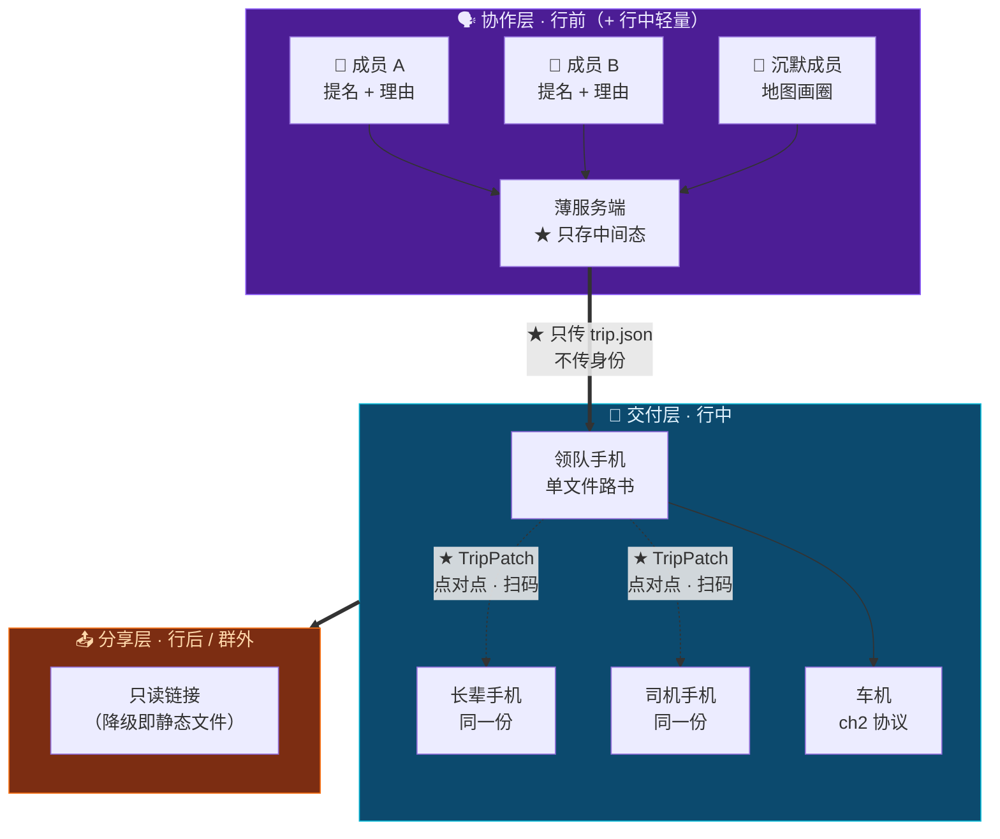

# 第 15 章 · 多端形态与协作层设计

> **本章性质**：产物形态与协作机制设计，**不涉及技术选型**。
> **回答的问题**：TripCraft 最终交付的到底是什么？一群人的意见，怎么收进来？发出去之后它还是原来那份东西吗？
> **与 [第 10 章](10-roadbook-reading-design.md)的分工**：ch10 设计的是**一份路书怎么读**；本章设计的是**一群人怎么共同产出它、产出之后它存在于几台设备上、以及它离开这群人之后变成什么**。这是三件事。
> **本章的三层**：协作层（[§15.5](#155--协作层的设计原则只负责收齐不负责裁决)~[§15.7](#157--同步模型后端只存中间态不存成品)）｜ 交付层（[§15.3](#153--拆成三层协作--交付--分享)~[§15.4](#154--pwa同时拿到是-app和零安装的那个解)，主体在 [第 10 章](10-roadbook-reading-design.md)）｜ 分享层（[§15.10](#1510--分享层四种对象三条不变量)，本章新增）
> **为什么单列一章**：全书到此为止，产品形态被默认成"一份静态文件"。**这个默认从未被论证过**，而它是错的——错的那一半，恰好是三件最有价值的事。
> **状态**：`Design Spec`

---

## 15.1 先把一个误区完整地勘正

> 🔴 **「最终产物是一个静态网页」——这句话只对了一半。而错的那一半，最贵。**

**对的一半**：路书这个**交付物**，确实必须是一个零安装、断网可读的文件。这一条不能动（[铁律 1](00-overview-and-glossary.md#铁律-1--零构建交付-zero-build-delivery) / [铁律 2](00-overview-and-glossary.md#铁律-2--单文件优先渐进增强-single-file-first-progressive-enhancement)）。

**错的一半**：**它把交付物当成了整个产品。**

TripCraft 不是"一个生成网页的工具"。它是**从「一群人想去哪」到「一群人走完了」的全程系统**。而在这个全程里，**三分之二的事情发生在"生成那份文件"之前和之后**——这两段时间里，一份静态文件完全无能为力。

> 📌 **具体地说，有三件事是静态文件永远做不到的：**

| # | 做不到的事 | 为什么做不到 |
| :--- | :--- | :--- |
| **1** | ★ **一群人各自提想法** | 静态文件是**产物**。产物意味着"已经决定了"。**而提想法发生在"还没决定"的时候** |
| **2** | ★ **行程改了，全车人都知道** | 静态文件在生成那一刻就冻结了。领队在路上改了明天的路线，**另外三台手机上是旧版本——而它们不会自己变** |
| **3** | ★ **分享出去的东西带着共同记忆** | 发一个链接出去，对方看到的是一份文档。**他看不到"这是姑姑坚持要加的"，也看不到"这个圈是爷爷画的"** |

> 🔑 **这三件事合起来，就是业主那句话的准确含义：**
>
> **它不是"静态网页体验不好"，是"静态网页只覆盖了旅行的一小段"。**
>
> **而覆盖不到的那两段里，藏着这个产品最难被抄掉的东西——一群人的共同决策。**

---

## 15.2 ⚠️ 但"那就做成 App"会撞上四堵墙

**第一反应是"那把产物做成 app"。这个反应是自然的，但它会撞上四堵墙——而且其中一堵，会直接取消掉这个产品的核心价值。**

| # | 墙 | 具体是什么 |
| :--- | :--- | :--- |
| **1** | 👴 **长辈** | [铁律 1](00-overview-and-glossary.md#铁律-1--零构建交付-zero-build-delivery) 的原始理由至今成立：**长辈不会为了看一份路书去装一个 app。** 子女可以帮他装一次——但"看行程"这件事本身不能有这个前置条件 |
| **2** | 🚗 **车机** | [第 2 章](02-cockpit-protocol.md)已核实：行驶中车机浏览器的第三方能力被 UX 限制屏蔽，且**没有车厂会为第三方应用做适配**。车机端能接收的只有页面与深链 |
| **3** | 🔴 **B 端白标** | ★ **一家地接社不可能为每条线路发一个 app。** 应用商店审核、企业签名、iOS/Android 双端维护——**这不是"麻烦"，这是物理上做不到**。而白标正是 [第 13 章](13-agency-partnership-design.md)的全部价值所在 |
| **4** | 📤 **群外分享** | 把行程发给不在群里的爸妈，对方得先装一个 app。**而"发过去就能看"是分享这件事的全部意义** |

> 🔴 **第三堵墙是决定性的，必须单独说：**
>
> **业主自己在 [§13](13-agency-partnership-design.md) 里已经确认过——TripCraft 最大的价值是"武装线下旅行社"。**
>
> **而"最终产物是一个 app"这句话，在逻辑上直接取消了白标的可能性：你没法让徐师傅的车队拥有一个自己的 iOS 应用。**
>
> **一个会取消自己核心价值的产品形态，无论体验多好，都是错的。**

---

## 15.3 ★ 拆成三层：协作 / 交付 / 分享

**正确的做法不是二选一，是承认这里有三件不同的事。**

| | 🗣 **协作层** | 📖 **交付层** | 📤 **分享层** |
| :--- | :--- | :--- | :--- |
| **时期** | 行前（+ 行中轻量） | 行中 | 行后 / 群外 |
| **谁在用** | 出行小团全体成员 | 全车人 + 司机 + 长辈 | 群外的人 |
| **在什么设备上** | ★ 手机（**可以是一个 app**） | ★ **任何能打开链接的设备** | ★ 任何设备 |
| **形态** | ★ PWA / 小程序 / 原生 | ★ **零安装**：链接、二维码、单文件 | ★ **只读链接** |
| **能不能有后端** | ✅ **可以** | ❌ **绝对不行** | 🟡 只读，可以无 |
| **法律定性** | ⚠️ **UGC 平台**（见 [§15.8](#158--这给法律面增加了三样东西)） | 工具产物 | 内容分发 |
| **铁律** | 铁律 4 **加强** | 铁律 1/2/3/5 **原文适用** | 铁律 3 |

> 🔑 **这三层不是同一个产品拆成三块。它们是三种不同的东西，只是共享同一份 DSL。**

**为什么"共享同一份 DSL"是关键**：因为[铁律 6](00-overview-and-glossary.md#铁律-6--dsl-是唯一真相源-single-source-of-truth) 说行程只存在于 `trip.json` 中。**只要这条成立，协作层怎么重、交付层怎么轻，都是实现自由度**——它们之间的接口是契约，不是代码。



> 🔴 **一条不变量，比这一章其他所有结论都重要：**
>
> **交付层永远不依赖协作层。**
>
> **协作层的服务端全部消失，已经发出去的路书必须照常工作——而且依然能通过 TripPatch 点对点更新。**
>
> 这条来自[铁律 5](00-overview-and-glossary.md#铁律-5--无后端可运行-backendless-by-default) 的红线，**一个字都不用改**。

---

## 15.4 ★ PWA：同时拿到"是 app"和"零安装"的那个解

**把 [§15.2](#152--但那就做成-app会撞上四堵墙) 的四堵墙和"用户想要一个 app"放在一起，能同时满足的形态只有一个。**

| 用户感知到的 | PWA 给不给 | 原生 app |
| :--- | :--- | :--- |
| 桌面图标、全屏无地址栏 | ✅ | ✅ |
| 离线可用 | ✅ | ✅ |
| 通知提醒 | ✅ | ✅ |
| 后台同步 | ✅ | ✅ |
| 相机 / 定位 | ✅ | ✅ |
| ★ **点链接即用，无需安装** | ✅ | ❌ |
| ★ **每家地接社一个自己的"app"** | ✅ **不需要上架** | 🔴 **做不到** |
| 双端维护成本 | ✅ **一份代码** | 🔴 两套 + 双份审核 |
| 更新 | ✅ 刷新即最新 | 🔴 等审核 |

> 🔑 **最后三行是决定性的，而且它们指向同一个方向：**
>
> **PWA 不是在"app 体验"上打折的妥协——它在"分发"这一项上，比原生 app 强一个量级。**

**对长辈**：家族群里发一个链接，**点开就在看**。子女想帮装的话，装完它就是一个带图标的 app。
**对车机**：交付层仍然是一个页面，[第 2 章](02-cockpit-protocol.md)的协议一个字不改。
**对地接社**：★ **「金马国旅 · 甘青 9 日」可以有它自己的图标、自己的启动画面、自己的名字，装在客户的手机桌面上——而金马国旅不需要注册开发者账号、不需要过审、不需要维护两套代码。**

> ⚠️ **一条诚实的边界，不能省：**
>
> **iOS 上，Web Push 需要用户先把页面"添加到主屏幕"才会生效**，且后台同步能力弱于原生。
>
> 所以有两条推论，它们都是[铁律 3](00-overview-and-glossary.md#铁律-3--降级不可耻白屏才是罪-degrade-never-blank) 的延伸：
>
> 1. **推送不能成为任何功能的唯一通道。**
> 2. **行中的关键提醒必须有一个不依赖推送的兜底**——最自然的一个是：**路书每次打开时自检一次**（有没有新 Patch、有没有今天的变更），这不需要任何权限。

---

## 15.5 ★ 协作层的设计原则：只负责"收齐"，不负责"裁决"

**这一节是本章最核心的产品判断。**

设计"多人提景点"时，几乎所有人的第一反应是做**投票**。

> 🔴 **投票是错的。而它错的方式，恰好是 [§8.8](08-socratic-interaction-design.md#88--多人意见冲突的对话设计) 已经解决过的那个问题。**

[§8.8.1](08-socratic-interaction-design.md#88--多人意见冲突的对话设计) 的立场是「**不调和，而是物理隔离**」——承认分歧，然后设计"分头行动"这个选项。那句设计说明写得很清楚：

> **"找一个满足所有人的方案"这条路在多数情况下不存在，强行找出来的结果是所有人都勉强接受——那是最差的旅行体验。**

**而投票就是调和。** 它把五个人的偏好压成一个数字，然后让少数派接受结果。

| | ❌ 裁决型（不做） | ✅ **收齐型（做）** |
| :--- | :--- | :--- |
| **机制** | 投票 / 打分 / 权重 | ★ **各自提名 + 各自说为什么** |
| **输出** | 一个排名 | ★ **一张"谁想要什么、为什么"的清单** |
| **少数派** | 被多数压倒 | ★ **被看见，且不会被抹掉** |
| **最后交给谁** | 交给算法 | ★ **交给 [§8.8](08-socratic-interaction-design.md#88--多人意见冲突的对话设计) 的呈现阶段，交给用户自己** |

> 🔑 **一句话：协作层解决的是"信息没被收集到"，不是"意见不一致"。**
>
> **意见不一致是 §8.8 的领地。而 §8.8 的解法是"把冲突说清楚"，不是"算出谁赢"。**
>
> **协作层一旦开始裁决，它就把 §8.8 好不容易守住的那条线从上游毁掉了。**

### 15.5.1 四条具体设计

```text
【甘青 9 日 · 我们的行程】                          7 人已提

🗣 姑姑   「一定要去塔尔寺，我妈信佛」      ← 有理由的必去
🗣 老张   「黑马河日出，我查了 6:20」       ← 有理由的必去
🗣 小美   「想去茶卡，但怕人多」            ← 带顾虑的想去
🗣 爷爷   （在地图上画了个圈 · 张掖）       ← ★ 沉默成员的表达
🗣 领队   「D5 要留半天给敦煌，前面得压」   ← ★ 这是约束，不是偏好

  ⚠️ 还有 2 人没提
```

**① ★「理由」是必填项——但不是靠强制表单，是靠 UI 引导。**

> **因为理由才是 AI 能处理的东西。**
>
> 「想去塔尔寺」是一个**愿望**；「我妈信佛」是一个**约束条件**。
>
> **愿望只能被满足或不被满足；约束条件可以被求解**——改到 D2、安排 2 小时、配一个讲解、避开法会人流高峰。
>
> **理由把"要或不要"变成了"怎么才能要"。这是整个协作层里最高杠杆的一个字段。**

**② ★ 沉默的人需要一种不用打字的表达方式。**

**爷爷不会打字。** 而他并不是没有意见——他只是不会用输入框表达。

> **所以：在地图上画一个圈。** 他只需要说"我想去这附近"，这不需要一个字。
>
> ⚠️ **这一条不是无障碍功能，是主力功能。** 一个家庭群里，**说得最少的那个人，往往是最需要被照顾的那个人**——而现行的所有产品都默认"你有意见就打字"。

**③ ★ 约束和偏好必须分开收。**

领队提的「D5 要留半天」**不是偏好，是硬约束**（[DSL 里的 `rigid`](04-dsl-specification-v1.md)）。把它混进偏好池里，会让后面所有判断都错——**优化的目标会从一个可行解变成一个不可行解。**

**④ ★「还有 N 人没提」必须显示。**

> **因为沉默不等于没意见。沉默通常意味着"我的意见不会被采纳"。**
>
> 一个不显示"还有谁没说话"的协作界面，会**系统性地放大嗓门大的人**——那不是去中心化，那是换了个人中心化。

### 15.5.2 ★ 提名界面：三个入口，一个必填字段

**先说结论：这个界面最重要的设计，是它没有"填完才能提交"这件事。**

§15.5.1 的四条原则必须**一一落在具体控件上**——对不上的原则等于没写：

| 原则 | 落在哪个控件上 | 怎么检验它对上了 |
| :--- | :--- | :--- |
| ① 理由是必填 | ★ **四个理由按钮**（点一个即完成"必填"） | 全程不打字可以走完一次提交 |
| ② 不用打字 | ★ **地图画圈入口** | 零文字的提名能生成一条合法记录 |
| ③ 约束与偏好分开 | ★ **入口分离**：「这是硬要求」是**另一个入口**，不混在理由按钮里 | 约束提名从不经过理由按钮 |
| ④ 沉默可见 | 清单页的 ⑤ 区（[§15.5.3](#1553--清单页收完之后长什么样)） | 未表态人数在每次提交后立即变化 |

#### 一条提名在协作层里存成什么（中间态，不是 DSL）

```jsonc
{
  "nominationId": "nm_7f3a",
  "by": "姑姑",                        // ★ 行程内昵称，不是账号（见 §15.10.3）
  "place": {
    "kind": "poi",                     // poi | area | unresolved
    "name": "塔尔寺",
    "coords": [101.5678, 36.4891],     // kind=area 时是圈心
    "geofenceM": 3000,                 // kind=area 时是半径（对应 place.geofenceM）
    "poiIds": { "amap": "B0FFG…" }
  },
  "reasonKind": "person",              // person | time | avoid | constraint
  "reasonText": "一位长辈有宗教需求",   // ★ 已过身份剥离，见下
  "intensity": "want",                 // must | want | maybe
  "state": "submitted",                // local_draft | submitted | merged | unmerged | conflict | unresolved
  "createdAt": "2026-10-08T21:04:00+08:00"
}
```

> 📌 **只有 `reasonKind` 是枚举，`reasonText` 是自由文本——这个分工是刻意的：枚举给机器，原文给人。**
>
> 机器需要知道"这条理由是关乎人、关乎时间、还是关乎避让"，才能把它喂给求解器；而人需要看到自己写的那句话**原样被保存**。
>
> ⚠️ `state` 里的 `local_draft` 不是"草稿箱"，是**同步失败的落点**——见 [§1.9.4](01-resilience-and-failover.md#194--第四类失效同步失败2026-10-08-增补)。

#### 三个入口，其实是三种人

| 入口 | 给谁用 | 产出 | 用户要做的 |
| :--- | :--- | :--- | :--- |
| **① 搜地点** | 说得出地名的人 | `kind: poi` | 选点 → 点一个理由按钮 → （可留空）补一句 |
| **② 地图画圈** | ★ **不会打字的人、说不清地名的人** | `kind: area` | **拖一个圈。零文字。** |
| **③ 说一句话** | 所有人 | 由 AI 反查为 ①②，**用户点头后**才落库 | 说一句"我想去个能看星星的地方" |

> ⚠️ **③ 的确认步骤不能省。** AI 反查会猜错，而它猜错的是**"我想去哪"**——这比排错一个时间严重得多：用户看到的是"我明明说想看星星，它给我排了个天文馆"。
>
> **凡是 AI 猜的东西，都要经过一次用户点头。** 这是 [§8.5 回显确认](08-socratic-interaction-design.md#85--回显确认整个设计里最重要的一个动作)在协作层的同一条规则。

#### ② 画圈的三个细节（这一节最容易被做坏的地方）

| 细节 | 设计 | 为什么 |
| :--- | :--- | :--- |
| **圈完之后** | 系统反查圈内的 3 个候选地点列出来；★ **同时提供「就是这一片」** | 反查是为了让后续排程拿得到坐标；「就是这一片」是为了**不逼一个不想做选择的人做选择** |
| **圈太大** | 半径 > 10 km 时提示"能再小一点吗"——★ **但不阻止提交** | 太大确实没法排（`place.geofenceM` 上限 10000 米），**但阻止提交＝把这个人重新变回沉默成员** |
| **圈在没有路的地方** | ★ 照收，标 `unresolved`，清单里显示「位置待确认」 | ★ **这是 [R4](#1583--必须先立住的四条红线) 的场景预演**：它可能正是一个野景点。**在这里收下它，然后在 §15.8 处理它，而不是在这里假装它不存在** |

#### 理由按钮：四个按钮就是四个 `reasonKind`

```text
为什么要去？

  [ 为了某个人 ]     [ 为了一件事 ]     [ 怕什么 ]     [ 这是硬要求 ]
      person              time            avoid         constraint

  再补一句：_______________________________   （可以留空）
```

> 🔑 **界面上不出现 `reasonKind`、`constraint`、`weight` 这些词。**
>
> **它们是我们求解器里的概念，不是用户的。** 用户不需要知道什么叫"约束条件"，他只需要点"为了某个人"——四个按钮的文案就是四种理由的**自然说法**。

> 📌 **"必填"是靠这四个按钮实现的，不靠表单校验。** 一个"请填写理由（必填）"的红色提示，只会让用户打四个字"就是想去"——**而那四个字对求解器的价值和空着一样**。

#### ★ 身份剥离：理由里一定有姓名，而协作层不收姓名

**"我妈信佛"是用户会写的第一句话。** 而[铁律 4](00-overview-and-glossary.md#02-十条设计铁律-the-ten-ironclad-rules) 说协作层里没有"谁是谁"。

所以理由在**离开设备的那一刻**（提交到协作层时）做一次改写：

| 用户写的 | 离开设备时变成 | 规则 |
| :--- | :--- | :--- |
| 我妈信佛 | **一位长辈**有宗教需求 | 关系词 → 人群标签 |
| 老王膝盖不好 | 一位同行者**膝盖不好** | 人名 → 「一位同行者」 |
| 我女儿 6 岁 | 一位 **6 岁**的小朋友 | 关系词 → 年龄 |
| 手机号 / 身份证号 | **删除**，并告知「已移除 1 处号码」 | 直接删 |

> 🔴 **三条边界，缺一条这条规则就会从保护变成伤害：**
>
> **1. 只在离开设备时改写，本机保留原文。** 本机是用户自己的设备——[铁律 4](00-overview-and-glossary.md#02-十条设计铁律-the-ten-ironclad-rules) 保护的对象是"**不出设备**"，**没有任何理由在用户自己的手机上改写他写的字**。
>
> **2. 改写必须可见、可撤销。** 提交后显示：「为了让同行的人知道该怎么安排，写成了『一位长辈有宗教需求』——[ 改回原话 ]」。**不静默改写**（[铁律 8](00-overview-and-glossary.md#铁律-8--拒绝静默失败-never-fail-silently)）。
>
> **3. 改写会失真，而失真必须能被看见。** 「我朋友的舅舅在张掖开客栈」会被改写成「一位当地人」——**这句话已经丢掉了信息**。所以第 2 条的"改回原话"不是礼貌，是**功能**。

> ⚠️ **为什么值得为这件事单独做一个界面：** 不这样做，协作层的服务端上会**积累起一张家庭关系图**——而它是用户主动写下的，我们没有任何理由收。
>
> **"我们不收"是一个可以在存储层断言的承诺；"我们会保密"不是。** 这是[铁律 4](00-overview-and-glossary.md#02-十条设计铁律-the-ten-ironclad-rules) 在协作层能给出的最强形态。

### 15.5.3 ★ 清单页：收完之后长什么样

**§15.5.1 那张图回答的是「收什么」，这一节回答「收完之后屏幕上是什么」。**

```text
【甘青 9 日 · 我们的行程】            7 人已提 · 还有 2 人没表态

━━ ① 硬要求（1） ──────────────────────────────────────────
  🧭 领队   D5 要留半天给敦煌 —— 莫高窟的票是分时的
            ↳ 已排入 D5 · 前序日期需压缩

━━ ② 想去，且都带着理由（3） ────────────────────────────────
  🌿 姑姑   塔尔寺 —— 一位长辈有宗教需求
            ↳ 已排入 D2 · 停留 2 小时
  🌅 老张   黑马河日出 —— 查了 6:20 日出，得住湖边
            ↳ 待定：住宿未定
  🧂 小美   茶卡盐湖 —— 想去，但怕人多
            ↳ ⚠️ 带顾虑 · 见 ④

━━ ③ 说不清地名，画了个圈（1） ──────────────────────────────
  ⭕ 爷爷   （张掖一带 · 半径约 3km）
            ↳ 已排入 D2 下午 · 位置待细化

━━ ④ 顾虑（1） ────────────────────────────────────────────
  ⚠️ 小美   怕人多 —— 茶卡 10 点后是高峰
            ↳ 建议开门即入（7:00）

━━ ⑤ 还没有表态（2） ──────────────────────────────────────
  👥 两位同行者            [ 提醒一次 ]   [ 代录 ]
```

**①~⑤ 是内容类别，不是排序。** 组内按提交时间倒序，**不按任何评分**。

#### 绝不显示的六样东西（这是红线，不是审美）

| 绝不显示 | 它长什么样 | 为什么它是投票换了一张皮 |
| :--- | :--- | :--- |
| **1 · 支持人数** | 「3 人想去」 | ★ **人数是最隐蔽的投票**——它一次点击都不用投，效果和投票完全一样 |
| **2 · 排序 / 名次** | 把清单按"重要性"排 | 排序就是一轮投票，只是裁判换成了算法 |
| **3 · 百分比** | 「67% 的人选了青海湖」 | 百分比是人数换了个说法 |
| **4 · 进度条 / 完成度** | 「意见已收集 78%」 | 它暗示"到 100% 就自动出结果"——**而没有任何东西会自动出结果** |
| **5 · 热度 / 点赞** | 心形图标、🔥 | 它把偏好变成社交表演，而**先表态的人会影响后面的人**——这正是沉默的成因 |
| **6 · 任何可比较的数值** | 分数、星级、排名徽章 | 同 1~5 |

> 🔴 **可以压成一句话：清单里不出现任何可比较的数值。**
>
> 这不是清高。**是因为只要出现一个可比较的数值，用户就会去优化那个数值**——多拉一个人支持、多提一个点、把话说得更重。**而优化出来的结果不代表任何人的真实意愿。**
>
> **§15.5 的全部前提是"被听见"，不是"赢了"。**

#### 「谁」怎么显示：昵称 + 自选符号，★ 没有头像

| ✅ 显示 | ❌ 不显示 |
| :--- | :--- |
| 行程内昵称（"姑姑""老张"，**成员自己填**） | **头像** |
| 一个自选符号 / 颜色（承担"一眼认出谁是谁"） | 真实姓名、手机号、单位 |
| 提交时间（可追溯，[铁律 9](00-overview-and-glossary.md#铁律-9--一切可存证-everything-attestable)） | 任何跨行程可见的东西 |

> 🔴 **"没有头像"不是"暂不支持"，是设计上排除。**
>
> **头像是照片。** 照片是[铁律 4](00-overview-and-glossary.md#02-十条设计铁律-the-ten-ironclad-rules) 保护清单上的第一号对象，而协作层的服务端**根本不需要它**——自选符号已经承担了"一眼认出谁是谁"的全部功能。
>
> **能用一个 emoji 满足的需求，不要用一个上传接口去满足它。**

#### ★ 沉默有三种，绝不能合并成"没意见"

| 表达 | 实际含义 | 系统怎么用 |
| :--- | :--- | :--- |
| **地图画了个圈** | ★ **有意见，但不会打字** | **与打字提名完全等价**：同一份清单、同一条排程、同一个优先级 |
| **「我都可以」** | ★ **真的没有偏好** | 冲突时他可以被安排在任意一边——**这是一个有用的信息，不是缺席** |
| **什么都没做** | **未知** | ★ **不推定。** 显示在 ⑤，不参与任何判断 |

> 🔴 **三种里最危险的一次合并，是把"什么都没做"当成"我都可以"。**
>
> 因为它会**替一个没说话的人做决定**——而 §15.5 存在的全部理由，就是不让这件事发生。
>
> **"我都可以"是用户说了的一句话；"没表态"是用户没说。** 在数据上它们必须是两个值（`flexible` vs `unknown`），在界面上也必须是两行。

#### ⑤ 区的三个动作，以及第十八天怎么办

| 动作 | 什么时候 | 约束 |
| :--- | :--- | :--- |
| **提醒一次** | 提交期开始后 24h、出发前 7 天，各一次 | ★ **只有两次。** 反复提醒会把"我都可以"的人逼成随便应付的人 |
| **代录** | 有人当面告诉领队 | ★ **必须显示「王姐代录」**——代录的内容不能长得像本人说的 |
| **到期继续** | 到生成时刻仍未表态 | ★ **沉默不阻塞生成，但沉默会被写进产物**（[§15.5.5 L-1](#1555--从清单到-tripjson每一步的落点)）："还有 2 人未表态"要跟着路书走 |

> 📌 **"不阻塞，但不隐藏"是这一节的最后一条设计。**
>
> 反过来的两种做法都更省事，也都更糟：**阻塞**会让整趟行程被一个人拖着；**隐藏**会让产物看起来像"全体一致同意"——**而它不是。**

### 15.5.4 ★ 接缝：清单在哪里变成 §8.8 的冲突

**清单不是冲突。清单只是一堆"想要"。冲突在把它们排进同一个日历的时候才出现。**

```text
清单（收齐） ──① 触发──▶ 冲突候选 ──② 分类──▶ §8.8 的解法 ──③ 呈现──▶ 用户拍板
   §15.5                   §15.5.4                §8.8.2 / §11.4.3        §8.8.3
```

#### ① 触发：三条规则，取代"AI 感觉这里有冲突"

| 规则 | 判据（可检验） | 例子 |
| :--- | :--- | :--- |
| **R-a · 资源互斥** | 两条提名要求**同一时段的独占资源** | 黑马河 6:20 的日出机位 vs 一位长辈 7:30 才起得来 |
| **R-b · 刚性对撞** | 提名与 `constraints.hard[]` 或 `anchor` 直接冲突 | 想去纳木错 vs `maxAltitudeM: 3800` |
| **R-c · 人群不适** | 提名对某人群的 `partyFit.score` 低于阈值，或超出该人群的 `maxWalkMeters` | 需步行 4 km vs 长辈的步行上限 |

> ⚠️ **只有这三条会生成冲突候选。**
>
> 这一条比它看起来重要：**没有明确判据的"智能冲突检测"，会把"两个人只是偏好不同"也报成冲突**——而多数偏好差异**根本不需要解决**（一个想拍照、一个想喝茶，可以同时发生）。
>
> **假冲突比漏报更贵：它消耗的是用户对冲突提示的信任。** [§8.8.1](08-socratic-interaction-design.md#881-设计立场不调和而是物理隔离)已经说过：多数"冲突"其实是可以同时发生的两件事。

#### ② 分类：候选挂到 §8.8 / §11.4 的四种冲突上

| 冲突候选 | 归到哪一类 | 允许的解法 |
| :--- | :--- | :--- |
| R-a 资源互斥 | **时间冲突** | 分头行动 · 显式二选一 |
| R-c 人群不适 | **强度冲突** | 分组路线 + 汇合点 |
| R-b 刚性对撞 | **取舍冲突** | 显式二选一——★ **代价必须写出来** |
| ★ **后果落到身体上**（饿、困、高反、超时） | ★ **生理冲突**（[§11.4.3](11-audience-adaptive-rendering.md#1143-冲突的四种类型)第四类） | ⚠️ **不允许"就这样吧"这一项** |

> 🔴 **生理冲突必须在协作层就被标出来，而不是留给 §11.4 的视角渲染。**
>
> 因为 §11.4 的冲突可视化是**给用户看的**——而"什么该被看见"是在协作层决定的：**一个没被收上来的理由（"我妈胃不好，不能 21 点吃饭"），在 §11.4 里根本没有素材可呈现。**
>
> **[§11.4](11-audience-adaptive-rendering.md#114--冲突可视化) 是镜头，§15.5 是底片。底片上没有的东西，镜头再好也拍不出来。**

#### ③ 负向规则：冲突候选里不得出现"谁应该让步"

冲突候选只允许描述冲突本身——**哪两件事撞了**（`a` / `b`）和 **为什么撞**（`evidence`）。

> 🔴 **不允许出现「受影响较小的一方」「建议让步方」这类字段。**
>
> 因为**字段一旦存在，它一定会被渲染出来**。而 [§8.8.4](08-socratic-interaction-design.md#884-权重冲突当冲突无解时) 已经写下了那句话：
>
> > 「这种时候谁说了算，**你们自己最清楚，我不替你们做决定**。」
>
> **替用户选出让步方，等于把 §8.8.4 那句话从产品里删掉**——而它是整个设计立场（§8.8.1「不调和」）的最后一道闸门。

#### ④ 时序：清单会继续长，而它**不能再生成一次路书**

**总有人是第八天才提的**——而且往往是那个一直在观望的人。

| 时刻 | 发生了什么 | 走哪条路 |
| :--- | :--- | :--- |
| 生成前 | 清单增长 | 正常收集 |
| **生成后** | ★ **新增一条提名** | ★ **走 [§1.6.5](01-resilience-and-failover.md#165-输出是补丁不是新路书) 的补丁路径，不重新生成** |

> 📌 **理由和 [§1.6.5](01-resilience-and-failover.md#165-输出是补丁不是新路书) 里那三条一样：体积、可审阅、可回滚。**
>
> 而这里多一条**更重要的**：**重新生成会把"我们已经商量好的那些决定"全部冲掉。**
>
> 行程不是一份文档的 v2——**它是一群人已经达成的共识**。改一个点，不该让所有人重读一遍。

### 15.5.5 ★ 从清单到 trip.json：每一步的落点

**协作层的界面可以做得再重，它交给下游的只有一样东西：一份 `trip.json`。**（[§0.4.1 不变量 5](00-overview-and-glossary.md#041--2026-10-08-增补图外的那一层)）

那就得逐项对一遍：**清单里的每一样东西，在今天这份契约里有没有家。**

| 清单里的东西 | DSL 落点 | 现在能不能落 |
| :--- | :--- | :--- |
| 提名的地点（说得清） | `days[].nodes[]` · `place.{name, coords}` | ✅ |
| 画圈的地点（说不清） | `place.coords`（圈心）+ `place.geofenceM`（半径）+ `tentative: true` | ✅ **字段都在**（`geofenceM` 上限 10000 米） |
| 硬要求 | `constraints.hard[]`（带 `scope: group:xxx`）或节点 `time.rigidity: "rigid"` | 🟡 `scope` **只存在于 hard** |
| 「想去」的偏好 | `constraints.soft[]` | 🔴 **`softConstraint` 上没有 `scope`**——装不下"姑姑想去"和"老张想去"的区分 |
| **理由（为什么想去）** | —— | 🔴 **没有家** |
| 顾虑（"怕人多"） | —— | 🔴 没有家（`advice.avoid[]` 是**我们的**建议，不是用户的顾虑，语义相反） |
| **没被采纳的提名** | —— | 🔴 **没有家**——而 §15.5 的"不被抹掉"靠的正是它 |
| 「同行者提议 · 未核验」 | `advice.generatedBy` | 🔴 **[OI-018](00-overview-and-glossary.md#07-未决事项登记册-open-issues-register)**（`crowdsourced` 的语义相反） |
| 署名（谁提的） | `notes[].visibleTo`（`public \| leader \| agency \| driver`） | ⚠️ 枚举里**没有"群内成员"这一档** |
| 沉默 / 未表态 | —— | ✅ **刻意不落**：不表态不是行程数据 |

> 🔴 **这一节测出来的是本章最硬的一个结论：**
>
> **协作层需要往 `trip.json` 里写五样东西，而契约里只有两样半有家。**
>
> 已合并登记为 **[OI-019](00-overview-and-glossary.md#07-未决事项登记册-open-issues-register)**，**与 [OI-018](00-overview-and-glossary.md#07-未决事项登记册-open-issues-register) / [OI-010](00-overview-and-glossary.md#07-未决事项登记册-open-issues-register) 同批，必须在 v1.0.0 冻结前一起解决。**
>
> ⚠️ **而"没有家"有一个必须现在就说清的性质：它不是"技术上以后再补"。**
>
> 因为**契约的形状决定了协作层能收什么**。如果契约里没有装"理由"的地方，那么这一章设计的整个协作层，**最终会退化成一份"景点候选列表"**——而 C-11（理由是最高杠杆的字段）当场作废。

#### 一个提名走完全程的样子

```jsonc
// ① 协作层的中间态（不进产物）—— §15.5.2 的 Nomination
{ "nominationId": "nm_7f3a", "by": "姑姑",
  "place": { "kind": "poi", "name": "塔尔寺", "coords": [101.5678, 36.4891] },
  "reasonKind": "person", "reasonText": "一位长辈有宗教需求",
  "intensity": "want", "state": "merged" }

// ② 编译进 DSL 之后
{ "days": [ { "dayIndex": 2, "nodes": [ {
      "id": "n_d2_04", "type": "poi", "seq": 4,
      "time": { "planned": "14:00", "durationMin": 120, "rigidity": "soft" },
      "place": { "name": "塔尔寺", "coords": [101.5678, 36.4891] },
      "notes": [
        { "tone": "info", "text": "一位同行者提议 · 未核验", "visibleTo": ["public"] }
        // 🔴 OI-019：「姑姑」这个署名在这里没有合法的落点
      ]
  } ] } ] }
  // 🔴 OI-019：这条提名对应的偏好，需要 constraints.soft[] 上的 scope —— 而它不存在
```

> ⚠️ 上面标 🔴 的两处是**当前契约装不下**的部分，不是笔误。**这一段在 v1.0.0 冻结前跑不通。**
>
> 登记 OI-019 不是为了记录一个缺陷，而是为了**让契约的改动有明确的验收对象**：能装下这两行，OI-019 才算收敛。

#### 四条落库规则

| # | 规则 | 为什么 |
| :--- | :--- | :--- |
| **L-1** | ★ **没被采纳的提名也必须进产物** | "被看见"如果只存在于协作层，那它**只活到行程结束**（[§15.9](#159--与-b-端白标的关系这个形态反而加固了第-13-章)：行程空间到期销毁）。**三个月后回看时，少数派的话不能已经消失。** |
| **L-2** | 署名跟着内容走，但**只在群内可见** | 分享链路上的降级见 [§15.10](#1510--分享层四种对象三条不变量) |
| **L-3** | 理由按**剥离后的版本**入库 | 它是重算的输入——[§1.6](01-resilience-and-failover.md#16-中断处理爆炸半径与局部重算)要按"为什么"判断这个点能不能改、能不能挪 |
| **L-4** | 未定的提名**不得落成硬排** | `tentative: true` + `tentativeReason` 必须跟着走（[§8.7.3](08-socratic-interaction-design.md#873-待定项在产物里怎么标记)）——否则一个"待定住宿"会变成一份看起来已经定好的行程 |

> 🔑 **§15.5 的收尾只有一句话：协作层不产出 DSL 之外的东西。**
>
> 它可以把界面做得再重，但它交给下游的**只有一个 JSON**。这不是洁癖——**它是"三层可以各自独立演化"的唯一原因**（[§0.4.1 不变量 5](00-overview-and-glossary.md#041--2026-10-08-增补图外的那一层)）。
>
> **只要这条成立，协作层明天整个换掉，交付层一个字都不用改。**

---

## 15.6 ★ 去中心化：不是网络拓扑，是决策权分布

**"去中心化的多人合作"这句话里，装了两个完全不同的东西。必须拆开。**

| | **A · 组织上的去中心化** | **B · 技术上的去中心化** |
| :--- | :--- | :--- |
| **含义** | 不是领队一个人说了算，人人可提 | 没有中心服务器，设备之间直接同步 |
| **解决的是** | ★ **"我的想法没人听"** | 数据主权 / 抗审查 / 无单点故障 |
| **对不对** | ✅ **完全正确，且这正是 [§15.5](#155--协作层的设计原则只负责收齐不负责裁决) 在做的事** | 🟡 **部分正确，但不能全盘** |
| **成本** | 低 | 🔴 高，且与三件事直接冲突 |

**B 读法做不到的三件事：**

| 做不到 | 为什么 |
| :--- | :--- |
| **推送提醒** | 需要有东西在后台醒着，并找到那台设备 |
| **群外分享** | 群外的人不在你的网络里 |
| **B 端白标与计费** | 地接社要的是"我的品牌、我的账"——这必然存在一个中心 |

> 🔑 **所以准确的表述是：TripCraft 在「决策权」上去中心化，在「数据」上中心化到最小。**
>
> **业主真正在意的从来不是"有没有服务器"，是"我的想法会不会被听见"和"我的数据会不会被拿走"。**
>
> **这两件事不需要靠 P2P 解决。而把它们混为一谈，会为了一个不需要的东西付出巨大的架构代价。**

### 15.6.1 ★ 而"点对点同步"这块拼图，书里已经有一块现成的

回看 [`spec/patch.schema.json`](../spec/patch.schema.json) 的设计说明，原文写着：

> **「核心用途：在无网络环境下（戈壁、垭口、无人区）通过二维码或 URL fragment 在车队之间点对点分发路况变更，完全不依赖任何服务器。」**

> 📌 **这就是一个已经设计好的、无服务器的、去中心化的同步原语。**
>
> **它当初只被用在"路况变更"这一个场景上。**
>
> **而它需要做的事情，对"路况变了"和"姑姑加了个点"来说是完全一样的——都是"一份已分发的 DSL 的最小化修改"。**

**所以去中心化同步这件事，不需要新造轮子：**

| 场景 | 同步方式 | 依赖服务器吗 |
| :--- | :--- | :--- |
| 行前：群里提景点 | 协作层实时同步 | ✅ 需要 |
| ★ **行中：领队改了明天的路线** | ★ **生成 TripPatch → 推给全车** | 🟡 推送需要；**接收端应用 Patch 不需要** |
| ★ **无人区：车队之间互传** | ★ **二维码 / URL fragment 点对点** | ❌ **完全不需要** |
| 行中：打卡、账本 | 协作层（可选） | ✅ 需要 |
| ★ **断网的那台设备** | ★ **看旧版本，照常可用** | ❌ 不需要 |

> 🔑 **注意第三行和第五行。**
>
> **在戈壁滩上，同步这件事退化成"两台手机对着扫一个二维码"——而这条路 [第 4 章](04-dsl-specification-v1.md)已经铺好了。**
>
> **这就是[铁律 3](00-overview-and-glossary.md#铁律-3--降级不可耻白屏才是罪-degrade-never-blank) 在同步问题上的形态：同步不上，行程照常读；同步上了，行程变得更准。**

> ⚠️ **但"退化成一个二维码"这句话，只在两端**都还记得要同步**时才成立。**
>
> 补丁传不过去、或者一端改了另一端没改——**两份路书就分叉了，而两边的界面都"正常"。** 这一类失效（**副本不一致**）不属于 DL0–DL4，它的可见形态与三条硬规则见 [§1.9.4](01-resilience-and-failover.md#194--第四类失效同步失败2026-10-08-增补)：**修订号必须可见 · 陈旧度必须显示 · 冲突不得静默覆盖。**

---

## 15.7 ★ 同步模型：后端只存中间态，不存成品

**"多端同步"必然需要一个后端。问题是它存什么。答案是一张清单：**

| 数据 | 存在哪 | 生命周期 | 敏感度 |
| :--- | :--- | :--- | :--- |
| 群成员的提名与理由 | ★ **协作层（薄服务端）** | **行程结束后 N 天销毁** | 🟢 低——「想去青海湖」不是敏感信息 |
| 合并后的需求清单 | ★ 协作层 | 同上 | 🟢 低 |
| 成型的 `trip.json` | ★ **用户设备** | 用户自己决定 | 🟡 中 |
| **身份信息 / 照片 / 轨迹** | ★ **永不进入协作层** | —— | 🔴 高 —— [铁律 4](00-overview-and-glossary.md#铁律-4--数据主权本地化-local-data-sovereignty) |
| 已编译的路书 | ★ **用户设备 / CDN 静态** | 永久，零依赖 | 🟢 低（已脱敏） |

> 🔴 **一条硬规则：协作层里流动的只有「想去哪」和「为什么」，没有「谁是谁」。**
>
> 这一条同时解决两件事：
>
> 1. **[铁律 4](00-overview-and-glossary.md#铁律-4--数据主权本地化-local-data-sovereignty) 的加强条款**：身份、照片、轨迹永远不出设备——**而协作层根本不需要它们。**
> 2. **⭐ [§3.2.2](03-b2b-agency-operations.md#322--关键设计决策游客没有账号)「游客没有账号」不被破坏**——见 [§15.9](#159--与-b-端白标的关系这个形态反而加固了第-13-章)。

---

## 15.8 ⚠️ 这给法律面增加了三样东西

> 🔴 **这一节是全章最需要警惕的部分。它增加的是全书唯一一个 P0 级风险域。**

**协作层让 TripCraft 从一个"工具"变成了一个"有用户内容的平台"。这个转变带来的法律新增面，[第 7 章](07-legal-and-compliance.md)现有的免责体系完全没有覆盖——因为 §7 的全部设计都假设：内容是 AI 生成的，或者地接社给的。**

| # | 新增面 | 为什么是新的 |
| :--- | :--- | :--- |
| **1** | ★ **UGC 内容责任** | 群成员可以提交景点、文字、图片。**平台对用户提交的内容负有审核义务**——而 §7 现有体系里没有这个角色 |
| **2** | 🔴 **"野景点"推荐** | ⚠️ **这是最要命的一条**——见下 |
| **3** | 🔴 **"群"本身让 [OI-016](00-overview-and-glossary.md#07-未决事项登记册-open-issues-register) 的风险升级** | 见下 |

### 15.8.1 ⚠️ 为什么"野景点"是新的、而且是重的

**如果群里有人推荐一个未开发的、有真实危险的地点**（无人区穿越、野长城、废弃矿洞、未开放的保护区），**而产品把它结构化地排进了一份看起来权威的路书里**——

> 🔴 **平台的责任性质，与"转发一条微信消息"完全不同。**
>
> **因为路书是我们的产物。它带着编辑责任。**
>
> 一个人在微信群里说"那个沟能进去"，那是**他个人的言论**。而同样一句话，被排进一份带海拔剖面、带熔断预案、带"建议上午去"的路书里——**它就变成了产品的主张。**
>
> **而[铁律 7](00-overview-and-glossary.md#铁律-7--事实与建议分离-fact-vs-advice) 的整套事实/建议分离机制，在这句话上会失效——因为它既不是事实（我们没核验），也不是我们的建议（是用户提的）。**

### 15.8.2 🔴 为什么"群"让 OI-016 升级

> **在协作层出现之前，「为无证经营提供便利」是一个 B 端风险**——管的是一个地接社在平台上怎么用工具，靠审慎的合同设计就能控制（[§13.5.4](13-agency-partnership-design.md#1354--一个必须先回答的问题他有资质吗) 的 G-24~G-27）。
>
> **在协作层出现之后，它变成了一个 C 端风险。**
>
> **因为产品里第一次出现了"一群人聚在一起、有人牵头、可以互相收钱"的完整闭环。**
>
> 而这恰恰是《旅游法》与各地文旅执法明确打击的对象——已核验的执法口径写着：**「为非法活动提供引流、收款、客源对接等便利的，一并查处」**（见 [§7.11](07-legal-and-compliance.md)）。

### 15.8.3 ★ 必须先立住的四条红线

**这四条写在 [§7](07-legal-and-compliance.md) 之前，因为它们是产品形态决定的，不是法务条款决定的：**

| # | 红线 | 具体条款 |
| :--- | :--- | :--- |
| **R1** | 🔴 **协作层不提供任何收款能力** | 没有 AA 收款、没有"打给领队"、没有团费分摊、没有转账。**账本只做记账，不做支付**——这是 [OI-016](00-overview-and-glossary.md#07-未决事项登记册-open-issues-register) 在 C 端的直接封堵 |
| **R2** | 🔴 **不提供"组团"语义** | 协作层的单位是**"一个已经成形的行程"**，不是"一个可以拉人加入的团"。**没有公开的"找团 / 组队 / 拼团"入口**；加入方式是邀请制，且必须由已有成员发起 |
| **R3** | ★ **领队身份不产生任何产品特权** | 不显示"领队"头衔、不给专属标识、不做领队主页、不做领队信用分。**他只是一个普通成员，恰好是最早建这个行程的人**——这与 [§13.3.3](13-agency-partnership-design.md#1333-三条不越线)「不做撮合」是同一个动作 |
| **R4** | ⚠️ **用户提交的景点必须可区分** | 未经验证的提交**默认标记为「同行者提议 · 未核验」**，且与"系统建议"、"地接社情报"在视觉上必须不同。**这是[铁律 7](00-overview-and-glossary.md#铁律-7--事实与建议分离-fact-vs-advice) 在协作场景的第三个类别** |

> 🔑 **R4 值得单独看一眼，因为它是一条"设计即合规"的条款：**
>
> **[铁律 7](00-overview-and-glossary.md#铁律-7--事实与建议分离-fact-vs-advice) 原来只有两个类别：事实、建议。**
>
> **协作层带来了第三个类别：「同行者提议」。它既不是事实，也不是我们的建议——而它必须长得和前两个都不一样。**
>
> **这不是新增一条铁律，是原有铁律在一个新场景里自然长出来的一维。**

> 🔴 **而它立刻撞上了契约——这是一个必须现在登记的发现：**
>
> 回查 [`spec/node.schema.json`](../spec/node.schema.json)，`advice` 里有一个字段：
>
> ```json
> "generatedBy": { "enum": ["llm", "human", "hybrid", "crowdsourced"] }
> ```
>
> **`crowdsourced`（众包）看起来能覆盖「同行者提议」，但它的语义是相反的。**
>
> | | `crowdsourced` | **「同行者提议」** |
> | :--- | :--- | :--- |
> | 权威来自 | ★ **数量**（"大家都推荐"） | **一个具体的人**（姑姑） |
> | 隐含信号 | 已经被很多人验证过 | ⚠️ **完全未核验** |
> | 数量 | 很多 | **一个** |
>
> > 🔴 **用错这个枚举值，比新增一个值危险得多——因为它会把一个未核验的单人提名，渲染成看起来像共识的东西。**
> >
> > **而 §15.8.1 已经论证过：产品的主张责任，正是从这个"看起来像共识"里长出来的。**
>
> → 已登记为 **[OI-018](00-overview-and-glossary.md#07-未决事项登记册-open-issues-register)**，**与 [OI-010](00-overview-and-glossary.md#07-未决事项登记册-open-issues-register) 同性质：两者都打在 `trip.schema.json` 上，必须在 v1.0.0 冻结前一起解决。**

---

## 15.9 ★ 与 B 端白标的关系：这个形态反而加固了第 13 章

**"做了 C 端 app，不就和地接社抢客户了吗？"——这个担心是对的，但它针对的是"平台"，不是"群"。**

| 担心 | 实际情况 |
| :--- | :--- |
| "有了账号就破坏 [§3.2.2](03-b2b-agency-operations.md#322--关键设计决策游客没有账号) 游客没有账号" | ★ **不需要全局账号。** ★ **邀请链接本身就携带身份**——一次行程一个身份，行程结束即失效 |
| "做了 C 端就变成 C 端公司了" | ★ **协作层的单位是"一个已存在的行程"，不是"一个游客"**——见下表 |
| "PWA 装上去了那还算白标吗" | ★ **恰恰更强。** 白标的 PWA 装到客户手机桌面上，**图标是地接社的**——这是原生 app 给不了的 |

### ★ 关键区分：协作层像"群"，不像"平台"

| | ❌ 平台（不做） | ✅ **群（做）** |
| :--- | :--- | :--- |
| **入口** | 应用商店 / 首页 / 搜索 | ★ **一条邀请链接** |
| **身份** | 注册一个长期账号 | ★ **一次行程一个身份，行程结束即失效** |
| **归属** | 用户是"平台的用户" | ★ **用户是"这个行程的成员"** |
| **发现** | 可以逛、可以搜、可以推荐给别人 | ★ **没有任何发现机制** |
| **生命周期** | 永久 | ★ **行程结束后 N 天自动销毁** |

> 🔑 **这个区分同时解决三件事：**
>
> 1. **对地接社**：我们不是一个能把你客户带走的平台——**因为产品里根本不存在一个"可以逛的地方"。**
> 2. **对[铁律 4](00-overview-and-glossary.md#铁律-4--数据主权本地化-local-data-sovereignty)**：没有长期账号，就没有长期数据归集。
> 3. **对[§7](07-legal-and-compliance.md)**：没有公开可发现的内容，UGC 的传播范围被物理限制在一次行程的规模内——**这直接决定了 [§15.8](#158--这给法律面增加了三样东西) 里三项风险的量级。**

> ⚠️ **然后必须说一句诚实的代价：**
>
> **这个选择放弃了网络效应最强的那一部分。**
>
> 一个"可以逛的旅行社区"是 C 端增长最快的形态——**这里明确不做。**
>
> **理由和 [§13.8.6](13-agency-partnership-design.md#1386--但这个选择有代价它意味着我们不是一家消费级-ai-公司) 是同一个：一旦做了，TripCraft 就变成了一家 C 端消费公司，而它的 B 端价值会同时蒸发。**
>
> **这不是疏忽，是一个标了价的放弃。**

---

## 15.10 ★ 分享层：四种对象，三条不变量

**这一层在第 15 章的三层图里出现了，但它一直没有被设计过。**

它被漏掉的原因值得先记一笔：**它长得太像三件已经解决过的事了**——[§10.6.2 分享形态](10-roadbook-reading-design.md#1062-分享形态)、[§3.6 访问控制与分享版](03-b2b-agency-operations.md#36-访问控制与分享版)、[§11.6.1 分享单个视角](11-audience-adaptive-rendering.md#1161-分享单个视角)。

> 🔑 **但那三处回答的是同一个问题的前半段：「哪一种文件，发给谁」。**
>
> **这一节要回答的是后半段，而它从来没被问过：**
>
> ### **发出去之后，它还是原来那份东西吗？**
>
> 拆成三个可检验的问题：**共同记忆还在不在？未核验的标注还在不在？它会不会悄悄变成第二个入口？**

### 15.10.1 四种对象

| 对象 | 谁在看 | 拿到什么 | 署名 | 可写吗 | `access` 落点 |
| :--- | :--- | :--- | :--- | :--- | :--- |
| **① 群内** | 行程空间里的同行者 | 完整交付层 + 清单的"谁提的" + 可切视角 | 行程内昵称 | 产物只读；**提名走协作层** | `link_token` |
| **② 群外** | 亲友、同事（不在行程里） | 精编版：内容在，**署名默认匿名** | 「一位同行者」 | ❌ 只读 | `link_token` |
| **③ 公开** | 任何人（朋友圈 / 小红书） | 海报长图 / 摘要页 | 无 | ❌ 只读 | `public`（或根本不含链接） |
| ★ **④ 回看** | **三个月后的成员自己** | 交付层 + 回忆录（[第 6 章](06-memory-journal-engine.md)）+ **决策档案** | 行程内昵称 | 本地可编辑 | 无需链接 |

> ★ **④「回看」是这一节新提出的一种对象**，因为前面三种都默认"分享是给别人看的"。
>
> **而回看是分享给三个月后的自己。**
>
> 它也是**唯一一种用得上"为什么"的对象**：行中没人看理由——[§10.5.2](10-roadbook-reading-design.md#1052-行中模式的四条设计)已经说过，行中模式需要的是"下一步去哪"。
>
> **理由的价值全部在行后**：它是「我们当时是怎么决定的」的唯一记录。而这份记录**只有在协作层收过理由的前提下才存在**——见 [§15.5.5 的 L-1](#1555--从清单到-tripjson每一步的落点)。

#### ★ 一个必须当场解决的张力：共同记忆要署名，而铁律 4 不收身份

「这是姑姑坚持要加的」——**这句话的价值全在"姑姑"两个字上**。删掉它，分享出去的就只是一份普通路书。

而[铁律 4](00-overview-and-glossary.md#02-十条设计铁律-the-ten-ironclad-rules) 说协作层里没有"谁是谁"。**这不是二选一——是"身份"和"昵称"被混成了一件事：**

| | 身份 | **行程内昵称** |
| :--- | :--- | :--- |
| 是什么 | 真实的人（账号 / 手机号 / 姓名） | 一次行程里临时起的名字（"姑姑""老张"） |
| 生命周期 | 跨行程、跨设备、**平台可关联** | ★ **只属于这一次行程，行程结束即失效** |
| 铁律 4 | 🔴 **永不进入协作层** | ✅ **可以**——它不指向一个可追踪的人 |
| 谁决定 | 平台 | ★ **成员自己填** |

> ⚠️ **必须诚实标注这个设计的残留风险：用户可能在昵称里填真名。**
>
> 缓解只有两条，而第二条是硬约束：
>
> 1. 输入框的提示语写明「**用群里怎么叫你就行**」——**这是引导，不是强制**；
> 2. ★ **公开对象一律匿名**，不管昵称填的是什么（见 [§15.10.3](#15103-公开对象的收紧为什么未核验内容默认不出现在公开分享里) 的表）。
>
> **第二条是兜底：引导可以失效，匿名化不能。**

### 15.10.2 三条不变量

#### I-1 · 分享层是单向的

分享出去的东西**不能回写**：不能提名、不能改动、不能加入。

> 🔴 **分享页上不得出现「加入这个行程」「我也提一个」「申请同行」——哪怕它只是一个表单。**
>
> **为什么**：[§15.9](#159--与-b-端白标的关系这个形态反而加固了第-13-章) 的全部论证——"我们不是一个能把你客户带走的平台"——**建立在"产品里根本不存在一个可以逛的地方"之上**。而一个带加入按钮的分享页，**就是那个地方**。
>
> 而 [OI-016](00-overview-and-glossary.md#07-未决事项登记册-open-issues-register) 的 C 端风险，恰恰长在"有人牵头、可以拉人"这条链上——**分享层是最容易把这条链接上的地方，因为它看起来只是一个按钮。**
>
> **不这样做会怎样**：一张发出去的海报 → 陌生人申请加入 → 群里出现不认识的人 → **[R2 与 R3](#1583--必须先立住的四条红线) 被同时绕过，而没有任何一行代码是"错"的。**
>
> ★ **可检验**：对分享版产物做字符串扫描，出现「加入 / 申请 / 组队 / 拼团 / 报名 / 招募」任一词 → **构建失败**（与 [§0.3](00-overview-and-glossary.md#03-三条责任边界线tripcraft-不是清单) 的文案 CI 是同一机制、同一份词表）。

#### I-2 · 分享层不依赖协作层存活

[§15.9](#159--与-b-端白标的关系这个形态反而加固了第-13-章) 定了一条：行程空间在行程结束后 N 天**自动销毁**。

> 🔴 **销毁的是协作层的中间态，不是已经发出去的产物。**
>
> **爸妈手机上那条链接，不该因为我们按期清理了数据而变成 404。**
>
> ★ **可检验**：分享链接**必须解析到一个静态产物**（[§3.6.2](03-b2b-agency-operations.md#362--分享版是独立产物而非-css-隐藏) 的独立分享版），**不得解析到一个需要查协作层数据库才能渲染的页面**。用短链可以——但短链必须指向静态资源。

> 📌 **这是[铁律 5](00-overview-and-glossary.md#02-十条设计铁律-the-ten-ironclad-rules) 红线的一个新变种，值得单独看一眼：**
>
> 红线原来的表述是「**服务端挂了**，已分发的路书必须照常工作」。
>
> **而这一条说的是：服务端按计划关闭了，别人的东西不能跟着坏。** —— 同一件事，只是从"故障"换成了"计划"。

#### I-3 · 未核验的标注跟着内容走，且不得被"美化"掉

[R4](#1583--必须先立住的四条红线) 要求用户提交的景点标注「同行者提议 · 未核验」。

> 🔴 **而分享/海报生成做的第一件事就是"美化"——免责标注是最先被删掉的东西。**
>
> 这不是设计问题，是**排版压力下的必然**：一张分享图的位置永远不够。
>
> **所以它不能靠人守：标注必须是编译期的渲染属性，而不是模板里一个可选的区块。**
>
> ★ **可检验**：产物扫描——**含该节点的内容但缺该标注 → 构建失败**。这与 [BR-025](07-legal-and-compliance.md#781--br-025地图数据不得落库oi-003-收敛后的新增规则) 是同一种形态：**把一条合规规则做成可执行的构建检查，而不是写在文档里靠自觉。**

### 15.10.3 公开对象的收紧：为什么未核验内容默认不出现在公开分享里

> [§15.9](#159--与-b-端白标的关系这个形态反而加固了第-13-章) 有一段关键论证：「**没有公开可发现的内容，UGC 的传播范围被物理限制在一次行程的规模内**——这直接决定了 §15.8 里三项风险的量级。」
>
> 🔴 **而"公开分享"是唯一会打破这个限制的动作。**

一份发到小红书上的路书，会把「姑姑提的那个野景点」从一个 7 人小群，送进**无穷多个陌生人**的眼里——**而它依然长得像我们的产物**（[§15.8.1](#1581--为什么野景点是新的而且是重的)：路书带着编辑责任）。

**所以在 [OI-017](00-overview-and-glossary.md#07-未决事项登记册-open-issues-register) 的律师意见出具前，按最高标准执行**——这是 [§15.8.3](#1583--必须先立住的四条红线) 对 R1–R4 的同一要求：

| 对象 | 署名 | 未核验内容 | 依据 |
| :--- | :--- | :--- | :--- |
| ① 群内 | ✅ 显示（行程内昵称） | ✅ 显示 + 标注 | 传播范围 = 行程本身 |
| ② 群外 | ⚠️ **默认匿名**（"一位同行者"） | ✅ 显示 + 标注 | 单向、小范围 |
| ③ 公开 | ❌ 无 | 🔴 **默认剔除** | **传播范围无上限** |
| ④ 回看 | ✅ 显示 | ✅ 显示 + 标注 | 本地，不外发 |

> ⚠️ **这是一条"只能放宽、不能收紧"的临时边界**（与 R1–R4 同规则）。
>
> 律师意见出具后，如果结论是"平台责任可控"，③ 可以放宽到"保留内容 + 显著标注"。
>
> **但上游的默认值必须是剔除**——因为**默认值就是产品的主张**：用户不点、不看、直接点分享的时候，**我们替他做的是一个保守的决定**。
>
> **这和 [§0.3 三条责任边界线](00-overview-and-glossary.md#03-三条责任边界线tripcraft-不是清单)是同一个动作：我们提供判断，不提供权威。**

### 15.10.4 分享链路的降级：铁律 3 在这里落在哪

**先把一件事说清楚：分享层不在 DL0–DL4 的管辖里。**

[§1.2](01-resilience-and-failover.md#12-降级阶梯-dl0dl4) 那把梯子量的是**"路书在这台设备上还活着吗"**。而分享链路比它多出三段——**承载、送达、打开**，每一段都不在这台设备的控制里。

所以铁律 3 在这里的落点不是"再定一把梯子"，而是**一条可检验的形态要求**：

> ★ **分享链路的每一段，都必须有一个"不依赖上一段"的形态。**

| 环节 | 会怎么失败 | 降级形态 | 分享者看到 |
| :--- | :--- | :--- | :--- |
| **生成** | 编译器失败 / 资源超限 | 最小分享版（纯文字 + 骨架图，[§1.5](01-resilience-and-failover.md#15-骨架地图编译期预计算的自绘-svg)） | 「精简版已生成 · 高清图未能内联」 |
| **承载** | 静态托管挂 / 短链服务过期 | ★ **直链兜底**：分享面板里短链与直链**同时显示** | 两条都能复制 |
| **送达** | 微信折叠 / 平台不认 / 被拦截 | ★ **文件形态**：直接发 HTML 文件（微信可发文件） | 「也可以把这个文件直接发给他」 |
| **打开（无网）** | 收件人断网 | ★ **分享版必须自包含**（[§1.4](01-resilience-and-failover.md#14-铁律-3-的落地产物本身就是内容) 内容编译期落盘 + [§3.6.2](03-b2b-agency-operations.md#362--分享版是独立产物而非-css-隐藏) 独立产物） | 无感知——打开就是完整的 |
| **打开（空间已销毁）** | 协作层按期清理 | ★ **不受影响**（不变量 I-2） | 无感知 |

> 🔑 **这张表的最底一级，和交付层是同一个东西：一个 HTML 文件。**
>
> **所以「只读链接（降级即静态文件）」（[§15.3](#153--拆成三层协作--交付--分享) 三层表里分享层那一行的原文）不是一句口号——它是这条链路的终点，也是它永远够得着的东西。**

> ⚠️ **两条诚实的边界，不能省：**
>
> **1. 分享层无法知道对方有没有打开。** 所以不能设计"已读"、不能承诺"已送达"——**这是能力边界，不是待做功能。** 任何"对方已查看"的暗示都是编的。
>
> **2. 分享层不做可见性回收。** 一份已经发出去的产物，**不能事后提高它的限制**（发出去就是发出去了）。所以 [§7.2.4](07-legal-and-compliance.md#724-l3--动作层必须留痕) 的 `SHARE_WITH_FACES` 类确认**只能发生在分享前**——**"先发出去，发现不对再收回"这条路在产品里不存在。**

### 15.10.5 与白标的交叉：分享版是地接社的，不是我们的

| 规则 | 内容 |
| :--- | :--- |
| **品牌** | 分享版的品牌是**地接社的**（[§13](13-agency-partnership-design.md) 的白标承诺），**不得出现 TripCraft 的引流入口** |
| **免责** | 底部保留必要披露（AI 参与、数据来源、[§0.3](00-overview-and-glossary.md#03-三条责任边界线tripcraft-不是清单) 的三条边界），但**不署我方品牌** |
| **松紧** | ★ **地接社可以把规则配得更严**（例如一律不显示"同行者提议"），**但不能更松**——**放宽的开关不开放给租户** |
| **存证** | 分享版必须带指纹（[铁律 9](00-overview-and-glossary.md#02-十条设计铁律-the-ten-ironclad-rules)），供白标防伪与溯源（[§7.7](07-legal-and-compliance.md#77-防篡改与水印)） |

> 🔑 **最后一行是这一节的要点：合规的默认值不由客户决定。**

---

## 15.11 本章设计清单

| # | 设计决策 | 一句话 |
| :--- | :--- | :--- |
| C-01 | 🔴 **"最终产物是一个静态网页"只对了一半** | 对的是交付物，错的是把它当成了整个产品 |
| C-02 | ★ **静态文件永远做不到三件事** | 一群人各自提想法 / 改完全车都知道 / 分享带着共同记忆 |
| C-03 | 🔴 **"那就做成 app"在逻辑上会取消白标** | 而白标是 [§13](13-agency-partnership-design.md) 的全部价值 |
| C-04 | ★ **拆成协作层 / 交付层 / 分享层** | 三种不同的东西，共享同一份 DSL |
| C-05 | 🔴 **交付层永远零安装、永远不依赖协作层** | 铁律 1/2/3/5 在交付层原文适用，一个字不改 |
| C-06 | ★ **三层共享同一份 DSL 是它们能拆开的前提** | [铁律 6](00-overview-and-glossary.md#铁律-6--dsl-是唯一真相源-single-source-of-truth) 在这里第二次变成架构红利 |
| C-07 | ★ **PWA 不是打折的 app，是在"分发"上强一个量级** | 点链接即用 + **每社一个自己的"app"且无需上架** |
| C-08 | ⚠️ **iOS 上推送需先"添加到主屏幕"** | 所以推送不能是任何功能的唯一通道 |
| C-09 | ★ **行中提醒必须有一个不依赖推送的兜底** | 路书每次打开自检一次新 Patch——不需要任何权限 |
| C-10 | ★ **协作层的原则：只收齐，不裁决** | 投票会把 [§8.8](08-socratic-interaction-design.md#88--多人意见冲突的对话设计) 守住的那条线从上游毁掉 |
| C-11 | ★ **「理由」是全协作层最高杠杆的字段** | 它把"要或不要"变成"怎么才能要" |
| C-12 | ★ **沉默成员需要不用打字的表达方式** | 地图画圈。**这不是无障碍功能，是主力功能** |
| C-13 | ★ **约束与偏好必须分开收** | 混在一起会把可行解变成不可行解 |
| C-14 | ★ **「还有 N 人没提」必须显示** | 不显示它，就是换了个人中心化 |
| C-15 | ★ **去中心化 = 决策权分布，不是网络拓扑** | 用户在意的是"被听见"，不是"有没有服务器" |
| C-16 | ★ **点对点同步的拼图已经在 [`patch.schema.json`](../spec/patch.schema.json) 里** | 把 TripPatch 从"路况变更"扩展到"任何成员提出的变更" |
| C-17 | ★ **同步不上，行程照常读；同步上了，行程变得更准** | [铁律 3](00-overview-and-glossary.md#铁律-3--降级不可耻白屏才是罪-degrade-never-blank) 在同步问题上的形态；★ **失效形态与三条硬规则见 [§1.9.4](01-resilience-and-failover.md#194--第四类失效同步失败2026-10-08-增补)** |
| C-18 | 🔴 **协作层里流动的只有「想去哪」和「为什么」，没有「谁是谁」** | 铁律 4 的加强条款 |
| C-19 | 🔴 **不提供任何收款能力** | R1 —— [OI-016](00-overview-and-glossary.md#07-未决事项登记册-open-issues-register) 在 C 端的直接封堵 |
| C-20 | 🔴 **不提供"组团"语义、不给领队任何产品特权** | R2 / R3 —— 与 §13.3.3「不做撮合」同一个动作 |
| C-21 | ⚠️ **用户提交的景点默认标注「同行者提议 · 未核验」** | R4 —— 铁律 7 长出来的第三个类别 |
| C-22 | 🔴 **协作层让 OI-016 从 B 端风险升级为 C 端风险** | 全书唯一 P0 风险域，见 [§15.8.2](#1582--为什么群让-oi-016-升级) |
| C-23 | ★ **协作层像"群"，不像"平台"** | 邀请链接入口 / 无发现机制 / 行程结束销毁 |
| C-24 | ⚠️ **放弃"可以逛的旅行社区"是标了价的放弃，不是疏忽** | 做了它就会变成 C 端公司 |
| C-25 | ★ **提名界面：三个入口，对应三种人** | 搜地点 / **地图画圈** / 说一句话——★ 第三个必须用户点头才落库 |
| C-26 | ★ **画圈零文字，且圈在没有路的地方也照收** | 阻止提交＝把这个人重新变回沉默成员；`unresolved` 是 [R4](#1583--必须先立住的四条红线) 的场景预演 |
| C-27 | ★ **身份剥离只在离开设备的那一刻发生** | 本机保留原文；★ **改写可见可撤销**——不静默改写 |
| C-28 | 🔴 **清单里不出现任何可比较的数值** | 六条红线：人数 / 排序 / 百分比 / 进度条 / 热度 / 分数 |
| C-29 | ★ **沉默有三种，绝不能合并** | 画圈＝有意见 / 「我都可以」＝真没偏好 / 不表态＝未知，★ **不推定** |
| C-30 | ★ **冲突候选只由三条规则触发，且不得出现"谁该让步"** | 假冲突比漏报更贵；"建议让步方"字段一旦存在就一定会被渲染出来 |
| C-31 | ★ **生成之后新增的提名走补丁，不重新生成** | 重新生成会冲掉"我们已经商量好的决定" |
| C-32 | 🔴 **协作层要写五样东西，契约里只有两样半有家** | → **[OI-019](00-overview-and-glossary.md#07-未决事项登记册-open-issues-register)**，与 OI-018 / OI-010 同批冻结 |
| C-33 | 🔴 **没被采纳的提名也必须进产物** | 否则"被看见"只活到行程结束（[§15.9](#159--与-b-端白标的关系这个形态反而加固了第-13-章)） |
| C-34 | ★ **分享层有四种对象，第四种是"回看"** | 回看是**唯一用得上"为什么"**的对象 |
| C-35 | ★ **「身份」与「行程内昵称」必须分开** | 前者永不进协作层；★ **公开对象一律匿名**是兜底 |
| C-36 | 🔴 **分享层是单向的，不得有"加入"入口** | [R2/R3](#1583--必须先立住的四条红线) 在分享链路的落点；★ **可用词表扫描做构建检查** |
| C-37 | 🔴 **分享层不依赖协作层存活** | 空间到期销毁 ≠ 已发出的链接变成 404（[铁律 5](00-overview-and-glossary.md#02-十条设计铁律-the-ten-ironclad-rules) 红线的新变种） |
| C-38 | 🔴 **未核验标注是编译期渲染属性，不是模板里的可选区块** | 排版压力下它一定是第一个被删掉的；★ **扫不到标注即构建失败** |
| C-39 | 🔴 **公开对象默认剔除未核验内容** | [§15.9](#159--与-b-端白标的关系这个形态反而加固了第-13-章) 的"传播范围受限"正是被公开分享打破的；★ **只能放宽，不能收紧** |
| C-40 | ★ **分享链路的降级终点，和交付层是同一个东西** | 一个 HTML 文件；★ **且分享层永远不知道对方有没有打开** |

---

> **相关章节**：[第 10 章 · 路书产物形态](10-roadbook-reading-design.md)（交付层怎么读）｜ [§3.6 访问控制与分享版](03-b2b-agency-operations.md#36-访问控制与分享版) + [§11.6 分享与打印](11-audience-adaptive-rendering.md#116-分享与打印)（分享层的两块既有拼图，[§15.10](#1510--分享层四种对象三条不变量) 在它们之上补了"发出去之后"这一段）｜ [§8.8 多人意见冲突](08-socratic-interaction-design.md#88--多人意见冲突的对话设计)（裁决发生的地方，[§15.5.4](#1554--接缝清单在哪里变成-88-的冲突) 是它的收集端接缝）｜ [第 13 章 · 线下旅行社合作](13-agency-partnership-design.md)（白标为什么不能被取消）｜ [第 2 章 · 车机协议](02-cockpit-protocol.md)（为什么车机装不了 app）
> **上游依据**：[§0.2 十条设计铁律的适用边界](00-overview-and-glossary.md#02-十条设计铁律-the-ten-ironclad-rules)（哪些铁律管哪一层）｜ [第 4 章 · DSL](04-dsl-specification-v1.md)（[`patch.schema.json`](../spec/patch.schema.json) 这个无服务器同步原语）｜ [第 1 章 · 容错与降级](01-resilience-and-failover.md)（DL0–DL4 在协作层的对应，以及[§1.9.4 同步失败](01-resilience-and-failover.md#194--第四类失效同步失败2026-10-08-增补)——**协作层的"待同步"是它的一种形态**）
> **⚠️ 本章的三处成本是明确的**：① **放弃可浏览的社区**（[§15.9](#159--与-b-端白标的关系这个形态反而加固了第-13-章)）；② **无法做到完全无服务器**（[§15.6](#156--去中心化不是网络拓扑是决策权分布)）；③ ★ **公开分享默认剔除未核验内容**（[§15.10.3](#15103-公开对象的收紧为什么未核验内容默认不出现在公开分享里)）——**用户会想让"姑姑提的那个点"出现在海报上，而产品默认不给**。三者都是选了之后标了价的。
> **⚠️ 本章引入的三个未决项都是阻塞性的**：
> **① [OI-017](00-overview-and-glossary.md#07-未决事项登记册-open-issues-register)（P0 · 法务）**——协作层的 UGC 责任边界未经律师意见前，**R1–R4 四条红线按最高标准执行，不得放宽**；
> **② [OI-018](00-overview-and-glossary.md#07-未决事项登记册-open-issues-register)（P1 · 契约）**——「同行者提议」在 `trip.schema.json` 里没有家；
> **③ [OI-019](00-overview-and-glossary.md#07-未决事项登记册-open-issues-register)（P1 · 契约）**——协作层要写进 `trip.json` 的五样东西只有两样半有家（[§15.5.5](#1555--从清单到-tripjson每一步的落点)）。
> **②③ 必须与 [OI-010](00-overview-and-glossary.md#07-未决事项登记册-open-issues-register) / [OI-020](00-overview-and-glossary.md#07-未决事项登记册-open-issues-register) 一起在 v1.0.0 冻结前解决**——四处缺口是同一件事的四个面：**契约装不下的东西，三层之间传不过去。**
