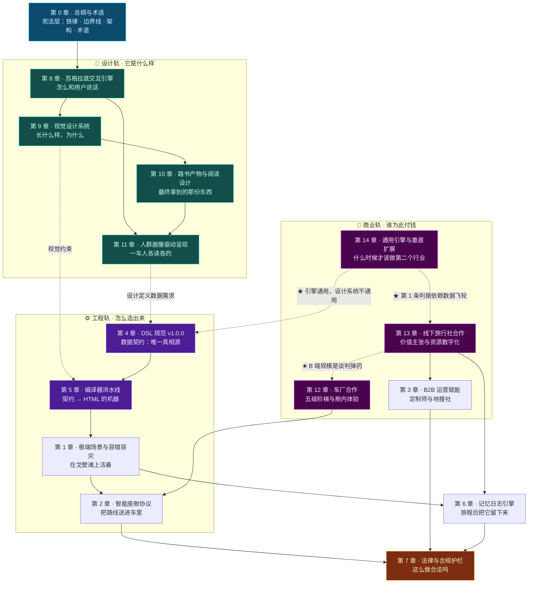

# TripCraft 终极执行全书

> **Universal Travel Harness · 智能旅行路书生成系统**
> 从愿景到施工蓝图 —— 一份**设计 + 工程**双轨全书。

---

## 这本书是什么

[根目录 README](../README.md) 回答的是**「为什么做」**：产品定位、商业模式、竞争分析、IP 主张。

**这本书回答的是「怎么做」**，分为两轨：

| 轨 | 章节 | 回答 | 检验标准 |
| :--- | :--- | :--- | :--- |
| **🎨 设计轨** | [8](08-socratic-interaction-design.md) · [9](09-visual-design-system.md) · [10](10-roadbook-reading-design.md) · [11](11-audience-adaptive-rendering.md) | **它是什么样，以及为什么是这样** | 见下方硬规则 B |
| **💼 商业轨** | [3](03-b2b-agency-operations.md) · [12](12-oem-partnership-design.md) · [13](13-agency-partnership-design.md) · [14](14-generic-engine-and-vertical-expansion.md) | **谁为此付钱，凭什么** | 见下方硬规则 B |
| **⚙️ 工程轨** | [1](01-resilience-and-failover.md) · [2](02-cockpit-protocol.md) · [4](04-dsl-specification-v1.md) · [5](05-compiler-pipeline.md) | **怎么把它造出来** | 见下方硬规则 A |
| **⚖️ 支撑轨** | [0](00-overview-and-glossary.md) · [6](06-memory-journal-engine.md) · [7](07-legal-and-compliance.md) | 总纲、引擎、合规 | 视章节性质适用 A 或 B |

### 两条硬规则

> **硬规则 A（工程轨）**：任何无法用 **「输入 → 算法 → 输出 → 失败状态」** 描述的内容，不得写入工程章节。
>
> **硬规则 B（设计轨）**：任何设计决策，必须同时写明 **「决策 → 为什么 → 不这样做会怎样」** 三件事。
>
> 两条规则都**不接受只有结论的内容**。无法满足的，标记为 `TODO(P0)` 并登记在 [未决问题登记册](00-overview-and-glossary.md#07-未决事项登记册-open-issues-register)，而不是用形容词填充。

> 📌 **为什么需要两条规则，而不是一条？**
>
> 本书初版只有硬规则 A。**它服务的是一本工程规格**——在那个范围内，A 是正确且锋利的。
>
> 但**设计不是工程的下游**。"为什么敦煌金要做成**氧化的**金而不是**闪耀的**金"（[§9.2.2](09-visual-design-system.md#922-敦煌金-dunhuang-gold)）这个问题，**用 A 检验会直接判为不合格**——因为它没有输入输出，也没有失败状态。
>
> **但它是本书里最能决定产品成败的决策之一。**
>
> **所以正确的做法不是放宽 A，而是承认设计有它自己的检验标准。** —— 一条规则管不住两类东西时，加一条规则，比把两类东西硬塞进一条规则里诚实。

**这两条规则的共同目的是让本书的每一页都可被检验。** 一份充满"高效""智能""极致体验"的架构文档，在开工第一天就会失去作用。

---

## 十章铁律（先读这个）

在深入任何章节前，请先读 [第 0 章 §0.2 十条铁律](00-overview-and-glossary.md#02-十条设计铁律-the-ten-ironclad-rules)。这十条是**不可协商的架构约束**，后续每一章的设计决策都可以追溯到其中某一条。

| # | 铁律 | 一句话 |
| ---: | :--- | :--- |
| 1 | 零构建交付 | 用户不该为了看一份路书而安装任何东西 |
| 2 | 单文件优先，渐进增强 | 能一个文件解决的，不要两个 |
| 3 | **降级不可耻，白屏才是罪** | 断网时显示少一点可以，什么都不显示不行 |
| 4 | 数据主权本地化 | 用户的行程与照片不离开他的设备 |
| 5 | 无后端可运行 | 三项例外之外，一切在本地 |
| 6 | DSL 是唯一真相源 | 模板可以换，数据只有一份 |
| 7 | 事实与建议分离 | AI 不能生成"开放时间是 8:30" |
| 8 | 拒绝静默失败 | 出错必须说，且要说清楚是什么错 |
| 9 | 一切可存证 | 变更、确认、降级都要留痕 |
| 10 | **代码不是护城河，资产才是** | 抄得走代码，抄不走数据与关系 |

---

## 章节地图



> 📌 **图中五条虚线是这本书最重要的结构关系。**
>
> **`§11 人群画像 → §4 DSL`** 意味着：因为产物要能对五种人呈现五种样子，**数据契约里必须携带"这个点对长辈意味着什么"**——而不是等编译器去猜。
> **`§9 视觉系统 → §5 编译器`** 意味着：因为玻璃效果在阳光下必须降级（[§9.4.3](09-visual-design-system.md#943-玻璃的参数不是固定的)），**编译器必须知道"什么条件下该退化"**。
> **`§13 旅行社 → §12 车厂`** 意味着：**B 端规模是车厂谈判桌上唯一的硬牌**（[§12.7.2](12-oem-partnership-design.md#1272-筹码清单)）——所以两条 B 端线不是并列的，**它们的先后顺序是有理由的**。
> **`§14 垂直扩展 → §13 数据飞轮 / §4 DSL`** 意味着：**开第二个行业的判据不是"能不能"，是"数据池是否还在变厚"**；而**迁移成本的真正位置在 DSL 之外**——引擎通用，设计系统不通用。
>
> **先有设计，再推导出数据要装什么、机器要做什么。** 反过来（先定 schema 再想怎么显示）是这本书记录过的失败路径。

| 轨 | 章 | 标题 | 回答的问题 | 篇幅 |
| :---: | :--- | :--- | :--- | :--- |
| ⚖️ | **0** | [总纲与术语](00-overview-and-glossary.md) | 这本书的规则是什么？ | 定调 |
| 🎨 | **8** | [苏格拉底交互引擎完整设计](08-socratic-interaction-design.md) | 怎么和用户说话？ | 大 |
| 🎨 | **9** | [视觉设计系统](09-visual-design-system.md) | 长什么样？为什么？ | 大 |
| 🎨 | **10** | [路书产物形态与阅读设计](10-roadbook-reading-design.md) | 最终那份东西怎么读？ | 大 |
| 🎨 | **11** | [人群画像驱动的差异化呈现](11-audience-adaptive-rendering.md) | 一车人怎么各读各的？ | 中 |
| 💼 | **12** | [车厂合作的产品形态与舱内体验设计](12-oem-partnership-design.md) | 凭什么和车厂谈得成？ | 大 |
| 💼 | **13** | [线下旅行社合作的价值主张与资源数字化设计](13-agency-partnership-design.md) | 旅行社凭什么用？资源怎么进来？ | 大 |
| 💼 | **14** | [通用引擎与垂直扩展的判据](14-generic-engine-and-vertical-expansion.md) | 能做别的行业吗？什么时候该做？ | 中 |
| ⚙️ | **4** | [TripCraft DSL v1.0.0 规范](04-dsl-specification-v1.md) | 数据长什么样？ | ★ 最大 |
| ⚙️ | **5** | [单文件编译器流水线](05-compiler-pipeline.md) | 怎么变成 HTML？ | 大 |
| ⚙️ | **1** | [极端场景与容错容灾](01-resilience-and-failover.md) | 断网了怎么办？ | 大 |
| ⚙️ | **2** | [EV 智能座舱端到端协议](02-cockpit-protocol.md) | 怎么送进车里？ | 中 |
| 💼 | **3** | [B2B 线下旅行社与车队运营赋能](03-b2b-agency-operations.md) | 定制师怎么用？ | 中 |
| ⚖️ | **6** | [旅程后记忆日志引擎](06-memory-journal-engine.md) | 怎么留下记忆？ | 中 |
| ⚖️ | **7** | [法律、安全与合规护栏](07-legal-and-compliance.md) | 合法吗？ | 中 |

> 📌 **阅读顺序建议按 [§0.6 章节图谱与阅读路径](00-overview-and-glossary.md#06-章节地图与阅读路径) 按角色选择**，不必线性阅读。

---

## 按角色阅读路径

| 角色 | 建议路径 | 重点 |
| :--- | :--- | :--- |
| **架构师 / 技术负责人** | 0 → 4 → 5 → 1 → 2 → 3 → 6 → 7 | 全部 |
| **🎨 交互 / 产品设计师** | **0 §0.2 → 8 → 9 → 10 → 11** | **设计轨全部**，尤其 §8.7 模糊输入、§11.4 冲突可视化 |
| **🎨 视觉设计师** | 0 §0.2 → 9 → 10 | 五主题设计方法（§9.2.1）、流派兼容矩阵（§9.1.3） |
| **前端工程师** | 0 → **9 §9.4/§9.5** → 4 → 5 → 1 | DSL 结构、编译器、降级状态机、**景深与排版 token** |
| **数据 / 后端工程师** | 0 → 4 → 3 → 7 | 契约、租户模型、数据合规 |
| **产品经理** | 0 → **8 → 11** → 3 → 1 → 6 | 边界线、B2B 价值、降级体验 |
| **💼 商务拓展 / BD** | **0 §0.3 → 13 → 12 → 3 §3.9 → 7** | **两条 B 端线的价值主张、冷启动路径、异议处理、筹码清单** |
| **💼 车厂合作负责人** | **12 → 2 → 7 §7.4** | 五级阶梯、车厂价值主张、舱内体验、数据合规 |
| **💼 旅行社合作负责人** | **13 → 3 → 11** | 三类社的差异、三条不越线、资源数字化工作流、★ **§13.5.4 资质红线** |
| **💼 战略 / 找第二增长曲线** | **14 → 13 §13.6 → 4** | ★ **先读完 §14.4 的四条判据与 §14.6 的陷阱** |
| **法务** | 0 §0.3 → 7 | 责任边界线、引注核验表 |
| **想学习实现的地接社技术方** | 0 → 5 → 1 | 编译器架构与离线策略 |

> 📌 **注意「产品经理」和「前端工程师」的路径都从设计轨开始。**
>
> 因为**这本书里设计轨先于工程轨**（见上方章节图的两条虚线）——**先读完 §8/§9/§11，才知道 §4 的 schema 为什么需要那些字段。** 反过来读，会看到一堆"为什么不直接用景点数组"的疑问。

---

## 配套产物

### JSON Schema 契约（可执行的规范）

规范不是文档，是**可以被机器校验的契约**。

| 文件 | 内容 | 大小 |
| :--- | :--- | ---: |
| [`spec/trip.schema.json`](../spec/trip.schema.json) | 顶层行程契约 | ~30 KB |
| [`spec/node.schema.json`](../spec/node.schema.json) | 节点契约 | ~11 KB |
| [`spec/brand.schema.json`](../spec/brand.schema.json) | 品牌包契约 | ~9 KB |
| [`spec/patch.schema.json`](../spec/patch.schema.json) | 离线补丁契约 | ~5 KB |

全部为 **JSON Schema Draft 2020-12**，全部启用 `additionalProperties: false`。

### 校验器

```bash
npm install        # 仅开发期依赖（ajv + ajv-formats），运行时零依赖
npm run check      # = validate + check-links
```

```
契约元校验
  ✓ brand.schema.json   https://tripcraft.dev/schema/v1.0.0/brand.schema.json
  ✓ node.schema.json    https://tripcraft.dev/schema/v1.0.0/node.schema.json
  ✓ patch.schema.json   https://tripcraft.dev/schema/v1.0.0/patch.schema.json
  ✓ trip.schema.json    https://tripcraft.dev/schema/v1.0.0/trip.schema.json
实例校验
  ✓ examples/dunhuang-silkroad-9d/trip.json
✓ 契约校验全部通过（4 份 Schema，1 份实例）

跨文件链接: 491  |  失效: 0
```

| 工具 | 作用 |
| :--- | :--- |
| `tools/validate-schemas.js` | 校验 4 份 JSON Schema 自身合法 + 示例实例符合契约 |
| [`tools/check-links.mjs`](../tools/check-links.mjs) | 校验全书 **491 条跨文件内链**（含跨文件锚点）。**它按 GitHub 的真实锚点算法实现**，而不是估算 |
| [`tools/check-br025.mjs`](../tools/check-br025.mjs) | **[BR-025](07-legal-and-compliance.md#781--br-025地图数据不得落库oi-003-收敛后的新增规则) 的可执行形态** —— 扫描产物中是否内联了算路 API 返回的路线几何。含注入测试与阈值边界测试 |

> 📌 **为什么需要链接校验器？** 因为这本书的**引用密度很高**——每个设计决策都要回指依据。**引用越多，断链越多**，而断链在 GitHub 上是**静默的**：读者点过去只会看到页面顶部，不会看到任何错误。
>
> 首次运行这个校验器时，**265 条内链中有 77 条是断的（29%）**。这不是笔误，而是**一个可预期的结构性风险**：章节标题一改，所有指向它的引用全部失效，而没有任何东西会提醒你。
>
> **把校验接进 `npm run check`，是让"引用不准"从"没人发现"变成"提交即失败"的唯一办法。** 这与[铁律 8 拒绝静默失败](00-overview-and-glossary.md#铁律-8--拒绝静默失败-never-fail-silently)是同一条思路——**只不过这次要防的是我们自己。**

### 示例

| 路径 | 内容 |
| :--- | :--- |
| [`examples/dunhuang-silkroad-9d/trip.json`](../examples/dunhuang-silkroad-9d/trip.json) | 9 天甘青大环线格式标杆（含熔断、车辆通行、特权资源） |

> ⚠️ 示例中的坐标、价格、机构均为**演示数据**，不可用于实际出行。详见该文件的 `provenance.disclosures`。

---

## 未决问题与待验证项

**这本书刻意保留了不确定性的可见性。** 把未验证的东西伪装成已确定，是工程文档最常见的失败模式。

### 未决问题（OI）

见 [§0.7 未决问题登记册](00-overview-and-glossary.md#07-未决事项登记册-open-issues-register)（OI-001 ~ OI-015）。

其中 **P0 级**：

| ID | 问题 | 阻塞 | 状态 |
| :--- | :--- | :--- | :--- |
| OI-001 | 高德 `amapuri://` 途经点格式与**数量上限** | 第 2 章深链提交 | 🟡 格式已确认，**上限未测** |
| OI-003 | 高德服务条款关于算路结果存储的限制 | 第 7 章合规 | ✅ **已收敛** |
| OI-005 | 微信对 Exif 的实际剥离行为 | 第 6 章回退链 | ✅ **已收敛** |
| OI-007 | 高德商业授权 | **商用发布** | ⏳ 待办（商务动作） |
| OI-008 | MIT 与"禁止商业使用"冲突 | **发布** | ⏳ 待办（需业主决策） |
| OI-009 | HEIC 解析路径最终选型 | iPhone 照片落点率 | ⏳ 新增 |
| **OI-010** | **五视角「为你」卡片的来源** | ★ **数据契约是否升版** | ⏳ **新增（设计轨）** |
| **OI-016** | **是否构成「为无证经营提供便利」** | ★ **白标能力能否默认开启** | ⏳ **新增（法务动作）** |

> ⚠️ **OI-010 与其他 P0 的性质不同，值得单独说明。**
>
> OI-001~009 都是**外部事实不确定**——它们靠"去查、去测"收敛。
> **OI-010 是内部设计尚未收敛**——它靠"做决定"收敛。
>
> **而且它卡的是 `spec/trip.schema.json`。** 那份契约是在设计轨（§8~§11）写出来之前定的，**它里面没有任何字段能表达"这个点对长辈意味着什么"**。
>
> 换句话说：**设计轨一旦要求数据携带新东西，工程轨的契约就必须在冻结前改。** 详见 [§0.7 设计轨引出的未决项](00-overview-and-glossary.md#-设计轨引出的未决项2026-10-07-新增)。

> 📌 **已收敛的三条**（OI-001 格式部分 / OI-003 / OI-005）都来自 2026-10-07 的官方文档核查，结论与依据见 [§0.7 状态摘要](00-overview-and-glossary.md#-三条已收敛项的结论摘要)。**它们的价值不在于"少了一个待办"，而在于每一条都新增或修正了一条工程约束**——例如 OI-003 直接产出了 [BR-025](07-legal-and-compliance.md#781--br-025地图数据不得落库oi-003-收敛后的新增规则)。

> 📌 **OI-015 曾被列为 P0，现已降为 P1，理由值得记一笔。**
>
> 它最初的写法是「如果友商已接入大模型，则 AI 生成不再是差异」——**这个判断隐含了一个错误前提：AI 生成原本承担着差异化的任务。**
>
> 业主指出：**AI 生成是入场券，从来不是价值主张。** 前提一改，整条 OI 的性质就变了——剩下的问题（友商的集中式架构能否支持私有层）仍然值得查，但它**不再是论述的根基**。
>
> **这是一条比"查一个事实"更值得记录的经验：很多 P0 的等级来自一个没被检验的隐含前提。把前提说出来，等级往往会自己降下来。**

### 待验证项（TV）

| 章 | 编号 | 内容 |
| :--- | :--- | :--- |
| 2 | TV-07 ~ TV-13 | 深链参数、车机能力、车厂平台门槛 |
| 6 | TV-01 ~ TV-06 | 编解码支持、HEIC 解析、微信行为、内存上限 |

> ⚠️ **TV 与 OI 的区别**：OI 是"我们不知道答案"；**TV 是"我们知道该测什么，但还没测"**。两者都需要在代码开工前闭环，但 TV 的闭环方式只有一种——**上真机**。

---

## 外部事实核查记录

**本书记录的不是"我们写了什么"，还包括"我们改了什么、为什么改"。**

### 2026-10-07 核查轮次

对全书的**外部依赖事实**（第三方 API 参数、浏览器能力、法条引注、第三方库状态）做了一轮逐条溯源核查。**核查的起因是一个怀疑**：书中若干"事实"实际来自记忆与推测，而工程文档中最危险的正是**看起来像事实的推测**。

#### 被推翻的结论（初稿写错了）

| 位置 | 初稿说法 | 核查后的实际 | 影响 |
| :--- | :--- | :--- | :--- |
| §2.3.2 | 高德深链用 `via` + `lon,lat,name;…`；百度用 `waypoints` + `lat,lng\|…` | 高德用 **`vian`/`vialons`/`vialats`/`vianames`**；百度用 **`viaPoints`**。且初稿**误用了另外两套 API 的参数名** | 🔴 深链提交会直接失败 |
| §6.4.2 | 微信「发送原图」**部分保留** Exif，不可依赖 | **原图完整保留**（腾讯官方表述） | 🟡 一条被误判为不可用的路径其实可用 |
| §6.8 | 用 `mp4-muxer` 封装 MP4 | **该库已被作者标记废弃**，推荐 `mediabunny` | 🟡 供应链风险 |
| §6.8.1 | 「视频号仅接受 MP4」 | 官方帮助中心原文是「**其他不限**」——**该说法是错的** | 🟡 我们据此做的编码决策理由不成立 |
| §6.4.1 | 现代浏览器可原生解码 HEIC | **仅 Safari 17+**；Chrome/Edge **全平台不支持** | 🔴 初稿的解析链设计不成立 |
| §7.4 | 「PIPL 第 13 条（合法性基础/同意）」 | **第 13 条 = 合法性基础；第 14 条 = 同意**。混为一谈会导致同意书结构错误 | 🔴 合规文本结构出问题 |
| §7.x | SDK 披露义务源自 164 号文 | 源自 **191 号文 / 292 号文「双清单」/ 26 号文** | 🟡 引注错误 |
| §7.11 | 《民法典》第 1176 条 = 「自甘风险」 | **条文原文不含"自甘风险"四字**，那是学理通称 | 🟡 用学理词汇冒充法条原文 |

#### 被证实的结论（初稿侥幸对了，但现在有据可依）

| 位置 | 初稿说法 | 核查后 |
| :--- | :--- | :--- |
| §1.3.1 | 「缓存高德瓦片**极可能**违反服务条款」 | ✅ **证实，且可以去掉了"极可能"**——官方 FAQ 明文「JSAPI 地图接口和数据均不支持离线使用」，条款第 3.5 / 4.12.3 / 4.12.8 / 7.3 条禁止缓存，英文版 Clause 1.2(g)(ii) **字面点名 "map tiles"** |
| §2.7.3 | 「默认假设行驶中」 | ✅ 与真实车机行为一致（合规车机浏览器在行驶中**被完全屏蔽**） |

#### 一处设计决策被验证是对的

§2.3.2 的深链协议**被写成数据（`config/deeplink-profiles.json`）而不是代码**。核查发现参数全错时，**修正只需要改 JSON**——不用改一行逻辑、不用重跑测试。

> 📌 **这条经验值得记住**：**凡是从外部文档抄来的东西，都不要硬编码。** 因为我们一定会抄错一些，而第三方一定会改。**把易变的外部事实关进数据里，是让修正成本从"重构"降到"改配置"的唯一办法。**

#### 一处必须记录的方法论教训

核查发现 **`exifr` 库存在一个静默失败的严重缺陷**（iOS 18+ 自适应 HDR 的 HEIC 因 `ftyp` box 为 52 字节，触发源码中硬编码的 50 阈值判断，**返回空值且不报错**；相关 issue 至今未修，npm 最新版发布于 2021 年）。

**如果没做这轮核查，这个缺陷会以什么形式暴露？** —— 用户导入 200 张 iPhone 照片，程序"处理成功"，**一张都没有位置，且没有任何错误提示**。用户会认为是自己的手机没开定位。

> ⚠️ **静默失败是最难被发现的失败。** 它不会崩溃、不会报错、不会出现在日志里，只会让产品**安静地不工作**。这正是[铁律 8 拒绝静默失败](00-overview-and-glossary.md#铁律-8--拒绝静默失败-never-fail-silently)存在的理由——**而且它不只约束我们自己写的代码，也约束我们选用的第三方库。**

### 2026-10-07 第二轮核查（商业轨）

**起因**：一次商业讨论中出现了三个主张——①市场规模数据 ②「没有人在做」 ③把内容型领队作为增量渠道。三者都值得核实，因为它们会直接变成对外材料。

#### 被推翻的说法

| 位置 | 原说法 | 核查后的实际 | 影响 |
| :--- | :--- | :--- | :--- |
| [§13.8.1](13-agency-partnership-design.md#1381-先把一个流传很广的数字修正掉) | 「自驾游、家庭私家团、定制小团占比**超 75%**」 | 🔴 **不成立**——是把「消费者调研多选口径」与「旅行社订单口径」相加得出。**没有任何单一权威来源支持该数字** | 🔴 不得用于任何对外材料 |
| [§13.8.3](13-agency-partnership-design.md#1383--但没有人在做是不准确的) | 「没有人在做行中高品质交付」 | ⚠️ **不准确**——路书科技（2014）与指南猫（2013）已做十年 B 端行程 SaaS，服务数千家机构、近万个独立工作室 | 🟡 差异化论述必须改写为「我们做的是另一件事」 |
| 根 README 初稿 | 「国内旅游总花费突破 5 万亿」 | **2025 年实际 6.30 万亿元**、65.2 亿人次，同比 +9.5% | 🟡 数字过时且低估 |
| [§13.2.4](13-agency-partnership-design.md#1324--增长最快的那一群不在上面这个分类里) 新增 | 把「内容型领队」列为增量渠道 | 🔴 **有明确合规风险**——其经营模式在现行执法口径下很可能已构成无证经营；且**为非法活动提供引流、收款、客源对接便利的，一并查处** | 🔴 产出 [§13.5.4](13-agency-partnership-design.md#1354--一个必须先回答的问题他有资质吗) 与 G-24~G-27 四条硬约束 |

#### 被证实的结论

| 位置 | 说法 | 核查后 |
| :--- | :--- | :--- |
| [§13.8.2](13-agency-partnership-design.md#1382-可溯源的市场规模与结构判断) | 「大团萎缩、小团上升」 | ✅ 多个独立来源支持；《2026–2030 中国文旅消费市场趋势研判》明确「大团变小团、集中变分散，2–8 人小型团、私家定制团成为市场主流」 |
| [§7.11](07-legal-and-compliance.md#711--引注核验表强制) 第 6 项 | 《旅游法》旅行社业务许可 → 无证经营 | ✅ **来源已核验**：构成要件、处罚幅度（第 95/102 条、《旅行社条例》第 46 条）、2025–2026 年多起已公布案例 |

#### 一处意外收获：第三方能力基准

北二外数字文旅研究中心「**AI 出行助手类应用**」测评（2026 年第一期）给出了九款产品排名与失败模式记录。**它逐条对应了全书已经设计过的机制**——信息滞后 → [§10.7](10-roadbook-reading-design.md#107-数据的来源与置信度)、价格偏差 → [§3.5.3](03-b2b-agency-operations.md#353-置信度四级语义)、广告诱导 → [铁律 7](00-overview-and-glossary.md#铁律-7--事实与建议分离-fact-vs-advice)。

> 📌 **这意味着本书的很多设计不是自说自话，而是可以被公开验证的。**

#### 一处必须记录的方法论教训（第二课）

第一轮核查的教训是「**不要把外部事实硬编码**」（→ `config/deeplink-profiles.json`）。

**这一轮的教训不同：不要把两个不同口径的数字相加。**

「自驾游 40.70%」和「定制小团订单占比 60%」各自有出处、各自都是真的——**但它们的分子分母完全不同。相加得到的 75%，是一个不属于任何统计口径的数字。**

> ⚠️ **这类错误的危险在于：它的每一个组成部分都经得起单独查证，所以看起来很扎实。** 只有连续追问「这两个数能不能加」，才会暴露。
>
> **对本书的意义：商业章节的数字必须标注口径，不能只标注出处。**

---

## 写作与维护规则

| 规则 | 说明 |
| :--- | :--- |
| **可检验性优先** | 每一条设计都要能回答"怎么验证它是对的" |
| **失败状态必须写明** | 只写成功路径的设计是不完整的设计 |
| **诚实标注不确定性** | 未验证的写 `TODO(P0)` / TV 编号，不写成事实 |
| **不可关闭的约束要显式标注** | 如 BR-005/006/007、BR-020~025 |
| **同一事实只有一个来源** | 详见[原则 P5 冗余即债务](04-dsl-specification-v1.md#40-设计原则与命名约定)（例如 `brand` 定义只有一份，在 `brand.schema.json`） |
| **引用要有编号** | 便于在代码注释中回指 |

---

## 快速索引

**我想知道…**

**🎨 设计问题（先看这一组）**

- …用户说「随便」时怎么办？ → [§8.7 模糊输入的处理设计](08-socratic-interaction-design.md#87--模糊输入的处理设计)
- …为什么要让用户确认一遍才生成？ → [§8.5 回显确认](08-socratic-interaction-design.md#85--回显确认整个设计里最重要的一个动作)
- …一车人需求冲突怎么办？ → [§8.8 多人意见冲突](08-socratic-interaction-design.md#88--多人意见冲突的对话设计) + [§11.4 冲突可视化](11-audience-adaptive-rendering.md#114--冲突可视化)
- …「敦煌金」到底该是什么颜色？ → [§9.2.2](09-visual-design-system.md#922-敦煌金-dunhuang-gold)
- …主题和流派能随便组合吗？ → [§9.1.3 兼容性矩阵](09-visual-design-system.md#913-兼容性矩阵-本节的核心产出)
- …长辈模式除了放大字还该做什么？ → [§9.7.2](09-visual-design-system.md#972-长辈模式的真实设计目标)
- …路书最终长什么样？ → [§10.2 一天的性格标签](10-roadbook-reading-design.md#102--一天的性格标签) + [§10.3 五层信息深度](10-roadbook-reading-design.md#103--五层信息深度)
- …为什么不给每个人生成一份路书？ → [§11.1.2](11-audience-adaptive-rendering.md#1112-但也不能做成几份文档)

**💼 商业问题**

- …为什么不能直接触发 NOA，却又说这是机会？ → [§12.1](12-oem-partnership-design.md#121-先把一个误读掰正做不到才是这门生意的起点)
- …车厂凭什么跟我们合作？ → [§12.3](12-oem-partnership-design.md#123--车厂凭什么跟你合作)
- …舱内体验到底该怎么做？ → [§12.4](12-oem-partnership-design.md#124--舱内体验设计)
- …B 端和车厂先做哪个？ → [§12.7.3 推荐推进顺序](12-oem-partnership-design.md#1273--推荐的推进顺序)
- …旅行社老板问"你会不会抢我客户"怎么答？ → [§13.5.3 异议处理清单](13-agency-partnership-design.md#1353--异议处理清单)
- …他们的资源怎么录进来？ → [§13.4 资源数字化的获取工作流](13-agency-partnership-design.md#134--资源数字化的获取工作流)
- …哪些数据能共享，哪些必须私有？ → [§13.6 网络效应](13-agency-partnership-design.md#136--网络效应什么该共享什么该私有)
- …第一批该签谁？ → [§13.2.2](13-agency-partnership-design.md#1322--该从哪里开始地接社)
- …这个赛道有没有人做过？我们的差异到底是什么？ → [§13.8.3~§13.8.4](13-agency-partnership-design.md#1383--但没有人在做是不准确的)
- …能不能和"小红书自驾领队"合作？ → ★ [§13.5.4 资质红线](13-agency-partnership-design.md#1354--一个必须先回答的问题他有资质吗)
- …收费怎么定？按单还是按月？ → [§13.9 定价](13-agency-partnership-design.md#139--定价锚在客单价上不锚在软件成本上)
- …这套东西能不能拿去做研学 / 会务 / 赛事？ → ★ [§14.4 四条判据](14-generic-engine-and-vertical-expansion.md#144--判据什么条件下才允许开第二个垂直)

**⚙️ 工程问题**

- …这套系统的架构分几层？ → [§0.4 五层架构](00-overview-and-glossary.md#04-系统分层总览)
- …哪些话在路书里不能说？ → [§0.3 责任边界线](00-overview-and-glossary.md#03-三条责任边界线tripcraft-不是清单) + [BR-015 词表](07-legal-and-compliance.md#712-措辞白名单--黑名单编译器强制)
- …一个节点的数据长什么样？ → [§4.5 days](04-dsl-specification-v1.md#45-days--分天行程全书核心)
- …断网时会发生什么？ → [§1.2 降级阶梯](01-resilience-and-failover.md#12-降级阶梯-dl0dl4) + [§1.3 能力矩阵](01-resilience-and-failover.md#13-诚实的能力矩阵)
- …行程中途要改计划怎么办？ → [§1.6 爆炸半径与局部重算](01-resilience-and-failover.md#16-中断处理爆炸半径与局部重算)
- …怎么保证产物断网不白屏？ → [§5.7 自检阶段](05-compiler-pipeline.md#57-自检阶段离线可用性静态断言)
- …怎么把路线送进车机？ → [§2.3 Tier 0 详解](02-cockpit-protocol.md#23-tier-0-详解真正的交付主力)
- …为什么不能读车辆电量？ → [§2.6 关于读取车辆状态](02-cockpit-protocol.md#26-关于读取车辆状态必须明确说不)
- …旅行社凭什么付费？ → [§3.9 人效对比](03-b2b-agency-operations.md#39-商业论证定制师人效对比)
- …照片怎么变成视频？ → [§6.8 视频生成](06-memory-journal-engine.md#68-视频生成三级能力级联)
- …坐标为什么要转换？ → [§6.4.4 WGS-84 → GCJ-02](06-memory-journal-engine.md#644--坐标转换wgs-84--gcj-02)
- …行踪轨迹为什么敏感？ → [§7.4.1](07-legal-and-compliance.md#741--最重要的一点行踪轨迹是敏感个人信息)
- …MIT 和禁止商用冲突怎么办？ → [§7.6 许可证矛盾整改](07-legal-and-compliance.md#76--许可证与保密策略矛盾整改oi-008--p0)

---

> **根目录**：[README.md](../README.md) —— 产品与商业白皮书
> **契约**：[spec/](../spec/) ｜ **示例**：[examples/](../examples/) ｜ **工具**：[tools/](../tools/)
