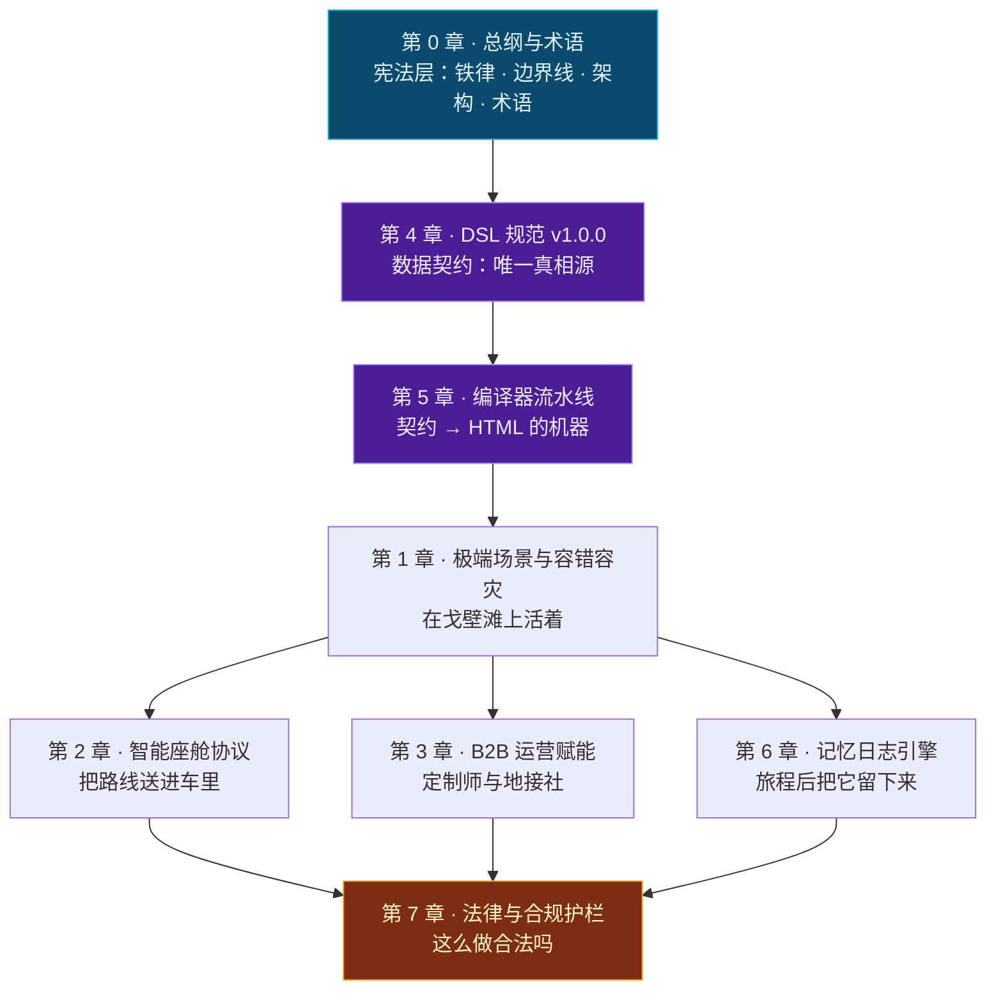

# TripCraft 终极执行全书

> **Universal Travel Harness · 智能旅行路书生成系统**
> 从愿景到施工蓝图 —— 一份可直接指导代码开发的工程规格。

---

## 这本书是什么

[根目录 README](../README.md) 回答的是**「为什么做」**：产品定位、商业模式、竞争分析、IP 主张。

**这本书回答的是「怎么做」**：数据契约、编译器架构、降级策略、座舱协议、合规护栏。

### 一条硬规则

> 任何无法用 **「输入 → 算法 → 输出 → 失败状态」** 描述的内容，不得写入本书。
>
> 无法满足这条的，标记为 `TODO(P0)` 并登记在 [未决问题登记册](00-overview-and-glossary.md#07-未决事项登记册-open-issues-register)，而不是用形容词填充。

**这条规则的目的是让本书的每一页都可被检验。** 一份充满"高效""智能""极致体验"的架构文档，在开工第一天就会失去作用。

---

## 十章铁律（先读这个）

在深入任何章节前，请先读 [第 0 章 §0.2 十条铁律](00-overview-and-glossary.md#02-十条设计铁律-the-ten-ironclad-rules)。这十条是**不可协商的架构约束**，后续每一章的设计决策都可以追溯到其中某一条。

| # | 铁律 | 一句话 |
| ---: | :--- | :--- |
| 1 | 零构建交付 | 用户不该为了看一份路书而安装任何东西 |
| 2 | 单文件优先，渐进增强 | 能一个文件解决的，不要两个 |
| 3 | **降级不可耻，白屏才是罪** | 断网时显示少一点可以，什么都不显示不行 |
| 4 | 数据主权本地化 | 用户的行程与照片不离开他的设备 |
| 5 | 无后端可运行 | 三项例外之外，一切在本地 |
| 6 | DSL 是唯一真相源 | 模板可以换，数据只有一份 |
| 7 | 事实与建议分离 | AI 不能生成"开放时间是 8:30" |
| 8 | 拒绝静默失败 | 出错必须说，且要说清楚是什么错 |
| 9 | 一切可存证 | 变更、确认、降级都要留痕 |
| 10 | **代码不是护城河，资产才是** | 抄得走代码，抄不走数据与关系 |

---

## 章节地图



| 章 | 标题 | 回答的问题 | 篇幅 |
| :--- | :--- | :--- | :--- |
| **0** | [总纲与术语](00-overview-and-glossary.md) | 这本书的规则是什么？ | 定调 |
| **4** | [TripCraft DSL v1.0.0 规范](04-dsl-specification-v1.md) | 数据长什么样？ | ★ 最大 |
| **5** | [单文件编译器流水线](05-compiler-pipeline.md) | 怎么变成 HTML？ | 大 |
| **1** | [极端场景与容错容灾](01-resilience-and-failover.md) | 断网了怎么办？ | 大 |
| **2** | [EV 智能座舱端到端协议](02-cockpit-protocol.md) | 怎么送进车里？ | 中 |
| **3** | [B2B 线下旅行社与车队运营赋能](03-b2b-agency-operations.md) | 定制师怎么用？ | 中 |
| **6** | [旅程后记忆日志引擎](06-memory-journal-engine.md) | 怎么留下记忆？ | 中 |
| **7** | [法律、安全与合规护栏](07-legal-and-compliance.md) | 合法吗？ | 中 |

> 📌 **阅读顺序建议按 [§0.6 章节图谱与阅读路径](00-overview-and-glossary.md#06-章节地图与阅读路径) 按角色选择**，不必线性阅读。

---

## 按角色阅读路径

| 角色 | 建议路径 | 重点 |
| :--- | :--- | :--- |
| **架构师 / 技术负责人** | 0 → 4 → 5 → 1 → 2 → 3 → 6 → 7 | 全部 |
| **前端工程师** | 0 → 4 → 5 → 1 | DSL 结构、编译器、降级状态机 |
| **数据 / 后端工程师** | 0 → 4 → 3 → 7 | 契约、租户模型、数据合规 |
| **产品经理** | 0 → 3 → 1 → 6 | 边界线、B2B 价值、降级体验 |
| **商务 / 运营** | 0 §0.3 → 3 → 7 | 责任边界、人效论证、合规红线 |
| **法务** | 0 §0.3 → 7 | 责任边界线、引注核验表 |
| **想学习实现的地接社技术方** | 0 → 5 → 1 | 编译器架构与离线策略 |

---

## 配套产物

### JSON Schema 契约（可执行的规范）

规范不是文档，是**可以被机器校验的契约**。

| 文件 | 内容 | 大小 |
| :--- | :--- | ---: |
| [`spec/trip.schema.json`](../spec/trip.schema.json) | 顶层行程契约 | ~30 KB |
| [`spec/node.schema.json`](../spec/node.schema.json) | 节点契约 | ~11 KB |
| [`spec/brand.schema.json`](../spec/brand.schema.json) | 品牌包契约 | ~9 KB |
| [`spec/patch.schema.json`](../spec/patch.schema.json) | 离线补丁契约 | ~5 KB |

全部为 **JSON Schema Draft 2020-12**，全部启用 `additionalProperties: false`。

### 校验器

```bash
npm install        # 仅开发期依赖（ajv + ajv-formats），运行时零依赖
npm run check      # = validate + check-links
```

```
契约元校验
  ✓ brand.schema.json   https://tripcraft.dev/schema/v1.0.0/brand.schema.json
  ✓ node.schema.json    https://tripcraft.dev/schema/v1.0.0/node.schema.json
  ✓ patch.schema.json   https://tripcraft.dev/schema/v1.0.0/patch.schema.json
  ✓ trip.schema.json    https://tripcraft.dev/schema/v1.0.0/trip.schema.json
实例校验
  ✓ examples/dunhuang-silkroad-9d/trip.json
✓ 契约校验全部通过（4 份 Schema，1 份实例）

跨文件链接: 265  |  失效: 0
```

| 工具 | 作用 |
| :--- | :--- |
| `tools/validate-schemas.js` | 校验 4 份 JSON Schema 自身合法 + 示例实例符合契约 |
| [`tools/check-links.mjs`](../tools/check-links.mjs) | 校验全书 **265 条内链**（含跨文件锚点）。**它按 GitHub 的真实锚点算法实现**，而不是估算 |

> 📌 **为什么需要链接校验器？** 因为这本书的**引用密度很高**——每个设计决策都要回指依据。**引用越多，断链越多**，而断链在 GitHub 上是**静默的**：读者点过去只会看到页面顶部，不会看到任何错误。
>
> 首次运行这个校验器时，**265 条内链中有 77 条是断的（29%）**。这不是笔误，而是**一个可预期的结构性风险**：章节标题一改，所有指向它的引用全部失效，而没有任何东西会提醒你。
>
> **把校验接进 `npm run check`，是让"引用不准"从"没人发现"变成"提交即失败"的唯一办法。** 这与[铁律 8 拒绝静默失败](00-overview-and-glossary.md#铁律-8--拒绝静默失败-never-fail-silently)是同一条思路——**只不过这次要防的是我们自己。**

### 示例

| 路径 | 内容 |
| :--- | :--- |
| [`examples/dunhuang-silkroad-9d/trip.json`](../examples/dunhuang-silkroad-9d/trip.json) | 9 天甘青大环线格式标杆（含熔断、车辆通行、特权资源） |

> ⚠️ 示例中的坐标、价格、机构均为**演示数据**，不可用于实际出行。详见该文件的 `provenance.disclosures`。

---

## 未决问题与待验证项

**这本书刻意保留了不确定性的可见性。** 把未验证的东西伪装成已确定，是工程文档最常见的失败模式。

### 未决问题（OI）

见 [§0.7 未决问题登记册](00-overview-and-glossary.md#07-未决事项登记册-open-issues-register)（OI-001 ~ OI-008）。

其中 **P0 级**：

| ID | 问题 | 阻塞 | 状态 |
| :--- | :--- | :--- | :--- |
| OI-001 | 高德 `amapuri://` 途经点格式与**数量上限** | 第 2 章深链提交 | 🟡 格式已确认，**上限未测** |
| OI-003 | 高德服务条款关于算路结果存储的限制 | 第 7 章合规 | ✅ **已收敛** |
| OI-005 | 微信对 Exif 的实际剥离行为 | 第 6 章回退链 | ✅ **已收敛** |
| OI-007 | 高德商业授权 | **商用发布** | ⏳ 待办（商务动作） |
| OI-008 | MIT 与"禁止商业使用"冲突 | **发布** | ⏳ 待办（需业主决策） |
| OI-009 | HEIC 解析路径最终选型 | iPhone 照片落点率 | ⏳ 新增 |

> 📌 **已收敛的三条**（OI-001 格式部分 / OI-003 / OI-005）都来自 2026-10-07 的官方文档核查，结论与依据见 [§0.7 状态摘要](00-overview-and-glossary.md#-三条已收敛项的结论摘要)。**它们的价值不在于"少了一个待办"，而在于每一条都新增或修正了一条工程约束**——例如 OI-003 直接产出了 [BR-025](07-legal-and-compliance.md#781--br-025地图数据不得落库oi-003-收敛后的新增规则)。

### 待验证项（TV）

| 章 | 编号 | 内容 |
| :--- | :--- | :--- |
| 2 | TV-07 ~ TV-13 | 深链参数、车机能力、车厂平台门槛 |
| 6 | TV-01 ~ TV-06 | 编解码支持、HEIC 解析、微信行为、内存上限 |

> ⚠️ **TV 与 OI 的区别**：OI 是"我们不知道答案"；**TV 是"我们知道该测什么，但还没测"**。两者都需要在代码开工前闭环，但 TV 的闭环方式只有一种——**上真机**。

---

## 外部事实核查记录

**本书记录的不是"我们写了什么"，还包括"我们改了什么、为什么改"。**

### 2026-10-07 核查轮次

对全书的**外部依赖事实**（第三方 API 参数、浏览器能力、法条引注、第三方库状态）做了一轮逐条溯源核查。**核查的起因是一个怀疑**：书中若干"事实"实际来自记忆与推测，而工程文档中最危险的正是**看起来像事实的推测**。

#### 被推翻的结论（初稿写错了）

| 位置 | 初稿说法 | 核查后的实际 | 影响 |
| :--- | :--- | :--- | :--- |
| §2.3.2 | 高德深链用 `via` + `lon,lat,name;…`；百度用 `waypoints` + `lat,lng\|…` | 高德用 **`vian`/`vialons`/`vialats`/`vianames`**；百度用 **`viaPoints`**。且初稿**误用了另外两套 API 的参数名** | 🔴 深链提交会直接失败 |
| §6.4.2 | 微信「发送原图」**部分保留** Exif，不可依赖 | **原图完整保留**（腾讯官方表述） | 🟡 一条被误判为不可用的路径其实可用 |
| §6.8 | 用 `mp4-muxer` 封装 MP4 | **该库已被作者标记废弃**，推荐 `mediabunny` | 🟡 供应链风险 |
| §6.8.1 | 「视频号仅接受 MP4」 | 官方帮助中心原文是「**其他不限**」——**该说法是错的** | 🟡 我们据此做的编码决策理由不成立 |
| §6.4.1 | 现代浏览器可原生解码 HEIC | **仅 Safari 17+**；Chrome/Edge **全平台不支持** | 🔴 初稿的解析链设计不成立 |
| §7.4 | 「PIPL 第 13 条（合法性基础/同意）」 | **第 13 条 = 合法性基础；第 14 条 = 同意**。混为一谈会导致同意书结构错误 | 🔴 合规文本结构出问题 |
| §7.x | SDK 披露义务源自 164 号文 | 源自 **191 号文 / 292 号文「双清单」/ 26 号文** | 🟡 引注错误 |
| §7.11 | 《民法典》第 1176 条 = 「自甘风险」 | **条文原文不含"自甘风险"四字**，那是学理通称 | 🟡 用学理词汇冒充法条原文 |

#### 被证实的结论（初稿侥幸对了，但现在有据可依）

| 位置 | 初稿说法 | 核查后 |
| :--- | :--- | :--- |
| §1.3.1 | 「缓存高德瓦片**极可能**违反服务条款」 | ✅ **证实，且可以去掉了"极可能"**——官方 FAQ 明文「JSAPI 地图接口和数据均不支持离线使用」，条款第 3.5 / 4.12.3 / 4.12.8 / 7.3 条禁止缓存，英文版 Clause 1.2(g)(ii) **字面点名 "map tiles"** |
| §2.7.3 | 「默认假设行驶中」 | ✅ 与真实车机行为一致（合规车机浏览器在行驶中**被完全屏蔽**） |

#### 一处设计决策被验证是对的

§2.3.2 的深链协议**被写成数据（`config/deeplink-profiles.json`）而不是代码**。核查发现参数全错时，**修正只需要改 JSON**——不用改一行逻辑、不用重跑测试。

> 📌 **这条经验值得记住**：**凡是从外部文档抄来的东西，都不要硬编码。** 因为我们一定会抄错一些，而第三方一定会改。**把易变的外部事实关进数据里，是让修正成本从"重构"降到"改配置"的唯一办法。**

#### 一处必须记录的方法论教训

核查发现 **`exifr` 库存在一个静默失败的严重缺陷**（iOS 18+ 自适应 HDR 的 HEIC 因 `ftyp` box 为 52 字节，触发源码中硬编码的 50 阈值判断，**返回空值且不报错**；相关 issue 至今未修，npm 最新版发布于 2021 年）。

**如果没做这轮核查，这个缺陷会以什么形式暴露？** —— 用户导入 200 张 iPhone 照片，程序"处理成功"，**一张都没有位置，且没有任何错误提示**。用户会认为是自己的手机没开定位。

> ⚠️ **静默失败是最难被发现的失败。** 它不会崩溃、不会报错、不会出现在日志里，只会让产品**安静地不工作**。这正是[铁律 8 拒绝静默失败](00-overview-and-glossary.md#铁律-8--拒绝静默失败-never-fail-silently)存在的理由——**而且它不只约束我们自己写的代码，也约束我们选用的第三方库。**

---

## 写作与维护规则

| 规则 | 说明 |
| :--- | :--- |
| **可检验性优先** | 每一条设计都要能回答"怎么验证它是对的" |
| **失败状态必须写明** | 只写成功路径的设计是不完整的设计 |
| **诚实标注不确定性** | 未验证的写 `TODO(P0)` / TV 编号，不写成事实 |
| **不可关闭的约束要显式标注** | 如 BR-005/006/007、BR-020~025 |
| **同一事实只有一个来源** | 详见[原则 P5 冗余即债务](04-dsl-specification-v1.md#40-设计原则与命名约定)（例如 `brand` 定义只有一份，在 `brand.schema.json`） |
| **引用要有编号** | 便于在代码注释中回指 |

---

## 快速索引

**我想知道…**

- …这套系统的架构分几层？ → [§0.4 五层架构](00-overview-and-glossary.md#04-系统分层总览)
- …哪些话在路书里不能说？ → [§0.3 责任边界线](00-overview-and-glossary.md#03-三条责任边界线tripcraft-不是清单) + [BR-015 词表](07-legal-and-compliance.md#712-措辞白名单--黑名单编译器强制)
- …一个节点的数据长什么样？ → [§4.5 days](04-dsl-specification-v1.md#45-days--分天行程全书核心)
- …断网时会发生什么？ → [§1.2 降级阶梯](01-resilience-and-failover.md#12-降级阶梯-dl0dl4) + [§1.3 能力矩阵](01-resilience-and-failover.md#13-诚实的能力矩阵)
- …行程中途要改计划怎么办？ → [§1.6 爆炸半径与局部重算](01-resilience-and-failover.md#16-中断处理爆炸半径与局部重算)
- …怎么保证产物断网不白屏？ → [§5.7 自检阶段](05-compiler-pipeline.md#57-自检阶段离线可用性静态断言)
- …怎么把路线送进车机？ → [§2.3 Tier 0 详解](02-cockpit-protocol.md#23-tier-0-详解真正的交付主力)
- …为什么不能读车辆电量？ → [§2.6 关于读取车辆状态](02-cockpit-protocol.md#26-关于读取车辆状态必须明确说不)
- …旅行社凭什么付费？ → [§3.9 人效对比](03-b2b-agency-operations.md#39-商业论证定制师人效对比)
- …照片怎么变成视频？ → [§6.8 视频生成](06-memory-journal-engine.md#68-视频生成三级能力级联)
- …坐标为什么要转换？ → [§6.4.4 WGS-84 → GCJ-02](06-memory-journal-engine.md#644--坐标转换wgs-84--gcj-02)
- …行踪轨迹为什么敏感？ → [§7.4.1](07-legal-and-compliance.md#741--最重要的一点行踪轨迹是敏感个人信息)
- …MIT 和禁止商用冲突怎么办？ → [§7.6 许可证矛盾整改](07-legal-and-compliance.md#76--许可证与保密策略矛盾整改oi-008--p0)

---

> **根目录**：[README.md](../README.md) —— 产品与商业白皮书
> **契约**：[spec/](../spec/) ｜ **示例**：[examples/](../examples/) ｜ **工具**：[tools/](../tools/)
