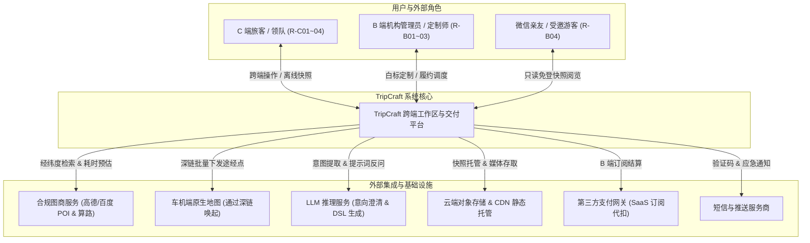
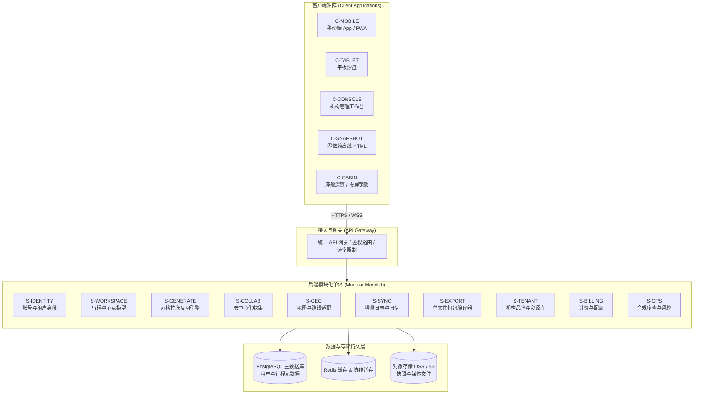

# ARC-01 · 系统总体架构

## 1. 系统上下文全景 (System Context)

TripCraft 作为自驾旅行与 B 端机构数字化交付中枢，连接多端用户与外围基础设施：



---

## 2. 容器架构图 (Container Architecture)

系统由客户端应用层、API 网关、后端模块化服务核心及数据持久层组成：



---

## 3. 白皮书 L1–L5 模型与本架构映射关系

历史 [白皮书 §6.0](../WHITEPAPER.md#60-系统分层全景架构-system-architecture) 提出了经典五层模型，本架构包在此基础上完成现代产品与服务容器的映射对齐：

| 白皮书原始层级 | 原始定义与职责 | 对应现代系统架构组件 (ARC-01) | 映射说明与演进决策 |
| :--- | :--- | :--- | :--- |
| **L1 数据源层** | POI 图资、路况、特许资源、AI 生成 | `S-GEO`, `S-GENERATE`, 外部地图/模型服务 | 数据源收敛为后端领域适配器，不直接暴露给客户端。 |
| **L2 契约层** | DSL Schema 规范（trip, brand, node, patch） | `spec/*.json`, `S-WORKSPACE` 契约核心 | 保持数据契约作为系统单一真相源，所有出入库强制校验。 |
| **L3 编译器与同步层** | 云端同步、冲突仲裁、单文件打包器 | `S-SYNC`, `S-COLLAB`, `S-EXPORT` | 将单向编译扩展为“增量同步 + 离线单文件导出”双轮驱动。 |
| **L4 运行时层** | 零依赖容灾运行时、离线沙盒 | `C-SNAPSHOT`, 离线 Local-First 引擎 | 离线快照作为一等公民交付物，内联数据与核心渲染逻辑。 |
| **L5 多端接入层** | 手机、iPad、车机座舱、桌面工作台 | `C-MOBILE`, `C-TABLET`, `C-CABIN`, `C-CONSOLE` | 明确车机以“深链投递 + 手机镜像”为主，不强求原生车机 APK。 |

---

## 4. 核心架构原则 (Architecture Principles)

1. **离线优先 (Local-First)**：所有核心路书查看与交互以本地数据为主，断网属于常态而非异常。
2. **快照是一等公民 (Snapshot as First-Class Artifact)**：导出的单文件 HTML 具备自包含运行时，零依赖外部服务即可长久稳定呈现。
3. **降级不可耻，白屏才是罪 (Degrade Gracefully)**：网络中断、API 欠费或车机限制时，平滑降级至本地缓存或系统级深链，严禁阻断主流程。
4. **能力边界诚实 (Honest Boundaries)**：严守工程责任红线，不越权声称控制车辆硬件、读取 SOC 或替代专业交规导航。
5. **模块化单体先行 (Modular Monolith First - Proposed)**：初期采用高内聚低耦合的模块化单体架构，避免微服务过早引入的网络与运维复杂性（[ADR-003](adr/ADR-003-backend-topology.md)）。
6. **严格租户隔离 (Tenant Isolation)**：B 端机构数据与特许资源严格逻辑隔离，机构私域客户不与平台公域混淆。
7. **地图服务可替换 (Map Provider Agnostic)**：通过抽象适配层隔离底层商业图商，支持多图商切换与合规审查（[ADR-005](adr/ADR-005-map-navigation-abstraction.md)）。

---

## 5. 统一命名表 (Unified Naming Conventions)

### 角色 ID 与名称
- `R-C01` 组织者 / 领队 ｜ `R-C02` 同行成员 ｜ `R-C03` 长辈/低数字素养成员 ｜ `R-C04` 独行自驾者
- `R-B01` 机构管理员 ｜ `R-B02` 计调 / 定制师 ｜ `R-B03` 导游 / 随团司机 ｜ `R-B04` 机构客户（终端旅客）
- `R-P01` 平台运营与合规 ｜ `R-O01` 车厂 / 生态伙伴

### 功能模块 (M) 与后端逻辑模块 (S)
- `M01` 账号与身份 (`S-IDENTITY`) ｜ `M02` 行程工作区 (`S-WORKSPACE`)
- `M03` 智能澄清与生成 (`S-GENERATE`) ｜ `M04` 协作 (`S-COLLAB`)
- `M05` 地图与路线 (`S-GEO`) ｜ `M06` 同步与实时 (`S-SYNC`)
- `M07` 座舱交付 (`C-CABIN` 客户端) ｜ `M08` 离线快照与导出 (`S-EXPORT`)
- `M09` 内容与主题 (`S-CONTENT`) ｜ `M10` 回忆录与资产 (`S-MEDIA`)
- `M11` B 端工作台 (`S-TENANT`) ｜ `M12` 商业化与计费 (`S-BILLING`)
- `M13` 平台运营与合规 (`S-OPS`) ｜ `M14` 通知与消息 (`S-NOTIFY`)

### 客户端载体 (C)
- `C-MOBILE` 手机 App/PWA ｜ `C-TABLET` iPad/平板沙盘 ｜ `C-WEB` Web 端
- `C-CONSOLE` B 端管理工作台 ｜ `C-SNAPSHOT` 离线快照运行时 ｜ `C-CABIN` 车机深链与投屏

---

## 6. 规划中代码仓库组织 (Proposed Monorepo Layout)

> 标注：以下代码结构为**规划中**形态，当前仓库仅包含 `spec/` 与 `tools/`。

```text
TripCraft/
├── apps/
│   ├── mobile/                 ← C-MOBILE 跨端移动应用 (React Native / Flutter)
│   ├── web/                    ← C-WEB / C-CONSOLE 桌面工作台 (Next.js / Vite)
│   └── snapshot-runtime/       ← C-SNAPSHOT 离线自包含轻量运行时模版
├── packages/
│   ├── spec/                   ← 数据契约 (JSON Schema Draft 2020-12) [已实现]
│   ├── dsl-core/               ← DSL 验证、修补与解析核心库
│   ├── compiler/               ← S-EXPORT 单文件 HTML 编译器
│   └── design-system/          ← 视觉设计 Token 与主题样式
├── services/                   ← 后端模块化单体服务
│   ├── s-identity/             ← 账号、会话与多租户权限
│   ├── s-workspace/            ← 行程工作区与版本控制
│   ├── s-generate/             ← 苏格拉底澄清与 LLM 提示词引擎
│   ├── s-collab/               ← 意见收齐与冲突协商
│   ├── s-sync/                 ← 增量日志与点对点 Patch 派发
│   ├── s-geo/                  ← 地图商适配器 (高德/百度)
│   └── s-tenant/               ← 机构品牌与特许资源库
└── tools/                      ← 门禁校验工具链 [已实现]
```

---

## 7. 系统组件设计与实现状态

严格区分设计状态与工程落地状态，杜绝将规划功能标记为已实现：

| 组件 / 模块 | 所属层级 | 设计状态 | 实现状态 | 落地依据 / 说明 |
| :--- | :--- | :--- | :--- | :--- |
| **`spec/` 数据契约** | L2 契约层 | 已验证 | **已实现** | 4 份 JSON Schema 与 Dunhuang 样例通过门禁校验 |
| **`tools/` 门禁工具链** | 工程基础设施 | 已验证 | **已实现** | `validate-schemas.js`, `check-links.mjs`, `check-br025.mjs` |
| **`S-EXPORT` 单文件打包器** | L3 编译器 | 已评审 | 原型 | 历史 `tools/compile.mjs` 单文件编译器雏形验证 |
| **`C-SNAPSHOT` 离线运行时** | L4 运行时 | 已评审 | 原型 | 参考体验站 `trip-cts.pages.dev`（静态参考实现） |
| **`S-IDENTITY` 账号身份** | 后端服务 | 草案 | 无 | 待阶段 1 开发 |
| **`S-WORKSPACE` 行程空间** | 后端服务 | 草案 | 无 | 待阶段 1 开发 |
| **`S-GENERATE` 智能澄清** | 后端服务 | 草案 | 无 | 待阶段 1 开发（结合 `docs/08` 提示词设计） |
| **`S-COLLAB` 协作收集** | 后端服务 | 草案 | 无 | 待阶段 2 开发 |
| **`S-SYNC` 增量同步** | 后端服务 | 草案 | 无 | 待阶段 2 开发（基于 `spec/patch.schema.json`） |
| **`S-GEO` 地图适配器** | 后端服务 | 草案 | 无 | 待阶段 1 开发 |
| **`S-TENANT` 机构工作台** | 后端服务 | 草案 | 无 | 待阶段 1 开发 |
| **`C-MOBILE` 跨端客户端** | 客户端 | 草案 | 无 | 待阶段 1 原型开发 |
| **`C-CONSOLE` 管理后台** | 客户端 | 草案 | 无 | 待阶段 1 开发 |
| **`C-CABIN` 座舱深链协议** | 客户端 | 已评审 | 原型 | 基于系统 URL Scheme 验证通过 |
