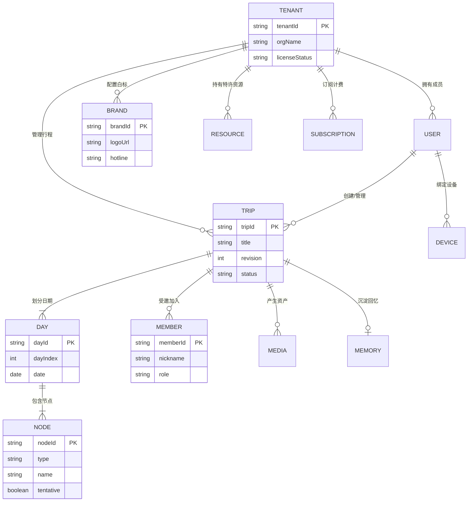
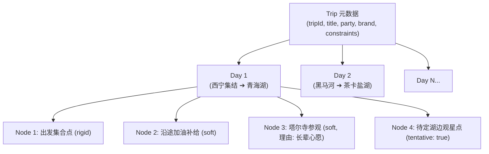
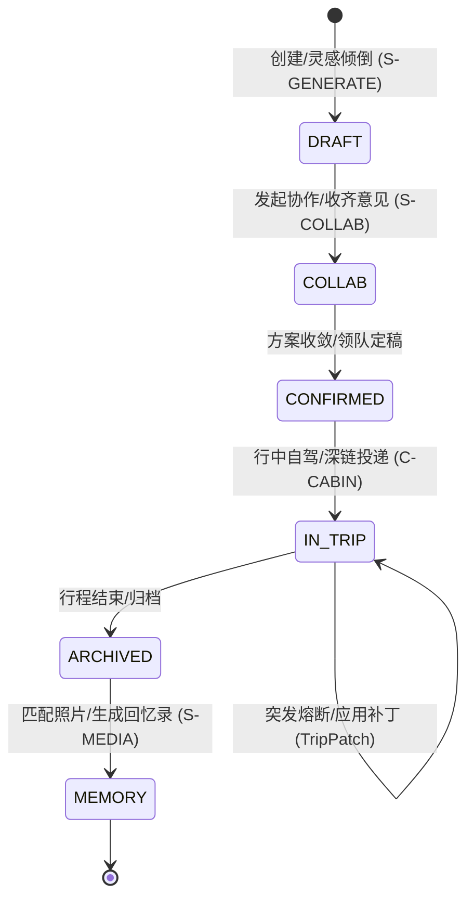

# ARC-02 · 领域模型与数据架构

## 1. 核心实体清单 (Core Entities)

系统定义 17 个核心领域实体，覆盖账号、协作、行程文档、B 端白标及计费审计：

| 实体名称 | 所属模块 | 一句话业务定义 | 存储与生命周期特征 |
| :--- | :--- | :--- | :--- |
| **User** | S-IDENTITY | 平台注册用户（组织者、定制师或司导） | 持久存储于主数据库，支持多设备绑定 |
| **Device** | S-IDENTITY | 用户的物理终端凭证（手机、iPad 或车载投屏端） | 记录会话 Token 与本地离线缓存指纹 |
| **Tenant (Org)** | S-TENANT | B 端机构租户（旅行社、自驾俱乐部或车队） | 包含企业信用代码、资质审核状态及席位数 |
| **Role** | S-IDENTITY | 租户内用户分配的业务角色（管理员、计调、司导） | 控制多租户工作区与财务数据的 RBAC 权限 |
| **Workspace / Trip**| S-WORKSPACE | 具体的行程空间真相源，承载行程全部要素 | 对应一个全局唯一 `tripId`，作为协作核心 |
| **Day** | S-WORKSPACE | 行程内的日程单元（第 N 天），包含日期与主干线路 | 包含当日天气预警、限行提醒与节点序列 |
| **Node** | S-WORKSPACE | 行程内的离散行为节点（景点、餐饮、酒店、途经点） | 核心数据单元，具有经纬度坐标与时间窗口 |
| **Member** | S-COLLAB | 参与行程的成员（含长期用户与受邀游客） | 记录行程内昵称与偏好，行程归档后脱敏 |
| **Brand** | S-TENANT | 机构白标品牌物料配置（Logo、标语、管家电话） | 注入导出的路书与快照，承载交付溢价 |
| **Template / Theme**| S-TENANT / S-CONTENT | 可复用的官方线路模板或视觉样式包（CSS Token） | 支持跨租户官方共享或机构私有沉淀 |
| **Resource** | S-TENANT | 机构私有特许资源（如特窟预约号、绿色通道专员） | 严格逻辑隔离，仅限所属租户定制师调用 |
| **Media** | S-MEDIA | 用户上传或打卡产生的照片与轨迹文件元数据 | 原始文件存储于对象存储，本地保留脱敏缩略图 |
| **Memory** | S-MEDIA | 行程结束后生成的旅途回忆录与精彩足迹集 | 结合节点时序与照片 EXIF 自动合成 |
| **Subscription** | S-BILLING | 机构的 SaaS 订阅合约与当前有效期 | 控制月度基础出单配额与白标高级特性 |
| **Order** | S-BILLING | 机构充值加量包或购买增值服务的交易订单 | 记录支付金额、流水号及结算状态 |
| **Notification** | S-NOTIFY | 下发给用户的行中提醒、变更通知或系统公告 | 支持端内通知中心展示与系统推送 |
| **Audit** | S-OPS | 针对敏感操作（资质审查、熔断下架）的不可篡改审计日志 | 留存操作人、时间戳与数字签名备查 |

---

## 2. 领域实体关系图 (Domain ER Diagram)

---

## 3. 行程文档模型 (Trip Document Tree)

TripCraft 将行程文档抽象为层次化树状结构：`Trip` ➔ `Day` ➔ `Node`。

### 节点类型与状态机制
1. **节点类型 (`type`)**：`poi`（景点）、`restaurant`（餐饮）、`hotel`（住宿）、`waypoint`（途经打卡）、`transport`（长途驾驶区间）、`fuses`（应急熔断预案）。
2. **待定标记 (`tentative`)**：
   - 当节点处于偏好探索阶段（如未预订住宿、未确定日落机位），标为 `tentative: true` 并附带 `tentativeReason`；
   - 待定节点在计算耗时与路网时以推荐中心点进行模糊测算，绝不阻塞整单生成；
   - 最终出单交付前，定制师可将其一键确认（`tentative: false`）或保留为探索弹性点。

---

## 4. DSL 在模型中的定位与 Schema 对照

TripCraft DSL 是领域模型的**外部交换标准格式与快照编译输入**。后端领域实体与 `spec/` 规范严密映射：

| 领域实体 / 聚合根 | 对应 `spec/` Schema 规范 | 映射职责与用途 |
| :--- | :--- | :--- |
| `Trip`, `Day`, `Member` | [`spec/trip.schema.json`](../../spec/trip.schema.json) | 行程完整真相源（Single Source of Truth），包含全周期约束、成员画像与每日日程。 |
| `Brand` | [`spec/brand.schema.json`](../../spec/brand.schema.json) | 机构白标品牌契约，定义 Logo、专属铭牌文案、客服电话与配色规范。 |
| `Node`, `Resource` | [`spec/node.schema.json`](../../spec/node.schema.json) | 离散节点契约，规范经纬度、开闭馆时间窗口、耗时、文化展卡与特许权益。 |
| 增量变更指令集 | [`spec/patch.schema.json`](../../spec/patch.schema.json) | 增量补丁（TripPatch）契约，定义原子操作（`ops`）与点对点分发格式。 |

---

## 5. 数据生命周期与状态机 (Data Lifecycle)

1. **草案期 (Draft)**：用户自由倾倒，反问引擎建立初始约束，允许存在大量 `tentative` 点。
2. **共创期 (Collab)**：各端成员结构化提名并附带理由，中间态数据暂存协作层，受时效保护。
3. **交付期 (Confirmed)**：编译产出零依赖单文件 HTML 或静态只读短链，数据契约冻结。
4. **行中态 (In-Trip)**：本地优先运行，依靠增量 `TripPatch` 演进版本（修订号递增）。
5. **归档与回忆 (Archived & Memory)**：中间协作过程数据按期销毁，提取真实打卡轨迹生成回忆录。

---

## 6. 数据主权与归属划分 (Data Ownership)

严格落实 [docs/00 铁律 4 数据主权本地化](../00-overview-and-glossary.md#铁律-4--数据主权本地化-local-data-sovereignty)：

| 数据类型 | 归属主体 | 存储位置 | 访问控制与生命周期 |
| :--- | :--- | :--- | :--- |
| **用户核心身份与密码** | 用户个人 | 平台中心库（加密） | 用户注销时彻底物理删除 |
| **机构客户私域名单** | B 端机构 | 租户空间（逻辑隔离） | 平台严禁向该群体进行公域商业营销 |
| **机构私有特许资源库** | B 端机构 | 机构加密存储 | 租户私有，绝不纳入通用公共模型训练 |
| **行程协作提名与理由** | 临时团队 | 协作暂存服务 (Redis) | 行程归档后 N 天自动清理，不出平台外部 |
| **个人原始照片与打卡轨迹** | 终端旅客 | 本地设备存储 | 仅在用户主动授权时进行本地 EXIF 匹配 |
| **脱敏单文件快照** | 旅客与公众 | 静态 CDN / 本地离线 | 自包含静态产物，用户自主分发与长久保存 |
