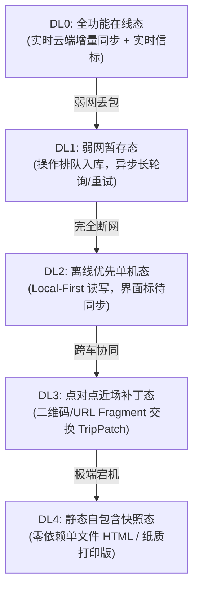
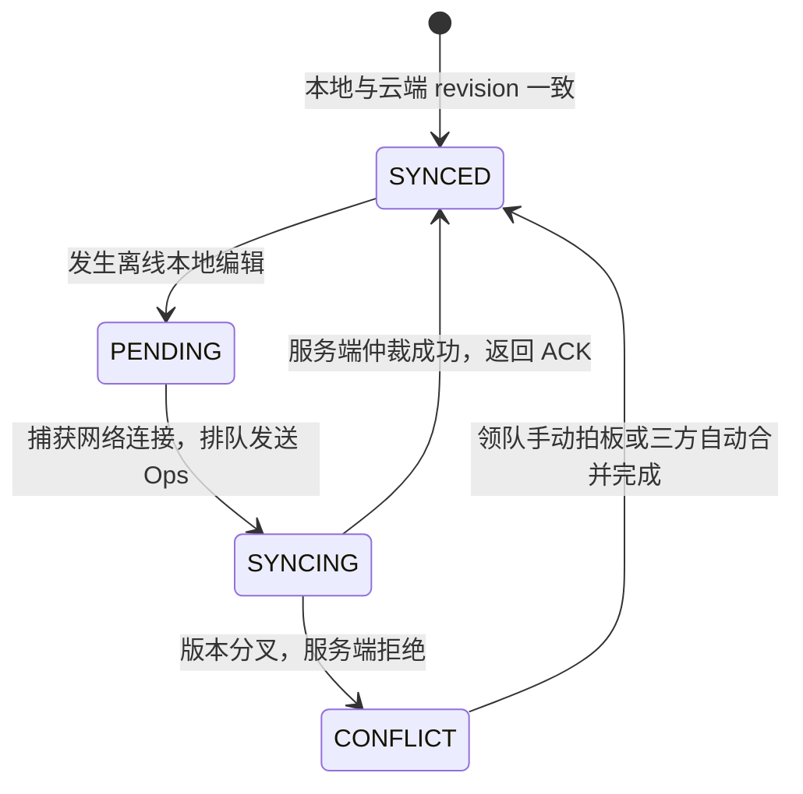
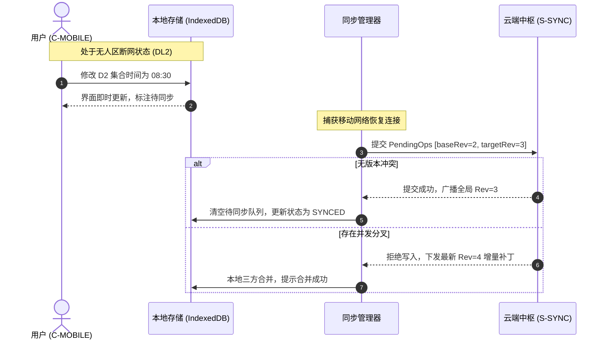
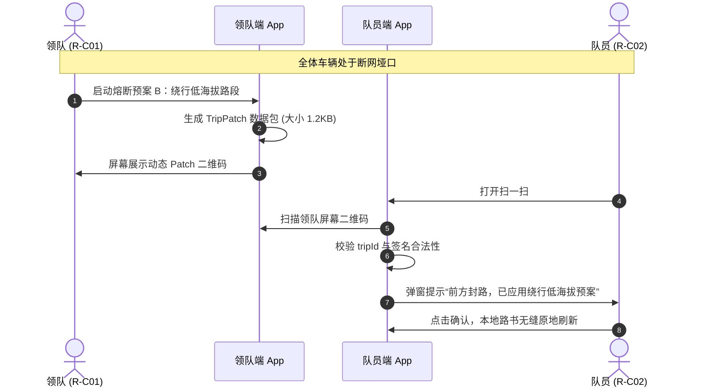

# ARC-03 · 离线优先与同步架构

## 1. 架构目标与关键场景覆盖

TripCraft 的同步设计立足于川西、大西北无人区等真实自驾场景，必须承载以下核心用例：
- **[S-C04 断网/无人区使用](../product/PRD-03-scenarios.md#s-c04-断网--无人区离线使用)**：在完全缺失移动通信基站的物理环境下，客户端保持 100% 离线交互能力。
- **[S-C05 行中突发变更与全员同步](../product/PRD-03-scenarios.md#s-c05-行中突发变更与全员同步-plan-b-熔断)**：在部分断网或局域自组网条件下，领队决策的绕行补丁秒级同步全车设备。

---

## 2. 数据放置策略：本地与云端划分

系统恪守本地优先（Local-First）原则，各端物理数据放置明确区隔：

| 数据类别 | 客户端本地持久层 (IndexedDB/SQLite) | 云端持久层 (PostgreSQL/Redis) | 离线只读快照 (HTML) |
| :--- | :--- | :--- | :--- |
| **当前行程真相源** | 持有完整副本，本地读写 | 持有全局真相源，负责序列号仲裁 | 静态内联 JSON 副本 |
| **离线编辑操作队列** | 暂存待提交的操作变更集 (`PendingOps`) | 无（网络恢复后批量入库） | 无 |
| **成员提名中间态** | 本地草案缓存 | 暂存协作清单（附带 TTL 自动清理） | 仅固化最终采纳项 |
| **离线简易矢量路网** | 预下载关键走廊点位与骨架缓存 | 完整调用图商 API 服务 | 仅静态绘制标桩 |
| **私密证件与未脱敏信息**| 用户本机加密留存，绝不出端 | 绝不接收未脱敏私密身份 | 严格剔除私密字段 |

---

## 3. 容灾与降级分级体系 (Degradation Hierarchy)

系统严格沿用 [docs/01 §1.1](../01-resilience-and-failover.md) 确立的 DL0–DL4 五级平滑降级标准，绝不抛出未经处理的白屏异常：

---

## 4. 同步模型与增量补丁机制

### 增量操作原语与 `patch.schema.json` 关系
1. **在线模式**：客户端的所有编辑转化为结构化增量操作事件（`Op: add/replace/remove/shift/skip`），携带本地逻辑时间戳与基于版本的修订号 (`baseRevision`)。
2. **离线/点对点模式**：当处于无网无人区时，增量操作序列直接序列化为符合 [`spec/patch.schema.json`](../../spec/patch.schema.json) 的自包含 `TripPatch` 对象。
3. **分发载体**：支持通过动态高密度二维码、AirDrop 或 URL fragment 传递，接收端无需连接云端即可完成本地 AST 原子修补。

---

## 5. 并发冲突分类与解决策略

依据 [ADR-002 同步与冲突模型](adr/ADR-002-sync-conflict-model.md)，系统采用**服务端权威日志 + 确定性三方合并规则**，杜绝无意义覆盖：

| 冲突类型 | 典型场景 | 解决机制与决策规则 | 展现与 UI 提示 |
| :--- | :--- | :--- | :--- |
| **同字段并发编辑** | 两人离线同时修改 D3 某景点游玩时长 | 基于逻辑时钟的最后写入胜出（LWW），或领队决策优先 | 提示“时长已按领队最新调整更新” |
| **列表顺序并发调整** | 两人分别将“午餐”前移与后移 | 依据节点稳定唯一 ID（`nodeId`）应用重排，计算拓扑偏序 | 列表平滑重排，不丢失任一节点 |
| **删除后被并发编辑** | A 删除了节点 X，B 离线给节点 X 补充笔记 | **保留优先原则**：复活节点 X 并合并笔记，待人工核实 | 标记黄色问号，提示“已合并被删节点的补充笔记” |
| **待定项转确定对撞** | 领队锁定了酒店 A，成员仍提交了酒店 B 意向 | 显式锁定胜出：保留酒店 A，将酒店 B 转为历史记录 | 成员端提示“领队已锁定最终住宿” |
| **权限变更并发** | 司导在离线被移出出团名单后仍尝试广播补丁 | 补丁签名验证失败：接收端依据权限列表校验拒绝合入 | 接收端告警“来源签名未认证，已忽略” |

---

## 6. 同步状态机与交互呈现 (Sync State Machine)

### 界面状态提示规范
- **`SYNCED` (已同步)**：状态栏展示沉稳浅绿小圆点，无打扰；
- **`PENDING` (待同步)**：状态栏展示淡橙色小云朵及“待同步变更 (N)”，标明数据安全保存在本地；
- **`CONFLICT` (冲突待决)**：页面顶部悬浮柔性横幅，提示“检测到 1 处路线冲突”，提供“一键采用领队方案”快捷入口。

---

## 7. 实时成员信标与位置隐私约束

1. **信标传输隔离**：实时经纬度采用独立轻量信令通道（WebRTC 数据通道或 MQTT 短报文），绝不混入严肃的行程 DSL 真相源。
2. **硬性隐私开关**：成员可随时单方面关闭自身定位广播；关闭后系统不推断、不模拟其位置。
3. **模糊化降级**：非行车中状态下，坐标点仅按 500 米网格脱敏显示，严格遵循 [ARC-07 安全合规规范](ARC-07-security-privacy-compliance.md)。

---

## 8. 快照语义与时效性约束

1. **只读保证**：导出的单文件快照属于纯静态文档，不持有任何写回云端数据库的授权凭证。
2. **不可篡改防腐**：快照文件头嵌入发布时的 `tripId`、全局修订号 `revision` 与生成时间戳 `exportedAt`。
3. **陈旧度提示**：若设备重新联网且检测到远端修订号更新，页面非阻断式提示“云端已有新版本（v3 ➔ v5），[点击刷新查看最新路书]”。

---

## 9. 关键时序流图 (Sequence Diagrams)

### 场景 A：离线编辑后恢复联网合并流程

### 场景 B：领队断网改道点对点扫码同步流程

