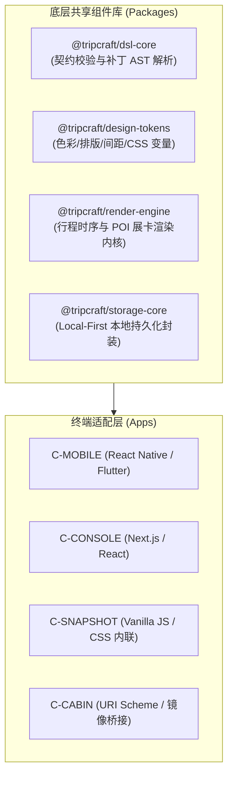
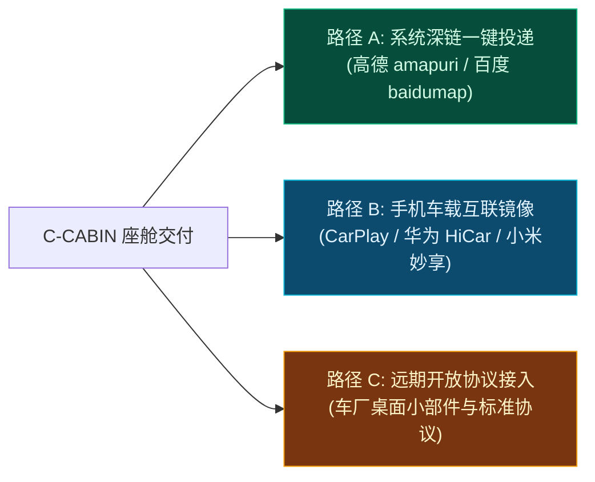

# ARC-04 · 客户端与交付渠道

## 1. 客户端矩阵 (Client Matrix)

TripCraft 采用跨端应用协同与自包含快照交付结合的终端矩阵：

| 客户端代号 | 载体类型 | 主要服务角色 | 核心功能职责 | 离线支持能力 | 设计与实现状态 |
| :--- | :--- | :--- | :--- | :--- | :--- |
| **C-MOBILE** | 移动端 App (iOS / Android) / PWA | R-C01, R-C02, R-B03 | 随身查看、意向倾倒、提名收集、行中打卡、深链投递 | **完全离线**（基于本地数据库缓存） | 草案 / 无（待阶段 1 开发） |
| **C-TABLET** | 平板端应用 (iPadOS / Android Pad) | R-C01, R-C02 | 大屏沙盘推演、海拔高程剖面、全家围坐共创排程 | **完全离线** | 草案 / 无（阶段 2） |
| **C-CONSOLE** | 桌面端 Web 管理后台 | R-B01, R-B02, R-P01 | 机构品牌配置、线路模版库、定制路书深度制作、出单结算 | **弱网降级**（需网络鉴权与云端保存） | 草案 / 无（待阶段 1 开发） |
| **C-SNAPSHOT**| 单文件 HTML 独立离线运行时 | R-C03, R-B04, 公众 | 免登录秒开、高保真阅览、长辈关怀大字版、一键呼叫管家 | **100% 独立离线**（零外部网络依赖） | 已评审 / 原型（参考实现验证） |
| **C-CABIN** | 座舱交付集成通道 | R-C01, R-B03, R-O01 | 全天途经点一键批量投递到高德/百度车机导航、投屏镜像 | **依赖宿主地图离线包** | 已评审 / 原型（深链调起验证） |

---

## 2. 各端职责与共享模块体系

为避免多端重复造轮子，系统采用核心逻辑高度下沉的共享模块架构：



### 共享职责说明
1. **统一设计规范**：复用 [docs/09 视觉设计系统](../09-visual-design-system.md)，统一色盘 Token（大漠金、川西绿、高原雪）与 8pt 网格排版。
2. **零运行时依赖快照**：`C-SNAPSHOT` 严格使用原生 Web 标准（Vanilla JS + CSS），不捆绑庞大前端框架，确保单文件产物极其轻量（≤2MB）。

---

## 3. 各端信息架构 (Information Architecture)

> 站点地图与页面清单（非线框图，规范核心路由与交互树）：

### C-MOBILE (移动端 App)
```text
C-MOBILE
├── /home               ← 个人与在途行程总览卡片
├── /trip/:id           ← 行程工作区主界面
│   ├── /itinerary      ← 每日日程、节点时序与地图沙盘视图
│   ├── /collab         ← 团队意见收集清单与提名入口 (S-COLLAB)
│   ├── /cabin          ← 座舱投递控制台（一键发送途经点）
│   └── /journal        ← 旅中打卡与照片足迹记录
├── /trip/:id/settings  ← 行程成员管理与导出快照
└── /user/profile       ← 账号偏好设置与离线数据管理
```

### C-CONSOLE (B 端机构工作台)
```text
C-CONSOLE
├── /dashboard          ← 机构概貌、当月出单量与配额消耗
├── /trips              ← 全部路书资产列表（草案、在途、已归档）
│   ├── /new            ← 模版复用与新建向导
│   └── /editor/:id     ← 专业定制师双栏排程工作区
├── /templates          ← 机构私有线路模板库
├── /resources          ← 机构特许资源库管理 (Resource)
├── /brand              ← 机构白标资产配置（Logo、标语、管家电话）
└── /billing            ← SaaS 订阅与按单加量包结算明细
```

### C-SNAPSHOT (离线快照单文件页面)
```text
C-SNAPSHOT (Single Page App)
├── #cover              ← 封面海报与机构白标铭牌
├── #day-selector       ← 快速日期定位吸顶条
├── #timeline           ← 沉浸式今日时序日程与 POI 展卡
├── #emergency          ← 24h 管家直连电话与医疗救援悬浮岛
└── #accessibility      ← 一键切换“长辈关怀大字模式”
```

---

## 4. C-CABIN 座舱交付渠道与三级路径

系统坚守 [docs/ERRATA 勘误](../ERRATA.md#24-智能座舱交付能力边界更正)，不研发原生车机 APK，通过三级务实路径交付座舱：



1. **路径 A（通用主流 · 立即可用）**：
   - 构造系统级 URI Scheme（如 `amapuri://route/plan/?dlat=...&dlon=...&via=...`）；
   - 调起手机端地图客户端并投射至已连接的车载大屏原生导航，零依赖车厂特批。
2. **路径 B（高画质交互）**：
   - 适配车载大屏横屏分辨率（16:9 / 8:3 横向自适应布局）；
   - 遵循车载安全设计规范，驾驶状态锁定高危文字输入。
3. **路径 C（远期伙伴生态）**：
   - 遵循开放公开标准输出行程摘要，严禁尝试越权操控车辆底盘与 NOA 辅助驾驶。

---

## 5. C-SNAPSHOT 单文件离线交付规范摘要

依据 [docs/05 编译器流水线](../05-compiler-pipeline.md) 与 [ADR-006](adr/ADR-006-snapshot-delivery-format.md)：
1. **零构建运行**：交付物为独立 `.html` 文件，严禁引用未打包的外部 npm 动态依赖。
2. **体积与首屏阈值**：整包体积严格限制在 ≤ 2MB 以内，本地双击打开首屏渲染时间 ≤ 300ms。
3. **安全沙盒**：快照不含写入型敏感网络接口，有效防范 XSS 与数据外泄。

---

## 6. 中控屏、副驾屏与后排设备协同策略

依据 [docs/10](../10-roadbook-reading-design.md) 与 [docs/11](../11-audience-adaptive-rendering.md)，系统针对座舱内不同乘员视角进行适配：

| 设备位置 | 面向乘员 | 核心信息呈现 | 交互与安全限制 |
| :--- | :--- | :--- | :--- |
| **中控大屏** | 驾驶员 (R-C01 / R-B03) | 极简今日路线骨架、下一站剩余里程、补给预警 | **行车安全第一**：禁止长文本阅读，强提示采用高对比度警示色 |
| **副驾屏幕** | 领队 / 领航副驾 | 深度人文 POI 展卡、开闭馆时间动态、门票预约状态 | 允许全量图文浏览与行中备忘打卡，协助驾驶员掌控节奏 |
| **后排平板** | 长辈与儿童 (R-C03) | 娱乐文化故事、长辈大字日程、午休与餐饮推荐 | 支持长辈关怀模式，支持离线音频解说播放 |
