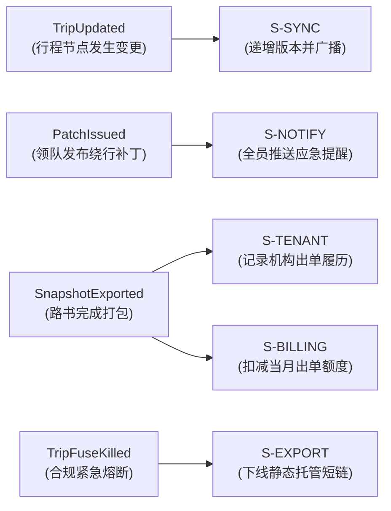
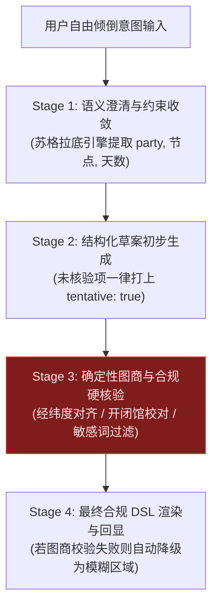

# ARC-05 · 后端与集成架构

## 1. 后端逻辑模块清单 (Logical Service Modules)

系统按业务边界划分为 10 个高内聚后端逻辑模块，初期作为模块化单体（Modular Monolith）运行：

| 逻辑模块 | 核心职责 | 拥有实体 | 对外能力清单 (动词 + 资源 + 用途) | 上游依赖 | 发布领域事件 |
| :--- | :--- | :--- | :--- | :--- | :--- |
| **S-IDENTITY** | 用户认证、会话维护与多租户权限校验 | User, Device, Role | `AuthenticateUser` 登录认证 `ValidateSession` 校验会话 `AssignTenantRole` 分配租户角色 | 无 | `UserRegistered` `SessionExpired` |
| **S-WORKSPACE**| 行程真相源维护、版本演进与草案编辑 | Trip, Day, Node | `CreateTrip` 初始化行程 `UpdateNode` 修改节点时序 `LockTentative` 锁定待定项 `FetchTripDSL` 获取真相源 | S-IDENTITY | `TripCreated` `TripUpdated` `TripArchived` |
| **S-GENERATE** | 自由倾倒意图识别与苏格拉底反问提示工程 | 提示词模板 | `ParseIntent` 提取自驾要素 `GenerateClarifyQuestion` 启发式反问 `SynthesizeDraftDSL` 生成初稿 | S-GEO, 外部 LLM | `DraftSynthesized` `ConstraintAligned` |
| **S-COLLAB** | 团队成员邀请与“只收齐不裁决”意见收集 | Member, Nomination | `JoinTripSpace` 凭口令加入 `SubmitNomination` 提交带理由提名 `AggregatePreferences` 聚合意见清单 | S-WORKSPACE | `MemberJoined` `NominationReceived` `ConflictDetected` |
| **S-GEO** | 合规图商 POI 检索、算路耗时预估与合规脱敏 | 坐标缓存 | `SearchPOI` 检索标准地名 `EstimateDriveTime` 测算相邻驾车耗时 `BuildDeepLink` 生成座舱深链 | 外部地图服务 | `POIVerified` `RouteCalculated` |
| **S-SYNC** | 增量操作日志持久化与点对点补丁仲裁 | PendingOp, Revision | `PushOps` 提交离线操作流 `PullDeltas` 拉取增量变更 `BroadcastPatch` 广播熔断补丁 | S-WORKSPACE | `OpsCommitted` `VersionForkDetected` `PatchIssued` |
| **S-EXPORT** | 单文件 HTML 离线交付包编译与只读短链托管 | Snapshot | `CompileSingleFileHTML` 打包单文件 `DeploySnapshotCDN` 发布静态托管 `ExportPDF` 生成长图排版 | S-WORKSPACE, S-CONTENT | `SnapshotExported` `DeliveryReady` |
| **S-TENANT** | B 端机构租户管理、白标品牌物料与特许资源 | Tenant, Brand, Resource | `ConfigureBrand` 配置白标物料 `ManageResource` 维护特许资源 `CloneTemplate` 模板一键复用 | S-IDENTITY | `BrandConfigured` `ResourceUpdated` |
| **S-BILLING** | 机构 SaaS 订阅扣减、按单加量包与用量清算 | Subscription, Order | `DeductQuota` 扣减路书出单额度 `ProcessOrder` 订单充值结算 `CheckTenantStanding` 检查资信 | 外部支付服务 | `QuotaExhausted` `SubscriptionRenewed` |
| **S-OPS** | 资质审核合规存证、禁用词扫描与紧急熔断 | Audit, ComplianceRule | `VerifyLicense` 审核旅行社资质 `ScanContentSafety` 敏感词巡检 `FuseKillTrip` 紧急熔断下架 | S-WORKSPACE | `TenantVerified` `ContentFlagged` `TripFuseKilled` |

---

## 2. 核心领域事件清单 (Domain Events)

系统采用事件驱动（Event-Driven）解耦跨模块联动：

---

## 3. 外部系统集成矩阵 (External Integrations)

| 外部系统 | 业务用途 | 接入方式 | 可替换性 | 核心风险与合规约束 | 关联假设 |
| :--- | :--- | :--- | :--- | :--- | :--- |
| **合规商业图商 (高德/百度)** | POI 经纬度对齐、开闭馆时间、驾车耗时预估 | 服务端开放 REST API | **高**（通过 `S-GEO` 抽象层完全隔离） | API 商用授权成本及严禁持久化存储路线 polyline（BR-025） | [A-09](../ASSUMPTIONS.md), [ADR-005](adr/ADR-005-map-navigation-abstraction.md) |
| **车机原生地图** | 沿途途经点直接导航下发 | 客户端系统级 URI Scheme | **极高**（协议层解耦） | 依赖车主手机已装地图且已连接车辆，部分车机限制途经点数量 | [docs/02 §2.1](../02-cockpit-protocol.md) |
| **大语言模型 (LLM 推理)** | 自由倾倒自然语言意图提取、苏格拉底反问 | 服务端 HTTPS API | **极高**（OpenAI 兼容协议封装） | 幻觉编造不存在的野景点或闭馆时间，必须经图商二次校验 | [A-11](../ASSUMPTIONS.md), [ADR-008](adr/ADR-008-ai-generation-guardrails.md) |
| **对象存储 & CDN (OSS / S3)**| 单文件快照静态托管、照片与媒体缩略图 | 标准 S3 API 协议 | **极高**（标准对象存储） | 产物过大导致流量成本激增，严格限制单文件 ≤ 2MB | [ADR-004](adr/ADR-004-storage-media.md), [ADR-006](adr/ADR-006-snapshot-delivery-format.md) |
| **第三方支付网关** | 机构月度 SaaS 订阅代扣、加量包充值 | 标准 Webhook / SDK | **高** | 严禁建立个人间旅游团费资金池，仅结算平台技术软件服务费 | [docs/07 §7.1.1](../07-legal-and-compliance.md#711-边界线与法律后果的对应) |
| **短信与推送服务商** | 验证码、司导变更通知、紧急熔断短信触达 | HTTP 短信网关 | **高** | 弱网环境下短信无法实时送达，作为辅助冗余渠道 | [docs/01 §1.9](../01-resilience-and-failover.md) |

---

## 4. AI 生成管线与防幻觉护栏 (AI Pipeline & Guardrails)

针对大模型在自驾领域的“编造景点、胡排时间、推荐危险野长城”等高危缺陷，系统设计四级硬防护管线：

### 核心防幻觉与安全机制
1. **真实性锚定**：AI 提取的所有地点必须经由 `S-GEO` 在图商正规 POI 库反查，查无此点的地点禁止作为确信景点落库。
2. **待定弹性 (Tentative)**：AI 估算未确定营业状态的节点，强制标注 `tentative: true`，页面以虚线呈现，不作为刚性排程催促用户。
3. **安全红线过滤**：所有生成文本经过 BR-015 词表与涉密坐标黑名单扫描，发现高危野景点强制拦截。

---

## 5. 异步任务与后台工作流 (Background Jobs)

为保障核心请求低延迟，以下重型计算全部由后台任务队列异步承载：
- **单文件打包编译 (`Job:CompileSnapshot`)**：将 DSL、CSS Token、离线 JS 运行时内联压缩为单一 HTML 并上传 CDN。
- **旅后照片 EXIF 提取与匹配 (`Job:MatchMediaJournal`)**：在端侧/服务端比对照片拍摄时间戳与行程节点轨迹。
- **租户资质合规巡检 (`Job:PeriodicComplianceScan`)**：定时巡检机构工商注销状态与过期许可证。
