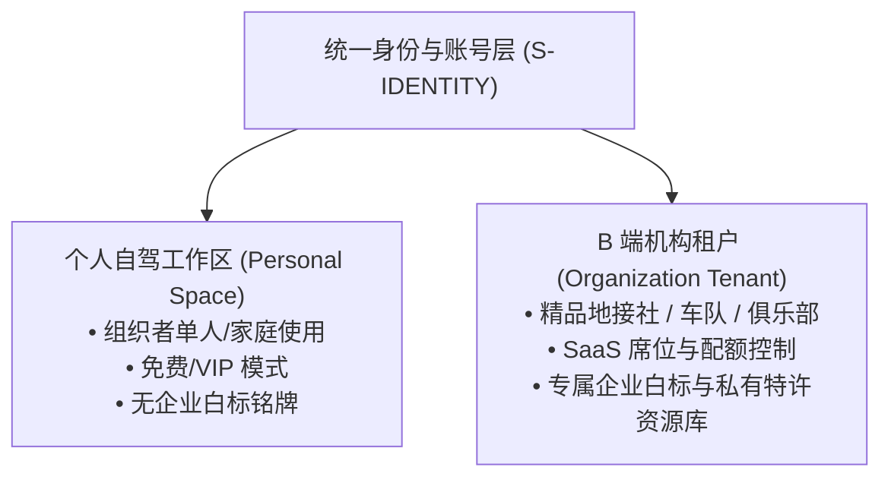
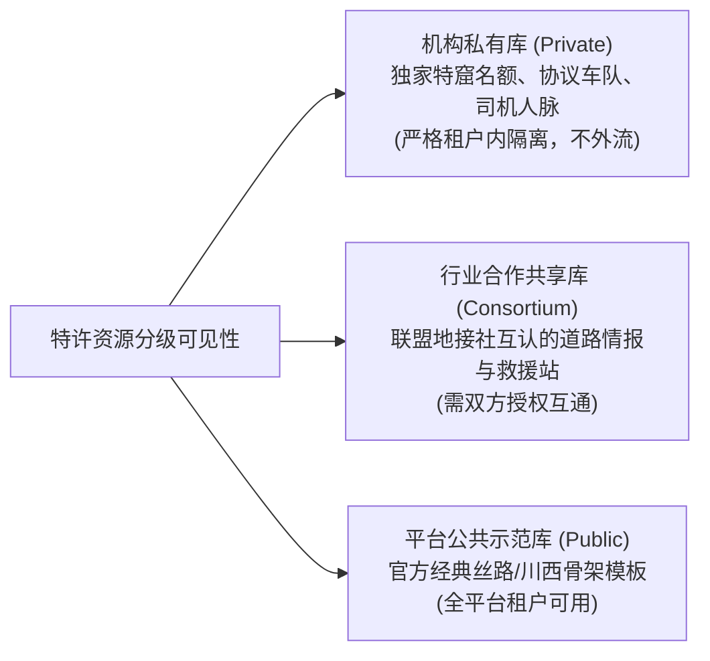
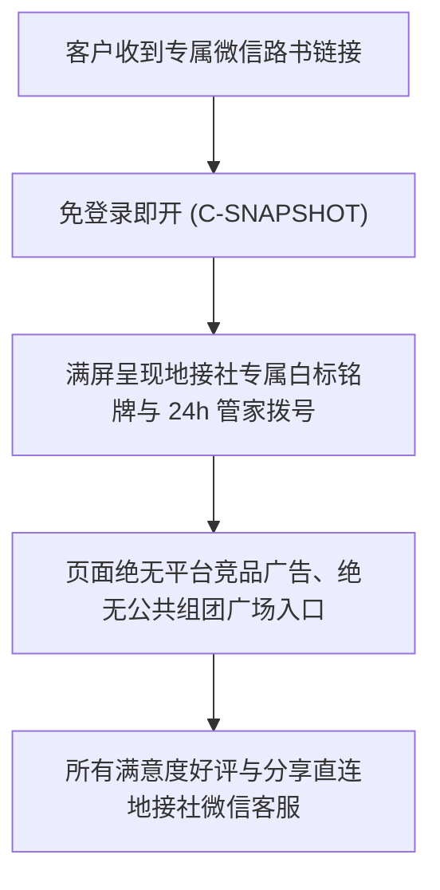
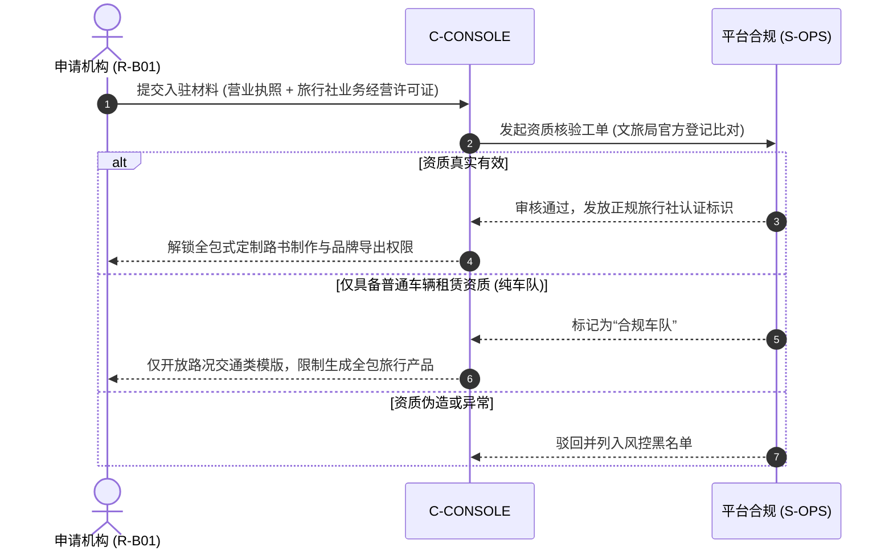

# ARC-06 · 多租户与白标架构

## 1. 租户模型划分：个人工作区 vs 机构租户

TripCraft 系统在架构底层清晰区隔个人自驾空间与 B 端商业机构空间：

---

## 2. 组织角色与权限矩阵 (RBAC Matrix)

机构租户内部设立精细角色控制，各角色对核心业务资源权限如下：

| 业务资源 (Resource) | 机构超级管理员 (R-B01) | 计调 / 定制师 (R-B02) | 随团导游 / 司机 (R-B03) | 机构客户 (R-B04) |
| :--- | :---: | :---: | :---: | :---: |
| **租户设置与财务账单** | CRUD (全部) | ❌ 仅只读配额 | ❌ 无权限 | ❌ 无权限 |
| **机构品牌白标包 (Brand)** | CRUD (全部) | ⚠️ 仅文案微调 | ❌ 无权限 | 👁️ 只读呈现 |
| **线路模板库 (Templates)** | CRUD (全部) | CRU (可建可改) | ❌ 无权限 | ❌ 无权限 |
| **私有特许资源库 (Resource)**| CRUD (全部) | RU (引用与调用) | ⚠️ 仅可上报地面情报 | ❌ 无权限 |
| **定制路书资产 (Trips)** | CRUD (全社路书) | CRUD (本人路书) | ⚠️ 仅查看被指派路书 | 👁️ 受邀只读阅览 |
| **行中应急路况补丁 (Patch)**| CR (发布与核准) | CR (发布) | CR (仅限路况上报) | ❌ 仅接收应用 |
| **客户个人敏感信息 (PII)** | 👁️ 完全查看 | 👁️ 业务所需查看 | ⚠️ 严格脱敏查看 | 👁️ 仅本人信息 |

---

## 3. 白标配置契约与自定义域名策略

### 白标契约遵从 `brand.schema.json`
依据 [`spec/brand.schema.json`](../../spec/brand.schema.json)，机构白标定义以下核心字段：
- `tenantId`：全局唯一机构租户标识；
- `displayName`：地接社对外法定/品牌全称（如“敦煌丝路行定制旅行”）；
- `logoUrl`：高保真品牌矢量图标（内联 base64 或安全 CDN 地址）；
- `concierge`：24 小时随团管家直连热线及应急救援绿色通道；
- `badgeText`：专属企业认证铭牌文案（如“本社特许·精品小团自驾保障”）。

### 域名交付策略
严格落实历史 [白皮书 §5.6 更正口径](../WHITEPAPER.md#56-维度-5企业级专属域名与私密密码锁)：
1. **默认交付**：采用平台统一受控二级路由（如 `https://tripcraft.app/v/{tenant_slug}/{trip_id}`）；
2. **免装离线交付**：直接导出带完整内联品牌 Logo 的零依赖单文件 HTML，通过微信直发客户；
3. **独立 CNAME 绑定**：若机构具有自有合规域名（如 `roadbook.agency.com`），支持 CNAME 解析至平台静态托管网关，由平台自动签署 SSL 证书。

---

## 4. 资源库可见性与分级共享机制

机构资产按照“私有壁垒、行业共享、平台公域”三级划定可见性：

---

## 5. 租户数据隔离机制 (Proposed Tenant Isolation)

依据 [ADR-007 多租户隔离方式](adr/ADR-007-multitenancy-isolation.md)，架构采用**共享数据库 + 行级安全策略 (Row-Level Security, RLS)**：
- 所有机构业务表包含不可伪造的 `tenant_id` 外键约束；
- 在数据库连接会话中注入当前请求的 `TenantContext`，底层自动追加隔离过滤条件；
- 与 [白皮书 §8.5](../WHITEPAPER.md#85-商业秘密与对外交流规范) 保持一致：机构的商业定价、私有客源与特许关系属于保密商业秘密，与开源代码物理解耦。

---

## 6. 机构客户 (R-B04) 体验模式与私域归属

地接社最核心的顾虑是“平台做大后抢走我的客户”。系统从底层架构上杜绝撬客：

1. **客户属于机构**：平台不要求游客注册全局平台账号，游客仅作为“此行程的受邀访客”；
2. **纯净交付**：白标路书中不植入任何公域导流外链，尊重小 B 的私域流量资产。

---

## 7. 机构资质准入与风控机制 (Compliance Onboarding)

严格遵循 [docs/13 §13.5.4 资质红线](../13-agency-partnership-design.md#1354--一个必须先回答的问题他有资质吗)：

