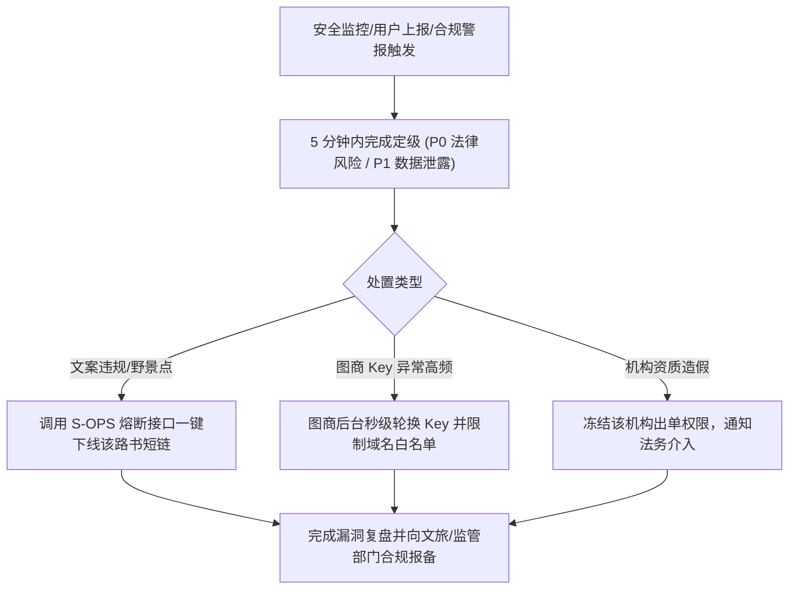

# ARC-07 · 安全、隐私与合规架构

## 1. 数据资产安全分级体系 (Data Classification)

系统遵循数据安全与个人信息保护要求，建立六级严格的数据分级与存储准则：

| 数据资产类别 | 典型字段与内容 | 敏感级别 | 存储介质与加密策略 | 保留周期与生命周期 | 访问权限控制范围 |
| :--- | :--- | :---: | :--- | :--- | :--- |
| **实名证件与订单号** | 身份证号、护照、酒店房号、车牌号 | **L4 (极高)** | **本地优先**；严禁明文入云端库；单文件导出强制掩码脱敏 | 行程结束后本地随手清理，云端零留存 | 仅本人及具备特许的当班带团司导脱敏查阅 |
| **实时位置与轨迹** | 成员经纬度坐标、GPS 轨迹回放 | **L3 (高)** | 独立内存通道 (Redis/MQTT)；严禁写入 DSL 真相源 | 实时信标随发随弃；打卡点保留至行程归档 | 仅同车队授权成员可见；支持一键单向关闭 |
| **个人原始照片与 EXIF**| 本地相册照片、EXIF 拍摄地理定位 | **L3 (高)** | **仅留存用户手机本地**；仅本地提取时间地点关联 | 本地自管；云端仅存储用户主动分享的压缩图 | 仅用户本人完全控制 |
| **支付与交易数据** | 机构 SaaS 订阅订单号、支付流水 | **L3 (高)** | 平台主数据库（AES-256 加密存储） | 按税法与财务合规要求保存 3–5 年 | 仅机构财务负责人与平台超级管理员 |
| **行程文档与节点** | 行程日历、景点、路线规划建议 | **L2 (中)** | 主数据库 + CDN 静态缓存 | 依据机构或用户空间有效期限长期保存 | 行程内成员读写；公众凭受控分享链接只读 |
| **机构白标与特许资源**| 机构商标、专属特窟渠道联系人 | **L2 (中)** | 租户物理/逻辑隔离存储 | 机构订阅存续期内持久保留 | 仅该机构内部定制师与管理员 |

---

## 2. 威胁建模与滥用防护清单 (Threat & Abuse Matrix)

针对自驾出行与路书分发的高频威胁场景，建立系统化防御控制：

| 威胁与滥用场景 | 攻击路径与潜在危害 | 控制措施与防御手段 | 落地验证手段 |
| :--- | :--- | :--- | :--- |
| **公开分享链接泄露** | 游客将路书转发至微信群，导致全团成员姓名与酒店外泄 | **导出即脱敏**：分享版强制剔除房号、证件号，署名替换为代号（“一位同行者”） | 自动化合规测试扫描分享产物敏感词 |
| **位置越权与人身跟踪** | 恶意成员借助位置共享功能长期跟踪离团成员行踪 | **信标围栏机制**：仅限当日行程激活态广播；成员可随时单方面静默切断定位 | 单元测试模拟断网与主动关闭定位 |
| **前端图商 Key 盗刷** | 导出的 HTML 包含静态高德 Key，被他人扒取高频调用刷爆账单 | **域名白名单 + 安全代理**：Key 绑定受限 HTTP Referer，服务端经代理调用高德 | 自动化 CI 扫描客户端构建代码禁入 Master Key |
| **恶意爬虫扒取地接资源**| 竞品批量抓取机构精心积累的特色小众景点与特许渠道 | **静态加密与私有鉴权**：机构私有特许资源仅内联于专属交付物中，不设公开 API 遍历 | API 网关设置 IP 速率限制与防爬指纹 |
| **算路 Polyline 违规落库**| 开发期图省事将高德算路密集坐标串内联存入路书，违反图商商用条款 | **BR-025 门禁拦截**：阈值限制连续点对 ≤ 49 点，超过 50 点强制构建失败 | `npm run check-br025` 门禁持续拦截 |

---

## 3. 隐私保护设计原则 (Privacy by Design)

严格落实 [docs/00 铁律 4 数据主权本地化](../00-overview-and-glossary.md#铁律-4--数据主权本地化-local-data-sovereignty)：
1. **数据收集最小化**：系统不索取与自驾规划无关的权限；游客免注册浏览路书；
2. **端侧隐私改写**：提名理由在离开设备前自动做身份剥离（如“我妈信佛” ➔ 改写为“一位长辈有宗教需求”）；
3. **彻底删除与可携权**：用户注销时支持一键打包导出全部行程 JSON DSL，并物理抹除中心库所有关联个人数据；
4. **定位开关绝对自主**：客户端设置常驻“隐身模式”开关，关闭后彻底阻断任何信标报文发送。

---

## 4. 合规审查与法律护栏对照清单

复用 [docs/07 法律、安全与合规护栏](../07-legal-and-compliance.md)，对关键涉法领域明确工程落地结论：

| 合规领域 | 适用法律法规与监管要求 | 系统架构控制结论 | 法律核验状态 |
| :--- | :--- | :--- | :--- |
| **个人信息保护** | 《个人信息保护法》(PIPL) | 不强制收集游客实名信息；提供清晰隐私政策与单点撤回同意入口。 | 已依据标准合规指引落地 |
| **地图与测绘合规** | 《测绘法》、自然资源部地图管理规定 | 采用合规商业图商官方审图号底图与 GCJ-02 坐标体系；绝不测绘涉密军事设施。 | 已接入正规图商 SDK |
| **AI 内容生成标识** | 《生成式人工智能服务管理暂行办法》 | AI 生成的草案与文化贴士显著标注“由 AI 辅助生成”；未核验景点标“同行者提议”。 | 工程逻辑已固化 |
| **旅行社经营边界** | 《旅游法》、文旅部无证经营查处规定 | 平台绝不自营旅游组团、不设个人收费资金池；严格审查地接社经营资质。 | [docs/13 §13.5.4 严格遵循](../13-agency-partnership-design.md#1354--一个必须先回答的问题他有资质吗) |
| **支付与资金托管** | 中国人民银行非银行支付机构监管条例 | 仅支持公对公技术软件服务费结算，绝不介入旅游团费第三方资金清算。 | **需执业律师确认** |

---

## 5. 安全事件应急响应流程 (Incident Response)

