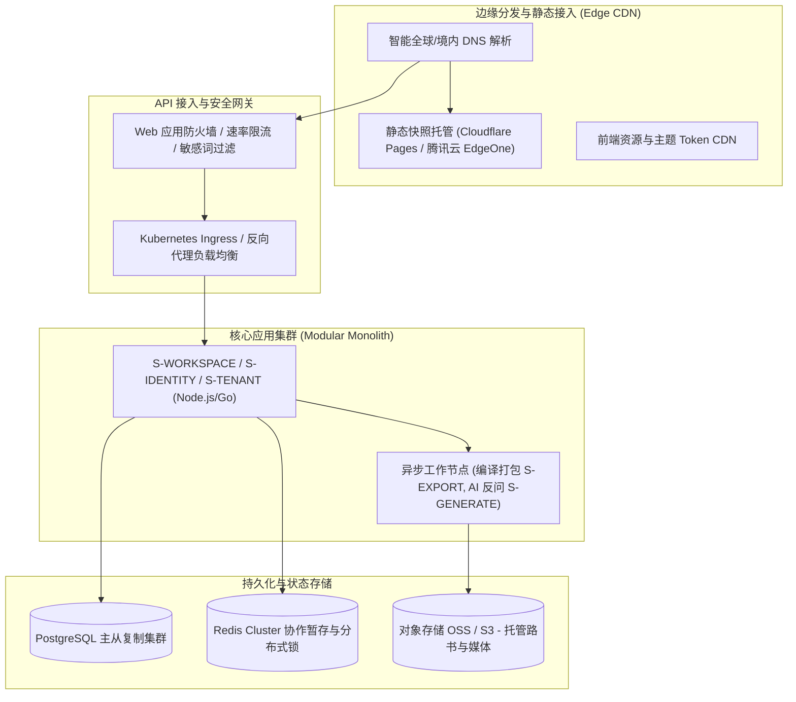

# ARC-08 · 非功能需求、部署拓扑与成本

## 1. 非功能性需求指标矩阵 (NFR Matrix)

> 标注：本表所列目标指标均为系统演进的建议值（**Proposed**），用于研发接手与压测验收。

| 维度类别 | 核心非功能目标要求 | 建议目标指标 (Proposed) | 验证方法与手段 |
| :--- | :--- | :--- | :--- |
| **系统可用性** | 核心 API 服务年可用度；单文件静态快照托管可用度 | API 服务 ≥ 99.9% ｜ 静态快照托管 ≥ 99.99% | 多区域 CDN 双活部署，健康检查拨测 |
| **极端离线能力** | 本地离线环境秒开路书，核心浏览功能完全不阻断 | 100% 离线可用，断网加载白屏率 0 | 模拟飞行模式离线自动化测试 |
| **同步交互延迟** | 在线弱网环境增量变更同步与状态机响应时效 | 同车队员操作广播延迟 ≤ 1.5s (P95) | 模拟 3G/弱网丢包环境端到端压测 |
| **首屏渲染性能** | 离线单文件快照双击打开至完全可交互时间 (TTI) | 产物大小 ≤ 2MB ｜ TTI ≤ 500ms | 静态 HTML 产物体积自动化门禁监控 |
| **跨端兼容性** | 现代手机浏览器与微信内置 Webview 兼容覆盖 | iOS 14+ / Android 9+ / 现代 Chromium 内核 | 自动化真机云测矩阵 |
| **无障碍标准 (A11y)**| 长辈关怀模式色彩对比度与触控区域适配 | 符合 WCAG 2.1 AA 级（对比度 ≥ 4.5:1，靶区 ≥ 48px） | Lighthouse A11y 自动化审计 |
| **数据持久性** | 机构核心路书元数据与版本历史防丢失可靠性 | 数据持久性 99.9999999% (9个9) | 云数据库多可用区同步复制与快照冷备 |
| **系统可观测性** | 错误日志聚合、合规审计追踪与告警响应时效 | 关键业务错误告警延迟 ≤ 1 分钟 | 统一接入 OpenTelemetry 与 Sentry |

---

## 2. 部署拓扑与环境架构 (Deployment Topology)

采用厂商中立的云原生部署架构，区分开发、预发与生产三套环境：

### 现存静态快照托管基准
- 当前在线参考体验站（`trip-cts.pages.dev`）托管于 Cloudflare Pages 边缘节点，作为单文件自包含 HTML 的分发可行性基准。

---

## 3. 流量特征与季节性突发模型 (Traffic Patterns)

自驾旅行产品呈现鲜明的**“低频、强季节性、长尾波峰”**特征：

### 应对策略
1. **节前扩容**：针对节前规划期，弹性扩容 `S-GENERATE` 与地图检索计算节点；
2. **边缘分发抗峰**：行中产生的数百万次路书打开完全被边缘 CDN 静态快照吸收，不穿透至后端主数据库。

---

## 4. 成本驱动要素与敏感性分析

依据决策 D4，架构仅分析成本敏感因果，不预设编造未经实测的固定金额：

| 成本要素 | 成本弹性特征 | 敏感性级别 | 架构控制与优化手段 |
| :--- | :--- | :---: | :--- |
| **商业地图 API 调用** | 随行程节点搜索与规划次数线性增长 | **高** | 实施本地离线 POI 缓存；合并相邻节点批量测距；坚决杜绝 polyline 冗余调用。 |
| **LLM 推理 Token 消耗** | 随反问轮次与提示词长度线性增长 | **中** | 严格限制苏格拉底反问 ≤ 3 轮；提示词工程精简，采用轻量模型提取要素。 |
| **CDN 与存储带宽** | 随路书体积与访问量增长 | **低** | 严控单文件 HTML ≤ 2MB；全站开启 gzip/brotli 压缩；限制超大原图上传。 |
| **云服务器计算底座** | 容器按需自动水平弹性伸缩 (HPA) | **低** | 模块化单体形态具备极高资源利用率，淡季缩容至最低节点数。 |

---

## 5. 运维可观测性与监控告警基础

1. **分布式链路追踪**：为每个入站请求注入唯一 `trace_id`，打通网关、业务逻辑及外部服务。
2. **核心业务监控大盘**：
   - 外部图商 API 成功率与响应延迟 P99；
   - 离线单文件快照编译失败率（告警阈值 > 0.1%）；
   - 租户出单配额异常告警。
3. **备份与灾备恢复演练**：
   - 生产数据库每 24 小时全量冷备，WAL 日志实时归档（实现 RPO ≤ 5 分钟，RTO ≤ 30 分钟）。
