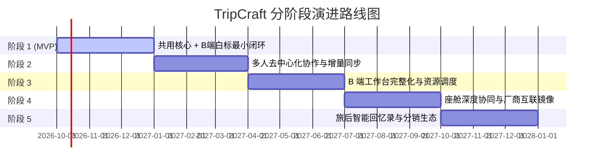

# DLV-01 · 路线图与 MVP 交付边界

## 1. 分阶段实施策略与 MVP 定义

依据决策 D2，TripCraft 采取 **“共用核心 + B 端白标最小闭环先行”** 的演进路径：
- **核心逻辑**：C 端单一工具护城河浅、获客成本高；线下精品地接社与定制车队对高质感路书出单与品牌白标有直接付费意愿（[A-03](../../ASSUMPTIONS.md)）。通过赋能 3–5 家小 B 机构切入，以真实客户交付验证数据契约与离线快照，再逐步扩展多人协作与座舱生态。

---

## 2. 阶段详细交付范围与标准矩阵

### 阶段 1：共用核心 + B 端白标最小闭环 (MVP)
- **目标用户**：3–5 家试点精品地接社定制师 (R-B02)、机构管理员 (R-B01)、种子组织者 (R-C01)。
- **包含功能 (P0 全部)**：
  - 账号与机构角色：`F-M01-01`, `F-M01-02`, `F-M01-03`
  - 行程工作区：`F-M02-01`, `F-M02-02`, `F-M02-03`, `F-M02-04`
  - 澄清与合规生成：`F-M03-01`, `F-M03-02`, `F-M03-03`, `F-M03-04`
  - 协作基础：`F-M04-01`
  - 地图与路线底座：`F-M05-01`, `F-M05-02`
  - 离线优先与快照导出：`F-M06-01`, `F-M08-01`, `F-M08-02`
  - 座舱深链交付：`F-M07-01`
  - 内容与长辈大字版：`F-M09-01`, `F-M09-02`, `F-M09-03`
  - B 端白标工作台与计费：`F-M11-01`, `F-M11-02`, `F-M11-03`, `F-M12-01`
  - 平台资质审查与消息：`F-M13-01`, `F-M13-02`, `F-M13-03`, `F-M14-01`
- **退出标准 (Definition of Done)**：
  - 3–5 家地接社成功完成资质认证并录入企业品牌铭牌；
  - 产出并交付至少 20 份真实甘青/川西路书，单份出单平均耗时 ≤ 20 分钟；
  - 导出的单文件 HTML 在完全断网飞行模式下 100% 正常渲染无白屏。
- **前置假设**：`A-03` (地接社愿为白标路书付费), `A-09` (图商商用成本可控), `A-10` (机构愿意接受资质审核), `A-11` (AI 生成 POI 准确)。
- **关键风险**：机构对新软件有习惯抗拒；AI 澄清阶段理解偏差。
- **所需能力类型**：全栈 Web/Node.js 研发、前端渲染与打包工程、旅行社业务 BD。
- **★ 本阶段明确不做什么 (Non-Goals)**：
  - 不做复杂的纯算法多人冲突自动仲裁；
  - 不做局域网点对点二维码补丁同步；
  - 不做车机原生 APK 或投屏镜像；
  - 不做 AI 视频回忆录生成；
  - 不做公域旅游电商撮合交易。

---

### 阶段 2：多人协作与行中增量同步
- **目标用户**：自驾团队同行成员 (R-C02)、低数字素养长辈 (R-C03)、随团司导 (R-B03)。
- **包含功能 (P1 协作与同步)**：
  - 多端漫游：`F-M01-04`
  - 沙盘推演：`F-M02-05`
  - 去中心化提名收齐：`F-M04-02`, `F-M04-03`, `F-M04-04`, `F-M04-05`
  - 沿途补给推荐：`F-M05-03`
  - 服务端操作日志增量同步与点对点 Patch：`F-M06-02`, `F-M06-03`
  - 旅程足迹记录：`F-M10-01`
  - 突发变更短信触达：`F-M14-02`
- **退出标准**：
  - 实现断网环境下领队向全车扫码分发 `TripPatch` 补丁，合并成功率 100%；
  - 多人提名界面实现“零文字”地图画圈意向收集，长辈表态可见率显著提升。
- **前置假设**：`A-08` (所选同步模型弱网体验良好), `A-12` (用户愿为多端协同迁移)。
- **★ 本阶段明确不做什么**：
  - 不做高频并发打字协同（OT/CRDT 协同文档编辑）；
  - 不做私有特许资源跨机构跨区域交易分销。

---

### 阶段 3：B 端工作台完整化与特许资源调度
- **目标用户**：成熟规模化地接社管理层、大型自驾车队调度员。
- **包含功能**：
  - 机构私有特许资源库管理：`F-M11-04`
  - 车队车辆与随团人员调度排班：`F-M11-05`
  - 按单加量包与用量灵活清算：`F-M12-02`
  - 纸质排版与长图海报导出：`F-M08-03`
- **退出标准**：机构自建私有资源库平均条目 ≥ 30 条，支持司导快速现场情报反哺。
- **★ 本阶段明确不做什么**：
  - 不自营车队车辆买卖或租赁重资产；
  - 不建立全国统一导游劳务雇佣平台。

---

### 阶段 4：座舱深度协同与厂商互联镜像
- **目标用户**：智能汽车车主、深度越野穿越爱好者。
- **包含功能**：
  - 离线路网与底图包支持：`F-M05-04`
  - 实时车队位置信标与脱敏雷达：`F-M06-04`
  - CarPlay / HiCar 车载投屏镜像自适应适配：`F-M07-02`
  - 车载副驾屏协同与沿途文化语音播报：`F-M07-03`
- **退出标准**：在主流车载投屏系统上实现 16:9 横屏无缝联动，驾驶状态安全锁零漏洞。
- **★ 本阶段明确不做什么**：
  - 绝不研发车辆底层 CAN 总线接入工具；
  - 绝不承诺干预或接管车辆底层自动辅助驾驶 (NOA)。

---

### 阶段 5：旅后回忆录、分销与生态扩展
- **目标用户**：全体自驾完赛旅客、生态合作伙伴。
- **包含功能**：
  - 本地相册 EXIF 照片智能时序匹配：`F-M10-02`
  - AI 图文旅行回忆录与短视频渲染：`F-M10-03`
  - C 端高级主题与多媒体增值结算：`F-M12-03`
- **退出标准**：旅客完赛后回忆录主动生成率 ≥ 30%，口碑自发分享带动新客回流。
- **★ 本阶段明确不做什么**：
  - 不自建独立重型短视频社交社区；
  - 不转型为消费级 OTA 平台。
