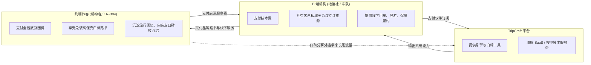

# PRD-02 · 用户与客户模型（C 端与 B 端）

## 1. 客户细分体系 (Customer Segments)

TripCraft 采用 B2B2C 双轮驱动模型，分别服务 C 端出行群体与 B 端专业服务机构：

| 细分群体 | 场景描述 | 频次与规模 | 现有替代方案 | 核心痛点与来源 | JTBD 目标宣言 | 采纳阻力 | 付费意愿假设 | 优先级 |
| :--- | :--- | :--- | :--- | :--- | :--- | :--- | :--- | :--- |
| **C 端：组织型自驾团** | 家庭/亲友自驾（5–10人，含长辈或儿童） | 低频深度（年 1–3 次，待调研） | 微信群笔记 + 手工 Excel | 意见分散、长辈不会用 App、行中突发变更脱节 ([docs/15 §15.1](../15-multi-device-and-collaboration.md#151-核心定调为什么-tripcraft-最终形态必须是多端同步-app)) | 当我们多代同行时，我想轻松收集全家愿望并确保长辈随时看懂，以便旅途安心顺畅。 | 传统软件安装门槛高、学习成本高 | 偏好免费基础版，愿为精美回忆录付费 ([A-02](../ASSUMPTIONS.md)) | **首批** |
| **C 端：小团 / 情侣自驾** | 2–4 人年轻自驾群体 | 中频（年 3–6 次，待调研） | 小红书攻略 + 收藏夹 | 信息碎片化、路线规划缺乏可行性开闭馆校验 ([docs/08 §8.1](../08-socratic-interaction-design.md)) | 当我们探索未知路线时，我想快速生成靠谱路书并直接投屏车机，以便专注享受风景。 | 习惯碎片化阅读，易流失 | 免费为主，增值主题与特许点位微付费 | 次批 |
| **C 端：独行自驾者** | 个人长途自驾、摄影探险 | 中高频（年多次，待调研） | 专业轨迹工具 (两步路) | 缺乏人文叙事排程、应急熔断机制单薄 ([docs/01 §1.6](../01-resilience-and-failover.md#16-中断处理爆炸半径与局部重算)) | 当我独自穿越时，我想拥有可靠的离线容灾和安全补给预警，以便安全返航。 | 偏好纯专业离线地图工具 | 硬件或座舱生态打包付费意愿待验证 | 远期 |
| **B 端：精品地接社** | 川西/西北/滇藏等高客单定制旅行社 (5–30人团队) | 高频（年交付数百单，待调研） | Word/PPT 打印版、截图长图 | 定制排单耗时长 (4–8h)、无数字化品牌、无法沉淀客户资产 ([docs/03 §3.1](../03-b2b-agency-operations.md#31-为什么-b2b-才是真正的护城河)) | 当我面对高净值客户时，我想在 20 分钟内生成带本社品牌的座舱级交互路书，以便提升成交溢价。 | 对新技术稳定性存疑，担心平台翘客户 | 愿按月订阅 SaaS 或按成单付费 ([A-03](../ASSUMPTIONS.md)) | **首批** |
| **B 端：自驾车队 / 包车** | 考斯特/越野车队、专职司导 | 季节性高频（待调研） | 纸质行程单、微信语音调度 | 无网垭口调度难、路况突发封路通知不及时 ([docs/02 §2.4](../02-cockpit-protocol.md#24-车队组网弱网通信与近场广播)) | 当车队穿行无人区时，我想零网络离线同步路况补丁并一键投递导航，以便全车步调一致。 | 司机数字化素养参差不齐 | 包含在机构采购或单次加量包中 | **首批** |
| **B 端：独立定制师/领队** | 自由定制师、俱乐部领队 (需合规资质挂靠) | 中高频（月均数单，待调研） | 个人微信直发文档 | 缺乏资质风控屏障、易触碰非法经营红线 ([docs/13 §13.5.4](../13-agency-partnership-design.md#1354--一个必须先回答的问题他有资质吗)) | 当我为熟客定制行程时，我想在合规框架内快速交付专业方案，以便保护个人从业安全。 | 资质合规审查要求 (G-24~G-27) | 个人专业版订阅意愿待验证 | 次批 |
| **远期垂直场景** | 研学团、企业会务、越野赛事 | 低频大体量（待调研） | 专业会议/研学管理系统 | 缺乏跨端多人自适应与多视角安全围栏 ([docs/14 §14.1](../14-generic-engine-and-vertical-expansion.md)) | 当我们组织大型集训时，我想分角色交付研学知识点与安全防走失围栏，以便统一管理。 | 决策链条长、定制要求复杂 | 项目制采购，预算较充足 | 远期 |

## 2. 角色矩阵 (Role Matrix)

系统涉及全域角色的客户端适配、核心任务与权限：

| 角色 ID | 角色名称 | 分类 | 主要使用端 | 核心任务 | 权限与访问范围概述 |
| :--- | :--- | :--- | :--- | :--- | :--- |
| **R-C01** | 组织者 / 领队 | C 端 | C-MOBILE, C-WEB | 发起行程、录入偏好、拍板方案、导出快照 | 行程所有者（Owner），具备全字段编辑与成员邀请权 |
| **R-C02** | 同行成员 | C 端 | C-MOBILE | 结构化提名想去地点、阐述理由、查阅今日行程 | 成员权限，可提名与撤销自己的意见，无删除他人行程权 |
| **R-C03** | 长辈 / 低数字素养成员 | C 端 | C-SNAPSHOT, C-MOBILE | 免安装查看今日重点、看大字版路线与集合时间 | 只读权限，免登录快照访问，无编辑权 |
| **R-C04** | 独行自驾者 | C 端 | C-MOBILE, C-CABIN | 单人路线规划、深链投递车机、记录个人足迹 | 个人工作区完全控制权 |
| **R-B01** | 机构管理员 | B 端 | C-CONSOLE | 管理租户、配置白标品牌、购买订阅、分配席位 | 租户超级管理员（Tenant Admin），掌管财务与组织 |
| **R-B02** | 计调 / 定制师 | B 端 | C-CONSOLE | 制作路书、调用特许资源库、生成客户交付链接 | 创作者权限，管理所分配路书及资源模版 |
| **R-B03** | 导游 / 随团司机 | B 端 | C-MOBILE, C-CABIN | 行中执行、查阅脱敏名单、下发路况补丁、一键报备 | 执行者权限，可发布特定路况补丁，仅查看脱敏名单 |
| **R-B04** | 机构客户（终端旅客） | 混合 | C-SNAPSHOT, C-MOBILE | 接收机构专属白标路书、一键呼叫管家、离线阅览 | 终端客户只读受邀凭证，无机构后台权限 |
| **R-P01** | 平台运营与风控 | 平台 | C-CONSOLE (Ops) | 租户资质审核、敏感词合规巡检、高风险路书处置 | 平台系统管理员（Platform Admin），只读抽检与合规下架 |
| **R-O01** | 车厂 / 生态伙伴 | 生态 | 开放标准接口 | 远期互联协议对齐、座舱桌面规范适配 | 仅限遵循公开协议规范的标准交互，无内网数据接口 |

## 3. 代表人物卡 (Persona Cards)

> ⚠️ **声明**：以下人物卡均为**虚构代表人物**，基于现有架构文档逻辑推演，非真实用户访谈实录，待后续实地调研核验 ([A-03](../ASSUMPTIONS.md))。

### 人物卡 1 · C 端组织者（虚构）
- **姓名/称呼**：周海（36 岁，互联网产品经理，家庭自驾组织者）
- **典型场景**：暑期组织 7 口之家（父母、妻子、双胞胎 6 岁）自驾青海湖+河西走廊。
- **痛点**：父亲不会打字且膝盖不好不能多走路；母亲信佛必须去塔尔寺；妻子想在茶卡盐湖拍照但怕晒怕人多；孩子需要固定午休时间。手工排 Excel 连续熬夜 3 天，出发后老人依然抱怨行程太累。
- **价值兑现**：周海在手机端发起行程，让母亲通过“为了长辈”按钮录入心愿，老父亲在地图上随手画圈指定张掖附近。系统识别出长辈步行硬约束，自动规划平缓方案，并一键导出大字版 HTML 发给父母微信，全家无怨言。

### 人物卡 2 · B 端定制师（虚构）
- **姓名/称呼**：林娜（29 岁，成都某精品川藏自驾地接社高级定制师）
- **典型场景**：为北京高净值家庭客户定制 8 天川西深度游，客单价 2.8 万元。
- **痛点**：客户反复修改稻城亚丁停留天数，每次修改都需要重新排布 Word 并校对酒店；导游在折多山遇大雪封路全靠微信语音临时喊话，客户体验混乱，公司难以形成数字化资产。
- **价值兑现**：林娜使用 TripCraft B 端工作台，从模板库一键调用川西精品骨架，5 分钟调整完成，打上本社专属铭牌与 24 小时管家联系方式交付。行中遇到封路，司导在手机端一键分发预案 B 补丁，全车秒级响应，客户赞赏其专业度并在朋友圈晒出白标路书。

## 4. B2B2C 价值流与关系模型

依据 [第 3 章](../03-b2b-agency-operations.md) 与 [第 13 章](../13-agency-partnership-design.md)，TripCraft 坚持“赋能小 B、服务大 C、平台不撬客”的原则：

### 关系边界与数据归属说明
1. **客户关系归属**：终端旅客是机构的私域客户，平台不向其推送竞品广告，不提供公域“拼团/找团”撮合中心，不建立独立旅游电商平台 ([docs/13 §13.3.3](../13-agency-partnership-design.md#1333-三条不越线))。
2. **免注册原则**：机构客户无需注册平台全局账号即可凭专属凭证链接完整阅览路书 ([docs/03 §3.2.2](../03-b2b-agency-operations.md#322--关键设计决策游客没有账号))，切实降低使用门槛并减少合规风险。
3. **数据主权**：机构的特许私有资源库（内部接待通道、协议车队）完全物理/逻辑隔离，绝不流入公共大模型公域语料池 ([docs/00 铁律 4](../00-overview-and-glossary.md#铁律-4--数据主权本地化-local-data-sovereignty))。
