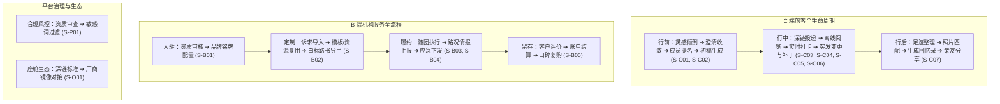

# PRD-03 · 业务与使用场景

## 1. 业务生命周期全景

TripCraft 覆盖 C 端自驾生命周期与 B 端专业机构服务流转全周期：

---

## 2. C 端核心使用场景 (S-C01 ~ S-C07)

### S-C01 新建行程（自由倾倒与零输入向导）
- **角色**：R-C01（组织者）
- **触发**：组织者计划一次自驾出行，点击“新建行程”。
- **前置条件**：已登录 C-MOBILE 或 C-WEB。
- **主流程**：
  | # | 用户动作 | 系统响应 | 涉及组件 |
  |---|---|---|---|
  | 1 | 输入“暑假想带父母和小孩自驾甘肃青海8天，求宽松” | 语义解析行程天数、意向目的地与同行群体标签 | S-GENERATE |
  | 2 | 查看系统反问：“老人的体力如何？是否有宗教禁忌或必去点？” | 提示关键约束，引导点选标签，避免无休止自由问答 | S-GENERATE, C-MOBILE |
  | 3 | 选择“长辈轻体力、母亲想去塔尔寺、小孩不耐车程” | 求解可行节点序列，生成包含休息间隔的初稿 | S-GENERATE, S-WORKSPACE |
  | 4 | 点击“生成行程草案” | 生成包含 `tentative` 标记的行程 DSL 并加载地图沙盘 | S-WORKSPACE, S-GEO |
- **异常 / 边界**：
  1. 用户输入极端模糊（如“带全家去玩”）：系统给出 3 组经典范式（大西北、川西、江南）卡片供一键初始化。
  2. 意向行程时间过短但点位过多：触发疲劳驾驶预警，自动建议压缩点位或拆分为两期。
- **成功标准**：首次初稿生成时间 ≤ 2 分钟，反问不超过 3 轮。
- **关联功能**：`F-M03-01`, `F-M03-02`, `F-M03-03` ｜ **关联文档**：[docs/08 §8.1](../08-socratic-interaction-design.md)

### S-C02 多人共创（结构化提名与去中心化收齐）
- **角色**：R-C01（组织者）、R-C02（同行成员）
- **触发**：组织者将行程空间邀请链接分享至同行亲友群。
- **前置条件**：行程草案已建立，成员通过链接进入。
- **主流程**：
  | # | 用户动作 | 系统响应 | 涉及组件 |
  |---|---|---|---|
  | 1 | 成员点击群邀请链接进入协同空间 | 显示行程概貌与“我也想提个点”入口，无需强制注册 | S-COLLAB, C-MOBILE |
  | 2 | 成员 A 选点“茶卡盐湖”，点击理由标签“怕人多” | 系统结构化记录提名与顾虑，离开设备前脱敏个人真名 | S-COLLAB |
  | 3 | 长辈成员在地图上随手画圈选中张掖附近区域 | 系统生成半径范围待定点，标记为沉默成员意向 | S-COLLAB, S-GEO |
  | 4 | 组织者查阅汇总清单（含沉默未表态成员提示） | 聚合展示硬约束与偏好，标注潜在时间冲突，不自动投票裁决 | S-COLLAB, S-WORKSPACE |
- **异常 / 边界**：
  1. 成员提名地点严重偏离主干线（偏航超 200km）：标红提示“偏航增加 4 小时车程”，保留提案待人工定夺。
  2. 多人意向存在排他性冲突：依据 [docs/15 §15.5.4](../15-multi-device-and-collaboration.md#1554--接缝清单在哪里变成-88-的冲突) 提示“分头行动”或“显式二选一”，禁止算法强制投票。
- **成功标准**：群成员参与提名率 ≥ 60%（指标占位）。
- **关联功能**：`F-M04-01`, `F-M04-02`, `F-M04-03`, `F-M04-04` ｜ **关联文档**：[docs/15 §15.5](../15-multi-device-and-collaboration.md#155--协作层的设计原则只负责收齐不负责裁决)

### S-C03 行中导航与打卡（深链投递到座舱导航）
- **角色**：R-C01（驾驶员/领队）
- **触发**：早晨出发准备启程，需要将当日导航点同步至车辆。
- **前置条件**：手机已安装高德/百度地图，且手机已与车机互联。
- **主流程**：
  | # | 用户动作 | 系统响应 | 涉及组件 |
  |---|---|---|---|
  | 1 | 在手机 App 打开“今日行程”，点击“投递到车机导航” | 组装当日途经点协议深链（Schema URL） | C-CABIN, S-GEO |
  | 2 | 系统调起地图客户端并将批处理途经点注入系统 | 地图 App 启动多途经点规划并流转至车载大屏 | C-CABIN |
  | 3 | 到达景点后，同行成员点击“打卡” | 记录本地打卡时间戳与地理位置存证 | S-MEDIA, C-MOBILE |
- **异常 / 边界**：
  1. 车辆或系统地图未登录同账号导致投递中断：降级展示途经点二维码由车机相机扫描，或引导复制地点剪贴板。
  2. 途经点超过车机地图上限（通常为 4–8 个）：自动拆解为“上午段”与“下午段”两批次投递。
- **成功标准**：深链调起成功率 ≥ 95%（指标占位）。
- **关联功能**：`F-M07-01`, `F-M10-01` ｜ **关联文档**：[docs/02 §2.1](../02-cockpit-protocol.md)

### S-C04 断网 / 无人区离线使用
- **角色**：R-C01, R-C02, R-C03
- **触发**：车辆深入高海拔无人区或峡谷，移动网络信号完全丢失。
- **前置条件**：出发前已缓存行程 DSL 或持有导出的单文件 HTML。
- **主流程**：
  | # | 用户动作 | 系统响应 | 涉及组件 |
  |---|---|---|---|
  | 1 | 在无网络状态下打开 TripCraft App 或单文件 HTML | 触发本地优先（Local-First）离线运行时，秒开完整路书 | C-SNAPSHOT, S-SYNC |
  | 2 | 查阅沿途海拔曲线、补给点坐标与离线应急应急指南 | 界面明确提示“离线模式 · 数据已缓存”，平稳展示全部信息 | C-SNAPSHOT, C-MOBILE |
  | 3 | 离线记录备忘笔记或标记已过点位 | 写入本地持久化存储（IndexedDB/LocalStorage），标待同步 | S-SYNC |
- **异常 / 边界**：
  1. 设备在离线时强行刷新页面：ServiceWorker 或离线单文件全内联机制保障无白屏 ([docs/00 铁律 3](../00-overview-and-glossary.md#铁律-3--降级不可耻白屏才是罪-degrade-never-blank))。
  2. 离线状态下尝试云端搜索新景点：提示“当前处于无网环境，已展示离线安全预案”。
- **成功标准**：离线高可用，无网络白屏率 0。
- **关联功能**：`F-M06-01`, `F-M08-01` ｜ **关联文档**：[docs/01 §1.1](../01-resilience-and-failover.md)

### S-C05 行中突发变更与全员同步 (Plan B 熔断)
- **角色**：R-C01（领队）、R-C02（成员）
- **触发**：前方垭口突发暴风雪封闭，需启动绕行熔断方案。
- **前置条件**：当前处于行中状态，各成员持有对应设备。
- **主流程**：
  | # | 用户动作 | 系统响应 | 涉及组件 |
  |---|---|---|---|
  | 1 | 领队在路书内点击“激活备选方案 B：绕行低海拔省道” | 计算增量变更，生成 `TripPatch` 补丁数据包 | S-WORKSPACE, S-SYNC |
  | 2 | 弱网环境下，系统优先尝试云端增量广播 | 云端下发 patch，已联网成员设备静默合并变更 | S-SYNC, S-NOTIFY |
  | 3 | 若领队与成员设备处于纯断网局域环境 | 领队手机屏幕展示动态 Patch 二维码，成员扫码应用 | S-SYNC, C-MOBILE |
  | 4 | 接收端显示变更确认弹窗：“前方道路封闭，已更新绕行” | 变更原地合并入本地路书，不推翻其他未变日程 | S-WORKSPACE, C-MOBILE |
- **异常 / 边界**：
  1. 接收端版本严重落后（跨多个 revision）：提示“存在中间版本缺口”，引导获取完整快照。
  2. 领队与成员同时编辑冲突：遵循 [ADR-002](../architecture/adr/ADR-002-sync-conflict-model.md) 服务端权威或领队优先策略，禁止静默覆盖。
- **成功标准**：补丁大小 ≤ 2KB，局域网/扫码合并耗时 ≤ 3 秒。
- **关联功能**：`F-M06-02`, `F-M06-03`, `F-M14-02` ｜ **关联文档**：[docs/01 §1.6](../01-resilience-and-failover.md#16-中断处理爆炸半径与局部重算), [spec/patch.schema.json](../../spec/patch.schema.json)

### S-C06 长辈与低数字素养成员使用快照
- **角色**：R-C03（长辈）、R-C01（子女/领队）
- **触发**：同行长辈需要了解今日集合时间与住宿安排，但不会安装 App。
- **前置条件**：组织者已导出静态单文件或分享链接。
- **主流程**：
  | # | 用户动作 | 系统响应 | 涉及组件 |
  |---|---|---|---|
  | 1 | 子女在 App 内点击“发给长辈”，生成单文件或免登链接 | 导出经脱敏、开启长辈关怀模式的自包含快照 | S-EXPORT, S-CONTENT |
  | 2 | 长辈在微信中点开网页链接 | 界面自动以 ≥18px 大字、极高对比度呈现今日要点 | C-SNAPSHOT, S-CONTENT |
  | 3 | 长辈查看集合时间、酒店名称与一键呼叫子女拨号卡 | 触控靶区 ≥48px，无广告弹窗，无层级跳转负担 | C-SNAPSHOT |
- **异常 / 边界**：
  1. 长辈误关微信窗口：支持微信“浮窗”保存，或在本地文件管理器直接打开离线 HTML。
  2. 链接在无网时被打开：若此前已加载，基于浏览器缓存机制仍可离线浏览。
- **成功标准**：长辈端零登录、零弹窗阻碍，首屏加载 ≤ 1 秒。
- **关联功能**：`F-M08-01`, `F-M09-03` ｜ **关联文档**：[docs/15 §15.2](../15-multi-device-and-collaboration.md#152-破除假想的四堵墙多端-app-如何兼顾全场景与-b-端白标)

### S-C07 旅后回忆录整理、分享与沉淀
- **角色**：R-C01, R-C02
- **触发**：行程结束，成员希望汇总全团照片并生成留念记录。
- **前置条件**：行程日期已完结，各端产生打卡数据。
- **主流程**：
  | # | 用户动作 | 系统响应 | 涉及组件 |
  |---|---|---|---|
  | 1 | 打开旅后视图，点击“一键生成旅途回忆录” | 提取行程实际轨迹与节点时序骨架 | S-MEDIA, S-WORKSPACE |
  | 2 | 用户授权读取本地相册近期照片 | 本地读取 EXIF 时间地点，与行程节点智能匹配关联 | S-MEDIA, C-MOBILE |
  | 3 | 点击“生成分享海报与精编快照” | 自动剔除私人证件等隐私信息，生成脱敏分享页 | S-EXPORT, S-MEDIA |
  | 4 | 分享至朋友圈或亲友圈 | 朋友打开可只读浏览精彩足迹与路线灵感，不能改写原单 | S-EXPORT, C-SNAPSHOT |
- **异常 / 边界**：
  1. 照片 EXIF 缺失经纬度：按拍摄时间推算最匹配的行程区间节点。
  2. 分享内容误包含敏感私人信息：严格触发 [PRD-01 §5](PRD-01-vision-positioning.md#5-能力边界规范-scope--boundaries) 脱敏规则，遮蔽房号与证件。
- **成功标准**：照片匹配准确率 ≥ 80%（指标占位）。
- **关联功能**：`F-M10-02`, `F-M10-03`, `F-M08-02` ｜ **关联文档**：[docs/06 §6.1](../06-memory-journal-engine.md)

---

## 3. B 端专业机构使用场景 (S-B01 ~ S-B05)

### S-B01 机构入驻、资质审核与品牌配置
- **角色**：R-B01（机构管理员）、R-P01（平台运营）
- **触发**：线下地接社或车队申请入驻 TripCraft B 端工作台。
- **前置条件**：具备合法市场主体资质，准备营业执照与旅行社业务经营许可证。
- **主流程**：
  | # | 用户动作 | 系统响应 | 涉及组件 |
  |---|---|---|---|
  | 1 | 在 C-CONSOLE 提交入驻申请并上传资质证件原件扫描件 | 校验机构统一社会信用代码并登记待审台账 | S-TENANT, S-OPS |
  | 2 | 平台运营人员核验其文旅局许可资质合规性 | 审核通过，发放企业租户专属空间，解除资质熔断限制 | S-OPS, S-TENANT |
  | 3 | 机构管理员配置品牌 Logo、专属配色、24h 应急救援铭牌 | 生成符合 `brand.schema.json` 规范的品牌包 | S-TENANT |
- **异常 / 边界**：
  1. 机构资质不全（如纯车队无旅行社资质却申请包揽住宿行程）：依据 [docs/13 §13.5.4](../13-agency-partnership-design.md#1354--一个必须先回答的问题他有资质吗) 限制其生成全包型产品，仅开放车队路况与交通模板。
  2. 品牌物料包含虚假绝对化用语：触发词表检查并驳回修改。
- **成功标准**：资质审核流转时效 ≤ 24 小时（指标占位）。
- **关联功能**：`F-M11-01`, `F-M13-01` ｜ **关联文档**：[docs/13 §13.5.4](../13-agency-partnership-design.md#1354--一个必须先回答的问题他有资质吗)

### S-B02 为客户定制路书（模板与特许资源复用）
- **角色**：R-B02（定制师）
- **触发**：接到高意向客户定制咨询，需快速出具方案。
- **前置条件**：机构已配置品牌资产与专属私有资源库。
- **主流程**：
  | # | 用户动作 | 系统响应 | 涉及组件 |
  |---|---|---|---|
  | 1 | 选择“基于甘青经典 8 日模版新建”，导入客户特定要求 | 快速实例化路书骨架，载入预设酒店与用车安排 | S-TENANT, S-WORKSPACE |
  | 2 | 拖入本社特许资源（如“莫高窟特窟绿色通道专员接待”） | 将私有特许节点插入日程，自动打上机构服务标签 | S-TENANT, S-WORKSPACE |
  | 3 | 耗时 15 分钟完成校对，点击“生成客户交付链接” | 编译生成打上机构品牌铭牌的交互式路书 | S-TENANT, S-EXPORT |
  | 4 | 微信发送给客户 | 客户免登录即开，呈现高质感专业交互界面 | C-SNAPSHOT |
- **异常 / 边界**：
  1. 特许资源配额冲突或闭馆时间变更：系统实时校验阻断并提示定制师更换时间段。
  2. 客户多次要求微调：定制师在后台修改后即时刷新快照版本，客户无需重收新文件。
- **成功标准**：单份定制路书产出耗时从 4 小时缩减至 ≤ 20 分钟。
- **关联功能**：`F-M11-02`, `F-M11-03`, `F-M11-04` ｜ **关联文档**：[docs/03 §3.1](../03-b2b-agency-operations.md#31-为什么-b2b-才是真正的护城河)

### S-B03 行程履约（随团导游/司机端调度与应急）
- **角色**：R-B03（导游/司机）、R-B04（旅客）
- **触发**：行程进行中，带团司导根据现场情况实施调度。
- **前置条件**：司导已绑定对应出团任务。
- **主流程**：
  | # | 用户动作 | 系统响应 | 涉及组件 |
  |---|---|---|---|
  | 1 | 司导在手机端查阅“今日带团清单”及全员脱敏信息 | 展示各成员饮食忌口、身体关注点与集合倒计时 | C-MOBILE, S-TENANT |
  | 2 | 遇到景区人流高峰，司导在端内发布“集合时间顺延 30 分钟” | 系统向全体团员推送日程微调通知 | S-SYNC, S-NOTIFY |
  | 3 | 旅客端路书实时滚动更新最新集合时间与定位 | 旅客界面无缝感知，消除微信群反复确认成本 | C-MOBILE, C-SNAPSHOT |
- **异常 / 边界**：
  1. 随团司导发生意外失去联系：机构管理员后台有一键改派司导权限，重新下发接管凭证。
  2. 旅客未安装 App 且未开启网络：司导端支持展示“集合变动手牌二维码”供线下扫码核验。
- **成功标准**：履约通知团员触达率 ≥ 99%（指标占位）。
- **关联功能**：`F-M11-05`, `F-M14-01`, `F-M14-02` ｜ **关联文档**：[docs/03 §3.2.3](../03-b2b-agency-operations.md#323-权限矩阵)

### S-B04 地面情报上报与特许资源库维护
- **角色**：R-B03（司机/导游）、R-B01（机构管理员）
- **触发**：司导现场发现某段道路新铺设沥青通畅，或某特色餐厅换址。
- **前置条件**：具有机构成员权限。
- **主流程**：
  | # | 用户动作 | 系统响应 | 涉及组件 |
  |---|---|---|---|
  | 1 | 司导在手机端点击“上报地面情报”，拍摄路况并添加说明 | 记录地理位置、通行车辆限制与时间有效期 | C-MOBILE, S-TENANT |
  | 2 | 机构工作台收到情报提醒，计调一键更新至企业资源库 | 将情报打上机构私有印记，供全体内部定制师复用 | S-TENANT |
- **异常 / 边界**：
  1. 虚假或冲突的情报上报：管理员具有核准驳回权限，未经审核不入正式库。
  2. 地理数据涉及保密红线：严格遵循合规审查，禁止录入涉军涉密敏感坐标。
- **成功标准**：机构内部地面资产月均沉淀 ≥ 10 条（指标占位）。
- **关联功能**：`F-M11-04`, `F-M13-02` ｜ **关联文档**：[docs/03 §3.1](../03-b2b-agency-operations.md#31-为什么-b2b-才是真正的护城河)

### S-B05 交付后的复购、转介绍与账单结算
- **角色**：R-B01（机构管理员）、R-B04（客户）
- **触发**：团队行程圆满结束，进入业务清算与口碑沉淀。
- **前置条件**：出团状态变更为“已完成”。
- **主流程**：
  | # | 用户动作 | 系统响应 | 涉及组件 |
  |---|---|---|---|
  | 1 | 系统自动向旅客路书尾页推送机构品牌感谢信与满意度评价卡 | 收集客户好评与对司导定制师的服务打分 | S-EXPORT, S-TENANT |
  | 2 | 旅客将带有机构 Logo 的精美路书分享至朋友圈 | 朋友圈潜在客户点开即看品牌专区与一键直连电话 | C-SNAPSHOT, S-TENANT |
  | 3 | 机构后台统一核算当月路书制作额度与按单使用费用 | 生成当期账单明细并完成结算扣费 | S-BILLING |
- **异常 / 边界**：
  1. 机构账户余额不足：提供 7 天宽限期，期间不影响已有客户正常离线阅览路书。
  2. 客户差评申诉：触发服务预警并直派机构客服介入。
- **成功标准**：白标路书二次转介绍咨询转化率提升（指标占位）。
- **关联功能**：`F-M11-03`, `F-M12-01`, `F-M12-02` ｜ **关联文档**：[docs/13 §13.5](../13-agency-partnership-design.md)

---

## 4. 平台治理与生态合作场景 (S-P01, S-O01)

### S-P01 平台运营：租户审核、内容与合规处置
- **角色**：R-P01（平台运营与风控）
- **触发**：日常巡检、用户举报或新租户入驻。
- **前置条件**：具备平台管理权限。
- **主流程**：
  | # | 用户动作 | 系统响应 | 涉及组件 |
  |---|---|---|---|
  | 1 | 系统自动化风控引擎扫描路书文案，命中涉嫌违规“野景点”或非法组团词汇 | 拦截自动发布，将其推入人工审核队列 | S-OPS, S-WORKSPACE |
  | 2 | 运营人员查核实际行程与机构资质 | 判定是否违规，下发整改意见或限制发布权限 | S-OPS |
  | 3 | 发现严重违规行为（如无资质非法组团收款）：执行紧急下架 | 熔断该行程的云端访问，保留证据链待查 | S-OPS, S-TENANT |
- **异常 / 边界**：
  1. 误判常规探险合规点：提供机构快速申诉通道与资质二次认证。
  2. 监管部门调取核验要求：出具完整不可篡改的操作审计日志存证。
- **成功标准**：高危合规违规拦截率达标（无遗漏）。
- **关联功能**：`F-M13-01`, `F-M13-02`, `F-M13-03` ｜ **关联文档**：[docs/07 §7.1](../07-legal-and-compliance.md#71-三条责任边界线的法律落地), [docs/15 §15.8](../15-multi-device-and-collaboration.md#158--这给法律面增加了三样东西)

### S-O01 车厂生态合作（远期标准化投递对接）
- **角色**：R-O01（车厂生态伙伴）、R-C01（车主）
- **触发**：车机厂商支持标准化行程卡片接入与桌面部件展示。
- **前置条件**：车厂支持标准互联协议或开放桌面小部件框架。
- **主流程**：
  | # | 用户动作 | 系统响应 | 涉及组件 |
  |---|---|---|---|
  | 1 | 车机端检测到手机与车辆互联建立 | 依据标准开放协议握手，同步今日行程卡片数据 | C-CABIN, S-GEO |
  | 2 | 车载副驾屏或桌面部件实时展示下一站 POI 展卡与沿途讲解 | 无缝渲染文化背书与补给提示，不干扰主驾仪表 | C-CABIN, S-CONTENT |
- **异常 / 边界**：
  1. 车厂私有协议不兼容：坚决降级为通用系统深链（高德/百度）或手机投屏镜像 ([docs/ERRATA 勘误](../ERRATA.md#24-智能座舱交付能力边界更正))。
  2. 车厂要求上传用户轨迹数据：严格依据隐私红线拒绝提供未脱敏定位。
- **成功标准**：标准接口零侵入适配，行车安全零干扰。
- **关联功能**：`F-M07-01`, `F-M07-02`, `F-M07-03` ｜ **关联文档**：[docs/12 §12.1](../12-oem-partnership-design.md), [docs/ERRATA.md](../ERRATA.md)
