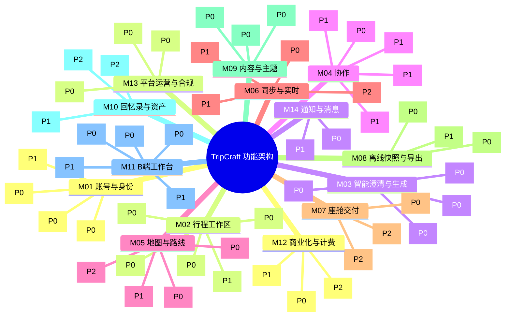

# PRD-04 · 功能架构与功能规格

## 1. 功能全景脑图 (Functional Mindmap)

## 2. 优先级与阶段定义

- **P0（必需，阶段 1 / MVP）**：共用核心闭环与 B 端白标最小交付体系。
- **P1（次要，阶段 2 / 阶段 3）**：多人协作收齐、增量同步与 B 端特许资源调度。
- **P2（探索，阶段 4 / 阶段 5）**：座舱深度镜像协同、旅后智能回忆录及生态连接。

---

## 3. 模块功能清单与 P0 功能卡

### M01 账号与身份 (S-IDENTITY)
- **目标**：支撑 C 端组织者与 B 端机构员工登录认证，保障游客免登录访问。
- **涉及角色**：R-C01, R-B01, R-B02, R-B03, R-B04

| 功能 ID | 名称 | 端分类 | 优先级 | 阶段 | 设计/实现状态 | 来源 |
| :--- | :--- | :--- | :--- | :--- | :--- | :--- |
| **F-M01-01** | 手机号/验证码与第三方登录 | C/B 共用 | P0 | 阶段 1 | 草案 / 无 | [PRD-02](PRD-02-personas-segments.md) |
| **F-M01-02** | 行程临时成员加入与昵称口令识别 | C 端 | P0 | 阶段 1 | 草案 / 无 | [docs/15 §15.9](../15-multi-device-and-collaboration.md#159--与-b-端白标的关系这个形态反而加固了第-13-章) |
| **F-M01-03** | 机构账号与多角色身份管理 | B 端 | P0 | 阶段 1 | 草案 / 无 | [docs/03 §3.2](../03-b2b-agency-operations.md#32-角色模型与权限矩阵) |
| **F-M01-04** | 设备绑定与多端会话漫游 | C/B 共用 | P1 | 阶段 2 | 草案 / 无 | [docs/15 §15.4](../15-multi-device-and-collaboration.md#154-多端协同设备矩阵手机--车机--ipad--桌面) |

#### F-M01-01 手机号/验证码与第三方登录
- **优先级/阶段**：P0 / 阶段 1 ｜ **端**：C-MOBILE, C-WEB, C-CONSOLE ｜ **模块**：M01
- **用户故事**：作为组织者或定制师，我想用手机验证码或微信快速登录，以便安全管理我的行程资产。
- **验收标准**：
  1. Given 未注册手机号，When 输入正确短信验证码，Then 自动创建账号并跳转至工作区首页。
  2. Given 微信授权登录，When 首次授权，Then 自动绑定当前设备并下发短期 Access Token。
- **依赖**：无 ｜ **设计/实现状态**：草案 / 无

#### F-M01-02 行程临时成员加入与昵称口令识别
- **优先级/阶段**：P0 / 阶段 1 ｜ **端**：C-MOBILE, C-SNAPSHOT ｜ **模块**：M01
- **用户故事**：作为同行旅客或机构客户，我想点击链接直接进入行程，以便无需注册账号即可协同或查看。
- **验收标准**：
  1. Given 收到受邀链接包含有效 `link_token`，When 在浏览器或端内打开，Then 免登直接进入当前行程视图。
  2. Given 首次进入协同空间，When 成员输入群内代号（如“姑姑”），Then 仅在当前行程内绑定该代号，不建立全局平台画像。
- **依赖**：F-M01-01 ｜ **设计/实现状态**：草案 / 无

#### F-M01-03 机构账号与多角色身份管理
- **优先级/阶段**：P0 / 阶段 1 ｜ **端**：C-CONSOLE ｜ **模块**：M01
- **用户故事**：作为机构管理员，我想为本社计调与司导分配不同角色席位，以便明确业务权限分工。
- **验收标准**：
  1. Given 租户管理员，When 邀请新计调加入，Then 计调获得创建与编辑路书权限，无法查看租户结算账单。
  2. Given 随团司导，When 被指派行程任务，Then 仅可查看指派路书的脱敏旅客名单与行程日程。
- **依赖**：F-M01-01 ｜ **设计/实现状态**：草案 / 无

---

### M02 行程工作区 (S-WORKSPACE)
- **目标**：管理行程元数据、每日日程（Days）与节点（Nodes）的结构化组织与版本。
- **涉及角色**：R-C01, R-B02

| 功能 ID | 名称 | 端分类 | 优先级 | 阶段 | 设计/实现状态 | 来源 |
| :--- | :--- | :--- | :--- | :--- | :--- | :--- |
| **F-M02-01** | 创建与初始化行程 | C/B 共用 | P0 | 阶段 1 | 草案 / 无 | [spec/trip.schema.json](../../spec/trip.schema.json) |
| **F-M02-02** | 行程日与节点管理 | C/B 共用 | P0 | 阶段 1 | 草案 / 无 | [spec/node.schema.json](../../spec/node.schema.json) |
| **F-M02-03** | 行程草案版本保存与回溯 | C/B 共用 | P0 | 阶段 1 | 草案 / 无 | [docs/04 §4.1](../04-dsl-specification-v1.md) |
| **F-M02-04** | 待定项 (tentative) 标记与管理 | C/B 共用 | P0 | 阶段 1 | 草案 / 无 | [docs/08 §8.7](../08-socratic-interaction-design.md#87--模糊输入的处理设计) |
| **F-M02-05** | 多方案对比与沙盘推演 | C/B 共用 | P1 | 阶段 2 | 草案 / 无 | [docs/15 §15.4](../15-multi-device-and-collaboration.md#154-多端协同设备矩阵手机--车机--ipad--桌面) |

#### F-M02-01 创建与初始化行程
- **优先级/阶段**：P0 / 阶段 1 ｜ **端**：C-MOBILE, C-CONSOLE ｜ **模块**：M02
- **用户故事**：作为用户，我想输入行程标题、起止日期与出发地，以便建立符合规范的行程真相源。
- **验收标准**：
  1. Given 用户输入有效标题与日期区间，When 提交创建，Then 生成符合 `trip.schema.json` 的空行程对象并分配全局唯一 `tripId`。
  2. Given 日期格式不符合 ISO-8601，When 校验时，Then 阻断提交并提示有效日期格式。
- **依赖**：F-M01-01 ｜ **设计/实现状态**：草案 / 无

#### F-M02-02 行程日与节点管理
- **优先级/阶段**：P0 / 阶段 1 ｜ **端**：C-MOBILE, C-CONSOLE ｜ **模块**：M02
- **用户故事**：作为创作者，我想在具体某天添加、排序或删除景点/餐饮/酒店节点，以便灵活排程。
- **验收标准**：
  1. Given 某日节点列表，When 用户上下拖拽节点，Then 自动重算节点的 `seq` 序号与相邻预计车程。
  2. Given 添加新节点，When 填写地点与建议耗时，Then 校验 `time.planned` 不与前序节点发生时间倒挂。
- **依赖**：F-M02-01 ｜ **设计/实现状态**：草案 / 无

#### F-M02-03 行程草案版本保存与回溯
- **优先级/阶段**：P0 / 阶段 1 ｜ **端**：C-MOBILE, C-CONSOLE ｜ **模块**：M02
- **用户故事**：作为创作者，我想保存草案快照并在改错时回退，以便保护排程劳动成果。
- **验收标准**：
  1. Given 用户进行关键编辑，When 触发保存，Then 本地自动递增保存草案快照历史（最近 10 版）。
  2. Given 用户点击历史回溯，When 确认载入历史版本，Then 将工作区当前状态原子性替换为所选版本。
- **依赖**：F-M02-01 ｜ **设计/实现状态**：草案 / 无

#### F-M02-04 待定项 (tentative) 标记与管理
- **优先级/阶段**：P0 / 阶段 1 ｜ **端**：C-MOBILE, C-CONSOLE ｜ **模块**：M02
- **用户故事**：作为用户，我想将尚未确定门票或酒店的节点标为待定，以便在成稿中保留探索弹性而不阻塞流程。
- **验收标准**：
  1. Given 未锁定具体酒店的住宿节点，When 勾选待定，Then 节点写入 `tentative: true` 及 `tentativeReason`。
  2. Given 导出或预览路书，When 遇到待定节点，Then 节点展示柔性虚线样式，不作为硬性日程催促。
- **依赖**：F-M02-02 ｜ **设计/实现状态**：草案 / 无

---

### M03 智能澄清与生成 (S-GENERATE)
- **目标**：自然语言倾倒意图识别，苏格拉底反问对齐约束，自动化产出合规 DSL。
- **涉及角色**：R-C01, R-B02

| 功能 ID | 名称 | 端分类 | 优先级 | 阶段 | 设计/实现状态 | 来源 |
| :--- | :--- | :--- | :--- | :--- | :--- | :--- |
| **F-M03-01** | 自由倾倒意向解析 | C/B 共用 | P0 | 阶段 1 | 草案 / 无 | [docs/08 §8.1](../08-socratic-interaction-design.md) |
| **F-M03-02** | 苏格拉底渐进式反问与偏好收敛 | C/B 共用 | P0 | 阶段 1 | 草案 / 无 | [docs/08 §8.3](../08-socratic-interaction-design.md) |
| **F-M03-03** | 行程 DSL 初稿生成与回显确认 | C/B 共用 | P0 | 阶段 1 | 草案 / 无 | [docs/08 §8.5](../08-socratic-interaction-design.md) |
| **F-M03-04** | 规则与合规自动前置校验 | C/B 共用 | P0 | 阶段 1 | 草案 / 无 | [docs/07 §7.1.2](../07-legal-and-compliance.md#712-措辞白名单--黑名单编译器强制) |

#### F-M03-01 自由倾倒意向解析
- **优先级/阶段**：P0 / 阶段 1 ｜ **端**：C-MOBILE, C-CONSOLE ｜ **模块**：M03
- **用户故事**：作为组织者，我想直接粘贴长段聊天记录或口头想法，以便系统自动提取关键自驾要素。
- **验收标准**：
  1. Given 包含天数、成员和意向地点的非结构化文本，When 引擎解析，Then 结构化提取 `party`、`destinations` 与可用天数。
  2. Given 文本未提及出发日期，When 解析完成，Then 预设为“近期周末”并标记待用户澄清。
- **依赖**：无 ｜ **设计/实现状态**：草案 / 无

#### F-M03-02 苏格拉底渐进式反问与偏好收敛
- **优先级/阶段**：P0 / 阶段 1 ｜ **端**：C-MOBILE, C-CONSOLE ｜ **模块**：M03
- **用户故事**：作为用户，我想回答针对性的选择题而非写作文，以便快速敲定高原耐受度与作息偏好。
- **验收标准**：
  1. Given 检测到高海拔目的地，When 发起反问，Then 单次仅展示 1 组互斥选项（如“最高海拔上限：3000m / 3800m / 无限制”）。
  2. Given 反问轮次达到 3 轮，When 用户回答完毕，Then 立即收敛至方案生成，不再发起新反问。
- **依赖**：F-M03-01 ｜ **设计/实现状态**：草案 / 无

#### F-M03-03 行程 DSL 初稿生成与回显确认
- **优先级/阶段**：P0 / 阶段 1 ｜ **端**：C-MOBILE, C-CONSOLE ｜ **模块**：M03
- **用户故事**：作为用户，我想在生成前核对关键约束回显，以便确认 AI 没有理解偏差。
- **验收标准**：
  1. Given 解析完成的约束清单，When 生成前回显，Then 用户可一键修正关键参数后确认生成。
  2. Given 用户点击生成，When 求解成功，Then 输出合法的 `trip.json` 骨架并注入工作区。
- **依赖**：F-M03-02 ｜ **设计/实现状态**：草案 / 无

#### F-M03-04 规则与合规自动前置校验
- **优先级/阶段**：P0 / 阶段 1 ｜ **端**：C/B 引擎 ｜ **模块**：M03
- **用户故事**：作为平台，我想在路书生成即刻拦截涉密区域与违规表述，以便杜绝法律风险。
- **验收标准**：
  1. Given 生成文本命中禁用词库（如“绝对安全”“官方指定”），When 执行校验，Then 阻断落库并自动改写为合规推荐词。
  2. Given 涉及未核验野景点，When 校验时，Then 强制注入“同行者提议 · 未核验”标识。
- **依赖**：F-M03-03 ｜ **设计/实现状态**：草案 / 无

---

### M04 协作 (S-COLLAB)
- **目标**：去中心化收齐同行人意见，遵循“只收齐不裁决”原则。
- **涉及角色**：R-C01, R-C02, R-C03

| 功能 ID | 名称 | 端分类 | 优先级 | 阶段 | 设计/实现状态 | 来源 |
| :--- | :--- | :--- | :--- | :--- | :--- | :--- |
| **F-M04-01** | 邀请成员与空间共享 | C 端 | P0 | 阶段 1 | 草案 / 无 | [docs/15 §15.5](../15-multi-device-and-collaboration.md#155--协作层的设计原则只负责收齐不负责裁决) |
| **F-M04-02** | 景点提名与结构化理由收集 | C 端 | P1 | 阶段 2 | 草案 / 无 | [docs/15 §15.5.2](../15-multi-device-and-collaboration.md#1552--提名界面三个入口一个必填字段) |
| **F-M04-03** | 沉默成员可见与零输入表达 | C 端 | P1 | 阶段 2 | 草案 / 无 | [docs/15 §15.5.1](../15-multi-device-and-collaboration.md#1551-四条具体设计) |
| **F-M04-04** | 冲突检测与分头行动建议 | C 端 | P1 | 阶段 2 | 草案 / 无 | [docs/15 §15.5.4](../15-multi-device-and-collaboration.md#1554--接缝清单在哪里变成-88-的冲突) |
| **F-M04-05** | 领队决策与补丁合并确认 | C 端 | P1 | 阶段 2 | 草案 / 无 | [docs/01 §1.6.5](../01-resilience-and-failover.md#165-输出是补丁不是新路书) |

#### F-M04-01 邀请成员与空间共享
- **优先级/阶段**：P0 / 阶段 1 ｜ **端**：C-MOBILE, C-WEB ｜ **模块**：M04
- **用户故事**：作为组织者，我想生成一个专属群邀请链接，以便同行亲友一键加入协同空间。
- **验收标准**：
  1. Given 组织者点击分享，When 生成链接，Then 携带受控 `tripId` 与带时效的邀请签名。
  2. Given 成员通过链接进入，When 查看空间，Then 可见已排日程全貌与成员状态。
- **依赖**：F-M01-02 ｜ **设计/实现状态**：草案 / 无

---

### M05 地图与路线 (S-GEO)
- **目标**：标准化 POI 检索与经纬度对齐，提供耗时估算，保障地图商用合规。
- **涉及角色**：R-C01, R-B02

| 功能 ID | 名称 | 端分类 | 优先级 | 阶段 | 设计/实现状态 | 来源 |
| :--- | :--- | :--- | :--- | :--- | :--- | :--- |
| **F-M05-01** | POI 检索与经纬度合规对齐 | C/B 共用 | P0 | 阶段 1 | 草案 / 无 | [ADR-005](../architecture/adr/ADR-005-map-navigation-abstraction.md) |
| **F-M05-02** | 路线规划与耗时测算 | C/B 共用 | P0 | 阶段 1 | 草案 / 无 | [docs/01 §1.3](../01-resilience-and-failover.md) |
| **F-M05-03** | 沿途补给与服务区推荐 | C/B 共用 | P1 | 阶段 2 | 草案 / 无 | [docs/02 §2.6](../02-cockpit-protocol.md#26-关于读取车辆状态必须明确说不) |
| **F-M05-04** | 离线路网与简易底图包支持 | C 端 | P2 | 阶段 4 | 草案 / 无 | [docs/01 §1.1](../01-resilience-and-failover.md) |

#### F-M05-01 POI 检索与经纬度合规对齐
- **优先级/阶段**：P0 / 阶段 1 ｜ **端**：S-GEO 后端 ｜ **模块**：M05
- **用户故事**：作为创作者，我想在搜索景点时获得合规的经纬度与标准地名，以便准确排程。
- **验收标准**：
  1. Given 检索关键词“塔尔寺”，When 调取服务商适配层，Then 返回 GCJ-02 坐标及准确 POI ID，不直接在客户端暴露 Master Key。
  2. Given 坐标落库，When 写入节点，Then 仅保留离散经纬度点（≤2个坐标），不写入高密度 polyline（BR-025）。
- **依赖**：ADR-005 ｜ **设计/实现状态**：草案 / 无

#### F-M05-02 路线规划与耗时测算
- **优先级/阶段**：P0 / 阶段 1 ｜ **端**：S-GEO 后端 ｜ **模块**：M05
- **用户故事**：作为系统，我想测算相邻节点间的自驾里程与预计耗时，以便合理排布全天游玩节奏。
- **验收标准**：
  1. Given 两个有序 POI 节点，When 计算驾车距离，Then 返回公里数与预计分钟数，并自动附加 15% 山区冗余缓冲时间。
  2. Given 跨天单程车程超过 6 小时，When 输出方案时，Then 触发中途强制休息提示。
- **依赖**：F-M05-01 ｜ **设计/实现状态**：草案 / 无

---

### M06 同步与实时 (S-SYNC)
- **目标**：实现本地优先存储，支持在线操作日志增量同步与断网点对点补丁。
- **涉及角色**：R-C01, R-C02, R-B03

| 功能 ID | 名称 | 端分类 | 优先级 | 阶段 | 设计/实现状态 | 来源 |
| :--- | :--- | :--- | :--- | :--- | :--- | :--- |
| **F-M06-01** | 本地优先存储与离线读写 | C/B 共用 | P0 | 阶段 1 | 草案 / 无 | [ADR-002](../architecture/adr/ADR-002-sync-conflict-model.md) |
| **F-M06-02** | 服务端增量操作日志同步 | C/B 共用 | P1 | 阶段 2 | 草案 / 无 | [spec/patch.schema.json](../../spec/patch.schema.json) |
| **F-M06-03** | 二维码/短链点对点 Patch 分发 | C 端 | P1 | 阶段 2 | 草案 / 无 | [docs/15 §15.6.1](../15-multi-device-and-collaboration.md#1561--而点对点同步这块拼图书里已经有一块现成的) |
| **F-M06-04** | 实时成员信标与位置脱敏共享 | C 端 | P2 | 阶段 4 | 草案 / 无 | [docs/02 §2.4](../02-cockpit-protocol.md#24-cockpitbridge-适配器架构) |

#### F-M06-01 本地优先存储与离线读写
- **优先级/阶段**：P0 / 阶段 1 ｜ **端**：C-MOBILE, C-SNAPSHOT ｜ **模块**：M06
- **用户故事**：作为自驾用户，我想在无网环境下照常查看和记录备忘，以便应用在无人区始终可用。
- **验收标准**：
  1. Given 网络完全断开，When 用户打开行程，Then 瞬间从本地 IndexedDB 载入完整路书与地图矢量缓存。
  2. Given 离线新增备忘，When 写入本地，Then 数据标注为 `local_draft`，待网络恢复后异步排队上传。
- **依赖**：无 ｜ **设计/实现状态**：草案 / 无

---

### M07 座舱交付 (C-CABIN)
- **目标**：实现系统深链途经点批量投递与手机车载镜像适配，恪守能力边界。
- **涉及角色**：R-C01, R-B03, R-O01

| 功能 ID | 名称 | 端分类 | 优先级 | 阶段 | 设计/实现状态 | 来源 |
| :--- | :--- | :--- | :--- | :--- | :--- | :--- |
| **F-M07-01** | 高德/百度系统深链途经点批量投递 | C/B 共用 | P0 | 阶段 1 | 草案 / 无 | [docs/02 §2.1](../02-cockpit-protocol.md), [ERRATA](../ERRATA.md) |
| **F-M07-02** | 手机车载互联投屏与镜像适配 | C 端 | P2 | 阶段 4 | 草案 / 无 | [docs/12 §12.1](../12-oem-partnership-design.md) |
| **F-M07-03** | 车机专属分屏与副驾屏协同 | C 端 | P2 | 阶段 4 | 草案 / 无 | [docs/10 §10.3](../10-roadbook-reading-design.md) |

#### F-M07-01 高德/百度系统深链途经点批量投递
- **优先级/阶段**：P0 / 阶段 1 ｜ **端**：C-MOBILE, C-CABIN ｜ **模块**：M07
- **用户故事**：作为驾驶员，我想将全天途经点一键发到车机导航，以便无需手动逐个输入。
- **验收标准**：
  1. Given 某日包含 4 个途经点，When 点击“投递导航”，Then 构造高德/百度 URI Schema，调起原生导航并预填起点与途经点序列。
  2. Given 宿主设备未安装对应地图，When 调起失败，Then 优雅降级提示复制地址或显示二维码。
- **依赖**：F-M05-01 ｜ **设计/实现状态**：草案 / 无

---

### M08 离线快照与导出 (S-EXPORT)
- **目标**：一等公民交付形态，产出零依赖单文件 HTML 与只读分享链接。
- **涉及角色**：R-C01, R-B02, R-C03

| 功能 ID | 名称 | 端分类 | 优先级 | 阶段 | 设计/实现状态 | 来源 |
| :--- | :--- | :--- | :--- | :--- | :--- | :--- |
| **F-M08-01** | 单文件 HTML 离线交付包编译 | C/B 共用 | P0 | 阶段 1 | 草案 / 无 | [docs/05 §5.1](../05-compiler-pipeline.md), [ADR-006](../architecture/adr/ADR-006-snapshot-delivery-format.md) |
| **F-M08-02** | 静态只读分享短链与快照托管 | C/B 共用 | P0 | 阶段 1 | 草案 / 无 | [docs/15 §15.10.2](../15-multi-device-and-collaboration.md#15102-三条不变量) |
| **F-M08-03** | PDF / 长图海报打印导出 | C/B 共用 | P1 | 阶段 3 | 草案 / 无 | [docs/05 §5.4](../05-compiler-pipeline.md) |

#### F-M08-01 单文件 HTML 离线交付包编译
- **优先级/阶段**：P0 / 阶段 1 ｜ **端**：S-EXPORT, CLI ｜ **模块**：M08
- **用户故事**：作为定制师或领队，我想导出独立 HTML 文件，以便发给长辈或在断网环境下双击即开。
- **验收标准**：
  1. Given 完整行程 DSL，When 编译器打包，Then 输出单一 `.html` 文件，所有样式、脚本与离线数据内联打包（≤2MB）。
  2. Given 在飞行模式下双击该 HTML，When 在任意现代浏览器打开，Then 界面完整渲染，无外链缺失导致的报错。
- **依赖**：ADR-006 ｜ **设计/实现状态**：草案 / 无

#### F-M08-02 静态只读分享短链与快照托管
- **优先级/阶段**：P0 / 阶段 1 ｜ **端**：S-EXPORT ｜ **模块**：M08
- **用户故事**：作为用户，我想生成微信分享链接，以便群外好友与长辈无需安装软件秒开。
- **验收标准**：
  1. Given 生成分享版，When 用户生成短链，Then 自动剥离个人证件与私密备注（脱敏）。
  2. Given 协作服务端下线销毁，When 访问已托管的静态快照链接，Then 快照依然长期稳定可读（不变量 I-2）。
- **依赖**：F-M08-01 ｜ **设计/实现状态**：草案 / 无

---

### M09 内容与主题 (S-CONTENT)
- **目标**：提供高质量路书视觉呈现，支持长辈关怀模式与文化展卡。
- **涉及角色**：R-C01, R-C03, R-B04

| 功能 ID | 名称 | 端分类 | 优先级 | 阶段 | 设计/实现状态 | 来源 |
| :--- | :--- | :--- | :--- | :--- | :--- | :--- |
| **F-M09-01** | 官方与季节视觉主题包加载 | C/B 共用 | P0 | 阶段 1 | 草案 / 无 | [docs/09 §9.1](../09-visual-design-system.md) |
| **F-M09-02** | POI 展卡与文化背书信息渲染 | C/B 共用 | P0 | 阶段 1 | 草案 / 无 | [docs/10 §10.2](../10-roadbook-reading-design.md) |
| **F-M09-03** | 长辈关怀大字版与高对比度渲染 | C 端 | P0 | 阶段 1 | 草案 / 无 | [docs/15 §15.2](../15-multi-device-and-collaboration.md#152-破除假想的四堵墙多端-app-如何兼顾全场景与-b-端白标) |

#### F-M09-01 官方与季节视觉主题包加载
- **优先级/阶段**：P0 / 阶段 1 ｜ **端**：渲染引擎 ｜ **模块**：M09
- **用户故事**：作为用户，我想根据路线地域切换沙漠金或川西绿主题，以便路书契合旅行意境。
- **验收标准**：
  1. Given 切换主题为“丝路大漠”，When 页面渲染，Then 核心 CSS 变量（Token）平滑过渡至指定暖色调。
  2. Given 弱网环境，When 主题加载，Then 纯 CSS 变量即时生效，无外部 WebFont 阻塞白屏。
- **依赖**：无 ｜ **设计/实现状态**：草案 / 无

#### F-M09-02 POI 展卡与文化背书信息渲染
- **优先级/阶段**：P0 / 阶段 1 ｜ **端**：渲染引擎 ｜ **模块**：M09
- **用户故事**：作为旅客，我想看到沿途景点的深度历史文化小贴士，以便丰富游玩内涵。
- **验收标准**：
  1. Given 具有 `culturalNotes` 的节点，When 展开展卡，Then 结构化展示背景、必看亮点与防坑避坑提示。
  2. Given 展卡内容，When 渲染时，Then 区分展示“官方事实”与“推荐建议”，字体样式明确区隔。
- **依赖**：F-M02-02 ｜ **设计/实现状态**：草案 / 无

#### F-M09-03 长辈关怀大字版与高对比度渲染
- **优先级/阶段**：P0 / 阶段 1 ｜ **端**：C-SNAPSHOT, C-MOBILE ｜ **模块**：M09
- **用户故事**：作为长辈，我想一眼看清今日集合与酒店信息，以便不费力看手机。
- **验收标准**：
  1. Given 激活长辈模式，When 页面呈现，Then 基准字号 ≥ 18px，触控区域高度 ≥ 48px，色彩对比度符合 WCAG AA 级。
  2. Given 关键电话号码，When 点击，Then 触发一键拨号交互。
- **依赖**：无 ｜ **设计/实现状态**：草案 / 无

---

### M10 回忆录与资产 (S-MEDIA)
- **目标**：管理旅中打卡足迹，行后本地匹配照片并生成纪念资产。
- **涉及角色**：R-C01, R-C02

| 功能 ID | 名称 | 端分类 | 优先级 | 阶段 | 设计/实现状态 | 来源 |
| :--- | :--- | :--- | :--- | :--- | :--- | :--- |
| **F-M10-01** | 旅程足迹与节点打卡记录 | C 端 | P1 | 阶段 2 | 草案 / 无 | [docs/06 §6.1](../06-memory-journal-engine.md) |
| **F-M10-02** | 本地照片自动按时间地点匹配 | C 端 | P2 | 阶段 5 | 草案 / 无 | [docs/06 §6.3](../06-memory-journal-engine.md) |
| **F-M10-03** | AI 旅后图文回忆录与视频生成 | C 端 | P2 | 阶段 5 | 草案 / 无 | [docs/06 §6.5](../06-memory-journal-engine.md) |

---

### M11 B 端工作台 (S-TENANT)
- **目标**：为旅行社与车队提供品牌白标配置、模板库管理与客户专属交付。
- **涉及角色**：R-B01, R-B02, R-B03, R-B04

| 功能 ID | 名称 | 端分类 | 优先级 | 阶段 | 设计/实现状态 | 来源 |
| :--- | :--- | :--- | :--- | :--- | :--- | :--- |
| **F-M11-01** | 机构品牌资产配置与白标定制 | B 端 | P0 | 阶段 1 | 草案 / 无 | [spec/brand.schema.json](../../spec/brand.schema.json) |
| **F-M11-02** | 定制师路书制作与模板复用 | B 端 | P0 | 阶段 1 | 草案 / 无 | [docs/03 §3.3](../03-b2b-agency-operations.md) |
| **F-M11-03** | 客户交付卡与服务链接分发 | B 端 | P0 | 阶段 1 | 草案 / 无 | [docs/03 §3.6](../03-b2b-agency-operations.md#36-访问控制与分享版) |
| **F-M11-04** | 私有特许资源库管理 | B 端 | P1 | 阶段 3 | 草案 / 无 | [docs/13 §13.2](../13-agency-partnership-design.md) |
| **F-M11-05** | 车队与随团人员指派调度 | B 端 | P1 | 阶段 3 | 草案 / 无 | [docs/03 §3.2.3](../03-b2b-agency-operations.md#323-权限矩阵) |

#### F-M11-01 机构品牌资产配置与白标定制
- **优先级/阶段**：P0 / 阶段 1 ｜ **端**：C-CONSOLE ｜ **模块**：M11
- **用户故事**：作为机构管理员，我想上传企业 Logo、客服热线与专属配色，以便所有交付路书均展示本社品牌。
- **验收标准**：
  1. Given 上传企业品牌物料，When 校验通过，Then 保存符合 `brand.schema.json` 规范的品牌配置。
  2. Given 导出路书，When 渲染产物，Then 页头、封面及分享摘要均自动展示该机构白标铭牌。
- **依赖**：F-M01-03 ｜ **设计/实现状态**：草案 / 无

#### F-M11-02 定制师路书制作与模板复用
- **优先级/阶段**：P0 / 阶段 1 ｜ **端**：C-CONSOLE ｜ **模块**：M11
- **用户故事**：作为定制师，我想从企业经典模板一键复制建立新路书，以便在 20 分钟内完成高品质出单。
- **验收标准**：
  1. Given 预设线路模板，When 点击复用，Then 完整克隆全部日与节点至新工作区，并自动关联新客户信息。
  2. Given 修改特定日程，When 保存，Then 不影响原母版线路。
- **依赖**：F-M02-01 ｜ **设计/实现状态**：草案 / 无

#### F-M11-03 客户交付卡与服务链接分发
- **优先级/阶段**：P0 / 阶段 1 ｜ **端**：C-CONSOLE ｜ **模块**：M11
- **用户故事**：作为定制师，我想一键复制尊享交付链接发给客户微信，以便客户免登体验数字化服务。
- **验收标准**：
  1. Given 完成审核的路书，When 生成交付链接，Then 附带客户专属服务卡片（含司导电话与紧急管家拨号）。
  2. Given 客户打开链接，When 阅览时，Then 界面无任何与旅行无关的公域推广导流。
- **依赖**：F-M08-02, F-M11-01 ｜ **设计/实现状态**：草案 / 无

---

### M12 商业化与计费 (S-BILLING)
- **目标**：管理机构 SaaS 订阅、按单计费加量包与用量核算。
- **涉及角色**：R-B01, R-P01

| 功能 ID | 名称 | 端分类 | 优先级 | 阶段 | 设计/实现状态 | 来源 |
| :--- | :--- | :--- | :--- | :--- | :--- | :--- |
| **F-M12-01** | 机构基础 SaaS 订阅与配额管理 | B 端 | P0 | 阶段 1 | 草案 / 无 | [PRD-05](PRD-05-business-model.md), [A-03](../ASSUMPTIONS.md) |
| **F-M12-02** | 按单加量包与增值功能结算 | B 端 | P1 | 阶段 3 | 草案 / 无 | [docs/13 §13.9.2](../13-agency-partnership-design.md#1392-计费单位四个选项只有一个是对的) |
| **F-M12-03** | C 端增值服务与回忆录购买 | C 端 | P2 | 阶段 5 | 草案 / 无 | [A-02](../ASSUMPTIONS.md) |

#### F-M12-01 机构基础 SaaS 订阅与配额管理
- **优先级/阶段**：P0 / 阶段 1 ｜ **端**：C-CONSOLE ｜ **模块**：M12
- **用户故事**：作为机构管理员，我想按月订阅基础版 SaaS 并查看当月路书制作额度，以便控制运营成本。
- **验收标准**：
  1. Given 基础版月度订阅生效，When 计调创建路书，Then 扣减当月配额并展示剩余可用次数。
  2. Given 配额耗尽，When 创建新路书，Then 提示购买按单加量包，不阻断已有在途行程的客户查看。
- **依赖**：F-M01-03 ｜ **设计/实现状态**：草案 / 无

---

### M13 平台运营与合规 (S-OPS)
- **目标**：机构资质审核风控、文案敏感词过滤及违规紧急熔断下架。
- **涉及角色**：R-P01

| 功能 ID | 名称 | 端分类 | 优先级 | 阶段 | 设计/实现状态 | 来源 |
| :--- | :--- | :--- | :--- | :--- | :--- | :--- |
| **F-M13-01** | 机构旅行社资质审核与存证 | 平台 | P0 | 阶段 1 | 草案 / 无 | [docs/13 §13.5.4](../13-agency-partnership-design.md#1354--一个必须先回答的问题他有资质吗) |
| **F-M13-02** | 敏感词与合规黑名单过滤 | 平台 | P0 | 阶段 1 | 草案 / 无 | [docs/07 §7.1.2](../07-legal-and-compliance.md#712-措辞白名单--黑名单编译器强制) |
| **F-M13-03** | 租户违规处置与路书紧急熔断 | 平台 | P0 | 阶段 1 | 草案 / 无 | [docs/15 §15.8](../15-multi-device-and-collaboration.md#158--这给法律面增加了三样东西) |

#### F-M13-01 机构旅行社资质审核与存证
- **优先级/阶段**：P0 / 阶段 1 ｜ **端**：C-CONSOLE (Ops) ｜ **模块**：M13
- **用户故事**：作为平台合规人员，我想核验机构资质真实性并留存证据，以便满足文旅监管合规要求。
- **验收标准**：
  1. Given 机构上传经营许可证原件，When 审核人员核准，Then 机构状态变更为“已认证”并留存加密操作日志。
  2. Given 未认证机构，When 尝试发布全包定制路书，Then 系统予以阻断并提示补充资质。
- **依赖**：无 ｜ **设计/实现状态**：草案 / 无

#### F-M13-02 敏感词与合规黑名单过滤
- **优先级/阶段**：P0 / 阶段 1 ｜ **端**：引擎底层 ｜ **模块**：M13
- **用户故事**：作为系统，我想在保存和导出路书时自动过滤高危违禁词，以便从源头杜绝虚假承诺。
- **验收标准**：
  1. Given 路书文案包含“保证无风险”“绝对安全”等词，When 执行保存，Then 标红拦截并强制修改（BR-015）。
  2. Given 未核验的民间自创危险越野线路，When 命中黑名单地名，Then 拒绝公开分发。
- **依赖**：无 ｜ **设计/实现状态**：草案 / 无

#### F-M13-03 租户违规处置与路书紧急熔断
- **优先级/阶段**：P0 / 阶段 1 ｜ **端**：C-CONSOLE (Ops) ｜ **模块**：M13
- **用户故事**：作为平台管理员，我想在发生严重客诉或违法行为时紧急下线特定路书，以便控制平台连带责任。
- **验收标准**：
  1. Given 违规路书 ID，When 管理员执行“熔断”，Then 云端托管短链立即失效并呈现合规下架公告。
  2. Given 冻结操作，When 完成后，Then 全量保留历史快照与审计证据链供监管备查。
- **依赖**：F-M13-01 ｜ **设计/实现状态**：草案 / 无

---

### M14 通知与消息 (S-NOTIFY)
- **目标**：行中日程节点临近通知与突发变更触达。
- **涉及角色**：R-C01, R-C02, R-B03

| 功能 ID | 名称 | 端分类 | 优先级 | 阶段 | 设计/实现状态 | 来源 |
| :--- | :--- | :--- | :--- | :--- | :--- | :--- |
| **F-M14-01** | 关键行程提醒与系统消息下发 | C/B 共用 | P0 | 阶段 1 | 草案 / 无 | [docs/01 §1.9](../01-resilience-and-failover.md) |
| **F-M14-02** | 紧急突发变更短信/推送触达 | C/B 共用 | P1 | 阶段 2 | 草案 / 无 | [spec/patch.schema.json](../../spec/patch.schema.json) |

#### F-M14-01 关键行程提醒与系统消息下发
- **优先级/阶段**：P0 / 阶段 1 ｜ **端**：C-MOBILE ｜ **模块**：M14
- **用户故事**：作为同行旅客，我想在集合时间前 30 分钟收到提醒，以便全团守时出发。
- **验收标准**：
  1. Given 当天已设定首发集合时间，When 到达出发前 30 分钟，Then 手机端下发轻量本地系统通知。
  2. Given 用户关闭系统推送权限，When 在应用内激活时，Then 页面顶部常驻今日待办小横幅。
- **依赖**：无 ｜ **设计/实现状态**：草案 / 无

---

## 4. 横切需求与约束 (Cross-Cutting Requirements)

1. **离线可用性**：所有已导出的静态单文件 HTML 及客户端本地缓存，必须满足 100% 断网无白屏可用（[docs/00 铁律 3](../00-overview-and-glossary.md#铁律-3--降级不可耻白屏才是罪-degrade-never-blank)）。
2. **细粒度权限控制**：机构客户与长辈默认只读；随团司导仅具有路况报备与脱敏名单查阅权；机构管理员掌握财务与席位。
3. **无障碍设计 (A11y)**：提供长辈大字关怀模式（字号 ≥ 18px，触控区域 ≥ 48px，WCAG 2.1 AA 级对比度）。
4. **国际化支持**：现阶段严格聚焦中国大陆自驾市场及境内合规地图（GCJ-02），多语言与境外离线地图**暂不做**，标为远期演进项。
