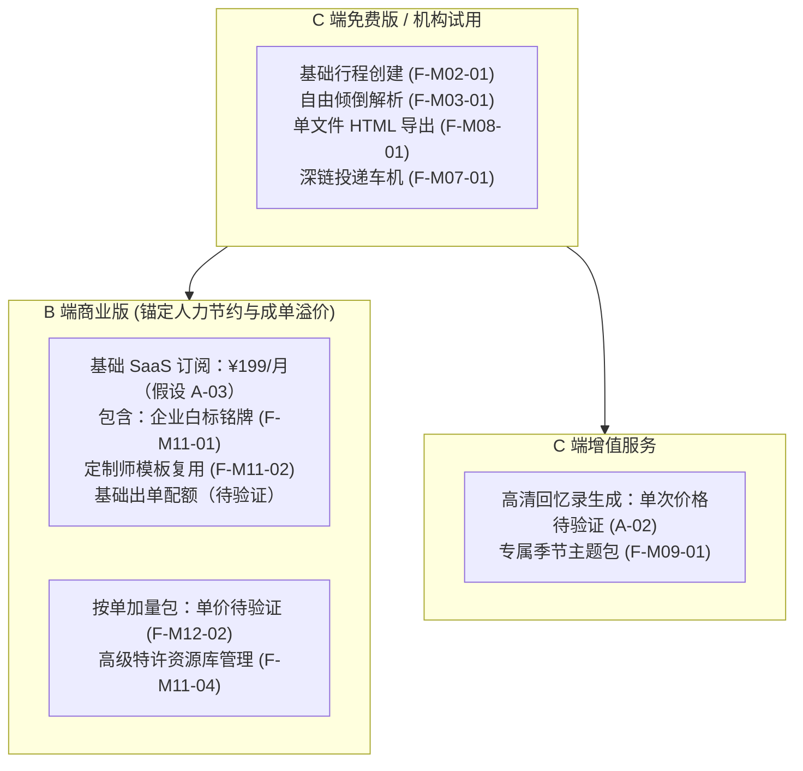
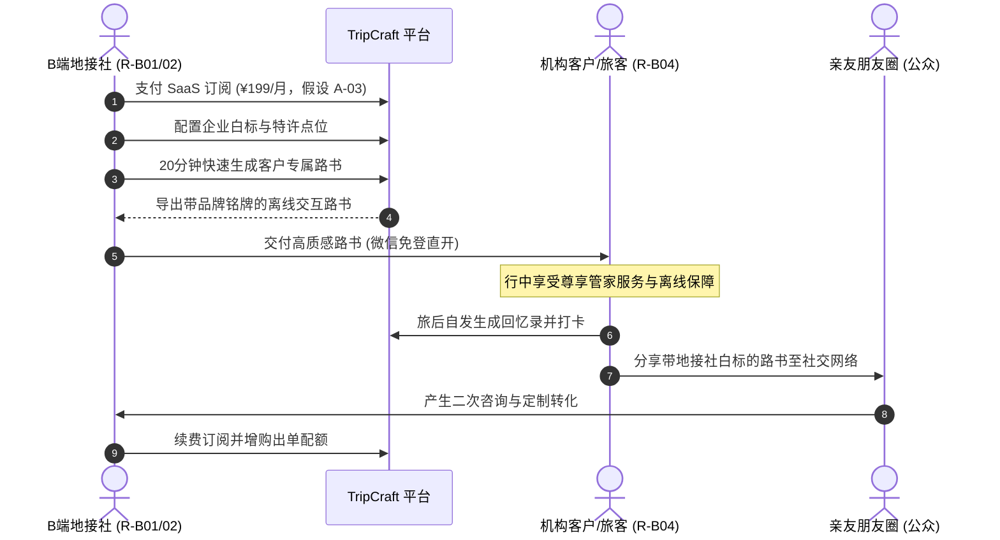

# PRD-05 · 商业模式与商业化设计

## 1. 收入来源体系 (Revenue Streams)

TripCraft 遵循 B2B2C 商业逻辑，以 B 端线下机构赋能为主线，C 端增值变现为长尾：

| 收入来源分类 | 具体收费项 | 付费主体 | 对应功能 ID | 业务成熟度 | 关联假设与依据 |
| :--- | :--- | :--- | :--- | :--- | :--- |
| **B 端：SaaS 订阅** | 机构月度/年度基础订阅费（含基础路书配额与白标铭牌） | 地接社 / 车队 | `F-M12-01`, `F-M11-01` | 假设 | [A-03 (¥199/月或按单)](../ASSUMPTIONS.md) ｜ [docs/03 §3.1](../03-b2b-agency-operations.md#31-为什么-b2b-才是真正的护城河) |
| **B 端：按单加量包** | 超出月度基础配额后的单次路书制作结算费 | 地接社 / 车队 | `F-M12-02`, `F-M11-02` | 假设 | [A-03](../ASSUMPTIONS.md) ｜ [docs/13 §13.9.2](../13-agency-partnership-design.md#1392-计费单位四个选项只有一个是对的) |
| **B 端：白标增值** | 自定义独立域名托管、专属 CSS 深度主题包定制 | 精品旅行社 | `F-M11-01`, `F-M09-01` | 假设 | [A-04](../ASSUMPTIONS.md) |
| **B 端：特许资源通道** | 机构私有特许点位与地面情报库高级检索/协同 | 机构会员 | `F-M11-04` | 假设 | [docs/13 §13.2](../13-agency-partnership-design.md) |
| **C 端：基础版免费** | 行程编辑、离线快照导出、高德/百度深链投递 | C 端组织者 | `F-M02-01`, `F-M07-01` | 无需验证 | 基础体验零门槛，驱动自驾社群口碑自传播 |
| **C 端：VIP 订阅** | 多设备云端无缝漫游、无限版本历史、专属主题 | C 端高频自驾者 | `F-M01-04`, `F-M09-01` | 待验证 | 价格待验证，避免过早向 C 端收门票 |
| **C 端：回忆录一次性服务**| AI 智能照片匹配与高清旅途视频生成导出 | 旅客个人 | `F-M10-02`, `F-M10-03` | 假设 | [A-02 (回忆录变现)](../ASSUMPTIONS.md) ｜ [docs/06](../06-memory-journal-engine.md) |
| **C 端：生态分销佣金** | 景点官方合规预约或第三方平台标准外链导流 | 第三方服务商 | `F-M05-01` | 假设 | [A-01 (OTA 外链 CPS)](../ASSUMPTIONS.md) ｜ 现阶段不设自营交易 |

---

## 2. 定价结构与功能分界 (Pricing Structure)

依据决策 D4，现有规划严格沿用仓库已有假设数字，其余数字一律标为“待验证”，坚决不编造数字：

### 功能分界原则
- **免费分界**：保障个人单次自驾出行的完整闭环（编辑、排程、离线导出、深链投递），杜绝在离线安全与基础可用性上设卡。
- **付费分界**：凡涉及“企业品牌露出、多人团队管理、私有资产复用、高级多媒体生成”，均归入付费体系。

---

## 3. B2B2C 价值流与闭环机制

---

## 4. 获客与首批切入策略 (GTM & Pilot Plan)

### 首批切入目标细分
- **目标对象**：川西、青甘、滇藏线等自驾重度区域的**精品定制地接社与专业车队**（规模 5–15 人，年服务客单价较高）。
- **选择理由**：该类小 B 定制师每天耗费 4–8 小时在 Word/Excel 上；对客交付物简陋直接影响报价溢价；且路线容易遇到封路，对离线容灾和动态补丁有刚性需求。

### 首批试点方案 (Pilot Program)
1. **试点规模**：定向邀请 3–5 家代表性地接社/车队深度共创（非公域招募）。
2. **切入抓手**：“两份路书并排”对比展示——将地接社原有 Word 行程单现场转译为 TripCraft 交互路书，直观呈现质感代差。
3. **试点成功标准（指标占位）**：
   - 定制师平均出单耗时从原有的 4 小时缩短至 ≤ 20 分钟；
   - 机构单月连续使用出单量达到设定阈值（待统计）；
   - 客户好评率与主动分享率显著改善。

---

## 5. 指标体系（建议北极星与核心运营指标）

> 标注：全部具体指标目标值均为 **`Proposed`（建议值）**，需依据首批试点实测校准。

### 建议北极星指标 (North Star Metric)
- **`Proposed` 核心指标**：**月度健康交付路书总数 (Monthly Healthy Roadbooks Delivered)** —— 定义为当月被成功导出为单文件 HTML 或被旅客实际在行中查阅的有效路书份数。

### 核心指标分解表

| 维度 | 指标名称 | 定义与统计方式 | 业务意义 |
| :--- | :--- | :--- | :--- |
| **B 端指标** | 活跃机构数 (MAU Org) | 当月至少导出或编辑 3 份路书的租户数 | 衡量 B 端留存与使用粘性 |
| | 定制师单单耗时 (Avg Creation Time) | 从新建到首次导出客户交付版本的时长 | 核心效能验证（目标 ≤ 20 min） |
| | 机构月交付量 (Trips per Org) | 平均每家机构月度生成的客户路书量 | 反映机构业务流转深度 |
| | 机构续费率 (Renewal Rate) | 订阅到期续费比例（待试点后测算） | B 端商业模式终极验证 |
| **C 端指标** | 离线单文件导出率 | 创建行程中点击导出 HTML 的比例 | 检验单文件交付主张的被接纳度 |
| | 行中离线查阅活跃度 | 无网络环境下打开本地路书的会话频次 | 检验离线容灾核心工程价值 |
| | 旅后分享率 | 完赛行程生成社交快照/海报的比例 | C 端自发口碑传播驱动器 |
| | 交付客户满意度 (NPS) | 旅客对路书阅读体验的主观评分 | 赋能小 B 的直接成果验证 |

---

## 6. 单位经济模型骨架 (Unit Economics Framework)

### 变量与参数定义
- **$ARPU_{B}$**：平均每机构月度收入（SaaS 订阅 ¥199 + 加量包消耗，待测算）。
- **$CAC_{B}$**：机构获客成本（主要为线下BD拜访与社群转化，待测算）。
- **$Churn_{B}$**：机构月度流失率（待测算）。
- **$LTV_{B}$**：机构客户终身价值，计算公式：$LTV = \frac{ARPU \times GrossMargin}{Churn}$。

### 成本驱动结构 (Cost Drivers)

| 成本要素 | 成本性质 | 驱动因子 | 敏感性与控制手段 |
| :--- | :--- | :--- | :--- |
| **地图/路线 API** | 可变成本 | POI 检索次数、驾车距离算路次数 | **极高**。通过严控静态 polyline 缓存策略、合并批量算路降低请求量 ([ADR-005](../architecture/adr/ADR-005-map-navigation-abstraction.md))。 |
| **对象存储与 CDN** | 可变成本 | 单文件快照托管大小、静态分享流量 | **中等**。严格单文件产物大小（≤2MB），剔除无效高清底图 ([ADR-006](../architecture/adr/ADR-006-snapshot-delivery-format.md))。 |
| **AI 语言模型推理** | 可变成本 | 澄清反问轮次、DSL 初稿生成 Prompt Token 数 | **中等**。将反问轮次严格限制在 ≤3 轮，避免无意义闲聊消耗。 |
| **短信与推送服务** | 可变成本 | 登录验证码条数、应急变更短信条数 | **低**。弱网优先局域网点对点二维码同步，减少非必要短信推送。 |
| **人工客服与审核** | 半固定成本 | 机构资质入驻审核量、客诉处理工单 | **低**。引入标准化文旅牌照 OCR 与自动查验工具。 |

### 敏感性与利润测算表
- **测算结论**：**待测算**（将在完成 3–5 家机构试点并获取真实 API 与云资源账单后回填）。

---

## 7. 行业竞争格局 (Competitive Landscape)

复用 [docs/13 §13.8 市场与竞争格局](../13-agency-partnership-design.md#138--市场与竞争格局为什么这件事还没被做掉) 已有事实分析：

| 参与方类型 | 典型代表 | 核心优势 | 为何未做好自驾深度路书交付 |
| :--- | :--- | :--- | :--- |
| **通用在线旅游平台 (OTA)** | 携程、去哪儿、飞猪 | 庞大公域流量、成熟酒旅票务交易闭环 | 商业模型高度依赖机票酒店交易佣金，定制自驾交付属于重服务、低毛利长尾，非其核心利益点。 |
| **内容与社区平台** | 小红书、马蜂窝、抖音 | 海量 UGC 游记与打卡笔记 | 强于灵感种草与单点展示，弱于多约束求解、离线容灾、座舱下发与团队协同等工程能力。 |
| **传统路线与地图工具** | 百度地图、高德地图、两步路 | 强大的底层测绘图资与导航算路能力 | 聚焦于点对点实时导航或专业户外轨迹打点，不具备面向自驾旅客的文化展卡编排与白标 B2B 赋能诉求。 |
| **通用办公工具** | 飞书、腾讯文档、Excel/Word | 协作极其灵活、上手零门槛 | 缺乏地理空间与开闭馆校验能力；无法直接投递座舱；断网环境下的单文件交互体验差。 |

---

## 8. 法律红线与经营风险管控

1. **旅行社经营资质红线**：
   - 平台严禁向个人或无资质机构提供组团收费、资金托管等经营便利，严格遵循 [docs/13 §13.5.4 资质红线](../13-agency-partnership-design.md#1354--一个必须先回答的问题他有资质吗) 设定的审核门槛。
2. **OTA 接口依赖与价格不确定性 ([A-01](../ASSUMPTIONS.md))**：
   - 目前不承诺自建 OTA 数据直连，所有票务与客房外链均标注第三方平台跳转说明。
3. **平台依赖与渠道封禁风险**：
   - 交付产物坚持单文件零依赖（HTML5 标准），不依赖特定应用商店审核，防范外链被封禁导致的系统瘫痪。
