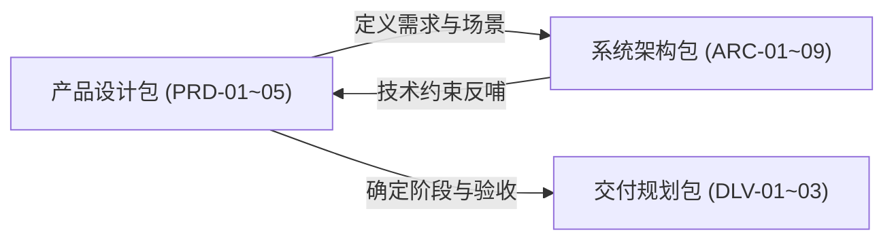

# TripCraft · 产品需求设计包 (Product Specification Package)

> 本目录归档 TripCraft 产品需求与业务架构设计文档（PRD-01 ~ PRD-05）。设计状态：`Draft（agent 起草，待 owner 评审）`。

---

## 1. 文档导航与索引

| 编号 | 文档标题 | 文件名 | 核心职责与关键输出 |
| :--- | :--- | :--- | :--- |
| **PRD-01** | 愿景、定位与能力边界 | [`PRD-01-vision-positioning.md`](PRD-01-vision-positioning.md) | 一句话定位、产品双轮驱动形态、8 行能力边界表与非目标规范。 |
| **PRD-02** | 用户与客户模型 | [`PRD-02-personas-segments.md`](PRD-02-personas-segments.md) | C/B 客户细分体系、10 大角色矩阵、虚构代表人物卡、B2B2C 价值流。 |
| **PRD-03** | 业务与使用场景 | [`PRD-03-scenarios.md`](PRD-03-scenarios.md) | 全生命周期总图、14 个标准化端到端场景（S-C01~C07, S-B01~B05, S-P01, S-O01）。 |
| **PRD-04** | 功能架构与功能规格 | [`PRD-04-functional-architecture.md`](PRD-04-functional-architecture.md) | 功能全景脑图（M01~M14）、P0~P2 优先级、全量 P0 功能验收卡（Given/When/Then）。 |
| **PRD-05** | 商业模式与商业化设计 | [`PRD-05-business-model.md`](PRD-05-business-model.md) | 收入来源表、定价结构、3–5 家机构首批试点方案、北极星与单位经济模型骨架。 |

---

## 2. 与系统架构及交付层的关联

- **架构承接**：PRD-04 中各模块功能直接对应系统架构 [`ARC-05`](../architecture/ARC-05-backend-integrations.md) 的后端逻辑模块 (`S-*`) 与客户端载体 (`C-*`)。
- **交付落地**：所有 P0 功能直接纳入 [`DLV-01`](../delivery/DLV-01-roadmap-mvp.md) 阶段 1（MVP）范围，由 [`DLV-03`](../delivery/DLV-03-traceability-matrix.md) 追溯矩阵闭环验证。
